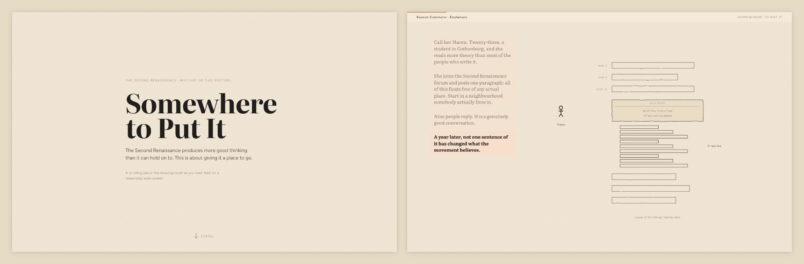
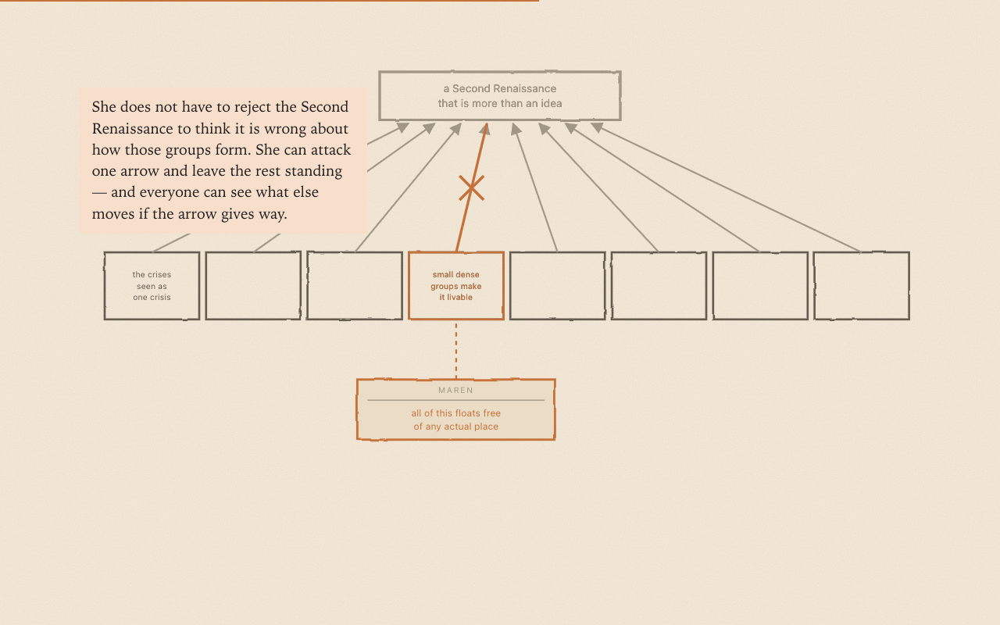
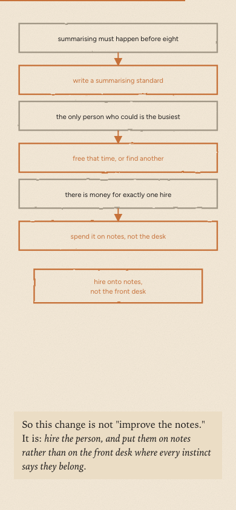

# Changelog

Notable changes to this project. Not strictly [Keep a Changelog](https://keepachangelog.com/)
format, but same spirit — human-readable, most recent first.

## 2026-08-21 — A talk that performs the method

A presentation deck at `talk/index.html`, built so the audience experiences the
Logical Thinking Process before hearing its name. Five acts, each opening on an
audience-facing question rather than an artefact: why good conversations go
nowhere, what better would look like, the conflict in the way, what changes if it
dissolves, and what to do next. The LTP names are withheld until the fifth act,
where a ledger maps each act back to the tree that produced it and the deck
becomes evidence for its own argument.

An unlabelled five-node spine advances act by act in the corner, so the room
registers structure without being told what it is; on the reveal slide the same
spine fills in with current reality, goal, conflict, future reality, next steps.
The visual system carries the act-three tension directly — loose italic
conversation at the edges, a hairline reasoning graph drawing itself, one amber
node for whatever was newly contributed.

Single self-contained file, fixed 1920x1080 stage that letterboxes rather than
reflowing, arrow-key and swipe navigation, `#n` deep links, and inline text
editing behind the `E` key.

## 2026-08-21 — A way in to every explainer

All five scrolling explainers now open on a landing — a title, a scroll cue and a thin bar back to the rest of the site — instead of dropping the reader inside a pinned drawing with no headline and no sign that the page moves. They also respond faster: the second beat of a section used to take a screen and a half of scrolling and now arrives in under half a screen. In [Somewhere to Put It](explainers/second-renaissance/index.html), Maren's story stacks down the left of the drawing rather than each beat wiping out the last — or start at [The Wrong Queue](explainers/01-bottleneck/index.html), which is the way into [the series](explainers/index.html).

## 2026-08-16 — Somewhere to Put It

A fourth scrolling explainer, and the first that applies the method to a real
problem rather than an invented clinic. Somebody posts the best paragraph they
have written in a year to the Second Renaissance forum, nine people reply, and a
year later nothing they said has changed what the project believes — not for want
of intelligence or goodwill, but because there is nowhere to put a good thought.
The piece is the case for giving every claim in the project's strategy an address,
and for letting a machine do the filing so that contributing costs one sentence
rather than five diagrams. It is a sibling to the trilogy, not a part four —
someone handed only this link, with no series behind them, still gets a complete
read. Every diagram comes from the group's actual five trees.

An earlier version of this piece, *Whose Map Is It*, retold a single internal
argument about the word "throughput". It was replaced as the way in — it assumed a
reader already inside the trees — but it goes somewhere the accessible version
deliberately does not, so it now stands on its own at
[`explainers/whose-map-is-it/`](explainers/whose-map-is-it/index.html) as the
deeper cut, linked from the series index and from *Somewhere to Put It*.

All four explainers also had their running text reset — larger, at the size of the
annotations inside the drawings rather than a size below them, and in Literata, so
prose and graphics read as one voice and the page looks the same on every machine
instead of picking a different serif on each.

## 2026-08-16 — The explainer trilogy, finished

Drove all three explainers in a real browser and fixed what only shows up there —
captions sitting on top of the very thing they were pointing at, boxes falling off
the edge of their own drawing, a chain of arrows that read as a tangle. Parts two and
three now have portrait layouts to match part one, so the diagrams are readable on a
phone instead of shrinking to a ribbon, and the series finally uses the real Organic
colours and Figtree rather than a palette that was merely close.

## 2026-08-16 — Repo gardening

Rebranded to Reason Commons, turned the README into a real landing page, and tidied
the explainers folder and docs — no new content, but the site now reads as a
finished project rather than a workspace. Also fixed the diagrams in *The Wrong
Queue*, which had been rendering as raw markup instead of pictures.

## 2026-08-15 — Explainer trilogy: drafted, built, and shipped in two formats

Three-part LTP explainer series in `explainers/`, replacing the earlier single `story/`
piece as the project's introductory narrative. Each piece went through a script pass
(draft → self-critique → independent fresh-agent critique with no authorship context →
revision), then a visual build.

- Added `skills/scrollable-explainer/` — general-purpose write-up of the scroll-driven
  ("scrollytelling") explainer form, with a full measured teardown of a ProPublica piece
  as the worked case study.
- Wrote and built three pieces: **The Wrong Queue** (`01-bottleneck`), **The Arrows
  Nobody Checks** (`02-thinking-made-visible`), **Five Shapes** (`03-five-shapes`).
- Each part now ships in two forms from the same finalized prose:
  - `article.md` — static markdown with inline SVG figures, no `<script>` (matches the
    `story/draft.md` convention)
  - `index.html` — scroll-driven animated version, via shared `explainers/scroller.js` /
    `scroller.css`
- `explainers/index.html` lists both formats per part.
- Mobile portrait layout for piece 1's five-station diagram (pieces 2–3 still pending).
- `explainers/NEXT.md` — checkpoint with open questions and a prioritized follow-up list.
  Tracked in [issue #6](https://github.com/life-itself/reasoncommons/issues/6).

Known gaps: pieces 2–3 need the same mobile pass as piece 1; piece 3's HTML page
renders empty with JavaScript disabled; the scroller uses an ad hoc palette rather than
the real Organic design tokens; `story/`'s fate is undecided.
