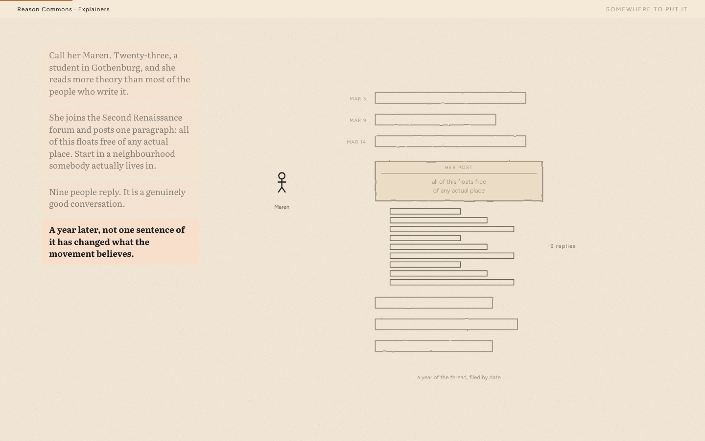

# Changelog

Notable changes to this project. Not strictly [Keep a Changelog](https://keepachangelog.com/)
format, but same spirit — human-readable, most recent first.

## 2026-08-20 — A way in, and a story that stays on screen

*Somewhere to Put It* now opens on a title screen that says what it is and points down, instead of dropping the reader straight into a pinned drawing with no headline and no sign that scrolling is the interaction. People were landing on it and leaving without scrolling. Maren's story moves down to follow the framing, and her four beats now stack down the left of the drawing rather than each one wiping out the last, so the sequence stays readable as it builds. A thin bar appears once the title screen has gone, with a way back to the rest of the site.

*The Wrong Queue* keeps its opening — a drawn clinic with a queue out of the door is a better landing than any title card, so it gets no hero — but it now carries the same bar, saying which part of three it is, and a scroll cue at the foot of the first screen that retires itself once you have scrolled. A piece that lands you on a drawing still has to tell you that it moves.

*The Arrows Nobody Checks* had the worst landing of the five — a lone box reading "countersignature required" on an otherwise empty screen, beside a sentence about a doctor and a clinic that only part one introduces. It now opens on its title, with a line saying where the clinic comes from and a link to part one, and the chain of reasoning follows. Its five beats deliberately do *not* stack: the drawing already piles its boxes up and keeps them, so the sequence is on screen either way.

*Five Shapes* and *Whose Map Is It* got the same landing, each with a line saying which pieces they follow from and a link to them, so all five now open on a title, a bar and an arrow. Tidying *Whose Map Is It* also turned up four places where a caption had been sitting on top of the thing it was describing — three long ones at the left of the frame that grew up into the diagram, and a full-screen statement landing across the row of trees. They now sit at the foot of the frame, and the statement takes the paper as its ground.

Every explainer also got faster to respond. The second beat of each section used to need a screen and a half of scrolling before anything moved; it now arrives in under half a screen, and the last beat of a section holds twice as long before it slides away.

## 2026-08-16 — Somewhere to Put It

A fourth scrolling explainer, and the first that applies the method to a real
problem rather than an invented clinic. Somebody posts the best paragraph they
have written in a year to the Second Renaissance forum, nine people reply, and a
year later nothing they said has changed what the project believes — not for want
of intelligence or goodwill, but because there is nowhere to put a good thought.
The piece is the case for giving every claim in the project's strategy an address,
and for letting a machine do the filing so that contributing costs one sentence
rather than five diagrams. It is a sibling to the trilogy, not a part four —
someone handed only this link, with no series behind them, still gets a complete
read. Every diagram comes from the group's actual five trees.

An earlier version of this piece, *Whose Map Is It*, retold a single internal
argument about the word "throughput". It was replaced as the way in — it assumed a
reader already inside the trees — but it goes somewhere the accessible version
deliberately does not, so it now stands on its own at
[`explainers/whose-map-is-it/`](explainers/whose-map-is-it/index.html) as the
deeper cut, linked from the series index and from *Somewhere to Put It*.

All four explainers also had their running text reset — larger, at the size of the
annotations inside the drawings rather than a size below them, and in Literata, so
prose and graphics read as one voice and the page looks the same on every machine
instead of picking a different serif on each.

## 2026-08-16 — The explainer trilogy, finished

Drove all three explainers in a real browser and fixed what only shows up there —
captions sitting on top of the very thing they were pointing at, boxes falling off
the edge of their own drawing, a chain of arrows that read as a tangle. Parts two and
three now have portrait layouts to match part one, so the diagrams are readable on a
phone instead of shrinking to a ribbon, and the series finally uses the real Organic
colours and Figtree rather than a palette that was merely close.

## 2026-08-16 — Repo gardening

Rebranded to Reason Commons, turned the README into a real landing page, and tidied
the explainers folder and docs — no new content, but the site now reads as a
finished project rather than a workspace. Also fixed the diagrams in *The Wrong
Queue*, which had been rendering as raw markup instead of pictures.

## 2026-08-15 — Explainer trilogy: drafted, built, and shipped in two formats

Three-part LTP explainer series in `explainers/`, replacing the earlier single `story/`
piece as the project's introductory narrative. Each piece went through a script pass
(draft → self-critique → independent fresh-agent critique with no authorship context →
revision), then a visual build.

- Added `skills/scrollable-explainer/` — general-purpose write-up of the scroll-driven
  ("scrollytelling") explainer form, with a full measured teardown of a ProPublica piece
  as the worked case study.
- Wrote and built three pieces: **The Wrong Queue** (`01-bottleneck`), **The Arrows
  Nobody Checks** (`02-thinking-made-visible`), **Five Shapes** (`03-five-shapes`).
- Each part now ships in two forms from the same finalized prose:
  - `article.md` — static markdown with inline SVG figures, no `<script>` (matches the
    `story/draft.md` convention)
  - `index.html` — scroll-driven animated version, via shared `explainers/scroller.js` /
    `scroller.css`
- `explainers/index.html` lists both formats per part.
- Mobile portrait layout for piece 1's five-station diagram (pieces 2–3 still pending).
- `explainers/NEXT.md` — checkpoint with open questions and a prioritized follow-up list.
  Tracked in [issue #6](https://github.com/life-itself/reasoncommons/issues/6).

Known gaps: pieces 2–3 need the same mobile pass as piece 1; piece 3's HTML page
renders empty with JavaScript disabled; the scroller uses an ad hoc palette rather than
the real Organic design tokens; `story/`'s fate is undecided.
