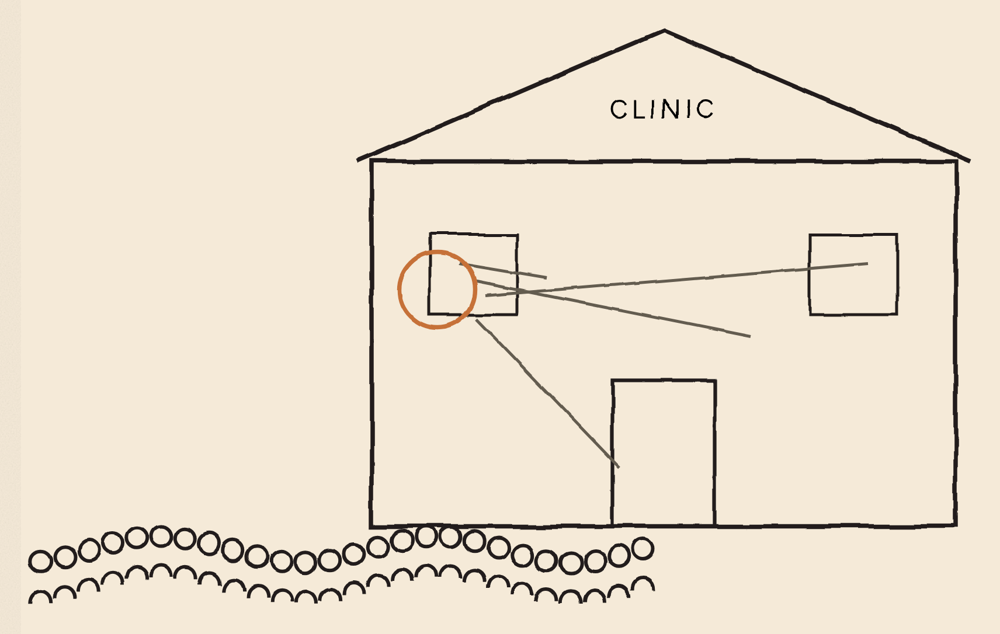
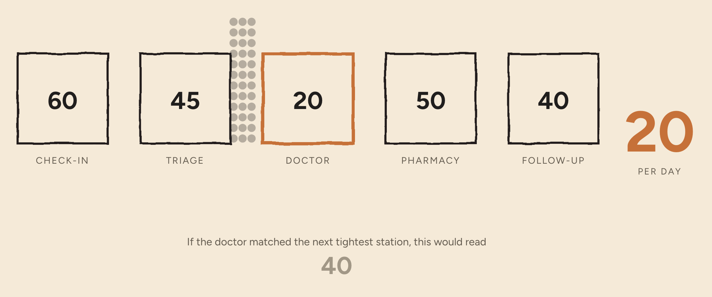
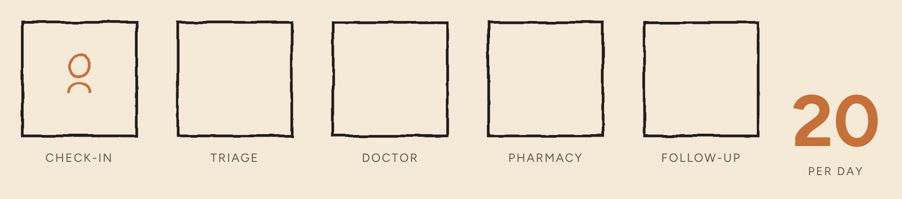
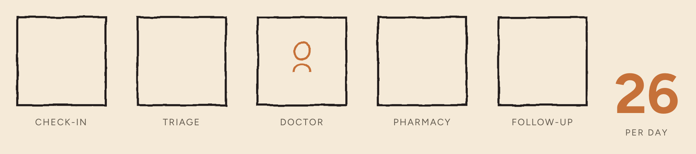
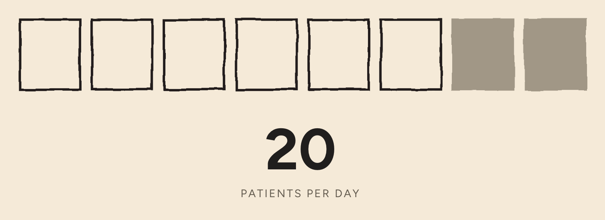
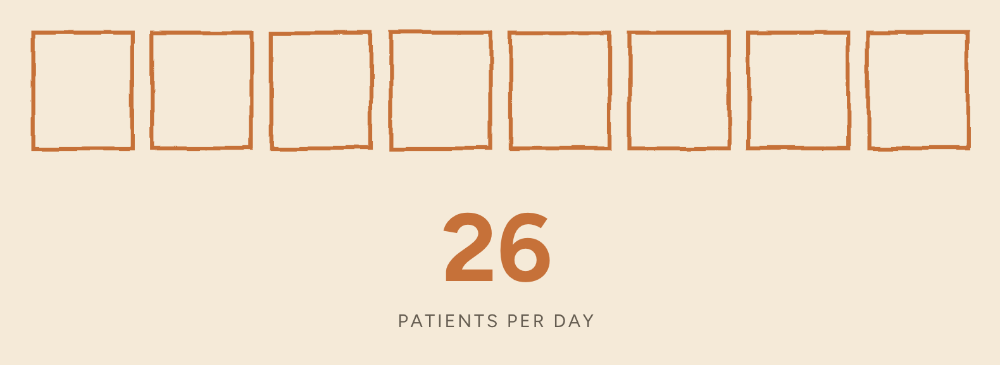
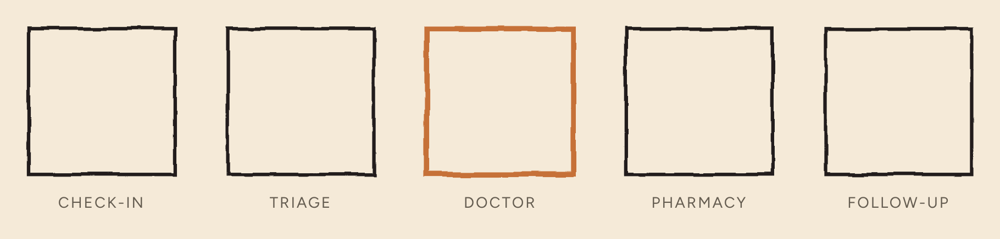
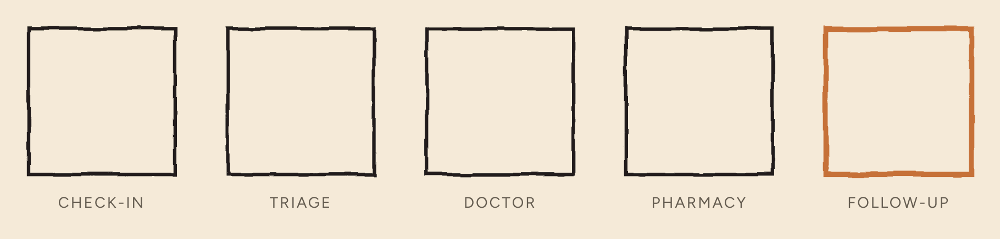
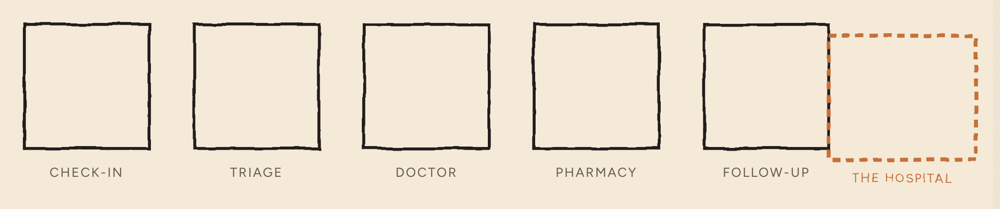
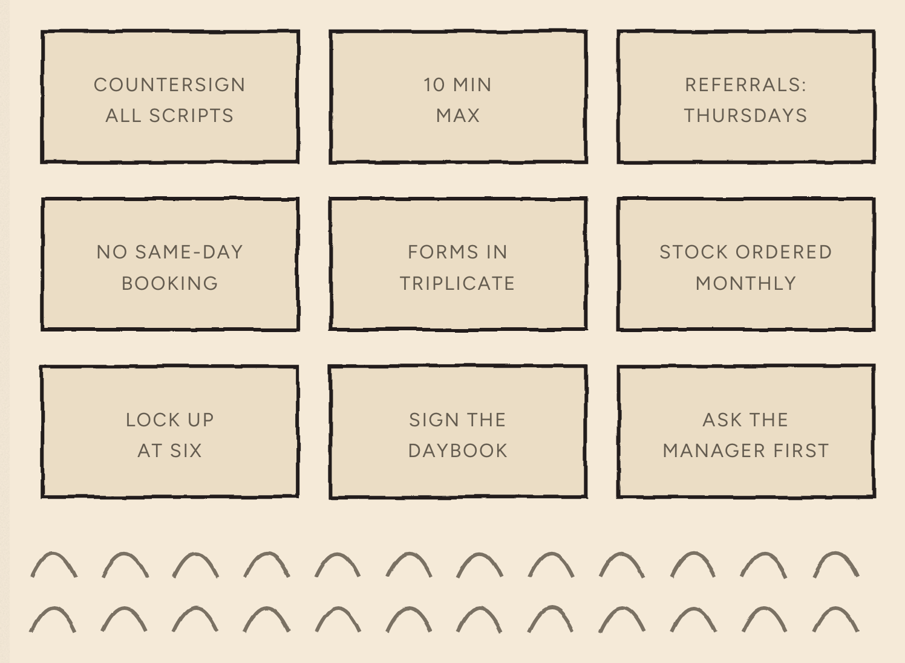

*A plain, non-scrolling version of **[The Wrong Queue](../01-bottleneck/index.html)** — the same words, with the drawings held still instead of built on scroll. Part one of the series; [see all three parts](../).*

## The Wrong Queue

A clinic opens at eight. By noon, sixty people are waiting.

Everyone who works there can tell you exactly where the problem is. They are all pointing at the same desk.

They are all wrong.

*Everybody points at the front desk — the window with the visible queue in front of it.*

---

Maria runs the front desk. She works through lunch most days. The phone starts before the lights are on and there is a queue at her window from opening until close. When patients write in to complain, and they do, they complain about her desk.

She is, visibly and unarguably, the hardest-working person in the building.

She is also irrelevant to how many people this clinic helps.

It treats twenty patients a day. It has treated twenty patients a day for four years.

*Every other station can handle at least twice what the doctor can — so the clinic treats twenty a day. Not forty, which is what it would manage if the doctor's station matched the next tightest one. Twenty.*

The other forty go home.

One of them is a man in his sixties who has now come twice about a cough he has had since March. He waited three hours on Tuesday and left at four to collect his grandson. He will try again next week.

Multiply him. Forty people a day, five days a week — something like **ten thousand people a year** who came to a clinic where everybody was working flat out, and did not get seen.

### Where do you put the one hire?

The clinic has just been given enough money to hire one more person.

Put them on the front desk, where the queue is: still twenty. Put them on triage: still twenty. Pharmacy: twenty. Follow-up: twenty.

*A second pair of hands at check-in. Output: still twenty.*

*The same hire, placed on the one station that governs the number. Output moves.*

There is exactly one place that changes the number, and it is not where the queue is.

Hire at the front desk and check-in gets faster, so patients reach the waiting room sooner. You will have spent the entire budget to make people frustrated sitting down instead of standing up.

Maria was never the problem. She was busy absorbing the anger that something else was generating.

> Busy is not the same as stuck.

The station that sets the number — the one every other station is waiting on, whether it knows it or not — has a name. It is the **constraint**. Every system has one. Almost no system knows where its own is.

### Everybody's busy

Every single person in an organisation is working flat out, all day. Is that organisation running at its best?

Almost everyone says yes.

But look at what full effort at the front desk actually produces. Sixty people checked in, against twenty the doctor can see. The other forty do not vanish. They sit in the waiting room — and a waiting room is not output. It is forty afternoons, spent.

A station that isn't the constraint, running at maximum, manufactures work the constraint cannot absorb. In a factory that work is inventory, stacked and going stale. Here it is people.

So a well-run system needs most of its parts to have slack — deliberately running below their maximum — so the one part that governs everything can run flat out.

When everybody is at full stretch, the honest reading is not that the place is well run. It is that nobody has found the constraint, so everyone is compensating for it at once.

### Don't spend the money yet

We know it is the doctor. So hire another doctor.

Not yet. Watch her day first.

Dr Adeyemi has been here nine years. She stays until seven most evenings writing up notes she had no time to write in the room.

*Of her eight-hour day, six hours are clinical. The other two go on things that do not need a medical degree.*

*Give back the two admin hours at the same rate and the same day yields twenty-six — for nothing.*

Six more people a day. Around fifteen hundred a year. The man with the cough is one of them. The cost of this is nothing.

That is the step almost everyone skips — and it is the same move as the hiring decision, made smaller. You are not adding capacity to the system. You are moving capacity *toward the constraint*. It just happens that the cheapest place to find some was already inside it.

The next step is harder, because it looks like failure. Everyone else now runs at whatever pace keeps Dr Adeyemi working. Reception deliberately slows down. Every local number you have will show those people getting worse while the clinic gets better. If you cannot tolerate that on a dashboard, none of this is available to you.

Only then do you spend money — and you spend it on the doctor, not on the loudest queue.

### The same shape, elsewhere

Now, a clinic is a tidy example: five stations, one line, one direction. Almost no real work looks like that. There are loops and parallel paths and jobs that come back half-finished, and you cannot draw most organisations as a row of boxes.

The messiness changes the arithmetic. It does not change the property underneath it. In anything where the parts depend on each other, a very small number of places govern what the whole thing produces — and they are almost never where the noise is.

A parent getting older. There are a dozen things to worry about — the stairs, the medication, the driving, whether the money lasts — and you are working on all of them, badly, in the evenings, and getting nowhere. It feels like there is simply too much.

There isn't. There is one thing. The assessment that unlocks the funding that pays for the help, and it needs a referral nobody has requested, and until that happens every other thing you do gets undone by Wednesday.

It is not the biggest problem on the list. It is the stuck one. You can work extremely hard on a system for years without ever once touching the thing that governs it.

### It moves

Fix the doctor and the clinic does not become fixed.

*Start: the doctor sets the number.*

*Raise the doctor's throughput and follow-up booking, at forty, becomes the tightest station.*

*Push far enough and every station inside the building outruns its demand — and the constraint has moved outside the walls.*

Get her to fifty a day and follow-up booking, at forty, becomes the constraint. Fix that and it moves to pharmacy. Push far enough and every station inside the building outruns the number of people it serves — at which point the constraint has moved outside the walls, to the hospital that won't take referrals any faster.

It is still a constraint. It just now needs an entirely different set of skills to attack.

Which is why this work never finishes, and why the most expensive sentence anyone in that clinic can say is *we solved that one*.

### Invisible rules

All of this was easy. Five boxes, five numbers, find the smallest.

Real organisations do not hand you the numbers. And the constraint is usually not a person or a machine at all. It is a rule.

*Every prescription needs the doctor's countersignature. No appointment longer than ten minutes. Referrals are reviewed on Thursdays.*

*Every rule was installed for a good reason, usually to solve a problem nobody now remembers. Organisations accumulate procedures the way a reef accumulates coral — laid down in layers, each for a purpose, long after the purpose has gone.*

Breaking one is nearly free. A rule costs nothing to change, next to hiring a doctor. And it usually improves things more than any purchase would.

But you will not find it, because everybody experiences it as normal. A bottleneck machine announces itself: there is a pile of work in front of it. A bottleneck rule has no pile. It hides inside *that's just how it's done*, and it is defended, sincerely, by good people whose own numbers depend on it.

### So how would you ever find one?

So: find the constraint. Put nearly everything into it. Ignore, for now, almost everything else.

But the constraint is usually a rule. Rules are invisible. They look normal. They are defended in good faith by people who are not wrong to defend them.

And they connect to the symptoms you can actually see through long chains of cause and effect that cross every boundary on the org chart.

So how would you ever find one?

Ask five colleagues what the most limiting thing about your organisation is. You will get five confident, different answers.

On what basis do you decide who is right? Seniority? Confidence? Volume?

Most organisations settle it with some blend of authority, anecdote and whoever tells the best story — which is to say they don't settle it.

**They guess.**

Then they spend a year, a budget and a great deal of everyone's goodwill finding out whether the guess was right.

That is not a management problem. It is a thinking problem — which is a more hopeful thing to be, because thinking problems have techniques. This one has had a technique for forty years. Hardly anybody is taught it.

And so, somewhere in that building, someone is working through lunch on something that was never going to matter.

---

**Next → [The Arrows Nobody Checks](../02-thinking-made-visible/index.html)**
*Why you would ever draw your reasoning as a tree — and what happens to an argument when you do.*

## Methodology

Built from H. William Dettmer, *The Logical Thinking Process: A Systems Approach to Complex Problem Solving* (ASQ Quality Press, 2007), chapter 1, and behind it Eliyahu Goldratt's Theory of Constraints, set out in *The Goal* (1984). The chain-and-weakest-link argument, the claim that a system performing at its best cannot have all its parts performing at theirs, the five focusing steps (identify, exploit, subordinate, elevate, repeat), and the observation that most constraints are policies rather than physical things are all Dettmer's, from that chapter.

The Ashfield clinic is a composite and its numbers are illustrative, chosen so the arithmetic can be checked: five stations at 60, 45, 20, 50 and 40 patients a day; output is set by the smallest, and the next-tightest is 40. Dr Adeyemi's day is eight hours, six of them clinical, twenty patients — a shade under eighteen minutes each; returning the two administrative hours at the same rate gives twenty-six.

Dettmer's own worked example of a non-profit system is, as it happens, a hospital: people in, healthier people out. The coral-reef image is adapted from John Gardner, quoted in the same chapter.

The drawings on this page are stills captured from the scrolling version, where they are built up a step at a time.
