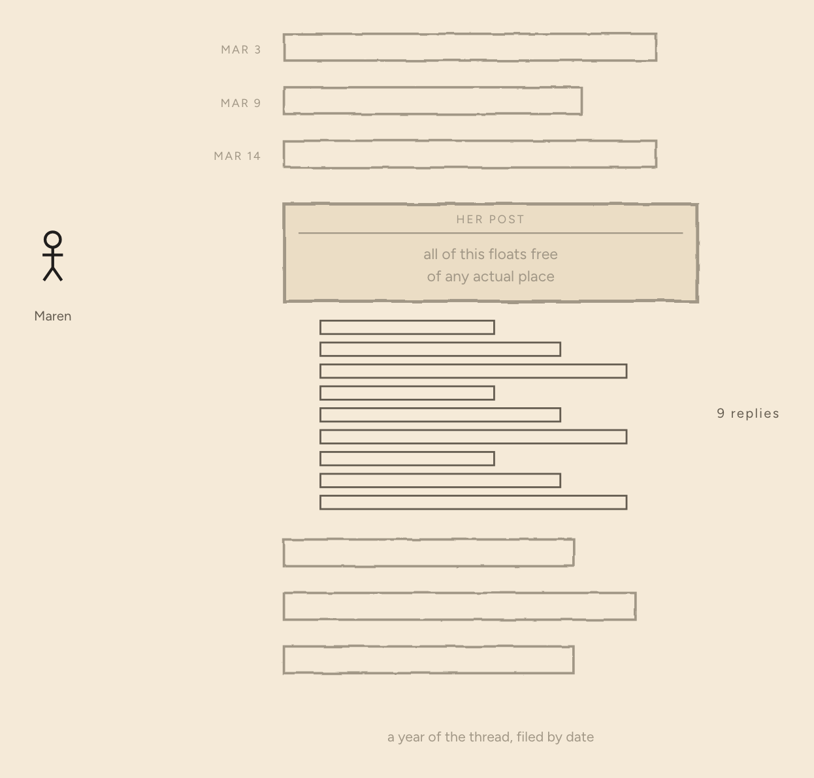
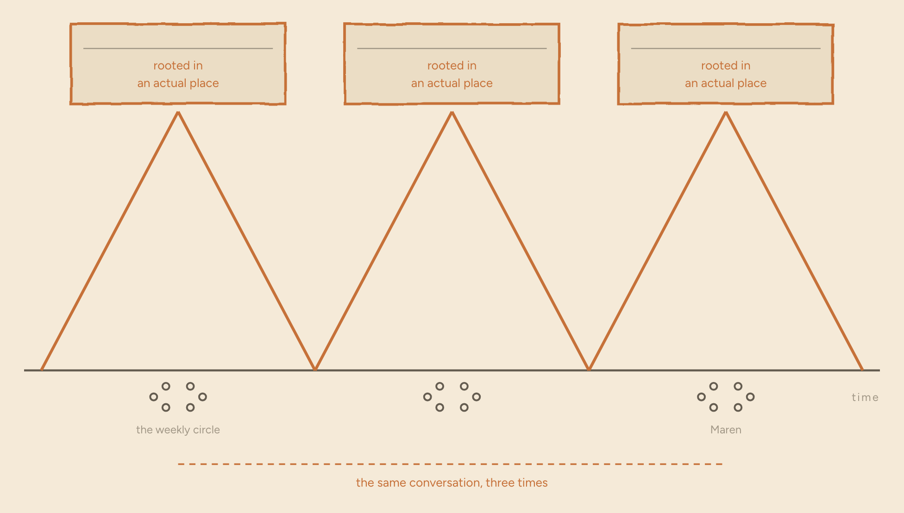
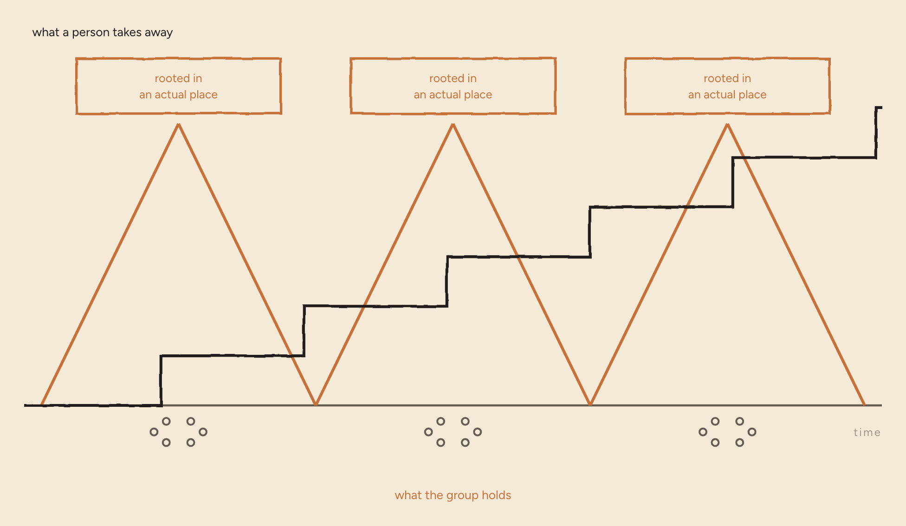
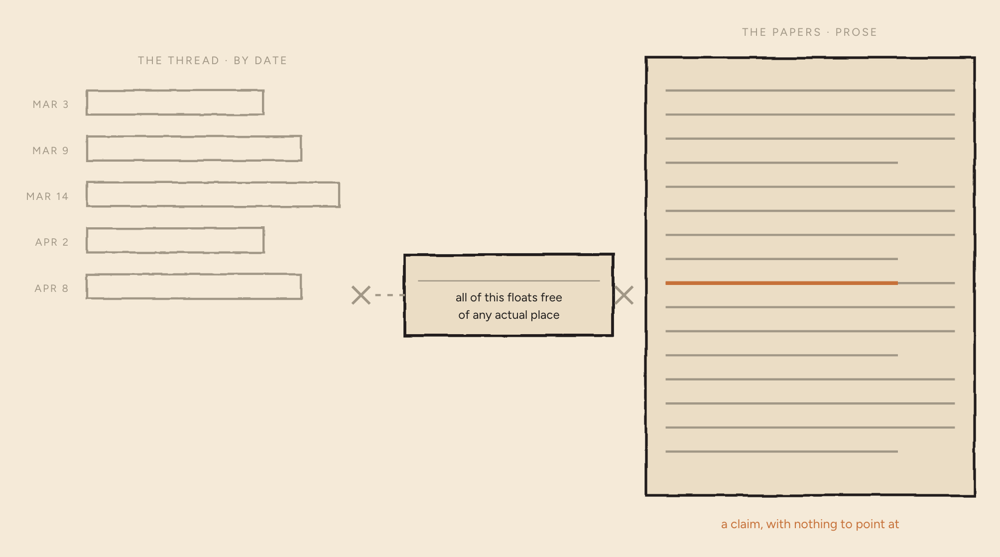
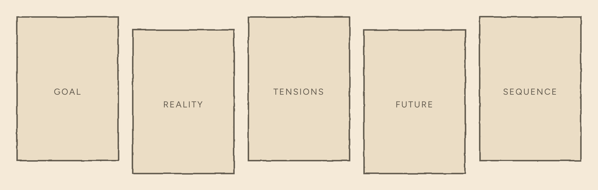
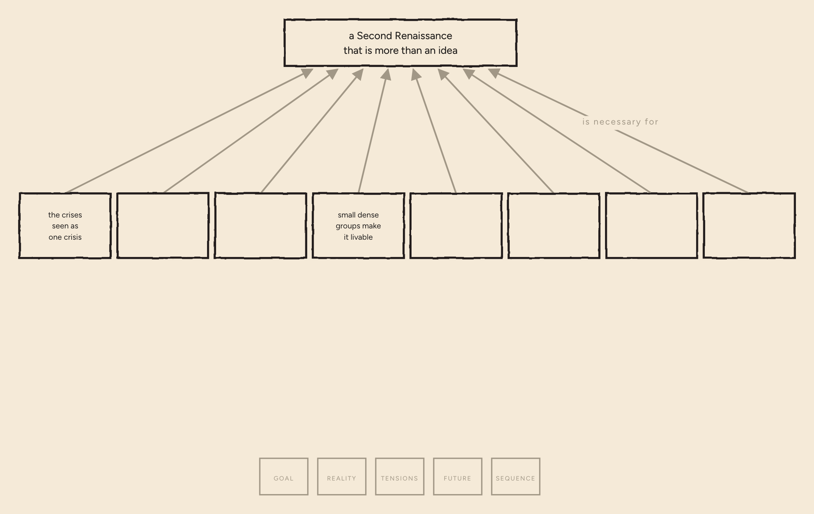
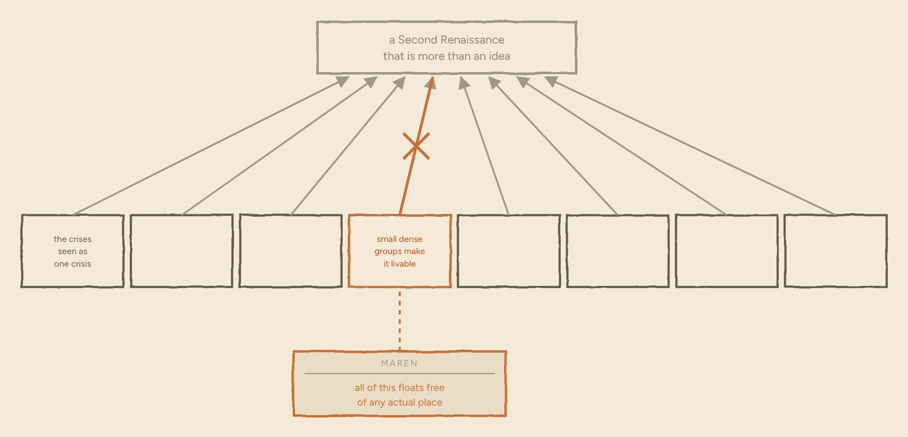
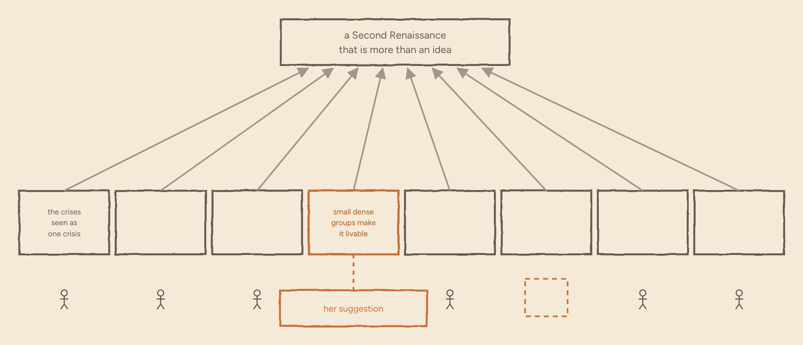

*A plain, non-scrolling version of **[The Forum Doesn't Remember, and Doesn't Cumulate](../second-renaissance/index.html)** — the same words, with the drawings held still instead of built on scroll. Every diagram comes from the Second Renaissance's own analysis. Readable on its own; the method behind it is covered in [the series](../).*

The Second Renaissance is a movement for civilizational renewal. Its claim is that our crises are not separate cracks but symptoms of a paradigm in decline, and that a wiser one has to be consciously built rather than waited for.

Many people are showing up to help. And while there is a solid vision and a theory of change behind it, there is a great deal still to refine and evolve. It is supposed to get better as more people work on it. But everything the movement holds in common is either a document somebody wrote or a conversation somebody remembers.

That is a shortage of a particular kind. Not of intelligence, or of goodwill, or of ideas.

**A shortage of a way to integrate them.**

---

Call her Maren. Twenty-three, a student in Gothenburg, and she reads more theory than most of the people who write it.

She joins the Second Renaissance forum and posts one paragraph: all of this floats free of any actual place. Start in a neighbourhood somebody actually lives in.

Nine people reply. It is a genuinely good conversation.

*Her post arrives in the thread, and gathers nine replies.*

*A year later, not one sentence of it has changed what the movement believes.*

### The same conversation, three times

Her suggestion — start somewhere real, with the people who actually live there — was not new.

A research circle meets every week, and twice in three years it has arrived at the same point on its own. Both times the room agreed.

Both times, two weeks later, the agreement had nobody's name on it and nothing had changed. Months later it came round again from the beginning, because the conditions that produced it were exactly where they had been.

Anyone who has been around this movement more than a year has had that conversation three times.

*The same insight, reached and lost, reached and lost.*

### What compounds, and what doesn't

It would be easy to call that a failure of follow-through, and it isn't.

The people in the room learned something and kept it. They are better at this than they were three years ago. Individual understanding compounds — twenty years of anyone's students will show you that.

What does not compound is the group's version. That has nowhere to live except in the people who were in the room, and people leave rooms.

*One line climbs and holds. The other keeps returning to zero.*

**Agreement that survives only in the people who were present is a rumour.**

### No address

So where was Maren's paragraph supposed to go?

The thread is filed by the day it was posted. Nothing in it is filed by what it is about.

The papers are prose, and a claim in the middle of a paragraph has no address. You cannot point at it. If you cannot point at it, you cannot object to it precisely — and a vague objection to a long document is one nobody can act on, so in the end nobody makes it.

Which means the most valuable thing a newcomer brings, a precise disagreement, is the thing the movement is least able to receive.

*Two filing systems, neither of which has a slot for a single precise claim.*

### Five linked diagrams

Earlier this year it tried something about that.

It took its own written corpus and rewrote the strategy as five linked diagrams: the goal and what it depends on, what is blocking it now, the tensions underneath that, the future being aimed at, and the order things have to happen in.

*The written corpus, sorted into five kinds of question.*

The point is not that they are diagrams. It is that every claim has an address, and the lines between claims are claims too — *this one is necessary for that one* — so the reasoning is exposed and not only the conclusions.

Eight things have to be true at once for a Second Renaissance to be more than an idea. People have to understand the crises as one crisis. Small dense groups have to make the new way of living actually livable. Six more like that, up through institutions and the wise navigation of collapse.

*Redrawn as a map where every claim — and every link between claims — is a thing you can point at.*

*The method behind the five shapes is forty years old and was invented for factories. A companion piece, [Five Shapes](../03-five-shapes/index.html), covers it properly. Nothing here depends on it.*

### A destination for the disagreement

Maren's suggestion now has a destination. Rooted in an actual place is not a mood she shares with the movement; it is a condition sitting under one of those eight, and if it is missing, it is missing at a spot you can put your finger on.

And her disagreement gets smaller as it gets sharper. She does not have to reject the whole thing to think it is wrong about how those small dense groups form. She can attack one arrow and leave the rest standing.

*Her paragraph lands on one condition. Her objection is now to one link, not to the whole strategy.*

### The stack

Now ask what it actually takes, today, to move a single claim on those maps.

Read five diagrams. Learn a grammar — what makes a cause sufficient, what makes a condition necessary, how to raise a reservation properly. Find your point among a hundred boxes. Then defend it to the people who drew them.

Every one of those steps is reasonable. The stack is fatal.

The maps fix the forum's problem by importing a worse one. They ask the person contributing to do the filing, and Maren is not going to do the filing. She has a dissertation to write.

The movement's own list of symptoms already has the line for it: *many people resonate with the ideas; few enter sustained practice.*

*Four reasonable requirements between a newcomer and the map. Most people stop at the bottom.*

### The conflict underneath

Underneath sits a conflict that every community which gives itself structure meets eventually.

Some people want the focus — the clarity, the sense that effort is finally adding up. Others want the conversation exactly as it is, spontaneous and relational, and are rightly suspicious of anything that interrupts a good exchange in order to file it.

Both wants serve real needs, and both needs serve the same goal. So the move is not to pick a side. It is to find the assumption that makes them look opposed, write it down, and check whether it is true.

Here it is. *Structure has to be added by the contributor, at the moment of contributing.*

That is the only thing holding the conflict together, and it is not true.

*The two sides want different actions but the same outcome. One shared assumption is what makes the actions look incompatible.*

### Separate the acts

Let the conversation be a conversation. Nothing interrupts it. Maren posts her paragraph where she was going to post it anyway.

Afterwards a machine reads the thread against the maps and proposes addresses: this sentence supports that condition, this one challenges that arrow, this one is a claim the maps have nowhere to put yet.

A rotating handful of people decide what actually merges, because one person quietly deciding what the map says is how you end up with a map nobody trusts.

The cost of contributing falls back to one sentence, said where you were already saying it. The filing is somebody's job, and it is not the contributor's.

*Contributing and filing are pulled apart: she talks, the machine proposes, a small group decides, and her sentence lands at an address she can find again.*

Then the thread is doing two things at once. It is still a conversation. It is also how the thinking changes.

Maren's sentence ends up hanging off the claim about small dense groups as a standing suggestion with her name on it. She has not joined a committee or learned a notation. She has changed what the movement believes, at an address anyone can find.

### Both directions

And the map reads in both directions. The eight conditions that tell her where her suggestion belongs tell everybody else which of the eight nobody is currently holding.

*The same structure that routes a newcomer's paragraph also shows the movement where its attention isn't.*

---

None of this is finished. The maps are provisional and wrong in several places. The machine that reads the threads is a prototype. The rules for merging are three sentences long and have never been tested by anyone annoyed.

The maps are public anyway.

Find the claim you disagree with. Or find the one nobody is standing under.

**The Second Renaissance has never been short of thinking.**

**It has been short of a way to integrate it.**

## Sources and method

The five trees — goal, current reality, conflict resolution, future reality, prerequisite — exist as written documents and are the source of every diagram in this piece; nothing here is an invented illustration. The eight conditions are the critical success factors of the goal tree. The symptom quoted near the end is the first undesirable effect of the current reality tree. The conflict between spontaneous conversation and structure, and the assumption holding it together, are redrawn from the working conflict-resolution diagram.

Maren is a composite, written for this piece and flagged as one in its first three words. She is not a member of the community and her paragraph is not a quotation; both are drawn from the kind of suggestion the maps are least able to receive. The research circle is real and meets weekly; the two occasions described are a pattern rather than two dated events.

The onramp described near the end is a working prototype, not a finished system. At the time of writing the matching is not good enough to run unattended and the merge rules exist only as a draft. It is written here as what the structure makes possible, which is the honest tense for it.

This page is itself a first draft of a node. Object to it, and watch what happens.

The drawings on this page are stills captured from the scrolling version, where they are built up a step at a time.
