# Part I -- The Destination

# Chapter 1: Introduction to the Theory of Constraints

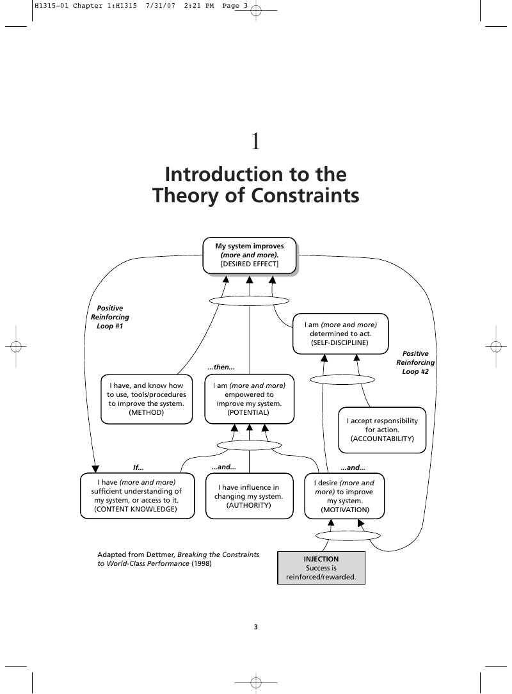

...then... I have, and know how to use, tools/procedures to improve the system.

### (Method)

I am (more and more) empowered to improve my system. (POTENTIAL) I accept responsibility for action.

### (Accountability)

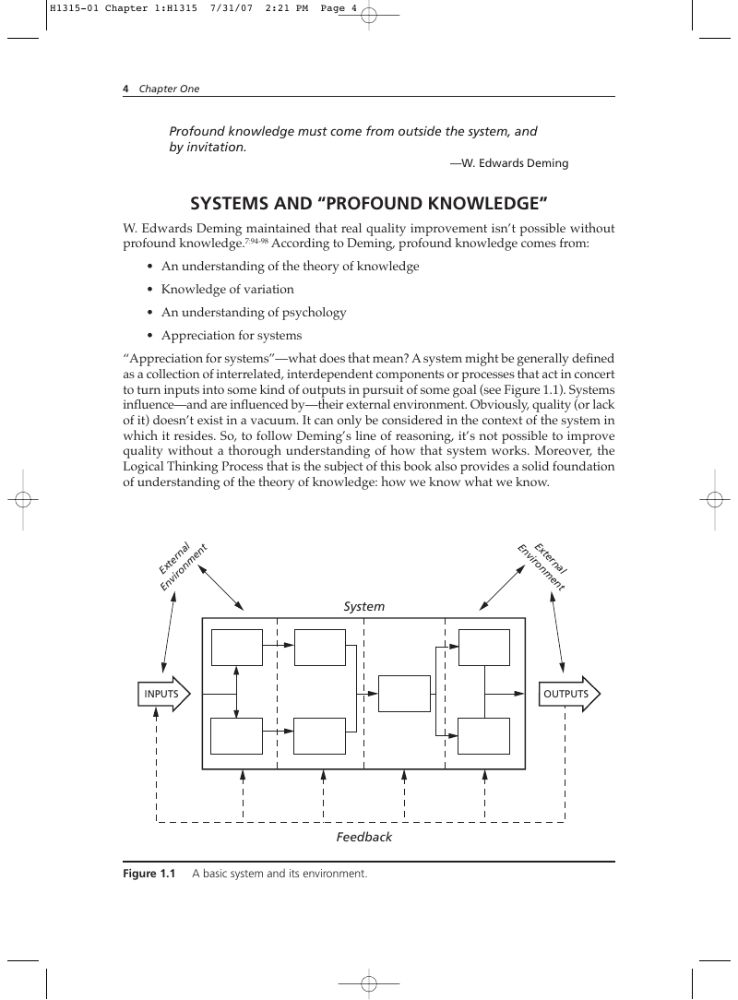

> Profound knowledge must come from outside the system, and by invitation.
>
> —W. Edwards Deming

- An understanding of the theory of knowledge
- Knowledge of variation
- An understanding of psychology
- Appreciation for systems

“Appreciation for systems”—what does that mean? A system might be generally defined as a collection of interrelated, interdependent components or processes that act in concert to turn inputs into some kind of outputs in pursuit of some goal (see Figure 1.1). Systems influence—and are influenced by—their external environment. Obviously, quality (or lack of it) doesn’t exist in a vacuum. It can only be considered in the context of the system in which it resides. So, to follow Deming’s line of reasoning, it’s not possible to improve quality without a thorough understanding of how that system works. Moreover, the Logical Thinking Process that is the subject of this book also provides a solid foundation of understanding of the theory of knowledge: how we know what we know. System INPUTS OUTPUTS Feedback

A basic system and its environment.

### The System’s Goal

Let’s look at systems from a broader perspective. Why do systems exist? In the most basic sense, the answer is, “To achieve a goal.” If a system’s purpose is to achieve some goal, who gets to decide what that goal should be? Obviously, in natural systems the answer to this question is often beyond the scope of human understanding. But in human organizational systems, which are the primary focus of this book, the goal setter ought to be the system’s owner—or owners. If you or I paid for the system, we’d expect to be the one to decide what that system’s goal should be. Privately held companies respond to the directions of their owners. Publicly held corporations work toward the goals of their stockholders—or at least they’re supposed to. Government agencies are essentially “owned” by the taxpayers and should be doing what the taxpayers expect them to do. The essence of management is recognizing the need for change, then initiating, controlling, and directing it, and solving the problems along the way. If it were not so, managers wouldn’t be needed—only babysitters.

### The Manager’s Role

In most complex systems, the responsibility for satisfying the owners’ goals rests with the managers of the system—from the chief executive officer down to the frontline supervisor. In a general sense, the Theory of Constraints (TOC) is about management.

1. Anyone can make a decision, given enough facts.
2. A good manager can make a decision without enough facts.
3. A perfect manager can operate in perfect ignorance.

> —Spencer’s Laws of Data

#### Who Is a Manager?

Inevitably, some readers will respond, “But I’m not a manager. Why would the Theory of Constraints be important to me?” The truth is, we’re all managers. Everyone is a manager of something—in different arenas, perhaps, but a manager nonetheless. Whether you’re in charge of a large corporation, a department, or a small team, you’re a manager. Even if you’re “none of the above,” you’re still a manager. Under ideal circumstances, all individuals manage their lives and careers, though sometimes they don’t do a very effective job of it. Some of us have more than one management role. Basically, we differ only in our span of control and the size of our sphere of influence. At the very least you manage (or possibly fail to manage) your personal activities, your time, and perhaps your finances. For example, a homemaker manages a household; a lawyer manages legal case preparation and litigation; a student manages time and effort. One of the hallmarks of effective managers is that they deal less with the present and more with the future. In other words, they concentrate on “fire prevention” rather than “fire fighting.” If you’re more focused on the present than the future, you’ll always be in a time lag, chasing changes in your environment—a reactive rather than a proactive mode.

Have you seen them? Which way did they go? I must be after them, for I am their leader!

#### What Is the Goal?

The Theory of Constraints rests on the admittedly somewhat rash assumption that managers and/or organizations know what their real purpose is, what goal they’re trying to achieve. Unfortunately, this isn’t always the case. No manager can hope to succeed without knowing four things:

- What the ultimate goal is
- What the critical success factors are in reaching that goal
- Where he or she currently stands in relation to that goal
- The magnitude and direction of the change needed to move from the status quo to where he or she wants to be (the goal) This might be considered “management by vector analysis.” But in fact that’s really what managers do: They determine the difference between what is and what should be, and they change things to eliminate that deviation. Average managers are concerned with methods, opinions, and precedents. Good managers are concerned with solving problems.

> —Unknown

#### Goal, Critical Success Factor, or Necessary Condition?

If you’re a manager, how do you know what the system’s goal is? Frequently a system’s managers—and perhaps even the owners—have different ideas about the system’s goal. In a commercial enterprise, the stockholders (owners) usually consider the system’s goal to be “to make more money.” The underlying assumption here is that a system making money pays dividends to stockholders who, in turn, make more money. The managers in a system might see the goal a little differently. While they acknowledge the need to make money for the stockholders, they also realize that other things are important—things like competitive advantage; market share; customer satisfaction; a satisfied, secure workforce; or first-time quality of product or service. Factors like these often show up as goals in strategic or operating plans. But are they really goals or are they necessary conditions? For the purposes of this book, a goal is defined as the result or achievement toward which effort is directed.19 But in complex systems we normally can’t jump directly to desired outcomes without satisfying some necessary conditions. A necessary condition is a circumstance indispensable to some result, or that upon which everything is contingent.18 Inherent in these definitions is a prerequisite relationship: you must satisfy the necessary conditions in order to attain the goal. How many necessary conditions does it take to realize a goal? The answer is, “It depends”—on how detailed you want to be. Stephen Covey recommends beginning “with the end in mind.”4:95 That’s obviously the goal itself, as we’ve defined it. But if we conceive of the process of goal attainment as a journey rather than a destination, there are clearly some intermediate progress milestones along the way—some “show-stoppers” without which we won’t be able to reach the goal. Normally there aren’t too many of these. I submit that there are no more than three to five, and perhaps fewer than three.

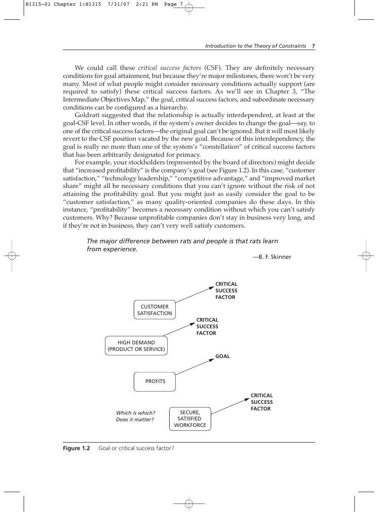

> We could call these critical success factors (CSF). They are definitely necessary conditions for goal attainment, but because they’re major milestones, there won’t be very many. Most of what people might consider necessary conditions actually support (are required to satisfy) these critical success factors. As we’ll see in Chapter 3, “The Intermediate Objectives Map,” the goal, critical success factors, and subordinate necessary conditions can be configured as a hierarchy. Goldratt suggested that the relationship is actually interdependent, at least at the goal-CSF level. In other words, if the system’s owner decides to change the goal—say, to one of the critical success factors—the original goal can’t be ignored. But it will most likely revert to the CSF position vacated by the new goal. Because of this interdependency, the goal is really no more than one of the system’s “constellation” of critical success factors that has been arbitrarily designated for primacy. For example, your stockholders (represented by the board of directors) might decide that “increased profitability” is the company’s goal (see Figure 1.2). In this case, “customer satisfaction,” “technology leadership,” “competitive advantage,” and “improved market share” might all be necessary conditions that you can’t ignore without the risk of not attaining the profitability goal. But you might just as easily consider the goal to be “customer satisfaction,” as many quality-oriented companies do these days. In this instance, “profitability” becomes a necessary condition without which you can’t satisfy customers. Why? Because unprofitable companies don’t stay in business very long, and if they’re not in business, they can’t very well satisfy customers. The major difference between rats and people is that rats learn from experience.
>
> —B. F. Skinner

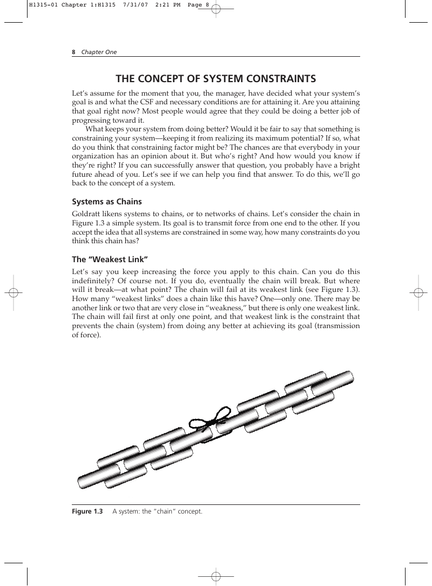

### The Concept of System Constraints

Let’s assume for the moment that you, the manager, have decided what your system’s goal is and what the CSF and necessary conditions are for attaining it. Are you attaining that goal right now? Most people would agree that they could be doing a better job of progressing toward it. What keeps your system from doing better? Would it be fair to say that something is constraining your system—keeping it from realizing its maximum potential? If so, what do you think that constraining factor might be? The chances are that everybody in your organization has an opinion about it. But who’s right? And how would you know if they’re right? If you can successfully answer that question, you probably have a bright future ahead of you. Let’s see if we can help you find that answer. To do this, we’ll go back to the concept of a system.

#### Systems as Chains

Goldratt likens systems to chains, or to networks of chains. Let’s consider the chain in Figure 1.3 a simple system. Its goal is to transmit force from one end to the other. If you accept the idea that all systems are constrained in some way, how many constraints do you think this chain has?

The “Weakest Link” Let’s say you keep increasing the force you apply to this chain. Can you do this indefinitely? Of course not. If you do, eventually the chain will break. But where will it break—at what point? The chain will fail at its weakest link (see Figure 1.3). How many “weakest links” does a chain like this have? One—only one. There may be another link or two that are very close in “weakness,” but there is only one weakest link. The chain will fail first at only one point, and that weakest link is the constraint that prevents the chain (system) from doing any better at achieving its goal (transmission of force).

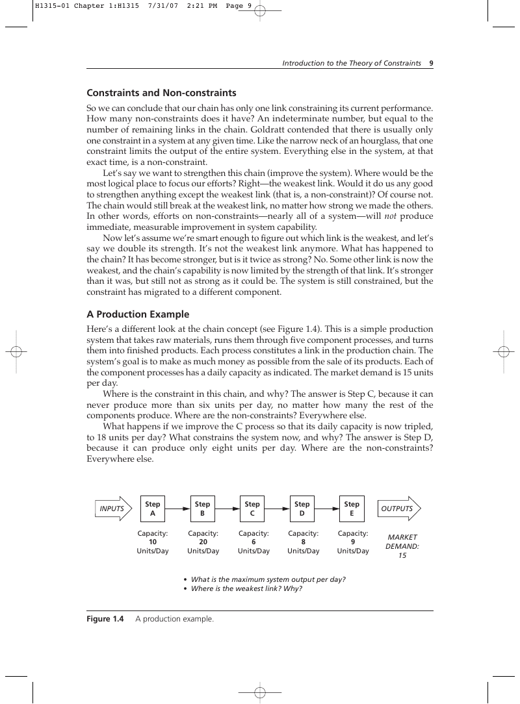

Constraints and Non-constraints So we can conclude that our chain has only one link constraining its current performance. How many non-constraints does it have? An indeterminate number, but equal to the number of remaining links in the chain. Goldratt contended that there is usually only one constraint in a system at any given time. Like the narrow neck of an hourglass, that one constraint limits the output of the entire system. Everything else in the system, at that exact time, is a non-constraint. Let’s say we want to strengthen this chain (improve the system). Where would be the most logical place to focus our efforts? Right—the weakest link. Would it do us any good to strengthen anything except the weakest link (that is, a non-constraint)? Of course not. The chain would still break at the weakest link, no matter how strong we made the others. In other words, efforts on non-constraints—nearly all of a system—will not produce immediate, measurable improvement in system capability. Now let’s assume we’re smart enough to figure out which link is the weakest, and let’s say we double its strength. It’s not the weakest link anymore. What has happened to the chain? It has become stronger, but is it twice as strong? No. Some other link is now the weakest, and the chain’s capability is now limited by the strength of that link. It’s stronger than it was, but still not as strong as it could be. The system is still constrained, but the constraint has migrated to a different component.

#### A Production Example

Here’s a different look at the chain concept (see Figure 1.4). This is a simple production system that takes raw materials, runs them through five component processes, and turns them into finished products. Each process constitutes a link in the production chain. The system’s goal is to make as much money as possible from the sale of its products. Each of the component processes has a daily capacity as indicated. The market demand is 15 units per day. Where is the constraint in this chain, and why? The answer is Step C, because it can never produce more than six units per day, no matter how many the rest of the components produce. Where are the non-constraints? Everywhere else. What happens if we improve the C process so that its daily capacity is now tripled, to 18 units per day? What constrains the system now, and why? The answer is Step D, because it can produce only eight units per day. Where are the non-constraints? Everywhere else. INPUTS Step

#### Units/Day

- What is the maximum system output per day?
- Where is the weakest link? Why?

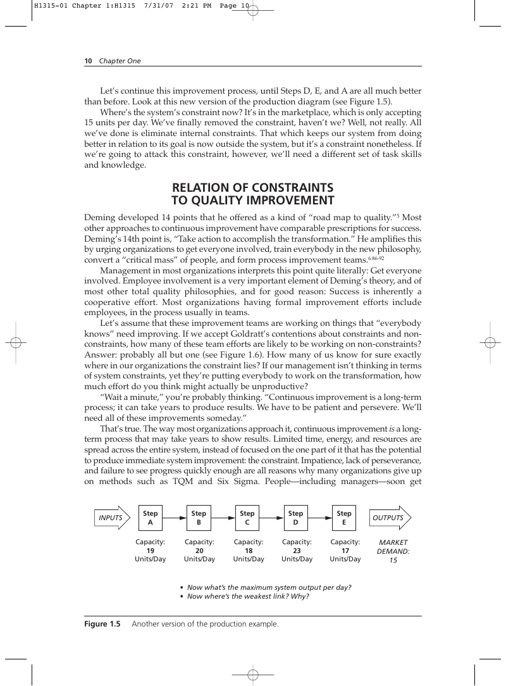

Let’s continue this improvement process, until Steps D, E, and A are all much better than before. Look at this new version of the production diagram (see Figure 1.5). Where’s the system’s constraint now? It’s in the marketplace, which is only accepting 15 units per day. We’ve finally removed the constraint, haven’t we? Well, not really. All we’ve done is eliminate internal constraints. That which keeps our system from doing better in relation to its goal is now outside the system, but it’s a constraint nonetheless. If we’re going to attack this constraint, however, we’ll need a different set of task skills and knowledge.

### Relation of Constraints to Quality Improvement

Deming developed 14 points that he offered as a kind of “road map to quality.”5 Most other approaches to continuous improvement have comparable prescriptions for success. Deming’s 14th point is, “Take action to accomplish the transformation.” He amplifies this by urging organizations to get everyone involved, train everybody in the new philosophy, convert a “critical mass” of people, and form process improvement teams.6:86-92 Management in most organizations interprets this point quite literally: Get everyone involved. Employee involvement is a very important element of Deming’s theory, and of most other total quality philosophies, and for good reason: Success is inherently a cooperative effort. Most organizations having formal improvement efforts include employees, in the process usually in teams. Let’s assume that these improvement teams are working on things that “everybody knows” need improving. If we accept Goldratt’s contentions about constraints and nonconstraints, how many of these team efforts are likely to be working on non-constraints? Answer: probably all but one (see Figure 1.6). How many of us know for sure exactly where in our organizations the constraint lies? If our management isn’t thinking in terms of system constraints, yet they’re putting everybody to work on the transformation, how much effort do you think might actually be unproductive? “Wait a minute,” you’re probably thinking. “Continuous improvement is a long-term process; it can take years to produce results. We have to be patient and persevere. We’ll need all of these improvements someday.” That’s true. The way most organizations approach it, continuous improvement is a longterm process that may take years to show results. Limited time, energy, and resources are spread across the entire system, instead of focused on the one part of it that has the potential to produce immediate system improvement: the constraint. Impatience, lack of perseverance, and failure to see progress quickly enough are all reasons why many organizations give up on methods such as TQM and Six Sigma. People—including managers—soon get INPUTS Step

#### Units/Day

- Now what’s the maximum system output per day?
- Now where’s the weakest link? Why?

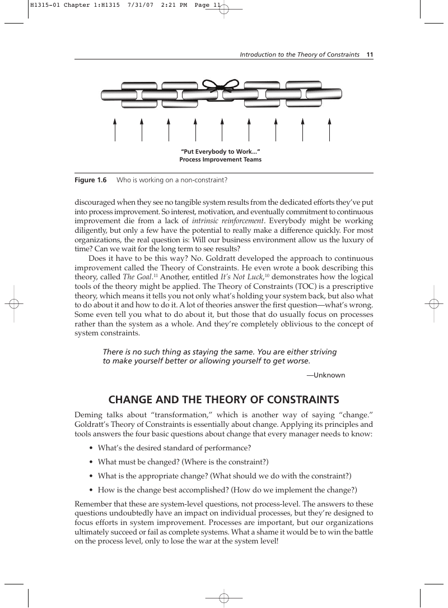

> discouraged when they see no tangible system results from the dedicated efforts they’ve put into process improvement. So interest, motivation, and eventually commitment to continuous improvement die from a lack of intrinsic reinforcement. Everybody might be working diligently, but only a few have the potential to really make a difference quickly. For most organizations, the real question is: Will our business environment allow us the luxury of time? Can we wait for the long term to see results? Does it have to be this way? No. Goldratt developed the approach to continuous improvement called the Theory of Constraints. He even wrote a book describing this theory, called The Goal.11 Another, entitled It’s Not Luck,10 demonstrates how the logical tools of the theory might be applied. The Theory of Constraints (TOC) is a prescriptive theory, which means it tells you not only what’s holding your system back, but also what to do about it and how to do it. A lot of theories answer the first question—what’s wrong. Some even tell you what to do about it, but those that do usually focus on processes rather than the system as a whole. And they’re completely oblivious to the concept of system constraints. There is no such thing as staying the same. You are either striving to make yourself better or allowing yourself to get worse.
>
> —Unknown

### Change and the Theory of Constraints

Deming talks about “transformation,” which is another way of saying “change.” Goldratt’s Theory of Constraints is essentially about change. Applying its principles and tools answers the four basic questions about change that every manager needs to know:

- What’s the desired standard of performance?
- What must be changed? (Where is the constraint?)
- What is the appropriate change? (What should we do with the constraint?)
- How is the change best accomplished? (How do we implement the change?) Remember that these are system-level questions, not process-level. The answers to these questions undoubtedly have an impact on individual processes, but they’re designed to focus efforts in system improvement. Processes are important, but our organizations ultimately succeed or fail as complete systems. What a shame it would be to win the battle on the process level, only to lose the war at the system level!

> Why is the distinction between system and process so important? The answer lies in one of the fundamental assumptions of systems theory: the whole is not equal to the sum of its parts. The assumption that it is originates in a basic algebraic axiom. Unfortunately, however, complex systems are anything but mathematically precise. The improper allocation of this algebraic axiom to the management of organizations would sound like this: If we break down our system into its components, maximize the efficiency of each one, then reassemble the components, we’ll have the most efficient whole system. It’s been said that elegant theories are often slain by ugly, inconvenient facts. That’s the case here. The mathematical, or analytical, approach to system improvement is one of those victims. It’s also been said that “the devil is in the details.” Where complex systems are concerned, those details make up many of the aforementioned ugly, inconvenient facts. And they are often in the linkages between system components, not in the components (links) themselves. Yet organizations continue to blithely polish the efficiency of these links, blissfully ignorant of the real location of the most vexing contributors to less-than-desirable system performance: the interfaces among components.3:3-4 Most continuous improvement (CI) methods never adequately address how best to channel improvement efforts for maximum immediate effect. In other words, by using TOC in addition to CI methods such as Six Sigma, the problem of taking a long time to show results goes away. Effectively applying TOC in concert with CI, you’re likely to find that CI and significant short-term results need not be mutually exclusive. So don’t think about throwing away your CI toolbox. If anything, the traditional CI tools become more productive than ever, because TOC can suggest when and how to employ each one to best effect: on the current (and sometime future) system constraint. It is not necessary to change; survival is not mandatory.
>
> —W. Edwards Deming

### Toc Principles

Theories are usually classified as either descriptive or prescriptive. Descriptive theories, such as the law of gravity, tell us why things happen, but they don’t help us to do anything about them. Prescriptive theories both explain why and offer guidance on what to do. TOC is a prescriptive theory, but we’ll look at the descriptive part first. Several principles converge to make the environment particularly fertile ground for the prescriptive part of Goldratt’s theory. The accompanying chart (see Figure 1.7) lists most of these principles, but a few of them are worth emphasizing because of their striking impact on reality.

#### Systems as Chains

This is crucial to TOC. If systems function as chains, weakest links can be found and strengthened.

#### Local vs. System Optima

Because of the interdependence of system components and the effects of entropy, the optimum performance of the entire system is not equivalent to the sum of all the component optima. We saw this in the production example earlier. If all the components of a system are performing at their maximum level, the system as whole will not be performing at its best.

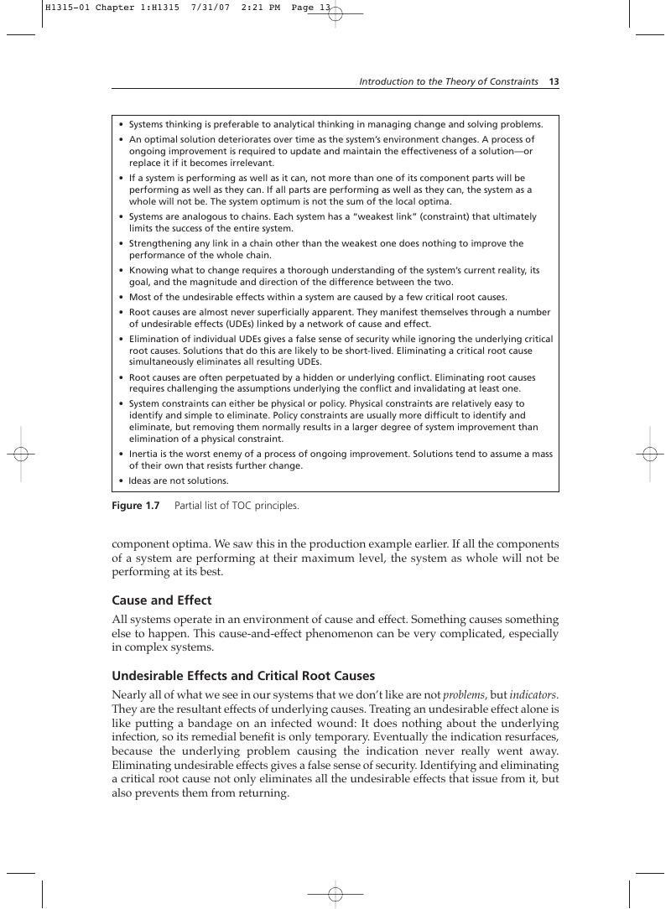

- Systems thinking is preferable to analytical thinking in managing change and solving problems.
- An optimal solution deteriorates over time as the system’s environment changes. A process of ongoing improvement is required to update and maintain the effectiveness of a solution—or replace it if it becomes irrelevant.
- If a system is performing as well as it can, not more than one of its component parts will be performing as well as they can. If all parts are performing as well as they can, the system as a whole will not be. The system optimum is not the sum of the local optima.
- Systems are analogous to chains. Each system has a “weakest link” (constraint) that ultimately limits the success of the entire system.
- Strengthening any link in a chain other than the weakest one does nothing to improve the performance of the whole chain.
- Knowing what to change requires a thorough understanding of the system’s current reality, its goal, and the magnitude and direction of the difference between the two.
- Most of the undesirable effects within a system are caused by a few critical root causes.
- Root causes are almost never superficially apparent. They manifest themselves through a number of undesirable effects (UDEs) linked by a network of cause and effect.
- Elimination of individual UDEs gives a false sense of security while ignoring the underlying critical root causes. Solutions that do this are likely to be short-lived. Eliminating a critical root cause simultaneously eliminates all resulting UDEs.
- Root causes are often perpetuated by a hidden or underlying conflict. Eliminating root causes requires challenging the assumptions underlying the conflict and invalidating at least one.
- System constraints can either be physical or policy. Physical constraints are relatively easy to identify and simple to eliminate. Policy constraints are usually more difficult to identify and eliminate, but removing them normally results in a larger degree of system improvement than elimination of a physical constraint.
- Inertia is the worst enemy of a process of ongoing improvement. Solutions tend to assume a mass of their own that resists further change.
- Ideas are not solutions.

#### Cause and Effect

All systems operate in an environment of cause and effect. Something causes something else to happen. This cause-and-effect phenomenon can be very complicated, especially in complex systems.

#### Undesirable Effects and Critical Root Causes

Nearly all of what we see in our systems that we don’t like are not problems, but indicators. They are the resultant effects of underlying causes. Treating an undesirable effect alone is like putting a bandage on an infected wound: It does nothing about the underlying infection, so its remedial benefit is only temporary. Eventually the indication resurfaces, because the underlying problem causing the indication never really went away. Eliminating undesirable effects gives a false sense of security. Identifying and eliminating a critical root cause not only eliminates all the undesirable effects that issue from it, but also prevents them from returning.

#### Solution Deterioration

An optimal solution deteriorates over time as the system’s environment changes. Goldratt once said, “Yesterday’s solution becomes today’s historical curiosity.” (“Isn’t that interesting?! Why do you suppose they ever did that?”) A process of ongoing improvement is essential for updating and maintaining the efficiency (and effectiveness) of a solution. Inertia is the worst enemy of a process of ongoing improvement. The attitude that, “We’ve solved that problem—no need to revisit it” hurts continuous improvement efforts.

#### Physical vs. Policy Constraints

> Most of the constraints we face in our systems originate from policies—how we deliberately choose to operate—not physical things. Physical constraints are relatively easy to identify and break. Policy constraints are much more difficult, but they normally result in a much larger degree of system improvement than does the elimination of a physical constraint. An organization must have some means of combating the process by which people become prisoners of their procedures. The rule book becomes fatter as the ideas become fewer. Almost every well-established organization is a coral reef of procedures that were laid down to achieve some long-forgotten objective.
>
> —John W. Gardner

#### Ideas Are Not Solutions

The best ideas in the world never realize their potential unless they’re implemented. And most great ideas fail in the implementation stage.

### The Five Focusing Steps of Toc

This is the beginning of the prescriptive part of the Theory of Constraints. Goldratt developed five sequential steps to concentrate improvement efforts on the component that is capable of producing the most positive impact on the system.11:300-308

1. Identify the System Constraint What part of the system constitutes the weakest link? If it’s a physical constraint, what policy is driving it?
2. Decide How to Exploit the Constraint By “exploit,” Goldratt means we should wring every bit of capability out of the constraining component as it currently exists. In other words, “What can we do to get the most out of this constraint without committing to potentially expensive changes or upgrades?”

**NOTE:** The constraint, if physical, is the one place in the chain where efficiency or productivity is paramount.

1. Subordinate Everything Else After we’ve identified the constraint (Step 1) and decided what to do about it (Step 2), we adjust the rest of the system to a “setting” that will enable the constraint to operate at maximum effectiveness. We may have to “de-tune” some parts of the system, while “revving up” others. Inevitably, this means sacrificing the individual efficiencies of non-constraints to some extent. However, care must be taken to assure that deliberate “detuning” of a non-constraint doesn’t actually turn it into the system constraint. Once we’ve subordinated non-constraints, we must evaluate the results of our actions: Is the constraint still constraining the system’s performance? If not, we’ve eliminated this particular constraint, and we skip ahead to Step 5. If it is, we still have the same constraint—and we continue with Step 4.
2. Elevate the Constraint If we’re doing Step 4, it means that Steps 2 and 3 weren’t sufficient to eliminate the constraint. We have to do something more. It’s not until this step that we entertain the idea of major changes to the existing system—reorganization, divestiture, capital improvements, or other substantial system modifications. This step can involve considerable investment in time, energy, money, or other resources, so we must be sure we aren’t able to break the constraint in the first three steps. It’s not uncommon for organizations that are not cognizant of constraint theory to jump straight from Step 1 (Identify) to Step 4 (Elevate). The net effect is that more costs are incurred, usually unnecessarily, and that opportunities to wring better performance from the system at no additional cost are ignored or overlooked. “Elevating” the constraint means that we take whatever action is required to eliminate the constraint. When this step is completed, the initial constraint is broken, but some new factor, within the system or outside of it, becomes the new system constraint.
3. Go Back to Step 1, But Beware of “Inertia” If a constraint is broken at Steps 3 or 4 we must go back to Step 1 and begin the cycle again, looking for the next thing constraining our performance. If you’ll recall the production example (see Figure 1.5), this is exactly what we did. After we broke the constraint at process Step C, we went back and found D, then E, then A, and, finally, the marketplace. The caution about inertia reminds us that we must not become complacent; the cycle never ends. We keep on looking for constraints, and we keep breaking them. And we never forget that because of interdependency and variation, each subsequent change we make to our system will have new effects on those constraints we’ve already broken. We may have to revisit and update those solutions, too. The Five Focusing Steps have a direct relationship with the four management questions pertaining to change: What’s the standard, what to change, what to change to, and how to cause change? They tell us how to answer those questions. To determine what to change, we look for the constraint. To determine what to change to, we decide how to exploit the constraint and subordinate the rest of the system to that decision. If that doesn’t do the complete job, we elevate the constraint. The subordinate and elevate steps also address the question “how to cause the change.” “This is all well and good,” you’re probably saying, “but how do we convert these abstract steps into concrete actions we can take? And how do we know when we’ve had a positive impact on the system?” These are two key questions. Let’s look at the second one first.

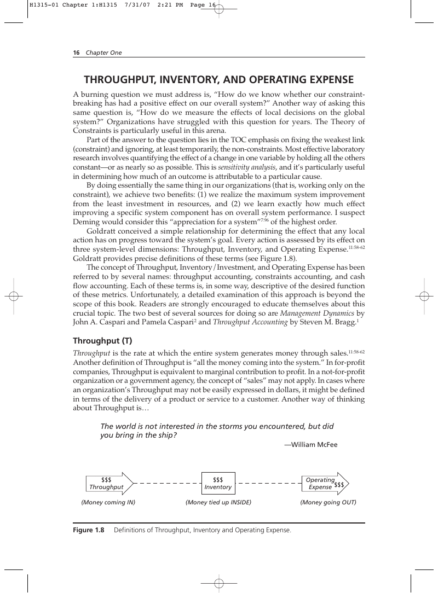

### Throughput, Inventory, and Operating Expense

A burning question we must address is, “How do we know whether our constraintbreaking has had a positive effect on our overall system?” Another way of asking this same question is, “How do we measure the effects of local decisions on the global system?” Organizations have struggled with this question for years. The Theory of Constraints is particularly useful in this arena. Part of the answer to the question lies in the TOC emphasis on fixing the weakest link (constraint) and ignoring, at least temporarily, the non-constraints. Most effective laboratory research involves quantifying the effect of a change in one variable by holding all the others constant—or as nearly so as possible. This is sensitivity analysis, and it’s particularly useful in determining how much of an outcome is attributable to a particular cause. By doing essentially the same thing in our organizations (that is, working only on the constraint), we achieve two benefits: (1) we realize the maximum system improvement from the least investment in resources, and (2) we learn exactly how much effect improving a specific system component has on overall system performance. I suspect Deming would consider this “appreciation for a system”7:96 of the highest order. Goldratt conceived a simple relationship for determining the effect that any local action has on progress toward the system’s goal. Every action is assessed by its effect on three system-level dimensions: Throughput, Inventory, and Operating Expense.11:58-62 Goldratt provides precise definitions of these terms (see Figure 1.8). The concept of Throughput, Inventory/Investment, and Operating Expense has been referred to by several names: throughput accounting, constraints accounting, and cash flow accounting. Each of these terms is, in some way, descriptive of the desired function of these metrics. Unfortunately, a detailed examination of this approach is beyond the scope of this book. Readers are strongly encouraged to educate themselves about this crucial topic. The two best of several sources for doing so are Management Dynamics by John A. Caspari and Pamela Caspari 2 and Throughput Accounting by Steven M. Bragg.1

> Throughput (T) Throughput is the rate at which the entire system generates money through sales.11:58-62 Another definition of Throughput is “all the money coming into the system.” In for-profit companies, Throughput is equivalent to marginal contribution to profit. In a not-for-profit organization or a government agency, the concept of “sales” may not apply. In cases where an organization’s Throughput may not be easily expressed in dollars, it might be defined in terms of the delivery of a product or service to a customer. Another way of thinking about Throughput is… The world is not interested in the storms you encountered, but did you bring in the ship?
>
> —William McFee

Definitions of Throughput, Inventory and Operating Expense.

Inventory/Investment (I) Inventory and Investment are all the money the system invests in things it intends to sell, or all the money tied up within the system.12:58-62 Inventory includes the acquisition cost of raw materials, unfinished goods, purchased parts, and other “hard” items intended for sale to a customer. Investment includes the expenditures an organization makes in equipment and facilities. Eventually, obsolescent equipment and facilities will be sold, too, even if only at their scrap value. As these assets depreciate, their depreciated value remains in the “I” column, but the depreciation is added to Operating Expense (see the next section).

Operating Expense (OE) Operating Expense is all the money the system spends turning Inventory into Throughput. In other words, it’s the money going out of the system.12:58-62 Direct and indirect labor, utilities, interest, and the like are examples of operating expenses. Depreciation of assets is also considered an Operating Expense, because it constitutes the value of a fixed asset expended, or “used up,” in turning Inventory into Throughput. Goldratt contended that these dimensions are interdependent. That is, a change in one will usually automatically result in a change in one or both of the other two. Let’s consider that for a minute. If you increase Throughput by increasing sales, Inventory and Operating Expense will also increase. Why? Because you’re likely to need more physical inventory to support increased sales, and you’re likely to spend more, in variable costs, to produce more. It’s also possible to make more money (if that’s your goal) without increasing sales. How? If you can produce the same sales revenues with less physical inventory, and spend less on Operating Expense doing it, you get to keep more of the money coming into the company (net profit). So what would you, as a manager, try to do to improve your system? Obviously, you would increase Throughput while decreasing Inventory and Operating Expense. And here we have the key to relating local decisions to the performance of the entire system. As you decide what action to take, ask yourself these questions:

- Will it increase Throughput? If so, how?
- Will it decrease Inventory? If so, how?
- Will it decrease Operating Expense? If so, how? If the answer to any of these questions is “yes,” go ahead with your decision (as long as doing so doesn’t compromise one or more of the other two), confident that the overall system will benefit from it. If you’re not sure, perhaps you’d better re-evaluate. The bottom line is that if it doesn’t eventually result in increased Throughput, you’re wasting your time—and probably your money.

#### Which Is Most Important: T, I, or OE?

To improve your system, where should you focus your efforts? On T, I, or OE? Consider the example in Figure 1.9. The choices are to focus on decreasing OE, decreasing I, or increasing T. As you look at the graph, note that the theoretical limit in reducing OE and I is zero. A system can’t produce output with no physical inventory and no Operating Expense, so the practical limits of I and OE are somewhat above zero. Theoretically, there’s no upper limit to how high you can increase T, but from a practical standpoint there is a limit to the size of your market. But still, it’s highly probable that the potential for increasing T will always be much higher than the potential for decreasing I and OE. Consequently, it makes x, y = potential decrease z = potential increase Practical Limit

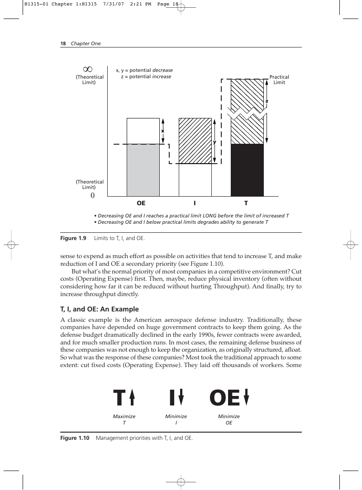

- Decreasing OE and I reaches a practical limit LONG before the limit of increased T sense to expend as much effort as possible on activities that tend to increase T, and make reduction of I and OE a secondary priority (see Figure 1.10). But what’s the normal priority of most companies in a competitive environment? Cut costs (Operating Expense) first. Then, maybe, reduce physical inventory (often without considering how far it can be reduced without hurting Throughput). And finally, try to increase throughput directly.
- Decreasing OE and I below practical limits degrades ability to generate T

Limits to T, I, and OE.

#### T, I, and OE: An Example

A classic example is the American aerospace defense industry. Traditionally, these companies have depended on huge government contracts to keep them going. As the defense budget dramatically declined in the early 1990s, fewer contracts were awarded, and for much smaller production runs. In most cases, the remaining defense business of these companies was not enough to keep the organization, as originally structured, afloat. So what was the response of these companies? Most took the traditional approach to some extent: cut fixed costs (Operating Expense). They laid off thousands of workers. Some even reduced Investment by selling off plants, warehouses, or other physical assets. But even that wasn’t enough for certain companies, so they merged with others to “strengthen” their capacity to bid for whatever defense business remained. A few companies, however, have seen the handwriting on the wall. With the bottom not yet in sight, they couldn’t continue to cut physical inventory or Operating Expense, so they opted to do what they probably should have done in the first place: look for ways to increase Throughput. How? By finding new market segments for their core competencies, markets that don’t depend on government contracts. One satellite builder found a market for its data technology in credit reporting and for its electronic technology in the automotive industry. Another defense electronics firm diversified into consumer communications: home satellite television and data communication. In both cases, the companies found new ways to increase Throughput, rather than just reducing Operating Expense and Inventory.*

Management priorities with T, I, and OE.

T, I, and OE in Not-for-Profit Organizations A common question often asked is, “What about organizations in which ‘making more money, now and in the future’ isn’t the goal—as with charitable foundations, government agencies, and some hospitals? How do T, I, and OE apply to them?” It’s true that Goldratt conceived of Throughput, Inventory (or Investment), and Operating Expense as ways to measure an organization’s progress toward its goal. However, when he created these measures, he was focusing exclusively on for-profit companies. In such organizations, money is an effective surrogate measure for almost all critical aspects of system-level performance, especially those pertaining to the organization’s goal. But it’s clearly different in the case of a not-for-profit or government agency. Since that kind of organization’s goal is not to “make more money, now and in the future,” the financial expression of Throughput loses significance. So, how can we measure progress toward our goal if we’re a not-for-profit organization? A variety of alternatives has been suggested to modify expressions of T, and the variable elements of I, so that they accurately reflect progress toward a non-monetary goal. The problem with almost all of these alternatives is that they’re contrived—an attempt to fit not-for-profits into a “metrics box” they were never intended to occupy. Goldratt himself has offered what may be the best solution to the problem of assessing the progress of not-for-profits toward their goals. In July of 1995 he made the following observations.18 Figure 1.11 illustrates his concept.

#### Universal Measures of Value

In recorded history, money has been the closest thing to a universal measure of value that humankind has ever created. Where it applies completely, it’s very effective. But because it’s not always a valid measure of value, and since no other universal non-monetary measure of value has been invented, a different scheme for not-for-profits should be employed. Goldratt suggested a dual approach. Operating Expense is still measurable in monetary terms; inventory, only partially so; and Throughput, not at all. Inventory, he proposed, should be differentiated as either “passive” or “active.”

* A more detailed treatment of T, I, and OE can be found in three other sources: The Haystack Syndrome12 by Goldratt and Management Dynamics2 by the Casparis and Throughput Accounting1 by Bragg. (1990, 2004, and 2007 respectively).

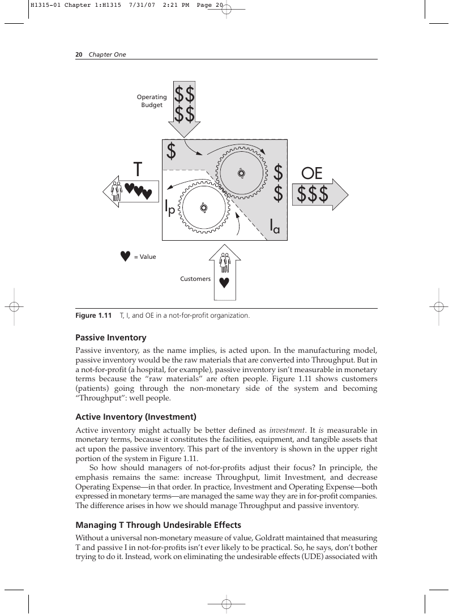

T, I, and OE in a not-for-profit organization.

#### Passive Inventory

Passive inventory, as the name implies, is acted upon. In the manufacturing model, passive inventory would be the raw materials that are converted into Throughput. But in a not-for-profit (a hospital, for example), passive inventory isn’t measurable in monetary terms because the “raw materials” are often people. Figure 1.11 shows customers (patients) going through the non-monetary side of the system and becoming “Throughput”: well people.

Active Inventory (Investment) Active inventory might actually be better defined as investment. It is measurable in monetary terms, because it constitutes the facilities, equipment, and tangible assets that act upon the passive inventory. This part of the inventory is shown in the upper right portion of the system in Figure 1.11. So how should managers of not-for-profits adjust their focus? In principle, the emphasis remains the same: increase Throughput, limit Investment, and decrease Operating Expense—in that order. In practice, Investment and Operating Expense—both expressed in monetary terms—are managed the same way they are in for-profit companies. The difference arises in how we should manage Throughput and passive inventory.

#### Managing T Through Undesirable Effects

Without a universal non-monetary measure of value, Goldratt maintained that measuring T and passive I in not-for-profits isn’t ever likely to be practical. So, he says, don’t bother trying to do it. Instead, work on eliminating the undesirable effects (UDE) associated with Throughput. (Refer to Chapter 4, “Current Reality Trees,” for a thorough discussion of undesirable effects and their relationship to root causes.) Use UDEs as your indicators of progress. As you eliminate them, progress toward the organization’s goal can be assumed. In summary, a not-for-profit should search out and correct the causes of UDEs affecting Throughput, while keeping the costs of Investment and Operating Expense down (refer to Figure 1.11). But the primary emphasis should always be on the former, not the latter.

**NOTE:** Many people will inevitably ask, “What about the operating budget of a not-for-profit? Where does that fit into the T, I, and OE formulation?” It isn’t in Throughput, because production efforts aren’t aimed at increasing it. And it isn’t really an Operating Expense alone, because some part of it is spent on capital improvements, which are really Inventory (Investment). The answer, according to Goldratt, is that the annual operating budget should be considered a necessary condition. Efforts to reduce active Inventory and Operating Expense will naturally have a beneficial effect on the annual budget. But the budget is the means to an end—a necessary condition—not the goal.

### The Toc Paradigm

The Theory of Constraints is considerably more than just a theory. In effect, it’s a paradigm, a pattern or model that includes not only concepts, guiding principles, and prescriptions, but tools and applications as well. We’ve seen its concepts (systems as chains; T, I, and OE) and its principles (cause and effect, local vs. system optima, and so on). We’ve examined its prescriptions (the Five Focusing Steps; what to change, what to change to, how to change). To complete the picture, we’ll consider its applications and tools.

#### Applications and Tools

Each application of TOC starts out being unique. As the theory is applied in a new situation, it creates a distinctive solution. Often, however, such solutions can be generalized to a variety of other circumstances.

#### Drum-Buffer-Rope

For example, in The Goal, Goldratt describes a TOC solution to a production control problem in a specific plant of a fictitious company. This solution became the basis for a generic solution applicable to similar production situations in other industries. Goldratt called this production control solution “drum-buffer-rope.”5,13,17 Many companies have applied this solution, originally developed to solve one company’s problem, with great success. Consequently, drum-buffer-rope, which began as an application of TOC principles, has become a tool in the TOC paradigm.

#### Critical Chain Project Management

A natural extension of the drum-buffer-rope concept to project management is called critical chain.9,14,15,16 Whereas production is repetitive, projects are usually one-time deliveries; some of the elements of drum-buffer-rope required modification before they could be applied to managing projects. But the basics are similar. Critical chain, perhaps to an even greater extent than drum-buffer-rope, has become a widespread way of ensuring shorter project durations and a higher probability of delivering them on time.

#### Replenishment and Distribution

Just as the drum-buffer-rope concept was extended to project management, so too has it been applied to manufacturers’ raw material acquisition management and finished goods distribution. Combined with drum-buffer-rope, the TOC replenishment and distribution tool can make for a fast, streamlined supply chain. As of this writing, there is not much formally published about it beyond a few conference papers.

#### Throughput Accounting

Another tool is called Throughput accounting. This is a direct outcome of the use of Throughput, Inventory, and Operating Expense as management decision tools, as opposed to traditional management cost accounting.1,2 Throughput accounting basically refutes the commonly used concept of allocating fixed costs to units of a product or service. While the summary financial figures remain essentially the same, the absence of allocated fixed costs promotes very different management decisions concerning pricing and marketing for competitive advantage. In other words, Throughput accounting is a much more robust approach for supporting good operational decisions than standard cost accounting. As with drum-buffer-rope production control, throughput accounting began as a specific solution to one company’s system performance measurement problem and ended up applicable to any company’s measurement problems.

#### The Logical Thinking Process

The Thinking Process Goldratt developed to apply TOC is logical by nature. The drumbuffer-rope, critical chain project management, supply chain, and throughput accounting tools all have foundations in the logic of cause and effect. But that logic isn’t necessarily intuitive, and it certainly doesn’t spring fully formed, like Pegasus from the head of Medusa. Rather, this logic finds its expression in another TOC tool—the most universal of them all—the Logical Thinking Process. The Thinking Process comprises six* distinct logic trees and the “rules of logic” that govern their construction. The trees include the Intermediate Objectives Map, the Current Reality Tree, the Evaporating Cloud, the Future Reality Tree, the Prerequisite Tree, and the Transition Tree. The rules are called the Categories of Legitimate Reservation. These trees, the Categories of Legitimate Reservation, and how to use them, are the subject of this book.

### The Intermediate Objectives Map

The Intermediate Objectives (IO) Map is a “destination finder.” Stephen R. Covey contends that one should always begin any endeavor with the end in mind.4:95 The IO Map (see Figure 1.12) helps problem solvers to do that.

* Originally, Goldratt conceived of only five tools. In the mid-1990s, he briefly dabbled with the idea of another logical aid he referred to as an Intermediate Objectives (IO) Map, but he never continued with a concerted effort to develop and use it. In my strategy development work, I found the IO Map to be not just useful, but critical to success. (See Dettmer, Strategic Navigation, Quality Press, 2003.) 8 It became apparent that it was equally useful for the kind of system problem solving for which the Thinking Process was originally conceived. The IO Map concept is fully developed, explained, and illustrated in this edition for the first time.

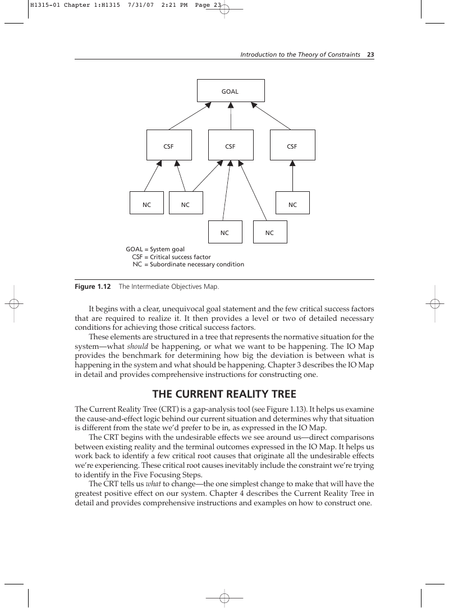

It begins with a clear, unequivocal goal statement and the few critical success factors that are required to realize it. It then provides a level or two of detailed necessary conditions for achieving those critical success factors. These elements are structured in a tree that represents the normative situation for the system—what should be happening, or what we want to be happening. The IO Map provides the benchmark for determining how big the deviation is between what is happening in the system and what should be happening. Chapter 3 describes the IO Map in detail and provides comprehensive instructions for constructing one.

### The Current Reality Tree

The Current Reality Tree (CRT) is a gap-analysis tool (see Figure 1.13). It helps us examine the cause-and-effect logic behind our current situation and determines why that situation is different from the state we’d prefer to be in, as expressed in the IO Map. The CRT begins with the undesirable effects we see around us—direct comparisons between existing reality and the terminal outcomes expressed in the IO Map. It helps us work back to identify a few critical root causes that originate all the undesirable effects we’re experiencing. These critical root causes inevitably include the constraint we’re trying to identify in the Five Focusing Steps. The CRT tells us what to change—the one simplest change to make that will have the greatest positive effect on our system. Chapter 4 describes the Current Reality Tree in detail and provides comprehensive instructions and examples on how to construct one.

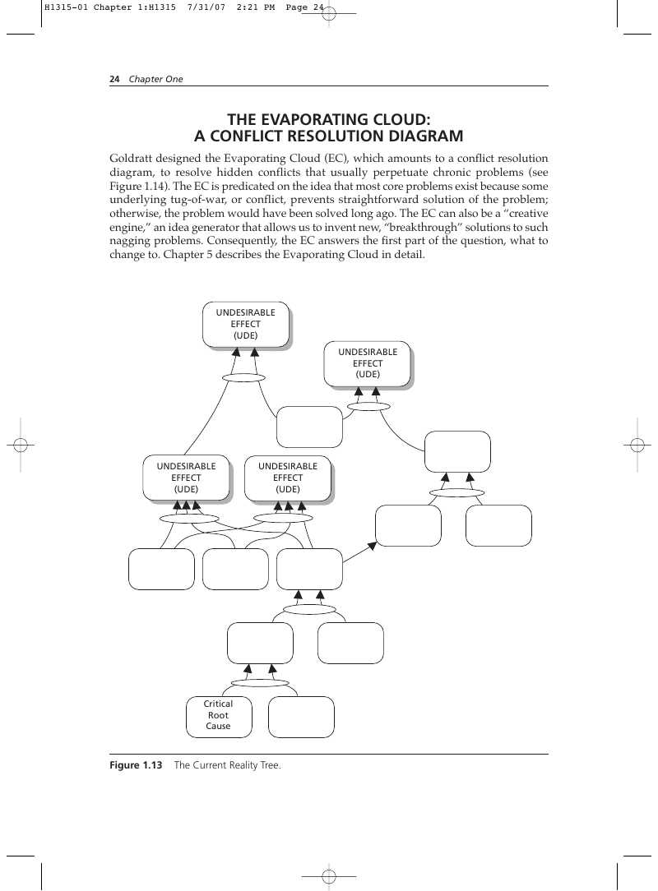

### A Conflict Resolution Diagram

Goldratt designed the Evaporating Cloud (EC), which amounts to a conflict resolution diagram, to resolve hidden conflicts that usually perpetuate chronic problems (see Figure 1.14). The EC is predicated on the idea that most core problems exist because some underlying tug-of-war, or conflict, prevents straightforward solution of the problem; otherwise, the problem would have been solved long ago. The EC can also be a “creative engine,” an idea generator that allows us to invent new, “breakthrough” solutions to such nagging problems. Consequently, the EC answers the first part of the question, what to change to. Chapter 5 describes the Evaporating Cloud in detail. UNDESIRABLE EFFECT

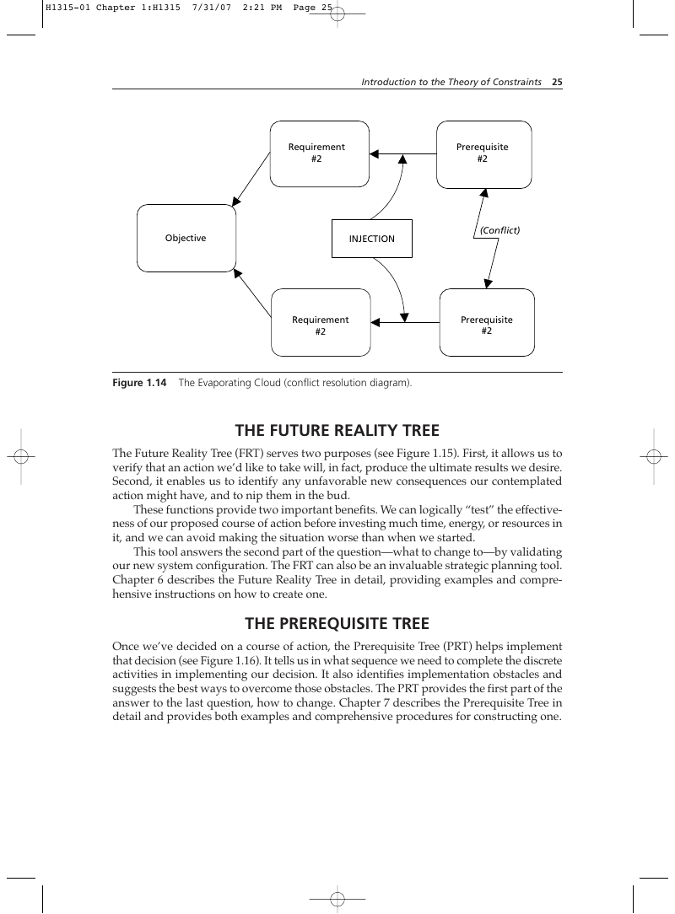

#2 Requirement

#2 Objective

#2

#2

The Evaporating Cloud (conflict resolution diagram).

### The Future Reality Tree

The Future Reality Tree (FRT) serves two purposes (see Figure 1.15). First, it allows us to verify that an action we’d like to take will, in fact, produce the ultimate results we desire. Second, it enables us to identify any unfavorable new consequences our contemplated action might have, and to nip them in the bud. These functions provide two important benefits. We can logically “test” the effectiveness of our proposed course of action before investing much time, energy, or resources in it, and we can avoid making the situation worse than when we started. This tool answers the second part of the question—what to change to—by validating our new system configuration. The FRT can also be an invaluable strategic planning tool. Chapter 6 describes the Future Reality Tree in detail, providing examples and comprehensive instructions on how to create one.

### The Prerequisite Tree

Once we’ve decided on a course of action, the Prerequisite Tree (PRT) helps implement that decision (see Figure 1.16). It tells us in what sequence we need to complete the discrete activities in implementing our decision. It also identifies implementation obstacles and suggests the best ways to overcome those obstacles. The PRT provides the first part of the answer to the last question, how to change. Chapter 7 describes the Prerequisite Tree in detail and provides both examples and comprehensive procedures for constructing one.

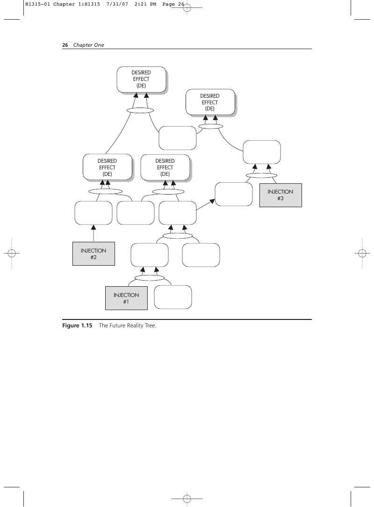

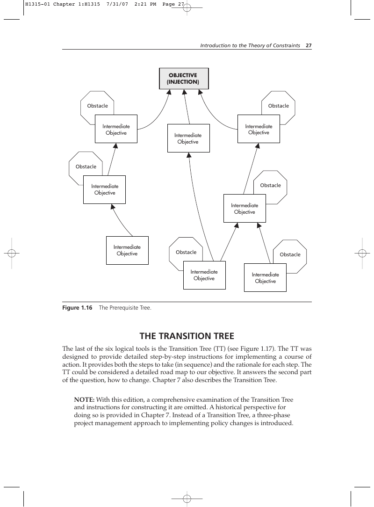

### The Transition Tree

The last of the six logical tools is the Transition Tree (TT) (see Figure 1.17). The TT was designed to provide detailed step-by-step instructions for implementing a course of action. It provides both the steps to take (in sequence) and the rationale for each step. The TT could be considered a detailed road map to our objective. It answers the second part of the question, how to change. Chapter 7 also describes the Transition Tree.

**NOTE:** With this edition, a comprehensive examination of the Transition Tree and instructions for constructing it are omitted. A historical perspective for doing so is provided in Chapter 7. Instead of a Transition Tree, a three-phase project management approach to implementing policy changes is introduced.

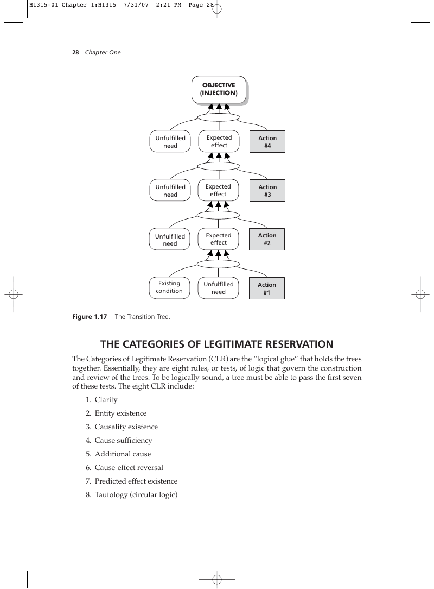

#4 Unfulfilled

#3 Unfulfilled

#2 Existing

#1

### The Categories of Legitimate Reservation

The Categories of Legitimate Reservation (CLR) are the “logical glue” that holds the trees together. Essentially, they are eight rules, or tests, of logic that govern the construction and review of the trees. To be logically sound, a tree must be able to pass the first seven of these tests. The eight CLR include:

1. Clarity
2. Entity existence
3. Causality existence
4. Cause sufficiency
5. Additional cause
6. Cause-effect reversal
7. Predicted effect existence
8. Tautology (circular logic)

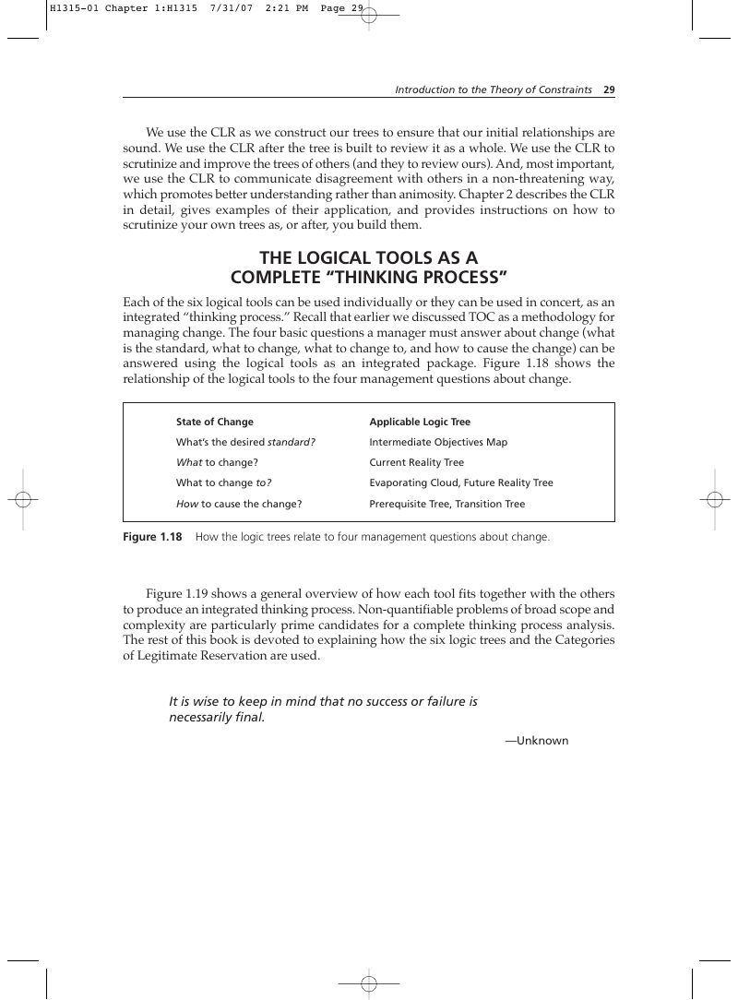

We use the CLR as we construct our trees to ensure that our initial relationships are sound. We use the CLR after the tree is built to review it as a whole. We use the CLR to scrutinize and improve the trees of others (and they to review ours). And, most important, we use the CLR to communicate disagreement with others in a non-threatening way, which promotes better understanding rather than animosity. Chapter 2 describes the CLR in detail, gives examples of their application, and provides instructions on how to scrutinize your own trees as, or after, you build them.

### The Logical Tools as a Complete “Thinking Process”

Each of the six logical tools can be used individually or they can be used in concert, as an integrated “thinking process.” Recall that earlier we discussed TOC as a methodology for managing change. The four basic questions a manager must answer about change (what is the standard, what to change, what to change to, and how to cause the change) can be answered using the logical tools as an integrated package. Figure 1.18 shows the relationship of the logical tools to the four management questions about change. State of Change Applicable Logic Tree

How the logic trees relate to four management questions about change.

Figure 1.19 shows a general overview of how each tool fits together with the others to produce an integrated thinking process. Non-quantifiable problems of broad scope and complexity are particularly prime candidates for a complete thinking process analysis. The rest of this book is devoted to explaining how the six logic trees and the Categories of Legitimate Reservation are used.

> It is wise to keep in mind that no success or failure is necessarily final.
>
> —Unknown

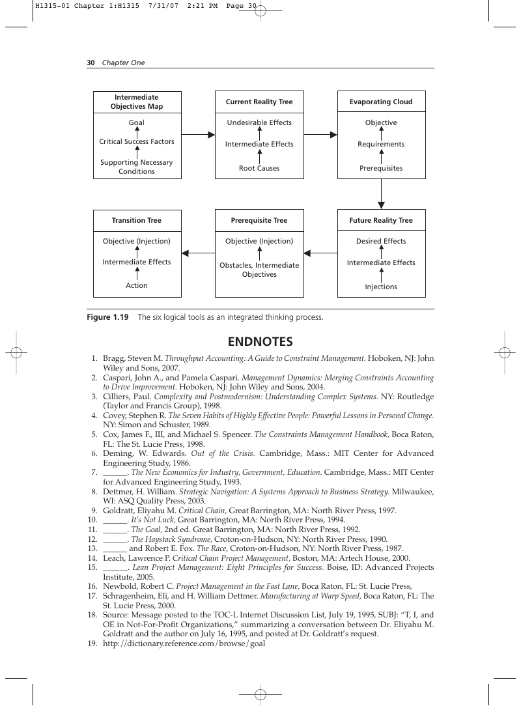

Intermediate Objectives Map Current Reality Tree Evaporating Cloud Goal Undesirable Effects Objective Critical Success Factors Intermediate Effects Requirements Supporting Necessary Conditions Root Causes Prerequisites Transition Tree Prerequisite Tree Future Reality Tree

The six logical tools as an integrated thinking process.

### Endnotes

1. Bragg, Steven M. Throughput Accounting: A Guide to Constraint Management. Hoboken, NJ: John Wiley and Sons, 2007.
2. Caspari, John A., and Pamela Caspari. Management Dynamics: Merging Constraints Accounting to Drive Improvement. Hoboken, NJ: John Wiley and Sons, 2004.
3. Cilliers, Paul. Complexity and Postmodernism: Understanding Complex Systems. NY: Routledge (Taylor and Francis Group), 1998.
4. Covey, Stephen R. The Seven Habits of Highly Effective People: Powerful Lessons in Personal Change. NY: Simon and Schuster, 1989.
5. Cox, James F., III, and Michael S. Spencer. The Constraints Management Handbook, Boca Raton, FL: The St. Lucie Press, 1998.
6. Deming, W. Edwards. Out of the Crisis. Cambridge, Mass.: MIT Center for Advanced Engineering Study, 1986.
7. ______. The New Economics for Industry, Government, Education. Cambridge, Mass.: MIT Center for Advanced Engineering Study, 1993.
8. Dettmer, H. William. Strategic Navigation: A Systems Approach to Business Strategy. Milwaukee, WI: ASQ Quality Press, 2003.
9. Goldratt, Eliyahu M. Critical Chain, Great Barrington, MA: North River Press, 1997.
10. ______. It’s Not Luck, Great Barrington, MA: North River Press, 1994.
11. ______. The Goal, 2nd ed. Great Barrington, MA: North River Press, 1992.
12. ______. The Haystack Syndrome, Croton-on-Hudson, NY: North River Press, 1990.
13. ______ and Robert E. Fox. The Race, Croton-on-Hudson, NY: North River Press, 1987.
14. Leach, Lawrence P. Critical Chain Project Management, Boston, MA: Artech House, 2000.
15. ______. Lean Project Management: Eight Principles for Success. Boise, ID: Advanced Projects Institute, 2005.
16. Newbold, Robert C. Project Management in the Fast Lane, Boca Raton, FL: St. Lucie Press,
17. Schragenheim, Eli, and H. William Dettmer. Manufacturing at Warp Speed, Boca Raton, FL: The St. Lucie Press, 2000.
18. Source: Message posted to the TOC-L Internet Discussion List, July 19, 1995, SUBJ: “T, I, and OE in Not-For-Profit Organizations,” summarizing a conversation between Dr. Eliyahu M. Goldratt and the author on July 16, 1995, and posted at Dr. Goldratt’s request.
19. http://dictionary.reference.com/browse/goal

