# Chapter 2: Categories of Legitimate Reservation

1. CLARITY
2. ENTITY EXISTENCE
3. CAUSALITY EXISTENCE
4. CAUSE INSUFFICIENCY
5. ADDITIONAL CAUSE
6. CAUSE-EFFECT REVERSAL
7. PREDICTED EFFECT EXISTENCE
8. TAUTOLOGY

> When both logic and intuition agree, you are always right.
>
> —Unknown

The Logical Thinking Process is composed of logical tools. The emphasis here is on the word “logic” for a good reason. A lot of problem-analysis tools use graphical representations. Flowcharts, “fishbone” diagrams, and tree and affinity diagrams are typical examples. But none of these diagrams are, strictly speaking, logic tools, because they don’t incorporate any rigorous criteria for validating the connections between one element and another. In most cases, they’re somebody’s perception of the relationship.

The most significant difference between the Logical Thinking Process and traditional problem-analysis tools is a series of rules that govern the acceptability of the connections in each of the trees. These rules of logic are called the Categories of Legitimate Reservation—often abbreviated as CLR. The CLR are what differentiate somebody’s perception from an accurate representation of existing reality. A thorough understanding of these logical rules is absolutely essential to your success in using the logic trees. While the rules are not difficult to understand, there are eight of them, and it requires some study and practice to keep them straight in your mind and to know when each one applies. So what, exactly, are these Categories of The CLR constitute a framework of eight specific tests, or proofs, used to verify cause-andeffect logic. The eight proofs consist of: Legitimate Reservation?

### Definition

1. Clarity
2. Entity existence
3. Causality existence
4. Cause insufficiency
5. Additional cause
6. Cause-effect reversal
7. Predicted effect existence
8. Tautology

### Purpose

The Categories of Legitimate Reservation are the foundation upon which logic in general, and the Logical Thinking Process in particular, are built. The CLR can be used for a number of purposes. Although they were designed to verify the validity of cause-and-effect logic trees, they can be applied in other ways, too. Some of these applications include:

- Use by a tree builder to initially construct the six structures of the Logical Thinking Process (Intermediate Objectives Map, Current Reality Tree, Evaporating Cloud, Future Reality Tree, Prerequisite Tree, and Transition Tree).
- Use by a tree builder to self-check the tree after construction.
- Use by a scrutinizer with subject matter knowledge to review and evaluate a tree built and presented by someone else.
- Use by a facilitator in a group setting to ensure that both scrutinizers and presenters adhere to the rules of logic.
- Use by a scrutinizer or facilitator to communicate disagreement with the cause-andeffect logic of a presenter’s tree in a way that fosters consensus and discourages confrontation.
- Use by anyone in interactive discussion, not associated with logic trees, to evaluate and challenge or accept the validity of logic in the statements of others without offending or generating animosity.
- Use by anyone in evaluating the validity of logic in written text (books, magazines or journals, newspapers, advertising, and the like).

**NOTE:** It would be appropriate here to define some new terms we just introduced. A tree builder is one who uses the procedures of the Logical Thinking Process to construct one of the six trees described at the end of Chapter 1. A scrutinizer is one who did not participate in the construction of the logic tree, but who has content knowledge of the subject matter addressed in the tree and who has been enlisted to critique the work of the tree builder. A scrutinizer does not necessarily need to understand the CLR to provide critique of the content or logical connections, but it helps. A facilitator is one who has been enlisted by a tree builder to ensure that scrutiny is conducted in accordance with the CLR. The facilitator does not necessarily need to have content knowledge of the subject matter of the tree, but must be knowledgeable in the CLR to facilitate scrutiny effectively.

### Assumptions

1. Tree builders want to construct logically sound trees
2. Tree builders, at some point, will also present their trees to others to communicate and elicit action
3. Tree builders/presenters naturally develop an emotional attachment to their own trees (“pride of the inventor”)
4. Tree builders/presenters often express cause-and-effect connections that are intuitive to themselves but not to others (that is, intermediate steps appear to be missing)
5. Tree builders/presenters don’t want to be embarrassed by presenting logically weak trees
6. Presenters look for affirmation as well as constructive advice on their trees
7. Presenters are sensitive to criticism of their work
8. Presenters can accept, even welcome, constructive advice when they solicit it, and if it is offered in a non-threatening way (that is, not “You against me,” but “You and I against the system”)
9. Scrutinizers are truly interested in helping presenters to improve their trees and in contributing to the analysis of the subject
10. Scrutinizers are not interested in humiliating presenters or in bolstering their own egos by their scrutiny
11. Scrutinizers have substantial intuition in the area of the tree’s subject matter
12. Facilitators concern themselves exclusively with the logical process and not with subject matter content

### How to Use This Chapter

This chapter is composed of text with accompanying illustrations. Figure 2.36 at the end of the chapter is designed to be used as a checklist, or for quick reference, after the entire chapter has been read.

- Read all of Chapter 2 and the accompanying examples to understand the circumstances in which each applies.
- Review Figure 2.36, “Categories of Legitimate Reservation: Self-Scrutiny Checklist,” which provides a concise checklist that you can use for constructing and scrutinizing your own cause-effect trees. The weaker the argument, the stronger the words.

> —Unknown

### Description of the Categories of Legitimate Reservation

> I know you think you understand what you think I said, but I’m not sure you realize that what you heard is not what I meant.
>
> —Unknown

#### 1. Clarity

Clarity is always the first reservation one should consider when questioning the logic of cause and effect. Clarity is not, strictly speaking, a logic-based reservation. Its roots are in communication.

#### Why Clarity Comes First

Clarity is raised first so that any misunderstandings resulting from inaccurate or incomplete communication of an idea are eliminated before the logic is examined. Most conflict in any situation involves communication breakdown to some extent. The clarity reservation helps defuse potential conflict between speaker and listener early in the scrutiny process and helps keep it on a professional rather than a personal level. Raising the clarity reservation first establishes the protocol for the use of all the other categories. Stated briefly, in the words of Stephen R. Covey (The Seven Habits of Highly Effective People), that protocol is:1:236-260 Seek to understand before seeking to be understood. By following this protocol we ensure that ineffective communication doesn’t compromise logic.

#### What Clarity Means

A clarity reservation means that a listener doesn’t comprehend the speaker. Since the clarity reservation is the first step in a check of logical validity, be sure that you and the speaker agree on the meaning of the speaker’s statement. Whether the listener agrees with the content of the speaker’s statement is not at issue in a clarity reservation—just the meaning. Validity of logic is not addressed until mutual understanding is achieved. Some indications or examples of a breakdown in communication:

- The listener doesn’t understand the meaning of the speaker’s statement.
- The listener doesn’t see the significance of the speaker’s statement.

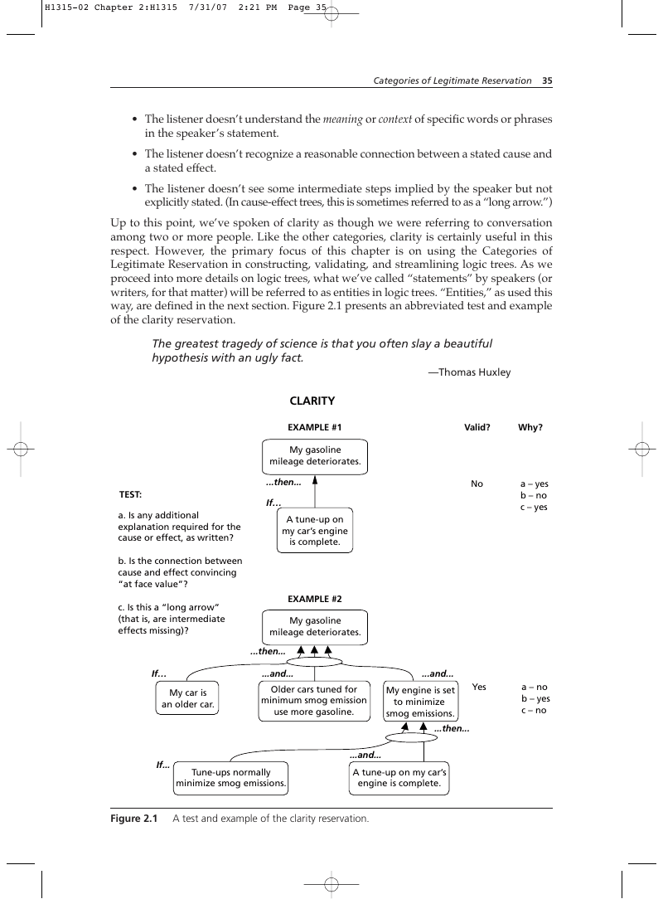

- The listener doesn’t understand the meaning or context of specific words or phrases in the speaker’s statement.
- The listener doesn’t recognize a reasonable connection between a stated cause and a stated effect.
- The listener doesn’t see some intermediate steps implied by the speaker but not explicitly stated. (In cause-effect trees, this is sometimes referred to as a “long arrow.”) Up to this point, we’ve spoken of clarity as though we were referring to conversation among two or more people. Like the other categories, clarity is certainly useful in this respect. However, the primary focus of this chapter is on using the Categories of Legitimate Reservation in constructing, validating, and streamlining logic trees. As we proceed into more details on logic trees, what we’ve called “statements” by speakers (or writers, for that matter) will be referred to as entities in logic trees. “Entities,” as used this way, are defined in the next section. Figure 2.1 presents an abbreviated test and example of the clarity reservation. The greatest tragedy of science is that you often slay a beautiful hypothesis with an ugly fact.

> —Thomas Huxley

A tune-up on my car’s engine is complete.

b. Is the connection between cause and effect convincing “at face value”? c. Is this a “long arrow” (that is, are intermediate effects missing)?

EXAMPLE #2 My gasoline mileage deteriorates.

My car is an older car.

Older cars tuned for minimum smog emission use more gasoline.

My engine is set to minimize smog emissions.

A tune-up on my car’s engine is complete.

A test and example of the clarity reservation.

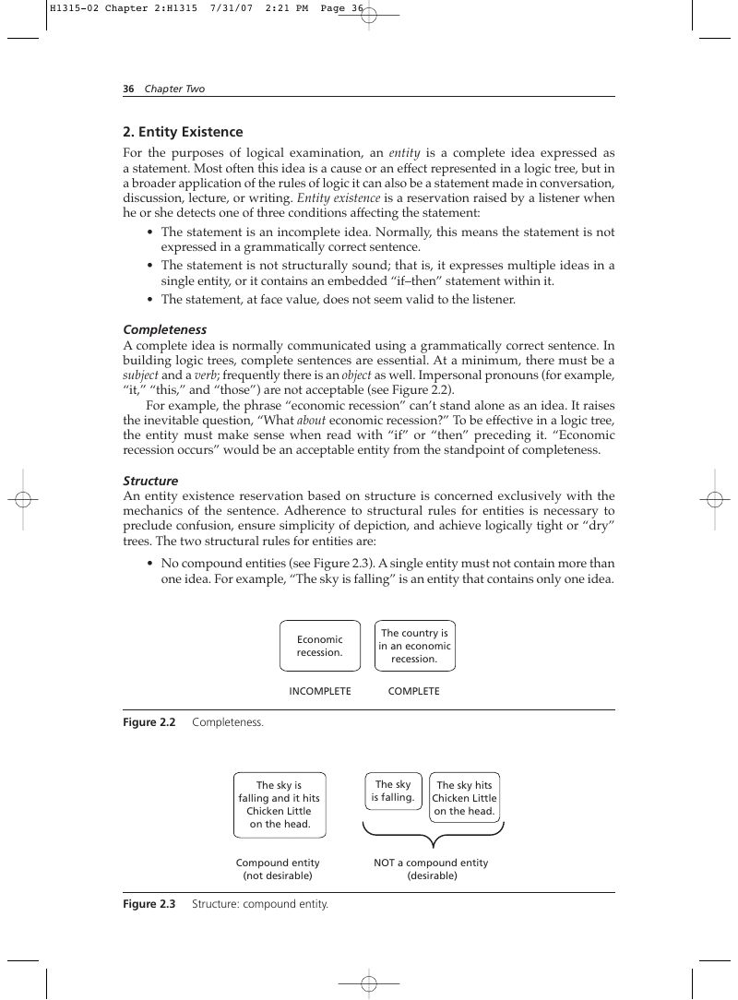

#### 2. Entity Existence

For the purposes of logical examination, an entity is a complete idea expressed as a statement. Most often this idea is a cause or an effect represented in a logic tree, but in a broader application of the rules of logic it can also be a statement made in conversation, discussion, lecture, or writing. Entity existence is a reservation raised by a listener when he or she detects one of three conditions affecting the statement:

- The statement is an incomplete idea. Normally, this means the statement is not expressed in a grammatically correct sentence.
- The statement is not structurally sound; that is, it expresses multiple ideas in a single entity, or it contains an embedded “if–then” statement within it.
- The statement, at face value, does not seem valid to the listener.

#### Completeness

A complete idea is normally communicated using a grammatically correct sentence. In building logic trees, complete sentences are essential. At a minimum, there must be a subject and a verb; frequently there is an object as well. Impersonal pronouns (for example, “it,” “this,” and “those”) are not acceptable (see Figure 2.2). For example, the phrase “economic recession” can’t stand alone as an idea. It raises the inevitable question, “What about economic recession?” To be effective in a logic tree, the entity must make sense when read with “if” or “then” preceding it. “Economic recession occurs” would be an acceptable entity from the standpoint of completeness.

#### Structure

An entity existence reservation based on structure is concerned exclusively with the mechanics of the sentence. Adherence to structural rules for entities is necessary to preclude confusion, ensure simplicity of depiction, and achieve logically tight or “dry” trees. The two structural rules for entities are:

- No compound entities (see Figure 2.3). A single entity must not contain more than one idea. For example, “The sky is falling” is an entity that contains only one idea.

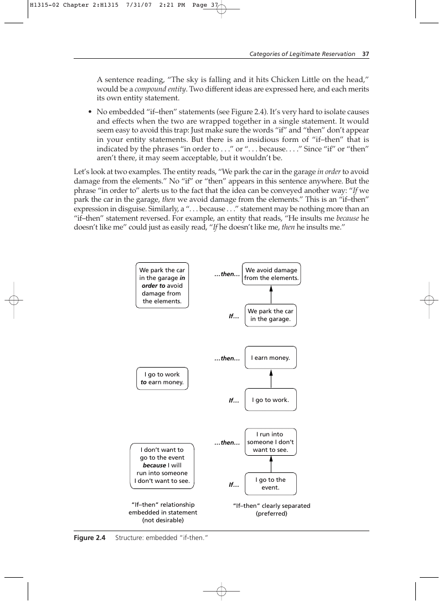

A sentence reading, “The sky is falling and it hits Chicken Little on the head,” would be a compound entity. Two different ideas are expressed here, and each merits its own entity statement.

- No embedded “if–then” statements (see Figure 2.4). It’s very hard to isolate causes and effects when the two are wrapped together in a single statement. It would seem easy to avoid this trap: Just make sure the words “if” and “then” don’t appear in your entity statements. But there is an insidious form of “if–then” that is indicated by the phrases “in order to . . .” or “. . . because. . . .” Since “if” or “then” aren’t there, it may seem acceptable, but it wouldn’t be. Let’s look at two examples. The entity reads, “We park the car in the garage in order to avoid damage from the elements.” No “if” or “then” appears in this sentence anywhere. But the phrase “in order to” alerts us to the fact that the idea can be conveyed another way: “If we park the car in the garage, then we avoid damage from the elements.” This is an “if–then” expression in disguise. Similarly, a “. . . because . . .” statement may be nothing more than an “if–then” statement reversed. For example, an entity that reads, “He insults me because he doesn’t like me” could just as easily read, “If he doesn’t like me, then he insults me.”

We park the car in the garage in order to avoid damage from the elements.

We avoid damage from the elements.

We park the car in the garage.

I go to work to earn money.

…then… I don’t want to go to the event because I will run into someone I don’t want to see.

I run into someone I don’t want to see.

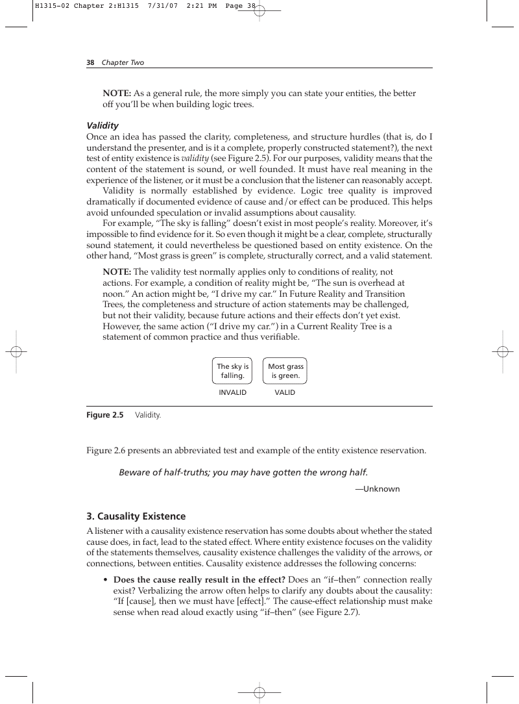

**NOTE:** As a general rule, the more simply you can state your entities, the better off you’ll be when building logic trees.

#### Validity

Once an idea has passed the clarity, completeness, and structure hurdles (that is, do I understand the presenter, and is it a complete, properly constructed statement?), the next test of entity existence is validity (see Figure 2.5). For our purposes, validity means that the content of the statement is sound, or well founded. It must have real meaning in the experience of the listener, or it must be a conclusion that the listener can reasonably accept. Validity is normally established by evidence. Logic tree quality is improved dramatically if documented evidence of cause and/or effect can be produced. This helps avoid unfounded speculation or invalid assumptions about causality. For example, “The sky is falling” doesn’t exist in most people’s reality. Moreover, it’s impossible to find evidence for it. So even though it might be a clear, complete, structurally sound statement, it could nevertheless be questioned based on entity existence. On the other hand, “Most grass is green” is complete, structurally correct, and a valid statement.

**NOTE:** The validity test normally applies only to conditions of reality, not actions. For example, a condition of reality might be, “The sun is overhead at noon.” An action might be, “I drive my car.” In Future Reality and Transition Trees, the completeness and structure of action statements may be challenged, but not their validity, because future actions and their effects don’t yet exist. However, the same action (“I drive my car.”) in a Current Reality Tree is a statement of common practice and thus verifiable.

> Figure 2.6 presents an abbreviated test and example of the entity existence reservation. Beware of half-truths; you may have gotten the wrong half.
>
> —Unknown

#### 3. Causality Existence

A listener with a causality existence reservation has some doubts about whether the stated cause does, in fact, lead to the stated effect. Where entity existence focuses on the validity of the statements themselves, causality existence challenges the validity of the arrows, or connections, between entities. Causality existence addresses the following concerns:

- Does the cause really result in the effect? Does an “if–then” connection really exist? Verbalizing the arrow often helps to clarify any doubts about the causality: “If [cause], then we must have [effect].” The cause-effect relationship must make sense when read aloud exactly using “if–then” (see Figure 2.7).

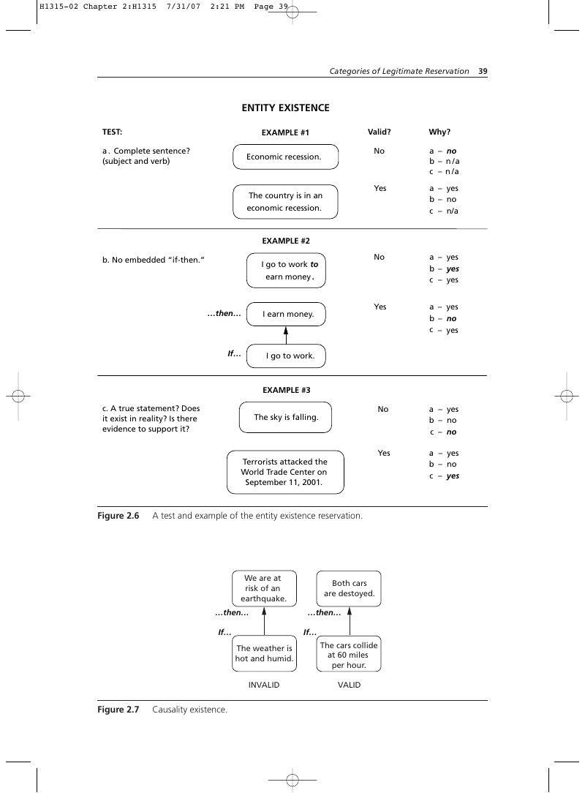

a – no b – n /a c – n /a EXAMPLE #3 c. A true statement? Does it exist in reality? Is there evidence to support it?

EXAMPLE #2 b. No embedded “if-then.”

I go to work to earn money .

Terrorists attacked the World Trade Center on September 11, 2001.

A test and example of the entity existence reservation.

We are at risk of an earthquake.

The weather is hot and humid.

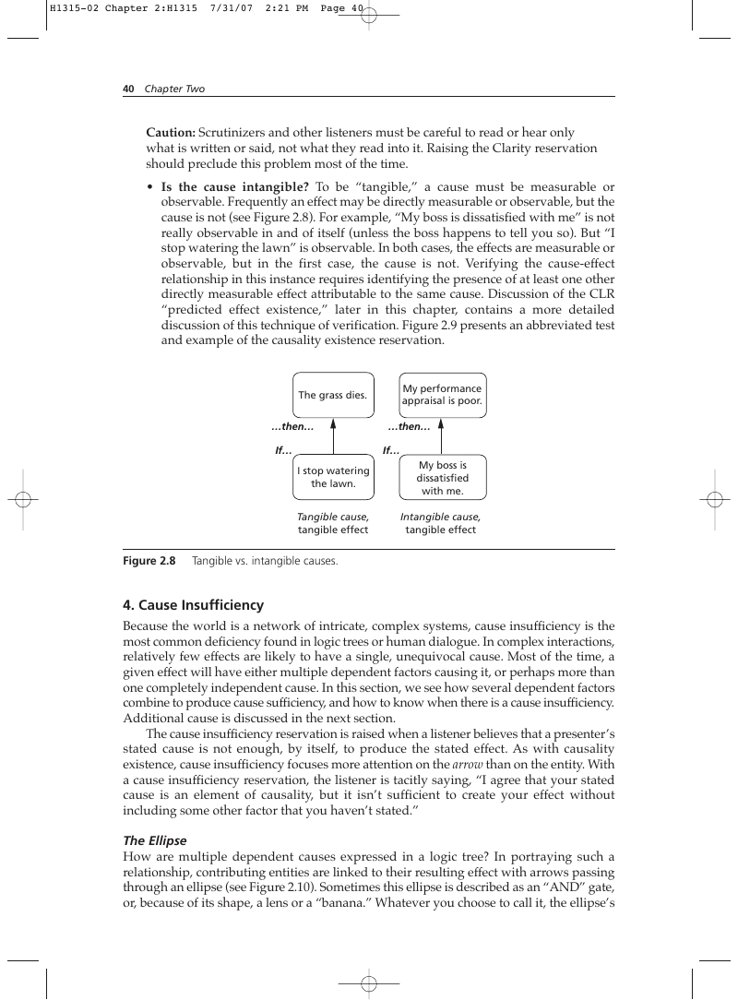

Caution: Scrutinizers and other listeners must be careful to read or hear only what is written or said, not what they read into it. Raising the Clarity reservation should preclude this problem most of the time.

- Is the cause intangible? To be “tangible,” a cause must be measurable or observable. Frequently an effect may be directly measurable or observable, but the cause is not (see Figure 2.8). For example, “My boss is dissatisfied with me” is not really observable in and of itself (unless the boss happens to tell you so). But “I stop watering the lawn” is observable. In both cases, the effects are measurable or observable, but in the first case, the cause is not. Verifying the cause-effect relationship in this instance requires identifying the presence of at least one other directly measurable effect attributable to the same cause. Discussion of the CLR “predicted effect existence,” later in this chapter, contains a more detailed discussion of this technique of verification. Figure 2.9 presents an abbreviated test and example of the causality existence reservation.

If… I stop watering the lawn.

My boss is dissatisfied with me.

#### 4. Cause Insufficiency

Because the world is a network of intricate, complex systems, cause insufficiency is the most common deficiency found in logic trees or human dialogue. In complex interactions, relatively few effects are likely to have a single, unequivocal cause. Most of the time, a given effect will have either multiple dependent factors causing it, or perhaps more than one completely independent cause. In this section, we see how several dependent factors combine to produce cause sufficiency, and how to know when there is a cause insufficiency. Additional cause is discussed in the next section. The cause insufficiency reservation is raised when a listener believes that a presenter’s stated cause is not enough, by itself, to produce the stated effect. As with causality existence, cause insufficiency focuses more attention on the arrow than on the entity. With a cause insufficiency reservation, the listener is tacitly saying, “I agree that your stated cause is an element of causality, but it isn’t sufficient to create your effect without including some other factor that you haven’t stated.”

#### The Ellipse

How are multiple dependent causes expressed in a logic tree? In portraying such a relationship, contributing entities are linked to their resulting effect with arrows passing through an ellipse (see Figure 2.10). Sometimes this ellipse is described as an “AND” gate, or, because of its shape, a lens or a “banana.” Whatever you choose to call it, the ellipse’s

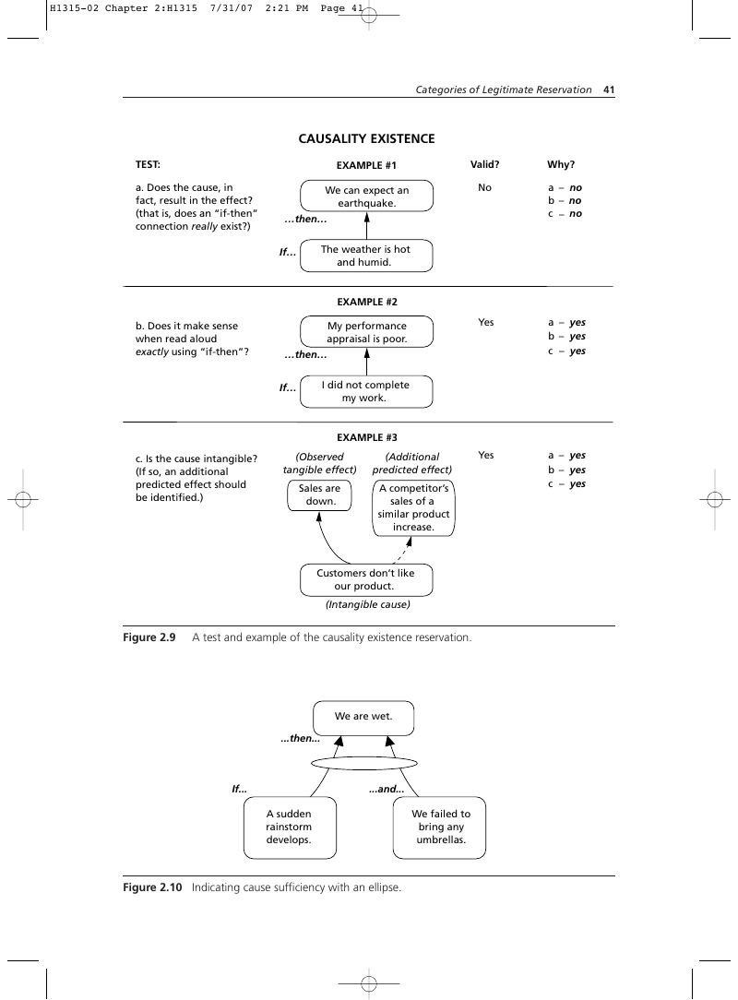

…then… The weather is hot and humid.

My performance appraisal is poor. …then… I did not complete my work.

EXAMPLE #3 c. Is the cause intangible? (If so, an additional predicted effect should be identified.) (Observed function is to identify and enclose the major contributing causes that are sufficient in concert but not alone to produce the effect.

A competitor’s sales of a similar product increase.

A test and example of the causality existence reservation.

Figure 2.10 Indicating cause sufficiency with an ellipse.

We failed to bring any umbrellas.

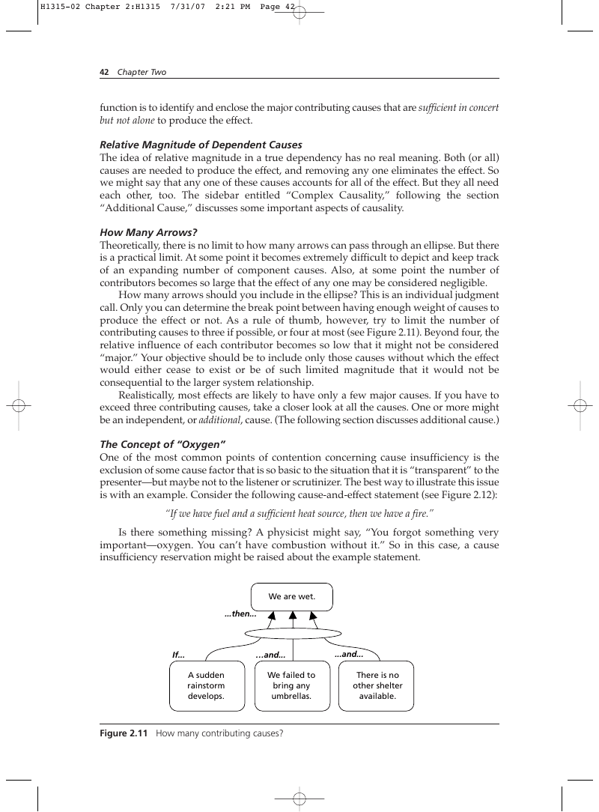

#### Relative Magnitude of Dependent Causes

The idea of relative magnitude in a true dependency has no real meaning. Both (or all) causes are needed to produce the effect, and removing any one eliminates the effect. So we might say that any one of these causes accounts for all of the effect. But they all need each other, too. The sidebar entitled “Complex Causality,” following the section “Additional Cause,” discusses some important aspects of causality.

#### How Many Arrows?

Theoretically, there is no limit to how many arrows can pass through an ellipse. But there is a practical limit. At some point it becomes extremely difficult to depict and keep track of an expanding number of component causes. Also, at some point the number of contributors becomes so large that the effect of any one may be considered negligible. How many arrows should you include in the ellipse? This is an individual judgment call. Only you can determine the break point between having enough weight of causes to produce the effect or not. As a rule of thumb, however, try to limit the number of contributing causes to three if possible, or four at most (see Figure 2.11). Beyond four, the relative influence of each contributor becomes so low that it might not be considered “major.” Your objective should be to include only those causes without which the effect would either cease to exist or be of such limited magnitude that it would not be consequential to the larger system relationship. Realistically, most effects are likely to have only a few major causes. If you have to exceed three contributing causes, take a closer look at all the causes. One or more might be an independent, or additional, cause. (The following section discusses additional cause.) The Concept of “Oxygen” One of the most common points of contention concerning cause insufficiency is the exclusion of some cause factor that is so basic to the situation that it is “transparent” to the presenter—but maybe not to the listener or scrutinizer. The best way to illustrate this issue is with an example. Consider the following cause-and-effect statement (see Figure 2.12): “If we have fuel and a sufficient heat source, then we have a fire.” Is there something missing? A physicist might say, “You forgot something very important—oxygen. You can’t have combustion without it.” So in this case, a cause insufficiency reservation might be raised about the example statement.

We failed to bring any umbrellas.

...and... There is no other shelter available.

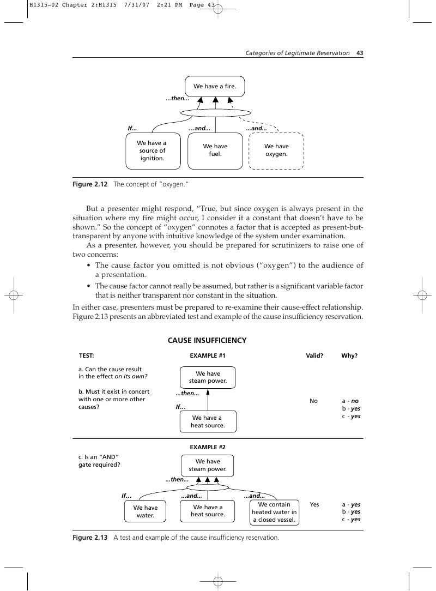

We have a source of ignition.

Figure 2.12 The concept of “oxygen.”

But a presenter might respond, “True, but since oxygen is always present in the situation where my fire might occur, I consider it a constant that doesn’t have to be shown.” So the concept of “oxygen” connotes a factor that is accepted as present-buttransparent by anyone with intuitive knowledge of the system under examination. As a presenter, however, you should be prepared for scrutinizers to raise one of two concerns:

- The cause factor you omitted is not obvious (“oxygen”) to the audience of a presentation.
- The cause factor cannot really be assumed, but rather is a significant variable factor that is neither transparent nor constant in the situation. In either case, presenters must be prepared to re-examine their cause-effect relationship. Figure 2.13 presents an abbreviated test and example of the cause insufficiency reservation.

a. Can the cause result in the effect on its own? b. Must it exist in concert with one or more other causes? Valid? Why?

...then... If… We have a heat source.

...and... We contain heated water in a closed vessel.

Figure 2.13 A test and example of the cause insufficiency reservation.

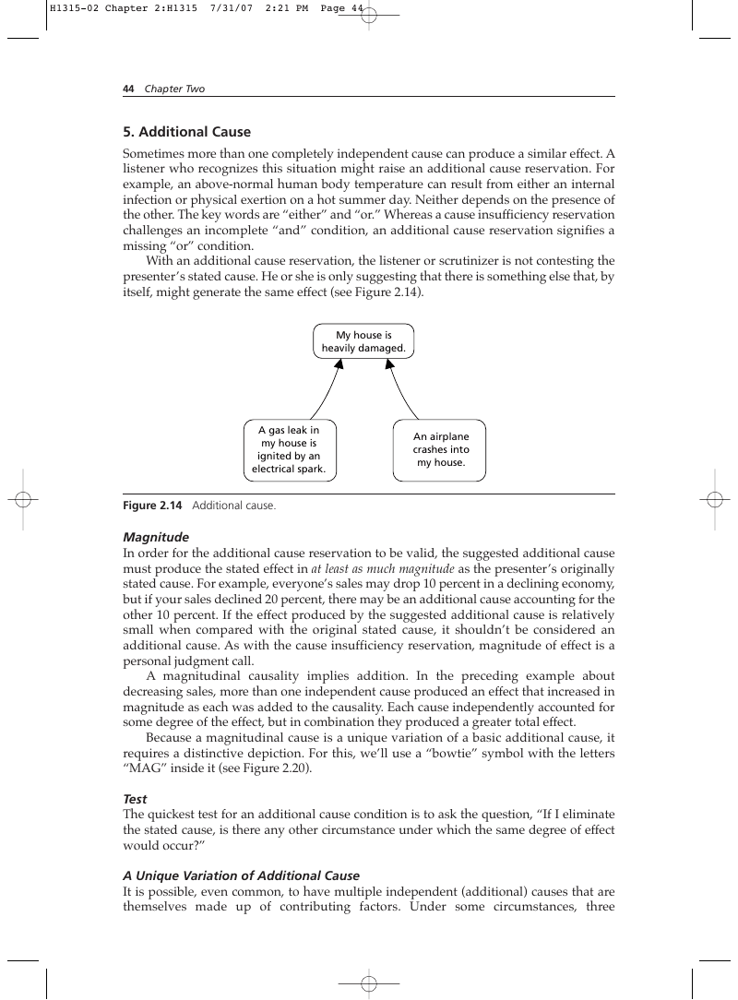

#### 5. Additional Cause

Sometimes more than one completely independent cause can produce a similar effect. A listener who recognizes this situation might raise an additional cause reservation. For example, an above-normal human body temperature can result from either an internal infection or physical exertion on a hot summer day. Neither depends on the presence of the other. The key words are “either” and “or.” Whereas a cause insufficiency reservation challenges an incomplete “and” condition, an additional cause reservation signifies a missing “or” condition. With an additional cause reservation, the listener or scrutinizer is not contesting the presenter’s stated cause. He or she is only suggesting that there is something else that, by itself, might generate the same effect (see Figure 2.14). My house is heavily damaged.

A gas leak in my house is ignited by an electrical spark.

An airplane crashes into my house.

#### Magnitude

In order for the additional cause reservation to be valid, the suggested additional cause must produce the stated effect in at least as much magnitude as the presenter’s originally stated cause. For example, everyone’s sales may drop 10 percent in a declining economy, but if your sales declined 20 percent, there may be an additional cause accounting for the other 10 percent. If the effect produced by the suggested additional cause is relatively small when compared with the original stated cause, it shouldn’t be considered an additional cause. As with the cause insufficiency reservation, magnitude of effect is a personal judgment call. A magnitudinal causality implies addition. In the preceding example about decreasing sales, more than one independent cause produced an effect that increased in magnitude as each was added to the causality. Each cause independently accounted for some degree of the effect, but in combination they produced a greater total effect. Because a magnitudinal cause is a unique variation of a basic additional cause, it requires a distinctive depiction. For this, we’ll use a “bowtie” symbol with the letters “MAG” inside it (see Figure 2.20). Test The quickest test for an additional cause condition is to ask the question, “If I eliminate the stated cause, is there any other circumstance under which the same degree of effect would occur?”

#### A Unique Variation of Additional Cause

It is possible, even common, to have multiple independent (additional) causes that are themselves made up of contributing factors. Under some circumstances, three contributing entities with arrows passing through an ellipse to an effect may be considered one independent cause, if that effect can also be caused by something else. That “something else” may, itself, be composed of multiple causes joined by an ellipse (see Figure 2.15). In such cases, each ellipsed group is considered an additional cause, but cause sufficiency rules still apply within the ellipse. Figure 2.16 presents an abbreviated test and example of the additional cause reservation. Our family has an enjoyable vacation.

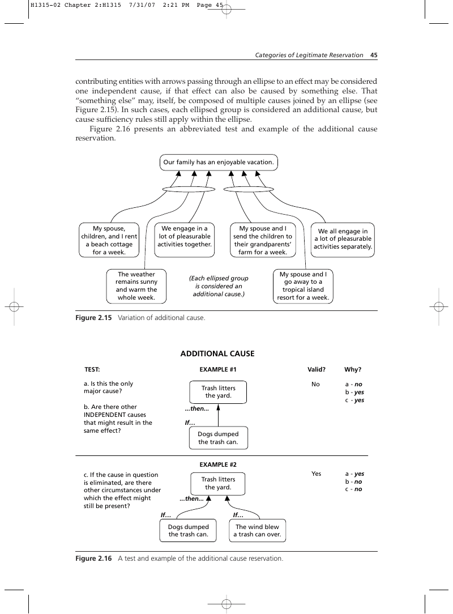

My spouse, children, and I rent a beach cottage for a week.

We engage in a lot of pleasurable activities together.

The weather remains sunny and warm the whole week.

My spouse and I send the children to their grandparents’ farm for a week.

We all engage in a lot of pleasurable activities separately.

My spouse and I go away to a tropical island resort for a week.

...then... If… Dogs dumped the trash can.

EXAMPLE #2 c. If the cause in question is eliminated, are there other circumstances under which the effect might still be present? If…

If… The wind blew a trash can over.

Figure 2.16 A test and example of the additional cause reservation.

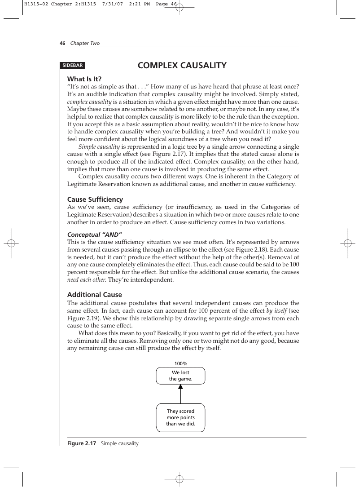

#### What Is It?

“It’s not as simple as that . . .” How many of us have heard that phrase at least once? It’s an audible indication that complex causality might be involved. Simply stated, complex causality is a situation in which a given effect might have more than one cause. Maybe these causes are somehow related to one another, or maybe not. In any case, it’s helpful to realize that complex causality is more likely to be the rule than the exception. If you accept this as a basic assumption about reality, wouldn’t it be nice to know how to handle complex causality when you’re building a tree? And wouldn’t it make you feel more confident about the logical soundness of a tree when you read it? Simple causality is represented in a logic tree by a single arrow connecting a single cause with a single effect (see Figure 2.17). It implies that the stated cause alone is enough to produce all of the indicated effect. Complex causality, on the other hand, implies that more than one cause is involved in producing the same effect. Complex causality occurs two different ways. One is inherent in the Category of Legitimate Reservation known as additional cause, and another in cause sufficiency.

#### Cause Sufficiency

As we’ve seen, cause sufficiency (or insufficiency, as used in the Categories of Legitimate Reservation) describes a situation in which two or more causes relate to one another in order to produce an effect. Cause sufficiency comes in two variations. Conceptual “AND” This is the cause sufficiency situation we see most often. It’s represented by arrows from several causes passing through an ellipse to the effect (see Figure 2.18). Each cause is needed, but it can’t produce the effect without the help of the other(s). Removal of any one cause completely eliminates the effect. Thus, each cause could be said to be 100 percent responsible for the effect. But unlike the additional cause scenario, the causes need each other. They’re interdependent.

#### Additional Cause

The additional cause postulates that several independent causes can produce the same effect. In fact, each cause can account for 100 percent of the effect by itself (see Figure 2.19). We show this relationship by drawing separate single arrows from each cause to the same effect. What does this mean to you? Basically, if you want to get rid of the effect, you have to eliminate all the causes. Removing only one or two might not do any good, because any remaining cause can still produce the effect by itself. 100% We lost the game.

They scored more points than we did.

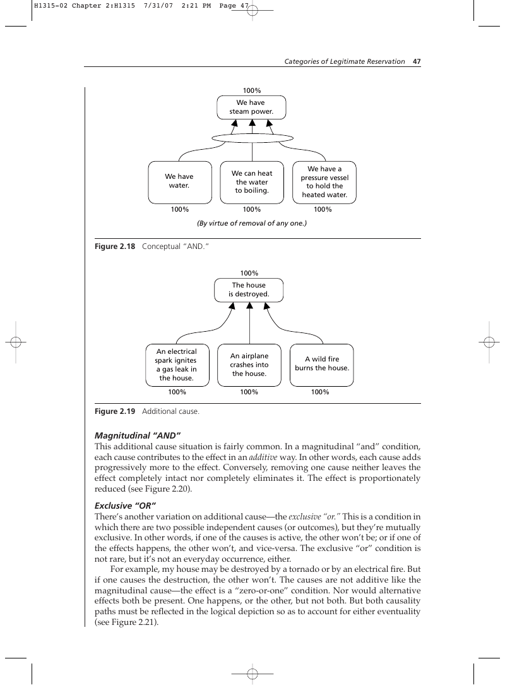

We can heat the water to boiling.

We have a pressure vessel to hold the heated water.

Figure 2.18 Conceptual “AND.” 100% The house is destroyed.

An electrical spark ignites a gas leak in the house.

An airplane crashes into the house.

A wild fire burns the house.

Magnitudinal “AND” This additional cause situation is fairly common. In a magnitudinal “and” condition, each cause contributes to the effect in an additive way. In other words, each cause adds progressively more to the effect. Conversely, removing one cause neither leaves the effect completely intact nor completely eliminates it. The effect is proportionately reduced (see Figure 2.20). Exclusive “OR” There’s another variation on additional cause—the exclusive “or.” This is a condition in which there are two possible independent causes (or outcomes), but they’re mutually exclusive. In other words, if one of the causes is active, the other won’t be; or if one of the effects happens, the other won’t, and vice-versa. The exclusive “or” condition is not rare, but it’s not an everyday occurrence, either. For example, my house may be destroyed by a tornado or by an electrical fire. But if one causes the destruction, the other won’t. The causes are not additive like the magnitudinal cause—the effect is a “zero-or-one” condition. Nor would alternative effects both be present. One happens, or the other, but not both. But both causality paths must be reflected in the logical depiction so as to account for either eventuality (see Figure 2.21).

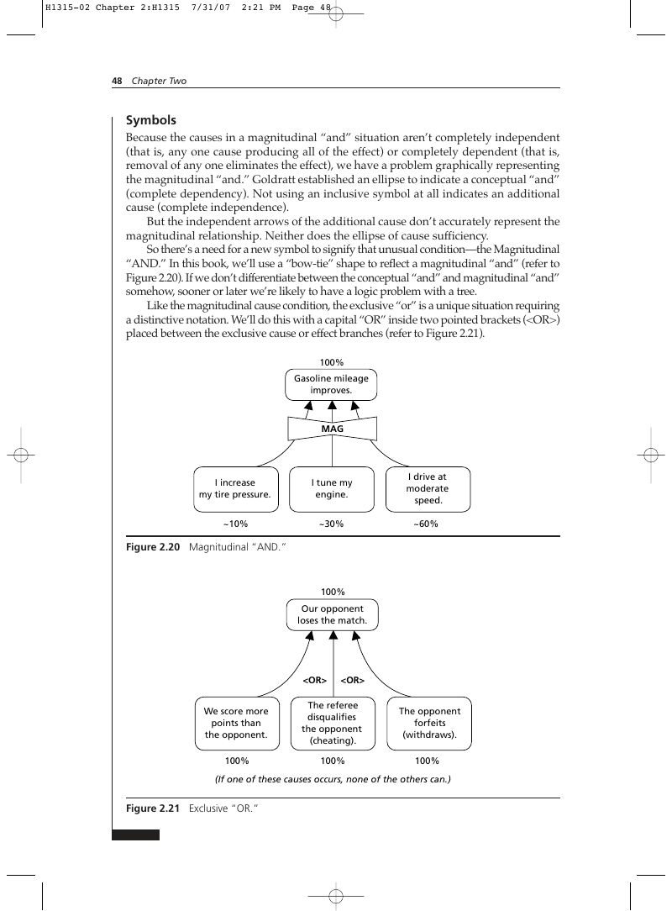

#### Symbols

Because the causes in a magnitudinal “and” situation aren’t completely independent (that is, any one cause producing all of the effect) or completely dependent (that is, removal of any one eliminates the effect), we have a problem graphically representing the magnitudinal “and.” Goldratt established an ellipse to indicate a conceptual “and” (complete dependency). Not using an inclusive symbol at all indicates an additional cause (complete independence). But the independent arrows of the additional cause don’t accurately represent the magnitudinal relationship. Neither does the ellipse of cause sufficiency. So there’s a need for a new symbol to signify that unusual condition—the Magnitudinal “AND.” In this book, we’ll use a “bow-tie” shape to reflect a magnitudinal “and” (refer to Figure 2.20). If we don’t differentiate between the conceptual “and” and magnitudinal “and” somehow, sooner or later we’re likely to have a logic problem with a tree. Like the magnitudinal cause condition, the exclusive “or” is a unique situation requiring a distinctive notation. We’ll do this with a capital “OR” inside two pointed brackets (<OR>) placed between the exclusive cause or effect branches (refer to Figure 2.21). 100% Gasoline mileage improves.

100% Our opponent loses the match.

We score more points than the opponent.

The referee disqualifies the opponent (cheating).

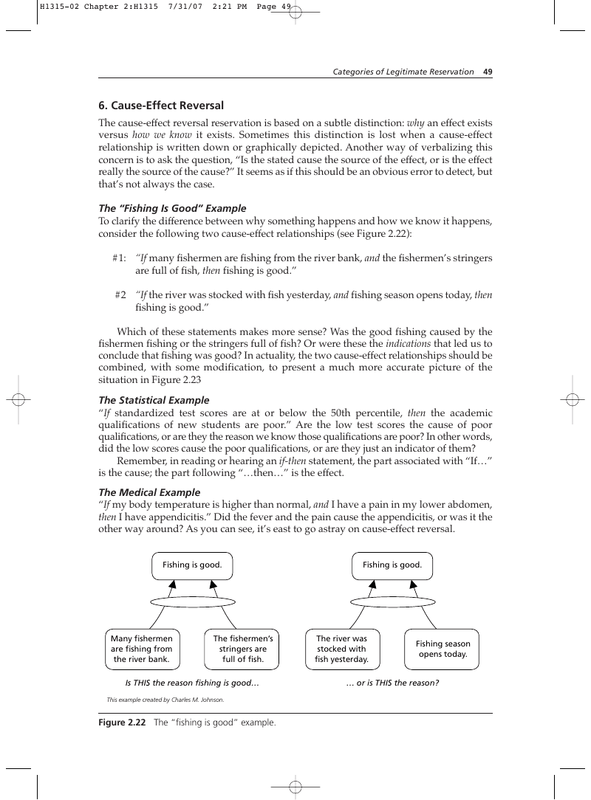

#### 6. Cause-Effect Reversal

The cause-effect reversal reservation is based on a subtle distinction: why an effect exists versus how we know it exists. Sometimes this distinction is lost when a cause-effect relationship is written down or graphically depicted. Another way of verbalizing this concern is to ask the question, “Is the stated cause the source of the effect, or is the effect really the source of the cause?” It seems as if this should be an obvious error to detect, but that’s not always the case.

#### The “Fishing Is Good” Example

To clarify the difference between why something happens and how we know it happens, consider the following two cause-effect relationships (see Figure 2.22): #1: “If many fishermen are fishing from the river bank, and the fishermen’s stringers are full of fish, then fishing is good.” #2 “If the river was stocked with fish yesterday, and fishing season opens today, then fishing is good.” Which of these statements makes more sense? Was the good fishing caused by the fishermen fishing or the stringers full of fish? Or were these the indications that led us to conclude that fishing was good? In actuality, the two cause-effect relationships should be combined, with some modification, to present a much more accurate picture of the situation in Figure 2.23

#### The Statistical Example

“If standardized test scores are at or below the 50th percentile, then the academic qualifications of new students are poor.” Are the low test scores the cause of poor qualifications, or are they the reason we know those qualifications are poor? In other words, did the low scores cause the poor qualifications, or are they just an indicator of them? Remember, in reading or hearing an if-then statement, the part associated with “If…” is the cause; the part following “…then…” is the effect.

#### The Medical Example

“If my body temperature is higher than normal, and I have a pain in my lower abdomen, then I have appendicitis.” Did the fever and the pain cause the appendicitis, or was it the other way around? As you can see, it’s east to go astray on cause-effect reversal.

Many fishermen are fishing from the river bank.

The fishermen’s stringers are full of fish.

Is THIS the reason fishing is good… This example created by Charles M. Johnson.

Figure 2.22 The “fishing is good” example.

The river was stocked with fish yesterday.

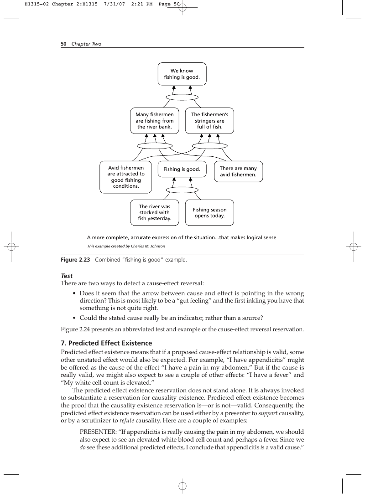

Many fishermen are fishing from the river bank.

Avid fishermen are attracted to good fishing conditions.

The fishermen’s stringers are full of fish.

The river was stocked with fish yesterday.

Figure 2.23 Combined “fishing is good” example.

- Does it seem that the arrow between cause and effect is pointing in the wrong direction? This is most likely to be a “gut feeling” and the first inkling you have that something is not quite right.
- Could the stated cause really be an indicator, rather than a source? Figure 2.24 presents an abbreviated test and example of the cause-effect reversal reservation.

#### 7. Predicted Effect Existence

Predicted effect existence means that if a proposed cause-effect relationship is valid, some other unstated effect would also be expected. For example, “I have appendicitis” might be offered as the cause of the effect “I have a pain in my abdomen.” But if the cause is really valid, we might also expect to see a couple of other effects: “I have a fever” and “My white cell count is elevated.” The predicted effect existence reservation does not stand alone. It is always invoked to substantiate a reservation for causality existence. Predicted effect existence becomes the proof that the causality existence reservation is—or is not—valid. Consequently, the predicted effect existence reservation can be used either by a presenter to support causality, or by a scrutinizer to refute causality. Here are a couple of examples:

**PRESENTER:** “If appendicitis is really causing the pain in my abdomen, we should also expect to see an elevated white blood cell count and perhaps a fever. Since we do see these additional predicted effects, I conclude that appendicitis is a valid cause.”

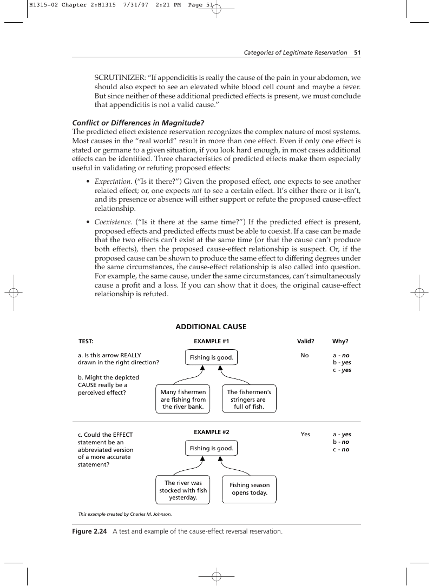

**SCRUTINIZER:** “If appendicitis is really the cause of the pain in your abdomen, we should also expect to see an elevated white blood cell count and maybe a fever. But since neither of these additional predicted effects is present, we must conclude that appendicitis is not a valid cause.”

#### Conflict or Differences in Magnitude?

The predicted effect existence reservation recognizes the complex nature of most systems. Most causes in the “real world” result in more than one effect. Even if only one effect is stated or germane to a given situation, if you look hard enough, in most cases additional effects can be identified. Three characteristics of predicted effects make them especially useful in validating or refuting proposed effects:

- Expectation. (“Is it there?”) Given the proposed effect, one expects to see another related effect; or, one expects not to see a certain effect. It’s either there or it isn’t, and its presence or absence will either support or refute the proposed cause-effect relationship.
- Coexistence. (“Is it there at the same time?”) If the predicted effect is present, proposed effects and predicted effects must be able to coexist. If a case can be made that the two effects can’t exist at the same time (or that the cause can’t produce both effects), then the proposed cause-effect relationship is suspect. Or, if the proposed cause can be shown to produce the same effect to differing degrees under the same circumstances, the cause-effect relationship is also called into question. For example, the same cause, under the same circumstances, can’t simultaneously cause a profit and a loss. If you can show that it does, the original cause-effect relationship is refuted.

Many fishermen are fishing from the river bank.

The fishermen’s stringers are full of fish.

The river was stocked with fish yesterday.

This example created by Charles M. Johnson.

Figure 2.24 A test and example of the cause-effect reversal reservation.

- Magnitude. (“Is it all there?”) If the predicted effect is present and it can coexist with the proposed effect, the predicted effect may also be expected to exist at a specific magnitude. If the actual magnitude is significantly greater or less than expected, the proposed cause may be refuted as either invalid or insufficient. If the actual magnitude approximates the expected magnitude, the cause-effect relationship is validated. To determine whether a predicted effect supports or refutes a cause-effect relationship, test it with the following proofs:

#### Support Refute

1. The effect is there, but shouldn’t be.
1. The effect is not there, but should be.
1. The effect is there, and should be.
1. The effect can coexist with the predicted effect.
1. The predicted and proposed effects are mutually exclusive.
1. The predicted effect is more or less than expected.
1. The predicted effect is about the same degree as expected.

Figure 2.25 includes several examples showing how the predicted effect existence reservation is used to support or refute causality.

#### Tangible or Intangible?

As previously mentioned in “Causality Existence” earlier in this chapter, predicted effect existence can be used to verify the existence of an intangible cause. It can also be used when the cause is tangible. In the latter case, however, the cause doesn’t need verification; it’s already tangible. The causal connection, or arrow, does. A scrutinizer taking issue with the existence of an intangible cause would use predicted effect existence to show that another expected effect of the same cause is absent. For example, let’s assume the presenter says, “If customers don’t like our product, then sales are down.” A scrutinizer could challenge the causality existence of this relationship by pointing out the absence of just one other expected effect of that intangible cause. Figure 2.26 illustrates two such possible collateral effects. If either of these predicted effects doesn’t exist, then the originally stated cause is invalid, and the scrutinizer’s reservation is valid. However, if the presenter can demonstrate that both of those collateral effects do exist, then predicted effect existence supports the original cause-effect relationship. What if the cause is tangible? Predicted effect existence can also be used to support or refute the logical connection, or arrow, between cause and effect. For example, “Quality has deteriorated” may be a quantitatively verifiable fact (see Figure 2.27). “Sales are going down” may also be substantiated by numbers. But has deteriorated quality necessarily caused decreased sales? One additional predicted effect of poor quality might be “Customers’ complaints increase.” Does this quantitatively verifiable effect exist? If so, the causality relationship between poor quality and decreased sales is likely to be valid. If not, decreased sales may have another cause—perhaps a general economic downturn— but decreased quality may not be the cause. In fact, if there is no alternative product or service, it isn’t likely to be the cause.

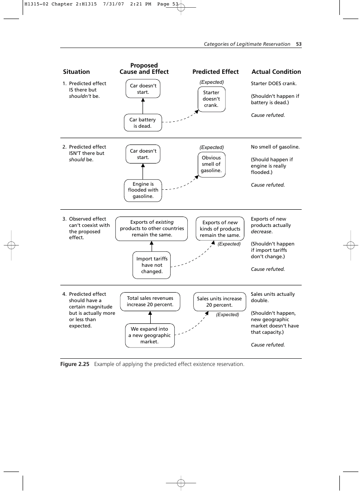

#### Situation

1. Predicted effect IS there but shouldn’t be.

(Shouldn’t happen if battery is dead.) Cause refuted.

1. Observed effect can’t coexist with the proposed effect.

Exports of existing products to other countries remain the same.

1. Predicted effect should have a certain magnitude but is actually more or less than expected.
1. Predicted effect ISN’T there but should be.

Exports of new products actually decrease. (Shouldn’t happen if import tariffs don’t change.) Cause refuted.

We expand into a new geographic market.

Figure 2.25 Example of applying the predicted effect existence reservation.

Sales units actually double. (Shouldn’t happen, new geographic market doesn’t have that capacity.) Cause refuted.

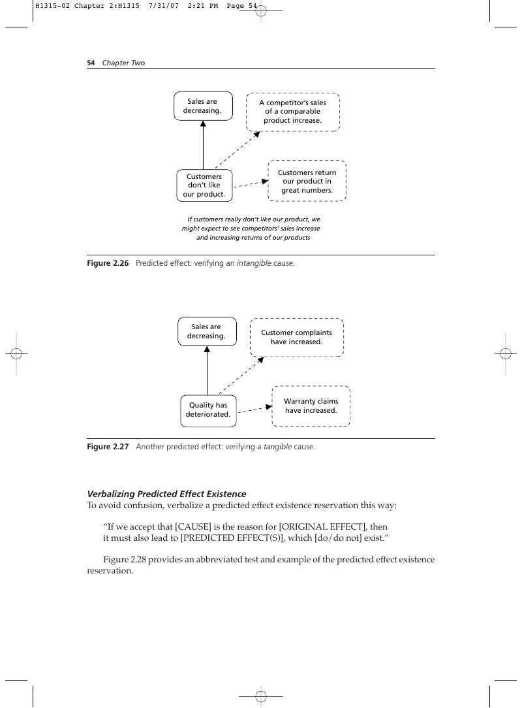

A competitor’s sales of a comparable product increase.

Customers return our product in great numbers.

If customers really don’t like our product, we might expect to see competitors’ sales increase and increasing returns of our products

Figure 2.26 Predicted effect: verifying an intangible cause.

Figure 2.27 Another predicted effect: verifying a tangible cause.

#### Verbalizing Predicted Effect Existence

To avoid confusion, verbalize a predicted effect existence reservation this way: “If we accept that [CAUSE] is the reason for [ORIGINAL EFFECT], then it must also lead to [PREDICTED EFFECT(S)], which [do/do not] exist.” Figure 2.28 provides an abbreviated test and example of the predicted effect existence reservation.

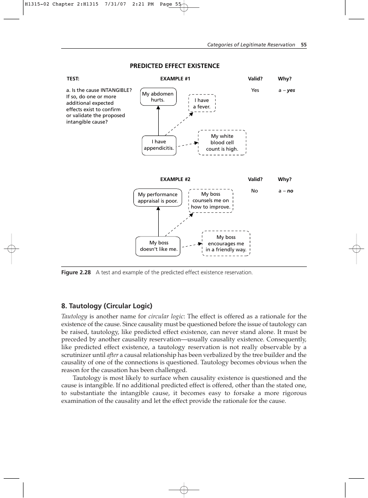

**TEST:** a. Is the cause INTANGIBLE? If so, do one or more additional expected effects exist to confirm or validate the proposed intangible cause?

My white blood cell count is high.

My boss counsels me on how to improve.

My boss encourages me in a friendly way.

Figure 2.28 A test and example of the predicted effect existence reservation.

#### 8. Tautology (Circular Logic)

Tautology is another name for circular logic: The effect is offered as a rationale for the existence of the cause. Since causality must be questioned before the issue of tautology can be raised, tautology, like predicted effect existence, can never stand alone. It must be preceded by another causality reservation—usually causality existence. Consequently, like predicted effect existence, a tautology reservation is not really observable by a scrutinizer until after a causal relationship has been verbalized by the tree builder and the causality of one of the connections is questioned. Tautology becomes obvious when the reason for the causation has been challenged. Tautology is most likely to surface when causality existence is questioned and the cause is intangible. If no additional predicted effect is offered, other than the stated one, to substantiate the intangible cause, it becomes easy to forsake a more rigorous examination of the causality and let the effect provide the rationale for the cause.

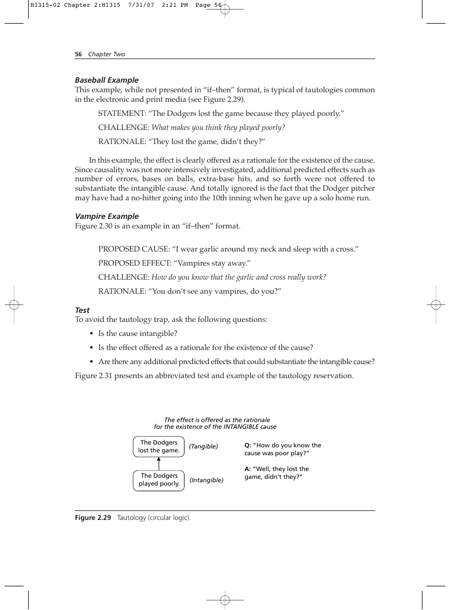

#### Baseball Example

This example, while not presented in “if–then” format, is typical of tautologies common in the electronic and print media (see Figure 2.29).

**STATEMENT:** “The Dodgers lost the game because they played poorly.”

**RATIONALE:** “They lost the game, didn’t they?” In this example, the effect is clearly offered as a rationale for the existence of the cause. Since causality was not more intensively investigated, additional predicted effects such as number of errors, bases on balls, extra-base hits, and so forth were not offered to substantiate the intangible cause. And totally ignored is the fact that the Dodger pitcher may have had a no-hitter going into the 10th inning when he gave up a solo home run.

Figure 2.30 is an example in an “if–then” format.

**PROPOSED CAUSE:** “I wear garlic around my neck and sleep with a cross.”

- Is the cause intangible?
- Is the effect offered as a rationale for the existence of the cause?
- Are there any additional predicted effects that could substantiate the intangible cause? Figure 2.31 presents an abbreviated test and example of the tautology reservation.

Q: “How do you know the cause was poor play?” A: “Well, they lost the game, didn’t they?”

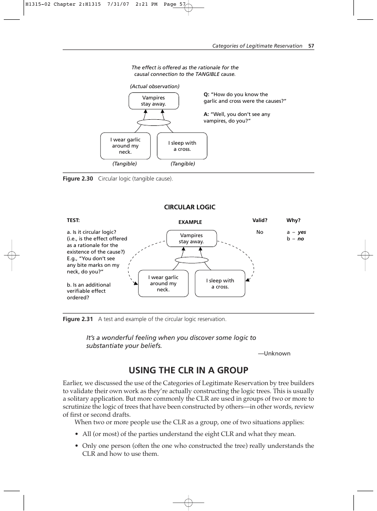

The effect is offered as the rationale for the causal connection to the TANGIBLE cause. (Actual observation) Q: “How do you know the garlic and cross were the causes?” Vampires a. Is it circular logic? (i.e., is the effect offered as a rationale for the existence of the cause?) E.g., “You don’t see any bite marks on my neck, do you?” b. Is an additional verifiable effect ordered? Valid? Why?

A: “Well, you don’t see any vampires, do you?”

I wear garlic around my neck.

### Example

I wear garlic around my neck.

Figure 2.31 A test and example of the circular logic reservation.

> It’s a wonderful feeling when you discover some logic to substantiate your beliefs.
>
> —Unknown

### Using the Clr in a Group

Earlier, we discussed the use of the Categories of Legitimate Reservation by tree builders to validate their own work as they’re actually constructing the logic trees. This is usually a solitary application. But more commonly the CLR are used in groups of two or more to scrutinize the logic of trees that have been constructed by others—in other words, review of first or second drafts. When two or more people use the CLR as a group, one of two situations applies:

- All (or most) of the parties understand the eight CLR and what they mean.
- Only one person (often the one who constructed the tree) really understands the CLR and how to use them.

#### CLR Known by All

When the CLR are understood by all participants, logical scrutiny can proceed very quickly, provided that not too many are participating. The value in having everyone thoroughly conversant with the CLR is that critiques can be communicated in a kind of verbal shorthand, by reference to the CLR title alone. A scrutinizer can merely say, “I have a causality existence reservation about the connection between entities 104 and 105.” The tree builder will know exactly what the scrutinizer means without any explanation being required. On the other hand, if you want to see the scrutiny process grind to a near-halt, invite four or more scrutinizers conversant in the CLR to participate. In the immortal words of George Washington: My observation is that whenever one person is found adequate to the discharge of a duty by close application thereto, it is worse executed by two persons, and scarcely done at all if three or more are employed therein. This often happens because people knowledgeable in the CLR tend to “nit-pick” every little deficiency they find.

#### CLR Known Only by the Tree Builder

More often than not, the availability of scrutinizers knowledgeable in the CLR is limited. In some organizations, perhaps nobody but the tree builder really understands the CLR. This need not be a problem. In fact, it could be a definite advantage. In most cases, the logic trees are being prepared for an audience that is unfamiliar with the CLR anyway. So scrutinizers who aren’t conversant with the CLR can be extremely helpful, for two reasons. First, they’ll be inclined to explain their concerns about the logic in the same terms as the eventual intended audience. Second, they’ll be better focused on the content of the subject matter and their intuition about what causes what. They’ll be less distracted by trying to categorize their concerns according to a preconceived eight-category taxonomy. Gaining effective scrutiny from people who don’t really know much (if anything) about the CLR puts a larger burden on the tree builder. The person who prepares the logic trees must have such a thorough understanding of the CLR that he or she will instantly know what category of reservation applies, even though the scrutinizer is “talking through it”—in other words, explaining the nature of the deficiency instead of naming it directly. For example, a scrutinizer without knowledge of the CLR might say: “John’s absence from work isn’t enough to keep the engineering review from happening. There would have to be nobody else who could do it, too.” What an experienced tree builder, knowledgeable in the CLR, hears in this statement (even though it’s not explicitly stated this way) is: “I have a cause insufficiency reservation. An ellipse with another entity is required. That new entity reads ‘Nobody else can do the engineering review.’ ” Scrutiny of logic trees does not require people knowledgeable in the CLR. You don’t have to teach them the eight categories as long as you yourself know them frontward and backward. It does require people who are highly knowledgeable in the subject matter that is the topic of the tree they’re scrutinizing.

### Necessity-based Logic Trees

As we proceed through the six trees of the Logical Thinking Process, you’ll notice that three of these trees—the Intermediate Objectives Map, the Evaporating Cloud, and the Prerequisite Tree—are expressed differently from the Current Reality Tree, Future Reality Tree, and Transition Tree. That’s because their foundations are a little different. The Current Reality Tree, Future Reality Tree, and Transition Tree are considered sufficiency trees. They’re read in an “if–then” form. The validity of their cause-effect relationships depends on sufficiency. To determine sufficiency, we ask questions such as, “Is this enough (or sufficient) to cause that?” The Intermediate Objectives Map, the Evaporating Cloud, and the Prerequisite Tree are considered necessity trees. They’re read in an “In order to . . . we must . . . because . . .” format. The validity of their cause-effect relationships depends on meeting minimum necessary requirements. A sufficiency tree implies that the causes are enough to actually produce the effect. A necessity tree implies that you can’t realize the resulting entity without the preceding one. The distinction between producing and enabling is a subtle one. The Categories of Legitimate Reservation were designed to apply primarily to sufficiency trees, but they do have some applicability to necessity trees as well. These distinctions will be explained in more detail in Chapter 3, “Intermediate Objectives Map,” and Chapter 7, “Prerequisite and Transition Trees.”

### Symbols and Logic Tree Conventions

When Goldratt originally conceived the Thinking Process, he used a simple graphics program—Mac Flow—to construct and print or display the early logic trees. His selection of various symbols to represent different entities (causes, effects, injections, obstacles, sufficiency, and so on) was probably somewhat arbitrary and constrained by the available symbols in that early version of the program. (Remember, this took place well before the sophisticated graphics and charting programs we have available today.) For the first several years after the Thinking Process was introduced, it was common practice to use Goldratt’s original symbology. Sometime in the late 1990s, however, as the practice and teaching of the Thinking Process became more widespread and various flowcharting and computer-aided design programs became more widely available, some users began to diverge from the conventions Goldratt had originally established. There was no deliberate effort by any Theory of Constraints practitioner to establish a standard set of symbols or conventions for drawing trees. A kind of “free-for-all, do-your-own-thing” situation prevailed. The variety of conventions and symbols is easy to see in the many published papers and books available in the public domain. This is unfortunate.

#### Three Reasons to Standardize

My experience in the last ten years of teaching and applying the Thinking Process persuades me that there are three compelling reasons for using a standard symbol set and standard logical connection conventions.

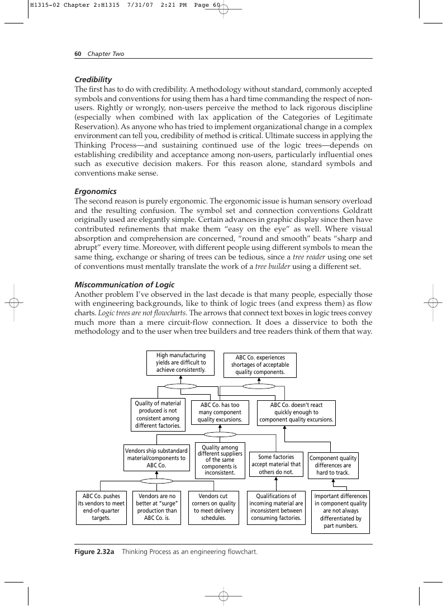

#### Credibility

The first has to do with credibility. A methodology without standard, commonly accepted symbols and conventions for using them has a hard time commanding the respect of nonusers. Rightly or wrongly, non-users perceive the method to lack rigorous discipline (especially when combined with lax application of the Categories of Legitimate Reservation). As anyone who has tried to implement organizational change in a complex environment can tell you, credibility of method is critical. Ultimate success in applying the Thinking Process—and sustaining continued use of the logic trees—depends on establishing credibility and acceptance among non-users, particularly influential ones such as executive decision makers. For this reason alone, standard symbols and conventions make sense.

#### Ergonomics

The second reason is purely ergonomic. The ergonomic issue is human sensory overload and the resulting confusion. The symbol set and connection conventions Goldratt originally used are elegantly simple. Certain advances in graphic display since then have contributed refinements that make them “easy on the eye” as well. Where visual absorption and comprehension are concerned, “round and smooth” beats “sharp and abrupt” every time. Moreover, with different people using different symbols to mean the same thing, exchange or sharing of trees can be tedious, since a tree reader using one set of conventions must mentally translate the work of a tree builder using a different set.

#### Miscommunication of Logic

Another problem I’ve observed in the last decade is that many people, especially those with engineering backgrounds, like to think of logic trees (and express them) as flow charts. Logic trees are not flowcharts. The arrows that connect text boxes in logic trees convey much more than a mere circuit-flow connection. It does a disservice to both the methodology and to the user when tree builders and tree readers think of them that way. High manufacturing yields are difficult to achieve consistently.

ABC Co. pushes its vendors to meet end-of-quarter targets.

ABC Co. experiences shortages of acceptable quality components.

Quality of material produced is not consistent among different factories.

ABC Co. has too many component quality excursions.

Vendors ship substandard material/components to ABC Co.

Quality among different suppliers of the same components is inconsistent.

Vendors are no better at “surge” production than ABC Co. is.

Vendors cut corners on quality to meet delivery schedules.

ABC Co. doesn’t react quickly enough to component quality excursions.

Some factories accept material that others do not.

Qualifications of incoming material are inconsistent between consuming factories.

Thinking Process as an engineering flowchart.

Component quality differences are hard to track.

Important differences in component quality are not always differentiated by part numbers.

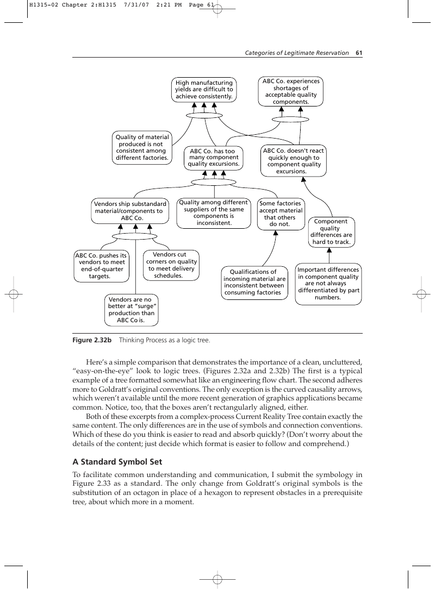

High manufacturing yields are difficult to achieve consistently.

Quality of material produced is not consistent among different factories.

Vendors ship substandard material/components to ABC Co.

ABC Co. pushes its vendors to meet end-of-quarter targets.

ABC Co. has too many component quality excursions.

Quality among different suppliers of the same components is inconsistent.

Vendors cut corners on quality to meet delivery schedules.

Vendors are no better at “surge” production than ABC Co. is.

ABC Co. experiences shortages of acceptable quality components.

ABC Co. doesn't react quickly enough to component quality excursions.

Some factories accept material that others do not.

quality differences are hard to track.

Important differences in component quality are not always differentiated by part numbers.

Thinking Process as a logic tree.

Here’s a simple comparison that demonstrates the importance of a clean, uncluttered, “easy-on-the-eye” look to logic trees. (Figures 2.32a and 2.32b) The first is a typical example of a tree formatted somewhat like an engineering flow chart. The second adheres more to Goldratt’s original conventions. The only exception is the curved causality arrows, which weren’t available until the more recent generation of graphics applications became common. Notice, too, that the boxes aren’t rectangularly aligned, either. Both of these excerpts from a complex-process Current Reality Tree contain exactly the same content. The only differences are in the use of symbols and connection conventions. Which of these do you think is easier to read and absorb quickly? (Don’t worry about the details of the content; just decide which format is easier to follow and comprehend.)

#### A Standard Symbol Set

To facilitate common understanding and communication, I submit the symbology in Figure 2.33 as a standard. The only change from Goldratt’s original symbols is the substitution of an octagon in place of a hexagon to represent obstacles in a prerequisite tree, about which more in a moment.

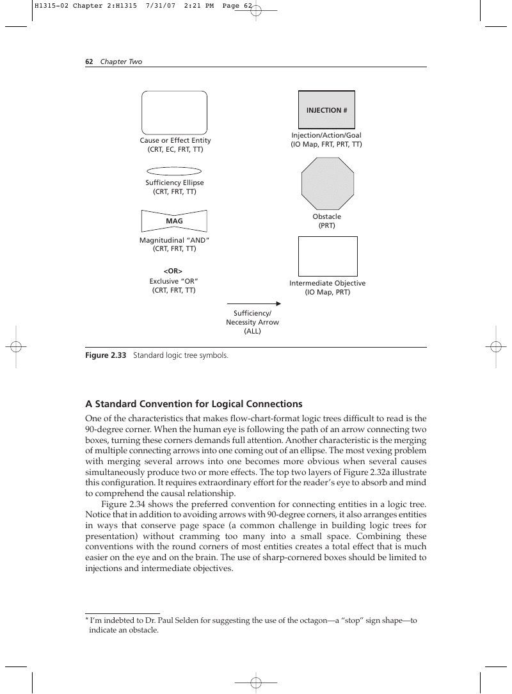

Figure 2.33 Standard logic tree symbols.

#### A Standard Convention for Logical Connections

One of the characteristics that makes flow-chart-format logic trees difficult to read is the 90-degree corner. When the human eye is following the path of an arrow connecting two boxes, turning these corners demands full attention. Another characteristic is the merging of multiple connecting arrows into one coming out of an ellipse. The most vexing problem with merging several arrows into one becomes more obvious when several causes simultaneously produce two or more effects. The top two layers of Figure 2.32a illustrate this configuration. It requires extraordinary effort for the reader’s eye to absorb and mind to comprehend the causal relationship. Figure 2.34 shows the preferred convention for connecting entities in a logic tree. Notice that in addition to avoiding arrows with 90-degree corners, it also arranges entities in ways that conserve page space (a common challenge in building logic trees for presentation) without cramming too many into a small space. Combining these conventions with the round corners of most entities creates a total effect that is much easier on the eye and on the brain. The use of sharp-cornered boxes should be limited to injections and intermediate objectives.

* I’m indebted to Dr. Paul Selden for suggesting the use of the octagon—a “stop” sign shape—to indicate an obstacle.

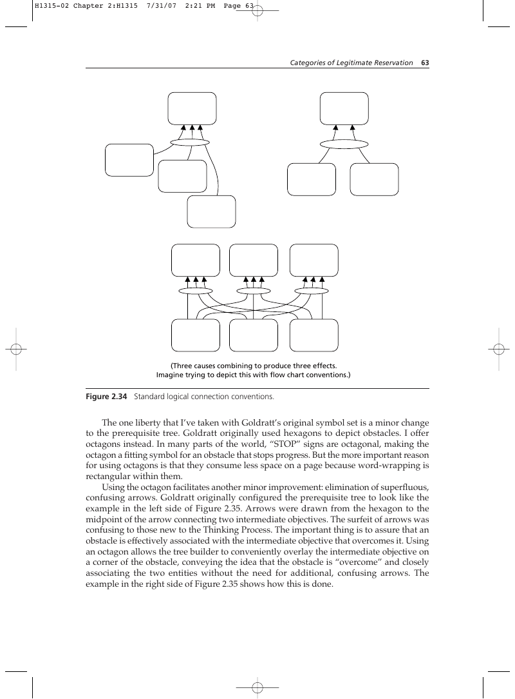

Figure 2.34 Standard logical connection conventions.

The one liberty that I’ve taken with Goldratt’s original symbol set is a minor change to the prerequisite tree. Goldratt originally used hexagons to depict obstacles. I offer octagons instead. In many parts of the world, “STOP” signs are octagonal, making the octagon a fitting symbol for an obstacle that stops progress. But the more important reason for using octagons is that they consume less space on a page because word-wrapping is rectangular within them. Using the octagon facilitates another minor improvement: elimination of superfluous, confusing arrows. Goldratt originally configured the prerequisite tree to look like the example in the left side of Figure 2.35. Arrows were drawn from the hexagon to the midpoint of the arrow connecting two intermediate objectives. The surfeit of arrows was confusing to those new to the Thinking Process. The important thing is to assure that an obstacle is effectively associated with the intermediate objective that overcomes it. Using an octagon allows the tree builder to conveniently overlay the intermediate objective on a corner of the obstacle, conveying the idea that the obstacle is “overcome” and closely associating the two entities without the need for additional, confusing arrows. The example in the right side of Figure 2.35 shows how this is done.

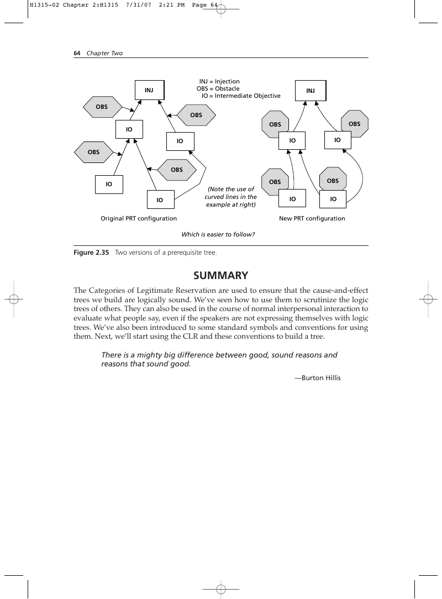

Figure 2.35 Two versions of a prerequisite tree.

### Summary

> The Categories of Legitimate Reservation are used to ensure that the cause-and-effect trees we build are logically sound. We’ve seen how to use them to scrutinize the logic trees of others. They can also be used in the course of normal interpersonal interaction to evaluate what people say, even if the speakers are not expressing themselves with logic trees. We’ve also been introduced to some standard symbols and conventions for using them. Next, we’ll start using the CLR and these conventions to build a tree. There is a mighty big difference between good, sound reasons and reasons that sound good.
>
> —Burton Hillis

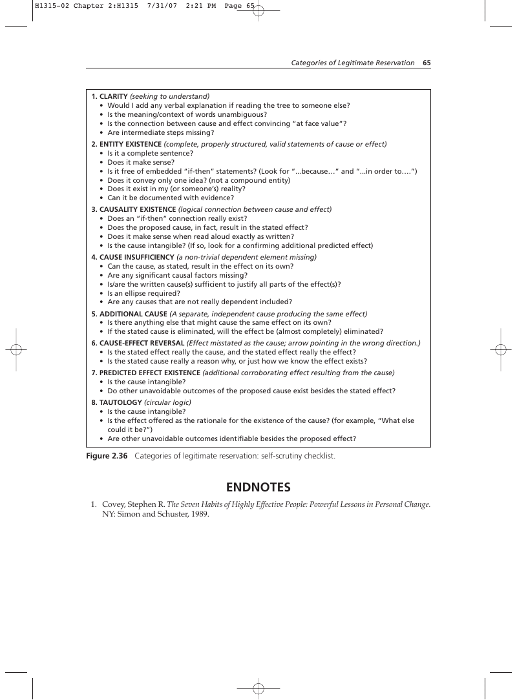

1. CLARITY (seeking to understand)
- Would I add any verbal explanation if reading the tree to someone else?
- Is the meaning/context of words unambiguous?
- Is the connection between cause and effect convincing “at face value”?
- Are intermediate steps missing?
1. ENTITY EXISTENCE (complete, properly structured, valid statements of cause or effect)
- Is it a complete sentence?
- Does it make sense?
- Is it free of embedded “if-then” statements? (Look for “...because…” and “...in order to….”)
- Does it convey only one idea? (not a compound entity)
- Does it exist in my (or someone’s) reality?
- Can it be documented with evidence?
1. CAUSALITY EXISTENCE (logical connection between cause and effect)
- Does an “if-then” connection really exist?
- Does the proposed cause, in fact, result in the stated effect?
- Does it make sense when read aloud exactly as written?
- Is the cause intangible? (If so, look for a confirming additional predicted effect)
1. CAUSE INSUFFICIENCY (a non-trivial dependent element missing)
- Can the cause, as stated, result in the effect on its own?
- Are any significant causal factors missing?
- Is/are the written cause(s) sufficient to justify all parts of the effect(s)?
- Is an ellipse required?
- Are any causes that are not really dependent included?
1. ADDITIONAL CAUSE (A separate, independent cause producing the same effect)
- Is there anything else that might cause the same effect on its own?
- If the stated cause is eliminated, will the effect be (almost completely) eliminated?
1. CAUSE-EFFECT REVERSAL (Effect misstated as the cause; arrow pointing in the wrong direction.)
- Is the stated effect really the cause, and the stated effect really the effect?
- Is the stated cause really a reason why, or just how we know the effect exists?
1. PREDICTED EFFECT EXISTENCE (additional corroborating effect resulting from the cause)
- Is the cause intangible?
- Do other unavoidable outcomes of the proposed cause exist besides the stated effect?
1. TAUTOLOGY (circular logic)
- Is the cause intangible?
- Is the effect offered as the rationale for the existence of the cause? (for example, “What else could it be?”)
- Are other unavoidable outcomes identifiable besides the proposed effect?

Figure 2.36 Categories of legitimate reservation: self-scrutiny checklist.

### Endnotes

1. Covey, Stephen R. The Seven Habits of Highly Effective People: Powerful Lessons in Personal Change. NY: Simon and Schuster, 1989.

