# Chapter 3: Intermediate Objectives Map

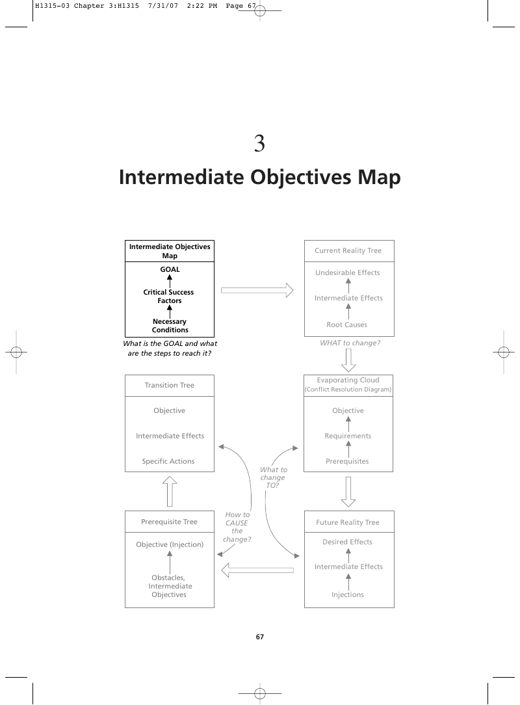

> It is more important to know where you are going than to get there quickly. Do not mistake activity for achievement.
>
> —Mabel Newcomber

### Introduction

The most insidious contributor to the failure of continuous improvement effort is what might be called the “Nero syndrome”—fiddling while Rome burns, or rearranging deck chairs on the Titanic. In other words, focusing on the inconsequential instead of the critical. In Theory of Constraints terms, this is known as working on a non-constraint. As we saw in Chapter 1, by trying to improve everything everywhere, we risk not improving anything that really counts. Why? Because if only a few key leverage points in any system influence overall system performance at any given time, trying to improve most of the system will be counterproductive. It will consume more resources than the value of the improvement it produces. Only resources applied to the real leverage points will pay for themselves. This is the “anchor” holding back continuous improvement programs such as Six Sigma.

### Definition

An Intermediate Objectives (IO) Map is a graphical representation of a system’s goal, critical success factors (CSFs), and the necessary conditions (NC) for achieving them. These elements are arrayed in a logically connected hierarchy, with the goal at the top, the CSFs immediately below it, and the supporting NCs below them. Each of the entities in the IO Map exists in a necessity-based relationship (see Chapter 2) with the entities below it. The CSFs could be considered major milestones, or terminal outcomes, on the journey to the goal. NCs represent the conclusion of significant activities required to complete the CSFs.

### Purpose

The IO Map is intended to fix in time and space a firm baseline or standard for what should be happening if a system is to succeed. Its collective depiction of goal, CSFs, and NCs constitute the system’s benchmark of desired performance—the destination toward which all system improvement efforts should be directed. In other words, before you can decide how well you're doing, you must have a clear understanding of what you should be doing. A well-constructed IO Map presents a rational, unemotional representation of the non-negotiable requirements a system must satisfy in its quest to achieve its stated goal. These are not things you'd like to do, but rather things you must do if the goal is to be achieved. Without such a frame of reference, the determination of what should be changed within the system is merely a matter of opinion and speculation.

### Assumptions

- All systems have a goal and critical success factors that must be satisfied if the goal is to be achieved.
- The goal and CSFs exist in an interdependent, hierarchical structure.
- The goal will be unique to each system.
- Critical success factors and their interrelationships will be unique to each system and the environment in which the system functions or competes.
- CSFs and NCs are related to each other in a necessity-based configuration that reflects the rule set governing the system's competitive/functional environment.
- The Goal, CSFs, and NCs can be determined by people within or outside of a system.
- A robust IO Map will present an accurate picture of a system's goal, CSFs, and their supporting NCs.

### How to Use This Chapter

- Read “System Boundaries, Span of Control, and Sphere of Influence,” “Doing the Right Things Versus Doing Things Right,” and “Description of the Intermediate Objectives Map”
- Read “How to Construct an Intermediate Objectives Map”
- Review Figures 3.14, “How to Construct an Intermediate Objectives Map,” and 3.15, “Example of a Real-World Intermediate Objectives Map”
- Review Appendix A
- Practice creating your own Intermediate Objectives Map

### System Boundaries, Span of Control, and Sphere of Influence

We’ve been talking about systems since Chapter 1. By now it should be clear that the Logical Thinking Process is a system-level problem-solving tool. But one person’s system can be another person’s process, and vice-versa. For example, a production manager might see his operation as a system, but the chief executive officer of the same company might see it as a process that’s only a part—albeit an interdependent part—of the larger company system. The company itself is part of a larger system that might be called the national industrial base, which, in turn, is part of a still larger system called the nation’s society. You can see that this concept can be extended to many successively higher (or lower) levels. We’ll discuss this hierarchical nature of systems in more detail shortly, but for now this concept is important because it helps us keep from losing control of our problem-solving process. We must be able to define precisely what system (and level) we’re addressing. In other words, we need to be able to define a boundary for the system we’re trying to improve, or we risk “wandering in the wilderness for forty years.” In some cases, this can be as easy as drawing a dotted line around specific boxes on an organization chart. When the system is less structured than that, it may be necessary to create a mental picture of it. Defining a system boundary makes it easier to determine which elements of our problem lie within the system and which reside in the external environment. Being able to differentiate internal elements from external makes it easier to identify which ones may lie within our span of control, which might be within our sphere of influence, and which ones are beyond our influence altogether. Issues that are within our span of control are relatively easy to resolve. Those within our sphere of influence will likely be more difficult to address. And we might have no impact at all on those beyond our influence altogether.

#### Span of Control

Simply put, our span of control includes all of those things in our system over which we have unilateral change authority. In other words, we can decide to change those things on our own. Span of control varies for each individual, but it has one common characteristic for everybody: it’s extremely limited. It doesn’t matter if you’re the President of the United States or a company employee—most of what you must deal with on a daily basis is beyond your unilateral control.

#### Sphere of Influence

Sphere of influence is an arbitrary perimeter enclosing those aspects of our lives that we can influence to some degree, even if we can’t exercise unilateral control over them. The sphere of influence obviously is substantially larger than the span of control.*

#### The External Environment

The external environment is composed of some elements over which we have a degree of influence, and many more elements over which we have no influence at all. Knowing which external elements we can influence gives us clues about how difficult influencing them will be and what must be done to improve our situation. Knowing which elements we can’t influence immediately identifies obstacles we’ll have to work around.

#### Control vs. Influence

The distinction between span of control and sphere of influence is important, because the latter is not fixed or absolute. In the systems in which we operate, we can influence far more than we can control, and we can influence far more that most of us realize that we can. As we’ll see, the Logical Thinking Process provides a way to extend our spheres of influence to include things we never thought possible. So, before we begin problem solving, it’s a good idea to have a sense of “our place in the universe”—where our boundaries lie, what we can control, what we can influence and what we can’t. Figure 3.1 illustrates the concept of system boundary, span of control, and sphere of influence.

#### DOING THE RIGHT THINGS vs. DOING THINGS RIGHT

How can we be sure of applying efforts where they'll do the most good? Goldratt would say, “Use the Five Focusing Steps” (see Chapter 1) to find and manage the system's leverage points. Fine, but specifically how is that done? Obviously, no two organizations are exactly alike, even within the same industry. By their very natures, different systems will be constrained in different ways. Warren Bennis and Burt Nanus have equated management with efficiency—doing things right—and leadership with effectiveness—doing the right things.1:21 If you subscribe to this characterization, then defining what needs changing is an expression of effectiveness. So, how can leader find those right things to do—the few critical things that need changing?

#### The Goal

Determining what needs changing requires that we first know what we're trying to achieve—where we want to be when all is said and done. Or, as Stephen Covey suggests, “Begin with the end in mind.”2:95 There's a simple reason for doing this. The desire to * In fact, for some people sphere of influence is all they have. They may not even have unilateral decision authority over something as basic as the television remote control!

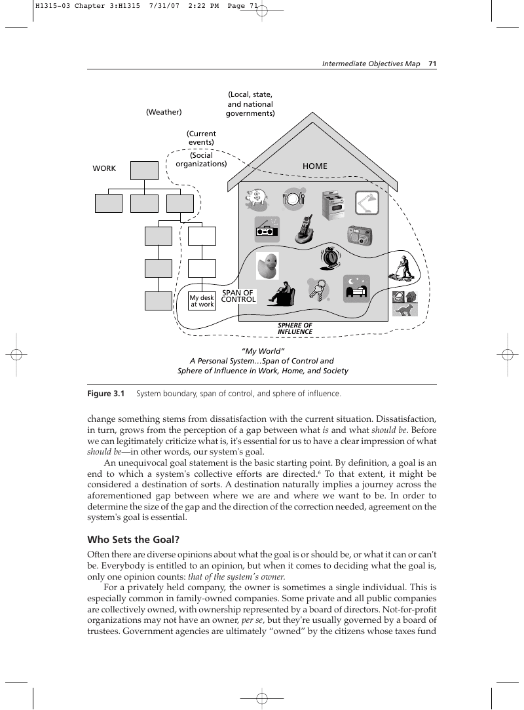

“My World” A Personal System…Span of Control and Sphere of Influence in Work, Home, and Society change something stems from dissatisfaction with the current situation. Dissatisfaction, in turn, grows from the perception of a gap between what is and what should be. Before we can legitimately criticize what is, it's essential for us to have a clear impression of what should be—in other words, our system's goal. An unequivocal goal statement is the basic starting point. By definition, a goal is an end to which a system's collective efforts are directed.6 To that extent, it might be considered a destination of sorts. A destination naturally implies a journey across the aforementioned gap between where we are and where we want to be. In order to determine the size of the gap and the direction of the correction needed, agreement on the system's goal is essential.

System boundary, span of control, and sphere of influence.

#### Who Sets the Goal?

Often there are diverse opinions about what the goal is or should be, or what it can or can't be. Everybody is entitled to an opinion, but when it comes to deciding what the goal is, only one opinion counts: that of the system's owner. For a privately held company, the owner is sometimes a single individual. This is especially common in family-owned companies. Some private and all public companies are collectively owned, with ownership represented by a board of directors. Not-for-profit organizations may not have an owner, per se, but they're usually governed by a board of trustees. Government agencies are ultimately “owned” by the citizens whose taxes fund them.* Regardless of whether ownership is solitary or collective, the system's owners are the only ones with the authority to determine what the goal will be. If someone other than the owner establishes the goal, it's incumbent upon that person to define a goal with which the owner (or board) would agree.

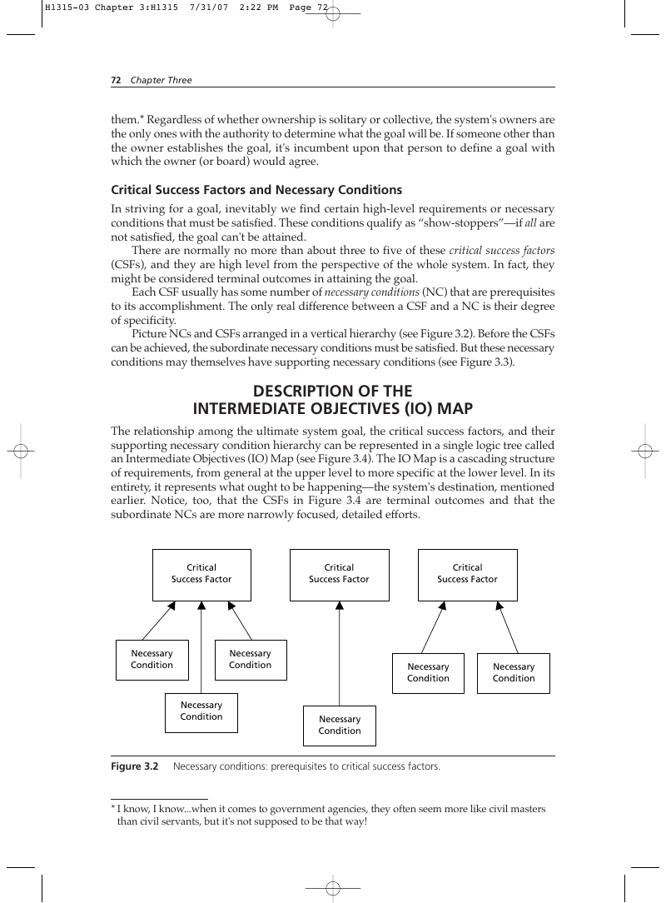

#### Critical Success Factors and Necessary Conditions

In striving for a goal, inevitably we find certain high-level requirements or necessary conditions that must be satisfied. These conditions qualify as “show-stoppers”—if all are not satisfied, the goal can't be attained. There are normally no more than about three to five of these critical success factors (CSFs), and they are high level from the perspective of the whole system. In fact, they might be considered terminal outcomes in attaining the goal. Each CSF usually has some number of necessary conditions (NC) that are prerequisites to its accomplishment. The only real difference between a CSF and a NC is their degree of specificity. Picture NCs and CSFs arranged in a vertical hierarchy (see Figure 3.2). Before the CSFs can be achieved, the subordinate necessary conditions must be satisfied. But these necessary conditions may themselves have supporting necessary conditions (see Figure 3.3).

### Description of the Intermediate Objectives (Io) Map

The relationship among the ultimate system goal, the critical success factors, and their supporting necessary condition hierarchy can be represented in a single logic tree called an Intermediate Objectives (IO) Map (see Figure 3.4). The IO Map is a cascading structure of requirements, from general at the upper level to more specific at the lower level. In its entirety, it represents what ought to be happening—the system's destination, mentioned earlier. Notice, too, that the CSFs in Figure 3.4 are terminal outcomes and that the subordinate NCs are more narrowly focused, detailed efforts. Critical Success Factor Necessary Condition Necessary Condition Necessary Condition

Necessary conditions: prerequisites to critical success factors.

* I know, I know...when it comes to government agencies, they often seem more like civil masters than civil servants, but it's not supposed to be that way!

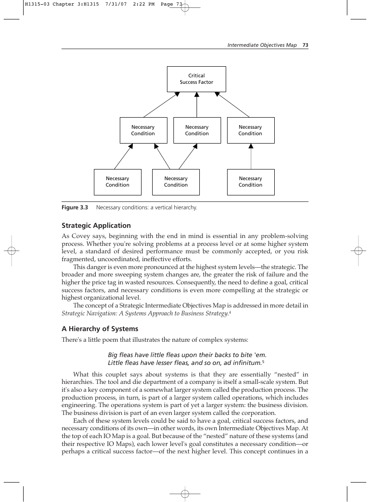

#### Strategic Application

As Covey says, beginning with the end in mind is essential in any problem-solving process. Whether you're solving problems at a process level or at some higher system level, a standard of desired performance must be commonly accepted, or you risk fragmented, uncoordinated, ineffective efforts. This danger is even more pronounced at the highest system levels—the strategic. The broader and more sweeping system changes are, the greater the risk of failure and the higher the price tag in wasted resources. Consequently, the need to define a goal, critical success factors, and necessary conditions is even more compelling at the strategic or highest organizational level. The concept of a Strategic Intermediate Objectives Map is addressed in more detail in Strategic Navigation: A Systems Approach to Business Strategy.4

#### A Hierarchy of Systems

There's a little poem that illustrates the nature of complex systems: Big fleas have little fleas upon their backs to bite 'em. Little fleas have lesser fleas, and so on, ad infinitum.5 What this couplet says about systems is that they are essentially “nested” in hierarchies. The tool and die department of a company is itself a small-scale system. But it's also a key component of a somewhat larger system called the production process. The production process, in turn, is part of a larger system called operations, which includes engineering. The operations system is part of yet a larger system: the business division. The business division is part of an even larger system called the corporation. Each of these system levels could be said to have a goal, critical success factors, and necessary conditions of its own—in other words, its own Intermediate Objectives Map. At the top of each IO Map is a goal. But because of the “nested” nature of these systems (and their respective IO Maps), each lower level's goal constitutes a necessary condition—or perhaps a critical success factor—of the next higher level. This concept continues in a repeating fashion until the consensus boundary of the largest system is reached: the corporation; the municipal, state, or national government; or some other generally accepted delineation between what's considered “internal” and “external.” Figure 3.5 illustrates this hierarchical concept of systems and IO Maps.

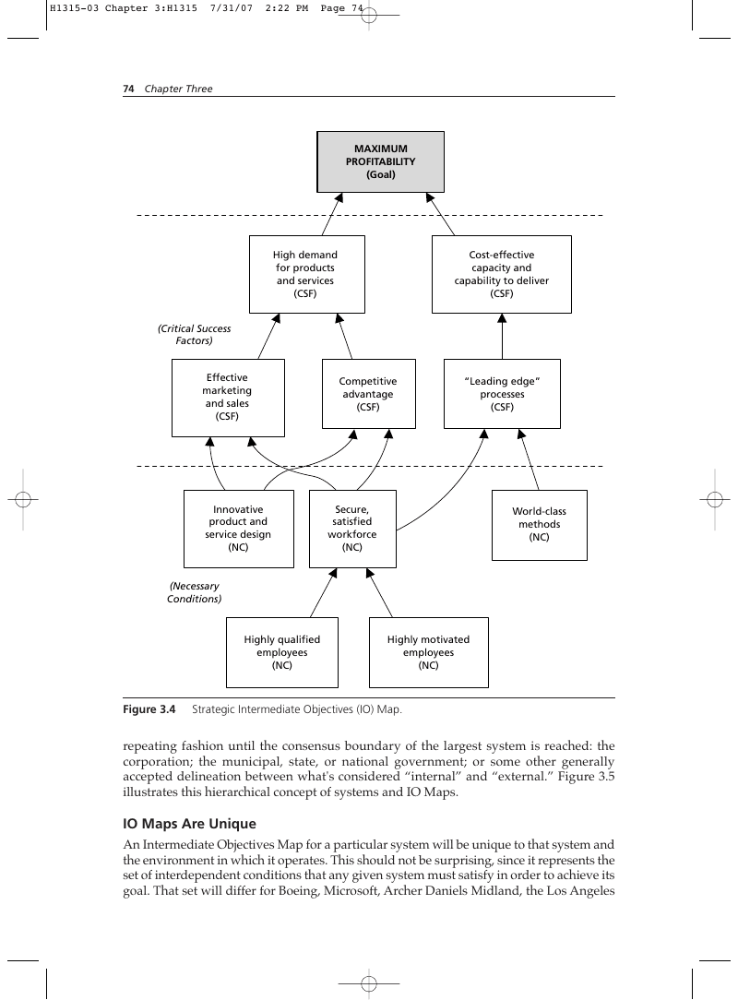

#### IO Maps Are Unique

An Intermediate Objectives Map for a particular system will be unique to that system and the environment in which it operates. This should not be surprising, since it represents the set of interdependent conditions that any given system must satisfy in order to achieve its goal. That set will differ for Boeing, Microsoft, Archer Daniels Midland, the Los Angeles

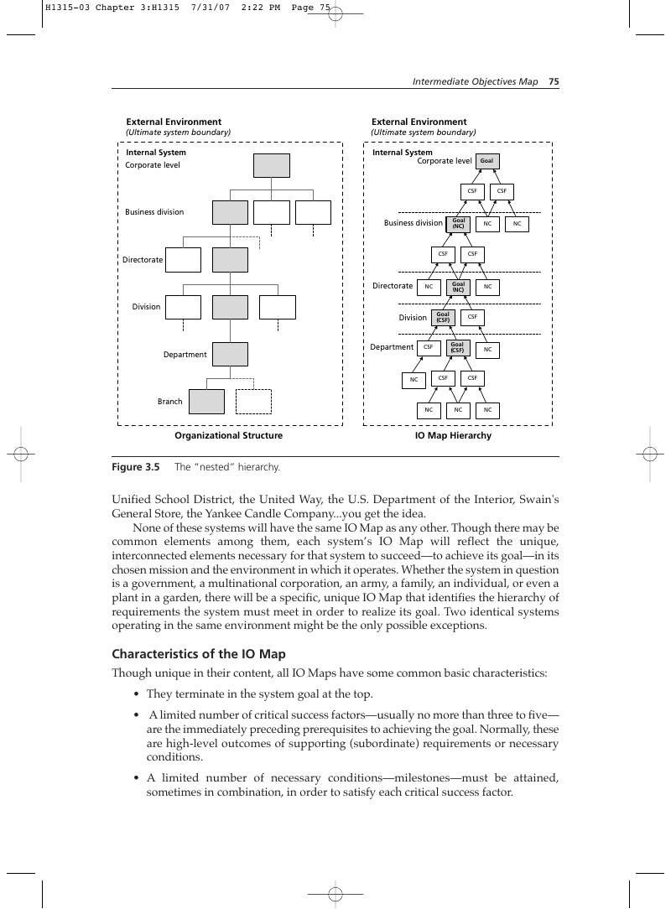

Unified School District, the United Way, the U.S. Department of the Interior, Swain's General Store, the Yankee Candle Company...you get the idea. None of these systems will have the same IO Map as any other. Though there may be common elements among them, each system’s IO Map will reflect the unique, interconnected elements necessary for that system to succeed—to achieve its goal—in its chosen mission and the environment in which it operates. Whether the system in question is a government, a multinational corporation, an army, a family, an individual, or even a plant in a garden, there will be a specific, unique IO Map that identifies the hierarchy of requirements the system must meet in order to realize its goal. Two identical systems operating in the same environment might be the only possible exceptions. Characteristics of the IO Map

- They terminate in the system goal at the top.
- A limited number of critical success factors—usually no more than three to five— are the immediately preceding prerequisites to achieving the goal. Normally, these are high-level outcomes of supporting (subordinate) requirements or necessary conditions.
- A limited number of necessary conditions—milestones—must be attained, sometimes in combination, in order to satisfy each critical success factor.
- Each successive descending layer of necessary conditions is somewhat more specific or detailed than the layer above it. There should not be more than about two layers of necessary conditions below the level of critical success factors.
- As a whole, the IO Map represents the destination and key intermediate milestones the system is striving for. CSFs and NCs are not a matter of choice or wishful thinking; their existence and necessity is a matter of logic that is governed by the choice of the system mission, the environment in which it functions, and its stated goal.

#### Examples of Strategic Intermediate Objectives Maps

Nothing conveys a message as effectively as a good example. Here are two examples of Intermediate Objectives Maps. One is the IO Map of a commercial company. The second represents a not-for-profit foundation.

#### Process-Level IO Map

Figure 3.6 shows a notional IO Map for a production process. Keep in mind that because the focus of this IO Map is process rather than a higher level system, the goal and the CSFs are more limited in scope than one would expect for the company-level map of the same organization. Notice, too, that the goal is likely to be a necessary condition or critical success factor of that higher level company IO Map.

#### System-Level IO Map

Figure 3.7 shows a real IO Map for a not-for-profit educational foundation.* Notice that the goal is that of the whole organization, not just a process or part. The CSFs are decidedly functionally oriented, and the NCs address specific activities.

### How to Construct an Intermediate Objectives (Io) Map

An Intermediate Objectives Map can easily be constructed by one person, often in as little as 15 minutes or less. But if the system it represents is larger than the span of control of the person constructing the IO Map, external scrutiny of the finished IO Map and its components is more than just advisable—it’s necessary in order to prevent starting down the wrong path. Here’s the procedure for constructing an IO Map.

#### 1. Define the System

The first step is to determine the boundary of the system under consideration, your span of control, and your sphere of influence in it. Can you define the system as an organizational entity with clearly established functional limits? Keep in mind that while geography can play a part, the important factors in any system are functional, regardless of where they’re located. A grocery store chain, for example, has clearly definable organizational boundaries, even though it may have a headquarters, many distribution warehouses, and hundreds of retail stores spread out over a wide geographic area.

* The Sam Spady Foundation is dedicated to educating young people, parents, and teachers on the dangers of binge drinking and alcohol poisoning. For more information, visit: www.samspadyfoundation.org

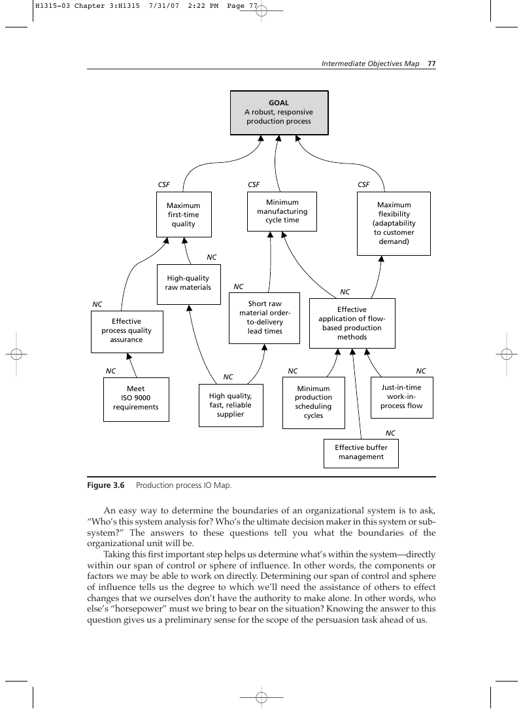

An easy way to determine the boundaries of an organizational system is to ask, “Who’s this system analysis for? Who’s the ultimate decision maker in this system or subsystem?” The answers to these questions tell you what the boundaries of the organizational unit will be. Taking this first important step helps us determine what’s within the system—directly within our span of control or sphere of influence. In other words, the components or factors we may be able to work on directly. Determining our span of control and sphere of influence tells us the degree to which we’ll need the assistance of others to effect changes that we ourselves don’t have the authority to make alone. In other words, who else’s “horsepower” must we bring to bear on the situation? Knowing the answer to this question gives us a preliminary sense for the scope of the persuasion task ahead of us.

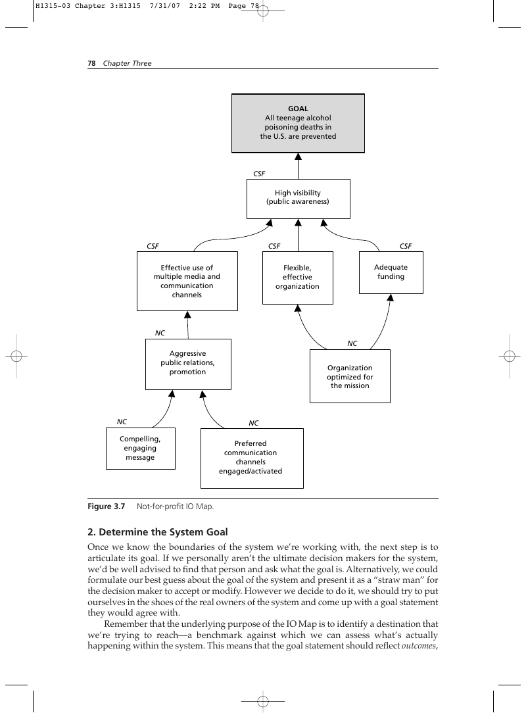

#### 2. Determine the System Goal

Once we know the boundaries of the system we’re working with, the next step is to articulate its goal. If we personally aren’t the ultimate decision makers for the system, we’d be well advised to find that person and ask what the goal is. Alternatively, we could formulate our best guess about the goal of the system and present it as a “straw man” for the decision maker to accept or modify. However we decide to do it, we should try to put ourselves in the shoes of the real owners of the system and come up with a goal statement they would agree with. Remember that the underlying purpose of the IO Map is to identify a destination that we’re trying to reach—a benchmark against which we can assess what’s actually happening within the system. This means that the goal statement should reflect outcomes, not continuing activities. For example, in the fifth of his famous 14 points, W. Edwards Deming said: “Improve constantly and forever the system of production and service, to improve quality and productivity, and thus constantly decrease costs.” 3:23 Certainly admirable, and a means to a goal (an activity), but not a goal in itself. Whenever we find ourselves tempted to list an activity as the goal, we should ask ourselves, “Why are we doing this? What’s the higher purpose toward which this activity is directed? What would the owner(s) expect to result from this?” Figure 3.8 shows generic examples of typical goal statements for a commercial for-profit company and a not-forprofit charitable foundation. Notice that in both cases, the goal is stated as a condition—an outcome of activity— not as an action or activity itself.

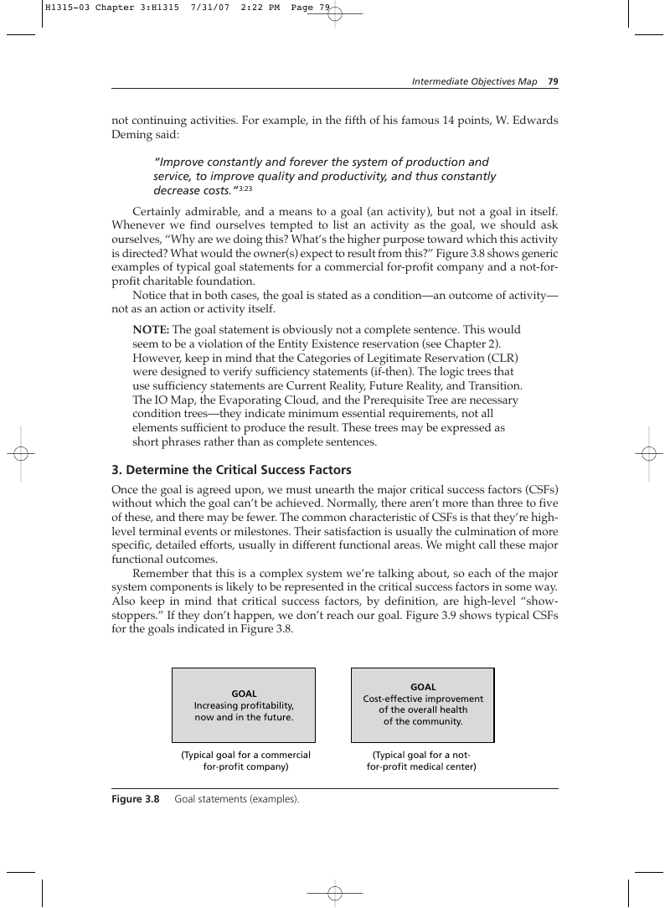

**NOTE:** The goal statement is obviously not a complete sentence. This would seem to be a violation of the Entity Existence reservation (see Chapter 2). However, keep in mind that the Categories of Legitimate Reservation (CLR) were designed to verify sufficiency statements (if-then). The logic trees that use sufficiency statements are Current Reality, Future Reality, and Transition. The IO Map, the Evaporating Cloud, and the Prerequisite Tree are necessary condition trees—they indicate minimum essential requirements, not all elements sufficient to produce the result. These trees may be expressed as short phrases rather than as complete sentences.

#### 3. Determine the Critical Success Factors

Once the goal is agreed upon, we must unearth the major critical success factors (CSFs) without which the goal can’t be achieved. Normally, there aren’t more than three to five of these, and there may be fewer. The common characteristic of CSFs is that they’re highlevel terminal events or milestones. Their satisfaction is usually the culmination of more specific, detailed efforts, usually in different functional areas. We might call these major functional outcomes. Remember that this is a complex system we’re talking about, so each of the major system components is likely to be represented in the critical success factors in some way. Also keep in mind that critical success factors, by definition, are high-level “showstoppers.” If they don’t happen, we don’t reach our goal. Figure 3.9 shows typical CSFs for the goals indicated in Figure 3.8.

Cost-effective improvement of the overall health of the community.

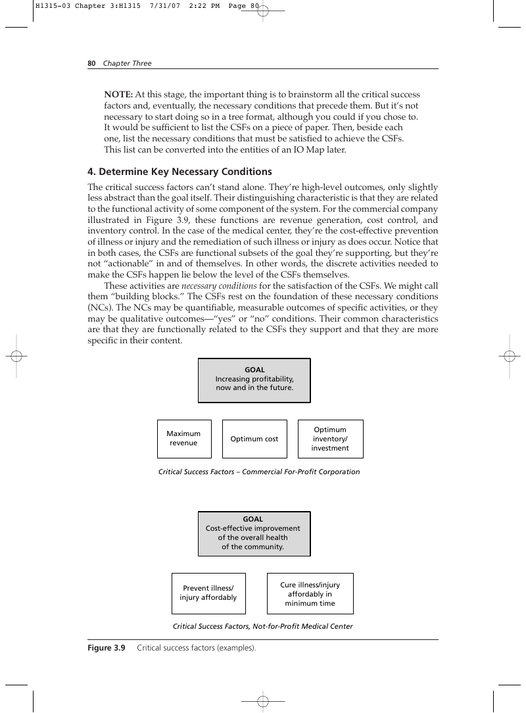

**NOTE:** At this stage, the important thing is to brainstorm all the critical success factors and, eventually, the necessary conditions that precede them. But it’s not necessary to start doing so in a tree format, although you could if you chose to. It would be sufficient to list the CSFs on a piece of paper. Then, beside each one, list the necessary conditions that must be satisfied to achieve the CSFs. This list can be converted into the entities of an IO Map later.

#### 4. Determine Key Necessary Conditions

The critical success factors can’t stand alone. They’re high-level outcomes, only slightly less abstract than the goal itself. Their distinguishing characteristic is that they are related to the functional activity of some component of the system. For the commercial company illustrated in Figure 3.9, these functions are revenue generation, cost control, and inventory control. In the case of the medical center, they’re the cost-effective prevention of illness or injury and the remediation of such illness or injury as does occur. Notice that in both cases, the CSFs are functional subsets of the goal they’re supporting, but they’re not “actionable” in and of themselves. In other words, the discrete activities needed to make the CSFs happen lie below the level of the CSFs themselves. These activities are necessary conditions for the satisfaction of the CSFs. We might call them “building blocks.” The CSFs rest on the foundation of these necessary conditions (NCs). The NCs may be quantifiable, measurable outcomes of specific activities, or they may be qualitative outcomes—“yes” or “no” conditions. Their common characteristics are that they are functionally related to the CSFs they support and that they are more specific in their content. GOAL

Cost-effective improvement of the overall health of the community.

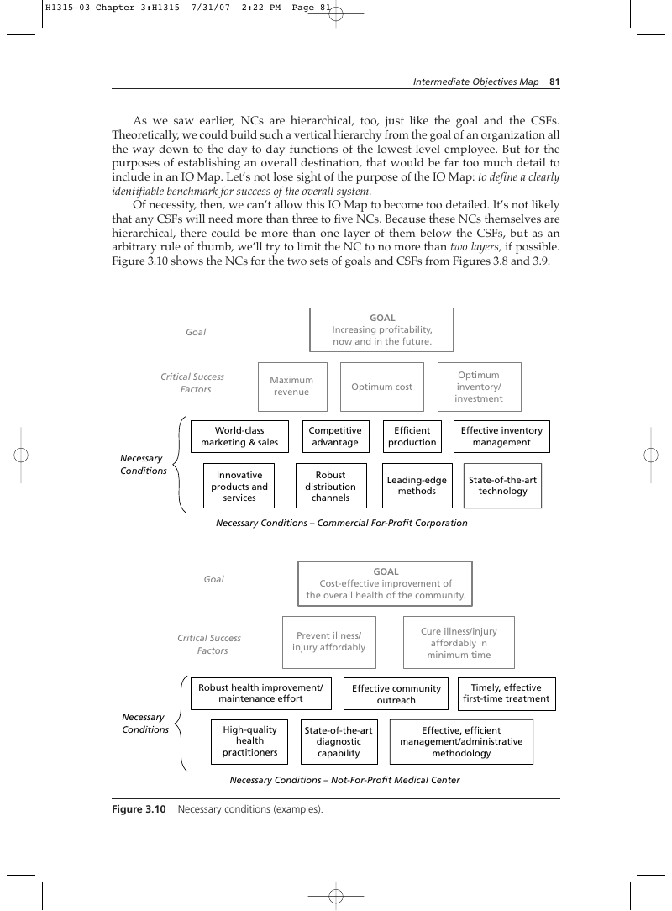

As we saw earlier, NCs are hierarchical, too, just like the goal and the CSFs. Theoretically, we could build such a vertical hierarchy from the goal of an organization all the way down to the day-to-day functions of the lowest-level employee. But for the purposes of establishing an overall destination, that would be far too much detail to include in an IO Map. Let’s not lose sight of the purpose of the IO Map: to define a clearly identifiable benchmark for success of the overall system. Of necessity, then, we can’t allow this IO Map to become too detailed. It’s not likely that any CSFs will need more than three to five NCs. Because these NCs themselves are hierarchical, there could be more than one layer of them below the CSFs, but as an arbitrary rule of thumb, we’ll try to limit the NC to no more than two layers, if possible. Figure 3.10 shows the NCs for the two sets of goals and CSFs from Figures 3.8 and 3.9. GOAL

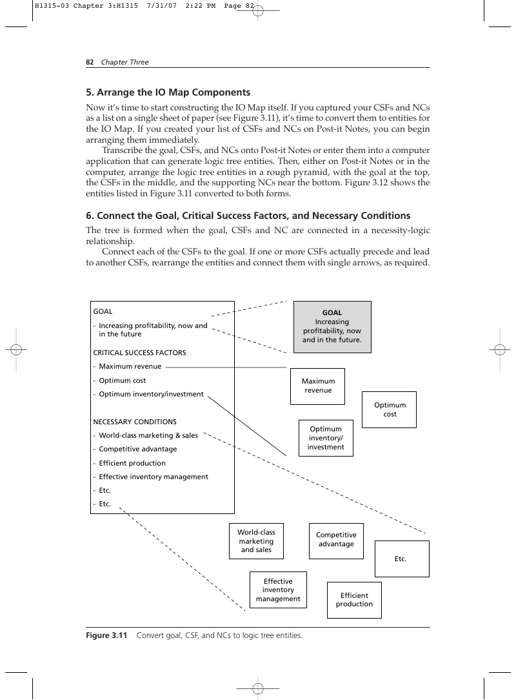

1. Arrange the IO Map Components Now it’s time to start constructing the IO Map itself. If you captured your CSFs and NCs as a list on a single sheet of paper (see Figure 3.11), it’s time to convert them to entities for the IO Map. If you created your list of CSFs and NCs on Post-it Notes, you can begin arranging them immediately. Transcribe the goal, CSFs, and NCs onto Post-it Notes or enter them into a computer application that can generate logic tree entities. Then, either on Post-it Notes or in the computer, arrange the logic tree entities in a rough pyramid, with the goal at the top, the CSFs in the middle, and the supporting NCs near the bottom. Figure 3.12 shows the entities listed in Figure 3.11 converted to both forms.
2. Connect the Goal, Critical Success Factors, and Necessary Conditions The tree is formed when the goal, CSFs and NC are connected in a necessity-logic relationship. Connect each of the CSFs to the goal. If one or more CSFs actually precede and lead to another CSFs, rearrange the entities and connect them with single arrows, as required.

profitability, now and in the future.

- Increasing profitability, now and in the future
- Maximum revenue
- Optimum cost
- Optimum inventory/investment
- World-class marketing & sales
- Competitive advantage
- Efficient production
- Effective inventory management
- Etc.
- Etc.

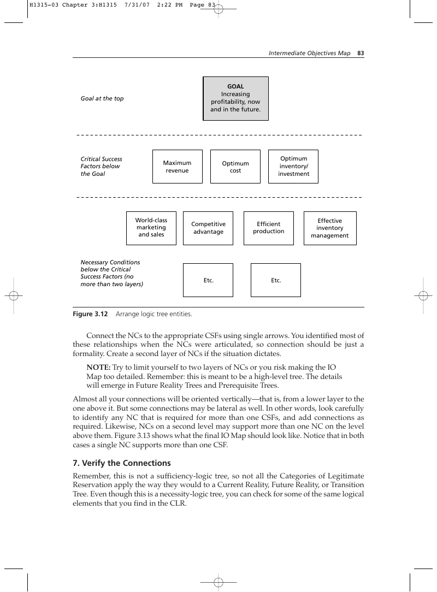

profitability, now and in the future.

Connect the NCs to the appropriate CSFs using single arrows. You identified most of these relationships when the NCs were articulated, so connection should be just a formality. Create a second layer of NCs if the situation dictates.

**NOTE:** Try to limit yourself to two layers of NCs or you risk making the IO Map too detailed. Remember: this is meant to be a high-level tree. The details will emerge in Future Reality Trees and Prerequisite Trees. Almost all your connections will be oriented vertically—that is, from a lower layer to the one above it. But some connections may be lateral as well. In other words, look carefully to identify any NC that is required for more than one CSFs, and add connections as required. Likewise, NCs on a second level may support more than one NC on the level above them. Figure 3.13 shows what the final IO Map should look like. Notice that in both cases a single NC supports more than one CSF.

#### 7. Verify the Connections

Remember, this is not a sufficiency-logic tree, so not all the Categories of Legitimate Reservation apply the way they would to a Current Reality, Future Reality, or Transition Tree. Even though this is a necessity-logic tree, you can check for some of the same logical elements that you find in the CLR.

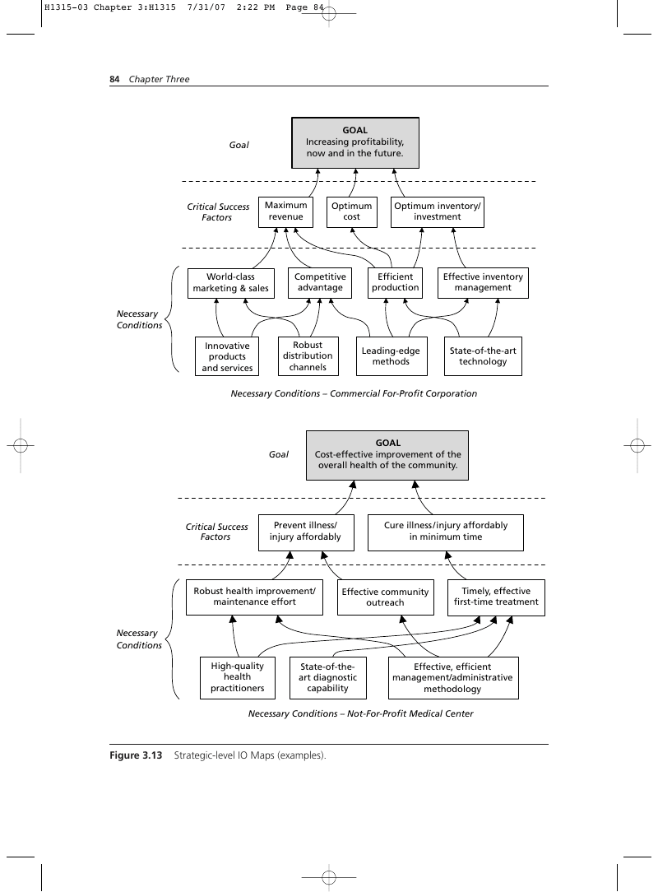

- Consider the CSFs, for example. Are they really indispensable to realizing the goal? If a particular CSF was absent, could the goal still be achieved? If so, then it wasn’t a legitimate CSF in the first place. If it must be there, you can be sure that it’s a legitimate CSF. Repeat this process for each of your proposed CSFs.
- Is the proposed CSF the last thing that must happen (that is, a terminal outcome) before you can safely say the goal will be achieved? Or does it actually produce some intermediate outcome, which would likely be the real CSF?
- Are there only three to five CSFs? If there are fewer than three, it may be okay for the particular circumstances in question. If there are more than five—say, six or seven— that may be okay, too. But once you get beyond five, the chances increase dramatically that one or more of them may be a NC that supports one of the “real” three to four CSFs. If this is the case, drop that entity down to the NC level of your tree. The “10,000-Foot Test” Once you think you’ve identified the right number of CSFs and NCs, and you think you’ve got them all “wired” (that is, connected) properly, cross-check the entire tree with your intuition. How do you do this? Take the “10,000-foot view.” If you’ve ever stood on a mountain top and looked at a valley below, you know that you don’t see much detail. What you do see is overall patterns and relationships among physical land features: streams, forests, hills, and so on. Cultivated fields become part of a larger farm. Individual houses blend into crossing streets in a town. Roads intersect in complex patterns you don’t see (except in your mind’s eye) when you’re driving on them. Try looking at the IO Map in the same way. Do the NCs that support a particular CSF all seem to be part of an integrated pattern, and does that pattern reflect your intuition about how life is, or must be? Are those integrated patterns all topically related (for example, marketing and sales, production, inventory and distribution, engineering, and so on)? And does your intuition tell you that those overall topics are truly indispensable to achieving the goal? If so, your IO Map passes the “10,000-foot test.” If not, adjust it until it does.*

#### 8. Enlist Outside Scrutiny of the Entire IO Map

The “10,000-foot test” is only your individual effort to verify the completeness and validity of your IO Map. A critical part of verification is outside scrutiny. This is particularly important if you’re working on an organizational issue, rather than a personal problem. Remember that you’re “setting the survey stakes” for the layout of a solution to a complex problem. Different people of varying influence will have different perspectives on what the organization should be doing to reach its goal (or even different ideas about what the goal actually is, if senior leadership has not clearly articulated it). Remember, too, our earlier discussion about span of control and sphere of influence. It’s probable that you’ll need to work in your sphere of influence, or convince somebody in yours to work in theirs on behalf of the problem solution. It really helps later on, during the heavy lifting of problem analysis and solution generation, if everyone whose help you need is “singing from the same sheet of music”—that is, working from the same understanding of goal, CSFs, and NCs. So, don’t be in too much of a rush to charge off into a Current Reality Tree (Chapter 4) until and unless you’re certain that your IO Map accurately reflects a destination and a general route that everyone is likely to subscribe to.

* Some refer to the “10,000-foot test” as the TLAR (pronounced TEE-lar) method, meaning “That Looks About Right.”

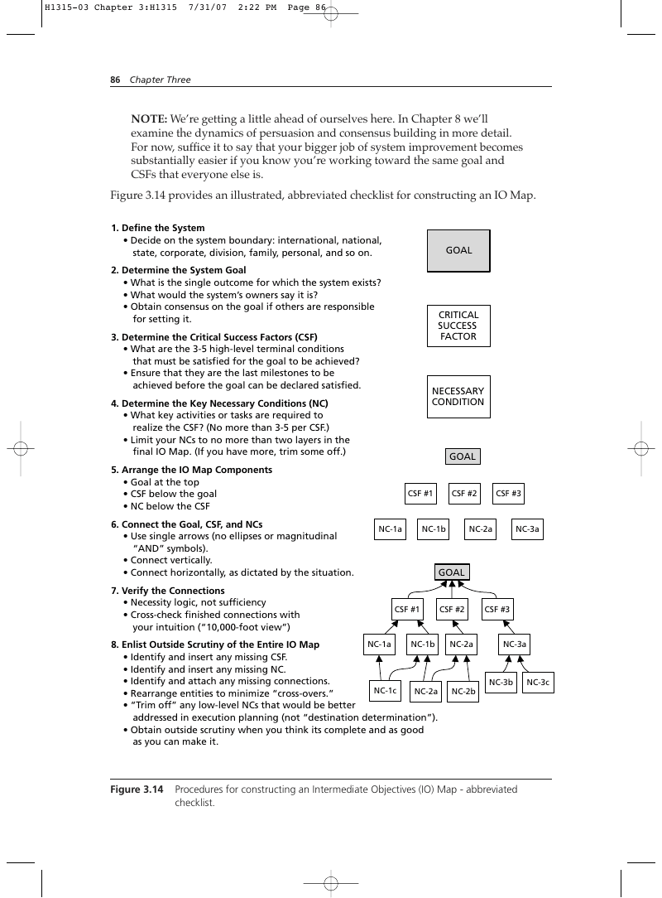

**NOTE:** We’re getting a little ahead of ourselves here. In Chapter 8 we’ll examine the dynamics of persuasion and consensus building in more detail. For now, suffice it to say that your bigger job of system improvement becomes substantially easier if you know you’re working toward the same goal and CSFs that everyone else is. Figure 3.14 provides an illustrated, abbreviated checklist for constructing an IO Map.

1. Define the System
- Decide on the system boundary: international, national, state, corporate, division, family, personal, and so on.
1. Determine the System Goal
- What is the single outcome for which the system exists?
- What would the system’s owners say it is?
- Obtain consensus on the goal if others are responsible for setting it.

### Critical Success Factor

1. Determine the Critical Success Factors (CSF)
- What are the 3-5 high-level terminal conditions that must be satisfied for the goal to be achieved?
- Ensure that they are the last milestones to be achieved before the goal can be declared satisfied.

### Necessary Condition

1. Determine the Key Necessary Conditions (NC)
- What key activities or tasks are required to realize the CSF? (No more than 3-5 per CSF.)
- Limit your NCs to no more than two layers in the final IO Map. (If you have more, trim some off.)
1. Arrange the IO Map Components
- Goal at the top
- CSF below the goal
- NC below the CSF
1. Connect the Goal, CSF, and NCs
- Use single arrows (no ellipses or magnitudinal “AND” symbols).
- Connect vertically.
- Connect horizontally, as dictated by the situation.
1. Verify the Connections
- Necessity logic, not sufficiency
- Cross-check finished connections with your intuition (“10,000-foot view”)
1. Enlist Outside Scrutiny of the Entire IO Map
- Identify and insert any missing CSF.
- Identify and insert any missing NC.
- Identify and attach any missing connections. NC-1c NC-2a
- Rearrange entities to minimize “cross-overs.”
- “Trim off” any low-level NCs that would be better addressed in execution planning (not “destination determination”).
- Obtain outside scrutiny when you think its complete and as good as you can make it.

Procedures for constructing an Intermediate Objectives (IO) Map - abbreviated checklist.

### Summary and Conclusion

In the Lerner and Lowe Broadway musical play Paint Your Wagon, part of a verse from the title song says: Where am I going? I don’t know. When will I be there? I ain’t certain. All that I know is I am on my way. The IO Map is intended to help us avoid that particular situation in real life. It forces us to ask, and agree on the answer to, the question “What is our ultimate goal?” It further demands that we identify the major milestones or accomplishments—the Critical Success Factors—on the road to that goal. And it starts to hint at some of the key necessary conditions, or specific activities, that must be completed for those CSFs to be realized. Any time and effort spent up front constructing an IO Map is well worth the investment. I facilitated the effort of 35 vice presidents and senior managers in the supply chain of a large U.S. supermarket network (1,800 retail stores and 125 distribution centers) to create their strategic IO Map. While getting 35 executives to agree on anything is no small feat, we completed one in about four hours even though they had no prior understanding of what the IO Map was all about. Not only was there consensus on the accuracy of the map, but one vice president later told me, “In the previous company I worked for, it took us four months to do what we did here in four hours.” There’s no better testimony than that to the value of taking the time to define the goal, CSFs, and NCs. Take a look at Figure 3.15 on the next page. This is the kind of outcome you should be striving for: not too detailed, not too high-level, two or three layers of necessary conditions at most. Clearly the critical success factors are high-level terminal outcomes without which the company goal can’t be reached. This example is for a commercial manufacturing company. However, the IO Map of a not-for-profit organization would be similar. (Refer to Appendix A to see the IO Map of an educational foundation.) Now that we have a clear visual image of the destination we should be striving for, we’re ready to take a comprehensive look at where we currently are, determine how big the gap is between the two, and identify the action we should take to eliminate that deviation. Our tool for this will be the Current Reality Tree.

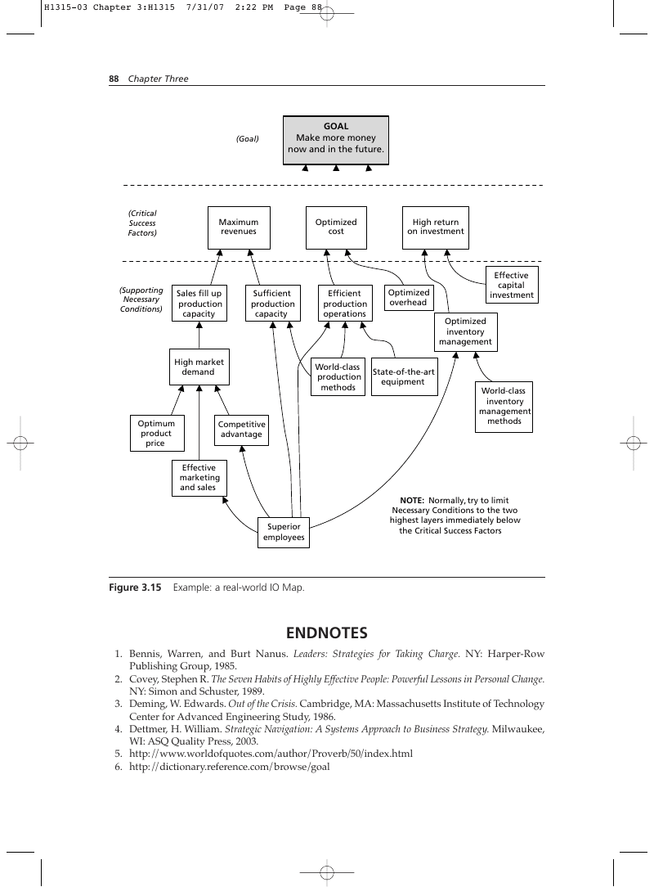

Make more money now and in the future.

### Endnotes

1. Bennis, Warren, and Burt Nanus. Leaders: Strategies for Taking Charge. NY: Harper-Row Publishing Group, 1985.
2. Covey, Stephen R. The Seven Habits of Highly Effective People: Powerful Lessons in Personal Change. NY: Simon and Schuster, 1989.
3. Deming, W. Edwards. Out of the Crisis. Cambridge, MA: Massachusetts Institute of Technology Center for Advanced Engineering Study, 1986.
4. Dettmer, H. William. Strategic Navigation: A Systems Approach to Business Strategy. Milwaukee, WI: ASQ Quality Press, 2003.
5. http://www.worldofquotes.com/author/Proverb/50/index.html
6. http://dictionary.reference.com/browse/goal

