# Part II -- Gap Analysis and Correction

# Chapter 4: Current Reality Tree

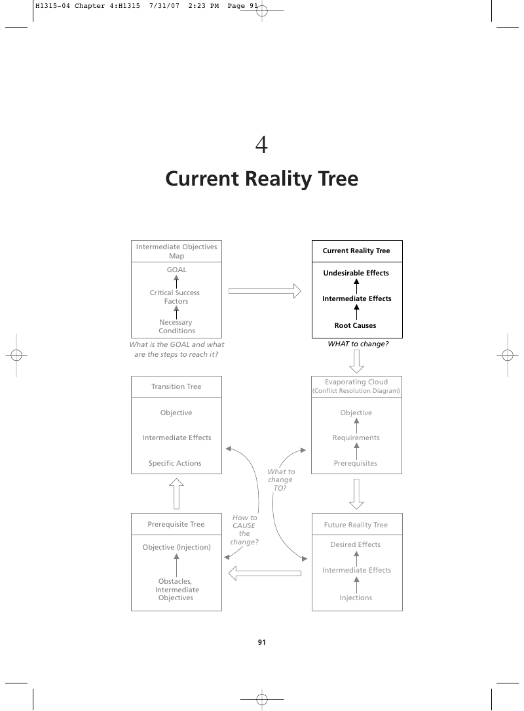

> If you can keep your head when all about you are losing theirs, then you obviously don’t understand the problem.
>
> —Evans’ Law

“It’s not that simple.” How many times have we heard someone say that, usually after a simple solution to a complex problem has been suggested? Does this mean that complex problems can only be solved using complex solutions? No, but it does imply that the complexities of the situation were not fully visible or taken into consideration before a solution was proposed. Corporate downsizing is a typical example. The indications that a problem exists are usually obvious: Profits are down, sales are sluggish, cash flow may be down to a trickle, and finished (unsold) inventory is high. What’s senior management’s most common response? Cut costs—lay people off! It’s a solution, isn’t it? Certainly, but it’s not that simple. The causes of the obvious symptoms of this problem are not as clear cut as the downsizing solution would have us believe. What happens if the problem we’ve identified—excessive costs—is the wrong one? Inevitably, we would expend time, energy, and resources solving the wrong problem, which means that the original problem would still be with us. And that means the overall situation will probably not improve. Or if it does, the improvement is likely to be minimal and only temporary. How can we avoid this pitfall—solving the wrong problem—which not only wastes resources but may actually create new problems where none previously existed? Clearly, the first and most important step is to be certain we’ve identified the real problem correctly. But there’s a funny thing about “real” problems in complex situations. They’re not usually visible to the naked eye. So, what can we do about that? One option is to construct a Current Reality Tree—a logic tree Goldratt designed specifically to find hidden system-level problems in complex situations. In this chapter, we’ll see what a Current Reality Tree is, what it tells us, and why we can be confident that it has pointed us at the right problem, even though that problem may be hidden beneath many layers of cause and effect.

### Definition

A Current Reality Tree (CRT) is a logical structure designed to depict the state of reality as it currently exists in a given system. It reflects the most probable chain of cause and effect, given a specific, fixed set of circumstances. The CRT seeks cause-and-effect connections between visible indications of a system’s condition and the originating causes that produce them (see Figure 4.1). It’s functional rather than organizational, blind to arbitrary internal and external system boundaries. Consequently, it can produce a faithful representation of cause and effect. Please note, however, that a Current Reality Tree is not a complete picture of reality. It reflects only the part perceived to be unfavorable. Though it may accurately depict the causal interconnections of the actual situation, it will only show those elements that directly and unavoidably produce undesirable outcomes. So, in circumstances where a system is functioning properly 80 percent of the time, the Current Reality Tree will show only the 20 percent of the situation when it doesn’t. In this respect, it could be considered a kind of system-level failure mode effects analysis (FMEA).

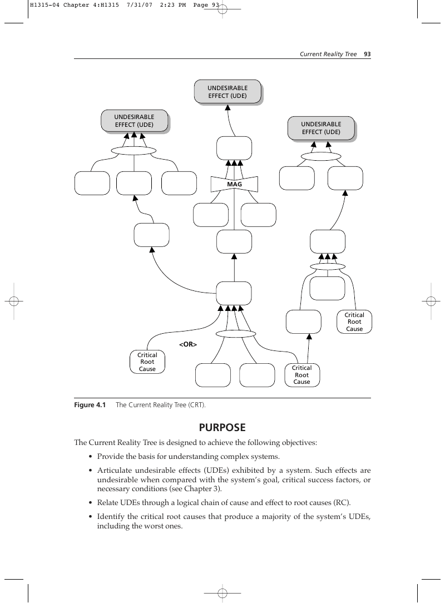

- Provide the basis for understanding complex systems.
- Articulate undesirable effects (UDEs) exhibited by a system. Such effects are undesirable when compared with the system’s goal, critical success factors, or necessary conditions (see Chapter 3).
- Relate UDEs through a logical chain of cause and effect to root causes (RC).
- Identify the critical root causes that produce a majority of the system’s UDEs, including the worst ones.
- Determine which of the root causes lie beyond one’s span of control or sphere of influence.
- Isolate those few causal factors—system constraints—that must be addressed in order to realize the maximum improvement of the system.
- Identify the simplest potential changes that will have the greatest positive impact on the system.

### Assumptions

- Cause and effect is not the same as correlation.
- Interdependencies affect system components. A change in one component will produce collateral changes in one or more other components.
- All processes within a system, and the overall system itself, are subject to variation.
- The operation of a system produces both intended (desirable) and unintended (desirable or undesirable) effects.
- Undesirable effects are undesirable only with respect to the previously defined goal, critical success factors, or necessary conditions of the system.
- Undesirable effects in a system do not exist in isolation from one another.
- All effects within a system (desirable or undesirable) are the products of root causes that may be several steps removed from these effects.
- Cause and effect is governed by the Categories of Legitimate Reservation (CLR) and is verifiable through the CLR.
- Unstated assumptions about reality underlie all cause-and-effect relationships.
- Events related by verifiable cause and effect will be replicable. Another iteration of the chain should give the same effects if no changes to circumstances or to the system are made.

### How to Use This Chapter

- Read “Description of the Current Reality Tree,” the next section. This describes what a Current Reality Tree is and how it works.
- Read “How to Construct a Current Reality Tree” and the associated examples. This section explains in detail each of the steps in building a Current Reality Tree and why they’re necessary.
- Read “Scrutinizing the Current Reality Tree.” This section tells how to ensure that your Current Reality Tree is logically sound and accurately depicts “the way things are.”
- Review Figure 4.46, “Current Reality Tree: Fordyce Corporation.” This is a complete Current Reality Tree that illustrates the challenges faced by a start-up medical technology company. It is a typical real-world example of just how complex reality can be and how effective the Current Reality Tree is at analyzing complex cause and effect.

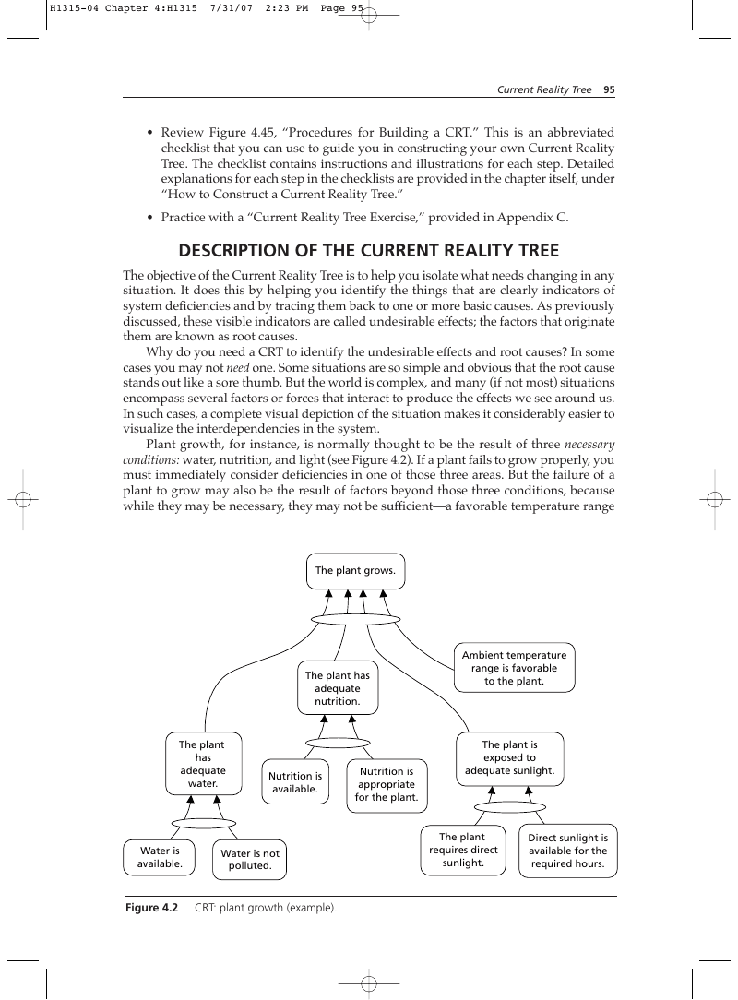

- Review Figure 4.45, “Procedures for Building a CRT.” This is an abbreviated checklist that you can use to guide you in constructing your own Current Reality Tree. The checklist contains instructions and illustrations for each step. Detailed explanations for each step in the checklists are provided in the chapter itself, under “How to Construct a Current Reality Tree.”
- Practice with a “Current Reality Tree Exercise,” provided in Appendix C.

### Description of the Current Reality Tree

The objective of the Current Reality Tree is to help you isolate what needs changing in any situation. It does this by helping you identify the things that are clearly indicators of system deficiencies and by tracing them back to one or more basic causes. As previously discussed, these visible indicators are called undesirable effects; the factors that originate them are known as root causes. Why do you need a CRT to identify the undesirable effects and root causes? In some cases you may not need one. Some situations are so simple and obvious that the root cause stands out like a sore thumb. But the world is complex, and many (if not most) situations encompass several factors or forces that interact to produce the effects we see around us. In such cases, a complete visual depiction of the situation makes it considerably easier to visualize the interdependencies in the system. Plant growth, for instance, is normally thought to be the result of three necessary conditions: water, nutrition, and light (see Figure 4.2). If a plant fails to grow properly, you must immediately consider deficiencies in one of those three areas. But the failure of a plant to grow may also be the result of factors beyond those three conditions, because while they may be necessary, they may not be sufficient—a favorable temperature range is needed, too. Diagnosing the problem may not be as simple as it looks, as most gardeners can tell you. Because most situations are complex, often with inconspicuous causes driving the results, it can be difficult to decide what to change in order to make the situation right. Combined with effective application of the Categories of Legitimate Reservation, a CRT can help reveal complex relationships. For example, if your house is consistently too hot or cold, a knee-jerk reaction might be to adjust the thermostat in the central heating/air conditioning unit. Seems simple enough. But if the outside temperature fluctuates significantly during the course of a day, you could find yourself making a lot of adjustments. This might make the inside temperature acceptable, but it might also result in higher utility bills. The simple CRT in Figure 4.3 shows how much more complex the situation could be than it actually seems. It also shows some root causes that, if you only adjust the thermostat, remain unaddressed and will allow the problem to continue or surface again at another time.

Nutrition is appropriate for the plant.

Ambient temperature range is favorable to the plant.

The plant is exposed to adequate sunlight.

Direct sunlight is available for the required hours.

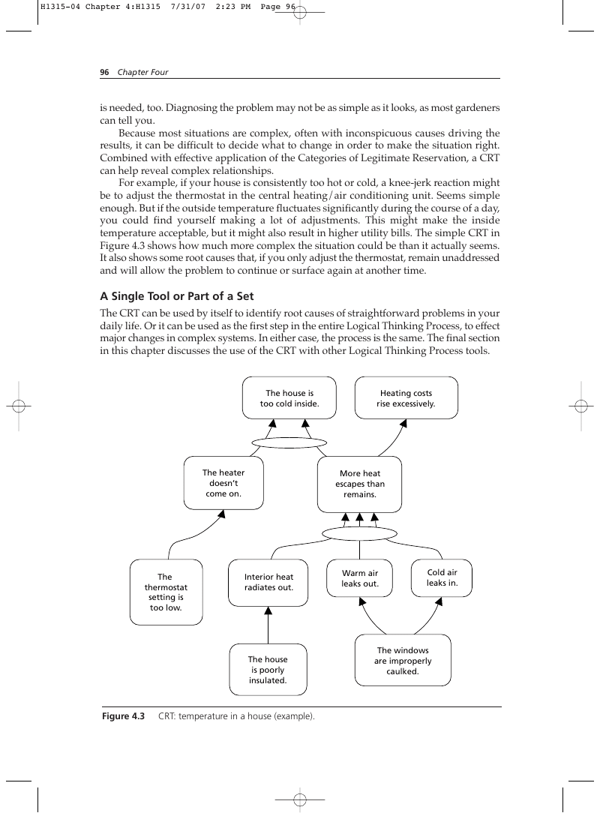

#### A Single Tool or Part of a Set

The CRT can be used by itself to identify root causes of straightforward problems in your daily life. Or it can be used as the first step in the entire Logical Thinking Process, to effect major changes in complex systems. In either case, the process is the same. The final section in this chapter discusses the use of the CRT with other Logical Thinking Process tools.

The house is too cold inside.

The thermostat setting is too low.

**CRT:** temperature in a house (example).

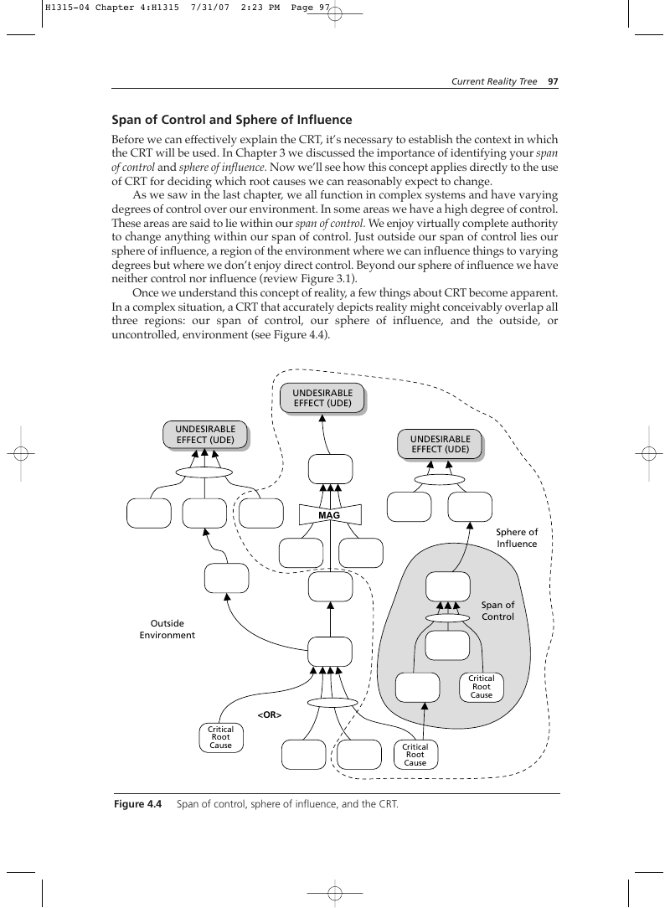

#### Span of Control and Sphere of Influence

Before we can effectively explain the CRT, it’s necessary to establish the context in which the CRT will be used. In Chapter 3 we discussed the importance of identifying your span of control and sphere of influence. Now we’ll see how this concept applies directly to the use of CRT for deciding which root causes we can reasonably expect to change. As we saw in the last chapter, we all function in complex systems and have varying degrees of control over our environment. In some areas we have a high degree of control. These areas are said to lie within our span of control. We enjoy virtually complete authority to change anything within our span of control. Just outside our span of control lies our sphere of influence, a region of the environment where we can influence things to varying degrees but where we don’t enjoy direct control. Beyond our sphere of influence we have neither control nor influence (review Figure 3.1). Once we understand this concept of reality, a few things about CRT become apparent. In a complex situation, a CRT that accurately depicts reality might conceivably overlap all three regions: our span of control, our sphere of influence, and the outside, or uncontrolled, environment (see Figure 4.4). UNDESIRABLE EFFECT (UDE) UNDESIRABLE EFFECT (UDE) UNDESIRABLE EFFECT (UDE)

> The most significant ramification of this situation is the effect it has on our decisions about what we can change in a system. If the most significant root causes lie outside our span of control, we must depend on others for help. This means persuading others to do things they might not be obligated to do. If the root causes lie outside our sphere of influence, we may not be able to do anything about them at all. If this is the case, we must become truly creative in finding ways to work around root causes over which we have no control. Keep the concepts of span of control and sphere of influence in mind while you’re building your Current Reality Tree, but don’t let them limit you in its construction. Follow the cause-and-effect chain wherever it may lead. But after the tree is done, and before you select which root causes to attack, revisit the issue of sphere of influence. Use it to help you decide for which problems you can reasonably expect effective results and for which attack might be futile. Solving problems, especially big ones, is a game to see how far toward the outer limits you can stretch your sphere of influence. “Root Causes” and “Core Problems,” later in this section, address this subject in greater detail. Enthusiasm without knowledge is like running in the dark.
>
> —Unknown

#### Correlation vs. Cause and Effect

The power of the CRT comes from its basis in cause and effect. Sometimes people confuse cause and effect with correlation. It’s important to understand the difference between the two, because CRTs with correlations embedded in them are likely to be invalid: They may isolate the wrong root causes, which could cost you time, energy, and resources in trying to solve the wrong problem. An unidentified embedded correlation will eventually collapse the grandest CRT.* The difference between correlation and cause and effect is essentially the difference between how and why. You have a correlation when you can observe patterns and trends and conclude how one phenomenon behaves in relation to another. But the key element that correlation lacks is the answer to the question “Why?” Without knowing why, you’ll never know what makes the correlation exist. This means you’ll never be sure whether the correlation depends on other variables you haven’t identified. In a problem analysis situation, this could cause you to focus on the wrong problem. It also means that you won’t be able to effectively predict future instances of the correlation, because you’ll never know whether a key variable is present or not. Predicting Rain in Siberia: A Simple Example of Correlation In the summer of 2000, a team of American university researchers was studying social and cultural customs in southern Siberia, near the border with Mongolia.3:36 The researchers camped along the Menza River between the villages of Menza and Ukyr, inhabited by rival populations. In the early part of the 20th century, the rivalry expressed itself in armed conflict but these days it’s limited to a few territorial disputes over hunting grounds. During the dry heat of June, the people of Menza noticed that every time the Americans went swimming in the Ukyr end of the river, rain would follow. After this phenomenon happened three or four days in a row, the jealous residents asked the Americans to swim in the river near Menza, too (see Figure 4.5).

* For a humorous but pointed example of the kinds of erroneous conclusions correlation can produce, see Appendix D.

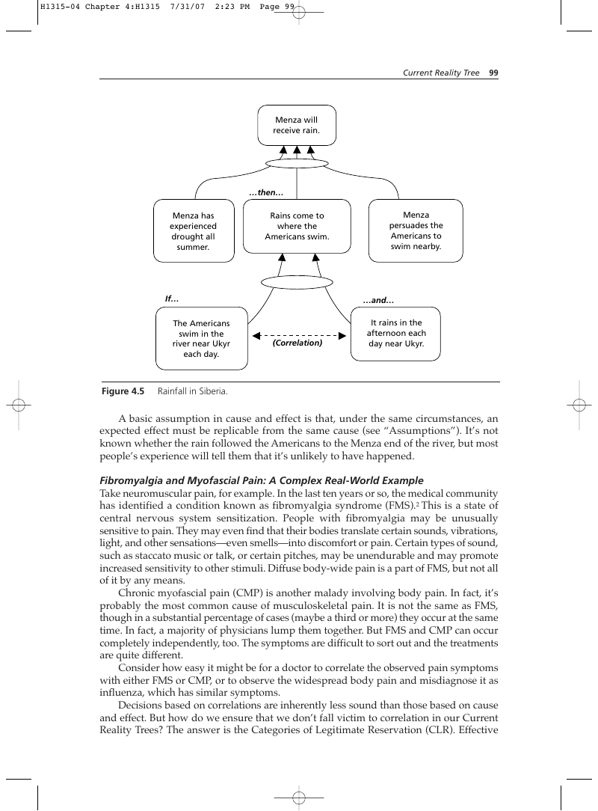

…then… Menza has experienced drought all summer.

Rains come to where the Americans swim.

swim in the river near Ukyr each day.

persuades the Americans to swim nearby.

It rains in the afternoon each day near Ukyr.

A basic assumption in cause and effect is that, under the same circumstances, an expected effect must be replicable from the same cause (see “Assumptions”). It’s not known whether the rain followed the Americans to the Menza end of the river, but most people’s experience will tell them that it’s unlikely to have happened. Fibromyalgia and Myofascial Pain: A Complex Real-World Example Take neuromuscular pain, for example. In the last ten years or so, the medical community has identified a condition known as fibromyalgia syndrome (FMS).2 This is a state of central nervous system sensitization. People with fibromyalgia may be unusually sensitive to pain. They may even find that their bodies translate certain sounds, vibrations, light, and other sensations—even smells—into discomfort or pain. Certain types of sound, such as staccato music or talk, or certain pitches, may be unendurable and may promote increased sensitivity to other stimuli. Diffuse body-wide pain is a part of FMS, but not all of it by any means. Chronic myofascial pain (CMP) is another malady involving body pain. In fact, it’s probably the most common cause of musculoskeletal pain. It is not the same as FMS, though in a substantial percentage of cases (maybe a third or more) they occur at the same time. In fact, a majority of physicians lump them together. But FMS and CMP can occur completely independently, too. The symptoms are difficult to sort out and the treatments are quite different. Consider how easy it might be for a doctor to correlate the observed pain symptoms with either FMS or CMP, or to observe the widespread body pain and misdiagnose it as influenza, which has similar symptoms. Decisions based on correlations are inherently less sound than those based on cause and effect. But how do we ensure that we don’t fall victim to correlation in our Current Reality Trees? The answer is the Categories of Legitimate Reservation (CLR). Effective application of the CLR ensures that correlation is not confused with cause and effect. As you proceed through this chapter, it will be helpful to refer periodically to Chapter 2, “Categories of Legitimate Reservation.” With an understanding of the importance of cause and effect, now let’s look at the elements that make up a Current Reality Tree.

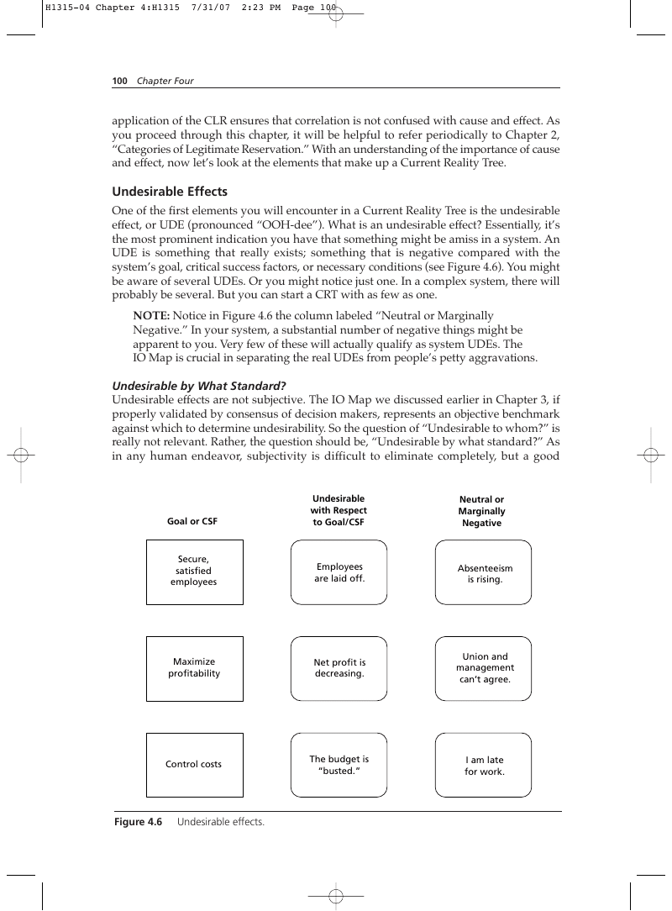

#### Undesirable Effects

One of the first elements you will encounter in a Current Reality Tree is the undesirable effect, or UDE (pronounced “OOH-dee”). What is an undesirable effect? Essentially, it’s the most prominent indication you have that something might be amiss in a system. An UDE is something that really exists; something that is negative compared with the system’s goal, critical success factors, or necessary conditions (see Figure 4.6). You might be aware of several UDEs. Or you might notice just one. In a complex system, there will probably be several. But you can start a CRT with as few as one.

**NOTE:** Notice in Figure 4.6 the column labeled “Neutral or Marginally Negative.” In your system, a substantial number of negative things might be apparent to you. Very few of these will actually qualify as system UDEs. The IO Map is crucial in separating the real UDEs from people’s petty aggravations.

#### Undesirable by What Standard?

Undesirable effects are not subjective. The IO Map we discussed earlier in Chapter 3, if properly validated by consensus of decision makers, represents an objective benchmark against which to determine undesirability. So the question of “Undesirable to whom?” is really not relevant. Rather, the question should be, “Undesirable by what standard?” As in any human endeavor, subjectivity is difficult to eliminate completely, but a good

IO Map should eliminate as much subjectivity about UDEs as is possible under the circumstances.

**NOTE:** A good IO Map notwithstanding, disagreement on UDEs is possible. In most cases, this will be an Entity Existence issue, resolvable by producing supporting evidence. However, in a small percentage of situations, disagreement about undesirability can be a “warning flag” that an underlying hidden conflict must be resolved. It could also be a deliberate attempt to suboptimize the system, something that happens when persons or groups seek to maximize their own performance or reputation at the expense of the larger system (organization). Don’t interrupt building your CRT to handle conflict at this early stage. You may miss some critical element of the conflict by not completing the CRT. Instead, make note of the conflict and consider using the Evaporating Cloud to resolve it. Refer to Chapter 5, “Evaporating Cloud,” for more on how to use this powerful tool to resolve conflict. If you’re constructing the CRT solely for yourself (that is, you’re operating within your span of control), you can be the final arbiter of what’s negative. But if you’re doing it to convince others to take action (you’re operating in your sphere of influence), you’d be well advised to base your declaration of what is or isn’t an UDE on the aforementioned consensus goal, CSF, and NCs of the system under consideration.

#### How to Identify and Check for Undesirability

To determine whether you’ve really got an UDE or just a “fact of life,” phrase the effect in a complete sentence. Then look for these indications of negativity:

- Are others in my organization or situation likely to agree that these effects are negative with respect to the goal, CSF, and NCs (for example, “decreased profits,” “excessive time/cost,” and the like)?

**NOTE:** Plurality does not establish validity, but consensus could be an indication that a CSF or NC isn’t being met.

- Would society at large agree that the effects are negative with respect to its presumed goal, CSF, or NCs (for example, “increased crime rate,” “health deterioration,” and so forth)?
- Does it constitute an unacceptable deviation from expectations?
- Does it adversely affect the Throughput in your system (however “Throughput” may be defined)? If you can answer “yes” to any of these questions, you probably have an UDE. But as a last check, give it the “So what?” test. Read the statement as if someone else were saying it to you, and respond, “So what?” Your first reaction will probably be to come up with a “Because…”. If you have a valid “because…”, that may actually be your UDE. If the statement doesn’t cry out for justification, it can probably stand alone as an undesirable effect.

#### Existence in Reality

The second test of a valid UDE is existence. Does it really exist, or is it someone’s negative fantasy? Consider the example in Figure 4.7: If I speak my mind … then my boss fires me.

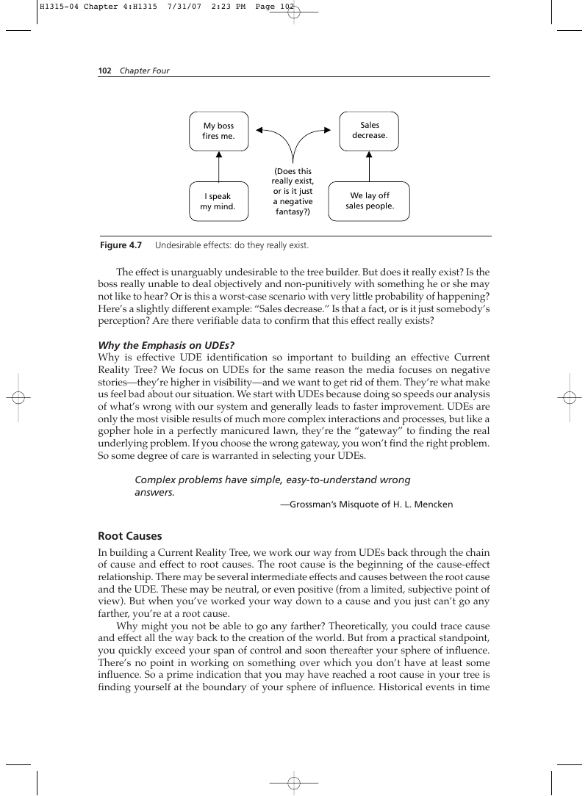

Undesirable effects: do they really exist.

The effect is unarguably undesirable to the tree builder. But does it really exist? Is the boss really unable to deal objectively and non-punitively with something he or she may not like to hear? Or is this a worst-case scenario with very little probability of happening? Here’s a slightly different example: “Sales decrease.” Is that a fact, or is it just somebody’s perception? Are there verifiable data to confirm that this effect really exists?

#### Why the Emphasis on UDEs?

> Why is effective UDE identification so important to building an effective Current Reality Tree? We focus on UDEs for the same reason the media focuses on negative stories—they’re higher in visibility—and we want to get rid of them. They’re what make us feel bad about our situation. We start with UDEs because doing so speeds our analysis of what’s wrong with our system and generally leads to faster improvement. UDEs are only the most visible results of much more complex interactions and processes, but like a gopher hole in a perfectly manicured lawn, they’re the “gateway” to finding the real underlying problem. If you choose the wrong gateway, you won’t find the right problem. So some degree of care is warranted in selecting your UDEs. Complex problems have simple, easy-to-understand wrong answers.
>
> —Grossman’s Misquote of H. L. Mencken

#### Root Causes

In building a Current Reality Tree, we work our way from UDEs back through the chain of cause and effect to root causes. The root cause is the beginning of the cause-effect relationship. There may be several intermediate effects and causes between the root cause and the UDE. These may be neutral, or even positive (from a limited, subjective point of view). But when you’ve worked your way down to a cause and you just can’t go any farther, you’re at a root cause. Why might you not be able to go any farther? Theoretically, you could trace cause and effect all the way back to the creation of the world. But from a practical standpoint, you quickly exceed your span of control and soon thereafter your sphere of influence. There’s no point in working on something over which you don’t have at least some influence. So a prime indication that you may have reached a root cause in your tree is finding yourself at the boundary of your sphere of influence. Historical events in time can’t be changed. Policies, practices, or behaviors that persist today because of them can. Consequently, the root cause can be:

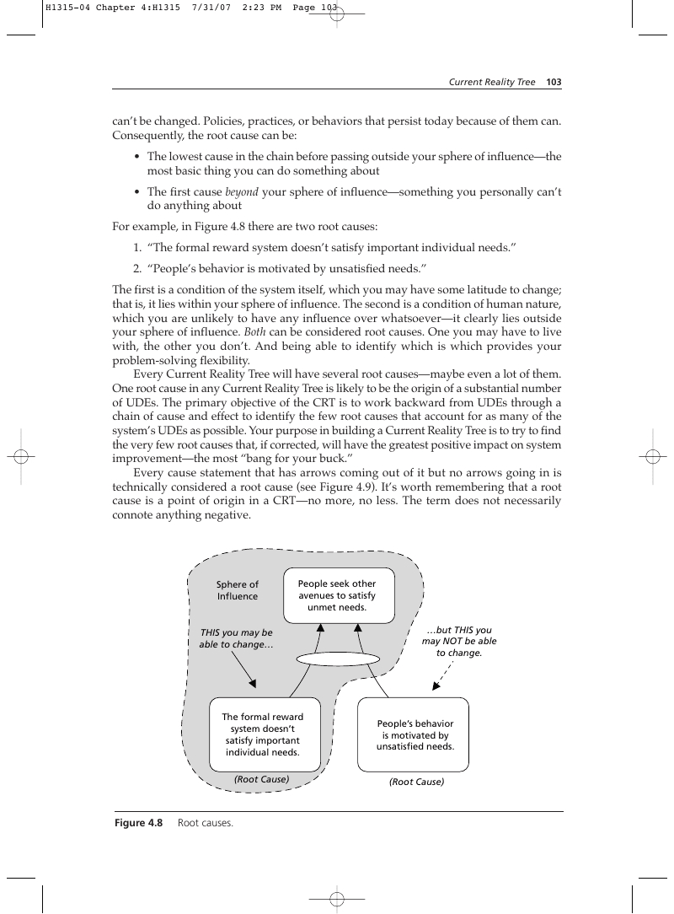

- The lowest cause in the chain before passing outside your sphere of influence—the most basic thing you can do something about
- The first cause beyond your sphere of influence—something you personally can’t do anything about For example, in Figure 4.8 there are two root causes:
1. “The formal reward system doesn’t satisfy important individual needs.”
2. “People’s behavior is motivated by unsatisfied needs.” The first is a condition of the system itself, which you may have some latitude to change; that is, it lies within your sphere of influence. The second is a condition of human nature, which you are unlikely to have any influence over whatsoever—it clearly lies outside your sphere of influence. Both can be considered root causes. One you may have to live with, the other you don’t. And being able to identify which is which provides your problem-solving flexibility. Every Current Reality Tree will have several root causes—maybe even a lot of them. One root cause in any Current Reality Tree is likely to be the origin of a substantial number of UDEs. The primary objective of the CRT is to work backward from UDEs through a chain of cause and effect to identify the few root causes that account for as many of the system’s UDEs as possible. Your purpose in building a Current Reality Tree is to try to find the very few root causes that, if corrected, will have the greatest positive impact on system improvement—the most “bang for your buck.” Every cause statement that has arrows coming out of it but no arrows going in is technically considered a root cause (see Figure 4.9). It’s worth remembering that a root cause is a point of origin in a CRT—no more, no less. The term does not necessarily connote anything negative.

People seek other avenues to satisfy unmet needs.

…but THIS you may NOT be able to change.

The formal reward system doesn’t satisfy important individual needs.

People’s behavior is motivated by unsatisfied needs.

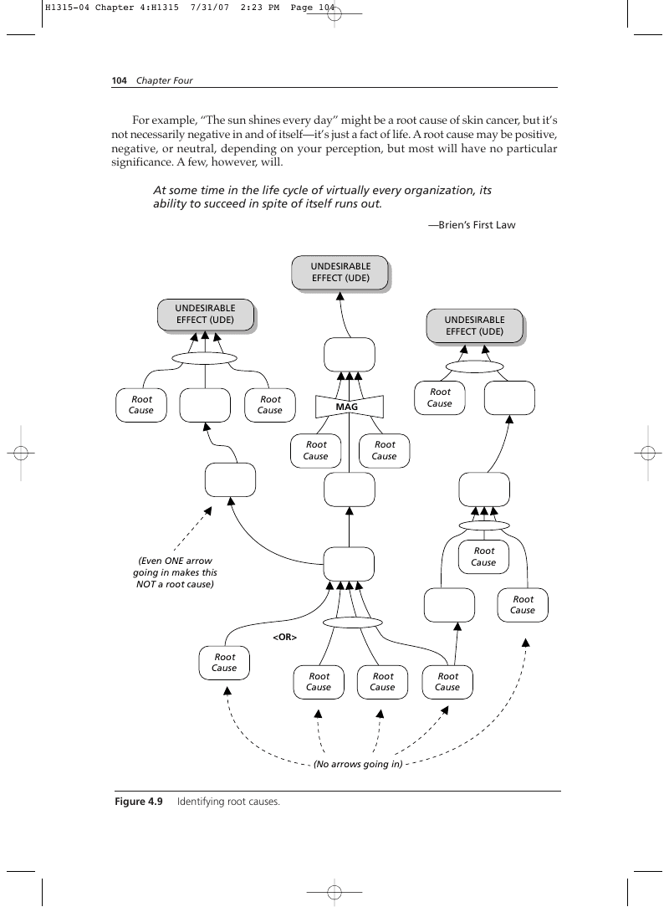

> For example, “The sun shines every day” might be a root cause of skin cancer, but it’s not necessarily negative in and of itself—it’s just a fact of life. A root cause may be positive, negative, or neutral, depending on your perception, but most will have no particular significance. A few, however, will. At some time in the life cycle of virtually every organization, its ability to succeed in spite of itself runs out.
>
> —Brien’s First Law

#### Core Problems and Root Causes

From its inception in the early 1990s, the Thinking Process was intended to find what Goldratt referred to as a core problem—the one policy or practice that accounted for most of the undesirable effects experienced by a system. Goldratt even went so far as to offer a criterion: a true core problem would account for 70 percent of the UDEs in a system. However, there are two fundamental weaknesses with the idea of a core problem, as Goldratt originally defined it. The “70 Percent” Criterion The first weakness is conceptual and had to do with the “70 percent” criterion. Such a rule implicitly assumes that “all UDEs are created equal.” If, in fact, every UDE is equally undesirable, then it makes sense to search for a single root cause that accounts for 70 percent of them—or even a simple majority. But Goldratt originally defined “undesirable” as negative on its own merits. In reality, however, nothing can be negative on its own merits. Negativity is always relative to some standard of acceptability. Without any kind of objective benchmark, Thinking Process users are left to decide on their own what’s negative enough to be called an UDE and what isn’t. Naturally, since values differ from one person to another, so too did determination of UDEs. For example, in a single Current Reality Tree I’ve seen one UDE that reads “The company loses money” and another that reads “I’m overloaded with work.” Think about this question: Are these two UDEs equally “bad”? While the second is undeniably negative from the individual’s perspective, why should the larger system care about it? You might make the argument, “Well, the system should care, because overloaded people can’t complete their work on time, or well. And eventually this degrades the company’s welfare. It might even result in financial losses.” This is all true. But the company’s UDE lies in these ultimate system-level results, not in a contributing cause (such as an individual’s overload) farther down in the CRT. Moreover, if different people see UDEs differing in value, then all UDEs are not created equal. If they’re not all equal, what happens if the most important UDEs are in the excluded 30 percent? The obvious answer is that you risk “fiddling while Rome burns” (that is, working on a non-constraint). Such distinctions were rarely made in defining UDEs for early CRTs. As a result, those CRTs often had dozens of UDEs, and the logical structure needed to connect them all became ponderous, staggeringly complex, and—most of all—daunting in the extreme to people who had to present this level of complexity to decision makers. And what about the decision maker, who was unlikely to have the time or patience to wade through such a CRT? Most of them “tuned out” the presentation, with subsequent adverse consequences on their perception of the common sense (and credibility) of the presenter. There were other adverse effects of complex CRTs. It didn’t take long for people to start thinking, “The CRT is too difficult to create, and the results aren’t worth the effort— it’s too confusing!”

#### Inability to Act on a Core Problem

Goldratt’s original procedure for building a CRT actually called for a concerted effort to connect disparate branches of a CRT to a single core problem by searching out V-shaped connections (see Figure 4.10). This kind of effort leads to the second weakness in the idea of a core problem, which is purely practical. The wider the variety of UDEs, the broader the statement of a core problem is required to connect them. Or the deeper you must go in cause and effect to reach a unifying core problem. The former leads to problem statements so vague as to be not actionable (for example, “Management is ineffective”). The second leads to root causes well beyond the span of control, or even the sphere of influence, of most decision makers (for example, “Microsoft is a de facto monopoly.”). What can any decision maker do about either of these? Nothing! The first is not discrete enough to act upon. You would have to break it down into components of managerial deficiency that somebody could actually do something about. The second one may well be outside the influence of even governors, senators, or captains of industry.

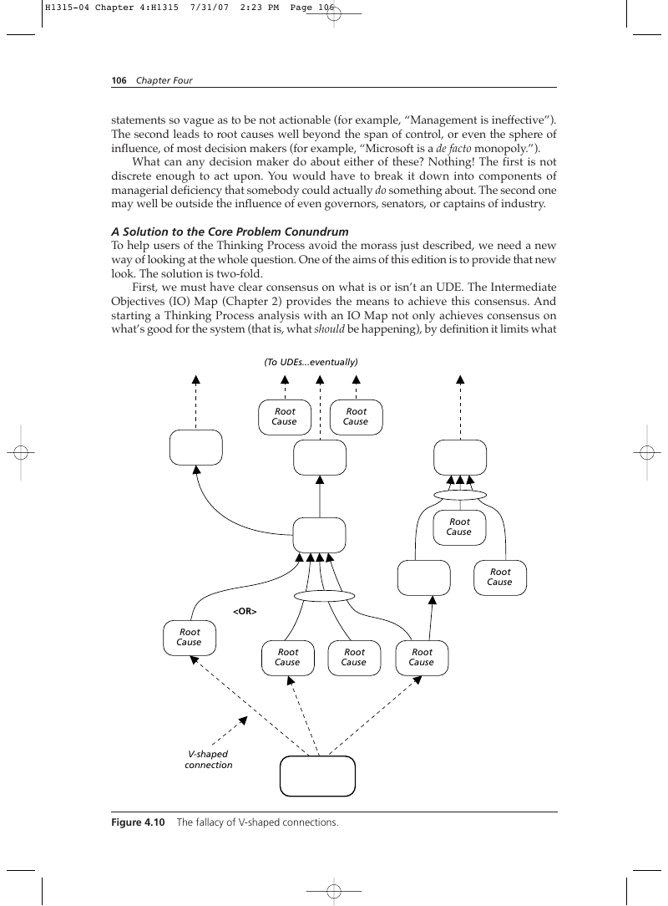

#### A Solution to the Core Problem Conundrum

To help users of the Thinking Process avoid the morass just described, we need a new way of looking at the whole question. One of the aims of this edition is to provide that new look. The solution is two-fold. First, we must have clear consensus on what is or isn’t an UDE. The Intermediate Objectives (IO) Map (Chapter 2) provides the means to achieve this consensus. And starting a Thinking Process analysis with an IO Map not only achieves consensus on what’s good for the system (that is, what should be happening), by definition it limits what (To UDEs...eventually) Root Cause Root Cause Root Cause Root Cause can be considered an UDE to a very few entities in a CRT—those that are obviously and demonstrably negative with respect to a limited, focused benchmark and not a wide range of subjective opinions. Second, in constructing a CRT, we’ll cease to strive for a single unifying (but vague and over-broad) core problem. Instead, we’ll dig down to a few critical root causes that are both actionable and within the sphere of influence of an accessible decision maker. (We’ll define “critical root cause” in a moment.) This approach will usually produce no more than four or five things to work on, rather than a single core problem (see Figure 4.11). Intermediate Objectives Map GOAL

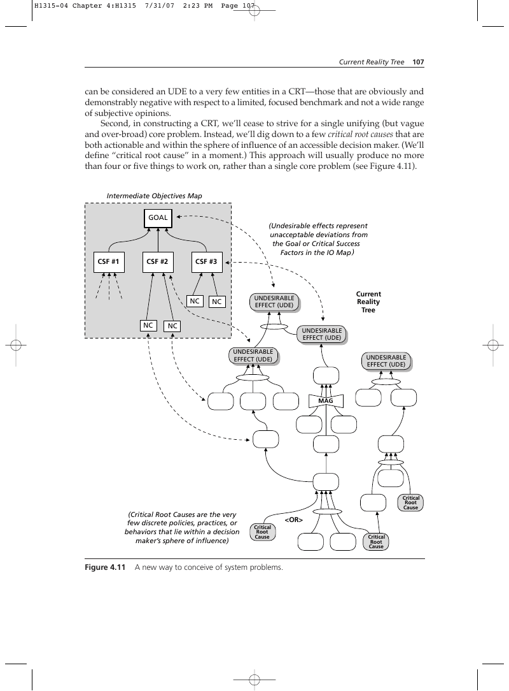

#### Critical Root Cause

(Critical Root Causes are the very few discrete policies, practices, or behaviors that lie within a decision maker’s sphere of influence)

But as Dr. Ray Hansen once observed, “Silver bullets went out of fashion when the Lone Ranger died.” The chances for most people to find one simplistic solution to cure all the ills of system are but two: slim and none. I myself have seen only two such situations in more than ten years of applying the Thinking Process to complex situations. In both cases, the systems were start-up commercial companies, and in both cases the core problem was the same: insufficient start-up capital—an archetypical core problem if ever there were one! So, avoid “heartburn”: Don’t begin a Current Reality Tree to begin solving system problems without first completing an IO Map for the same system.

#### Critical Root Cause: A Definition

In the preceding discussion, we introduced the concept of a critical root cause. It’s important to define this term, especially since it represents one of the two foundations of our new way of looking at current reality and complex system problem solving. A critical root cause is a policy, practice, or prevalent behavior that constitutes the lowest level of causality in existing reality lying within someone’s sphere of influence to change. Notice the two key criteria: lowest level and sphere of influence. Not all root causes qualify. The lowest level might be a historical event, and that could conceivably be a root cause— but not a critical root cause. For a root cause to be critical, it must also reside within someone’s sphere of influence to change. For example, a historical event that can’t be changed would be the creation and adoption of the Constitution of the United States. It happened in 1789, and nothing can change that. And almost everything that America has influenced, good or bad, over the past 200-plus years is an effect of that cause. But the Constitution itself is an elastic document that can be interpreted in a variety of ways (and often is). It represents extremely high-level policy that still exists and operates to this day, even though the historical event of its creation has long past. Which means it can be changed—and has been, 26 times since the original articles were drafted in 1789. Thus, a root cause that says, “The Constitution forbids (or requires)…” could be critical root cause.*

#### Main Body of the CRT

Lying between the UDEs at the top of the CRT and the critical root causes at the bottom is the main body of the tree—all the detailed intermediate causes and effects that connect the two. It’s this articulated causality that explains how the root causes actually lead to the undesirable effects. The details of all this cause and effect will be different for each system we might analyze. The number of differences and their degree will depend on how similar two discrete systems might be to one another. For example, the causality structure for a government organization won’t be close at all to one for a commercial company. Besides the obvious differences in size and mission, the nature of their internal structures and functional interactions would be completely different. Neither are their operating environments quite the same. So in the same way reality differs between systems, we should expect the same of the logical structures of cause and effect that characterize them. * Nothing in the definition of a critical root cause can be construed to mean that changing one will be easy. Like changing the U.S. Constitution, it may be within someone’s sphere of influence, but it may be extremely challenging and time consuming to achieve.

#### Archetypical CRTs

Having just said that CRT causality will be unique to each type of system, we must also be aware that within types of systems cause-and-effect structure is likely to be similar, maybe even nearly identical. For example, two companies that manufacture the same kinds of products using similar processes, or perhaps produce similar services, would likely have similar IO Maps (that is, requirements for success). To the extent that the internal challenges they experience are similar, they might have equivalent UDEs. Because their operating functions would be similar, we might expect to see the same topical branches, maybe even the same kinds of critical root causes in the CRTs of each. This similarity would exist even if the specific wording of entities in their trees differed. Seen in their entirety, the same branches and issues are likely to be discernible. This could be true even of organizations that differed substantially, if they compete against one another in the same environment. Comparable organizations and situations give rise to archetypical CRTs—logic trees that might apply to more than one organization. For example, the CRT of one Boy Scout organization or a state transportation department might be valid for another Boy Scout group or a transportation department in another state. The same is true of the solutions to the critical root causes identified in the CRT (that is, the FRT). This carries simultaneously potential benefits and risks. The chief benefit is that for organizations that don’t compete with one another, such as different Boy Scout groups, there isn’t a need to “re-invent the wheel.” The same solution, logically developed and verified, can be adopted by a similar group. The primary risk is that for companies or groups that compete with one another, access to one’s CRT (or worse, the FRT) can provide a tactical, perhaps even a strategic advantage. Thus, commercial companies have learned to hold CRTs and FRTs as proprietary information and secure them in order to avoid harm to themselves. No point in giving away the secrets of your success without making the enemy work for them! For this reason, it’s usually difficult to find for-profit companies willing to have their Thinking Process analyses trees published or otherwise made available to people outside the company. (For many years, lack of such commercial real-world examples has been an obstacle to spreading the use of the Thinking Process.)

#### Depicting a Current Reality Tree

The symbology used to depict current reality is straightforward (see Figure 4.12). The symbols used here conform to the standard conventions described in Chapter 2. A round-cornered rectangle indicates a cause or effect. Effects that are undesirable are highlighted in some way, either by means of stars, asterisks, shading, or perhaps drop shadows. Arrows connect causes with effects. Ellipses are used to indicate that two or more causes must combine to produce the effect.

#### Entities

As you will notice from reading other chapters of this book, all of the Thinking Process logic trees contain statements bordered by some kind of geometric figure. In the Current Reality Tree you should see only round-cornered rectangles. Evaporating Clouds, Future Reality Trees, and Transition Trees have both round-cornered and sharp-cornered rectangles. Prerequisite Trees have octagons and square-cornered rectangles. These figures and the statements they enclose fall into the general category of “entities.” The name itself implies that the idea can stand alone. In accordance with the standard conventions described in Chapter 2, statements in Current Reality, Future Reality, and Transition Trees must be expressed in complete sentences that convey an idea that can stand alone. Entities in IO Maps, Evaporating Clouds, and Prerequisite Trees need not be expressed in complete sentences, provided their meanings are clear.

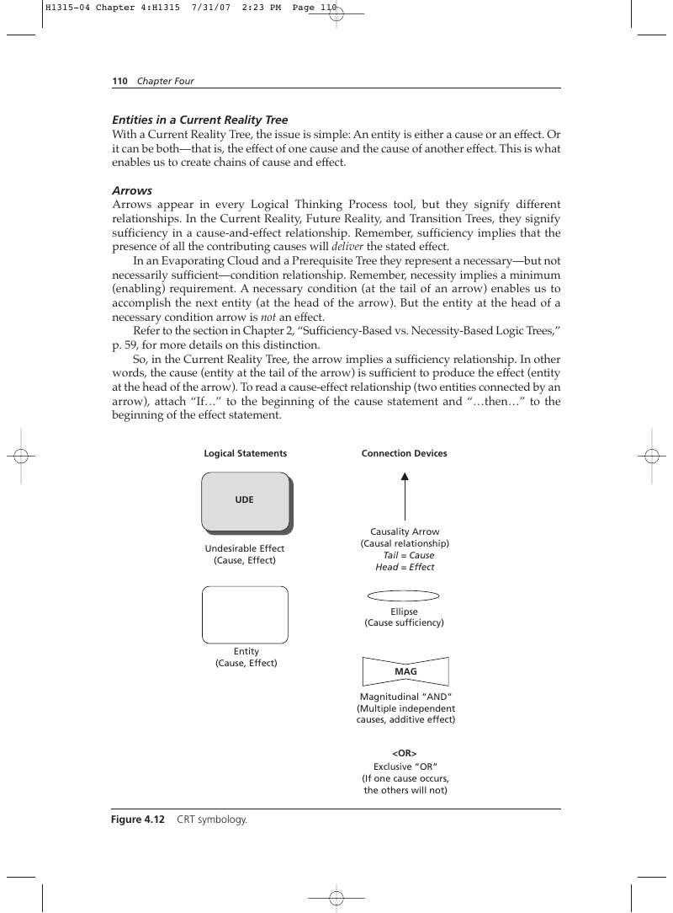

#### Entities in a Current Reality Tree

With a Current Reality Tree, the issue is simple: An entity is either a cause or an effect. Or it can be both—that is, the effect of one cause and the cause of another effect. This is what enables us to create chains of cause and effect.

#### Arrows

Arrows appear in every Logical Thinking Process tool, but they signify different relationships. In the Current Reality, Future Reality, and Transition Trees, they signify sufficiency in a cause-and-effect relationship. Remember, sufficiency implies that the presence of all the contributing causes will deliver the stated effect. In an Evaporating Cloud and a Prerequisite Tree they represent a necessary—but not necessarily sufficient—condition relationship. Remember, necessity implies a minimum (enabling) requirement. A necessary condition (at the tail of an arrow) enables us to accomplish the next entity (at the head of the arrow). But the entity at the head of a necessary condition arrow is not an effect. Refer to the section in Chapter 2, “Sufficiency-Based vs. Necessity-Based Logic Trees,” p. 59, for more details on this distinction. So, in the Current Reality Tree, the arrow implies a sufficiency relationship. In other words, the cause (entity at the tail of the arrow) is sufficient to produce the effect (entity at the head of the arrow). To read a cause-effect relationship (two entities connected by an arrow), attach “If…” to the beginning of the cause statement and “…then…” to the beginning of the effect statement. Logical Statements Connection Devices

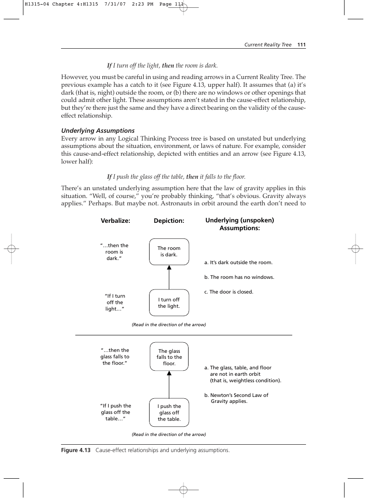

If I turn off the light, then the room is dark. However, you must be careful in using and reading arrows in a Current Reality Tree. The previous example has a catch to it (see Figure 4.13, upper half). It assumes that (a) it’s dark (that is, night) outside the room, or (b) there are no windows or other openings that could admit other light. These assumptions aren’t stated in the cause-effect relationship, but they’re there just the same and they have a direct bearing on the validity of the causeeffect relationship.

#### Underlying Assumptions

Every arrow in any Logical Thinking Process tree is based on unstated but underlying assumptions about the situation, environment, or laws of nature. For example, consider this cause-and-effect relationship, depicted with entities and an arrow (see Figure 4.13, lower half): If I push the glass off the table, then it falls to the floor. There’s an unstated underlying assumption here that the law of gravity applies in this situation. “Well, of course,” you’re probably thinking, “that’s obvious. Gravity always applies.” Perhaps. But maybe not. Astronauts in orbit around the earth don’t need to Verbalize:

a. It’s dark outside the room. b. The room has no windows.

“If I turn off the light…”

c. The door is closed. I turn off the light.

“…then the glass falls to the floor.”

“If I push the glass off the table…”

The glass falls to the floor.

a. The glass, table, and floor are not in earth orbit (that is, weightless condition). b. Newton’s Second Law of Gravity applies.

Figure 4.13 Cause-effect relationships and underlying assumptions.

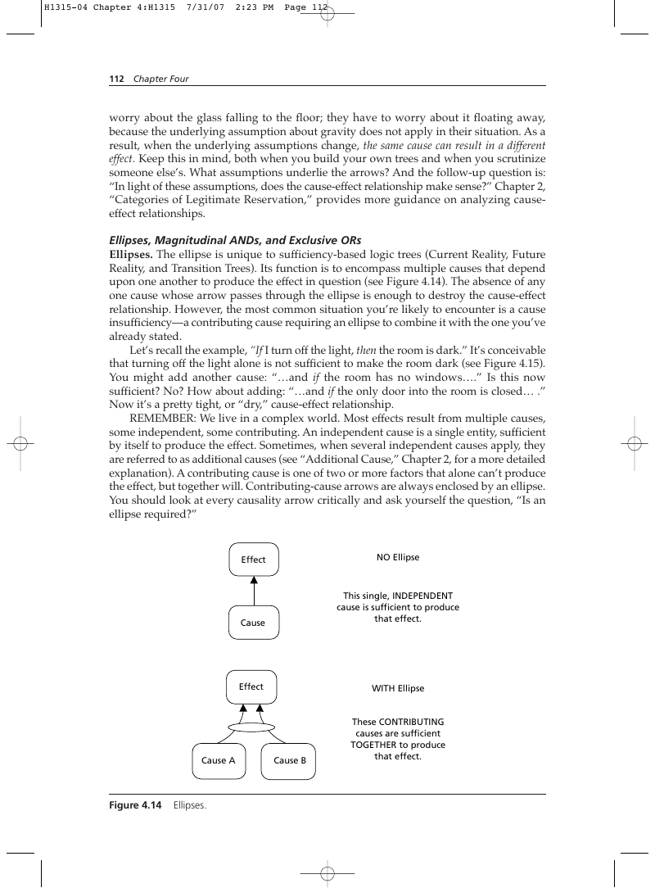

worry about the glass falling to the floor; they have to worry about it floating away, because the underlying assumption about gravity does not apply in their situation. As a result, when the underlying assumptions change, the same cause can result in a different effect. Keep this in mind, both when you build your own trees and when you scrutinize someone else’s. What assumptions underlie the arrows? And the follow-up question is: “In light of these assumptions, does the cause-effect relationship make sense?” Chapter 2, “Categories of Legitimate Reservation,” provides more guidance on analyzing causeeffect relationships.

#### Ellipses, Magnitudinal ANDs, and Exclusive ORs

Ellipses. The ellipse is unique to sufficiency-based logic trees (Current Reality, Future Reality, and Transition Trees). Its function is to encompass multiple causes that depend upon one another to produce the effect in question (see Figure 4.14). The absence of any one cause whose arrow passes through the ellipse is enough to destroy the cause-effect relationship. However, the most common situation you’re likely to encounter is a cause insufficiency—a contributing cause requiring an ellipse to combine it with the one you’ve already stated. Let’s recall the example, “If I turn off the light, then the room is dark.” It’s conceivable that turning off the light alone is not sufficient to make the room dark (see Figure 4.15). You might add another cause: “…and if the room has no windows….” Is this now sufficient? No? How about adding: “…and if the only door into the room is closed… .” Now it’s a pretty tight, or “dry,” cause-effect relationship.

**REMEMBER:** We live in a complex world. Most effects result from multiple causes, some independent, some contributing. An independent cause is a single entity, sufficient by itself to produce the effect. Sometimes, when several independent causes apply, they are referred to as additional causes (see “Additional Cause,” Chapter 2, for a more detailed explanation). A contributing cause is one of two or more factors that alone can’t produce the effect, but together will. Contributing-cause arrows are always enclosed by an ellipse. You should look at every causality arrow critically and ask yourself the question, “Is an ellipse required?”

#### Effect NO Ellipse Cause

causes are sufficient TOGETHER to produce that effect.

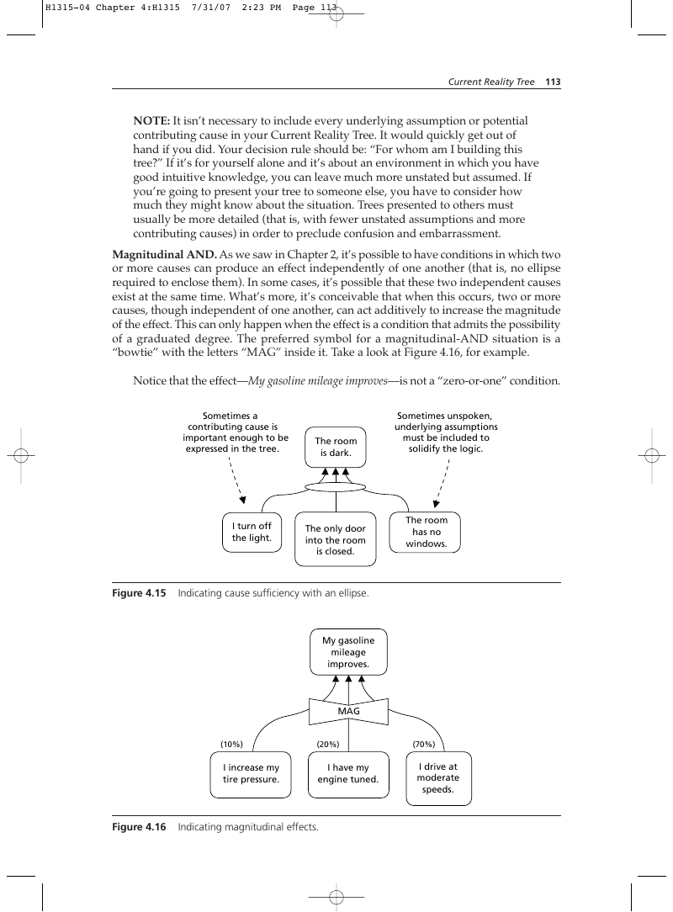

**NOTE:** It isn’t necessary to include every underlying assumption or potential contributing cause in your Current Reality Tree. It would quickly get out of hand if you did. Your decision rule should be: “For whom am I building this tree?” If it’s for yourself alone and it’s about an environment in which you have good intuitive knowledge, you can leave much more unstated but assumed. If you’re going to present your tree to someone else, you have to consider how much they might know about the situation. Trees presented to others must usually be more detailed (that is, with fewer unstated assumptions and more contributing causes) in order to preclude confusion and embarrassment. Magnitudinal AND. As we saw in Chapter 2, it’s possible to have conditions in which two or more causes can produce an effect independently of one another (that is, no ellipse required to enclose them). In some cases, it’s possible that these two independent causes exist at the same time. What’s more, it’s conceivable that when this occurs, two or more causes, though independent of one another, can act additively to increase the magnitude of the effect. This can only happen when the effect is a condition that admits the possibility of a graduated degree. The preferred symbol for a magnitudinal-AND situation is a “bowtie” with the letters “MAG” inside it. Take a look at Figure 4.16, for example. Notice that the effect—My gasoline mileage improves—is not a “zero-or-one” condition. Sometimes a contributing cause is important enough to be expressed in the tree.

The only door into the room is closed.

Sometimes unspoken, underlying assumptions must be included to solidify the logic.

Indicating cause sufficiency with an ellipse.

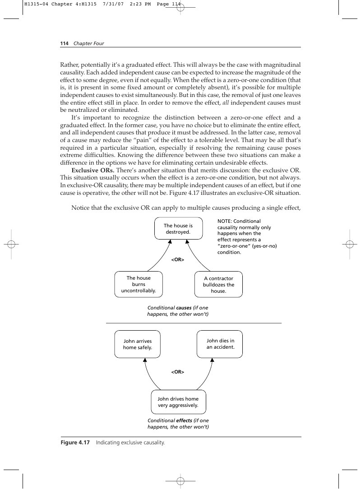

Rather, potentially it’s a graduated effect. This will always be the case with magnitudinal causality. Each added independent cause can be expected to increase the magnitude of the effect to some degree, even if not equally. When the effect is a zero-or-one condition (that is, it is present in some fixed amount or completely absent), it’s possible for multiple independent causes to exist simultaneously. But in this case, the removal of just one leaves the entire effect still in place. In order to remove the effect, all independent causes must be neutralized or eliminated. It’s important to recognize the distinction between a zero-or-one effect and a graduated effect. In the former case, you have no choice but to eliminate the entire effect, and all independent causes that produce it must be addressed. In the latter case, removal of a cause may reduce the “pain” of the effect to a tolerable level. That may be all that’s required in a particular situation, especially if resolving the remaining cause poses extreme difficulties. Knowing the difference between these two situations can make a difference in the options we have for eliminating certain undesirable effects. Exclusive ORs. There’s another situation that merits discussion: the exclusive OR. This situation usually occurs when the effect is a zero-or-one condition, but not always. In exclusive-OR causality, there may be multiple independent causes of an effect, but if one cause is operative, the other will not be. Figure 4.17 illustrates an exclusive-OR situation. Notice that the exclusive OR can apply to multiple causes producing a single effect, causality normally only happens when the effect represents a “zero-or-one” (yes-or-no) condition. NOTE: Conditional

or a single cause producing multiple effects. In either situation, however, the <OR> symbol is used to indicate that if one of the causal connections occurs, it excludes the other.

#### Variations on a Theme

The sufficient causality (ellipse), additional causality (independent arrows), magnitudinal cause (bowtie), and exclusive OR can all have variations. Which one applies depends on the reality of the situation being represented. Figure 4.18 shows some of the combinations you might see (or find yourself needing) in a CRT or FRT. There may be others. Sometimes logic trees (Current Reality, Future Reality, Prerequisite, and Transition) can become quite complex. Figure 4.46 shows just how complicated they can be. An extremely complex tree can be both intimidating and frustrating to a reader, especially someone who isn’t familiar with the graphical way of presenting cause-and-effect logic. As tree builders, we have an obligation to make the reader’s job as easy as possible. One way to do this is to use an orderly means of numbering entities in a tree. The sidebar, “Numbering Entities in a Tree,” describes one such approach. You may elect to use a different one of your own, but the objective should still remain clear in your mind: Keep it simple and easy to follow.

### Sidebar

#### Numbering Entities in a Tree

A tree can have as few as 10 to 20 entities, or it might have a hundred. The U.S. Transportation Command (U.S. Department of Defense), for example, constructed a Current Reality Tree with 170 entities. Without some kind of coherent numbering system, tracing the chain of cause and effect from root causes to UDEs could be a nearly impossible task. Having a finished product that anyone else could follow would be even less likely. So how should the entities in a logic tree by numbered? Whatever method you choose should have three basic characteristics (see Figure 4.19):

1. Numbers should increase in the direction of the arrows.
2. If there is more than one page, it should be easy to follow connections to other pages.
3. A given page should be easy to locate quickly, without undue searching. No single numbering method is necessarily the best. The one suggested here meets the characteristics just mentioned, and offers some other benefits as well. A single numbering sequence will probably suffice if your tree can be confined to one 8½-inch by 11-inch page, or if you’re using paper large enough to keep the tree on one page. Once you find that you need two pages or more, start a new sequence for the second page (see Figure 4.19).
- Don’t number your entities until you’re sure the tree is as logically sound as you can make it (that is, you think all the entities you’ll need are present).
- Use a three-digit method, starting with 100. Every time you start a new page, begin a new sequence (for example, 200 on page two, 300 on page three, and so forth) (see Figure 4.19).
- Later, if you decide you need to add entities, don’t re-number the entire tree. Instead, use decimal numbers for the new additions (for example, 217.1, 224.5, 234.7, and so forth). Figure 4.20 shows an example.

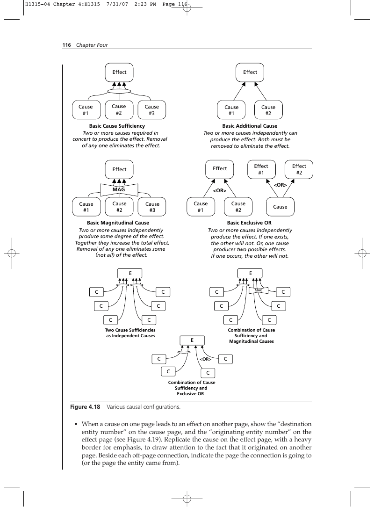

#2 Cause

#1 Cause

#3 Cause

#1

#### Basic Additional Cause

Two or more causes independently can produce the effect. Both must be removed to eliminate the effect.

#### Basic Cause Sufficiency

#1 Cause

#3 Cause

#2

#### Cause

Basic Exclusive OR Two or more causes independently produce the effect. If one exists, the other will not. Or, one cause produces two possible effects. If one occurs, the other will not.

#### Basic Magnitudinal Cause

Two or more causes independently produce some degree of the effect. Together they increase the total effect. Removal of any one eliminates some (not all) of the effect.

#2 Effect

#1 <OR> Cause

#2 Cause

#1 Cause

#2

- When a cause on one page leads to an effect on another page, show the “destination entity number” on the cause page, and the “originating entity number” on the effect page (see Figure 4.19). Replicate the cause on the effect page, with a heavy border for emphasis, to draw attention to the fact that it originated on another page. Beside each off-page connection, indicate the page the connection is going to (or the page the entity came from).

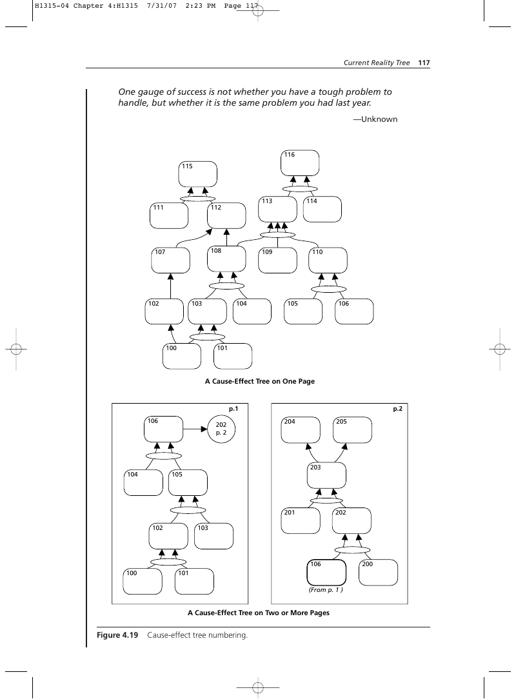

> One gauge of success is not whether you have a tough problem to handle, but whether it is the same problem you had last year.
>
> —Unknown

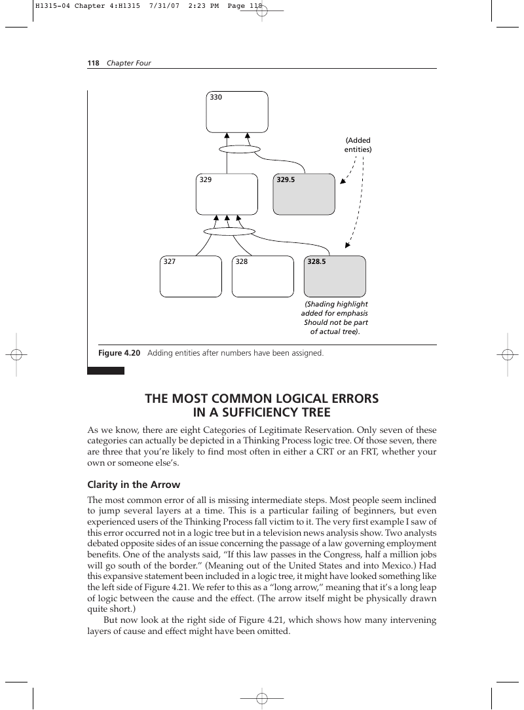

(Shading highlight added for emphasis Should not be part of actual tree.) .

Figure 4.20 Adding entities after numbers have been assigned.

### The Most Common Logical Errors in a Sufficiency Tree

As we know, there are eight Categories of Legitimate Reservation. Only seven of these categories can actually be depicted in a Thinking Process logic tree. Of those seven, there are three that you’re likely to find most often in either a CRT or an FRT, whether your own or someone else’s.

#### Clarity in the Arrow

The most common error of all is missing intermediate steps. Most people seem inclined to jump several layers at a time. This is a particular failing of beginners, but even experienced users of the Thinking Process fall victim to it. The very first example I saw of this error occurred not in a logic tree but in a television news analysis show. Two analysts debated opposite sides of an issue concerning the passage of a law governing employment benefits. One of the analysts said, “If this law passes in the Congress, half a million jobs will go south of the border.” (Meaning out of the United States and into Mexico.) Had this expansive statement been included in a logic tree, it might have looked something like the left side of Figure 4.21. We refer to this as a “long arrow,” meaning that it’s a long leap of logic between the cause and the effect. (The arrow itself might be physically drawn quite short.) But now look at the right side of Figure 4.21, which shows how many intervening layers of cause and effect might have been omitted.

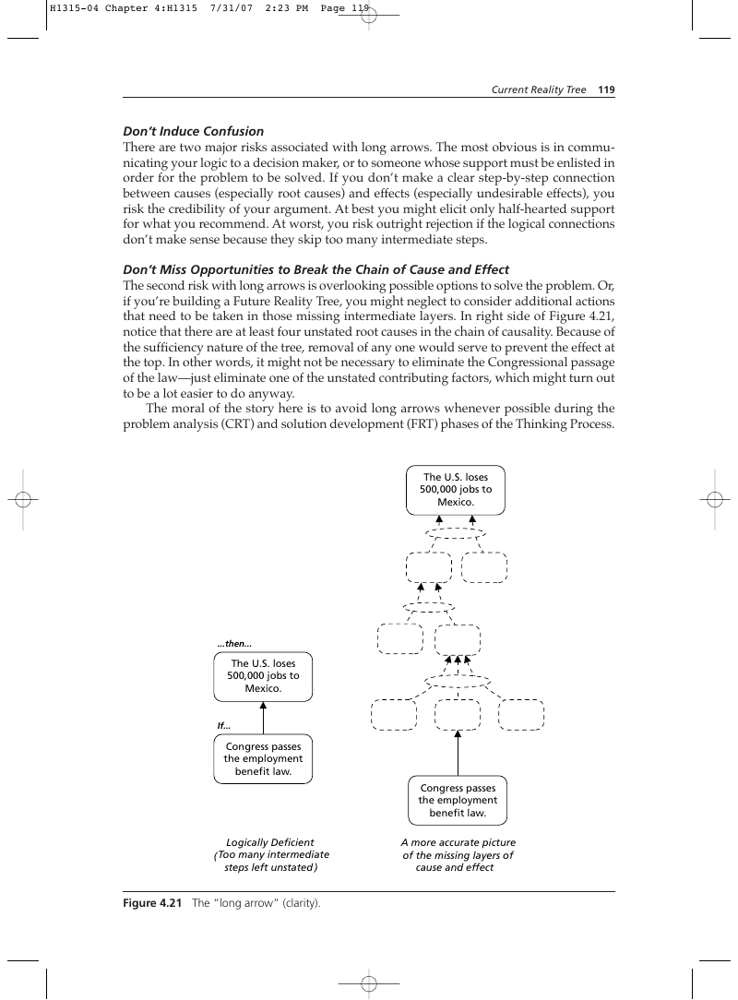

#### Don’t Induce Confusion

There are two major risks associated with long arrows. The most obvious is in communicating your logic to a decision maker, or to someone whose support must be enlisted in order for the problem to be solved. If you don’t make a clear step-by-step connection between causes (especially root causes) and effects (especially undesirable effects), you risk the credibility of your argument. At best you might elicit only half-hearted support for what you recommend. At worst, you risk outright rejection if the logical connections don’t make sense because they skip too many intermediate steps. Don’t Miss Opportunities to Break the Chain of Cause and Effect The second risk with long arrows is overlooking possible options to solve the problem. Or, if you’re building a Future Reality Tree, you might neglect to consider additional actions that need to be taken in those missing intermediate layers. In right side of Figure 4.21, notice that there are at least four unstated root causes in the chain of causality. Because of the sufficiency nature of the tree, removal of any one would serve to prevent the effect at the top. In other words, it might not be necessary to eliminate the Congressional passage of the law—just eliminate one of the unstated contributing factors, which might turn out to be a lot easier to do anyway. The moral of the story here is to avoid long arrows whenever possible during the problem analysis (CRT) and solution development (FRT) phases of the Thinking Process.

The U.S. loses 500,000 jobs to Mexico.

The U.S. loses 500,000 jobs to Mexico.

Figure 4.21 The “long arrow” (clarity).

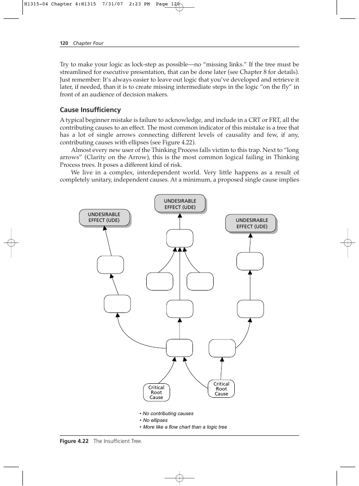

Try to make your logic as lock-step as possible—no “missing links.” If the tree must be streamlined for executive presentation, that can be done later (see Chapter 8 for details). Just remember: It’s always easier to leave out logic that you’ve developed and retrieve it later, if needed, than it is to create missing intermediate steps in the logic “on the fly” in front of an audience of decision makers.

#### Cause Insufficiency

A typical beginner mistake is failure to acknowledge, and include in a CRT or FRT, all the contributing causes to an effect. The most common indicator of this mistake is a tree that has a lot of single arrows connecting different levels of causality and few, if any, contributing causes with ellipses (see Figure 4.22). Almost every new user of the Thinking Process falls victim to this trap. Next to “long arrows” (Clarity on the Arrow), this is the most common logical failing in Thinking Process trees. It poses a different kind of risk. We live in a complex, interdependent world. Very little happens as a result of completely unitary, independent causes. At a minimum, a proposed single cause implies UNDESIRABLE EFFECT (UDE) UNDESIRABLE EFFECT (UDE) UNDESIRABLE EFFECT (UDE) Critical Root Cause Critical Root Cause discrete assumptions about reality that are not stated. And because these assumptions are not stated, they may be completely overlooked. But if they’re critical to the causality, they shouldn’t remain unstated. People tend to forget, overlook, or disregard what is not acknowledged. What if addressing such an unacknowledged assumption is crucial to solving a problem? What if the unstated assumption is really the critical root cause? Ignoring the contributing causes risks failing to identify the right root cause—or at least the one that would most easily and effectively resolve the undesirable effects. The result can be wasted time or resources.* The lesson here is that there should be very few single arrows in either a CRT or an FRT. If you look objectively at your tree and find more than about 25 percent of the connections are single arrows, you had better start examining your logical connections for cause insufficiency.

- No contributing causes
- No ellipses
- More like a flow chart than a logic tree

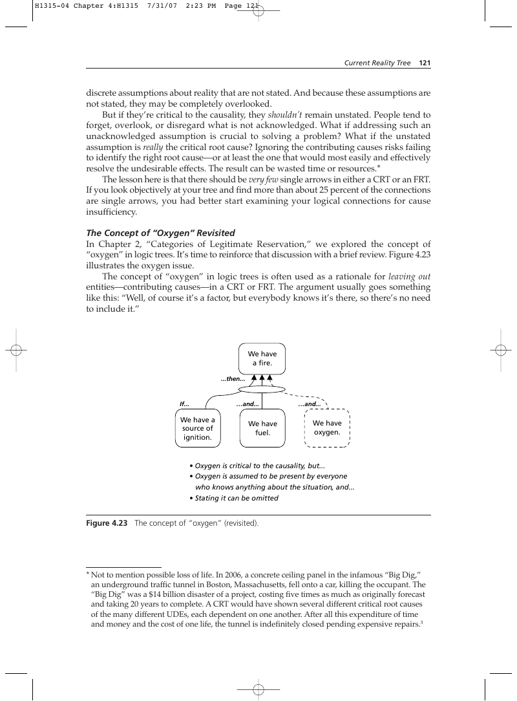

#### The Concept of “Oxygen” Revisited

In Chapter 2, “Categories of Legitimate Reservation,” we explored the concept of “oxygen” in logic trees. It’s time to reinforce that discussion with a brief review. Figure 4.23 illustrates the oxygen issue. The concept of “oxygen” in logic trees is often used as a rationale for leaving out entities—contributing causes—in a CRT or FRT. The argument usually goes something like this: “Well, of course it’s a factor, but everybody knows it’s there, so there’s no need to include it.”

We have a source of ignition.

- Oxygen is critical to the causality, but...
- Oxygen is assumed to be present by everyone who knows anything about the situation, and...
- Stating it can be omitted

Figure 4.23 The concept of “oxygen” (revisited).

* Not to mention possible loss of life. In 2006, a concrete ceiling panel in the infamous “Big Dig,” an underground traffic tunnel in Boston, Massachusetts, fell onto a car, killing the occupant. The “Big Dig” was a $14 billion disaster of a project, costing five times as much as originally forecast and taking 20 years to complete. A CRT would have shown several different critical root causes of the many different UDEs, each dependent on one another. After all this expenditure of time and money and the cost of one life, the tunnel is indefinitely closed pending expensive repairs.3

Unfortunately, not everybody knows it’s there if you don’t state it, and even if they do, it’s easy to forget what isn’t explicitly expressed. Moreover, the “oxygen” argument is often used as an excuse by people defending their failure to even consider contributing causes in the first place. The moral of the story is this: When you construct the actual analysis, include as much detail (that is, step-by-step logic and sufficiency) as may be required to persuade a viewer of the tree who knows little or nothing about the situation. When you present the results of the analysis, you can use judgment about how much to streamline the tree. Your judgment should be based on knowing your audience, meaning that you have a good understanding of the listener’s personal knowledge of the situation. This is a little like holding someone’s hand as you jump over a chasm together: you never want to attempt a leap longer than the person holding your hand can make with you. It’s natural to be concerned about forcing too much detail on people who were not part of the process of building the tree, especially decision makers whose time and patience may be limited. Appendix B provides a way to safeguard your own credibility without “losing your audience.”

#### Entity Existence

> The third most common logical deficiency in CRTs is also the most insidious: Entity Existence. We’re not speaking here of complete sentences or compound ideas, but rather valid existence in reality. Too frequently, I’ve seen speculation passed off as fact in causeand-effect trees. Figure 4.24 is a humorous example intended to drive home this point.* The logical connections are sound, but the outcome is obviously ridiculous because of two failures in Entity Existence. Can you identify which entities they are? The safest way to ensure that our trees meet the Entity Existence requirement is to ensure that we can provide evidence to substantiate every cause or effect we include in our trees. This can be a tall order, and in some cases you might not need to do it. Whether or not you need to do so is a personal judgment, based on what I call the “regret factor” of the situation—the degree of your distaste for an outcome if you fail to verify the entity existence, multiplied by the probability that the unfavorable outcome will happen (see figure 4.25). In some cases, the probability of disaster is very low, but the impact if it happens might be more than you can stand. In such a case, you might conclude that your regret factor is high enough to warrant checking the entity existence. Facts do not cease to exist because they are ignored.
>
> —Aldous Huxley

### Reading a Current Reality Tree

As with any sufficiency tree, the Current Reality Tree is read from the bottom up. It’s relatively easy to read. Since every entity must be worded as a complete sentence, each cause or effect can become a comprehensible clause in a complex sentence. Locate the entity at the tail of the arrow and read it aloud, preceded by the word “If.” After that, read the entity at the head of the arrow, preceded by the word “then.” If you have several

* This example was developed from an exchange between Cliff and Norm, two characters in the American television comedy series Cheers!, about the regular patrons of a sports bar in Boston.

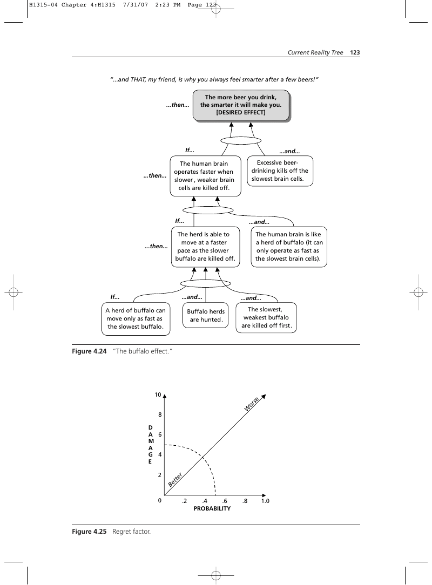

“...and THAT, my friend, is why you always feel smarter after a few beers!” The more beer you drink, the smarter it will make you. [DESIRED EFFECT]

The human brain operates faster when slower , weaker brain cells are killed off.

Excessive beerdrinking kills off the slowest brain cells.

The herd is able to move at a faster pace as the slower buffalo are killed off.

A herd of buffalo can move only as fast as the slowest buffalo.

The human brain is like a herd of buffalo (it can only operate as fast as the slowest brain cells).

...and... The slowest, weakest buffalo are killed off first.

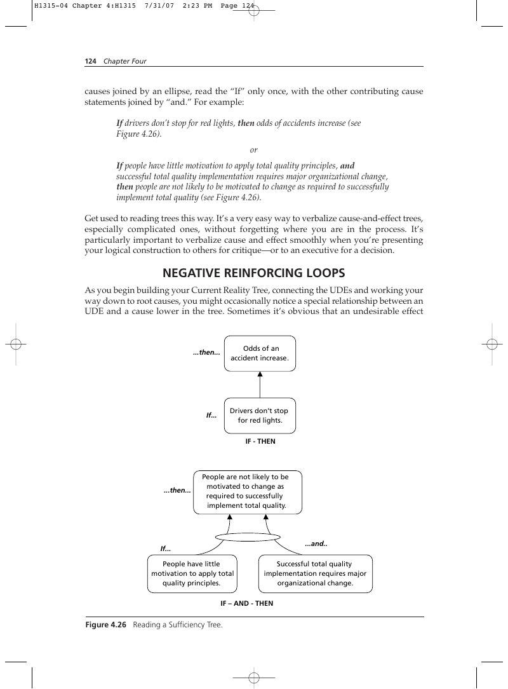

causes joined by an ellipse, read the “If” only once, with the other contributing cause statements joined by “and.” For example: If drivers don’t stop for red lights, then odds of accidents increase (see Figure 4.26). or If people have little motivation to apply total quality principles, and successful total quality implementation requires major organizational change, then people are not likely to be motivated to change as required to successfully implement total quality (see Figure 4.26). Get used to reading trees this way. It’s a very easy way to verbalize cause-and-effect trees, especially complicated ones, without forgetting where you are in the process. It’s particularly important to verbalize cause and effect smoothly when you’re presenting your logical construction to others for critique—or to an executive for a decision.

### Negative Reinforcing Loops

As you begin building your Current Reality Tree, connecting the UDEs and working your way down to root causes, you might occasionally notice a special relationship between an UDE and a cause lower in the tree. Sometimes it’s obvious that an undesirable effect

People are not likely to be motivated to change as required to successfully implement total quality.

If... People have little motivation to apply total quality principles.

Successful total quality implementation requires major organizational change. IF – AND - THEN actually reinforces the cause that produced it. This is known as a negative reinforcing loop. It represents both bad and good news. It’s bad news because you have a self-perpetuating bad situation. It may even magnify the undesirable effect with each iteration of the loop. This is a kind of “death spiral” in which the system causes continual deterioration to itself. However, the fact that you can identify a negative reinforcing loop is good news, because once you know it’s there you can take steps to break it. In fact, you must take steps to break this chain of causality. Eliminating the critical root cause that produces a negative reinforcing loop is one of the most powerful changes for good that you can make. Because of the self-perpetuating characteristic of those entities that are part of the loop, you need to examine the loop carefully:

Figure 4.26 Reading a Sufficiency Tree.

- Will it disappear if a critical root cause is eliminated?
- Will you need to take additional specific actions to break the loop?
- Is it possible that the right corrective action could turn it into a positive reinforcing loop? (Refer to Chapter 6, “Future Reality Tree,” for more on positive reinforcing loops.) Figure 4.27 is an excerpt from a larger CRT. It describes a devastating condition that drove International Harvester Corporation (later reorganized as Navistar) into bankruptcy.

#### Reading a Negative Reinforcing Loop

Reinforcing loops are read a little differently than normal cause and effect. As you work your way up to the point where the loop departs the adverse outcome entity and feeds back to the appropriate cause below it, you still read it as “If…then…”. The difference is that when you re-read the entity where the negative loop re-enters the tree, you add the word “more” (or perhaps “more and more”) at an appropriate place in the sentence. Here’s an example, using Figure 4.27: “If (111) each individual product/component costs more than it did before, then (105) the total cost of many more of IH’s components is higher than the industry average.” Each successive effect entity above the re-entry point in the chain of causality should have “more” or “more and more” inserted in it, until the departure entity for the reinforcing loop is reached. This convention highlights the complete loop for anyone who sees it. If you’re verbally presenting a tree with a reinforcing loop (either positive or negative), read the chain of causality the first time through the loop departure entity without verbalizing “more” (or “more and more”). At the departure entity, mention the negative reinforcing loop first: “At this point, we experience a particularly serious phenomenon…a negative reinforcing loop.” Then re-read the departure entity once more, and read the re-entry point entity. Once you re-enter the tree, read each reinforced entity the second time with “more/more and more” inserted. A negative reinforcing loop is such a detrimental condition that correcting it will often significantly reduce the magnitude of undesirable effects even if nothing else is done to alleviate any other critical root cause.

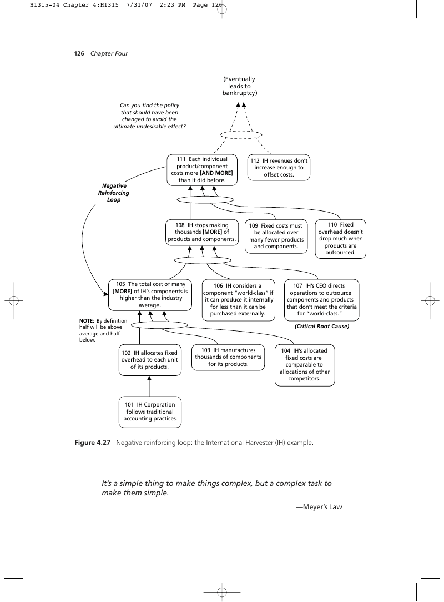

111 Each individual product/component costs more [AND MORE] than it did before.

112 IH revenues don’t increase enough to offset costs.

108 IH stops making thousands [MORE] of products and components.

109 Fixed costs must be allocated over many fewer products and components.

105 The total cost of many [MORE] of IH’s components is higher than the industry average.

106 IH considers a component “world-class” if it can produce it internally for less than it can be purchased externally.

**NOTE:** By definition half will be above average and half below.

102 IH allocates fixed overhead to each unit of its products.

110 Fixed overhead doesn’t drop much when products are outsourced.

103 IH manufactures thousands of components for its products.

104 IH’s allocated fixed costs are comparable to allocations of other competitors.

101 IH Corporation follows traditional accounting practices.

Figure 4.27 Negative reinforcing loop: the International Harvester (IH) example.

> It’s a simple thing to make things complex, but a complex task to make them simple.
>
> —Meyer’s Law

### How to Construct a Current Reality Tree

Now you’re ready to begin constructing your own Current Reality Tree. Before you start, does your situation qualify for a CRT?

- Do you have adequate intuitive knowledge about the situation, or do you need to do some research first? Are you able to recognize and understand patterns and interactions in your system?
- Do you care about finding a solution to the problem? Have you assumed ownership of the problem? Do you have enough desire to fix it to justify the work that lies ahead? If you can answer “yes” to these questions, you’re ready to proceed. Let’s assume that you’ve already recognized that a Current Reality Tree would be appropriate for your situation. There’s something you really need to change about your circumstances. You are able to say, confidently, “My system really needs to improve in these areas…” and put your finger on a few generators of your discontent. What’s the first thing you must do?

#### Gather Materials

CRTs are normally constructed in two forms, either on paper or on a computer using a graphical charting program. My decade-plus of experience in using the Thinking Process has taught me this: unless you already have the entities of the CRT fully formed in your mind with all the causal connections visualized, start your CRT on paper using Post-it Notes. At some point, even before you complete the paper version, you can transition to the computer version. In fact, I do this on almost all my Thinking Process trees (start on paper, finish digitally). If your logic tree is intended for presentation to others at some point, you’ll almost certainly have to render it into a printable digital form. You’ll need a large piece of paper (see Figure 4.28) and open wall space adequate for hanging it. Standard 8½-inch by 11-inch paper won’t do. You can use flip-chart paper (30 inches by 40 inches, or equivalent), butcher paper, or the back of a sheet of wrapping paper—as long as it’s at least 20 inches by 30 inches, preferably larger. If all you have is standard bond paper, tape sheets together until you’ve approximated those dimensions.

- Use flip-chart or other large paper
- Tape multiple pages together on a wall, if required

Make allowances for the fact that you may even have to tape two pieces of flip-chart paper together, as shown in Figure 4.32. You’ll also need a lot of Post-it Notes—the optimum size is 3 inches by 3 inches—and a bold felt-tip pen for writing on the Post-it Notes. Felt-tip pens are preferable to ballpoint, because the mark they make is legible from somewhat farther away.* Your tree will be built from groupings of these notes (entities). Depending on the complexity of your problem, your tree might exceed a hundred entities, so you’ll need an ample supply. I recommend using three different colors: one for UDEs, one for critical root causes, and the third for all the other entities in the tree. Last but not least, you’ll need a few pencils and big erasers. The pencils are for drawing the causality lines on the flip-chart paper. The eraser is for making changes to the routing of these lines, or eliminating some if necessary. As your tree develops, you’ll find yourself moving whole connected clusters of entities from one place to another on the flip-chart paper; the old connecting lines will have to be erased, or they’ll confuse you later.

1. Define the System to be Modeled Your first step should be to identify the boundary of the system you’re concerned about (see Figure 4.29). You need to know what lies within your system and what factors reside outside it, in the external environment. For biological, human, or organizational systems this is usually easy to do. The system is defined as a plant, animal, person, family, or organization (members and assets). For societal systems it may be more difficult. How do you define your “community,” for example? Economic or ecological systems can be extremely challenging. For these, the transition from internal system to external environment is often not clear. This is an essential first step, even if you find that you must go back and refine the definition after your analysis is under way. It might be helpful to ask a few leading questions:
- Is this tree about me personally?
- Is it about an organization—business, government, or not-for-profit (whether or not I’m affiliated with it)?
- Is it about a technical or operational process?
- It the tree describing a historical event (for example, for learning purposes, not necessarily for problem solution)? Once you’ve answered these questions, you will usually find that you’ve pretty well defined your system’s boundaries. Now that you have a clear mental image of what’s inside your system and what’s outside, you’re ready for the next step.
1. Determine the Undesirable Effects Remember, this is not a subjective determination. (See Figure 4.30.) It can only be done with reference to verified system benchmarks of performance: the goal, critical success factors, and key necessary conditions of the system you defined in Step 1. An Intermediate Objectives Map (see Chapter 3) is required to do this, so if you don’t already have a validated IO Map in hand for your target system, stop now and complete one.

* With few exceptions, scrutinizers will view most trees in draft form before they’re rendered into digital form. Two or more people trying to read a handwritten tree on Post-it Notes need the 3”x3” size and bold writing to be able to see the content from distances of three feet or more.

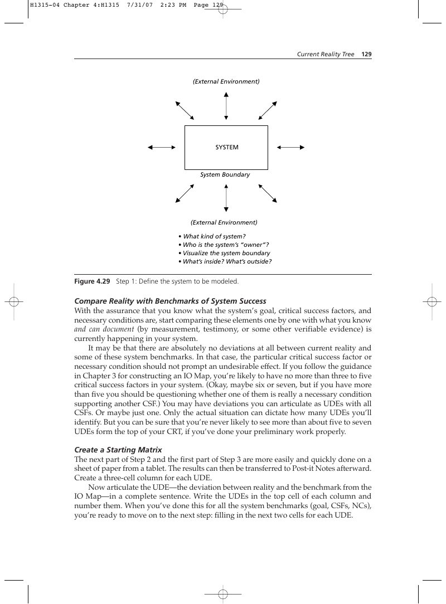

- What kind of system?
- Who is the system’s “owner”?
- Visualize the system boundary
- What’s inside? What’s outside?

Figure 4.29 Step 1: Define the system to be modeled.

#### Compare Reality with Benchmarks of System Success

With the assurance that you know what the system’s goal, critical success factors, and necessary conditions are, start comparing these elements one by one with what you know and can document (by measurement, testimony, or some other verifiable evidence) is currently happening in your system. It may be that there are absolutely no deviations at all between current reality and some of these system benchmarks. In that case, the particular critical success factor or necessary condition should not prompt an undesirable effect. If you follow the guidance in Chapter 3 for constructing an IO Map, you’re likely to have no more than three to five critical success factors in your system. (Okay, maybe six or seven, but if you have more than five you should be questioning whether one of them is really a necessary condition supporting another CSF.) You may have deviations you can articulate as UDEs with all CSFs. Or maybe just one. Only the actual situation can dictate how many UDEs you’ll identify. But you can be sure that you’re never likely to see more than about five to seven UDEs form the top of your CRT, if you’ve done your preliminary work properly.

#### Create a Starting Matrix

The next part of Step 2 and the first part of Step 3 are more easily and quickly done on a sheet of paper from a tablet. The results can then be transferred to Post-it Notes afterward. Create a three-cell column for each UDE. Now articulate the UDE—the deviation between reality and the benchmark from the IO Map—in a complete sentence. Write the UDEs in the top cell of each column and number them. When you’ve done this for all the system benchmarks (goal, CSFs, NCs), you’re ready to move on to the next step: filling in the next two cells for each UDE.

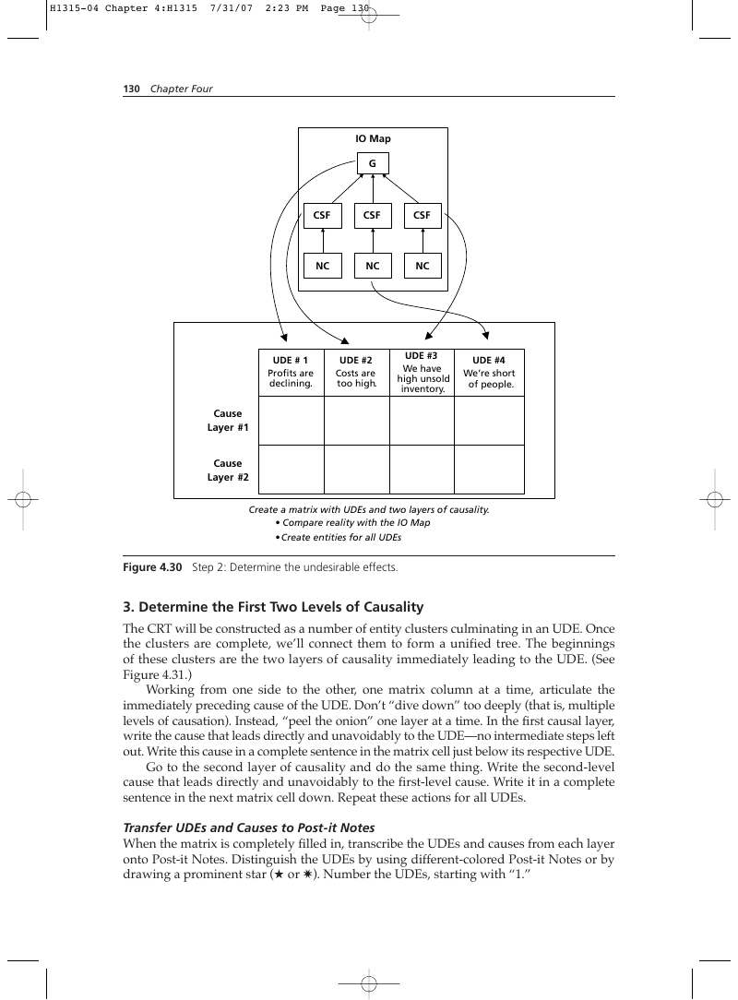

UDE # 1 Profits are declining.

UDE #2 Costs are too high.

UDE #3 We have high unsold inventory.

#### Cause

Layer #2 Create a matrix with UDEs and two layers of causality.

- Compare reality with the IO Map
- Create entities for all UDEs

Figure 4.30 Step 2: Determine the undesirable effects.

#### 3. Determine the First Two Levels of Causality

The CRT will be constructed as a number of entity clusters culminating in an UDE. Once the clusters are complete, we’ll connect them to form a unified tree. The beginnings of these clusters are the two layers of causality immediately leading to the UDE. (See Figure 4.31.) Working from one side to the other, one matrix column at a time, articulate the immediately preceding cause of the UDE. Don’t “dive down” too deeply (that is, multiple levels of causation). Instead, “peel the onion” one layer at a time. In the first causal layer, write the cause that leads directly and unavoidably to the UDE—no intermediate steps left out. Write this cause in a complete sentence in the matrix cell just below its respective UDE. Go to the second layer of causality and do the same thing. Write the second-level cause that leads directly and unavoidably to the first-level cause. Write it in a complete sentence in the next matrix cell down. Repeat these actions for all UDEs.

#### Transfer UDEs and Causes to Post-it Notes

When the matrix is completely filled in, transcribe the UDEs and causes from each layer onto Post-it Notes. Distinguish the UDEs by using different-colored Post-it Notes or by drawing a prominent star (★ or ✷). Number the UDEs, starting with “1.”

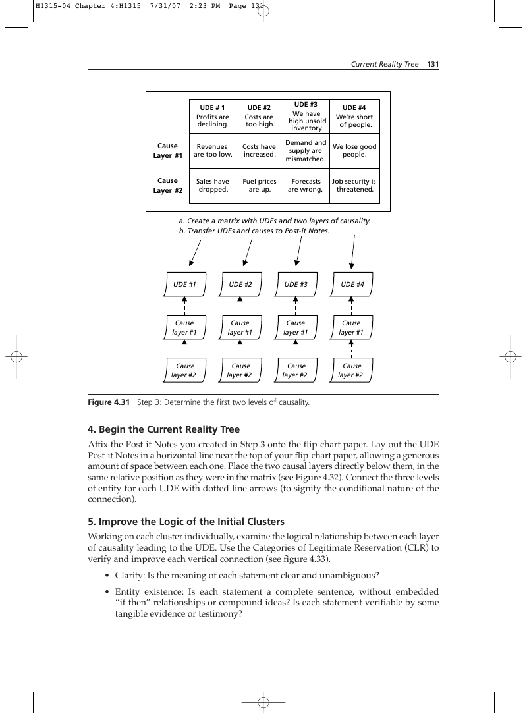

UDE # 1 Profits are declining.

UDE #2 Costs are too high.

Demand and We lose good supply are people. mismatched. Cause a. Create a matrix with UDEs and two layers of causality. b. Transfer UDEs and causes to Post-it Notes.

UDE #4 We’re short of people.

Figure 4.31 Step 3: Determine the first two levels of causality.

1. Begin the Current Reality Tree Affix the Post-it Notes you created in Step 3 onto the flip-chart paper. Lay out the UDE Post-it Notes in a horizontal line near the top of your flip-chart paper, allowing a generous amount of space between each one. Place the two causal layers directly below them, in the same relative position as they were in the matrix (see Figure 4.32). Connect the three levels of entity for each UDE with dotted-line arrows (to signify the conditional nature of the connection).
2. Improve the Logic of the Initial Clusters Working on each cluster individually, examine the logical relationship between each layer of causality leading to the UDE. Use the Categories of Legitimate Reservation (CLR) to verify and improve each vertical connection (see figure 4.33).
- Clarity: Is the meaning of each statement clear and unambiguous?
- Entity existence: Is each statement a complete sentence, without embedded “if-then” relationships or compound ideas? Is each statement verifiable by some tangible evidence or testimony?

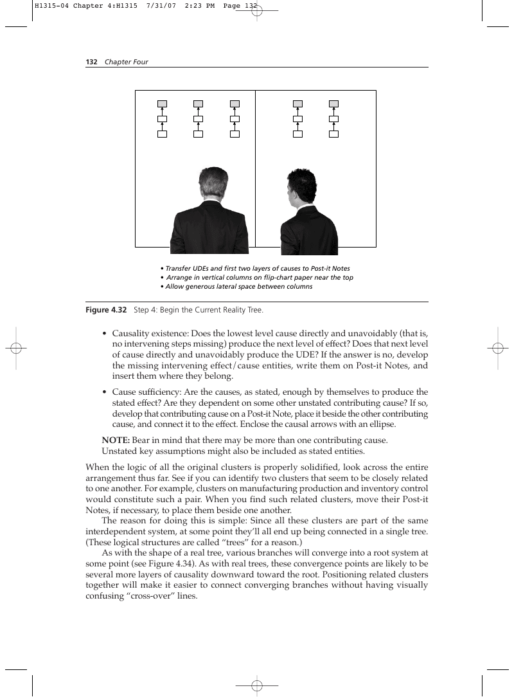

- Transfer UDEs and first two layers of causes to Post-it Notes
- Arrange in vertical columns on flip-chart paper near the top
- Allow generous lateral space between columns

Figure 4.32 Step 4: Begin the Current Reality Tree.

- Causality existence: Does the lowest level cause directly and unavoidably (that is, no intervening steps missing) produce the next level of effect? Does that next level of cause directly and unavoidably produce the UDE? If the answer is no, develop the missing intervening effect/cause entities, write them on Post-it Notes, and insert them where they belong.
- Cause sufficiency: Are the causes, as stated, enough by themselves to produce the stated effect? Are they dependent on some other unstated contributing cause? If so, develop that contributing cause on a Post-it Note, place it beside the other contributing cause, and connect it to the effect. Enclose the causal arrows with an ellipse.

**NOTE:** Bear in mind that there may be more than one contributing cause. Unstated key assumptions might also be included as stated entities. When the logic of all the original clusters is properly solidified, look across the entire arrangement thus far. See if you can identify two clusters that seem to be closely related to one another. For example, clusters on manufacturing production and inventory control would constitute such a pair. When you find such related clusters, move their Post-it Notes, if necessary, to place them beside one another. The reason for doing this is simple: Since all these clusters are part of the same interdependent system, at some point they’ll all end up being connected in a single tree. (These logical structures are called “trees” for a reason.) As with the shape of a real tree, various branches will converge into a root system at some point (see Figure 4.34). As with real trees, these convergence points are likely to be several more layers of causality downward toward the root. Positioning related clusters together will make it easier to connect converging branches without having visually confusing “cross-over” lines.

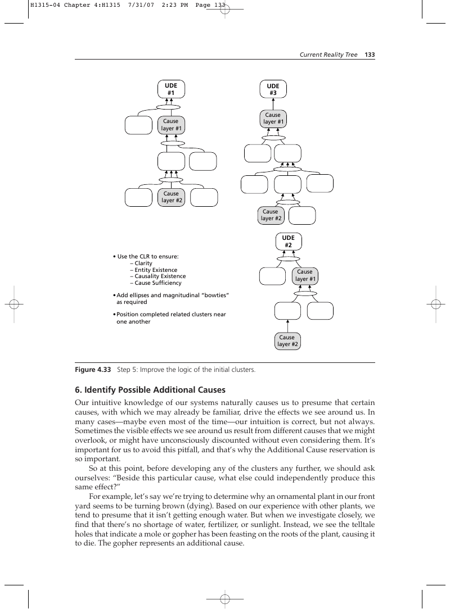

- Use the CLR to ensure:
- Clarity
- Entity Existence
- Causality Existence
- Cause Sufficiency
- Add ellipses and magnitudinal “bowties” as required
- Position completed related clusters near one another

Figure 4.33 Step 5: Improve the logic of the initial clusters.

#### 6. Identify Possible Additional Causes

Our intuitive knowledge of our systems naturally causes us to presume that certain causes, with which we may already be familiar, drive the effects we see around us. In many cases—maybe even most of the time—our intuition is correct, but not always. Sometimes the visible effects we see around us result from different causes that we might overlook, or might have unconsciously discounted without even considering them. It’s important for us to avoid this pitfall, and that’s why the Additional Cause reservation is so important. So at this point, before developing any of the clusters any further, we should ask ourselves: “Beside this particular cause, what else could independently produce this same effect?” For example, let’s say we’re trying to determine why an ornamental plant in our front yard seems to be turning brown (dying). Based on our experience with other plants, we tend to presume that it isn’t getting enough water. But when we investigate closely, we find that there’s no shortage of water, fertilizer, or sunlight. Instead, we see the telltale holes that indicate a mole or gopher has been feasting on the roots of the plant, causing it to die. The gopher represents an additional cause.

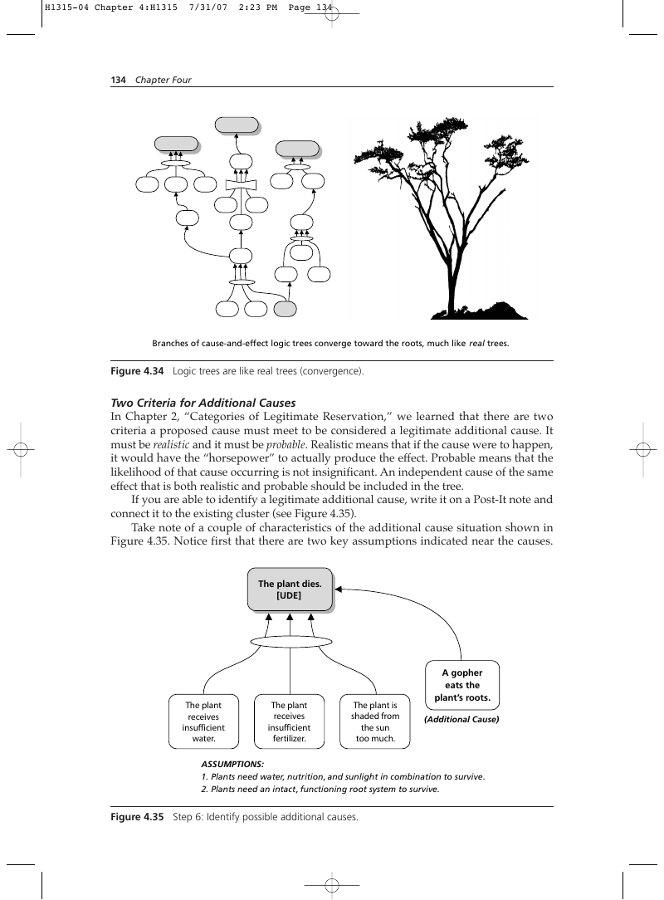

Branches of cause-and-effect logic trees converge toward the roots, much like real trees.

Figure 4.34 Logic trees are like real trees (convergence).

#### Two Criteria for Additional Causes

In Chapter 2, “Categories of Legitimate Reservation,” we learned that there are two criteria a proposed cause must meet to be considered a legitimate additional cause. It must be realistic and it must be probable. Realistic means that if the cause were to happen, it would have the “horsepower” to actually produce the effect. Probable means that the likelihood of that cause occurring is not insignificant. An independent cause of the same effect that is both realistic and probable should be included in the tree. If you are able to identify a legitimate additional cause, write it on a Post-It note and connect it to the existing cluster (see Figure 4.35). Take note of a couple of characteristics of the additional cause situation shown in Figure 4.35. Notice first that there are two key assumptions indicated near the causes.

The plant is shaded from the sun too much.

1. Plants need water, nutrition, and sunlight in combination to survive.
2. Plants need an intact, functioning root system to survive.

Figure 4.35 Step 6: Identify possible additional causes.

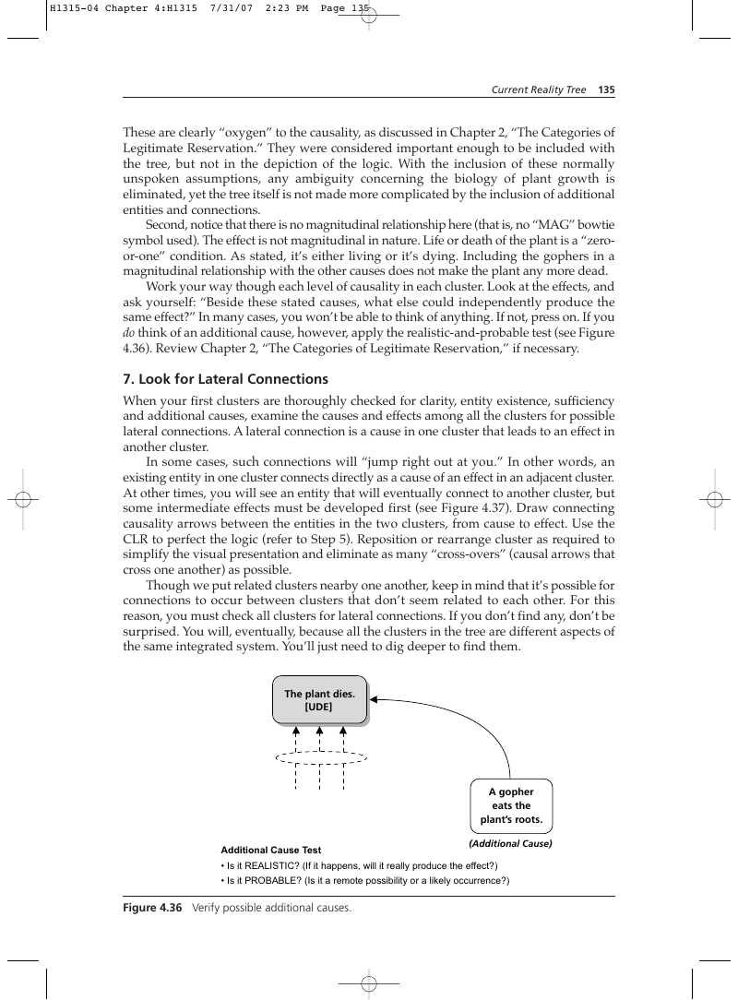

These are clearly “oxygen” to the causality, as discussed in Chapter 2, “The Categories of Legitimate Reservation.” They were considered important enough to be included with the tree, but not in the depiction of the logic. With the inclusion of these normally unspoken assumptions, any ambiguity concerning the biology of plant growth is eliminated, yet the tree itself is not made more complicated by the inclusion of additional entities and connections. Second, notice that there is no magnitudinal relationship here (that is, no “MAG” bowtie symbol used). The effect is not magnitudinal in nature. Life or death of the plant is a “zeroor-one” condition. As stated, it’s either living or it’s dying. Including the gophers in a magnitudinal relationship with the other causes does not make the plant any more dead. Work your way though each level of causality in each cluster. Look at the effects, and ask yourself: “Beside these stated causes, what else could independently produce the same effect?” In many cases, you won’t be able to think of anything. If not, press on. If you do think of an additional cause, however, apply the realistic-and-probable test (see Figure 4.36). Review Chapter 2, “The Categories of Legitimate Reservation,” if necessary.

#### 7. Look for Lateral Connections

When your first clusters are thoroughly checked for clarity, entity existence, sufficiency and additional causes, examine the causes and effects among all the clusters for possible lateral connections. A lateral connection is a cause in one cluster that leads to an effect in another cluster. In some cases, such connections will “jump right out at you.” In other words, an existing entity in one cluster connects directly as a cause of an effect in an adjacent cluster. At other times, you will see an entity that will eventually connect to another cluster, but some intermediate effects must be developed first (see Figure 4.37). Draw connecting causality arrows between the entities in the two clusters, from cause to effect. Use the CLR to perfect the logic (refer to Step 5). Reposition or rearrange cluster as required to simplify the visual presentation and eliminate as many “cross-overs” (causal arrows that cross one another) as possible. Though we put related clusters nearby one another, keep in mind that it’s possible for connections to occur between clusters that don’t seem related to each other. For this reason, you must check all clusters for lateral connections. If you don’t find any, don’t be surprised. You will, eventually, because all the clusters in the tree are different aspects of the same integrated system. You’ll just need to dig deeper to find them.

- Is it REALISTIC? (If it happens, will it really produce the effect?)
- Is it PROBABLE? (Is it a remote possibility or a likely occurrence?)

Figure 4.36 Verify possible additional causes.

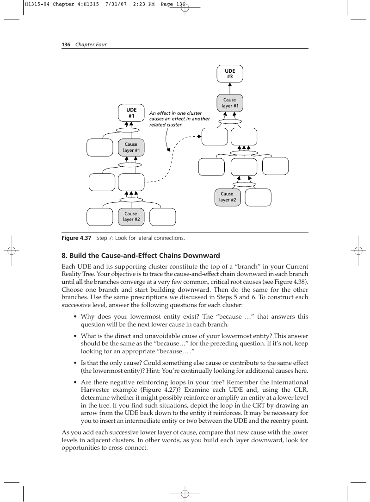

#### Cause

Figure 4.37 Step 7: Look for lateral connections.

#### 8. Build the Cause-and-Effect Chains Downward

Each UDE and its supporting cluster constitute the top of a “branch” in your Current Reality Tree. Your objective is to trace the cause-and-effect chain downward in each branch until all the branches converge at a very few common, critical root causes (see Figure 4.38). Choose one branch and start building downward. Then do the same for the other branches. Use the same prescriptions we discussed in Steps 5 and 6. To construct each successive level, answer the following questions for each cluster:

- Why does your lowermost entity exist? The “because …” that answers this question will be the next lower cause in each branch.
- What is the direct and unavoidable cause of your lowermost entity? This answer should be the same as the “because…” for the preceding question. If it’s not, keep looking for an appropriate “because… .”
- Is that the only cause? Could something else cause or contribute to the same effect (the lowermost entity)? Hint: You’re continually looking for additional causes here.
- Are there negative reinforcing loops in your tree? Remember the International Harvester example (Figure 4.27)? Examine each UDE and, using the CLR, determine whether it might possibly reinforce or amplify an entity at a lower level in the tree. If you find such situations, depict the loop in the CRT by drawing an arrow from the UDE back down to the entity it reinforces. It may be necessary for you to insert an intermediate entity or two between the UDE and the reentry point. As you add each successive lower layer of cause, compare that new cause with the lower levels in adjacent clusters. In other words, as you build each layer downward, look for opportunities to cross-connect.

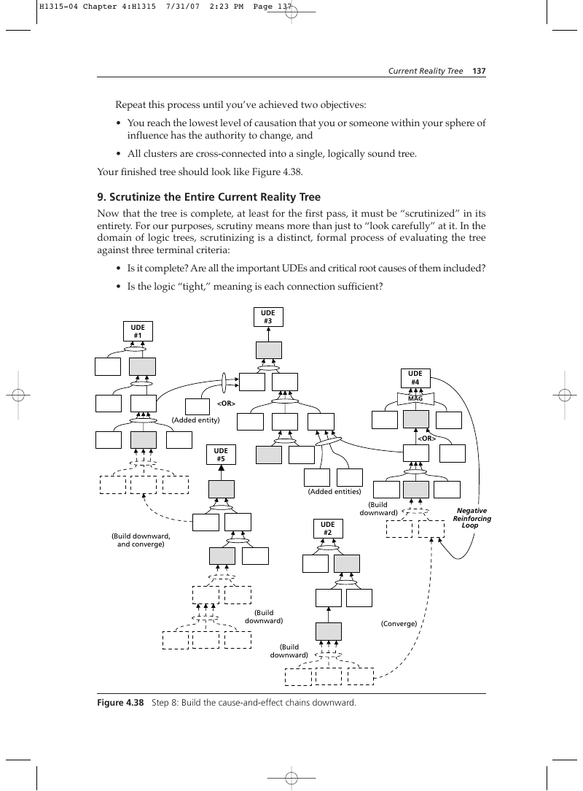

- You reach the lowest level of causation that you or someone within your sphere of influence has the authority to change, and
- All clusters are cross-connected into a single, logically sound tree. Your finished tree should look like Figure 4.38.

#### 9. Scrutinize the Entire Current Reality Tree

Now that the tree is complete, at least for the first pass, it must be “scrutinized” in its entirety. For our purposes, scrutiny means more than just to “look carefully” at it. In the domain of logic trees, scrutinizing is a distinct, formal process of evaluating the tree against three terminal criteria:

- Is it complete? Are all the important UDEs and critical root causes of them included?
- Is the logic “tight,” meaning is each connection sufficient? UDE #3

Figure 4.38 Step 8: Build the cause-and-effect chains downward.

- Is the tree, in its entirety, an accurate reflection of reality as people in the system perceive it? If you showed it to others involved in the system, would they agree that it’s an accurate picture of what’s happening? It’s at this point that you get to actually test the last of the preceding bulleted questions. When you think that your CRT is as good as you can possibly make it, it’s time to show it to others and solicit their scrutiny of its details. It isn’t necessary for outside scrutinizers to understand the Categories of Legitimate Reservation, though that can be helpful. It is necessary, however, that they be intimately familiar with the subject matter of the CRT. You need scrutinizers who can tell you when your tree’s Entity Existence and Causality Existence are questionable, and only those familiar with the system can do that. These outsiders will naturally advise you when your logic seems lacking, though you won’t hear such terms from them as “causality existence reservation” or “cause insufficiency.” Instead, as they “talk around” what they perceive as deficiencies, you’ll recognize the words that characterize one or more of the formal reservation categories.* Especially if you are preparing a CRT for a higher decision maker, or in any other careercritical situation, external scrutiny of your work is essential.

#### 10. Decide Which Root Causes to Attack

Now it’s time for the fun part: deciding where to focus your improvement efforts to realize the most “bang for your buck.” The whole concept of constraint management is intended to help you find those few factors that exercise the most impact on your system. In the case of the CRT, this impact is negative, which means that turning those negatives into positives requires doing something about those critical root causes that account for all the UDEs. As you will notice when you’re working on your own systems, some of those root causes will lie within your span of control—you have unilateral change authority over them. More likely, however, the critical root causes will be within authority of someone else to change, often a senior decision maker. Once you have a finished CRT (see Figure 4.39), you’ll need to decide if you can change a particular critical root cause directly or whether you’ll need the help of someone with more “horsepower.” (Refer to “Span of Control and Sphere of Influence,” earlier in this chapter.) One way to make this determination is to scribe a perimeter on your CRT that defines your span of control.** Then examine all the entities in your tree and decide which ones you can influence, either directly or by persuading others to do so for you. Scribe another perimeter line around those entities, too (see Figure 4.39). Maybe make it a dotted line. Any entities that lie outside your sphere of influence are ones that you will likely have to live with because you can’t cause them to be changed. This is why it is so crucial to reflect sufficiency (that is, all contributing causes, even if they’re static conditions) in your CRT, especially at the root cause level. The mere presence of two or more causal arrows passing through an ellipse provides you with multiple options for modifying actual causation. One of those causes is likely to lie within your sphere of influence. Thus, sufficiency in a CRT helps you focus your efforts on things that you can change, bypassing things that you can’t. Your effectiveness multiplies geometrically when you do that.

* This is why it’s essential for you to understand the Categories of Legitimate Reservation completely. **It may be that your span of control on a particular CRT is so small that it can’t even be depicted. In this case, you’ll have to work exclusively within your sphere of influence.

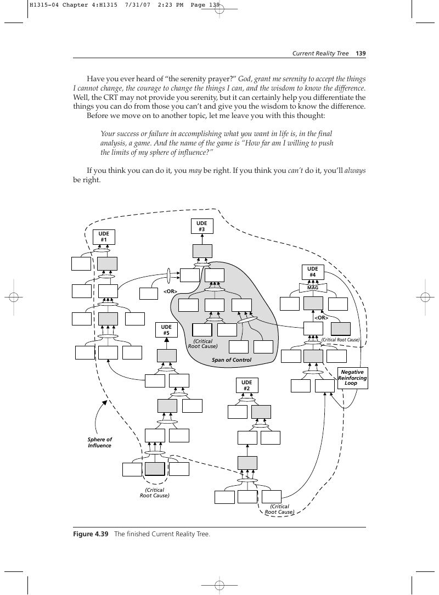

Have you ever heard of “the serenity prayer?” God, grant me serenity to accept the things I cannot change, the courage to change the things I can, and the wisdom to know the difference. Well, the CRT may not provide you serenity, but it can certainly help you differentiate the things you can do from those you can’t and give you the wisdom to know the difference. Before we move on to another topic, let me leave you with this thought: Your success or failure in accomplishing what you want in life is, in the final analysis, a game. And the name of the game is “How far am I willing to push the limits of my sphere of influence?” If you think you can do it, you may be right. If you think you can’t do it, you’ll always be right.

Figure 4.39 The finished Current Reality Tree.

> Figure 4.45 at the end of this chapter is an abbreviated illustrated checklist you can use when you construct your own CRT. Figure 4.46, immediately following the abbreviated checklist, is an example of a real-world CRT. Be thankful for your problems. If they were less difficult, someone with less ability might have your job.
>
> —Unknown

### Scrutinizing the Current Reality Tree

We’ve discussed scrutiny of logic trees in Chapter 2, “The Categories of Legitimate Reservation,” and again earlier in this chapter, “The Most Common Logical Errors in a Sufficiency Tree.” This is the penultimate step in the process of building a Current Reality Tree, and it’s perhaps the most critical because it’s your final “safety net”—the one that will save you from embarrassing fatal credibility errors when it comes time to use your work to persuade decision makers to act the way your analysis indicates that they should. So there are a few other topics we need to cover concerning Current Reality Trees before we move on to the next tool. Scrutinizing is the process of critically examining a logic tree and strengthening it as much as possible. It involves locating and eliminating weaknesses in logic at any point in the tree. As you’ve probably noticed, you do a lot of scrutinizing during the building process—so much, in fact, that you may have to force yourself go back over it again after it’s completed. Moreover, we are all blind to our own mistakes. Despite your best efforts, while your tree looks “just right” to you, it will undoubtedly have sufficiency and additional cause errors, at the very least. No matter how many times you go over the tree, you probably will see right through them. That’s why it’s important to have someone else look at your tree. Clearly, if you plan to present the tree to someone else for the purpose of persuading him or her to do something, it’s absolutely critical to have an independent set of eyes review it for you.

#### The Categories of Legitimate Reservation

As we mentioned earlier, outside scrutinizers need not be well versed in the Categories of Legitimate Reservation (CLR), though it certainly helps if they are. All that’s really necessary for effective scrutiny of a Current Reality Tree is that the person have intuitive knowledge of the tree’s subject matter. As long as you understand the CLR, you’ll be able to translate questions and comments into reservations from one of the eight categories. You can expect the majority of reservations expressed by external scrutinizers to fall into the categories discussed earlier in “Most Common Logical Errors in a Sufficiency Tree.” It’s worth reviewing those just before you begin outside scrutiny.

#### Techniques for “Shortstopping” Logical Challenges

You can take some preventive steps to eliminate characteristics in your logic trees that might invite challenge. These fall under the heading of techniques, rather than procedures, because they’re more a matter of personal style and execution than prescriptive steps. The first of these techniques involves wording entities in such a way that they don’t invite unwarranted dispute.

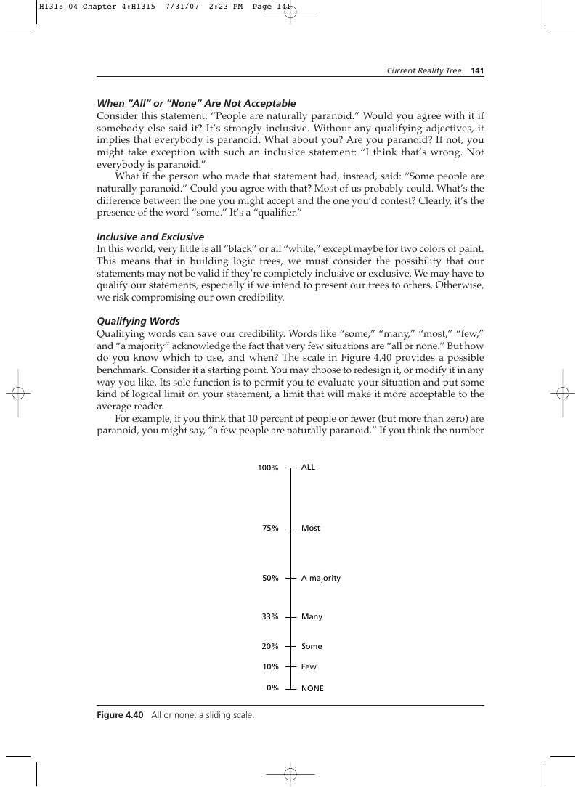

#### When “All” or “None” Are Not Acceptable

Consider this statement: “People are naturally paranoid.” Would you agree with it if somebody else said it? It’s strongly inclusive. Without any qualifying adjectives, it implies that everybody is paranoid. What about you? Are you paranoid? If not, you might take exception with such an inclusive statement: “I think that’s wrong. Not everybody is paranoid.” What if the person who made that statement had, instead, said: “Some people are naturally paranoid.” Could you agree with that? Most of us probably could. What’s the difference between the one you might accept and the one you’d contest? Clearly, it’s the presence of the word “some.” It’s a “qualifier.”

#### Inclusive and Exclusive

In this world, very little is all “black” or all “white,” except maybe for two colors of paint. This means that in building logic trees, we must consider the possibility that our statements may not be valid if they’re completely inclusive or exclusive. We may have to qualify our statements, especially if we intend to present our trees to others. Otherwise, we risk compromising our own credibility.

#### Qualifying Words

Qualifying words can save our credibility. Words like “some,” “many,” “most,” “few,” and “a majority” acknowledge the fact that very few situations are “all or none.” But how do you know which to use, and when? The scale in Figure 4.40 provides a possible benchmark. Consider it a starting point. You may choose to redesign it, or modify it in any way you like. Its sole function is to permit you to evaluate your situation and put some kind of logical limit on your statement, a limit that will make it more acceptable to the average reader. For example, if you think that 10 percent of people or fewer (but more than zero) are paranoid, you might say, “a few people are naturally paranoid.” If you think the number is closer to 25 percent, you might say, “Some people are naturally paranoid.” If you think that 45 percent of the population likes baseball, you might say, “Many people like baseball.” If you think that 60 percent are displeased with a baseball strike, it might translate to “A majority of fans oppose the strike.” Once you get above 75 percent, you might be safe in saying that “Most fans oppose the strike.” (Technically, 51 percent or more could constitute “most.” You’re free to establish your own thresholds for each of these qualifiers, but you should consider using them to add credibility to your logic.) Once you’ve decided how to qualify a statement that will be an entity in your tree, you must decide how the combination of two or more “qualified” statements will play out in the effect. Are “some” and “some” sufficient to produce “many”? Will “many” and “some” produce “a majority”? How about “many” and “many”—will they give you “most”? Figure 4.41 shows some possible combinations and their proposed effects. You’ll undoubtedly be able to think of others. Experiment with “qualifiers” until you’re certain the logic of your cause-and-effect connections is as tight as you can make it.

Figure 4.40 All or none: a sliding scale.

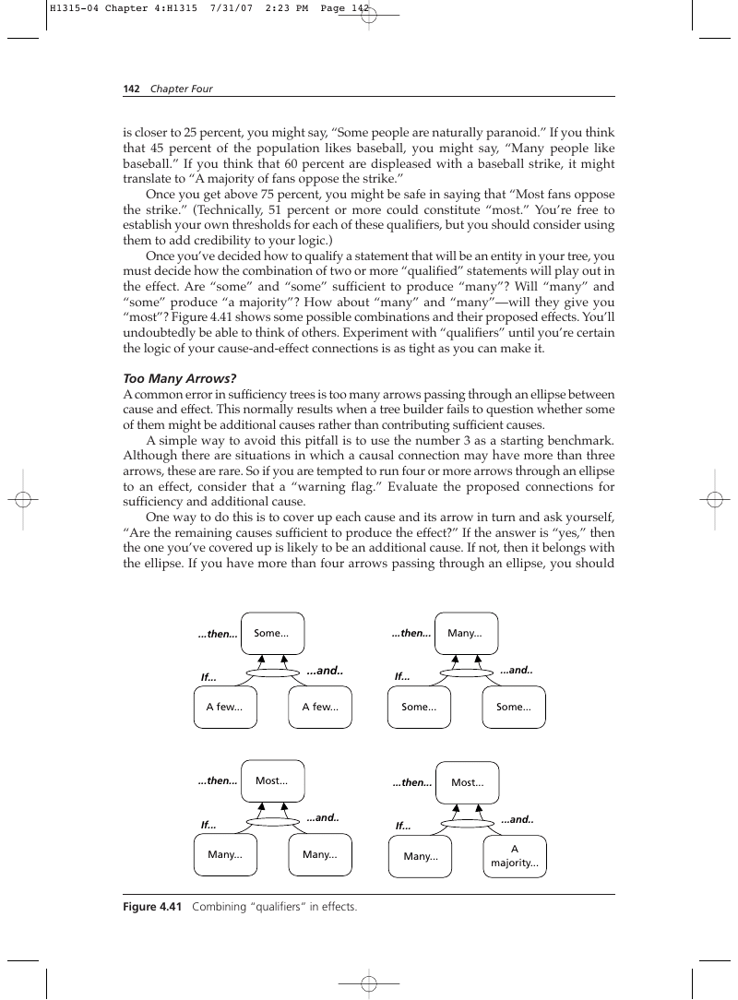

#### Too Many Arrows?

A common error in sufficiency trees is too many arrows passing through an ellipse between cause and effect. This normally results when a tree builder fails to question whether some of them might be additional causes rather than contributing sufficient causes. A simple way to avoid this pitfall is to use the number 3 as a starting benchmark. Although there are situations in which a causal connection may have more than three arrows, these are rare. So if you are tempted to run four or more arrows through an ellipse to an effect, consider that a “warning flag.” Evaluate the proposed connections for sufficiency and additional cause. One way to do this is to cover up each cause and its arrow in turn and ask yourself, “Are the remaining causes sufficient to produce the effect?” If the answer is “yes,” then the one you’ve covered up is likely to be an additional cause. If not, then it belongs with the ellipse. If you have more than four arrows passing through an ellipse, you should assume that you’ve embedded an additional cause in the ellipse somewhere and start evaluating each cause individually to determine whether one or more might stand alone.

Figure 4.41 Combining “qualifiers” in effects.

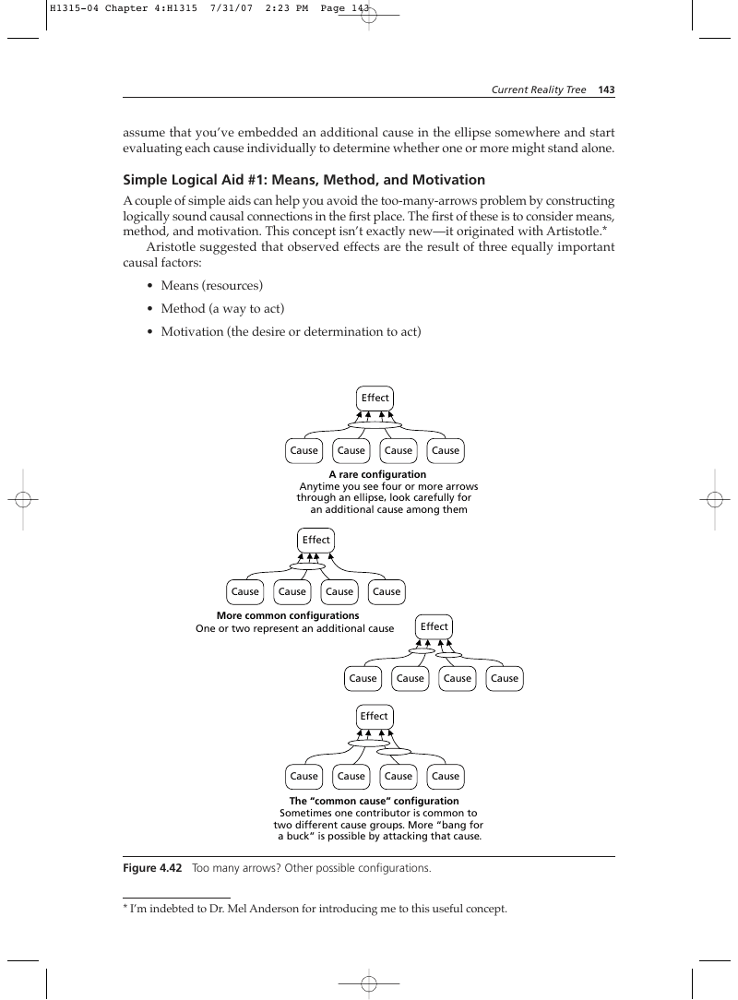

Simple Logical Aid #1: Means, Method, and Motivation A couple of simple aids can help you avoid the too-many-arrows problem by constructing logically sound causal connections in the first place. The first of these is to consider means, method, and motivation. This concept isn’t exactly new—it originated with Artistotle.* Aristotle suggested that observed effects are the result of three equally important causal factors:

- Means (resources)
- Method (a way to act)
- Motivation (the desire or determination to act)

#### Effect Cause Cause Cause Cause

A rare configuration Anytime you see four or more arrows through an ellipse, look carefully for an additional cause among them Effect Cause Cause Cause Cause

#### Cause Effect Cause Cause Cause Effect Cause Cause Cause Cause

The “common cause” configuration Sometimes one contributor is common to two different cause groups. More “bang for a buck” is possible by attacking that cause.

Figure 4.42 Too many arrows? Other possible configurations.

* I’m indebted to Dr. Mel Anderson for introducing me to this useful concept.

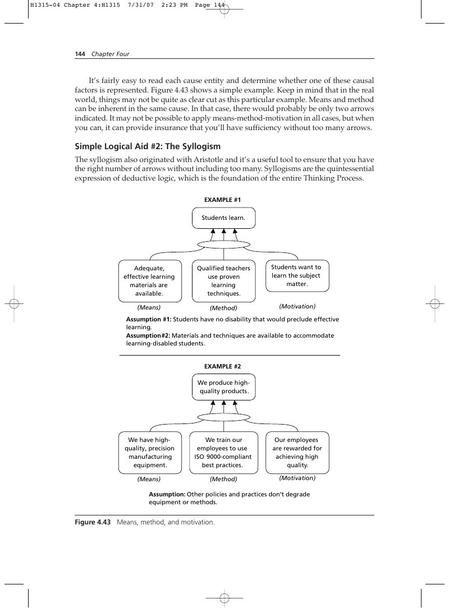

It’s fairly easy to read each cause entity and determine whether one of these causal factors is represented. Figure 4.43 shows a simple example. Keep in mind that in the real world, things may not be quite as clear cut as this particular example. Means and method can be inherent in the same cause. In that case, there would probably be only two arrows indicated. It may not be possible to apply means-method-motivation in all cases, but when you can, it can provide insurance that you’ll have sufficiency without too many arrows.

Simple Logical Aid #2: The Syllogism The syllogism also originated with Aristotle and it’s a useful tool to ensure that you have the right number of arrows without including too many. Syllogisms are the quintessential expression of deductive logic, which is the foundation of the entire Thinking Process. EXAMPLE #1 Students learn.

Adequate, effective learning materials are available.

Qualified teachers use proven learning techniques.

Students want to learn the subject matter.

Assumption #1: Students have no disability that would preclude effective learning. Assumption #2: Materials and techniques are available to accommodate learning- disabled students.

EXAMPLE #2 We produce highquality products.

We have highquality, precision manufacturing equipment.

We train our employees to use ISO 9000-compliant best practices.

Our employees are rewarded for achieving high quality.

Assumption: Other policies and practices don’t degrade equipment or methods.

Figure 4.43 Means, method, and motivation.

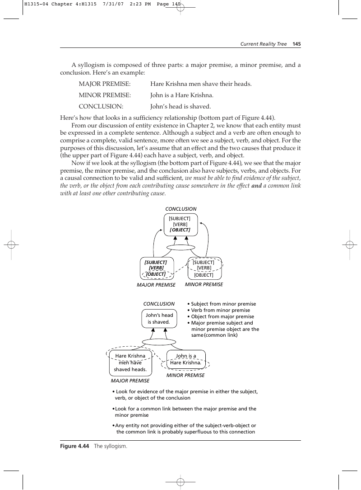

A syllogism is composed of three parts: a major premise, a minor premise, and a conclusion. Here’s an example: MAJOR PREMISE:

Here’s how that looks in a sufficiency relationship (bottom part of Figure 4.44). From our discussion of entity existence in Chapter 2, we know that each entity must be expressed in a complete sentence. Although a subject and a verb are often enough to comprise a complete, valid sentence, more often we see a subject, verb, and object. For the purposes of this discussion, let’s assume that an effect and the two causes that produce it (the upper part of Figure 4.44) each have a subject, verb, and object. Now if we look at the syllogism (the bottom part of Figure 4.44), we see that the major premise, the minor premise, and the conclusion also have subjects, verbs, and objects. For a causal connection to be valid and sufficient, we must be able to find evidence of the subject, the verb, or the object from each contributing cause somewhere in the effect and a common link with at least one other contributing cause. CONCLUSION

- Subject from minor premise
- Verb from minor premise
- Object from major premise
- Major premise subject and minor premise object are the same (common link)

### Minor Premise Major Premise

- Look for evidence of the major premise in either the subject, verb, or object of the conclusion
- Look for a common link between the major premise and the minor premise
- Any entity not providing either of the subject-verb-object or the common link is probably superfluous to this connection

If you find a cause (or are contemplating including one within a sufficiency ellipse) that does not provide part of the subject, verb, or object of the effect and doesn’t link with one of the other causes, then it must be considered a possible additional cause of the effect, separate from the ellipsed contributors and evaluated using the CLR independently.

### Using the Crt with Other Parts of the Thinking Process

The Current Reality Tree is a superb tool by itself. It becomes invaluable when used in concert with other parts of the TOC Thinking Process. The times when you’ll use it in isolation are likely to be few. After all, what good does it do you to identify critical root causes if you’re not going to move ahead and do something about them? While the other logical tools have great utility by themselves as well, the Current Reality Tree is designed to lead into two other parts of the Thinking Process: the Evaporating Cloud and the Future Reality Tree.

#### The Current Reality Tree and the Evaporating Cloud

Why do critical root causes exist? If they’re such a serious drag on a system’s performance, you’d expect that someone would have stepped up and solved them before now. There are two possible reasons why this hasn’t happened: a) The problem has gone unrecognized, or b) there is hidden conflict underlying the situation. If the problem hasn’t been recognized, the very exposure of the root cause may be enough to prompt action to fix it: “We never realized that this was a problem before—now that we understand it, we can do something about it.” Frequently a critical root cause is perpetuated by some hidden conflict. This may not be as obvious as animosity between two people or organizations. It may be merely a conflict of interests. Sometimes those involved are tacitly aware of the conflict, but often they are not. However, the possibility of conflict should always be investigated before moving on to the solution stage. Failure to address hidden conflict will undermine any solution you might develop. The same “infection” will cause the patient (system) to relapse if the underlying conflict is not resolved. This is the function of the Evaporating Cloud, and in the next chapter we’ll see how it helps us develop effective solutions to critical root causes.

The Current Reality Tree and the Future Reality Tree Presuming that there is no underling conflict stalling the resolution of critical root cause or that any such conflicts have been resolved, at some point the time will come to start creating a new configuration of your system, one that will eliminate the UDEs you identified in your CRT. Creating that new configuration—the way you want the system to function in the ideal world—is the role of the Future Reality Tree (FRT). However, the FRT is rarely a completely new creation. How many cases are you aware of in which the entire system, its structure, relationships, and functions, were thrown away in order to make a new start with a clean sheet of paper? It almost never happens.

What happens instead is some modification, sometimes rather significant, to an existing system that doesn’t radically change its functional interactions. Since these unchanged interactions are usually captured to some degree in the CRT, it makes sense that the future configuration of the system is likely to conform to them, though the “polarity” of the outcomes will change from negative (in the CRT) to positive (in the FRT). What this portends for the FRT is that a substantial portion of the CRT—many of the same or similar entities, causal connections, and sufficiencies—are likely to be transferable to the FRT. In other words, there will be significant parts of the wheel that won’t have to be reinvented. It’s been said that a well-defined problem is more than half solved. The CRT represents that good definition of a problem, and failing to take advantage of that benefit by jumping directly to a Future Reality Tree not only risks solving the wrong problem, it risks taking longer than necessary to create the solution. The moral of this lesson is that CRTs and FRTs go hand in hand. The situations in which you would jump directly to a Future Reality Tree without first completing a CRT should be few and far between. In Chapter 6 we’ll learn how to create FRTs. Now take a look at the Current Reality Tree in Figure 4.46. It’s the CRT of a start-up company. While the context of the company’s situation and competitive environment are not provided, it still shows an accurate picture of the company’s current reality (in 2002), and its logic is “tight.” As such, it’s a good example of what a CRT should look like.

### Summary

> We’ve seen how a Current Reality Tree can help us find the hidden, underlying root causes that produce our system’s problems—what to change in our system. Now it’s time to start the second phase of problem solution: what to change to. The first part of that phase is the Evaporating Cloud—the subject of Chapter 5. The greatest obstacle to discovering the shape of the earth, the continents, and the ocean was not ignorance but the illusion of knowledge.
>
> —Daniel J. Boorstin, The Discoverers

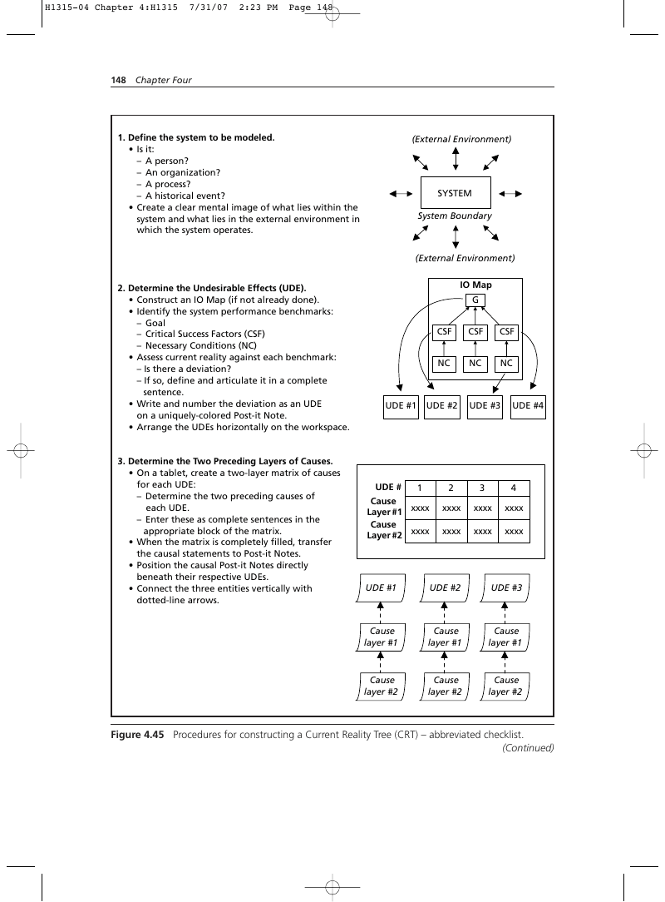

1. Define the system to be modeled.
- Is it:
- A person?
- An organization?
- A process?
- A historical event?
- Create a clear mental image of what lies within the system and what lies in the external environment in which the system operates.
1. Determine the Undesirable Effects (UDE).
- Construct an IO Map (if not already done).
- Identify the system performance benchmarks:
- Goal
- Critical Success Factors (CSF)
- Necessary Conditions (NC)
- Assess current reality against each benchmark:
- Is there a deviation?
- If so, define and articulate it in a complete sentence.
- Write and number the deviation as an UDE on a uniquely-colored Post-it Note.
- Arrange the UDEs horizontally on the workspace.
1. Determine the Two Preceding Layers of Causes.
- On a tablet, create a two-layer matrix of causes for each UDE:
- Determine the two preceding causes of each UDE.
- Enter these as complete sentences in the appropriate block of the matrix.
- When the matrix is completely filled, transfer the causal statements to Post-it Notes.
- Position the causal Post-it Notes directly beneath their respective UDEs.
- Connect the three entities vertically with dotted-line arrows.

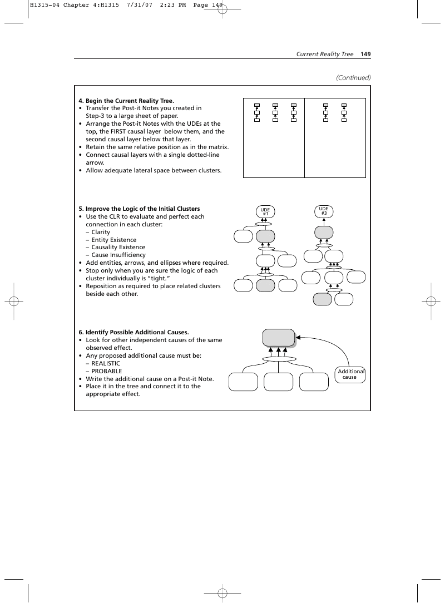

1. Begin the Current Reality Tree.
- Transfer the Post-it Notes you created in Step-3 to a large sheet of paper.
- Arrange the Post-it Notes with the UDEs at the top, the FIRST causal layer below them, and the second causal layer below that layer.
- Retain the same relative position as in the matrix.
- Connect causal layers with a single dotted-line arrow.
- Allow adequate lateral space between clusters.
1. Improve the Logic of the Initial Clusters
- Use the CLR to evaluate and perfect each connection in each cluster:
- Clarity
- Entity Existence
- Causality Existence
- Cause Insufficiency
- Add entities, arrows, and ellipses where required.
- Stop only when you are sure the logic of each cluster individually is “tight.”
- Reposition as required to place related clusters beside each other.
1. Identify Possible Additional Causes.
- Look for other independent causes of the same observed effect.
- Any proposed additional cause must be:
- REALISTIC
- PROBABLE
- Write the additional cause on a Post-it Note.
- Place it in the tree and connect it to the appropriate effect.

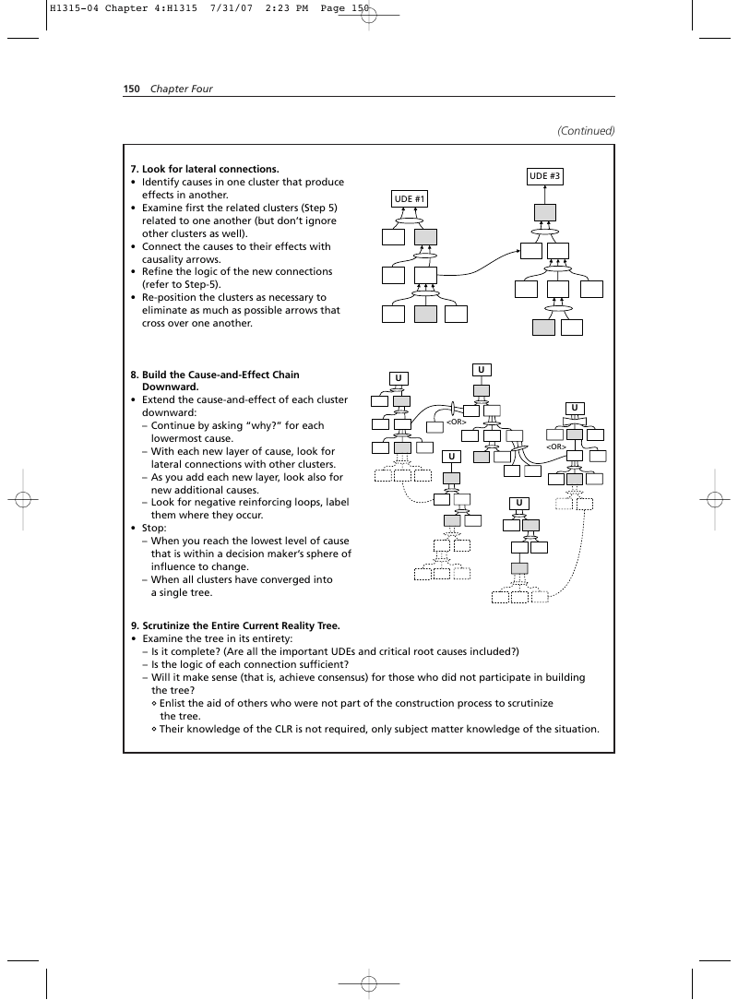

1. Look for lateral connections.
- Identify causes in one cluster that produce effects in another.
- Examine first the related clusters (Step 5) related to one another (but don’t ignore other clusters as well).
- Connect the causes to their effects with causality arrows.
- Refine the logic of the new connections (refer to Step-5).
- Re-position the clusters as necessary to eliminate as much as possible arrows that cross over one another.
1. Build the Cause-and-Effect Chain Downward.
- Extend the cause-and-effect of each cluster downward:
- Continue by asking “why?” for each lowermost cause.
- With each new layer of cause, look for lateral connections with other clusters.
- As you add each new layer, look also for new additional causes.
- Look for negative reinforcing loops, label them where they occur.
- Stop:
- When you reach the lowest level of cause that is within a decision maker’s sphere of influence to change.
- When all clusters have converged into a single tree.
1. Scrutinize the Entire Current Reality Tree.
- Examine the tree in its entirety:
- Is it complete? (Are all the important UDEs and critical root causes included?)
- Is the logic of each connection sufficient?
- Will it make sense (that is, achieve consensus) for those who did not participate in building the tree?
- Enlist the aid of others who were not part of the construction process to scrutinize the tree.
- Their knowledge of the CLR is not required, only subject matter knowledge of the situation.

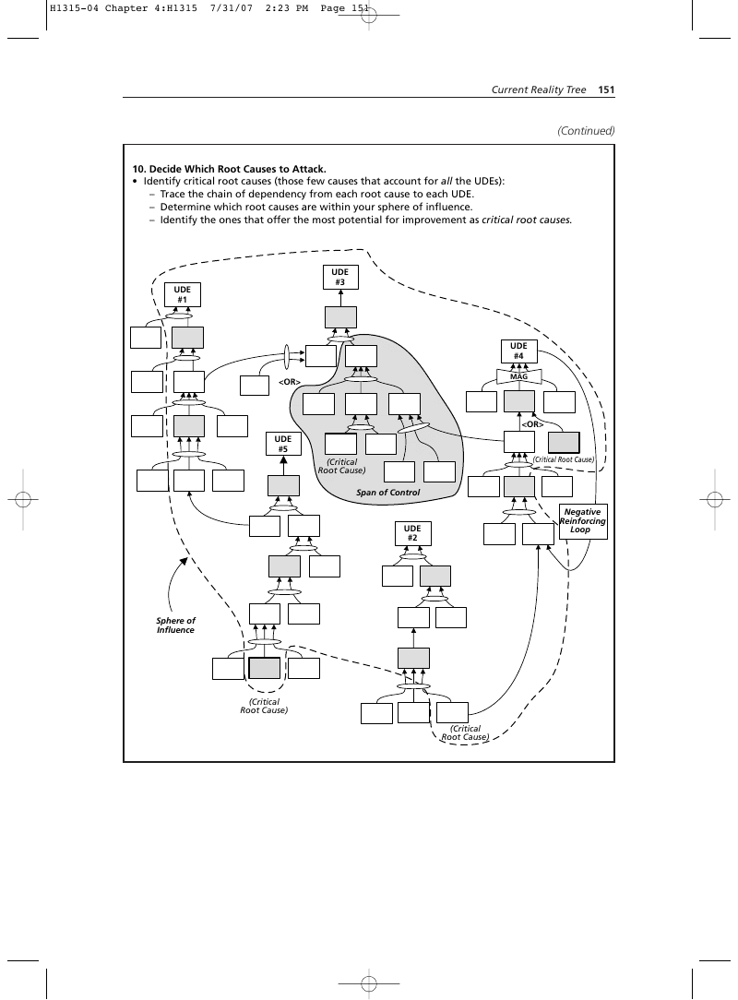

10. Decide Which Root Causes to Attack.
- Identify critical root causes (those few causes that account for all the UDEs):
- Trace the chain of dependency from each root cause to each UDE.
- Determine which root causes are within your sphere of influence.
- Identify the ones that offer the most potential for improvement as critical root causes.

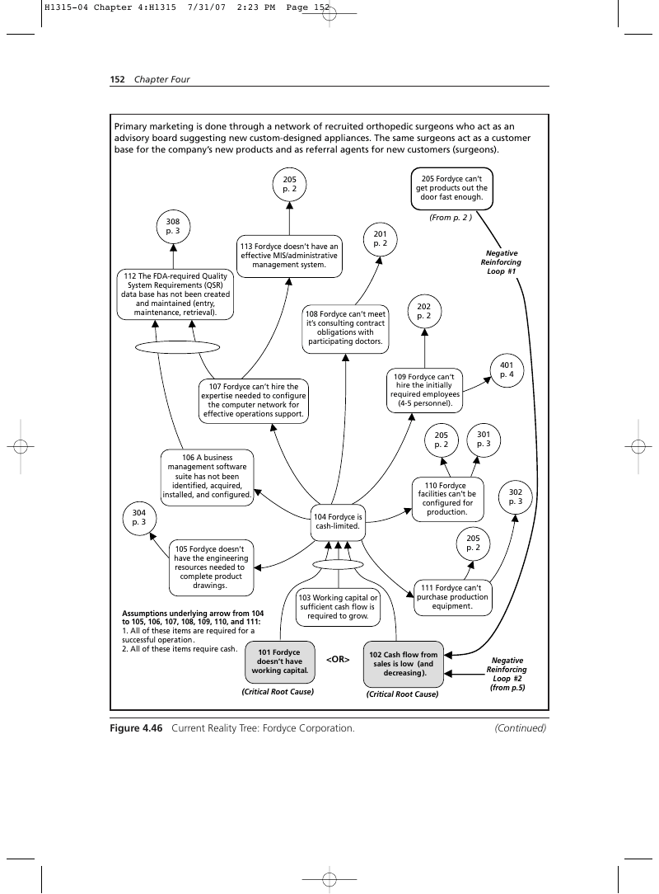

Primary marketing is done through a network of recruited orthopedic surgeons who act as an advisory board suggesting new custom-designed appliances. The same surgeons act as a customer base for the company’s new products and as referral agents for new customers (surgeons). 205 Fordyce can’t get products out the door fast enough.

p. 3 113 Fordyce doesn’t have an effective MIS/administrative management system. 112 The FDA-required Quality System Requirements (QSR) data base has not been created and maintained (entry, maintenance, retrieval).

108 Fordyce can’t meet it’s consulting contract obligations with participating doctors.

109 Fordyce can’t hire the initially required employees (4-5 personnel).

107 Fordyce can’t hire the expertise needed to configure the computer network for effective operations support.

110 Fordyce facilities can’t be configured for production.

105 Fordyce doesn’t have the engineering resources needed to complete product drawings. 103 Working capital or sufficient cash flow is required to grow.

1. All of these items are required for a successful operation.
2. All of these items require cash. 101 Fordyce

Figure 4.46 Current Reality Tree: Fordyce Corporation.

111 Fordyce can’t purchase production equipment.

102 Cash flow from sales is low (and decreasing).

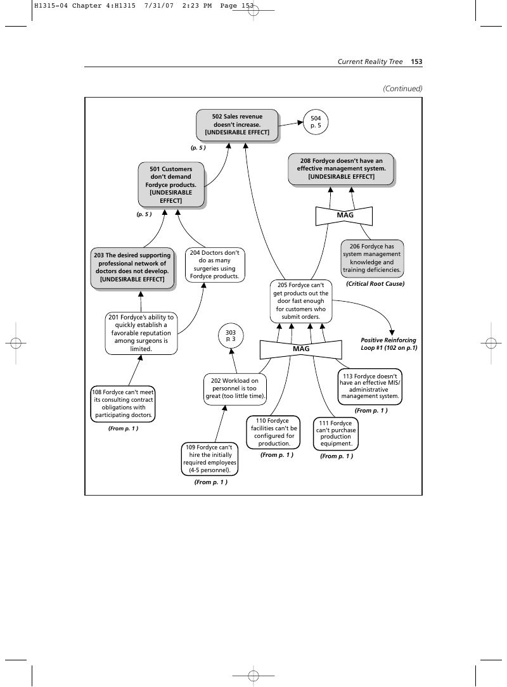

201 Fordyce’s ability to quickly establish a favorable reputation among surgeons is limited.

108 Fordyce can’t meet its consulting contract obligations with participating doctors.

206 Fordyce has system management knowledge and training deficiencies.

204 Doctors don’t do as many surgeries using Fordyce products. 205 Fordyce can’t get products out the door fast enough for customers who submit orders.

202 Workload on personnel is too great (too little time).

110 Fordyce facilities can’t be configured for production.

111 Fordyce can’t purchase production equipment.

310 Incoming materials can’t be processed.

311 The FDA does not review 501K submissions in a timely manner.

309 Fordyce does not have a documented quality assurance system (QSR).

308 Processes have not been qualified (verified). 307 Fordyce can’t buy implants or instruments from suppliers .

305 Fordyce doesn’t have approved drawings.

105 Fordyce doesn’t have the engineering resources needed to complete product drawings .

306 Process procedures have not been written. 302 The production facility is not configured for operation (set up).

303 Equipment has not been installed and tested.

304 Processes have not been defined.

111 Fordyce can’t purchase production equipment.

definition and approved procedures are required by FDA-QSR.

110 Fordyce facilities can’t be configured for production.

301 Process definition is time consuming.

408 Fordyce can’t introduce competitive spinal products.

406 Fordyce doesn’t have a proven product development management methodology.

310 Incoming materials can’t be processed.

401 There is no one to develop an effective marketing/sales effort.

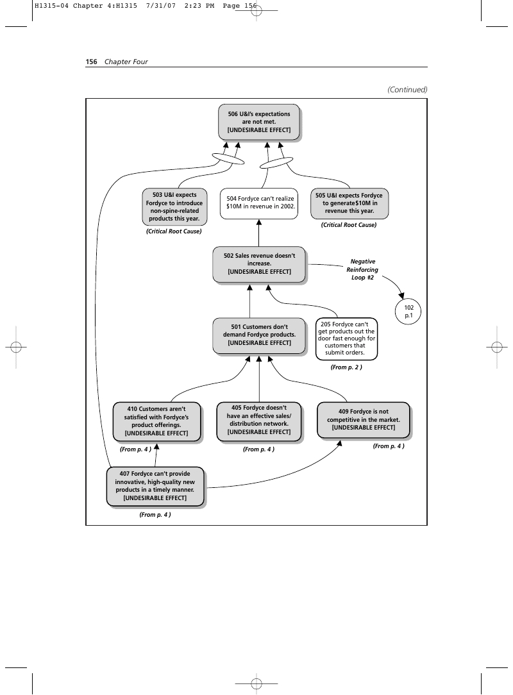

503 U&I expects Fordyce to introduce non-spine-related products this year.

504 Fordyce can’t realize $10M in revenue in 2002.

### Critical Root Cause

Cash flow from sales is low (and decreasing).

### Critical Root Cause

“OR” condition with 101. Evaluate which to work on in Future Reality Tree.

Fordyce has system management knowledge and training deficiencies.

### Critical Root Cause

The FDA does not review 501K submissions in a timely manner.

### Critical Root Cause

Federal government issue; probably outside sphere of influence.

Fordyce doesn’t have a proven product development management methodology.

### Critical Root Cause

U&I expects Fordyce to introduce non-spine-related products this year.

### Critical Root Cause

“AND” condition, but requires short-term relief; Future Reality Reality Tree can’t possibly resolve systemic issues within U&I-mandated time horizon.

U&I expects Fordyce to generate $10M in revenue this year.

### Critical Root Cause

“AND” condition, but requires short-term relief; Future Reality Tree can’t possibly resolve systemic issues within U&I-mandated time horizon.

### Endnotes

1. http://en.wikipedia.org/wiki/Big_Dig
2. http://www.sover.net/~devstar/define.htm
3. University of Southern California. Trojan Family Magazine, Spring 2001, p.36

