# Chapter 5: Evaporating Cloud

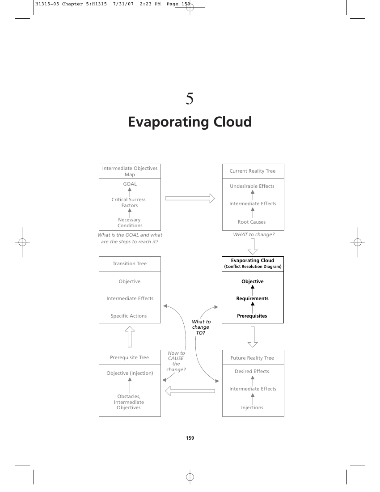

Intermediate Objectives

Map Current Reality Tree GOAL Undesirable Effects Critical Success Factors Intermediate Effects Necessary Conditions Root Causes

What is the GOAL and what are the steps to reach it?

WHAT to change?

(Conflict Resolution Diagram) Objective Objective Intermediate Effects Requirements Specific Actions Prerequisites What to

change TO? Prerequisite Tree

Objective (Injection) How to CAUSE

the change? Future Reality Tree Desired Effects Intermediate Effects

Obstacles, Intermediate Objectives Injections

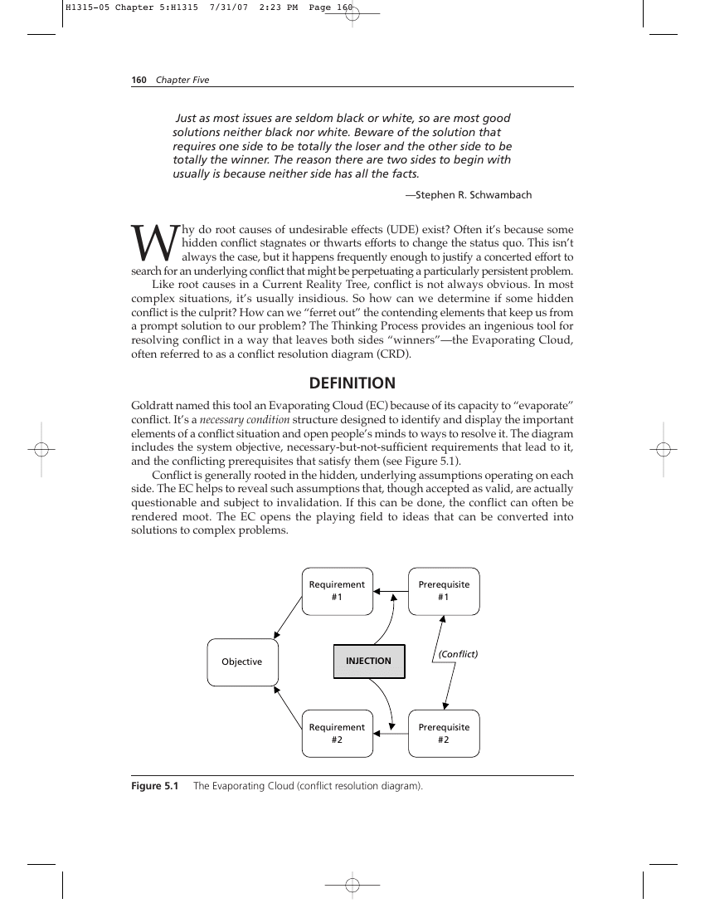

> Just as most issues are seldom black or white, so are most good solutions neither black nor white. Beware of the solution that requires one side to be totally the loser and the other side to be totally the winner. The reason there are two sides to begin with usually is because neither side has all the facts.
>
> —Stephen R. Schwambach

Why do root causes of undesirable effects (UDE) exist? Often it’s because some hidden conflict stagnates or thwarts efforts to change the status quo. This isn’t always the case, but it happens frequently enough to justify a concerted effort to search for an underlying conflict that might be perpetuating a particularly persistent problem. Like root causes in a Current Reality Tree, conflict is not always obvious. In most complex situations, it’s usually insidious. So how can we determine if some hidden conflict is the culprit? How can we “ferret out” the contending elements that keep us from a prompt solution to our problem? The Thinking Process provides an ingenious tool for resolving conflict in a way that leaves both sides “winners”—the Evaporating Cloud, often referred to as a conflict resolution diagram (CRD).

### Definition

Goldratt named this tool an Evaporating Cloud (EC) because of its capacity to “evaporate” conflict. It’s a necessary condition structure designed to identify and display the important elements of a conflict situation and open people’s minds to ways to resolve it. The diagram includes the system objective, necessary-but-not-sufficient requirements that lead to it, and the conflicting prerequisites that satisfy them (see Figure 5.1). Conflict is generally rooted in the hidden, underlying assumptions operating on each side. The EC helps to reveal such assumptions that, though accepted as valid, are actually questionable and subject to invalidation. If this can be done, the conflict can often be rendered moot. The EC opens the playing field to ideas that can be converted into solutions to complex problems. Requirement

#1 Objective

(Conflict)

INJECTION Requirement

#2

Figure 5.1 Prerequisite

#1 Prerequisite

#2

The Evaporating Cloud (conflict resolution diagram).

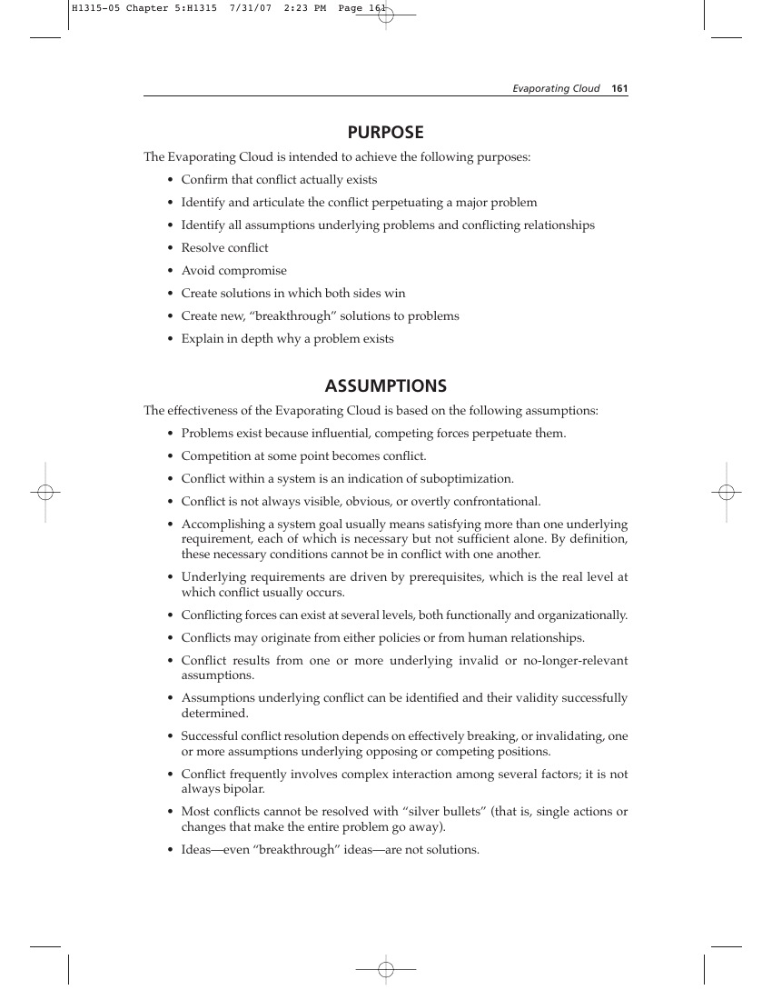

PURPOSE

The Evaporating Cloud is intended to achieve the following purposes:

- Confirm that conflict actually exists
- Identify and articulate the conflict perpetuating a major problem
- Identify all assumptions underlying problems and conflicting relationships
- Resolve conflict
- Avoid compromise
- Create solutions in which both sides win
- Create new, “breakthrough” solutions to problems
- Explain in depth why a problem exists

ASSUMPTIONS

The effectiveness of the Evaporating Cloud is based on the following assumptions:

- Problems exist because influential, competing forces perpetuate them.
- Competition at some point becomes conflict.
- Conflict within a system is an indication of suboptimization.
- Conflict is not always visible, obvious, or overtly confrontational.
- Accomplishing a system goal usually means satisfying more than one underlying requirement, each of which is necessary but not sufficient alone. By definition, these necessary conditions cannot be in conflict with one another.
- Underlying requirements are driven by prerequisites, which is the real level at which conflict usually occurs.
- Conflicting forces can exist at several levels, both functionally and organizationally.
- Conflicts may originate from either policies or from human relationships.
- Conflict results from one or more underlying invalid or no-longer-relevant assumptions.
- Assumptions underlying conflict can be identified and their validity successfully determined.
- Successful conflict resolution depends on effectively breaking, or invalidating, one or more assumptions underlying opposing or competing positions.
- Conflict frequently involves complex interaction among several factors; it is not always bipolar.
- Most conflicts cannot be resolved with “silver bullets” (that is, single actions or changes that make the entire problem go away).
- Ideas—even “breakthrough” ideas—are not solutions.

### How to Use This Chapter

- Read “Description of the Evaporating Cloud.”
- Read “Constructing an Evaporating Cloud.”
- Read “Scrutinizing an Evaporating Cloud.”
- Review Figure 5.34, “Evaporating Cloud – Wurtzburg Corporation.” This is a completed EC on developing new capabilities to satisfy markets. It illustrates in a typical real-world example how hidden conflict can be resolved with an Evaporating Cloud.
- Review Figure 5.32, “Procedures for Constructing an Evaporating Cloud.” This is an abbreviated checklist that you can use to guide you in constructing your own ECs. The checklist contains brief instructions and illustrations for each step. Detailed explanations for each step in the checklist are provided in the chapter itself, under “Constructing an Evaporating Cloud.”
- Practice the “Evaporating Cloud Exercise” provided in Appendix D.
- For your convenience, blank EC worksheets are provided in Figure 5.33. You may reproduce or reconstruct this format for use in building your own ECs.

> We are all faced with great opportunities…brilliantly disguised as impossible situations.
>
> —Unknown

### Description of the Evaporating Cloud

> As the name implies, the Evaporating Cloud is designed to expose and resolve conflict. “Resolve” does not mean compromise. A compromise has been described as a solution with which everybody is equally unhappy because nobody really gets what they want. True conflict resolution, however, requires a “win-win” solution—that is, both sides feel as though they’ve come out winners. The compromise will always be more expensive than either of the suggestions it is compromising.
>
> —Juhani’s Law

Another function of the Evaporating Cloud is to facilitate the generation of new ideas—potential “breakthrough” solutions to difficult problems. Obviously, there is some overlap here with conflict resolution. “Win-win” solutions often require us to come up with new ways of doing things, new solutions to old problems that might also be described as “breakthroughs.” But even if a conflict is not obvious in solving a problem, the Evaporating Cloud can serve as a “creative engine,” stimulating ideas. In other words, there’s more than one way to skin a cat and you don’t necessarily have to throw away the skin afterward—or the cat.

#### The Nature of Conflict

Conflict is often painfully obvious. Some of its indicators may include loud voices, angry words, hard feelings, or clearly opposing positions. A classic example of conflict is rancorous labor negotiations leading to a strike. But conflict is even more often likely to be subtle—more like different opinions on the same subject, the difference between what you need to do and what you’re allowed to do, or two different parties competing for exclusive use of the same resources (for example, time, money, labor, and equipment).

#### Conflict Is Not Always Obvious

> When the conflict is obvious, techniques especially designed for the purpose are trotted out to help resolve it: collective bargaining, negotiation, and binding arbitration. But when it’s not obvious, the conflict frequently goes unrecognized. Nobody is aware that an underlying conflict, with a life of its own, is even affecting the situation. As a result, the problem may be difficult or even impossible to effectively resolve. The obvious is that which is never seen until someone expresses it simply.
>
> —Kahlil Gibran

#### Two Types of Conflict

Because “conflict” has such a pejorative connotation, most people tend to think only of the overt indications of conflict mentioned earlier. But for the purpose of identifying and solving problems, it’s sometimes better to think in terms of “competing forces.” These competing forces are usually of two types: opposite conditions or different alternatives.

#### Opposite Conditions

In this situation, one force pushes us to “do this.” The other force pushes us to “not do this” (or to do something that is the diametric opposite). For example, one side of the conflict might tell us to “save money,” while the other side might say “spend money.” This particular conflict is inherent in the problem of reducing the federal budget, where one school of thought says “Spend money to stimulate the economy,” while the other says “Reduce federal spending to cut the deficit.”

#### Different Alternatives

This kind of conflict forces us to choose between two alternatives that are not opposite conditions but are, for some reason, mutually exclusive. This kind of conflict is inherent in any resource shortage. In other words, “We only have so much money; we can do either ‘A’ or ‘B,’ but we can’t do both.” This is a classic conflict condition: the choice between equally desirable alternatives that we can’t do at the same time. Any “either-or” situation implies a hidden conflict of this type.

#### Compromise, “Win-Lose” or “Win-Win”?

When it comes to resolving conflict, there are three basic paths: compromise, win-lose, and win-win. Though two of these may be necessary at times, only one is truly desirable. In a compromise, neither side gets everything it expected. In win-lose, one side gets what it expected—maybe more—while the other side doesn’t get what it expected—and maybe gets nothing. In a win-win, however, both sides get more than they expected.

#### Compromise

The first idea that almost everybody thinks of when a conflict or contention arises is, “Let’s split the difference—you take half, and I’ll take half.” If both sides are willing to live with a compromise, it’s probably the easiest and fastest way to resolve differences. But what if the conflict doesn’t have an acceptable compromise? That leaves two other alternatives. “Win-Lose” This type of resolution assumes that the situation is a zero-sum game: One side must win and the other side must lose. If I win, you can’t win, and vice-versa. This is okay—maybe even desirable—for athletic contests. But in big business, careers, interpersonal relationships—the “games of life”—it’s neither necessary nor desirable. All it does is create hard feelings and lasting resentment. “Win-Win” This is an ideal situation. When both sides win, nobody feels exploited. Both sides probably get more than they’d hoped for. And most important of all, good will is generated on both sides, which bodes well for the future of the relationship.

#### An Indication of Hidden Conflict

If the conflict isn’t obvious, how do we know we really have one? A principal indication of an underlying, hidden conflict is a sense of stagnation: “We have a problem, and, despite our best efforts, we haven’t been able to make any headway on it.” This situation forces us to ask the question, “What’s keeping us from solving this problem?” One way to confirm that a conflict may be causing undesirable effects is to look closely at how management spends its time. Typically, a hidden conflict can eat up as much as 50 percent of senior management’s time and energy. If you see this happening, you can be reasonably sure a hidden conflict is perpetuating the problem. How can we be sure a conflict is involved? In fact, it may not always be. Maybe the only reason we can’t resolve our problem is that we just don’t have enough intuitive knowledge about the situation to work it out—and if we did, we would. But if it’s a serious, nagging problem that knowledgeable people have tried unsuccessfully to solve, chances are that a conflict is perpetuating the problem’s existence. If inadequate knowledge was really the roadblock, good minds and better intentions should have overcome this obstacle and solved the problem already. The only way to know for sure whether the problem is perpetuated by a conflict or inadequate knowledge is to try to build an Evaporating Cloud. If a conflict is really present, it will show up in the EC.

#### “Breakthrough” Solutions

> Evaporating Clouds help explain why problems exist and what perpetuates them. They serve as a kind of template or environment in which to develop “breakthrough” solutions. The key word here is “breakthrough,” because it implies the challenging of traditional assumptions—those associated with the phrase “but that’s the way we’ve always done it.” Creative thinking may simply mean that there’s no particular virtue in doing things the way they have always been done.
>
> —Rudolph Flesch

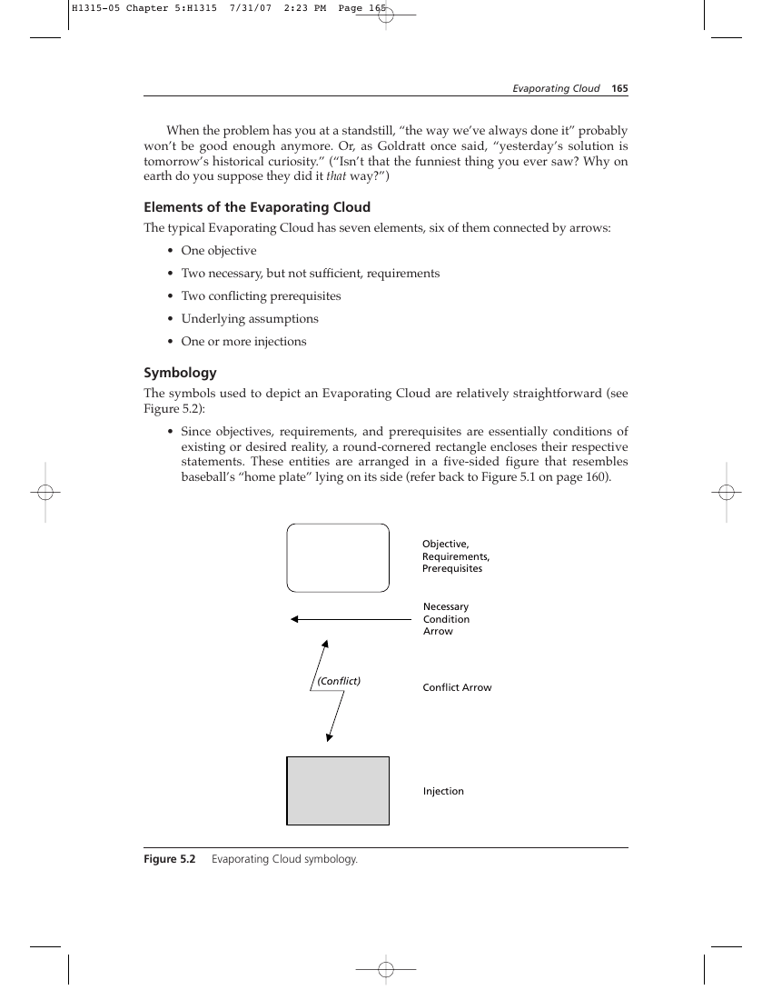

When the problem has you at a standstill, “the way we’ve always done it” probably won’t be good enough anymore. Or, as Goldratt once said, “yesterday’s solution is tomorrow’s historical curiosity.” (“Isn’t that the funniest thing you ever saw? Why on earth do you suppose they did it that way?”) Elements of the Evaporating Cloud

The typical Evaporating Cloud has seven elements, six of them connected by arrows:

- One objective
- Two necessary, but not sufficient, requirements
- Two conflicting prerequisites
- Underlying assumptions
- One or more injections

Symbology

The symbols used to depict an Evaporating Cloud are relatively straightforward (see Figure 5.2):

- Since objectives, requirements, and prerequisites are essentially conditions of existing or desired reality, a round-cornered rectangle encloses their respective statements. These entities are arranged in a five-sided figure that resembles baseball’s “home plate” lying on its side (refer back to Figure 5.1 on page 160).

Objective, Requirements, Prerequisites Necessary Condition Arrow

(Conflict) Conflict Arrow

Injection

Figure 5.2

Evaporating Cloud symbology.

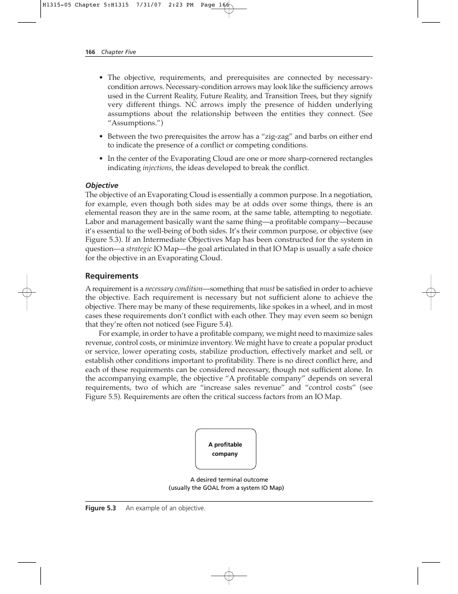

- The objective, requirements, and prerequisites are connected by necessarycondition arrows. Necessary-condition arrows may look like the sufficiency arrows used in the Current Reality, Future Reality, and Transition Trees, but they signify very different things. NC arrows imply the presence of hidden underlying assumptions about the relationship between the entities they connect. (See “Assumptions.”)
- Between the two prerequisites the arrow has a “zig-zag” and barbs on either end to indicate the presence of a conflict or competing conditions.
- In the center of the Evaporating Cloud are one or more sharp-cornered rectangles indicating injections, the ideas developed to break the conflict.

#### Objective

The objective of an Evaporating Cloud is essentially a common purpose. In a negotiation, for example, even though both sides may be at odds over some things, there is an elemental reason they are in the same room, at the same table, attempting to negotiate. Labor and management basically want the same thing—a profitable company—because it’s essential to the well-being of both sides. It’s their common purpose, or objective (see Figure 5.3). If an Intermediate Objectives Map has been constructed for the system in question—a strategic IO Map—the goal articulated in that IO Map is usually a safe choice for the objective in an Evaporating Cloud.

#### Requirements

A requirement is a necessary condition—something that must be satisfied in order to achieve the objective. Each requirement is necessary but not sufficient alone to achieve the objective. There may be many of these requirements, like spokes in a wheel, and in most cases these requirements don’t conflict with each other. They may even seem so benign that they’re often not noticed (see Figure 5.4). For example, in order to have a profitable company, we might need to maximize sales revenue, control costs, or minimize inventory. We might have to create a popular product or service, lower operating costs, stabilize production, effectively market and sell, or establish other conditions important to profitability. There is no direct conflict here, and each of these requirements can be considered necessary, though not sufficient alone. In the accompanying example, the objective “A profitable company” depends on several requirements, two of which are “increase sales revenue” and “control costs” (see Figure 5.5). Requirements are often the critical success factors from an IO Map.

A profitable company

A desired terminal outcome (usually the GOAL from a system IO Map)

Figure 5.3

An example of an objective.

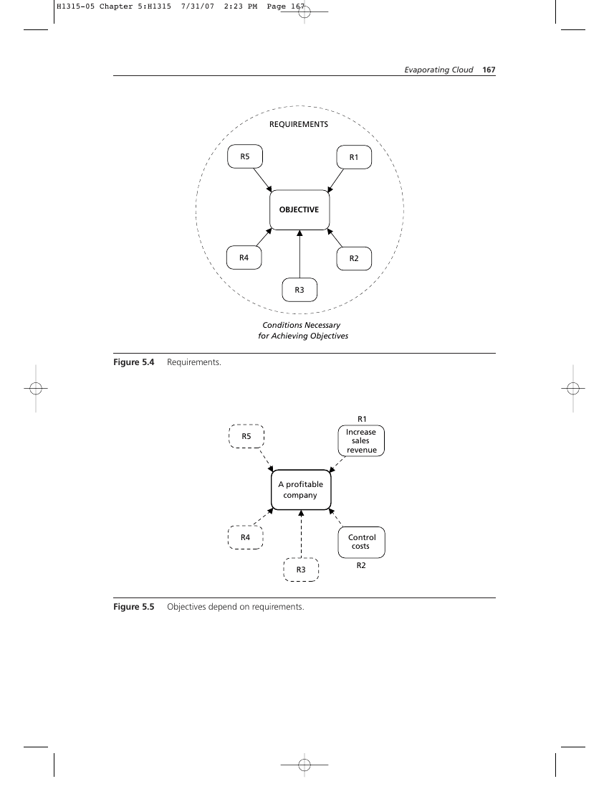

REQUIREMENTS

R5

R1 OBJECTIVE

R4

R2

R3 Conditions Necessary

for Achieving Objectives

Figure 5.4

Requirements.

R1 Increase

sales revenue

R5

A profitable company Control

costs

R4

R3

Figure 5.5

Objectives depend on requirements.

R2

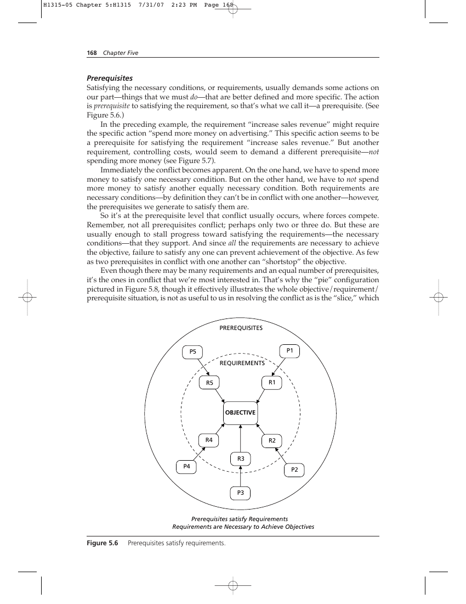

#### Prerequisites

Satisfying the necessary conditions, or requirements, usually demands some actions on our part—things that we must do—that are better defined and more specific. The action is prerequisite to satisfying the requirement, so that’s what we call it—a prerequisite. (See Figure 5.6.) In the preceding example, the requirement “increase sales revenue” might require the specific action “spend more money on advertising.” This specific action seems to be a prerequisite for satisfying the requirement “increase sales revenue.” But another requirement, controlling costs, would seem to demand a different prerequisite—not spending more money (see Figure 5.7). Immediately the conflict becomes apparent. On the one hand, we have to spend more money to satisfy one necessary condition. But on the other hand, we have to not spend more money to satisfy another equally necessary condition. Both requirements are necessary conditions—by definition they can’t be in conflict with one another—however, the prerequisites we generate to satisfy them are. So it’s at the prerequisite level that conflict usually occurs, where forces compete. Remember, not all prerequisites conflict; perhaps only two or three do. But these are usually enough to stall progress toward satisfying the requirements—the necessary conditions—that they support. And since all the requirements are necessary to achieve the objective, failure to satisfy any one can prevent achievement of the objective. As few as two prerequisites in conflict with one another can “shortstop” the objective. Even though there may be many requirements and an equal number of prerequisites, it’s the ones in conflict that we’re most interested in. That’s why the “pie” configuration pictured in Figure 5.8, though it effectively illustrates the whole objective/requirement/ prerequisite situation, is not as useful to us in resolving the conflict as is the “slice,” which PREREQUISITES we configure to resemble “home plate” lying on its side (see Figure 5.8). So when you see the Evaporating Cloud, keep in mind that it’s really a piece of a larger structure, most of which we’re not immediately concerned about because it doesn’t pose a problem. We should note at this point that conflict is not always bipolar. There may be three or more prerequisites in conflict with one another (a complicated, vexing situation in the rare instances when it occurs). It may also be that a solution—an injection—to one conflict creates a new conflict that didn’t previously exist with some other prerequisite.* When this happens, the preferred strategy is to deal with one conflict at a time, using the EC. Figure 5.9 shows an example of a particularly difficult tripartite conflict.4

P1

P5 REQUIREMENTS

R1

R5 OBJECTIVE

R4

R2 R3

P4

P2

P3

Prerequisites satisfy Requirements Requirements are Necessary to Achieve Objectives

Figure 5.6

Prerequisites satisfy requirements.

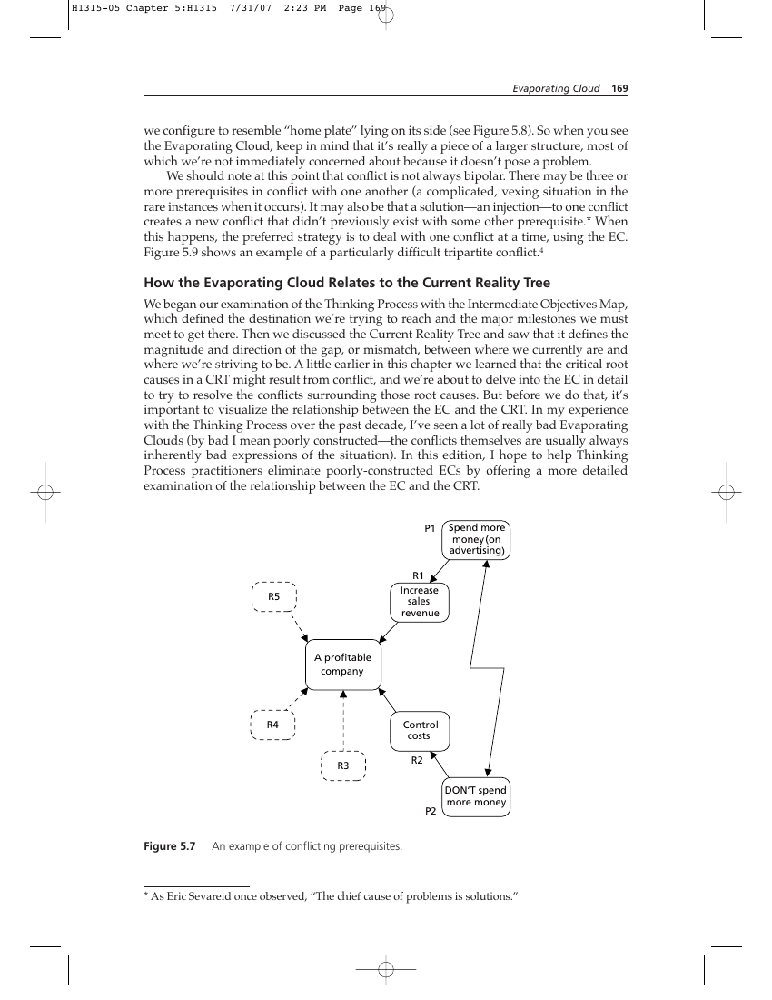

How the Evaporating Cloud Relates to the Current Reality Tree We began our examination of the Thinking Process with the Intermediate Objectives Map, which defined the destination we’re trying to reach and the major milestones we must meet to get there. Then we discussed the Current Reality Tree and saw that it defines the magnitude and direction of the gap, or mismatch, between where we currently are and where we’re striving to be. A little earlier in this chapter we learned that the critical root causes in a CRT might result from conflict, and we’re about to delve into the EC in detail to try to resolve the conflicts surrounding those root causes. But before we do that, it’s important to visualize the relationship between the EC and the CRT. In my experience with the Thinking Process over the past decade, I’ve seen a lot of really bad Evaporating Clouds (by bad I mean poorly constructed—the conflicts themselves are usually always inherently bad expressions of the situation). In this edition, I hope to help Thinking Process practitioners eliminate poorly-constructed ECs by offering a more detailed examination of the relationship between the EC and the CRT. P1

Spend more money (on advertising)

R1 Increase

sales revenue

R5

A profitable company Control

costs

R4

R3

R2

P2

Figure 5.7

DON’T spend more money

An example of conflicting prerequisites.

* As Eric Sevareid once observed, “The chief cause of problems is solutions.”

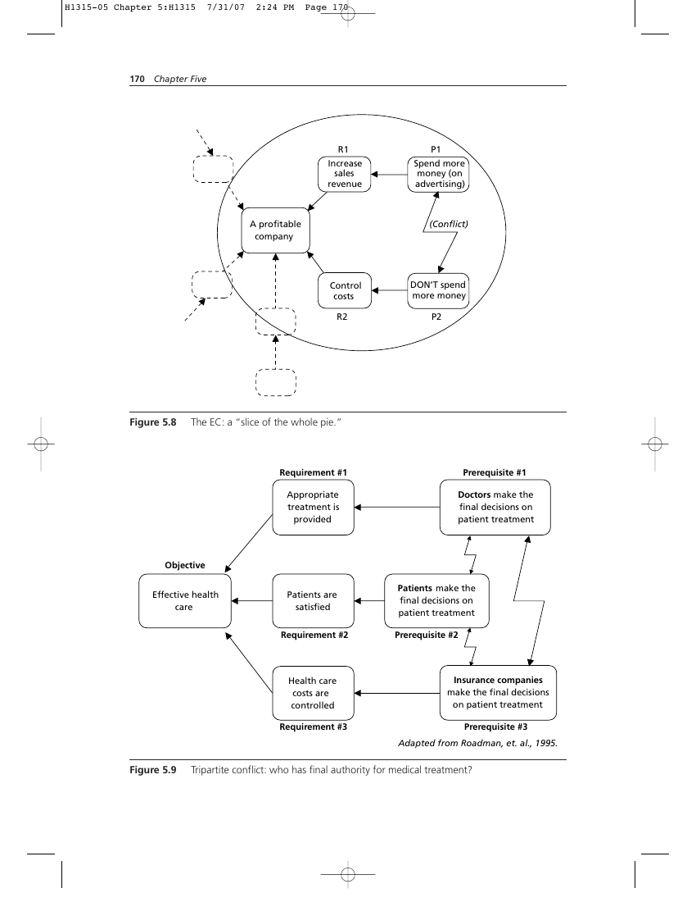

R1 Increase

sales revenue

A profitable company

Figure 5.8

P1 Spend more money (on advertising)

(Conflict) Control

costs

DON’T spend more money

R2

P2

The EC: a “slice of the whole pie.”

Requirement #1

Prerequisite #1 Appropriate

treatment is provided

Doctors make the final decisions on patient treatment Objective

Effective health care

Patients are satisfied

Patients make the final decisions on patient treatment

Requirement #2

Prerequisite #2

Health care costs are controlled Requirement #3

Insurance companies make the final decisions on patient treatment Prerequisite #3 Adapted from Roadman, et. al., 1995.

Figure 5.9

Tripartite conflict: who has final authority for medical treatment?

#### Why Do Root Causes of Undesirable Effects Exist?

If the UDE is the result of a phenomenon of nature—drought or flooding, for example— the cause is physical and natural. Neither floods nor droughts are undesirable in and of themselves—rather their impact on our lives is where the undesirability lies. For most of us, however, the systems we’re primarily concerned with have a significant human component. They may, in fact, be almost exclusively human-oriented or human-based systems. The very presence of humans in a system implies some degree of free will. Free will means that, at some level, components of the system have some latitude to decide what to do or how to do it—maybe both. The more substantial the role of humans in a system, the more opportunities exist (and the greater the likelihood) for free will to be exercised and decisions to be made. Thus, we can safely say that in most of the situations we might be concerned about, the root causes of our undesirable effects stem from the decisions we choose to make.* Even in the case of flooding—say, the disastrous Mississippi River floods of 1993—the victims bore as much responsibility as Mother Nature for the damage they suffered, because they chose to build or buy property in the flood plain of a huge river with a known history of flooding at irregular intervals.

#### Policies and Constraints

To the extent that a particular decision leads to a repetitive practice—in other words, future behavior is modified as a result of the decision—a policy is created. Thus, a policy results from a decision intended to standardize behavior from the decision point onward into the future. We tend to think of policies as formal—written prescriptions or prohibitions captured on paper. And most policies are. Laws, government regulations, corporate rules, and “best practices” are all formal attempts to standardize current and future behavior through policies. But “policies” can have a broader interpretation than just written rules alone. Often they’re no more than verbal. Cultural custom at some point takes on the aura of policy. Have you ever heard someone say, “That’s the way we do things around here”? Or even more ominously, “That’s not the way we do things around here”? If you have, you’re hearing the verbal expression of a policy that may not actually be written anywhere. It may be no more than social custom. The policies we follow in our companies, society, and personal lives normally serve a good and useful purpose: they bring structure and order to our lives. But sometimes the “law of unintended consequences” rears its ugly head. In some cases a policy created to produce one outcome is actually detrimental in some other respect. In organizations, a policy that does this can actually degrade or limit overall system performance. When this happens, the policy itself becomes a constraint to improved performance—a system constraint.

#### Policy Constraints: A Source of Conflict

In complex organizational systems, because of the law of unintended consequences, policy constraints are often a source of conflict. In other words, policies intended to satisfy some valid requirement in one part of the system, or the system as a whole, can cause headaches—perhaps culminating in undesirable effects—in other parts of the system. * There’s no way around it—no matter what our undesirable effects might be, we’re responsible for them. Or, in the immortal words of Pogo, from the comic strip of the same name by Walt Kelly, “We have met the enemy and he is us!”

For example, consider a policy that says, “Raw materials will always be purchased in economic-order-quantity lots.” Many companies operate with this policy. It’s intended to make purchasing as efficient as possible, meaning the maximum quantity is acquired for the least cost-per-unit. And this policy certainly makes the purchasing departments “numbers” look good. But it also leads to buying a large amount of material that may not be needed immediately, creating the need for warehouse space to store it. Moreover, in normal up-and-down business cycles, it might sit on the shelf for a long time—and may eventually be disposed of as scrap or manufactured into products that for whatever reason can’t be sold. The inventory manager’s “numbers” then tend to look bad. What’s desirable for the purchasing department becomes undesirable for the warehouse manager. This idea of the law of unintended consequences has some relevance to what we’ve seen so far. Whether or not people have deliberately identified an unequivocal system goal and critical success factors (through an Intermediate Objectives Map), these elements actually do exist. And the policies in place were likely put there to satisfy them. From Chapter 4 we know that the Current Reality Tree is intended to depict the causality of only the unfavorable system outcomes—the deviation from critical success factors. But in most cases, major parts of the system are “doing just fine, thank you,” and for that reason they’re not included in the Current Reality Tree. In fact, it could be said that the CRT is only a negative branch of current reality, not all of it (see Figure 5.10). Yet the parts of the system that are hurting are inextricably connected to parts that aren’t. Knowing this, it should be easy to understand why a concerted effort to “fix” a critical root cause—a policy that results in an UDE in the CRT—is likely to create problems for people in parts of the system that are working just fine. To those people, we may be upsetting their applecart as we try to fix the root cause of our problems. And what is their natural tendency when this happens? They push back, of course: “You can’t change that because…” And such push-back or opposition is a subdued form of conflict* (see Figure 5.11).

#### Conflict is Usually Embedded in the CRT

As you can see in Figure 5.11, most conflict concerning complex systems involves things that are part of the CRT and other things that are not. Resolving this kind of conflict demands an approach that transcends the system—the parts that are depicted in the CRT and those that are not alike. The Thinking Process provides such a capability in the Evaporating Cloud.

#### Assumptions

As with any of the Logical Thinking Process trees, the presence of an arrow indicates the existence of hidden underlying assumptions about the relationship between entities of the Evaporating Cloud. These assumptions are the key to unlocking the conflict. An assumption is a statement about reality that is accepted as true or valid without question or demand for proof. It’s likely that there are several assumptions underlying each arrow in an EC. Some of these assumptions are invariably valid.

#### Invalid Assumptions

But what makes assumptions so important to the conflict resolution process are not the valid assumptions, but the invalid ones. They may never have been valid. Or, if they were, changes in the environment may have rendered them invalid. Resolving conflict or solving problems with an Evaporating Cloud calls upon us to expose all the underlying

* Whereas such differences of opinion were once settled by physical conflict, these days the vehicle of choice is either verbal argument or passive resistance (which by any other name is essentially conflict).

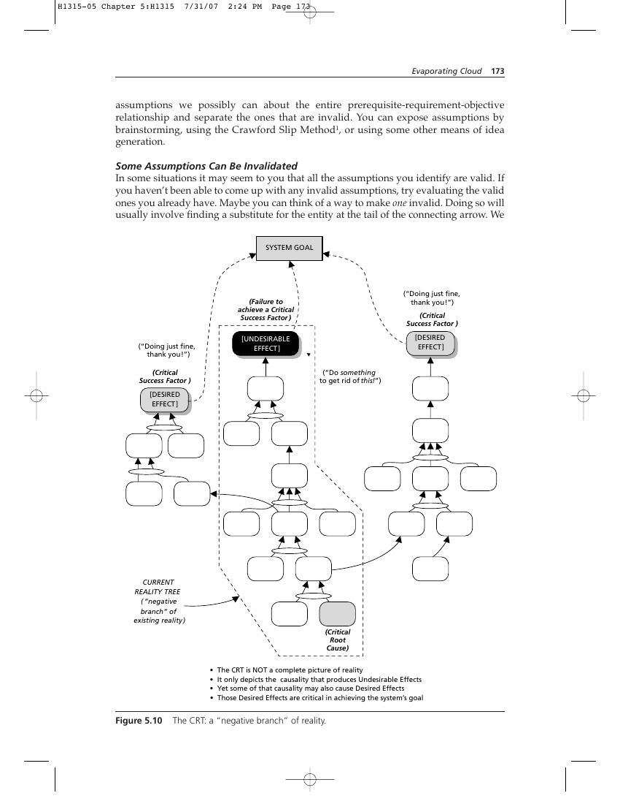

assumptions we possibly can about the entire prerequisite-requirement-objective relationship and separate the ones that are invalid. You can expose assumptions by brainstorming, using the Crawford Slip Method1, or using some other means of idea generation.

#### Some Assumptions Can Be Invalidated

In some situations it may seem to you that all the assumptions you identify are valid. If you haven’t been able to come up with any invalid assumptions, try evaluating the valid ones you already have. Maybe you can think of a way to make one invalid. Doing so will usually involve finding a substitute for the entity at the tail of the connecting arrow. We SYSTEM GOAL refer to this substitute as an “injection.” More on injections a little later in this chapter. For the moment, let’s return to the intriguing idea of rendering moot an apparently valid assumption. Take a look at the accompanying sidebar. Objective SYSTEM GOAL Requirement

(“Doing just fine, thank you!”) (Failure to

achieve a Critical Success Factor )

(“Doing just fine, thank you!”) (Critical

Success Factor ) (Critical

Success Factor ) [DESIRED EFFECT]

[UNDESIRABLE EFFECT] (“Do something to get rid of this!”)

[DESIRED EFFECT] CURRENT REALITY TREE

( “negative branch” of existing reality) (Critical Root

Cause)

- The CRT is NOT a complete picture of reality
- It only depicts the causality that produces Undesirable Effects
- Yet some of that causality may also cause Desired Effects
- Those Desired Effects are critical in achieving the system’s goal

Figure 5.10

The CRT: a “negative branch” of reality.

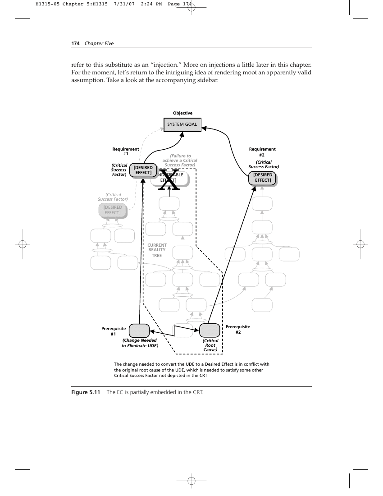

#1 (Critical Success

Factor) Requirement

#2 (Failure to

achieve a Critical Success Factor) (Critical

Success Factor)

X

[DESIRED EFFECT] [UNDESIRABLE

[DESIRED EFFECT]

EFFECT] (Critical

Success Factor) [DESIRED EFFECT] CURRENT REALITY TREE Prerequisite

#1 (Change Needed

to Eliminate UDE) Prerequisite

#2 (Critical Root

Cause)

The change needed to convert the UDE to a Desired Effect is in conflict with the original root cause of the UDE, which is needed to satisfy some other Critical Success Factor not depicted in the CRT

Figure 5.11

The EC is partially embedded in the CRT.

### Sidebar

#### Why Assumptions Are So Critical

Assumptions provide the hidden rationale for why the relationship between the entities exists. Consider the following example: “In order to have high-quality federal construction [REQUIREMENT], Congress must change the existing contracting law [PREREQUISITE], because:

### Assumptions

1. Existing law always favors the lowest bidder above all other considerations
2. Existing law always drives contractors to cut costs to the bone
3. Heavy cost cutting always encourages cutting corners on quality
4. Use of inexpensive, low-quality materials is the only way to cut costs
5. Low-quality materials never last as long as customers expect
6. Low-cost materials never last as long as customers expect
7. Contractors are never required to guarantee their work In this example there are seven assumptions underlying the arrow. There may be more. Can you think of any others? Are these all valid assumptions? At first cut they all look reasonable, and some undoubtedly are, but there are probably one or two whose validity might be challenged. Are the assumptions really valid? For the sake of argument, let’s assume that all the assumptions are valid except numbers 5 and 6. If low-cost, high-quality, durable materials were possible, the product would last much longer, even if all of the other assumptions remained valid and unchallenged. If such a “miracle material” could be found, assumptions 5 and 6 would no longer apply, but it might not be necessary to eliminate the prerequisite (change the existing law) because the requirement (highquality federal construction) might have been satisfied without having to do so. Finding high-quality, low-cost building materials becomes the injection we use to break the conflict between prerequisites.

“Win-Win” vs. “Win-Lose” Consider the implications of this kind of problem resolution. Obviously, the other side of the conflicting relationship in the sidebar is the opposite of our stated prerequisite: “Don’t change existing contracting law.” Somebody is certainly going to be entrenched in that position. But by invalidating the key assumptions that we did (numbers 5 and 6), we have eliminated the need to choose one prerequisite over the other—a “win-lose” situation. Instead, we found a way to satisfy the requirement (high-quality federal construction) without making anyone a loser—the essence of a “win-win” solution. Five Potential “Break Points” If you look at a typical Evaporating Cloud (Figure 5.12), you’ll notice that there are five arrows that have assumptions underlying them. Theoretically, the conflict can be broken at any of these arrows, or “break points.” But in practicality, the odds of finding invalid assumptions are likely to be lower with some arrows than with others. For example, if the EC is properly constructed to begin with, the arrows between the two requirements (R1 and R2) and the objective (O) are less likely to have invalid assumptions associated with them than the arrows between the prerequisites and the requirements (P1 to R1, P2 to R2), or between the two prerequisites (P1 and P2). Why do you suppose this is?

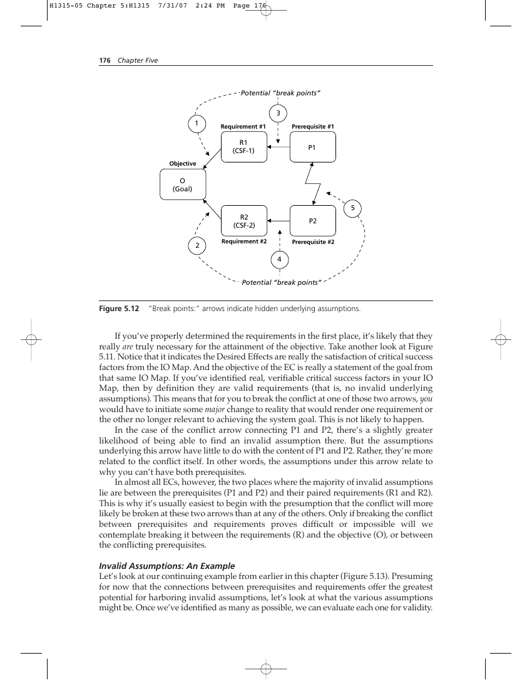

Potential “break points”

Requirement #1

Prerequisite #1

R1 (CSF-1)

P1 Objective

O (Goal)

R2 (CSF-2)

P2

Requirement #2

Prerequisite #2

Potential “break points”

Figure 5.12

“Break points:” arrows indicate hidden underlying assumptions.

If you’ve properly determined the requirements in the first place, it’s likely that they really are truly necessary for the attainment of the objective. Take another look at Figure 5.11. Notice that it indicates the Desired Effects are really the satisfaction of critical success factors from the IO Map. And the objective of the EC is really a statement of the goal from that same IO Map. If you’ve identified real, verifiable critical success factors in your IO Map, then by definition they are valid requirements (that is, no invalid underlying assumptions). This means that for you to break the conflict at one of those two arrows, you would have to initiate some major change to reality that would render one requirement or the other no longer relevant to achieving the system goal. This is not likely to happen. In the case of the conflict arrow connecting P1 and P2, there’s a slightly greater likelihood of being able to find an invalid assumption there. But the assumptions underlying this arrow have little to do with the content of P1 and P2. Rather, they’re more related to the conflict itself. In other words, the assumptions under this arrow relate to why you can’t have both prerequisites. In almost all ECs, however, the two places where the majority of invalid assumptions lie are between the prerequisites (P1 and P2) and their paired requirements (R1 and R2). This is why it’s usually easiest to begin with the presumption that the conflict will more likely be broken at these two arrows than at any of the others. Only if breaking the conflict between prerequisites and requirements proves difficult or impossible will we contemplate breaking it between the requirements (R) and the objective (O), or between the conflicting prerequisites.

#### Invalid Assumptions: An Example

Let’s look at our continuing example from earlier in this chapter (Figure 5.13). Presuming for now that the connections between prerequisites and requirements offer the greatest potential for harboring invalid assumptions, let’s look at what the various assumptions might be. Once we’ve identified as many as possible, we can evaluate each one for validity.

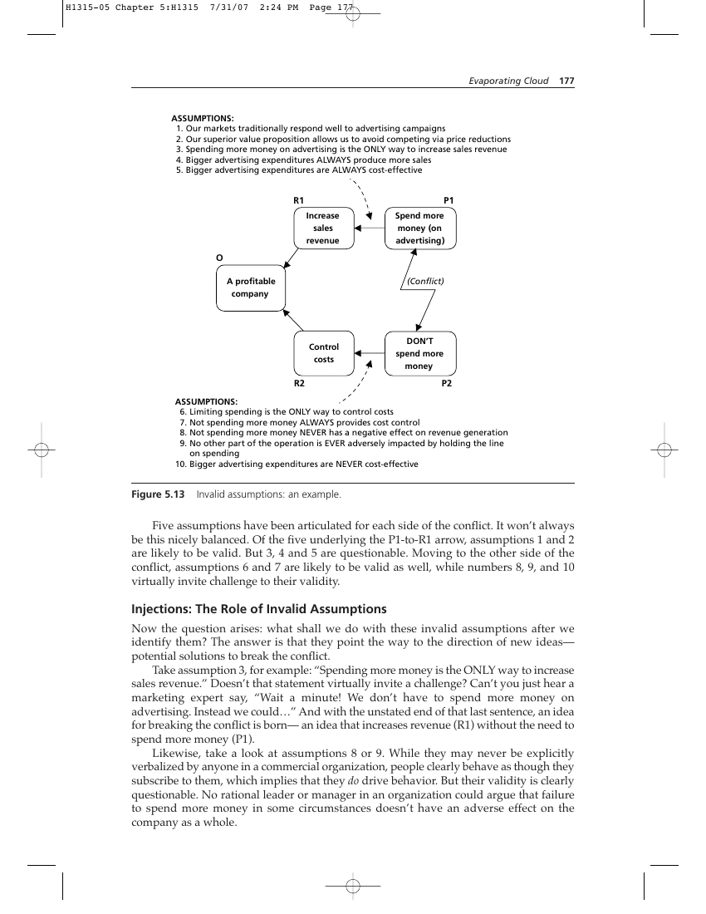

**ASSUMPTIONS:**

1. Our markets traditionally respond well to advertising campaigns
2. Our superior value proposition allows us to avoid competing via price reductions
3. Spending more money on advertising is the ONLY way to increase sales revenue
4. Bigger advertising expenditures ALWAYS produce more sales
5. Bigger advertising expenditures are ALWAYS cost-effective

R1

P1 Increase

sales revenue

Spend more money (on advertising)

O (Conflict)

A profitable company Control

costs

R2 DON’T

spend more money

P2

**ASSUMPTIONS:**

1. Limiting spending is the ONLY way to control costs
2. Not spending more money ALWAYS provides cost control
3. Not spending more money NEVER has a negative effect on revenue generation
4. No other part of the operation is EVER adversely impacted by holding the line on spending
5. Bigger advertising expenditures are NEVER cost-effective

Figure 5.13

Invalid assumptions: an example.

Five assumptions have been articulated for each side of the conflict. It won’t always be this nicely balanced. Of the five underlying the P1-to-R1 arrow, assumptions 1 and 2 are likely to be valid. But 3, 4 and 5 are questionable. Moving to the other side of the conflict, assumptions 6 and 7 are likely to be valid as well, while numbers 8, 9, and 10 virtually invite challenge to their validity.

#### Injections: The Role of Invalid Assumptions

Now the question arises: what shall we do with these invalid assumptions after we identify them? The answer is that they point the way to the direction of new ideas— potential solutions to break the conflict. Take assumption 3, for example: “Spending more money is the ONLY way to increase sales revenue.” Doesn’t that statement virtually invite a challenge? Can’t you just hear a marketing expert say, “Wait a minute! We don’t have to spend more money on advertising. Instead we could…” And with the unstated end of that last sentence, an idea for breaking the conflict is born— an idea that increases revenue (R1) without the need to spend more money (P1). Likewise, take a look at assumptions 8 or 9. While they may never be explicitly verbalized by anyone in a commercial organization, people clearly behave as though they subscribe to them, which implies that they do drive behavior. But their validity is clearly questionable. No rational leader or manager in an organization could argue that failure to spend more money in some circumstances doesn’t have an adverse effect on the company as a whole.

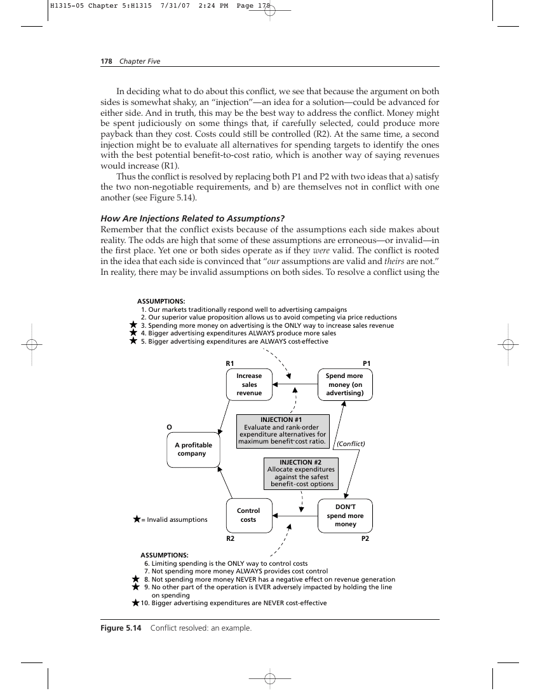

In deciding what to do about this conflict, we see that because the argument on both sides is somewhat shaky, an “injection”—an idea for a solution—could be advanced for either side. And in truth, this may be the best way to address the conflict. Money might be spent judiciously on some things that, if carefully selected, could produce more payback than they cost. Costs could still be controlled (R2). At the same time, a second injection might be to evaluate all alternatives for spending targets to identify the ones with the best potential benefit-to-cost ratio, which is another way of saying revenues would increase (R1). Thus the conflict is resolved by replacing both P1 and P2 with two ideas that a) satisfy the two non-negotiable requirements, and b) are themselves not in conflict with one another (see Figure 5.14).

#### How Are Injections Related to Assumptions?

Remember that the conflict exists because of the assumptions each side makes about reality. The odds are high that some of these assumptions are erroneous—or invalid—in the first place. Yet one or both sides operate as if they were valid. The conflict is rooted in the idea that each side is convinced that “our assumptions are valid and theirs are not.” In reality, there may be invalid assumptions on both sides. To resolve a conflict using the

**ASSUMPTIONS:**

1. Our markets traditionally respond well to advertising campaigns
2. Our superior value proposition allows us to avoid competing via price reductions
3. Spending more money on advertising is the ONLY way to increase sales revenue
4. Bigger advertising expenditures ALWAYS produce more sales
5. Bigger advertising expenditures are ALWAYS cost-effective

R1

P1 Increase

sales revenue

Spend more money (on advertising)

INJECTION #1 Evaluate and rank-order expenditure alternatives for maximum benefit- cost ratio.

O A profitable company

(Conflict)

INJECTION #2 Allocate expenditures against the safest . benefit-cost options Control

costs

= Invalid assumptions

R2 DON’T

spend more money

P2

**ASSUMPTIONS:**

1. Limiting spending is the ONLY way to control costs
2. Not spending more money ALWAYS provides cost control
3. Not spending more money NEVER has a negative effect on revenue generation
4. No other part of the operation is EVER adversely impacted by holding the line on spending
5. Bigger advertising expenditures are NEVER cost-effective

Figure 5.14

Conflict resolved: an example.

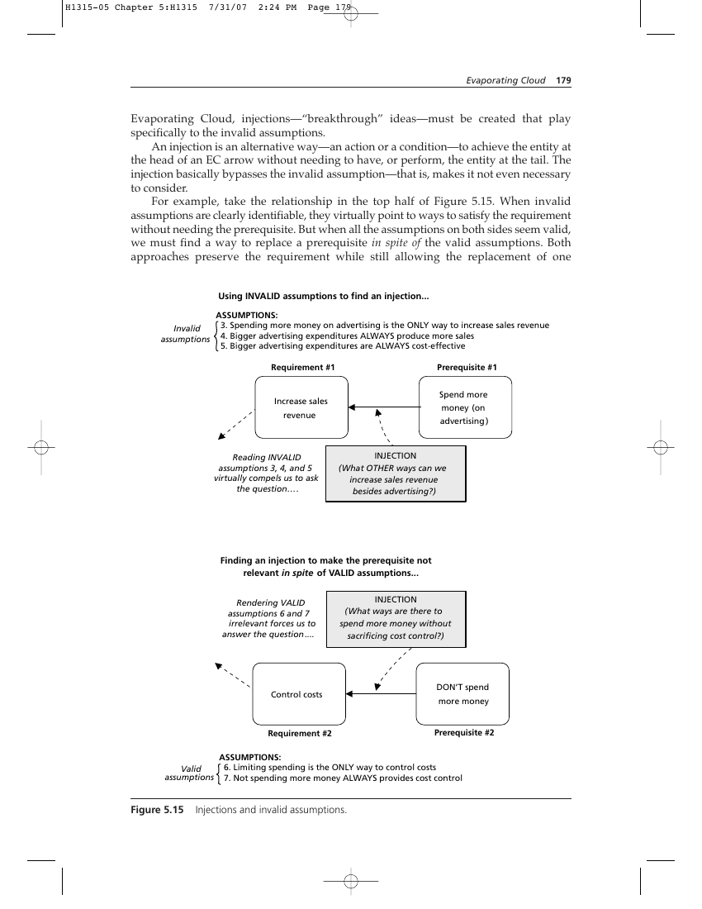

Evaporating Cloud, injections—“breakthrough” ideas—must be created that play specifically to the invalid assumptions. An injection is an alternative way—an action or a condition—to achieve the entity at the head of an EC arrow without needing to have, or perform, the entity at the tail. The injection basically bypasses the invalid assumption—that is, makes it not even necessary to consider. For example, take the relationship in the top half of Figure 5.15. When invalid assumptions are clearly identifiable, they virtually point to ways to satisfy the requirement without needing the prerequisite. But when all the assumptions on both sides seem valid, we must find a way to replace a prerequisite in spite of the valid assumptions. Both approaches preserve the requirement while still allowing the replacement of one Using INVALID assumptions to find an injection...

**ASSUMPTIONS:**

1. Spending more money on advertising is the ONLY way to increase sales revenue
2. Bigger advertising expenditures ALWAYS produce more sales
3. Bigger advertising expenditures are ALWAYS cost-effective

Invalid

assumptions

Requirement #1

Prerequisite #1 Spend more

Increase sales

money (on

revenue

#### Reading INVALID

assumptions 3, 4, and 5 virtually compels us to ask the question….

advertising )

INJECTION (What OTHER ways can we increase sales revenue besides advertising?)

Finding an injection to make the prerequisite not relevant in spite of VALID assumptions...

#### Rendering VALID

assumptions 6 and 7 irrelevant forces us to answer the question ....

INJECTION (What ways are there to spend more money without sacrificing cost control?)

Control costs

Requirement #2 Valid

assumptions

Figure 5.15

DON’T spend more money

Prerequisite #2

**ASSUMPTIONS:**

1. Limiting spending is the ONLY way to control costs
2. Not spending more money ALWAYS provides cost control

Injections and invalid assumptions.

assumption or both. Coming up with a way to replace a prerequisite in spite of valid assumptions is a highly creative challenge—but one that must be addressed in some of the most intractable conflicts.

#### Injections: Actions or Conditions?

Let’s revisit the issue of injections for a moment. It should be obvious from the example in Figure 5.14 that these two injections are directive in nature—they articulate specific actions to be taken. When possible, it’s usually better to have injections that represent discrete actions. They’re considerably easier to execute. But it’s not always possible—and maybe not advisable—to use actions for your injections in all cases. An Evaporating Cloud can have its prerequisites in the specific or the general. If the prerequisites are as specific as they are in Figure 5.14, it makes sense to apply injections that are direct actions, such as the ones in that figure. But if the prerequisites are at a higher or more conceptual level of the system, it makes more sense to create an injection that is a condition or outcome that must be put into place. For example, take a look at Figure 5.16. The upper conflict is relatively discrete. It addresses objective requirements that are clearly at a personal or family level, which makes them relatively simple. The lower conflict, however, involves a more complex system with many more variables than the one above. Expanding existing business is not a matter of taking a single specific action. Rather, business expansion would be the outcome of a number of discrete but interdependent activities, each of which may comprise several steps. Likewise, the development of new product lines is equally complicated. The lesson here is that the more limited in scope the conflict is, the more likely it is that you’ll be able to find specific, discrete, conflicting actions to put into the prerequisite blocks of the EC. The broader or higher-level the conflict, the more likely the prerequisites will have to be statements of complex conditions. And the level at which the conflict exists (that is, personal, group, system, and so on) will also have implications for the kind of injection—action or condition—most appropriate to break the conflict, too. “Silver Bullets” When we find invalid assumptions, we create injections (actions or conditions) to break them. Different invalid assumptions may need separate injections to break them. If the situation is simple, perhaps one injection might be enough. It’s also possible that one injection may break several assumptions, or, conversely, that several injections may be necessary to break one assumption. The lesson here is to avoid locking your thinking into a one-to-one relationship. But single injections that cleanly kill the conflict— “silver bullets,” if you will—are extremely rare. In most situations, especially complex ones, it’s unlikely that one single “mother of all injections,” whether an action or a condition, will suffice to completely eliminate the conflict. (That happens only in the movies.*) What’s much more likely is that it may take several injections to do the job. But the EC is equal to the task of identifying them all.

#### Creating “Breakthrough” Ideas to Resolve Conflict

The most challenging, intractable problems usually require some kind of breakthrough in thinking. This kind of thinking is a creative exercise, often of the highest degree. It requires “thinking outside the box.”

* As Dr. Ray Hansen once observed, “Silver bullets went out of style when the Lone Ranger died.”

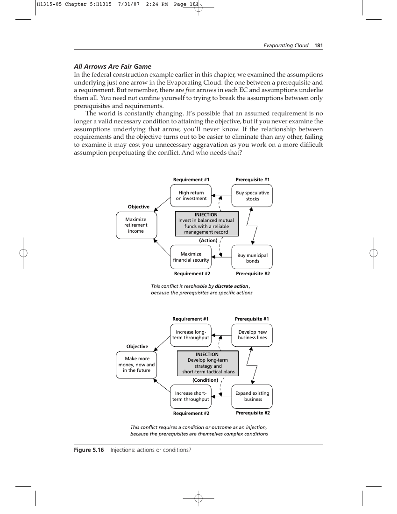

#### All Arrows Are Fair Game

In the federal construction example earlier in this chapter, we examined the assumptions underlying just one arrow in the Evaporating Cloud: the one between a prerequisite and a requirement. But remember, there are five arrows in each EC and assumptions underlie them all. You need not confine yourself to trying to break the assumptions between only prerequisites and requirements. The world is constantly changing. It’s possible that an assumed requirement is no longer a valid necessary condition to attaining the objective, but if you never examine the assumptions underlying that arrow, you’ll never know. If the relationship between requirements and the objective turns out to be easier to eliminate than any other, failing to examine it may cost you unnecessary aggravation as you work on a more difficult assumption perpetuating the conflict. And who needs that?

Requirement #1

Prerequisite #1

High return on investment

Buy speculative stocks Objective

INJECTION Invest in balanced mutual funds with a reliable management record Maximize

retirement income

(Action) Maximize

financial security

Buy municipal bonds

Requirement #2

Prerequisite #2

This conflict is resolvable by discrete action , because the prerequisites are specific actions

Requirement #1

Prerequisite #1

Increase longterm throughput

Develop new business lines Objective

Make more money, now and in the future

INJECTION Develop long-term strategy and short-term tactical plans (Condition) Increase shortterm throughput

Expand existing business

Requirement #2

Prerequisite #2

This conflict requires a condition or outcome as an injection, because the prerequisites are themselves complex conditions

Figure 5.16

Injections: actions or conditions?

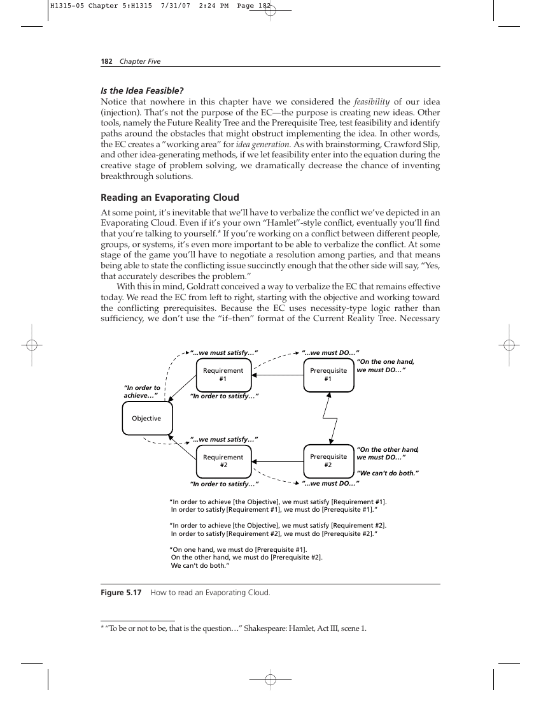

#### Is the Idea Feasible?

Notice that nowhere in this chapter have we considered the feasibility of our idea (injection). That’s not the purpose of the EC—the purpose is creating new ideas. Other tools, namely the Future Reality Tree and the Prerequisite Tree, test feasibility and identify paths around the obstacles that might obstruct implementing the idea. In other words, the EC creates a ”working area” for idea generation. As with brainstorming, Crawford Slip, and other idea-generating methods, if we let feasibility enter into the equation during the creative stage of problem solving, we dramatically decrease the chance of inventing breakthrough solutions.

#### Reading an Evaporating Cloud

At some point, it’s inevitable that we’ll have to verbalize the conflict we’ve depicted in an Evaporating Cloud. Even if it’s your own “Hamlet”-style conflict, eventually you’ll find that you’re talking to yourself.* If you’re working on a conflict between different people, groups, or systems, it’s even more important to be able to verbalize the conflict. At some stage of the game you’ll have to negotiate a resolution among parties, and that means being able to state the conflicting issue succinctly enough that the other side will say, “Yes, that accurately describes the problem.” With this in mind, Goldratt conceived a way to verbalize the EC that remains effective today. We read the EC from left to right, starting with the objective and working toward the conflicting prerequisites. Because the EC uses necessity-type logic rather than sufficiency, we don’t use the “if–then” format of the Current Reality Tree. Necessary

“...we must satisfy…” Requirement

#1 “In order to achieve…”

“...we must DO…” “On the one hand, Prerequisite we must DO…” #1

“In order to satisfy…”

#### Objective

“...we must satisfy…” “On the other hand, we must DO…” Requirement

#2 Prerequisite

#2

“In order to satisfy…”

“...we must DO…”

“We can’t do both.”

“In order to achieve [the Objective], we must satisfy [Requirement #1]. In order to satisfy [Requirement #1], we must do [Prerequisite #1].” “In order to achieve [the Objective], we must satisfy [Requirement #2]. In order to satisfy [Requirement #2], we must do [Prerequisite #2].” “On one hand, we must do [Prerequisite #1]. On the other hand, we must do [Prerequisite #2]. We can’t do both.”

Figure 5.17

How to read an Evaporating Cloud.

* “To be or not to be, that is the question…” Shakespeare: Hamlet, Act III, scene 1.

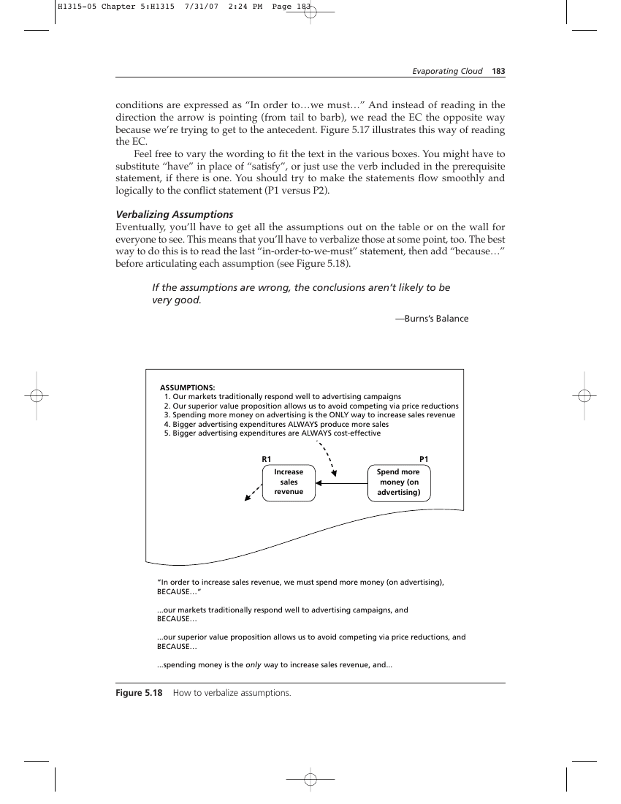

conditions are expressed as “In order to…we must…” And instead of reading in the direction the arrow is pointing (from tail to barb), we read the EC the opposite way because we’re trying to get to the antecedent. Figure 5.17 illustrates this way of reading the EC. Feel free to vary the wording to fit the text in the various boxes. You might have to substitute “have” in place of “satisfy”, or just use the verb included in the prerequisite statement, if there is one. You should try to make the statements flow smoothly and logically to the conflict statement (P1 versus P2).

#### Verbalizing Assumptions

> Eventually, you’ll have to get all the assumptions out on the table or on the wall for everyone to see. This means that you’ll have to verbalize those at some point, too. The best way to do this is to read the last “in-order-to-we-must” statement, then add “because…” before articulating each assumption (see Figure 5.18). If the assumptions are wrong, the conclusions aren’t likely to be very good.
>
> —Burns’s Balance

**ASSUMPTIONS:**

1. Our markets traditionally respond well to advertising campaigns
2. Our superior value proposition allows us to avoid competing via price reductions
3. Spending more money on advertising is the ONLY way to increase sales revenue
4. Bigger advertising expenditures ALWAYS produce more sales
5. Bigger advertising expenditures are ALWAYS cost-effective

R1

P1 Increase

sales revenue

Spend more money (on advertising)

“In order to increase sales revenue, we must spend more money (on advertising), BECAUSE…”

...our markets traditionally respond well to advertising campaigns, and BECAUSE…

...our superior value proposition allows us to avoid competing via price reductions, and

### Because…

...spending money is the only way to increase sales revenue, and...

Figure 5.18

How to verbalize assumptions.

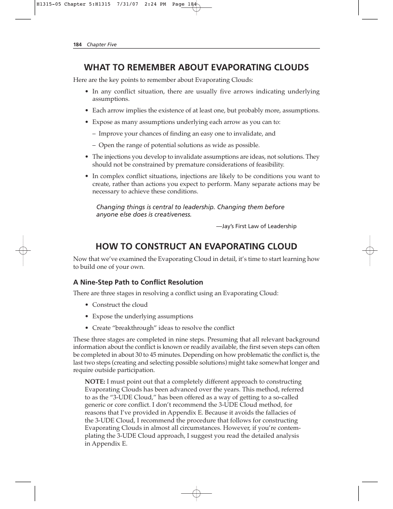

WHAT TO REMEMBER ABOUT EVAPORATING CLOUDS

Here are the key points to remember about Evaporating Clouds:

- In any conflict situation, there are usually five arrows indicating underlying assumptions.
- Each arrow implies the existence of at least one, but probably more, assumptions.
- Expose as many assumptions underlying each arrow as you can to:

> – Improve your chances of finding an easy one to invalidate, and

> – Open the range of potential solutions as wide as possible.

- The injections you develop to invalidate assumptions are ideas, not solutions. They should not be constrained by premature considerations of feasibility.
- In complex conflict situations, injections are likely to be conditions you want to create, rather than actions you expect to perform. Many separate actions may be necessary to achieve these conditions. Changing things is central to leadership. Changing them before anyone else does is creativeness.

> —Jay’s First Law of Leadership

### How to Construct an Evaporating Cloud

Now that we’ve examined the Evaporating Cloud in detail, it’s time to start learning how to build one of your own. A Nine-Step Path to Conflict Resolution

There are three stages in resolving a conflict using an Evaporating Cloud:

- Construct the cloud
- Expose the underlying assumptions
- Create “breakthrough” ideas to resolve the conflict These three stages are completed in nine steps. Presuming that all relevant background information about the conflict is known or readily available, the first seven steps can often be completed in about 30 to 45 minutes. Depending on how problematic the conflict is, the last two steps (creating and selecting possible solutions) might take somewhat longer and require outside participation.

**NOTE:** I must point out that a completely different approach to constructing Evaporating Clouds has been advanced over the years. This method, referred to as the “3-UDE Cloud,” has been offered as a way of getting to a so-called generic or core conflict. I don’t recommend the 3-UDE Cloud method, for reasons that I’ve provided in Appendix E. Because it avoids the fallacies of the 3-UDE Cloud, I recommend the procedure that follows for constructing Evaporating Clouds in almost all circumstances. However, if you’re contemplating the 3-UDE Cloud approach, I suggest you read the detailed analysis in Appendix E.

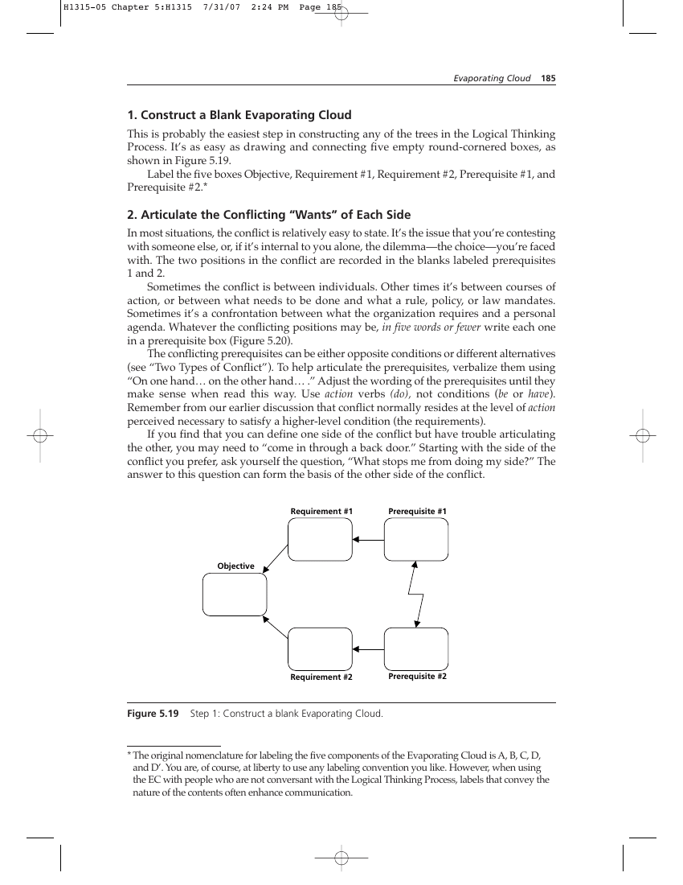

1. Construct a Blank Evaporating Cloud This is probably the easiest step in constructing any of the trees in the Logical Thinking Process. It’s as easy as drawing and connecting five empty round-cornered boxes, as shown in Figure 5.19. Label the five boxes Objective, Requirement #1, Requirement #2, Prerequisite #1, and Prerequisite #2.*
2. Articulate the Conflicting “Wants” of Each Side In most situations, the conflict is relatively easy to state. It’s the issue that you’re contesting with someone else, or, if it’s internal to you alone, the dilemma—the choice—you’re faced with. The two positions in the conflict are recorded in the blanks labeled prerequisites 1 and 2. Sometimes the conflict is between individuals. Other times it’s between courses of action, or between what needs to be done and what a rule, policy, or law mandates. Sometimes it’s a confrontation between what the organization requires and a personal agenda. Whatever the conflicting positions may be, in five words or fewer write each one in a prerequisite box (Figure 5.20). The conflicting prerequisites can be either opposite conditions or different alternatives (see “Two Types of Conflict”). To help articulate the prerequisites, verbalize them using “On one hand… on the other hand… .” Adjust the wording of the prerequisites until they make sense when read this way. Use action verbs (do), not conditions (be or have). Remember from our earlier discussion that conflict normally resides at the level of action perceived necessary to satisfy a higher-level condition (the requirements). If you find that you can define one side of the conflict but have trouble articulating the other, you may need to “come in through a back door.” Starting with the side of the conflict you prefer, ask yourself the question, “What stops me from doing my side?” The answer to this question can form the basis of the other side of the conflict. Requirement #1

Prerequisite #1

Requirement #2

Prerequisite #2 Objective

Figure 5.19

Step 1: Construct a blank Evaporating Cloud.

* The original nomenclature for labeling the five components of the Evaporating Cloud is A, B, C, D, and D’. You are, of course, at liberty to use any labeling convention you like. However, when using the EC with people who are not conversant with the Logical Thinking Process, labels that convey the nature of the contents often enhance communication.

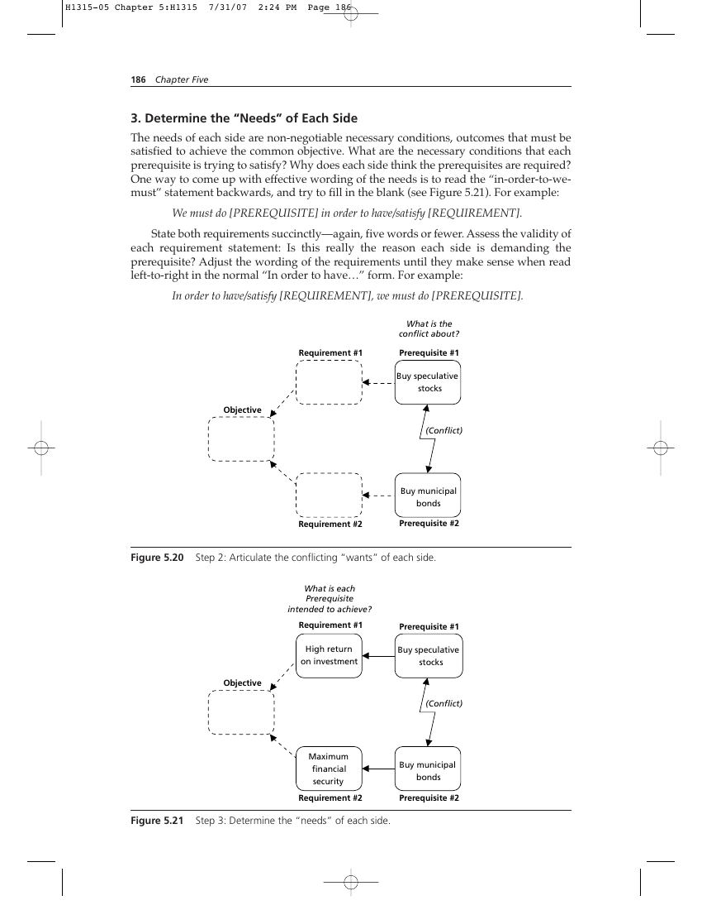

#### 3. Determine the “Needs” of Each Side

The needs of each side are non-negotiable necessary conditions, outcomes that must be satisfied to achieve the common objective. What are the necessary conditions that each prerequisite is trying to satisfy? Why does each side think the prerequisites are required? One way to come up with effective wording of the needs is to read the “in-order-to-wemust” statement backwards, and try to fill in the blank (see Figure 5.21). For example: We must do [PREREQUISITE] in order to have/satisfy [REQUIREMENT]. State both requirements succinctly—again, five words or fewer. Assess the validity of each requirement statement: Is this really the reason each side is demanding the prerequisite? Adjust the wording of the requirements until they make sense when read left-to-right in the normal “In order to have…” form. For example: In order to have/satisfy [REQUIREMENT], we must do [PREREQUISITE]. What is the

conflict about? Requirement #1

Prerequisite #1 Buy speculative stocks Objective

(Conflict)

Buy municipal bonds Requirement #2

Figure 5.20

Prerequisite #2

Step 2: Articulate the conflicting “wants” of each side. What is each Prerequisite

intended to achieve? Requirement #1

Prerequisite #1

High return on investment

Buy speculative stocks Objective

(Conflict)

Figure 5.21 Maximum

financial security

Buy municipal bonds

Requirement #2

Prerequisite #2

Step 3: Determine the “needs” of each side.

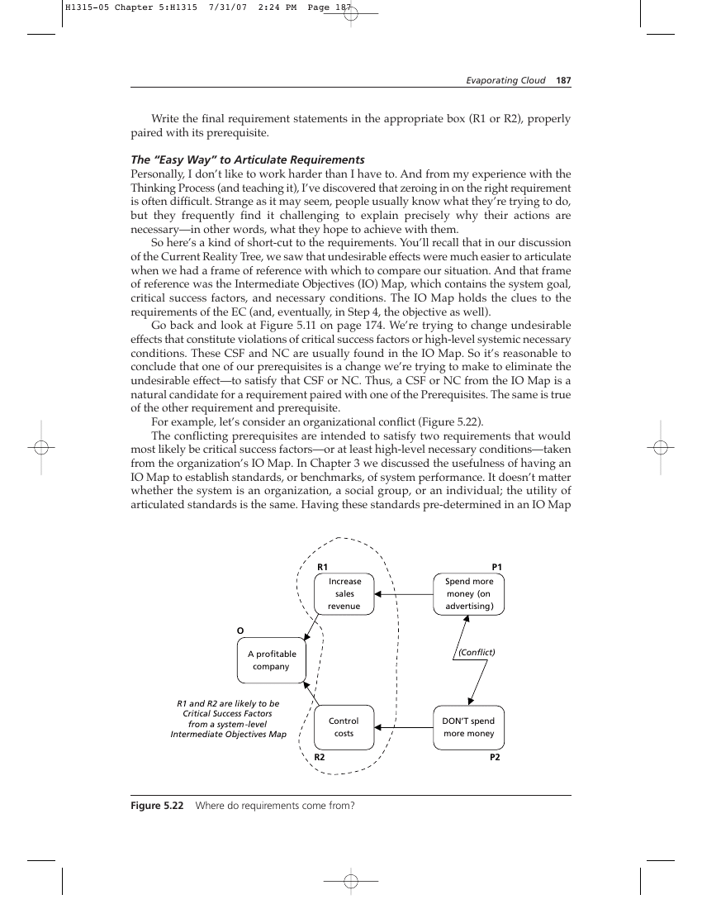

Write the final requirement statements in the appropriate box (R1 or R2), properly paired with its prerequisite.

#### The “Easy Way” to Articulate Requirements

Personally, I don’t like to work harder than I have to. And from my experience with the Thinking Process (and teaching it), I’ve discovered that zeroing in on the right requirement is often difficult. Strange as it may seem, people usually know what they’re trying to do, but they frequently find it challenging to explain precisely why their actions are necessary—in other words, what they hope to achieve with them. So here’s a kind of short-cut to the requirements. You’ll recall that in our discussion of the Current Reality Tree, we saw that undesirable effects were much easier to articulate when we had a frame of reference with which to compare our situation. And that frame of reference was the Intermediate Objectives (IO) Map, which contains the system goal, critical success factors, and necessary conditions. The IO Map holds the clues to the requirements of the EC (and, eventually, in Step 4, the objective as well). Go back and look at Figure 5.11 on page 174. We’re trying to change undesirable effects that constitute violations of critical success factors or high-level systemic necessary conditions. These CSF and NC are usually found in the IO Map. So it’s reasonable to conclude that one of our prerequisites is a change we’re trying to make to eliminate the undesirable effect—to satisfy that CSF or NC. Thus, a CSF or NC from the IO Map is a natural candidate for a requirement paired with one of the Prerequisites. The same is true of the other requirement and prerequisite. For example, let’s consider an organizational conflict (Figure 5.22). The conflicting prerequisites are intended to satisfy two requirements that would most likely be critical success factors—or at least high-level necessary conditions—taken from the organization’s IO Map. In Chapter 3 we discussed the usefulness of having an IO Map to establish standards, or benchmarks, of system performance. It doesn’t matter whether the system is an organization, a social group, or an individual; the utility of articulated standards is the same. Having these standards pre-determined in an IO Map

R1

P1 Increase

sales revenue

Spend more money (on advertising )

O (Conflict)

A profitable company

R1 and R2 are likely to be Critical Success Factors makes construction of a robust EC on the first attempt much easier and more reliable. If you’re having difficulty coming up with the Requirements for your EC, go back to your IO Map and see which CSF or NC jumps out at you as the ultimate reason the Prerequisite seems to be required. (If you haven’t already prepared an IO Map, it might be a good time to go back to construct one.) It’s worth noting at this point that the requirements are never in conflict with one another. By definition, necessary conditions can’t be in conflict, or one of them isn’t really necessary. If you think that your requirements are in conflict with each other, then you’ve probably misidentified as requirements statements that should really be prerequisites.

from a system -level Intermediate Objectives Map Control

costs

R2

Figure 5.22

Where do requirements come from?

DON’T spend more money

P2

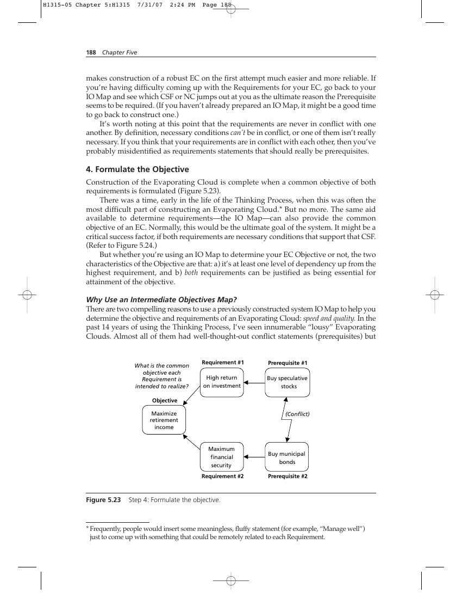

#### 4. Formulate the Objective

Construction of the Evaporating Cloud is complete when a common objective of both requirements is formulated (Figure 5.23). There was a time, early in the life of the Thinking Process, when this was often the most difficult part of constructing an Evaporating Cloud.* But no more. The same aid available to determine requirements—the IO Map—can also provide the common objective of an EC. Normally, this would be the ultimate goal of the system. It might be a critical success factor, if both requirements are necessary conditions that support that CSF. (Refer to Figure 5.24.) But whether you’re using an IO Map to determine your EC Objective or not, the two characteristics of the Objective are that: a) it’s at least one level of dependency up from the highest requirement, and b) both requirements can be justified as being essential for attainment of the objective.

#### Why Use an Intermediate Objectives Map?

There are two compelling reasons to use a previously constructed system IO Map to help you determine the objective and requirements of an Evaporating Cloud: speed and quality. In the past 14 years of using the Thinking Process, I’ve seen innumerable “lousy” Evaporating Clouds. Almost all of them had well-thought-out conflict statements (prerequisites) but

What is the common objective each Requirement is

intended to realize?

Requirement #1

Prerequisite #1

High return on investment

Buy speculative stocks Objective Maximize

retirement income

Figure 5.23

(Conflict) Maximum

financial security

Buy municipal bonds

Requirement #2

Prerequisite #2

Step 4: Formulate the objective.

* Frequently, people would insert some meaningless, fluffy statement (for example, “Manage well”) just to come up with something that could be remotely related to each Requirement.

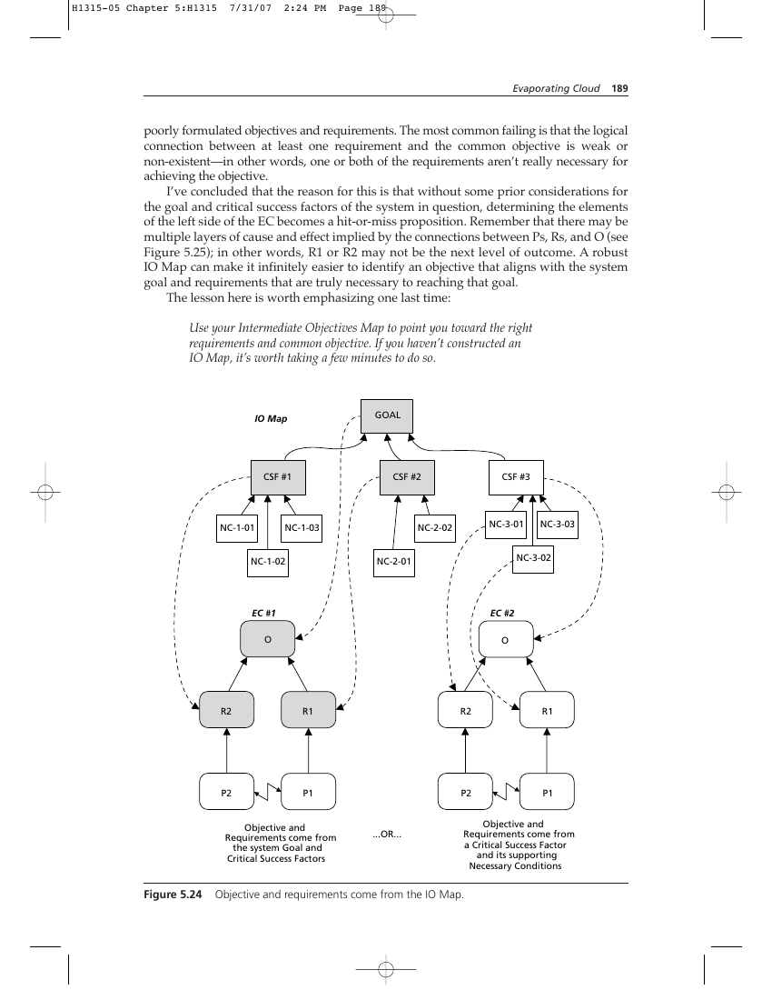

poorly formulated objectives and requirements. The most common failing is that the logical connection between at least one requirement and the common objective is weak or non-existent—in other words, one or both of the requirements aren’t really necessary for achieving the objective. I’ve concluded that the reason for this is that without some prior considerations for the goal and critical success factors of the system in question, determining the elements of the left side of the EC becomes a hit-or-miss proposition. Remember that there may be multiple layers of cause and effect implied by the connections between Ps, Rs, and O (see Figure 5.25); in other words, R1 or R2 may not be the next level of outcome. A robust IO Map can make it infinitely easier to identify an objective that aligns with the system goal and requirements that are truly necessary to reaching that goal. The lesson here is worth emphasizing one last time: Use your Intermediate Objectives Map to point you toward the right requirements and common objective. If you haven’t constructed an IO Map, it’s worth taking a few minutes to do so. GOAL IO Map

CSF #1

NC-1-01

CSF #2

NC-1-03

NC-1-02

NC-3-01

NC-2-02

NC-3-03

NC-3-02

NC-2-01

EC #1

EC #2

O

O

R2

R1

R2

R1

P2

P1

P2

P1 Objective and

Requirements come from the system Goal and Critical Success Factors

Figure 5.24

CSF #3

...OR... Objective and

Requirements come from a Critical Success Factor and its supporting Necessary Conditions

Objective and requirements come from the IO Map.

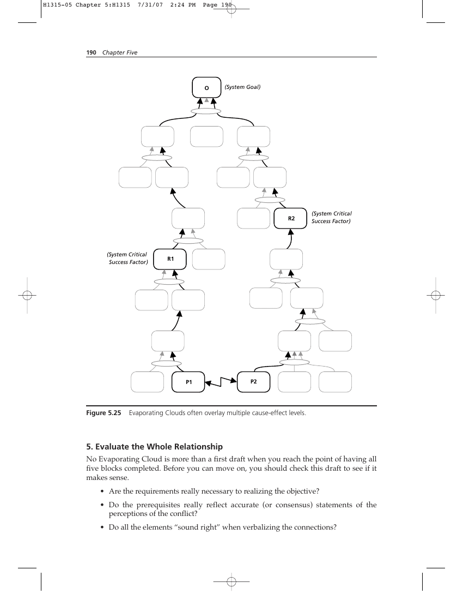

O

(System Goal)

R2 (System Critical

Success Factor)

R1

P1

Figure 5.25 (System Critical

Success Factor)

P2

Evaporating Clouds often overlay multiple cause-effect levels.

#### 5. Evaluate the Whole Relationship

No Evaporating Cloud is more than a first draft when you reach the point of having all five blocks completed. Before you can move on, you should check this draft to see if it makes sense.

- Are the requirements really necessary to realizing the objective?
- Do the prerequisites really reflect accurate (or consensus) statements of the perceptions of the conflict?
- Do all the elements “sound right” when verbalizing the connections?

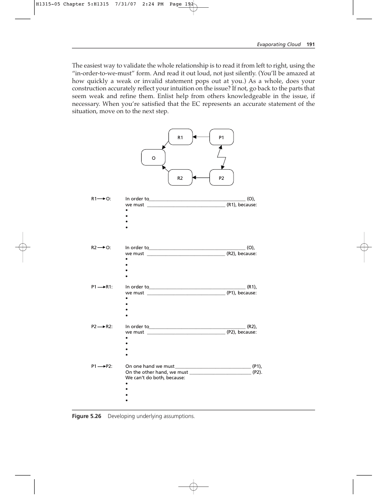

The easiest way to validate the whole relationship is to read it from left to right, using the “in-order-to-we-must” form. And read it out loud, not just silently. (You’ll be amazed at how quickly a weak or invalid statement pops out at you.) As a whole, does your construction accurately reflect your intuition on the issue? If not, go back to the parts that seem weak and refine them. Enlist help from others knowledgeable in the issue, if necessary. When you’re satisfied that the EC represents an accurate statement of the situation, move on to the next step.

R1

P1

R2

P2

O

R1

O:

In order to_________________________________________ (O), we must _________________________________ (R1), because:

R2

O:

In order to_________________________________________ (O), we must _________________________________ (R2), because:

P1

R1:

In order to_________________________________________ (R1), we must _________________________________ (P1), because:

P2

R2:

In order to_________________________________________ (R2), we must _________________________________ (P2), because:

P1

P2:

On one hand we must ________________________________ (P1), On the other hand, we must __________________________ (P2). We can’t do both, because:

Figure 5.26

Developing underlying assumptions.

#### 6. Develop Underlying Assumptions

Conflict is inherent in the assumptions that underlie it, and conflict resolution hides in the invalid assumptions of each side. In the 15th century, Michelangelo started with a whole block of marble and progressively chipped away everything that didn’t seem to be part of David. Getting at the invalid assumptions is a little like that. You start with all the assumptions you can muster for each side of the conflict. Eventually, you’ll cull out the valid assumptions and be left with only the invalid ones. But first you have to have a complete list. There’s no hard-and-fast rule about how many assumptions there might be underlying each arrow in an EC. Generally, the arrows between the requirements and the objective have the fewest, and those between the prerequisites and the requirements have the most. All arrows rest on at least one assumption. The most assumptions I’ve ever seen in a single EC is 37, with 16 under one arrow alone. But that’s the exception, rather than the rule. Use your best judgment about when to stop looking, but keep pressing until you run out of ideas. Try using the format in Figure 5.26 to array your assumptions for effective review. Beneath each statement, list all the “becauses” you can think of for each statement. These are the assumptions. When your creative well is dry on one statement, go on to the next.

#### Extreme Wording

There’s a technique in writing assumption statements that will later help you zero in on the invalid ones—the ones you’ll want to challenge. Instead of writing a fairly bland statement, word the assumption in the most extreme, outrageous way you can think of. For example: Instead of:

“We can’t eat without having money.”

Try:

“Of course, there’s absolutely no way we can eat without having money.”

The latter wording virtually invites challenge: “Oh, yeah? Well, I don’t need money to eat. Instead, I can…” We’ll address the rest of this line of thought in the discussion of injections, in Step 8. For now, suffice it to say that extreme wording makes invalid assumptions fairly jump off the page at you when you get to step 7. Here are some typical phrases you might use to convert neutral expression to extreme:

- “Of course we must…”
- “Of course we can’t...”
- “We can never…”
- “We must always…”
- “There’s absolutely no way…”
- “It’s absolutely impossible to…”

**NOTE:** Here’s another way to surface assumptions under the arrows connecting the prerequisites with the requirements. Try turning the Evaporating Cloud on its side, so the objective is at the top and the prerequisites are at the bottom. Below each prerequisite make two columns, one labeled “PRO” and the other labeled “CON.” Then in each PRO column begin listing as many advantages to having each prerequisite as you can.

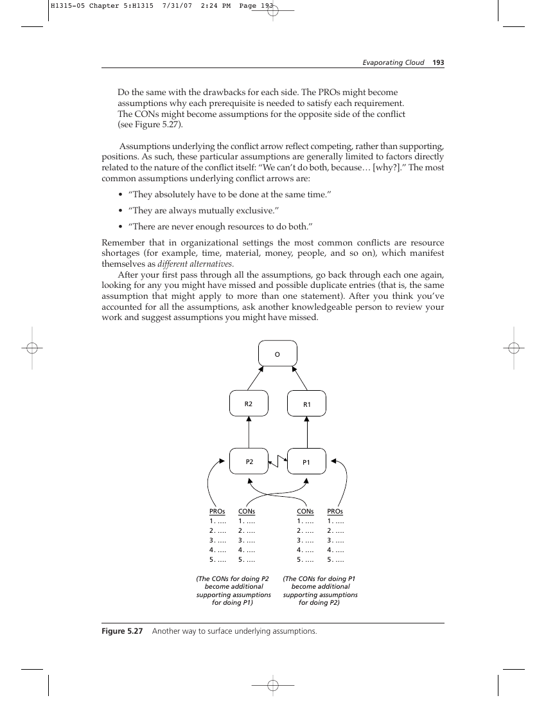

Do the same with the drawbacks for each side. The PROs might become assumptions why each prerequisite is needed to satisfy each requirement. The CONs might become assumptions for the opposite side of the conflict (see Figure 5.27). Assumptions underlying the conflict arrow reflect competing, rather than supporting, positions. As such, these particular assumptions are generally limited to factors directly related to the nature of the conflict itself: “We can’t do both, because… [why?].” The most common assumptions underlying conflict arrows are:

- “They absolutely have to be done at the same time.”
- “They are always mutually exclusive.”
- “There are never enough resources to do both.” Remember that in organizational settings the most common conflicts are resource shortages (for example, time, material, money, people, and so on), which manifest themselves as different alternatives. After your first pass through all the assumptions, go back through each one again, looking for any you might have missed and possible duplicate entries (that is, the same assumption that might apply to more than one statement). After you think you’ve accounted for all the assumptions, ask another knowledgeable person to review your work and suggest assumptions you might have missed.

O

#### PROs

1 . …. 2 . …. 3 . …. 4 . …. 5 . ….

R2

R1

P2

P1

#### CONs

1 . …. 2 . …. 3 . …. 4 . …. 5 . ….

#### CONs

1 . …. 2 . …. 3 . …. 4 . …. 5 . ….

(The CONs for doing P2 become additional supporting assumptions for doing P1)

Figure 5.27

#### PROs

1 . …. 2 . …. 3 . …. 4 . …. 5 . ….

(The CONs for doing P1 become additional supporting assumptions for doing P2)

Another way to surface underlying assumptions.

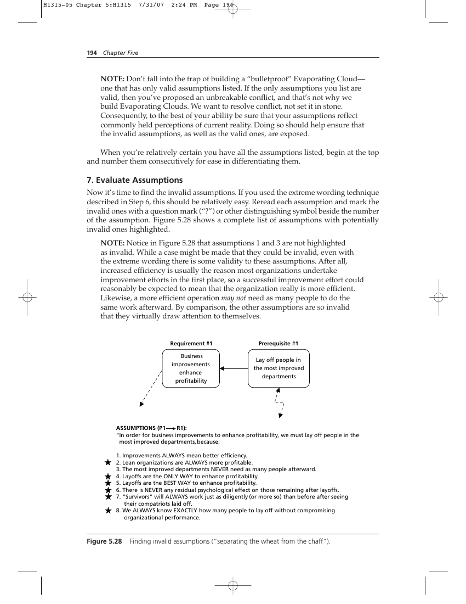

**NOTE:** Don’t fall into the trap of building a “bulletproof” Evaporating Cloud— one that has only valid assumptions listed. If the only assumptions you list are valid, then you’ve proposed an unbreakable conflict, and that’s not why we build Evaporating Clouds. We want to resolve conflict, not set it in stone. Consequently, to the best of your ability be sure that your assumptions reflect commonly held perceptions of current reality. Doing so should help ensure that the invalid assumptions, as well as the valid ones, are exposed. When you’re relatively certain you have all the assumptions listed, begin at the top and number them consecutively for ease in differentiating them.

1. Evaluate Assumptions Now it’s time to find the invalid assumptions. If you used the extreme wording technique described in Step 6, this should be relatively easy. Reread each assumption and mark the invalid ones with a question mark (“?”) or other distinguishing symbol beside the number of the assumption. Figure 5.28 shows a complete list of assumptions with potentially invalid ones highlighted.

**NOTE:** Notice in Figure 5.28 that assumptions 1 and 3 are not highlighted as invalid. While a case might be made that they could be invalid, even with the extreme wording there is some validity to these assumptions. After all, increased efficiency is usually the reason most organizations undertake improvement efforts in the first place, so a successful improvement effort could reasonably be expected to mean that the organization really is more efficient. Likewise, a more efficient operation may not need as many people to do the same work afterward. By comparison, the other assumptions are so invalid that they virtually draw attention to themselves.

Requirement #1

Prerequisite #1 Business

improvements enhance profitability

Lay off people in the most improved departments ASSUMPTIONS (P1

R1): “In order for business improvements to enhance profitability, we must lay off people in the most improved departments, because:

1. Improvements ALWAYS mean better efficiency.
2. Lean organizations are ALWAYS more profitable.
3. The most improved departments NEVER need as many people afterward.
4. Layoffs are the ONLY WAY to enhance profitability.
5. Layoffs are the BEST WAY to enhance profitability.
6. There is NEVER any residual psychological effect on those remaining after layoffs.
7. “Survivors” will ALWAYS work just as diligently (or more so) than before after seeing their compatriots laid off.
8. We ALWAYS know EXACTLY how many people to lay off without compromising organizational performance.

Figure 5.28

Finding invalid assumptions (“separating the wheat from the chaff”).

It may be that you have some arrows for which all the assumptions seem completely valid. When it’s time to start formulating injections, you’ll be better off focusing your attention on the other arrows—the ones that do have invalid assumptions underlying them. But before you discard the apparently valid assumptions entirely, it’s worth challenging your creativity to determine whether there might be changes you could institute that would invalidate an apparently valid assumption. More on this concept in the next step.

#### 8. Create Injections

The key word here is “create,” and this step is the most creative part of the Evaporating Cloud process. You now have to come up with the best not-yet-existing condition or action that will neutralize the conflict. In other words, the injection will constitute a change that will render one or both competing positions irrelevant. Coming up with a “best” injection implies that you have a number of options to choose from. How do we do this? It isn’t possible, or even desirable, to reduce the creative process to a set of restrictive, rote steps. But two general approaches can help make the job of creating injections a little easier. First, validate the requirements (R1 and R2). Let’s resolve not to waste our efforts unnecessarily. Remembering that the whole purpose of the Evaporating Cloud is to eliminate conflict, we can save ourselves a lot of trouble by first checking to see if both R1 and R2 are still really valid. Maybe one of them was established under conditions that no longer pertain to the current environment—in other words, it may have outlived its usefulness. If so, the conflict may really be a mirage. If either R1 or R2 isn’t really necessary, it can be eliminated, thus voiding the conflict outright. In this case, an injection might not be necessary—or it would be “Delete the requirement and the practices that fulfill it.” Or a requirement might be modified in such a way that it still leads to the objective but eliminates the need for the contentious prerequisite that supports it. Either way, validating R1 and R2 requires that you look first at the assumptions associated with arrows connecting them to the objective (O). Since requirements are often system-critical success factors or necessary conditions for valid reasons, it may be more difficult to attack the conflict on the left side of the Evaporating Cloud (O, R1, R2, and their connecting arrows). In most cases, changes to the way the requirement is satisfied—that is, the prerequisites on the right side of the diagram—are more likely within your span of control or sphere of influence.

#### The Alternative Environment

You may use any method you like as an “idea generator” to create injections. Some of the most common techniques are brainstorming, the Crawford Slip method, and nominal group technique. Another tool that’s especially useful for technical conflicts is TRIZ,* a problem-solving method invented in Russia by Genrich Altshuller. The best sources on TRIZ I’ve found are Domb3 and Terninko5. Appendix F describes a notional case study detailing how the combination of an Evaporating Cloud and TRIZ, had they been known at the time, might have prevented the Challenger space shuttle disaster. For those without experience in these idea-generation methods (or the time or stamina to research them), there’s another quick-hit technique that works very well, called the alternative environment. It’s based on the old adage that “there’s more than one way to skin a cat.” To use the alternative environment, ask yourself, “How can I have the requirement without needing its prerequisite?” Then you “shotgun” as many different ways as you can to satisfy the requirement without needing the prerequisite. Refer to Figure 5.29 for an example of the alternative environment technique. * TRIZ is a Russian acronym that stands for theory of inventive problem solving.

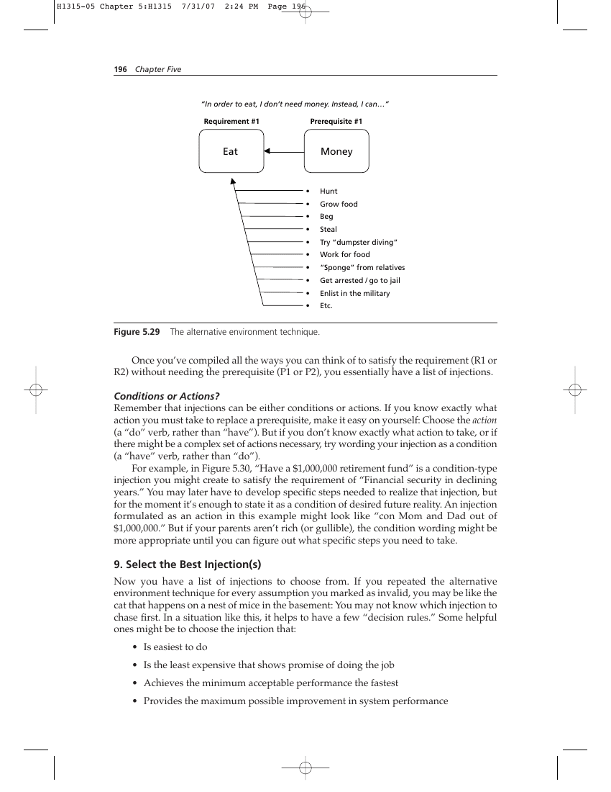

“In order to eat, I don’t need money. Instead, I can…”

Figure 5.29

Requirement #1

Prerequisite #1

Eat Money Hunt

Grow food

Beg Steal

Try “dumpster diving”

Work for food

“Sponge” from relatives

Get arrested / go to jail

Enlist in the military

Etc.

The alternative environment technique.

Once you’ve compiled all the ways you can think of to satisfy the requirement (R1 or R2) without needing the prerequisite (P1 or P2), you essentially have a list of injections.

#### Conditions or Actions?

Remember that injections can be either conditions or actions. If you know exactly what action you must take to replace a prerequisite, make it easy on yourself: Choose the action (a “do” verb, rather than “have”). But if you don’t know exactly what action to take, or if there might be a complex set of actions necessary, try wording your injection as a condition (a “have” verb, rather than “do”). For example, in Figure 5.30, “Have a $1,000,000 retirement fund” is a condition-type injection you might create to satisfy the requirement of “Financial security in declining years.” You may later have to develop specific steps needed to realize that injection, but for the moment it’s enough to state it as a condition of desired future reality. An injection formulated as an action in this example might look like “con Mom and Dad out of $1,000,000.” But if your parents aren’t rich (or gullible), the condition wording might be more appropriate until you can figure out what specific steps you need to take.

#### 9. Select the Best Injection(s)

Now you have a list of injections to choose from. If you repeated the alternative environment technique for every assumption you marked as invalid, you may be like the cat that happens on a nest of mice in the basement: You may not know which injection to chase first. In a situation like this, it helps to have a few “decision rules.” Some helpful ones might be to choose the injection that:

- Is easiest to do
- Is the least expensive that shows promise of doing the job
- Achieves the minimum acceptable performance the fastest
- Provides the maximum possible improvement in system performance

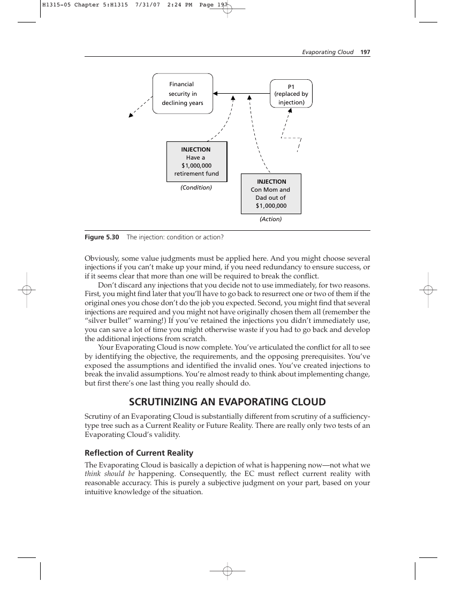

Financial

security in declining years

P1 (replaced by injection)

INJECTION Have a

$1,000,000 retirement fund (Condition)

INJECTION Con Mom and

Dad out of $1,000,000 (Action)

Figure 5.30

The injection: condition or action?

Obviously, some value judgments must be applied here. And you might choose several injections if you can’t make up your mind, if you need redundancy to ensure success, or if it seems clear that more than one will be required to break the conflict. Don’t discard any injections that you decide not to use immediately, for two reasons. First, you might find later that you’ll have to go back to resurrect one or two of them if the original ones you chose don’t do the job you expected. Second, you might find that several injections are required and you might not have originally chosen them all (remember the “silver bullet” warning!) If you’ve retained the injections you didn’t immediately use, you can save a lot of time you might otherwise waste if you had to go back and develop the additional injections from scratch. Your Evaporating Cloud is now complete. You’ve articulated the conflict for all to see by identifying the objective, the requirements, and the opposing prerequisites. You’ve exposed the assumptions and identified the invalid ones. You’ve created injections to break the invalid assumptions. You’re almost ready to think about implementing change, but first there’s one last thing you really should do.

### Scrutinizing an Evaporating Cloud

Scrutiny of an Evaporating Cloud is substantially different from scrutiny of a sufficiencytype tree such as a Current Reality or Future Reality. There are really only two tests of an Evaporating Cloud’s validity.

#### Reflection of Current Reality

The Evaporating Cloud is basically a depiction of what is happening now—not what we think should be happening. Consequently, the EC must reflect current reality with reasonable accuracy. This is purely a subjective judgment on your part, based on your intuitive knowledge of the situation.

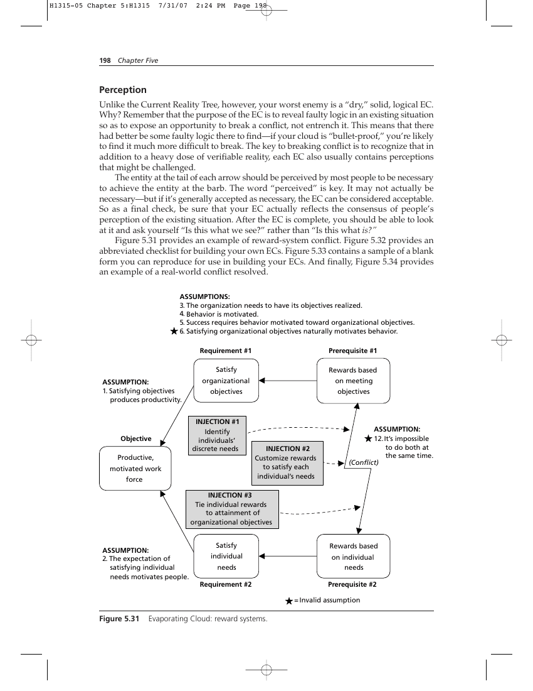

#### Perception

Unlike the Current Reality Tree, however, your worst enemy is a “dry,” solid, logical EC. Why? Remember that the purpose of the EC is to reveal faulty logic in an existing situation so as to expose an opportunity to break a conflict, not entrench it. This means that there had better be some faulty logic there to find—if your cloud is “bullet-proof,” you’re likely to find it much more difficult to break. The key to breaking conflict is to recognize that in addition to a heavy dose of verifiable reality, each EC also usually contains perceptions that might be challenged. The entity at the tail of each arrow should be perceived by most people to be necessary to achieve the entity at the barb. The word “perceived” is key. It may not actually be necessary—but if it’s generally accepted as necessary, the EC can be considered acceptable. So as a final check, be sure that your EC actually reflects the consensus of people’s perception of the existing situation. After the EC is complete, you should be able to look at it and ask yourself “Is this what we see?” rather than “Is this what is?” Figure 5.31 provides an example of reward-system conflict. Figure 5.32 provides an abbreviated checklist for building your own ECs. Figure 5.33 contains a sample of a blank form you can reproduce for use in building your ECs. And finally, Figure 5.34 provides an example of a real-world conflict resolved.

**ASSUMPTIONS:**

1. The organization needs to have its objectives realized.
2. Behavior is motivated.
3. Success requires behavior motivated toward organizational objectives.
4. Satisfying organizational objectives naturally motivates behavior.

ASSUMPTION:

1. Satisfying objectives produces productivity.

Objective

Requirement #1

Prerequisite #1 Satisfy

Rewards based

organizational

on meeting

objectives

objectives

INJECTION #1 Identify

individuals’ discrete needs

Productive, motivated work force

INJECTION #2 Customize rewards to satisfy each individual’s needs

**ASSUMPTION:**

1. It’s impossible to do both at the same time. (Conflict)

INJECTION #3 Tie individual rewards to attainment of organizational objectives

**ASSUMPTION:**

1. The expectation of satisfying individual needs motivates people.

Satisfy

Rewards based

individual needs

on individual needs

Requirement #2

Prerequisite #2 = Invalid assumption

Figure 5.31

Evaporating Cloud: reward systems.

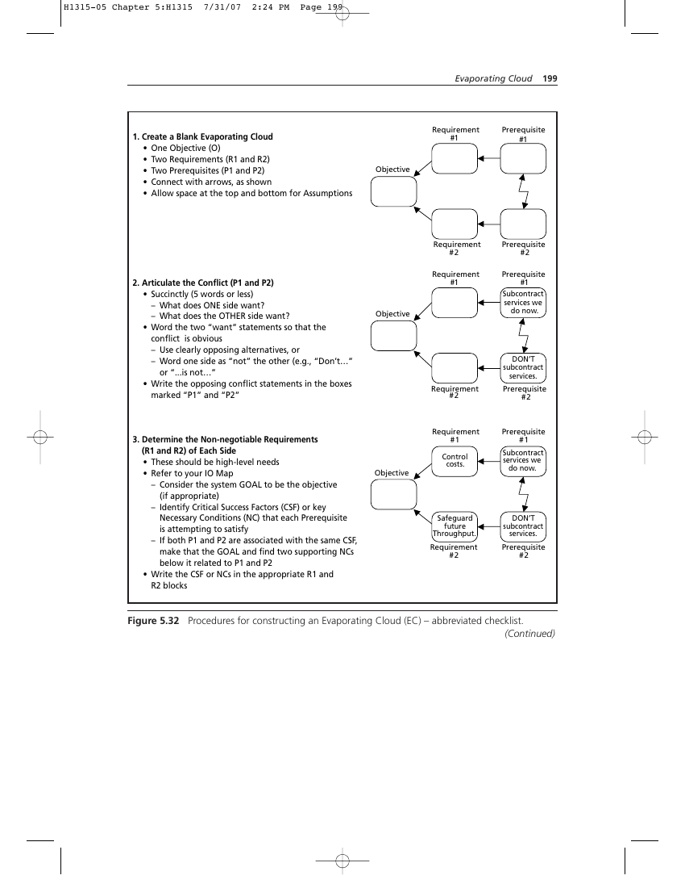

1. Create a Blank Evaporating Cloud
- One Objective (O)
- Two Requirements (R1 and R2)
- Two Prerequisites (P1 and P2)
- Connect with arrows, as shown
- Allow space at the top and bottom for Assumptions
1. Articulate the Conflict (P1 and P2)
- Succinctly (5 words or less)

> – What does ONE side want?

> – What does the OTHER side want?

- Word the two “want” statements so that the conflict is obvious

> – Use clearly opposing alternatives, or

> – Word one side as “not” the other (e.g., “Don’t…”

or “...is not…”

- Write the opposing conflict statements in the boxes marked “P1” and “P2”
1. Determine the Non-negotiable Requirements (R1 and R2) of Each Side
- These should be high-level needs
- Refer to your IO Map

> – Consider the system GOAL to be the objective

> (if appropriate)
>
> – Identify Critical Success Factors (CSF) or key

> Necessary Conditions (NC) that each Prerequisite is attempting to satisfy make that the GOAL and find two supporting NCs below it related to P1 and P2
>
> – If both P1 and P2 are associated with the same CSF,

- Write the CSF or NCs in the appropriate R1 and R2 blocks

Requirement

#1 Prerequisite

#1 Requirement

#2 Prerequisite

#2 Requirement

#1 Prerequisite

#1 Subcontract

services we do now. Objective Objective DON’T

subcontract services. Requirement

#2 Prerequisite

#2 Requirement

#1 Prerequisite

#1 Control

costs. Subcontract

services we do now. Safeguard

future Throughput. DON’T

subcontract services. Requirement

#2 Prerequisite

#2 Objective

Figure 5.32 Procedures for constructing an Evaporating Cloud (EC) – abbreviated checklist. (Continued)

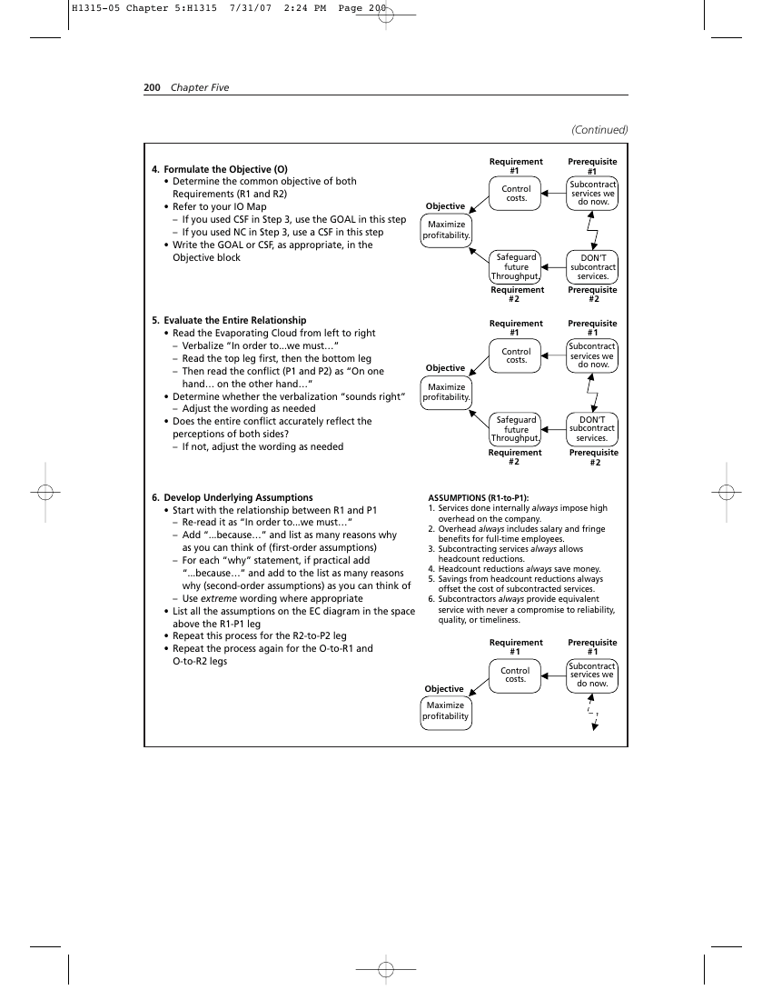

(Continued)

1. Formulate the Objective (O)
- Determine the common objective of both Requirements (R1 and R2)
- Refer to your IO Map

> – If you used CSF in Step 3, use the GOAL in this step

> – If you used NC in Step 3, use a CSF in this step

- Write the GOAL or CSF, as appropriate, in the Objective block
1. Evaluate the Entire Relationship
- Read the Evaporating Cloud from left to right

> – Verbalize “In order to...we must…”

> – Read the top leg first, then the bottom leg

> – Then read the conflict (P1 and P2) as “On one

hand… on the other hand…”

- Determine whether the verbalization “sounds right”

> – Adjust the wording as needed

- Does the entire conflict accurately reflect the perceptions of both sides?

> – If not, adjust the wording as needed

1. Develop Underlying Assumptions
- Start with the relationship between R1 and P1

> – Re-read it as “In order to...we must…”

> – Add “...because…” and list as many reasons why

> as you can think of (first-order assumptions)
>
> – For each “why” statement, if practical add

> “...because…” and add to the list as many reasons why (second-order assumptions) as you can think of
>
> – Use extreme wording where appropriate

- List all the assumptions on the EC diagram in the space above the R1-P1 leg
- Repeat this process for the R2-to-P2 leg
- Repeat the process again for the O-to-R1 and O-to-R2 legs

Control

costs. Prerequisite

#1 Subcontract

services we do now. Safeguard

future Throughput. DON’T

subcontract services. Requirement

#2 Prerequisite

#2 Requirement

#1 Control

costs. Prerequisite

#1 Subcontract

services we do now. Safeguard

future Throughput. DON’T

subcontract services. Requirement

#2 Prerequisite

#2 Requirement

#1 Objective Maximize

profitability. Objective Maximize

profitability.

ASSUMPTIONS (R1-to-P1):

1. Services done internally always impose high overhead on the company.
2. Overhead always includes salary and fringe benefits for full-time employees.
3. Subcontracting services always allows headcount reductions.
4. Headcount reductions always save money.
5. Savings from headcount reductions always offset the cost of subcontracted services.
6. Subcontractors always provide equivalent service with never a compromise to reliability, quality, or timeliness.

Objective Maximize

profitability Requirement

#1 Prerequisite

#1 Control

costs. Subcontract

services we do now.

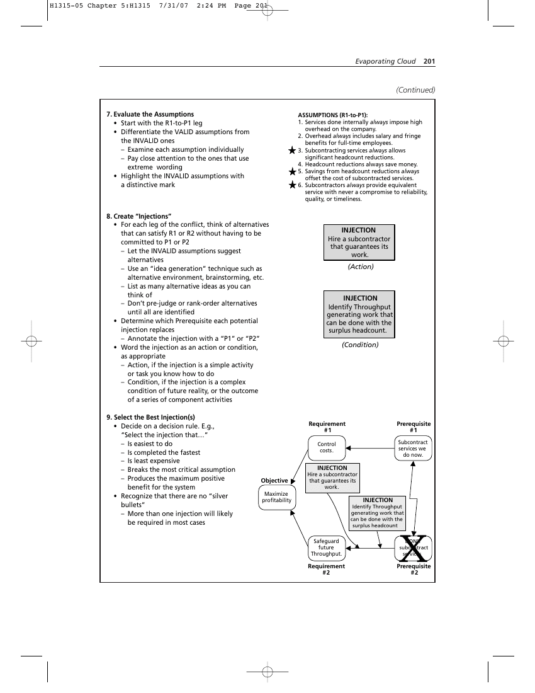

(Continued)

1. Evaluate the Assumptions
- Start with the R1-to-P1 leg
- Differentiate the VALID assumptions from the INVALID ones

> – Examine each assumption individually

> – Pay close attention to the ones that use

extreme wording

- Highlight the INVALID assumptions with a distinctive mark

ASSUMPTIONS (R1-to-P1):

1. Services done internally always impose high overhead on the company.
2. Overhead always includes salary and fringe benefits for full-time employees.
3. Subcontracting services always allows significant headcount reductions.
4. Headcount reductions always save money.
5. Savings from headcount reductions always offset the cost of subcontracted services.
6. Subcontractors always provide equivalent service with never a compromise to reliability, quality, or timeliness.
7. Create “Injections”
- For each leg of the conflict, think of alternatives that can satisfy R1 or R2 without having to be committed to P1 or P2

> – Let the INVALID assumptions suggest

> alternatives
>
> – Use an “idea generation” technique such as

> alternative environment, brainstorming, etc.
>
> – List as many alternative ideas as you can

> think of
>
> – Don’t pre-judge or rank-order alternatives

until all are identified

- Determine which Prerequisite each potential injection replaces

> – Annotate the injection with a “P1” or “P2”

- Word the injection as an action or condition, as appropriate

> – Action, if the injection is a simple activity

> or task you know how to do
>
> – Condition, if the injection is a complex

condition of future reality, or the outcome of a series of component activities generating work that can be done with the surplus headcount. (Condition)

1. Select the Best Injection(s)
- Decide on a decision rule. E.g., “Select the injection that…”

> – Is easiest to do

> – Is completed the fastest

> – Is least expensive

> – Breaks the most critical assumption

> – Produces the maximum positive

benefit for the system

- Recognize that there are no “silver bullets”

> – More than one injection will likely

be required in most cases

INJECTION Hire a subcontractor that guarantees its work. (Action)

INJECTION Identify Throughput Requirement

#1 Prerequisite

#1 Control

costs. Subcontract

services we do now.

INJECTION Objective

Hire a subcontractor that guarantees its work . Maximize

profitability

INJECTION Identify Throughput

generating work that can be done with the surplus headcount Safeguard

future Throughput. Requirement

#2

X DON’T

subcontract services Prerequisite

#2

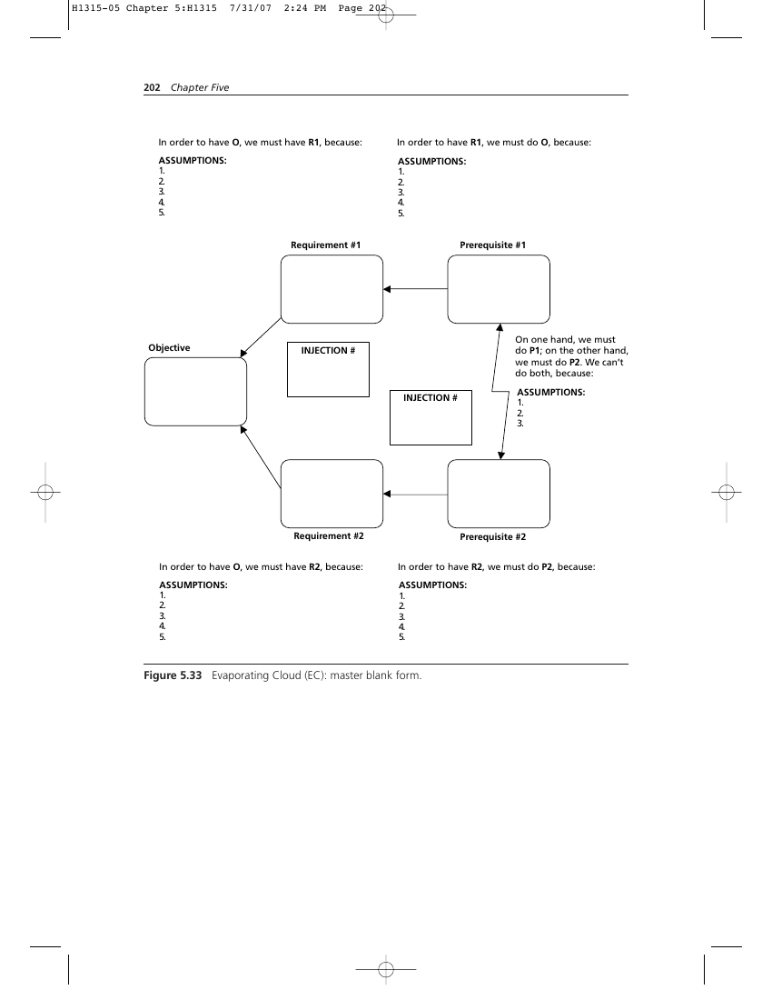

In order to have O, we must have R1, because:

In order to have R1, we must do O, because:

**ASSUMPTIONS:** 1. 2. 3. 4. 5.

**ASSUMPTIONS:** 1. 2. 3. 4. 5. Requirement #1

Objective

Prerequisite #1

On one hand, we must do P1; on the other hand, we must do P2. We can’t do both, because:

INJECTION #

**ASSUMPTIONS:** 1. 2. 3.

INJECTION #

Requirement #2

Prerequisite #2

In order to have O, we must have R2, because:

In order to have R2, we must do P2, because:

**ASSUMPTIONS:** 1. 2. 3. 4. 5.

**ASSUMPTIONS:** 1. 2. 3. 4. 5.

Figure 5.33 Evaporating Cloud (EC): master blank form.

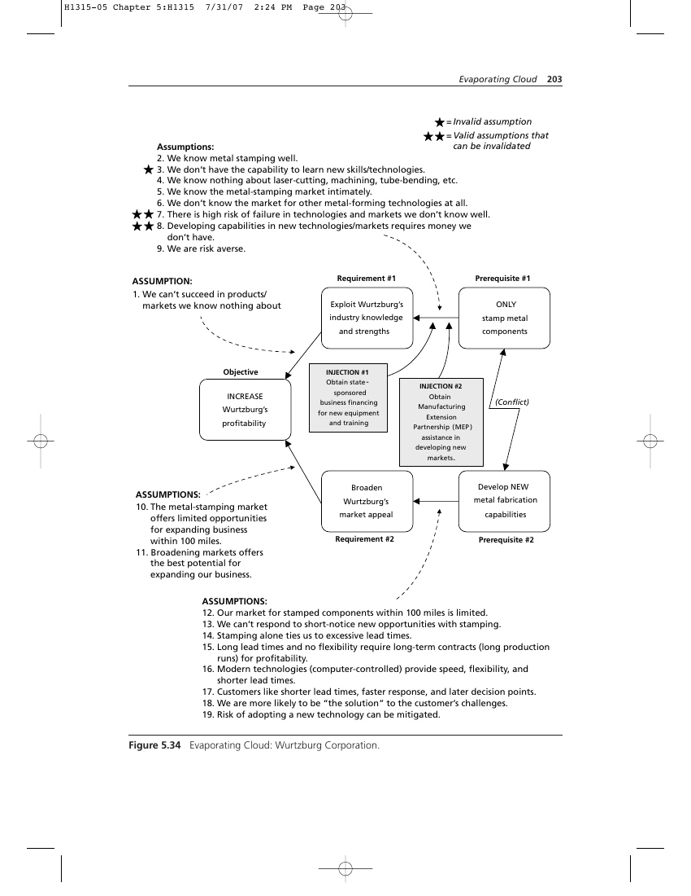

= Invalid assumption = Valid assumptions that can be invalidated

Assumptions:

1. We know metal stamping well.
2. We don’t have the capability to learn new skills/technologies.
3. We know nothing about laser-cutting, machining, tube-bending, etc.
4. We know the metal-stamping market intimately.
5. We don’t know the market for other metal-forming technologies at all.
6. There is high risk of failure in technologies and markets we don’t know well.
7. Developing capabilities in new technologies/markets requires money we don’t have.
8. We are risk averse.

**ASSUMPTION:**

1. We can’t succeed in products/ markets we know nothing about

Objective

Requirement #1 Exploit Wurtzburg’s ONLY

industry knowledge

stamp metal

and strengths

components

INJECTION #1 Obtain state - INCREASE Wurtzburg’s

profitability

**ASSUMPTIONS:**

1. The metal-stamping market offers limited opportunities for expanding business within 100 miles.
2. Broadening markets offers the best potential for expanding our business.

Prerequisite #1

sponsored business financing for new equipment and training

INJECTION #2 Obtain Manufacturing Extension

Partnership (MEP ) assistance in developing new markets .

(Conflict) Broaden Develop NEW Wurtzburg’s

metal fabrication

market appeal

capabilities

Requirement #2

Prerequisite #2

**ASSUMPTIONS:**

1. Our market for stamped components within 100 miles is limited.
2. We can’t respond to short-notice new opportunities with stamping.
3. Stamping alone ties us to excessive lead times.
4. Long lead times and no flexibility require long-term contracts (long production runs) for profitability.
5. Modern technologies (computer-controlled) provide speed, flexibility, and shorter lead times.
6. Customers like shorter lead times, faster response, and later decision points.
7. We are more likely to be “the solution” to the customer’s challenges.
8. Risk of adopting a new technology can be mitigated.

Figure 5.34 Evaporating Cloud: Wurtzburg Corporation.

### Summary

> As we’ve seen, success in using the Evaporating Cloud is based on bringing to the surface the underlying assumptions we make about current reality—assumptions whose validity is questionable. Once we’ve determined that our conflict is based on invalid assumptions, the door is opened to new ways of satisfying our requirements is opened—ways that completely bypass the original conflict. And the EC helps us to creatively assemble new alternatives. But new ideas are not solutions. Until they’re tested and implemented, they’re just ideas. Now that we have an idea for a solution, it’s time to verify it. Will it really do what we want it to do? And will it do so without creating more problems than it solves? Verifying the effectiveness of our idea is the job of the second part of determining what to change to: the Future Reality Tree. This is the subject of Chapter 6. It is not because things are difficult that we do not dare. It is because we do not dare that they are difficult.
>
> —Seneca

### Endnotes

1. Dettmer, H. William. Brainpower Networking Using the Crawford Slip Method. Victoria, BC (Canada): Trafford Publishing, 2003.
2. Domb, Ellen, Ph.D., and H. William Dettmer. “Breakthrough Innovation in Conflict Resolution: Marrying TRIZ and the TOC Thinking Process.” Proceedings, Constraints Management SIG Symposium, APICS, 1999.
3. Domb, Ellen, Ph.D., and Kalevi Rantanen. Simplified TRIZ: New Problem-Solving Applications for Engineers and Manufacturing Professionals. Boca Raton. FL: St. Lucie Press (2002).
4. Roadman, Charles M., et.al. Proceedings, Constraints Management SIG Symposium, APICS, 1995.
5. Terninko, John, Alla Zusman, and Boris Zlotin. Systematic Innovation: An Introduction to TRIZ. Boca Raton. FL: St. Lucie Press (1998).

