# Chapter 6: Future Reality Tree

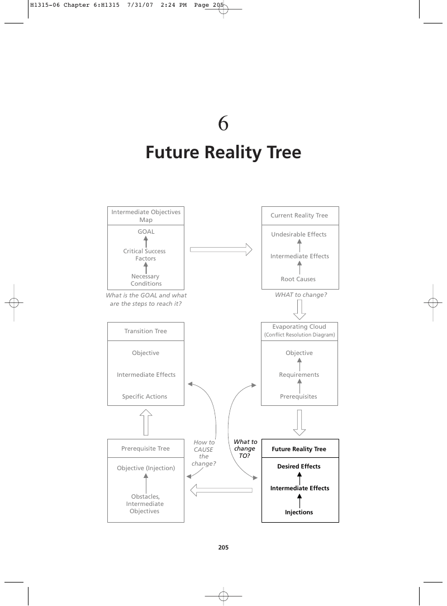

Intermediate Objectives

Map Current Reality Tree GOAL Undesirable Effects Critical Success Factors Intermediate Effects Necessary Conditions Root Causes

What is the GOAL and what are the steps to reach it?

WHAT to change? Evaporating Cloud Transition Tree

(Conflict Resolution Diagram) Objective Objective Intermediate Effects Requirements Specific Actions Prerequisites Prerequisite Tree

Objective (Injection) What to

change TO? How to CAUSE

the change?

Obstacles, Intermediate Objectives Injections

> To introduce something altogether new would mean to begin all over, to become ignorant again, and to run the old, old risk of failing to learn.
>
> —Isaac Asimov

Picture yourself responsible for the performance of a complex system—for example, a state education system. For the sake of argument, let’s say it’s failing the students it’s charged with educating. You know you have to make significant changes or watch it collapse completely. And you have no shortage of people telling you what you should do to “fix” the system—and naturally, all of them have different opinions about what should be done. Yet this is not a decision to be entered into lightly. You know it’s likely to cost millions of dollars to put the system back on track again, and you really have only one chance to get it right. What will you do? Would you simply choose a course of action that feels good and say, “That looks about right!”? Or would you rather have some confidence that the decision you’re about to make will actually deliver the results you expect—and in the process not dig the hole you’re in any deeper? Naturally, most of us would choose the latter, not the former. Nonetheless, many of us make big decisions in our professional and personal lives with no better assurance that we’re doing the right thing than “that feels right!” What if we had a way to “bench test” an idea before we commit a lot of time, energy, and resources to executing it? Wouldn’t that be preferable to a “by-guess-and-by-gosh” approach? The Future Reality Tree can give us confidence born of logic that our chosen path is the right one. In fact, it was specifically intended to do just that.

### Definition

The Future Reality Tree (FRT) is a sufficiency-type logic structure designed to predict how changes to the status quo would affect reality—specifically to produce desired effects (DE) (see Figure 6.1). It’s an expression of a reality that doesn’t yet exist. The FRT visually unfolds the cause-and-effect relationship between changes we make to existing systems and their resulting outcomes. Though it can be used by itself, without input from preceding stages of the Thinking Process, it wasn’t conceived that way. Rather, it was originally intended to follow the Current Reality Tree and Evaporating Cloud in sequence. With the introduction of the Intermediate Objectives Map, another stage in the systems analysis process now precedes the FRT. The entire logical analysis of a system starts with the determination of expected performance standards, using an Intermediate Objectives Map (Chapter 3). The next stage is the use of a Current Reality Tree to assess the deviation between what is happening and what should be happening (Chapter 4). Any conflicts attending the critical root causes of the deviations are resolved using Evaporating Clouds (Chapter 5). The Future Reality Tree begins with the outputs of the IO Map, the CRT, and the EC, and provides a roadmap for eliminating the deviations identified earlier in CRT. Consider the FRT a simulation model of the future. Since the FRT is a projection of the future from the starting point of the present, it’s constructed from the bottom upward, rather than from the top downward, the way a Current Reality Tree is.

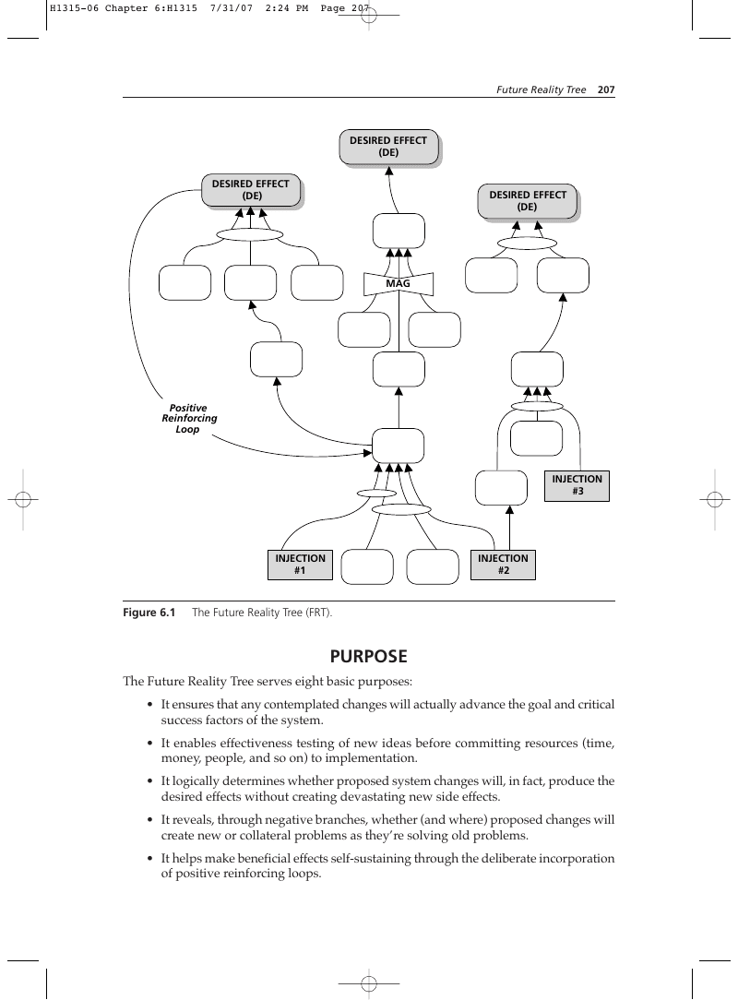

DESIRED EFFECT (DE) DESIRED EFFECT (DE)

DESIRED EFFECT (DE)

MAG

Positive Reinforcing

Loop

INJECTION #3

INJECTION #1

Figure 6.1

INJECTION #2

The Future Reality Tree (FRT). PURPOSE

The Future Reality Tree serves eight basic purposes:

- It ensures that any contemplated changes will actually advance the goal and critical success factors of the system.
- It enables effectiveness testing of new ideas before committing resources (time, money, people, and so on) to implementation.
- It logically determines whether proposed system changes will, in fact, produce the desired effects without creating devastating new side effects.
- It reveals, through negative branches, whether (and where) proposed changes will create new or collateral problems as they’re solving old problems.
- It helps make beneficial effects self-sustaining through the deliberate incorporation of positive reinforcing loops.

- It provides a way to assess the impacts of localized decisions on the entire system.
- It provides an effective tool for persuading decision makers to support a desired course of action.
- It serves as an initial planning tool for changing the course of the future.

### Assumptions

The effectiveness of the Future Reality Tree is based on the these assumptions:

- System components are interdependent. A change in one affects others.
- A definite progression of cause and effect governs the functioning of all systems.
- Change has both intended and unintended effects.
- Unintended effects of change can be anticipated.
- Unintended effects can be beneficial, neutral, or detrimental.
- Some changes can cause more problems than they solve.
- It is possible to determine, with reasonable confidence, what effects, both intended and unintended, a change will have on a system.
- Negative effects can be anticipated, located, and prevented.
- Cause-and-effect logic applies equally effectively to the future as it does to the present or past.
- Ideas can’t be considered solutions until they have been validated as effective and then implemented.
- All processes within a system, as well as the overall system itself, are subject to variation.
- The concept of cause and effect is regulated by the Categories of Legitimate Reservation (CLR) and is verifiable through the CLR.
- Unstated assumptions about reality underlie all cause-and-effect relationships.

### How to Use This Chapter

- Read “Description of the Future Reality Tree.” This section describes what a Future Reality Tree is and how it works.
- Read “How to Construct a Future Reality Tree” and the associated examples. This section explains in detail each of the steps in building a Future Reality Tree and why they’re necessary.
- Read “Scrutinizing a Future Reality Tree.” This section tells how to ensure that your Future Reality Tree is logically sound and that it accurately depicts “the way things will be” after you make a change.
- Review Figure 6.29, “Future Reality Tree Example: Fordyce Corporation.” This is a complete Future Reality Tree on a real-world start-up company. It illustrates how effective the Future Reality Tree is at mapping the route from proposed changes to the desired effects.

- Review Figure 6.27, “Procedures for Constructing a Future Reality Tree.” This is an abbreviated checklist that you can use to guide you in constructing your own Future Reality Tree. The checklist contains brief instructions and illustrations for each step. Detailed explanations for each step in the checklist are provided in the chapter itself, under “How to Construct a Future Reality Tree.” Repetition does not establish validity.

> —Souder’s Law

### Description of the Future Reality Tree

How many times have you heard the term “computer simulation model”? Simulation modeling is used extensively in complex, high-technology design processes. New airplane designs are exhaustively tested for stability, airworthiness, and flight-handling characteristics long before the first real airplane rolls down the runway. Why are simulation models so valuable? Aside from the cost of losing an expensive prototype in a crash (not to mention danger to the pilot), consider the risk of committing billions of dollars to an aircraft production program without knowing until too late whether it will do what it was intended to do. Is it conceivable that this same approach—the simulation model—can apply to other complex situations? That, in essence, is what the Future Reality Tree does. While it isn’t an interactive computer model, the FRT’s greatest potential value lies in its ability to simulate the future: to identify “bright ideas” that are, in reality, not very bright—that is, they won’t get the job done or, worse yet, they’ll create more problems than they solve.

#### A Real-World Example

> Consider the Immigration Reform Act of 1986. The U.S. Congress committed no small amount of time, energy, money, and agony trying to get this legislation passed—in spite of political gridlock and over the objections of special interests. The intent of the law was simple: to end illegal entry of aliens into the United States (see Figure 6.2). Did it succeed? Twenty years after its passage, the influx of illegal aliens is higher than ever. Clearly, the legislation failed at the job it was designed to do. Worse yet, it created at least one collateral problem that didn’t previously exist. The law’s requirement for employers to verify residency status before hiring spawned a cottage industry in forged documents of all kinds: drivers’ licenses, ID cards, Social Security cards, and— worst of all—birth certificates that are virtually indistinguishable from legitimate ones except by close professional examination. The net result of this forgery is a drain on Social Security, Medicaid, and other entitlement resources by people not legally authorized to have them. Surely the U.S. Congress did not anticipate or intend for this to happen. The chief cause of problems is solutions.
>
> —Sevareid’s Law

How much of this outcome might have been foreseen and precluded before the fact? By making good use of an FRT, virtually all of it. Before you invest time, energy, and money trying to make something happen, an effective FRT can give you a measure of assurance that your idea will work. If it reveals that your plan is flawed in some way, this knowledge affords you the opportunity to eliminate the flaws before you begin something that might be destined to fail.

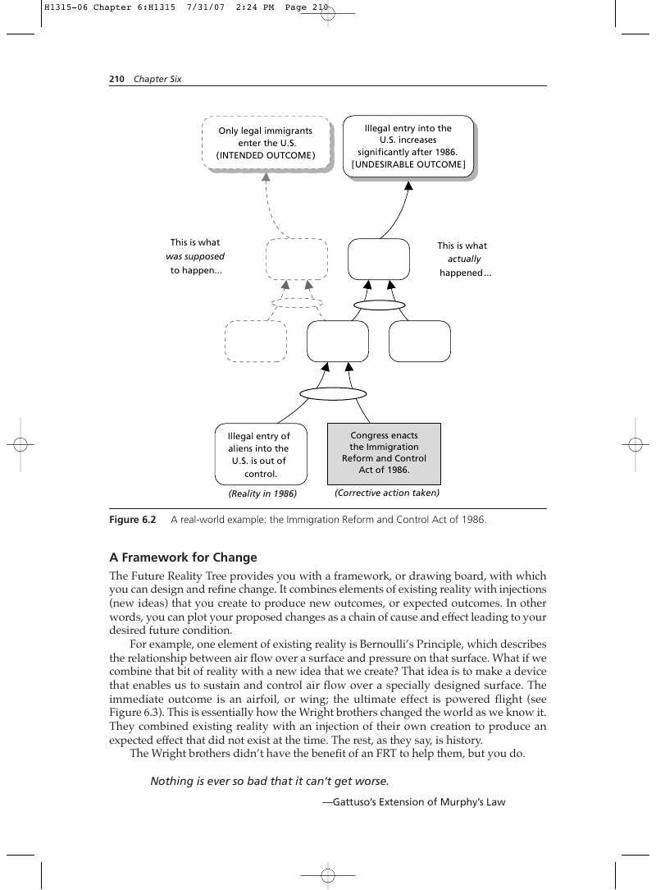

Only legal immigrants enter the U.S. (INTENDED OUTCOME )

Illegal entry into the U.S. increases significantly after 1986. [UNDESIRABLE OUTCOME]

This is what

Figure 6.2

was supposed

This is what actually

to happen...

happened ...

Illegal entry of aliens into the U.S. is out of control.

Congress enacts the Immigration Reform and Control

Act of 1986.

(Reality in 1986)

(Corrective action taken)

A real-world example: the Immigration Reform and Control Act of 1986.

#### A Framework for Change

> The Future Reality Tree provides you with a framework, or drawing board, with which you can design and refine change. It combines elements of existing reality with injections (new ideas) that you create to produce new outcomes, or expected outcomes. In other words, you can plot your proposed changes as a chain of cause and effect leading to your desired future condition. For example, one element of existing reality is Bernoulli’s Principle, which describes the relationship between air flow over a surface and pressure on that surface. What if we combine that bit of reality with a new idea that we create? That idea is to make a device that enables us to sustain and control air flow over a specially designed surface. The immediate outcome is an airfoil, or wing; the ultimate effect is powered flight (see Figure 6.3). This is essentially how the Wright brothers changed the world as we know it. They combined existing reality with an injection of their own creation to produce an expected effect that did not exist at the time. The rest, as they say, is history. The Wright brothers didn’t have the benefit of an FRT to help them, but you do. Nothing is ever so bad that it can’t get worse.
>
> —Gattuso’s Extension of Murphy’s Law

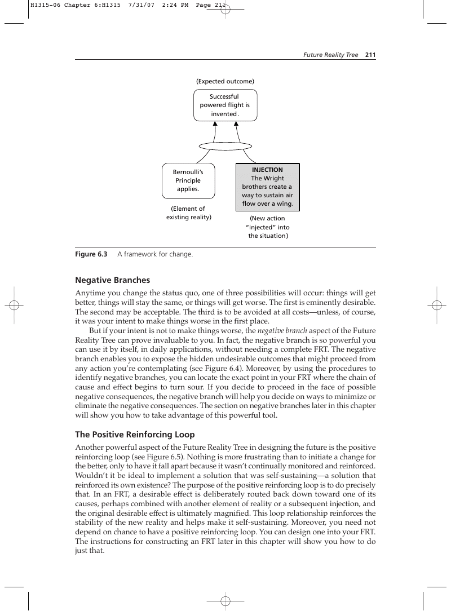

(Expected outcome) Successful

powered flight is invented . Bernoulli’s Principle

applies. (Element of

existing reality)

Figure 6.3

INJECTION The Wright

brothers create a way to sustain air flow over a wing. (New action “injected” into the situation )

A framework for change.

#### Negative Branches

Anytime you change the status quo, one of three possibilities will occur: things will get better, things will stay the same, or things will get worse. The first is eminently desirable. The second may be acceptable. The third is to be avoided at all costs—unless, of course, it was your intent to make things worse in the first place. But if your intent is not to make things worse, the negative branch aspect of the Future Reality Tree can prove invaluable to you. In fact, the negative branch is so powerful you can use it by itself, in daily applications, without needing a complete FRT. The negative branch enables you to expose the hidden undesirable outcomes that might proceed from any action you’re contemplating (see Figure 6.4). Moreover, by using the procedures to identify negative branches, you can locate the exact point in your FRT where the chain of cause and effect begins to turn sour. If you decide to proceed in the face of possible negative consequences, the negative branch will help you decide on ways to minimize or eliminate the negative consequences. The section on negative branches later in this chapter will show you how to take advantage of this powerful tool.

#### The Positive Reinforcing Loop

Another powerful aspect of the Future Reality Tree in designing the future is the positive reinforcing loop (see Figure 6.5). Nothing is more frustrating than to initiate a change for the better, only to have it fall apart because it wasn’t continually monitored and reinforced. Wouldn’t it be ideal to implement a solution that was self-sustaining—a solution that reinforced its own existence? The purpose of the positive reinforcing loop is to do precisely that. In an FRT, a desirable effect is deliberately routed back down toward one of its causes, perhaps combined with another element of reality or a subsequent injection, and the original desirable effect is ultimately magnified. This loop relationship reinforces the stability of the new reality and helps make it self-sustaining. Moreover, you need not depend on chance to have a positive reinforcing loop. You can design one into your FRT. The instructions for constructing an FRT later in this chapter will show you how to do just that.

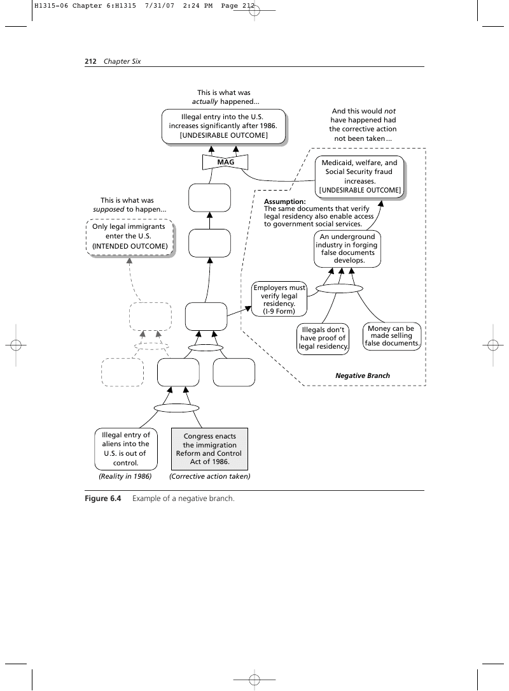

This is what was actually happened... And this would not have happened had the corrective action not been taken ...

Illegal entry into the U.S. increases significantly after 1986. [UNDESIRABLE OUTCOME]

MAG

This is what was supposed to happen...

Medicaid, welfare, and Social Security fraud increases. [UNDESIRABLE OUTCOME] Assumption: The same documents that verify legal residency also enable access to government social services.

Only legal immigrants enter the U.S. (INTENDED OUTCOME)

An underground industry in forging false documents develops.

Employers must verify legal residency. (I-9 Form) Illegals don’t have proof of legal residency.

Money can be made selling false documents.

Negative Branch

Illegal entry of aliens into the U.S. is out of control.

Congress enacts the immigration Reform and Control

Act of 1986.

(Reality in 1986)

(Corrective action taken)

Figure 6.4

Example of a negative branch.

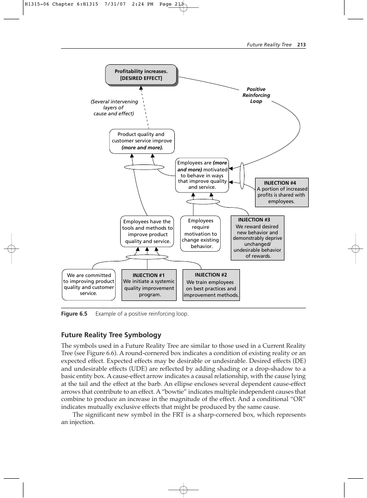

Profitability increases. [DESIRED EFFECT] Positive Reinforcing

Loop

(Several intervening layers of cause and effect)

Product quality and customer service improve (more and more). Employees are (more and more) motivated to behave in ways that improve quality and service.

We are committed to improving product quality and customer service.

Figure 6.5

INJECTION #4 A portion of increased profits is shared with employees.

INJECTION #3 We reward desired new behavior and demonstrably deprive unchanged/ undesirable behavior of rewards.

Employees have the tools and methods to improve product quality and service. Employees

require motivation to change existing behavior.

INJECTION #1 We initiate a systemic quality improvement program.

INJECTION #2 We train employees on best practices and improvement methods.

Example of a positive reinforcing loop.

#### Future Reality Tree Symbology

The symbols used in a Future Reality Tree are similar to those used in a Current Reality Tree (see Figure 6.6). A round-cornered box indicates a condition of existing reality or an expected effect. Expected effects may be desirable or undesirable. Desired effects (DE) and undesirable effects (UDE) are reflected by adding shading or a drop-shadow to a basic entity box. A cause-effect arrow indicates a causal relationship, with the cause lying at the tail and the effect at the barb. An ellipse encloses several dependent cause-effect arrows that contribute to an effect. A “bowtie” indicates multiple independent causes that combine to produce an increase in the magnitude of the effect. And a conditional “OR” indicates mutually exclusive effects that might be produced by the same cause. The significant new symbol in the FRT is a sharp-cornered box, which represents an injection.

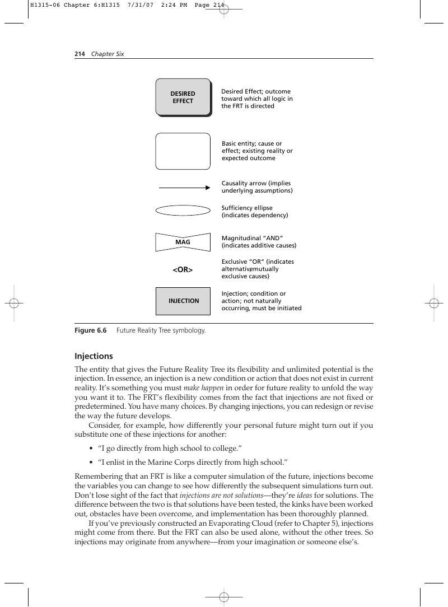

DESIRED EFFECT

Desired Effect; outcome toward which all logic in the FRT is directed

Basic entity; cause or effect; existing reality or expected outcome

Causality arrow (implies underlying assumptions) Sufficiency ellipse (indicates dependency)

Figure 6.6

MAG

Magnitudinal “AND” (indicates additive causes)

<OR>

Exclusive “OR” (indicates alternative , mutually exclusive causes)

INJECTION

Injection; condition or action; not naturally occurring, must be initiated

Future Reality Tree symbology.

#### Injections

The entity that gives the Future Reality Tree its flexibility and unlimited potential is the injection. In essence, an injection is a new condition or action that does not exist in current reality. It’s something you must make happen in order for future reality to unfold the way you want it to. The FRT’s flexibility comes from the fact that injections are not fixed or predetermined. You have many choices. By changing injections, you can redesign or revise the way the future develops. Consider, for example, how differently your personal future might turn out if you substitute one of these injections for another:

- “I go directly from high school to college.”
- “I enlist in the Marine Corps directly from high school.” Remembering that an FRT is like a computer simulation of the future, injections become the variables you can change to see how differently the subsequent simulations turn out. Don’t lose sight of the fact that injections are not solutions—they’re ideas for solutions. The difference between the two is that solutions have been tested, the kinks have been worked out, obstacles have been overcome, and implementation has been thoroughly planned. If you’ve previously constructed an Evaporating Cloud (refer to Chapter 5), injections might come from there. But the FRT can also be used alone, without the other trees. So injections may originate from anywhere—from your imagination or someone else’s.

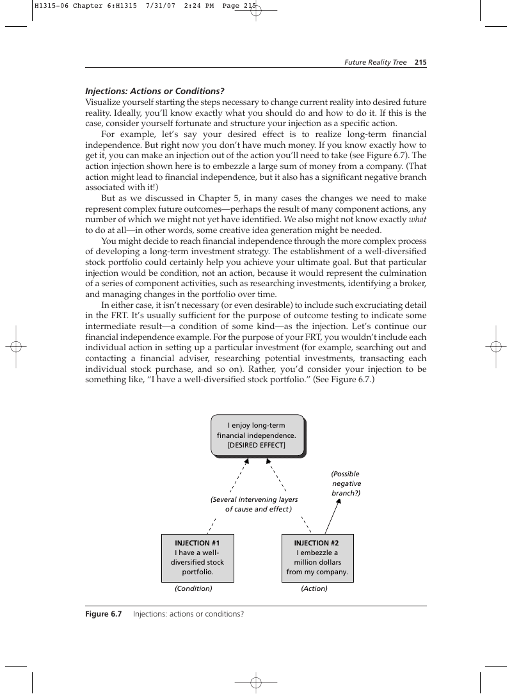

#### Injections: Actions or Conditions?

Visualize yourself starting the steps necessary to change current reality into desired future reality. Ideally, you’ll know exactly what you should do and how to do it. If this is the case, consider yourself fortunate and structure your injection as a specific action. For example, let’s say your desired effect is to realize long-term financial independence. But right now you don’t have much money. If you know exactly how to get it, you can make an injection out of the action you’ll need to take (see Figure 6.7). The action injection shown here is to embezzle a large sum of money from a company. (That action might lead to financial independence, but it also has a significant negative branch associated with it!) But as we discussed in Chapter 5, in many cases the changes we need to make represent complex future outcomes—perhaps the result of many component actions, any number of which we might not yet have identified. We also might not know exactly what to do at all—in other words, some creative idea generation might be needed. You might decide to reach financial independence through the more complex process of developing a long-term investment strategy. The establishment of a well-diversified stock portfolio could certainly help you achieve your ultimate goal. But that particular injection would be condition, not an action, because it would represent the culmination of a series of component activities, such as researching investments, identifying a broker, and managing changes in the portfolio over time. In either case, it isn’t necessary (or even desirable) to include such excruciating detail in the FRT. It’s usually sufficient for the purpose of outcome testing to indicate some intermediate result—a condition of some kind—as the injection. Let’s continue our financial independence example. For the purpose of your FRT, you wouldn’t include each individual action in setting up a particular investment (for example, searching out and contacting a financial adviser, researching potential investments, transacting each individual stock purchase, and so on). Rather, you’d consider your injection to be something like, “I have a well-diversified stock portfolio.” (See Figure 6.7.)

I enjoy long-term financial independence. [DESIRED EFFECT] (Possible

negative branch?)

(Several intervening layers of cause and effect )

Figure 6.7

INJECTION #1 I have a welldiversified stock portfolio.

INJECTION #2 I embezzle a million dollars from my company.

(Condition)

(Action)

Injections: actions or conditions?

At this point you may be thinking, “But how do I determine what all those individual steps might be, and in what sequence I should complete them?” The answer is that such details are the stuff of implementation (execution) planning. You certainly can’t ignore them, but it’s not productive to spend time on those details in the FRT, when your purpose in completing this tree is to determine whether that well-diversified stock portfolio will actually advance you toward your ultimately desired effect: financial independence. For that purpose, a condition injection—an intermediate outcome of several discrete steps— is sufficient. We’ll determine what those steps should be, and their appropriate sequence, in the Prerequisite Tree (Chapter 7). If your injections are actions, you can expect to have a substantial number of them. If you limit your injections to conditions (outcomes of component actions), you can expect to see considerably fewer of them. Each new condition or action you introduce into reality constitutes an injection. The Risk of Actions as Injections

There are two potential pitfalls associated with making your injections actions:

- By settling too quickly on a specific action, you may foreclose other possibilities that might turn out to be less expensive, easier to do, or more effective. For example, “Build a central warehouse” forecloses some less expensive options such as renting space. “Have a central warehouse” is a condition, rather than an action, which opens options other than construction. Remember that designing future reality is a creative exercise. Don’t constrain your creativity unnecessarily with preconceived solutions by zeroing in on any specific action too soon.
- By focusing too soon on a specific action, there’s a tendency to start worrying about implementation before the overall solution is completely and effectively tested for its ability to do the job without creating unacceptable adverse effects. Don’t forget the purpose of the Future Reality Tree: validation of a proposed course of action. If you jump too quickly to specific actions, you risk missing the FRT’s benefits.

#### Build Upward, from Injections to Desired Effects

You begin your FRT with a basic injection that comes either from a preceding Evaporating Cloud or from your imagination. This injection, combined with a fact of existing reality, leads to an immediate expected result that didn’t exist before. It may automatically produce several successive layers of effects. But invariably, causal momentum “dissipates” at some point. You’re likely to find that you’re further along than you were when you started, but not yet at your desired effect—and you’re at a standstill. You may not be able to advance further without some new injection, one that you hadn’t previously foreseen. This is okay—it’s one of the things an FRT is designed to tell you: what additional things must I do to make my original idea effective? The answer to this question will represent another injection which, combined with the last outcome, produces still another new result. This process continues until the desired effect is reached. You continue to add effects, new injections, and other statements about reality into your Future Reality Tree as required to maintain logical sufficiency and progress toward the desired effect. Each additional injection is like a course correction keeping you on track toward your ultimate outcome. How will you know when to add a new injection? The Categories of Legitimate Reservation will tell you. When you encounter a cause insufficiency in a Future Reality

Tree between one level and the next, you must add the not-yet-existing injection needed to complete the logical causality.

#### Example: Building a House

Let’s use the building of a house as an example to see how this works. Your earlier injections included purchasing a lot to build on and selecting an architect to create the plan. The condition of reality that you included near the bottom of the tree was the winning of a million dollars in the lottery. This reality and the two injections have brought you to the point of standing in the middle of an empty lot with a set of plans in your hand. You’re further along than when you started, but you’re not yet living in the home of your dreams. And you never will be, either, until and unless you execute some more injections, beginning with the hiring of a general contractor to do the construction. You then keep adding injections as needed until the ultimate effect produced is “I am living in the home of my dreams.” Remember that the Future Reality Tree is a broad simulation model of the future. As such, it’s not likely to contain a lot of detail. Though injections may be worded as desired future conditions, if you expect to implement your model of the future these “condition” injections must eventually be translated into outcomes of specific activities that will be developed in Prerequisite Trees (see Chapter 7).

#### Multiple Injections: The “Silver Bullet” Fallacy

In building a Future Reality Tree, your aim should be to make the simplest change to existing reality that will produce the future conditions you desire. Unfortunately, as we discussed in Chapter 5, because most situations in which you’d need an FRT are complex, it’s not likely that you’ll find a single “mother of all injections” that will do the job for you. Neat, one-shot solutions are rare in the real world. Let’s say, for example, that a major injection in your FRT is to change a broad policy. You may find that several discrete faulty parts of that policy must be addressed separately in order to ensure the elimination of different undesirable effects. Each of these policy changes might constitute a discrete injection. In summary, you’re likely to need several injections in order to realize most conditions of desired future reality. You may start with only one injection, but you’ll undoubtedly add others as you go along.

#### Where Injections Come From

The obvious question now presents itself: How do I determine what these various injections are? Where do they come from? They can come from a number of sources:

- The Current Reality Tree. If you’ve begun your analysis with a CRT, it can suggest possible injections. Look for critical root causes in the CRT. They may point to the injection(s) necessary to eliminate them. In any case, they’re likely to be entering arguments in the FRT because they’re conditions of existing reality. If they lead to an undesirable effect in the CRT, they are a starting point that can be combined with an injection in the FRT to favorably modify the future. Though the injection is intended to replace the root cause, in the FRT it’s more likely to be combined with it, as shown in Figure 6.8. Moreover, if the root cause also generates positive effects, you probably won’t want to replace it. Remember our discussion in Chapter 5 and Figure 5.10 about CRTs being negative branches of current reality? Now would be a good time to revisit that illustration.

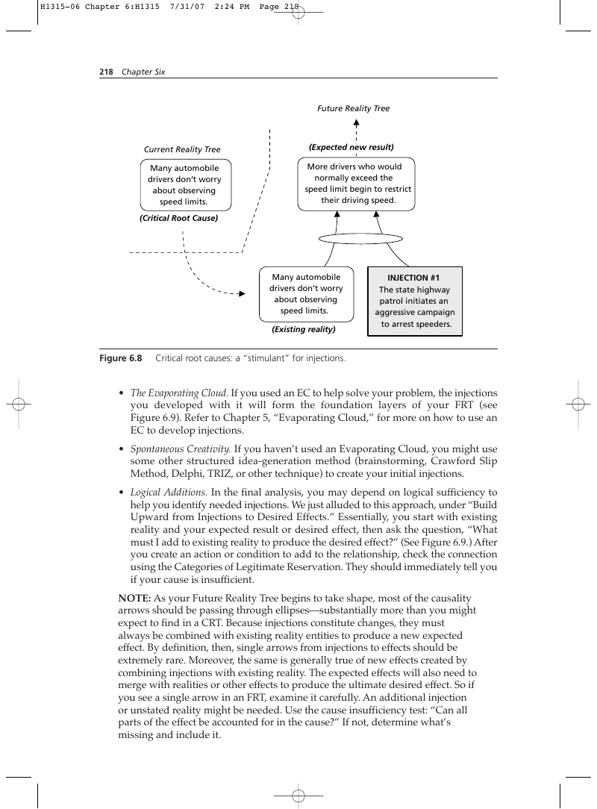

Future Reality Tree Current Reality Tree

(Expected new result)

Many automobile drivers don’t worry about observing speed limits.

More drivers who would normally exceed the speed limit begin to restrict their driving speed.

(Critical Root Cause)

Many automobile drivers don’t worry about observing speed limits. (Existing reality)

Figure 6.8

INJECTION #1 The state highway patrol initiates an aggressive campaign to arrest speeders.

Critical root causes: a “stimulant” for injections.

- The Evaporating Cloud. If you used an EC to help solve your problem, the injections you developed with it will form the foundation layers of your FRT (see Figure 6.9). Refer to Chapter 5, “Evaporating Cloud,” for more on how to use an EC to develop injections.
- Spontaneous Creativity. If you haven’t used an Evaporating Cloud, you might use some other structured idea-generation method (brainstorming, Crawford Slip Method, Delphi, TRIZ, or other technique) to create your initial injections.
- Logical Additions. In the final analysis, you may depend on logical sufficiency to help you identify needed injections. We just alluded to this approach, under “Build Upward from Injections to Desired Effects.” Essentially, you start with existing reality and your expected result or desired effect, then ask the question, “What must I add to existing reality to produce the desired effect?” (See Figure 6.9.) After you create an action or condition to add to the relationship, check the connection using the Categories of Legitimate Reservation. They should immediately tell you if your cause is insufficient.

**NOTE:** As your Future Reality Tree begins to take shape, most of the causality arrows should be passing through ellipses—substantially more than you might expect to find in a CRT. Because injections constitute changes, they must always be combined with existing reality entities to produce a new expected effect. By definition, then, single arrows from injections to effects should be extremely rare. Moreover, the same is generally true of new effects created by combining injections with existing reality. The expected effects will also need to merge with realities or other effects to produce the ultimate desired effect. So if you see a single arrow in an FRT, examine it carefully. An additional injection or unstated reality might be needed. Use the cause insufficiency test: “Can all parts of the effect be accounted for in the cause?” If not, determine what’s missing and include it.

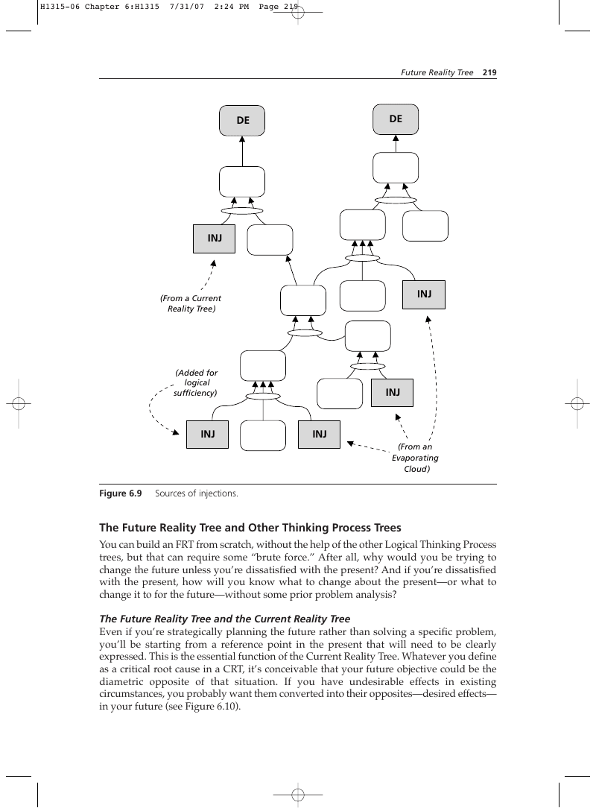

DE

DE

INJ

INJ (From a Current

Reality Tree) (Added for

logical sufficiency)

INJ

INJ

INJ (From an Evaporating

Cloud)

Figure 6.9

Sources of injections.

The Future Reality Tree and Other Thinking Process Trees You can build an FRT from scratch, without the help of the other Logical Thinking Process trees, but that can require some “brute force.” After all, why would you be trying to change the future unless you’re dissatisfied with the present? And if you’re dissatisfied with the present, how will you know what to change about the present—or what to change it to for the future—without some prior problem analysis? The Future Reality Tree and the Current Reality Tree Even if you’re strategically planning the future rather than solving a specific problem, you’ll be starting from a reference point in the present that will need to be clearly expressed. This is the essential function of the Current Reality Tree. Whatever you define as a critical root cause in a CRT, it’s conceivable that your future objective could be the diametric opposite of that situation. If you have undesirable effects in existing circumstances, you probably want them converted into their opposites—desired effects— in your future (see Figure 6.10).

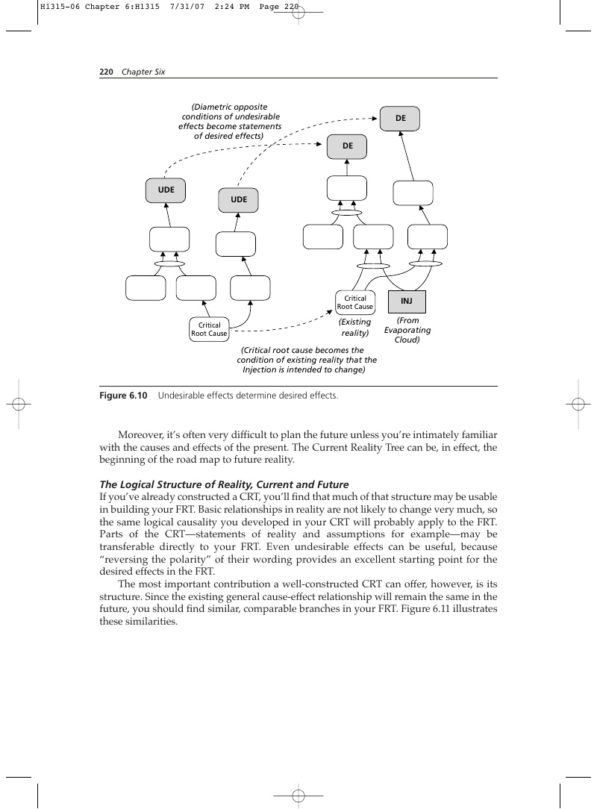

(Diametric opposite conditions of undesirable effects become statements of desired effects)

DE DE

UDE UDE Critical Root Cause Critical Root Cause

INJ (Existing

reality) (From Evaporating

Cloud)

(Critical root cause becomes the condition of existing reality that the Injection is intended to change)

Figure 6.10

Undesirable effects determine desired effects.

Moreover, it’s often very difficult to plan the future unless you’re intimately familiar with the causes and effects of the present. The Current Reality Tree can be, in effect, the beginning of the road map to future reality.

#### The Logical Structure of Reality, Current and Future

If you’ve already constructed a CRT, you’ll find that much of that structure may be usable in building your FRT. Basic relationships in reality are not likely to change very much, so the same logical causality you developed in your CRT will probably apply to the FRT. Parts of the CRT—statements of reality and assumptions for example—may be transferable directly to your FRT. Even undesirable effects can be useful, because “reversing the polarity” of their wording provides an excellent starting point for the desired effects in the FRT. The most important contribution a well-constructed CRT can offer, however, is its structure. Since the existing general cause-effect relationship will remain the same in the future, you should find similar, comparable branches in your FRT. Figure 6.11 illustrates these similarities.

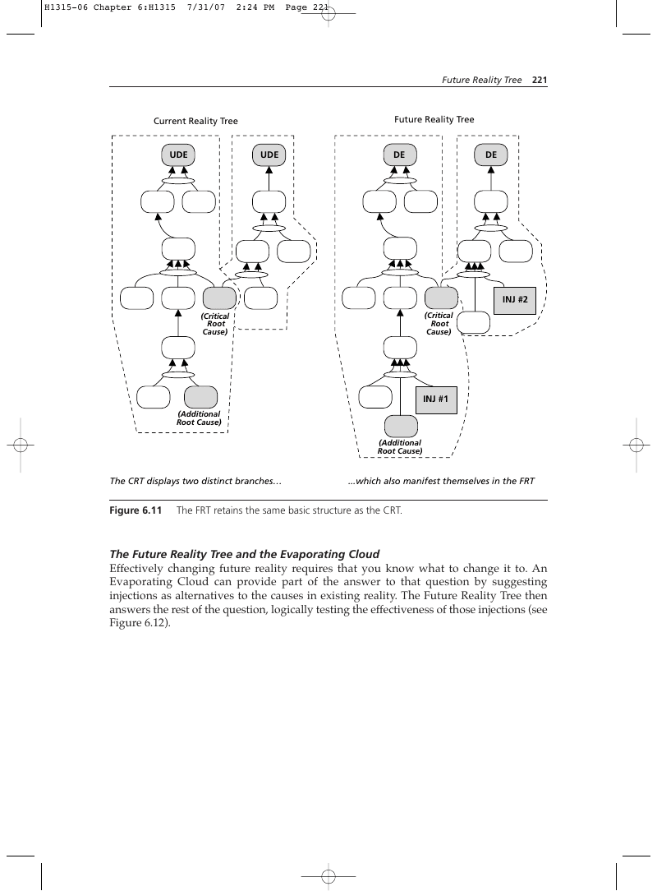

Future Reality Tree Current Reality Tree

UDE

UDE

DE

DE

INJ #2 (Critical Root

Cause) (Critical Root

Cause)

INJ #1 (Additional

Root Cause) (Additional

Root Cause)

The CRT displays two distinct branches…

Figure 6.11

...which also manifest themselves in the FRT

The FRT retains the same basic structure as the CRT.

#### The Future Reality Tree and the Evaporating Cloud

Effectively changing future reality requires that you know what to change it to. An Evaporating Cloud can provide part of the answer to that question by suggesting injections as alternatives to the causes in existing reality. The Future Reality Tree then answers the rest of the question, logically testing the effectiveness of those injections (see Figure 6.12).

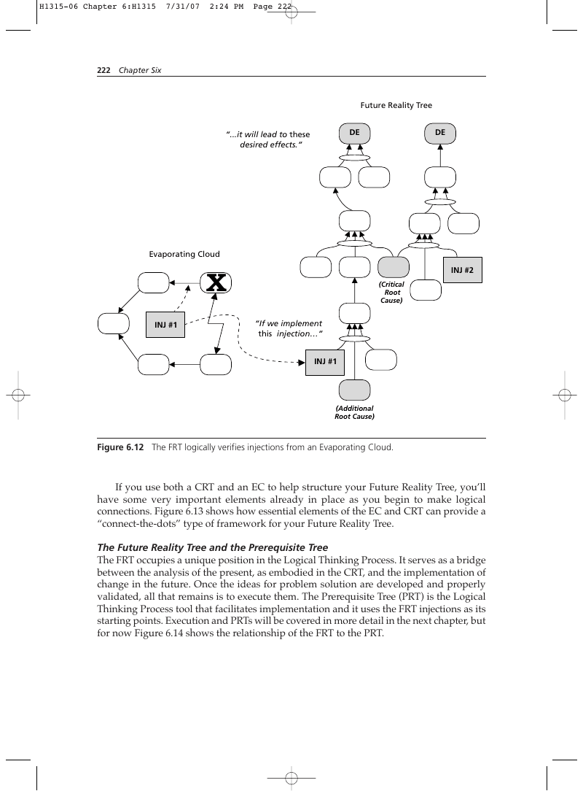

Future Reality Tree

DE

“...it will lead to these desired effects.”

DE Evaporating Cloud

INJ #2

X INJ #1 (Critical Root

Cause)

“If we implement this injection…” INJ #1 (Additional

Root Cause)

Figure 6.12 The FRT logically verifies injections from an Evaporating Cloud.

If you use both a CRT and an EC to help structure your Future Reality Tree, you’ll have some very important elements already in place as you begin to make logical connections. Figure 6.13 shows how essential elements of the EC and CRT can provide a “connect-the-dots” type of framework for your Future Reality Tree.

#### The Future Reality Tree and the Prerequisite Tree

The FRT occupies a unique position in the Logical Thinking Process. It serves as a bridge between the analysis of the present, as embodied in the CRT, and the implementation of change in the future. Once the ideas for problem solution are developed and properly validated, all that remains is to execute them. The Prerequisite Tree (PRT) is the Logical Thinking Process tool that facilitates implementation and it uses the FRT injections as its starting points. Execution and PRTs will be covered in more detail in the next chapter, but for now Figure 6.14 shows the relationship of the FRT to the PRT.

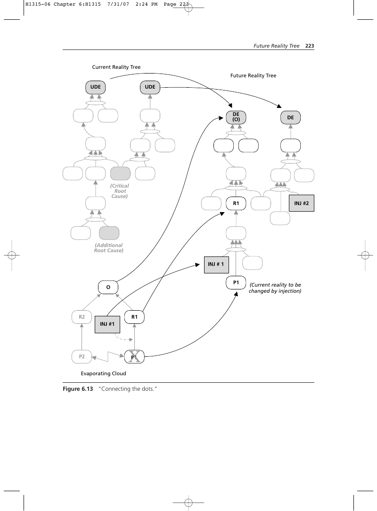

Current Reality Tree Future Reality Tree

UDE

UDE

DE (O)

DE (Critical Root

Cause) R1

INJ #2 (Additional

Root Cause) INJ # 1

P1

O

R2

R1 INJ #1

P2

X P1 Evaporating Cloud

Figure 6.13 “Connecting the dots.”

(Current reality to be changed by injection)

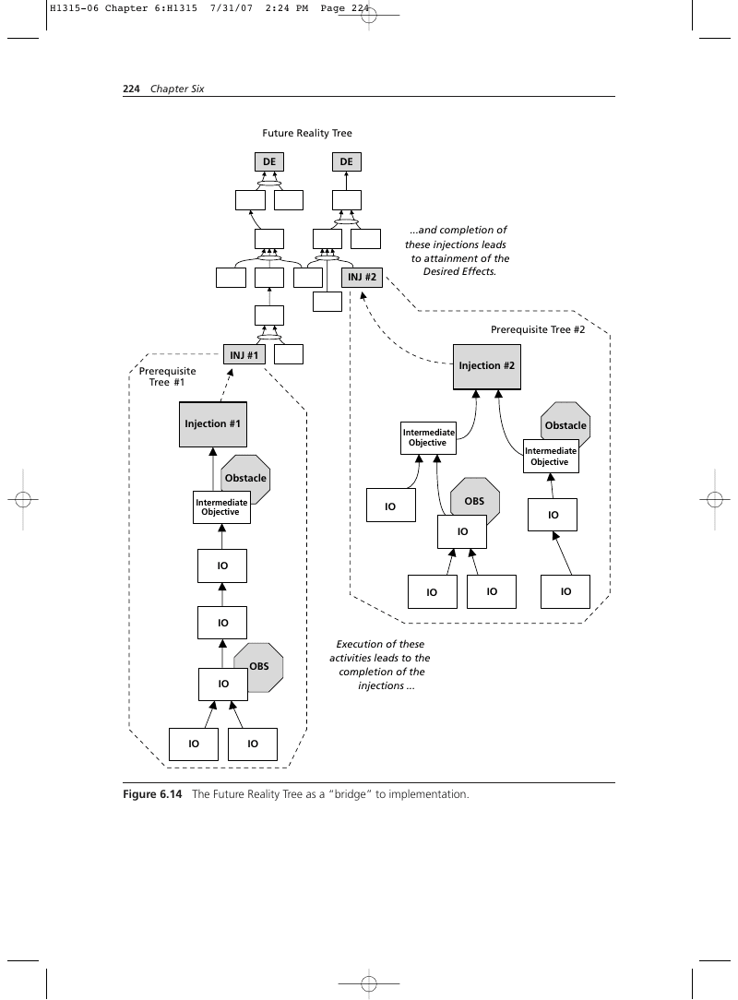

Future Reality Tree

DE

DE

...and completion of these injections leads to attainment of the Desired Effects.

INJ #2

Prerequisite Tree #2 INJ #1 Injection #2 Prerequisite

Tree #1

Injection #1 Obstacle Intermediate Objective Intermediate Objective Obstacle Intermediate Objective OBS

IO

IO IO

IO IO IO OBS

IO

IO

Execution of these activities leads to the completion of the injections ...

IO

Figure 6.14 The Future Reality Tree as a “bridge” to implementation.

IO

IO

> The Future Reality Tree as a “Safety Net” One of the strengths of the Future Reality Tree is its ability to act as a safety net for the Current Reality Tree and the Evaporating Cloud. What this means is that you don’t have to have a perfect CRT or EC to have an effective FRT. If you don’t precisely identify the critical root cause in the Current Reality Tree, it’s not critical—you only need the CRT to get you into the area of the critical root cause. If you don’t identify all the assumptions that need to be broken in the EC, don’t worry. As long as you have a major invalid assumption to attack, you have enough to get started. The sufficiency characteristic of the FRT will catch any omissions from the EC or the CRT through negative branches. Goldratt once observed, “It’s better to be approximately correct than precisely incorrect.” That observation is still valid today. So don’t agonize over unnecessary precision in the CRT or EC. The FRT is where you must be precise. If you’re thorough and conscientious with your logic in the FRT, you’ll catch any deficiencies overlooked with the other two tools. In our haste to deal with the things that are wrong, let us not upset the things that are right.
>
> —Unknown

#### Negative Branches

The negative branch is one of the most powerful features of the Future Reality Tree. It can save planners and problem solvers much heartache and aggravation during implementation. The negative branch is a kind of predicted effect existence reservation. (Refer to Chapter 2, “Categories of Legitimate Reservation,” for more on the predicted effect existence reservation.) But instead of using them to prove the existence of an intangible cause, we use predicted effects to expose any possible undesirable outcomes associated with an injection we’re thinking of using. For example, let’s say that your injection is “I lend you my car.” The outcome I desire is “You drive my children to school.” (See Figure 6.15.) My desired outcome is probably entirely reasonable, but some other conditions of reality might be considered (for example, “You’ve had four accidents in the last six months”). In a situation like this, the following negative branch then becomes a real possibility: “You wreck my car.” Using the Negative Branch as a “Stand-Alone” The preceding example also illustrates a feature of negative branches that makes them extremely useful in daily application: You don’t need any of the other Thinking Process trees to make good use of negative branches, not even a Future Reality Tree. If you’re called upon to render a decision that seems questionable, ask for some time to consider the issue: “Let me think about that for a few minutes.” Then see if you can construct a quick negative branch. If you decide there are no realistic negative consequences, you’ll be more confident about your decision. If there are undesirable outcomes, the negative branch may help you do one of two things:

- Decline the request tactfully, without incurring animosity
- Find an alternative means (injection) of satisfying the original intent without incurring the risk of an undesirable outcome

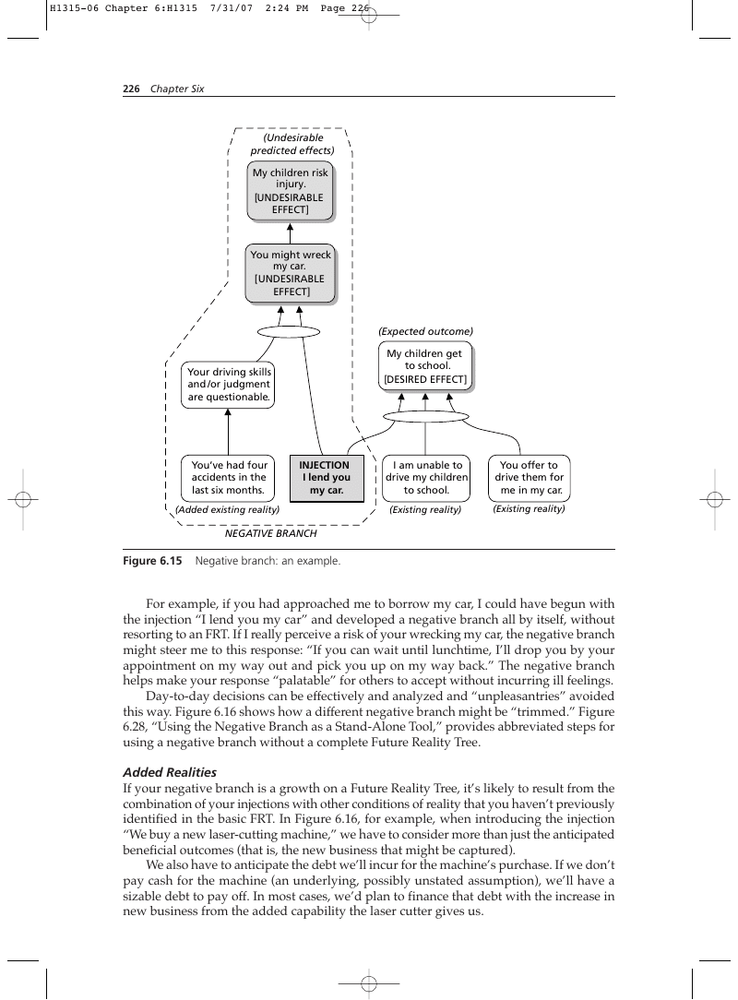

(Undesirable

predicted effects) My children risk injury. [UNDESIRABLE EFFECT]

You might wreck my car. [UNDESIRABLE EFFECT]

(Expected outcome) My children get to school. [DESIRED EFFECT]

Your driving skills and /or judgment are questionable.

You’ve had four accidents in the last six months.

INJECTION I lend you my car.

(Added existing reality)

I am unable to drive my children to school.

You offer to drive them for me in my car.

(Existing reality)

(Existing reality)

NEGATIVE BRANCH

Figure 6.15

Negative branch: an example.

For example, if you had approached me to borrow my car, I could have begun with the injection “I lend you my car” and developed a negative branch all by itself, without resorting to an FRT. If I really perceive a risk of your wrecking my car, the negative branch might steer me to this response: “If you can wait until lunchtime, I’ll drop you by your appointment on my way out and pick you up on my way back.” The negative branch helps make your response “palatable” for others to accept without incurring ill feelings. Day-to-day decisions can be effectively and analyzed and “unpleasantries” avoided this way. Figure 6.16 shows how a different negative branch might be “trimmed.” Figure 6.28, “Using the Negative Branch as a Stand-Alone Tool,” provides abbreviated steps for using a negative branch without a complete Future Reality Tree.

#### Added Realities

If your negative branch is a growth on a Future Reality Tree, it’s likely to result from the combination of your injections with other conditions of reality that you haven’t previously identified in the basic FRT. In Figure 6.16, for example, when introducing the injection “We buy a new laser-cutting machine,” we have to consider more than just the anticipated beneficial outcomes (that is, the new business that might be captured). We also have to anticipate the debt we’ll incur for the machine’s purchase. If we don’t pay cash for the machine (an underlying, possibly unstated assumption), we’ll have a sizable debt to pay off. In most cases, we’d plan to finance that debt with the increase in new business from the added capability the laser cutter gives us.

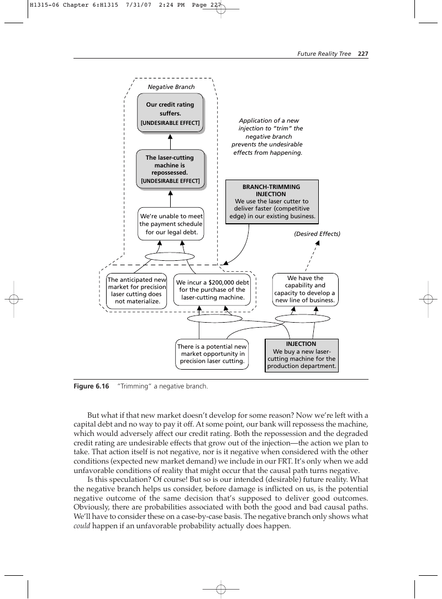

Negative Branch Our credit rating suffers. [UNDESIRABLE EFFECT]

The laser-cutting machine is repossessed. [UNDESIRABLE EFFECT]

We’re unable to meet the payment schedule for our legal debt.

The anticipated new market for precision laser cutting does not materialize.

Figure 6.16

Application of a new injection to “trim” the negative branch prevents the undesirable effects from happening.

BRANCH-TRIMMING INJECTION We use the laser cutter to deliver faster (competitive edge) in our existing business. (Desired Effects)

We incur a $200,000 debt for the purchase of the laser-cutting machine.

We have the capability and capacity to develop a new line of business.

There is a potential new market opportunity in precision laser cutting.

INJECTION We buy a new lasercutting machine for the production department.

“Trimming” a negative branch.

But what if that new market doesn’t develop for some reason? Now we’re left with a capital debt and no way to pay it off. At some point, our bank will repossess the machine, which would adversely affect our credit rating. Both the repossession and the degraded credit rating are undesirable effects that grow out of the injection—the action we plan to take. That action itself is not negative, nor is it negative when considered with the other conditions (expected new market demand) we include in our FRT. It’s only when we add unfavorable conditions of reality that might occur that the causal path turns negative. Is this speculation? Of course! But so is our intended (desirable) future reality. What the negative branch helps us consider, before damage is inflicted on us, is the potential negative outcome of the same decision that’s supposed to deliver good outcomes. Obviously, there are probabilities associated with both the good and bad causal paths. We’ll have to consider these on a case-by-case basis. The negative branch only shows what could happen if an unfavorable probability actually does happen.

#### Assumptions

Remember that, as with Current Reality Trees and Evaporating Clouds, the arrows in a negative branch also imply the presence of underlying assumptions. In fact, we just mentioned one in the Figure 6.16 example. The ones that are particularly important in a negative branch are those associated with the arrows connecting neutral entities or injections to the negative entity. It is at this point that the Negative Branch begins to turn “sour” and trimming must be done. You should identify as many assumptions as possible underlying these crucial arrows, and develop new injections to negate or neutralize them, much as you would do with an Evaporating Cloud. In fact, you can use an EC to help you create injections to trim negative branches.

#### “Trimming” Negative Branches

Once you have the added realities and the additional injections needed to break the assumptions that turn the branch negative, you’re on the verge of trimming the negative branch. You incorporate the added reality and the new injection— or injections, if more than one is required— into your Future Reality Tree at the point where the branch had begun to turn from positive or neutral to negative. Then recheck the logic of the entire tree downstream from (that is, above) the trim point. Make any subsequent adjustments to meet CLR requirements, not just at the trim point (see Figure 6.17).

#### When to Raise Negative Branch Reservations

> In many situations as you’re building a Future Reality Tree, you’ll notice places where it’s highly probable that a negative branch might develop. These places may be obvious. As the builder of the tree, if you see such indications, mark them in some prominent way and continue building your FRT. Don’t become side-tracked trying to deal with them before the FRT is completed. Always make your basic FRT as logically tight as you can during construction, then go back afterward to address any potential negative branches you might have identified. As you work, remember that the tree builder’s inherent “blindness” to logical deficiencies may cause you to overlook negative branches. It might require someone else’s independent scrutiny of your tree to point them out. If you present your tree to others for scrutiny, ask them to make note of any negative branch they might see but to wait to tell you about it until after the entire tree has been presented. Figure 6.28, “How to Trim a Negative Branch,” provides detailed directions for constructing and trimming negative branches. The time it takes to rectify a situation is inversely proportional to the time it took to do the damage. EXAMPLE: It takes longer to glue a vase together than to break one.
>
> —Drazen’s Law of Restitution

#### Positive Reinforcing Loops

In building a Future Reality Tree, you’ll occasionally notice situations where a desired effect might feed back and amplify another entity lower in the tree. That lower entity may originally be neutral or positive, but the outcome of the desired effect higher up is to reinforce or increase the magnitude of the entity below (see Figure 6.5).

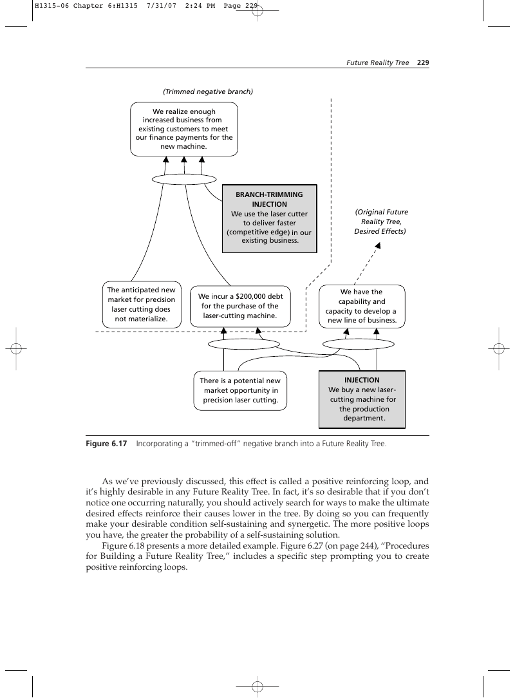

(Trimmed negative branch) We realize enough increased business from existing customers to meet our finance payments for the new machine.

BRANCH-TRIMMING INJECTION We use the laser cutter to deliver faster ( competitive edge ) in our existing business.

The anticipated new market for precision laser cutting does not materialize.

We incur a $200,000 debt for the purchase of the laser-cutting machine.

There is a potential new market opportunity in precision laser cutting.

Figure 6.17 (Original Future

Reality Tree, Desired Effects)

We have the capability and capacity to develop a new line of business.

INJECTION We buy a new lasercutting machine for the production department.

Incorporating a “trimmed-off” negative branch into a Future Reality Tree.

As we’ve previously discussed, this effect is called a positive reinforcing loop, and it’s highly desirable in any Future Reality Tree. In fact, it’s so desirable that if you don’t notice one occurring naturally, you should actively search for ways to make the ultimate desired effects reinforce their causes lower in the tree. By doing so you can frequently make your desirable condition self-sustaining and synergetic. The more positive loops you have, the greater the probability of a self-sustaining solution. Figure 6.18 presents a more detailed example. Figure 6.27 (on page 244), “Procedures for Building a Future Reality Tree,” includes a specific step prompting you to create positive reinforcing loops.

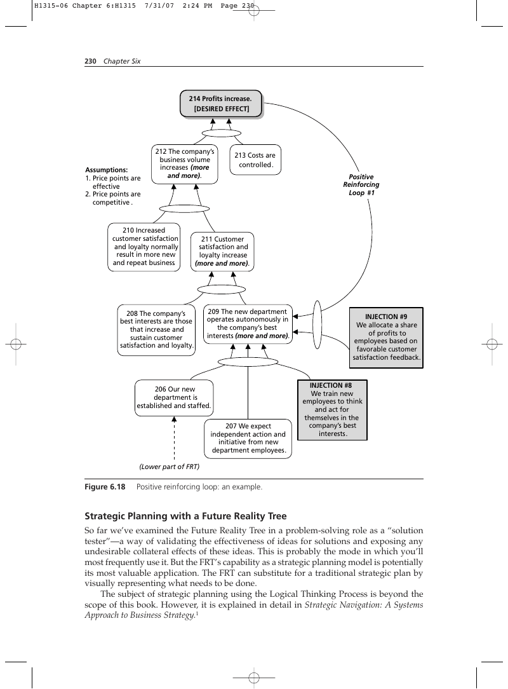

214 Profits increase. [DESIRED EFFECT]

Assumptions:

1. Price points are effective.
2. Price points are competitive .

212 The company’s business volume increases (more and more).

210 Increased customer satisfaction and loyalty normally result in more new and repeat business.

213 Costs are controlled. Positive Reinforcing

Loop #1

211 Customer satisfaction and loyalty increase (more and more).

208 The company’s best interests are those that increase and sustain customer satisfaction and loyalty.

209 The new department operates autonomously in the company’s best interests (more and more).

206 Our new department is established and staffed. 207 We expect independent action and initiative from new department employees.

INJECTION #9 We allocate a share of profits to employees based on favorable customer satisfaction feedback.

INJECTION #8 We train new employees to think and act for themselves in the company’s best interests.

(Lower part of FRT)

Figure 6.18

Positive reinforcing loop: an example.

#### Strategic Planning with a Future Reality Tree

So far we’ve examined the Future Reality Tree in a problem-solving role as a “solution tester”—a way of validating the effectiveness of ideas for solutions and exposing any undesirable collateral effects of these ideas. This is probably the mode in which you’ll most frequently use it. But the FRT’s capability as a strategic planning model is potentially its most valuable application. The FRT can substitute for a traditional strategic plan by visually representing what needs to be done. The subject of strategic planning using the Logical Thinking Process is beyond the scope of this book. However, it is explained in detail in Strategic Navigation: A Systems Approach to Business Strategy.1

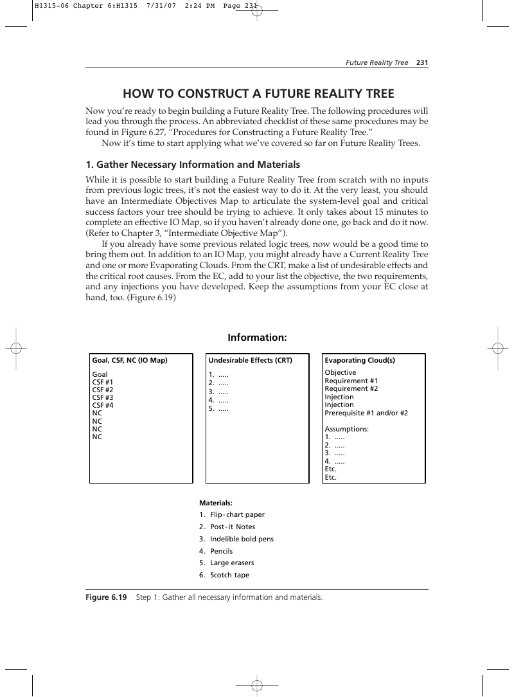

### How to Construct a Future Reality Tree

Now you’re ready to begin building a Future Reality Tree. The following procedures will lead you through the process. An abbreviated checklist of these same procedures may be found in Figure 6.27, “Procedures for Constructing a Future Reality Tree.” Now it’s time to start applying what we’ve covered so far on Future Reality Trees.

1. Gather Necessary Information and Materials While it is possible to start building a Future Reality Tree from scratch with no inputs from previous logic trees, it’s not the easiest way to do it. At the very least, you should have an Intermediate Objectives Map to articulate the system-level goal and critical success factors your tree should be trying to achieve. It only takes about 15 minutes to complete an effective IO Map, so if you haven’t already done one, go back and do it now. (Refer to Chapter 3, “Intermediate Objective Map”). If you already have some previous related logic trees, now would be a good time to bring them out. In addition to an IO Map, you might already have a Current Reality Tree and one or more Evaporating Clouds. From the CRT, make a list of undesirable effects and the critical root causes. From the EC, add to your list the objective, the two requirements, and any injections you have developed. Keep the assumptions from your EC close at hand, too. (Figure 6.19)

Information: Goal, CSF, NC (IO Map)

Undesirable Effects (CRT)

Evaporating Cloud(s) Goal

CSF #1 CSF #2 CSF #3 CSF #4 NC NC NC NC

1. .....
2. .....
3. .....
4. .....
5. .....

Objective

Requirement #1 Requirement #2 Injection Injection Prerequisite #1 and/or #2 Assumptions:

1. .....
2. .....
3. .....
4. ..... Etc. Etc.

Materials: 1 . Flip - chart paper 2 . Post - it Notes 3 . Indelible bold pens 4 . Pencils 5 . Large erasers 6 . Scotch tape

Figure 6.19

Step 1: Gather all necessary information and materials.

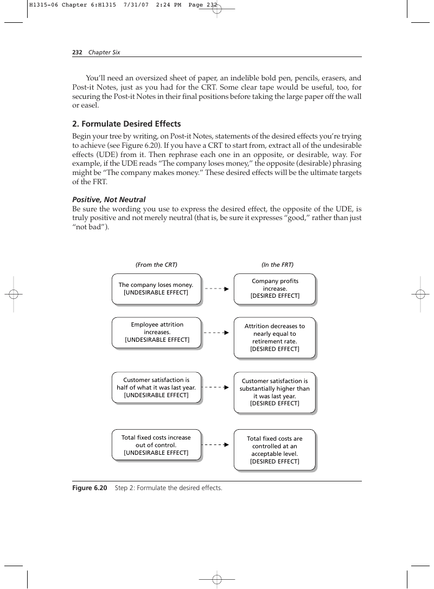

You’ll need an oversized sheet of paper, an indelible bold pen, pencils, erasers, and Post-it Notes, just as you had for the CRT. Some clear tape would be useful, too, for securing the Post-it Notes in their final positions before taking the large paper off the wall or easel.

#### 2. Formulate Desired Effects

Begin your tree by writing, on Post-it Notes, statements of the desired effects you’re trying to achieve (see Figure 6.20). If you have a CRT to start from, extract all of the undesirable effects (UDE) from it. Then rephrase each one in an opposite, or desirable, way. For example, if the UDE reads “The company loses money,” the opposite (desirable) phrasing might be “The company makes money.” These desired effects will be the ultimate targets of the FRT.

#### Positive, Not Neutral

Be sure the wording you use to express the desired effect, the opposite of the UDE, is truly positive and not merely neutral (that is, be sure it expresses “good,” rather than just “not bad”).

Figure 6.20

(From the CRT)

(In the FRT)

The company loses money. [UNDESIRABLE EFFECT]

Company profits increase. [DESIRED EFFECT]

Employee attrition increases. [UNDESIRABLE EFFECT]

Attrition decreases to nearly equal to retirement rate. [DESIRED EFFECT]

Customer satisfaction is half of what it was last year. [UNDESIRABLE EFFECT]

Customer satisfaction is substantially higher than it was last year. [DESIRED EFFECT]

Total fixed costs increase out of control. [UNDESIRABLE EFFECT]

Total fixed costs are controlled at an acceptable level. [DESIRED EFFECT]

Step 2: Formulate the desired effects.

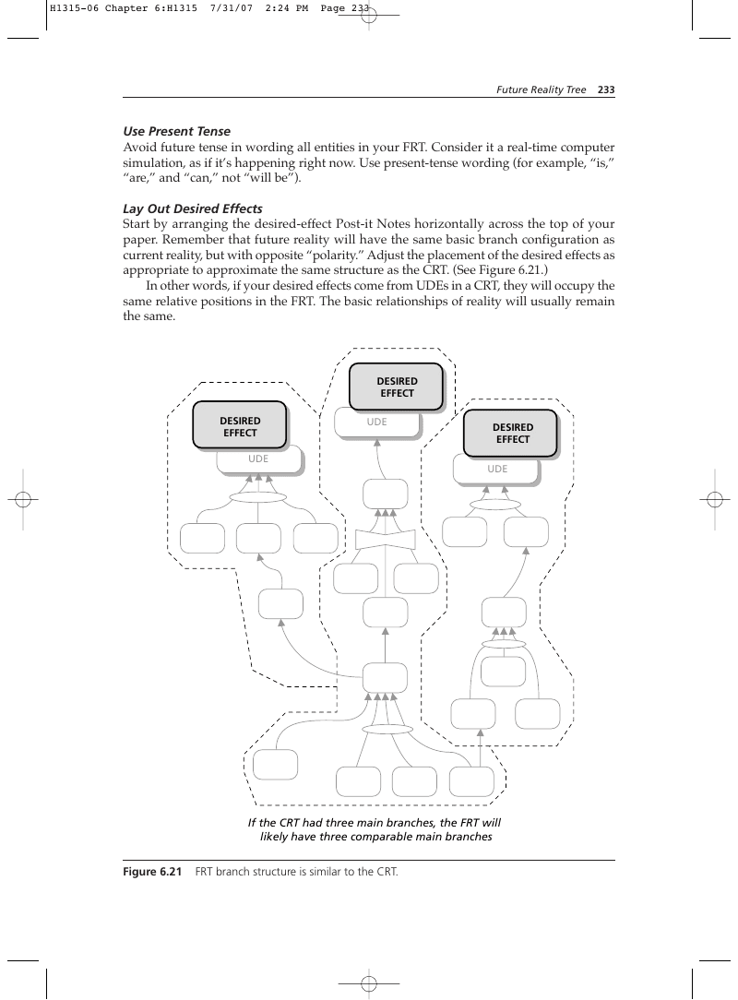

#### Use Present Tense

Avoid future tense in wording all entities in your FRT. Consider it a real-time computer simulation, as if it’s happening right now. Use present-tense wording (for example, “is,” “are,” and “can,” not “will be”).

#### Lay Out Desired Effects

Start by arranging the desired-effect Post-it Notes horizontally across the top of your paper. Remember that future reality will have the same basic branch configuration as current reality, but with opposite “polarity.” Adjust the placement of the desired effects as appropriate to approximate the same structure as the CRT. (See Figure 6.21.) In other words, if your desired effects come from UDEs in a CRT, they will occupy the same relative positions in the FRT. The basic relationships of reality will usually remain the same. DESIRED EFFECT DESIRED EFFECT

UDE DESIRED EFFECT

UDE UDE

If the CRT had three main branches, the FRT will likely have three comparable main branches

Figure 6.21

FRT branch structure is similar to the CRT.

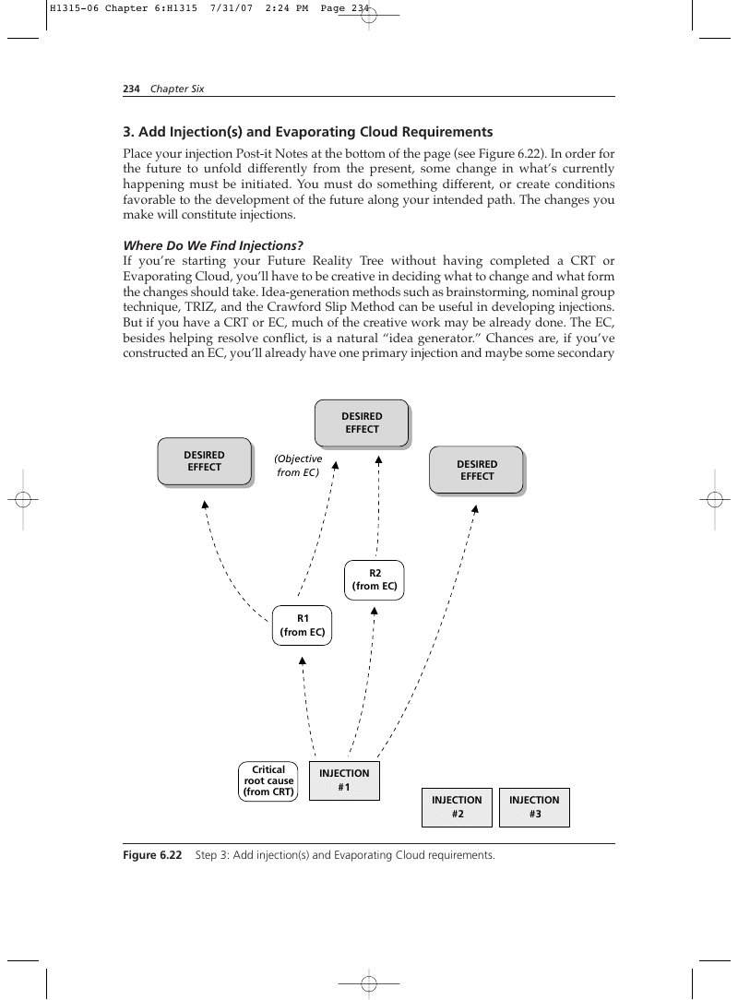

#### 3. Add Injection(s) and Evaporating Cloud Requirements

Place your injection Post-it Notes at the bottom of the page (see Figure 6.22). In order for the future to unfold differently from the present, some change in what’s currently happening must be initiated. You must do something different, or create conditions favorable to the development of the future along your intended path. The changes you make will constitute injections.

#### Where Do We Find Injections?

If you’re starting your Future Reality Tree without having completed a CRT or Evaporating Cloud, you’ll have to be creative in deciding what to change and what form the changes should take. Idea-generation methods such as brainstorming, nominal group technique, TRIZ, and the Crawford Slip Method can be useful in developing injections. But if you have a CRT or EC, much of the creative work may be already done. The EC, besides helping resolve conflict, is a natural “idea generator.” Chances are, if you’ve constructed an EC, you’ll already have one primary injection and maybe some secondary DESIRED EFFECT DESIRED EFFECT (Objective ones. Write your injections on Post-it Notes. Distinguish them from other entities by using different colored notes or by outlining the edges.

from EC) DESIRED EFFECT

R2 (from EC) R1 (from EC) Critical

root cause (from CRT)

Figure 6.22

INJECTION #1 INJECTION #2

Step 3: Add injection(s) and Evaporating Cloud requirements.

INJECTION #3

#### Injections at the Bottom

Put your primary injection at the bottom of the paper, in the center. If you have additional injections you expect to use, arrange them temporarily in a horizontal “holding pattern” to one side along the bottom edge of the paper (see Figure 6.22).

**NOTE:** If you already have a CRT or EC relating to your problem, you can add a few more elements. Some might be the statements of critical root causes. Two others might be the requirements from the EC (that is, R1 and R2). The latter would show up as effects of the primary injection (probably several layers of cause and effect above the injection itself). The objective of the EC is likely to show up in the FRT as a desired effect.

#### 4. Fill in the Gaps

You now have a framework in which to build your Future Reality Tree.

#### Build Upward

Starting with your primary injection at the bottom, build upward toward the desired effects. Combine your injection with an entity of current reality—a critical root cause from your CRT, for example. Use an ellipse to combine multiple causes into an expected effect (one that does not yet exist). For example, let’s assume that your current reality is “Our order-to-delivery times are longer than our competitors’ times.” That might prompt the question, “So what?” An additional statement about existing reality that provides motivation might be added: “New and existing customers are attracted to short delivery times.” Your injection might be “We optimize production for fast delivery.” The expected effect of these three entities might be “New and existing customers are attracted to our faster delivery times.” With each layer of cause and effect we must adhere to the requirements of the Categories of Legitimate Reservation, with special attention to cause insufficiency (see Figure 6.23). The direct and unavoidable effect of the conditions of reality, combined with the injection, should produce an effect that is a step closer to one of the intermediate “milestones”—a requirement from the Evaporating Cloud, for example.

#### Continue Building from the Expected Effect

Each successive layer of effects should move you progressively closer to your desired effects. Check to be sure this is happening. The expected effect may be enough to propel the causality through more than one subsequent layer. But if it’s not, “causal inertia” may die unless you help the process along with another injection (see Figure 6.24). In the previous example, optimizing production for faster delivery resulted in orderto-delivery times that would probably be attractive to customers. But that attractiveness alone doesn’t translate directly to the desired effect: increased profitability. No further progress is possible without taking some additional action—that is, adding another injection. In this case, the additional injection, ensuring that prospective customers know about the improved capability, moves the cause-and-effect process another level closer to securing more business and ultimately to improved profitability.

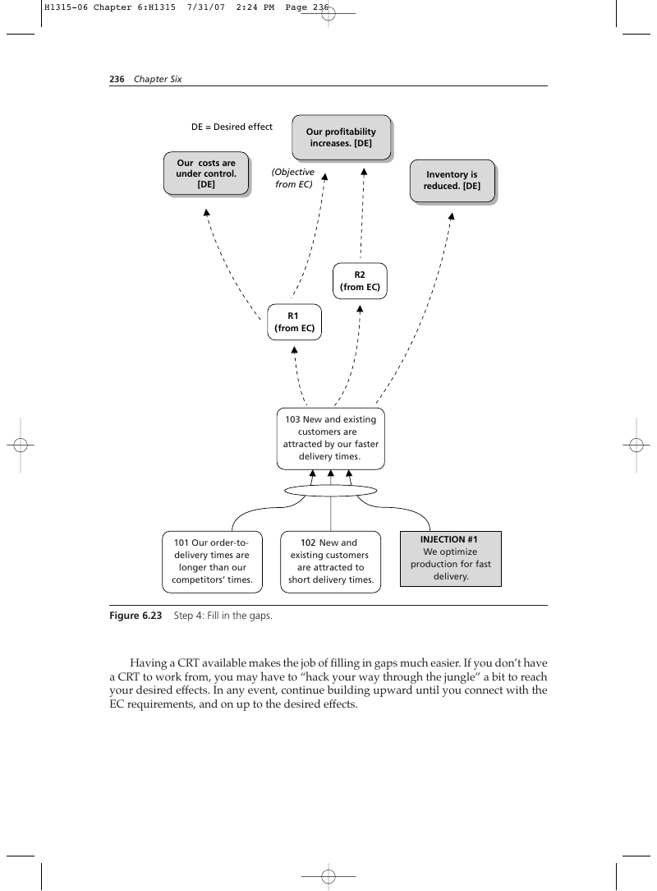

DE = Desired effect

Our costs are under control. [DE]

Our profitability increases. [DE] (Objective

from EC) Inventory is

reduced. [DE]

R2 (from EC) R1 (from EC)

103 New and existing customers are attracted by our faster delivery times.

101 Our order-todelivery times are longer than our competitors’ times.

Figure 6.23

102 New and existing customers are attracted to short delivery times.

INJECTION #1 We optimize production for fast delivery.

Step 4: Fill in the gaps.

Having a CRT available makes the job of filling in gaps much easier. If you don’t have a CRT to work from, you may have to “hack your way through the jungle” a bit to reach your desired effects. In any event, continue building upward until you connect with the EC requirements, and on up to the desired effects.

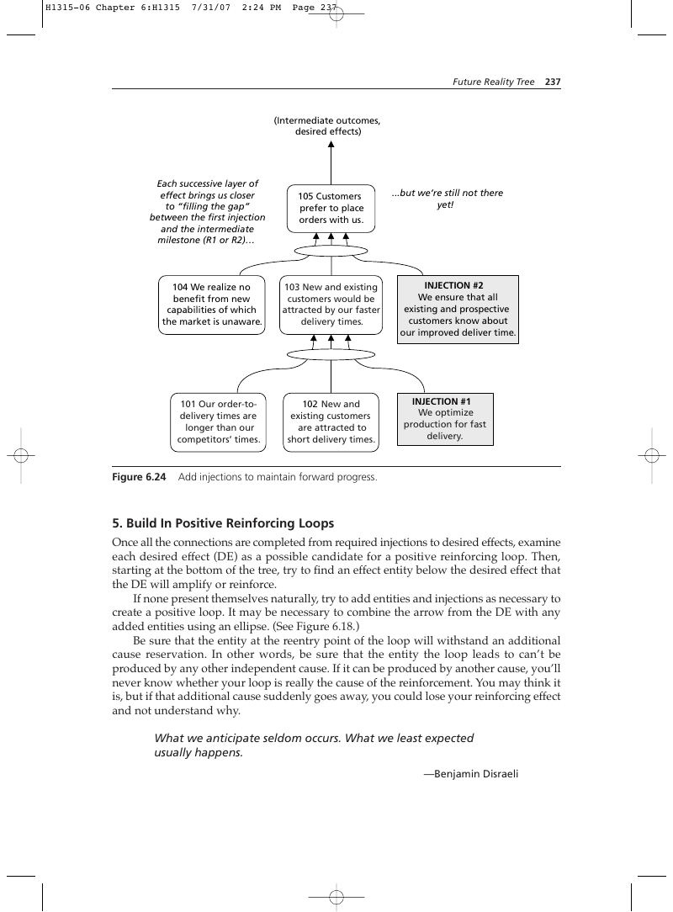

(Intermediate outcomes, desired effects)

Each successive layer of effect brings us closer to “filling the gap” between the first injection and the intermediate milestone (R1 or R2)…

105 Customers prefer to place orders with us.

104 We realize no benefit from new capabilities of which the market is unaware.

103 New and existing customers would be attracted by our faster delivery times.

INJECTION #2 We ensure that all existing and prospective customers know about our improved deliver time.

101 Our order-todelivery times are longer than our competitors’ times.

102 New and existing customers are attracted to short delivery times.

INJECTION #1 We optimize production for fast delivery.

Figure 6.24

...but we’re still not there yet!

Add injections to maintain forward progress.

#### 5. Build In Positive Reinforcing Loops

> Once all the connections are completed from required injections to desired effects, examine each desired effect (DE) as a possible candidate for a positive reinforcing loop. Then, starting at the bottom of the tree, try to find an effect entity below the desired effect that the DE will amplify or reinforce. If none present themselves naturally, try to add entities and injections as necessary to create a positive loop. It may be necessary to combine the arrow from the DE with any added entities using an ellipse. (See Figure 6.18.) Be sure that the entity at the reentry point of the loop will withstand an additional cause reservation. In other words, be sure that the entity the loop leads to can’t be produced by any other independent cause. If it can be produced by another cause, you’ll never know whether your loop is really the cause of the reinforcement. You may think it is, but if that additional cause suddenly goes away, you could lose your reinforcing effect and not understand why. What we anticipate seldom occurs. What we least expected usually happens.
>
> —Benjamin Disraeli

#### 6. Look for Negative Branches

Remember from our discussion of the Current Reality Tree (Chapter 4) that the CRT is really only a negative branch of existing reality—it doesn’t include the beneficial parts of the system, because its purpose is to analyze gaps or mismatches between expected performance standards (as articulated in the IO Map) and actual system performance. Consequently, aspects of the system that are performing acceptably are omitted from the CRT. The FRT will only reflect desired effects that represent “cures” to the deficiencies identified in the CRT.

**NOTE:** As we discussed with the law of unintended consequences, sometimes changes we make (or injections we apply) can also produce unpleasant consequences—new undesirable effects that didn’t exist before the injection was applied. In many (perhaps all) cases, such new UDEs represent deviations from critical success factors or necessary conditions in the IO Map that were not considered problems before. As a rule of thumb, evaluate the new developments in your FRT against these elements from the IO Map that weren’t reflected in the original CRT. Ask yourself, “Will this new course of action adversely affect any CSF or NC that were problem free under the CRT?” This can help you locate potential negative branches more quickly. Starting at the bottom of the Future Reality Tree, systematically examine each expected effect of every injection for possible negative outcomes (see Figure 6.25). Ask yourself, “Besides this desired outcome, what else could result from this injection that would be detrimental to the system?” Since negative branches can develop at any subsequent point, don’t become complacent if you don’t find one immediately above the injection. Work upward from the injection along each branch to the top of the Future Reality Tree. Don’t overlook negative outcomes associated directly with the desired effects, either. It’s so easy to focus on the desirable outcomes of the FRT that the adverse impacts may be overlooked. There’s a tendency to breathe a sigh of relief when you reach the desired effects and ignore their downsides. What are the possible undesirable effects of your reaching that pot of gold at the end of the rainbow? (Ever hear the saying, “He was a victim of his own success”?)

#### Why Negative Branches Require Attention

Why should we be concerned about negative branches? Other than the obvious reason (that is, we may not like the outcome), we might have to consider other people as well. Frequently it’s necessary to work outside our span of complete control in order to change things. What if you need the assistance of other people to achieve the desired effects? And what if those people can see downsides to your proposed course of action, maybe disadvantages that affect them directly? How can we expect their support, unless we can demonstrate that we’ve already identified those disadvantages and taken steps to neutralize them? Part of the persuasion process in such cases involves addressing negative branches in the presentation of the Future Reality Tree to others. (Refer to Chapter 8 for more discussion on persuading others with your logic.) NOTE 1: Don’t start looking for negative branches before your FRT is complete. It’s too easy to become sidetracked and the tree may never develop its basic shape. In pursuit of negative branches, you may be diverted from your original purpose, which is to build up to the desired effects. So save work on negative branches until after the FRT is done, even if you’re certain you know where some might pop up.

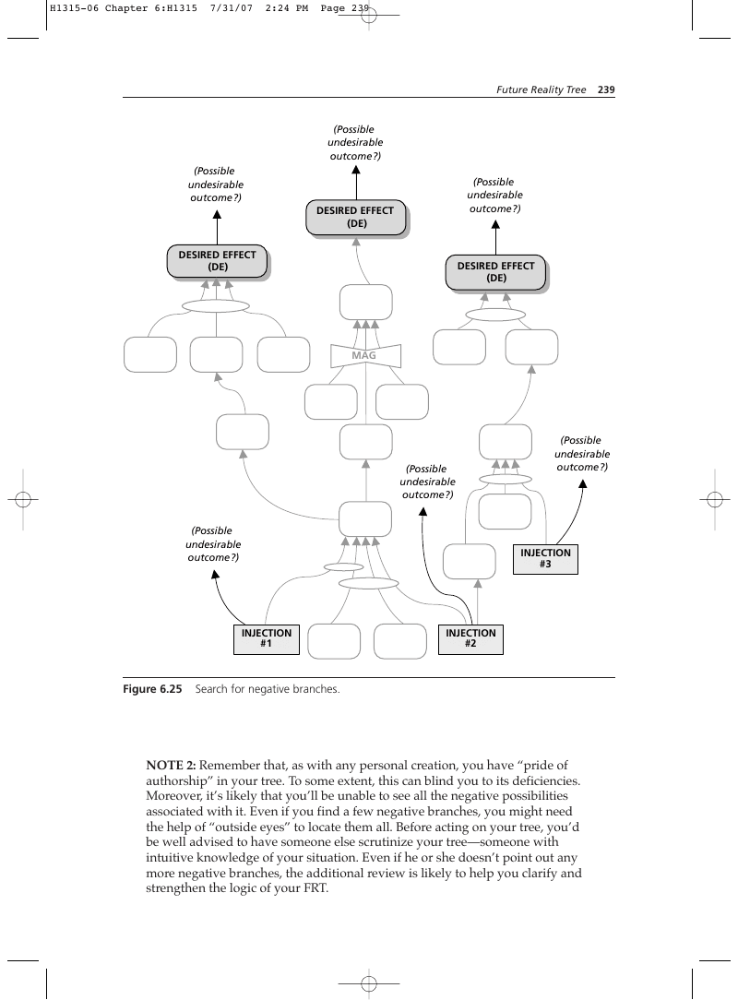

(Possible

undesirable outcome?) (Possible

undesirable outcome?) (Possible

undesirable outcome?)

DESIRED EFFECT (DE) DESIRED EFFECT (DE)

DESIRED EFFECT (DE)

MAG (Possible

undesirable outcome?) (Possible

undesirable outcome?)

INJECTION #3

INJECTION #1

Figure 6.25 (Possible

undesirable outcome?)

INJECTION #2

Search for negative branches.

NOTE 2: Remember that, as with any personal creation, you have “pride of authorship” in your tree. To some extent, this can blind you to its deficiencies. Moreover, it’s likely that you’ll be unable to see all the negative possibilities associated with it. Even if you find a few negative branches, you might need the help of “outside eyes” to locate them all. Before acting on your tree, you’d be well advised to have someone else scrutinize your tree—someone with intuitive knowledge of your situation. Even if he or she doesn’t point out any more negative branches, the additional review is likely to help you clarify and strengthen the logic of your FRT.

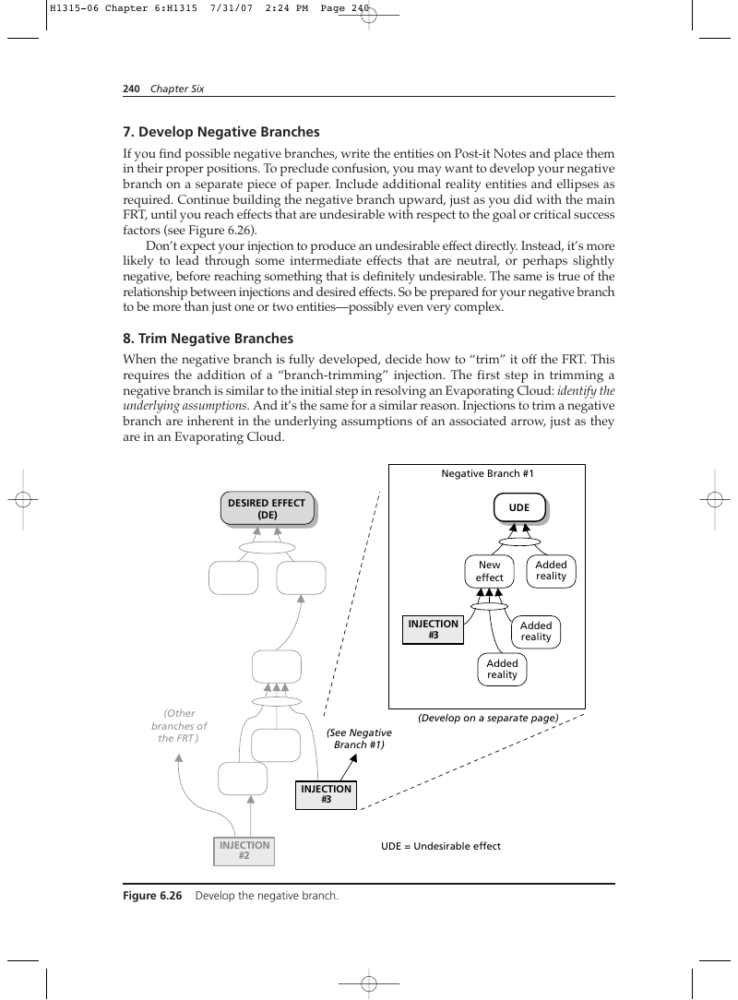

1. Develop Negative Branches If you find possible negative branches, write the entities on Post-it Notes and place them in their proper positions. To preclude confusion, you may want to develop your negative branch on a separate piece of paper. Include additional reality entities and ellipses as required. Continue building the negative branch upward, just as you did with the main FRT, until you reach effects that are undesirable with respect to the goal or critical success factors (see Figure 6.26). Don’t expect your injection to produce an undesirable effect directly. Instead, it’s more likely to lead through some intermediate effects that are neutral, or perhaps slightly negative, before reaching something that is definitely undesirable. The same is true of the relationship between injections and desired effects. So be prepared for your negative branch to be more than just one or two entities—possibly even very complex.
2. Trim Negative Branches When the negative branch is fully developed, decide how to “trim” it off the FRT. This requires the addition of a “branch-trimming” injection. The first step in trimming a negative branch is similar to the initial step in resolving an Evaporating Cloud: identify the underlying assumptions. And it’s the same for a similar reason. Injections to trim a negative branch are inherent in the underlying assumptions of an associated arrow, just as they are in an Evaporating Cloud. Negative Branch #1 DESIRED EFFECT (DE)

UDE

New effect

INJECTION #3 Added

reality Added

reality Added

reality (Other

branches of the FRT )

(Develop on a separate page) (See Negative

Branch #1)

INJECTION #3

INJECTION #2

Figure 6.26

Develop the negative branch.

UDE = Undesirable effect

We’re not concerned with all the assumptions in a Negative Branch, only the ones associated with the transitional arrow. The transitional arrow is the one that leads into the first clearly negative entity—the place where we can definitely say, “Things are starting to go badly here,” even if we’re not yet to the point of an UDE. We read the connection in this case a little differently. Remember that in the Evaporating Cloud we read the relationship, “In order to…we must…”. To get to the underlying assumptions in a negative branch, we read, “If [cause]…then [effect], because [assumption].” Normally, you won’t find more than a few assumptions associated with a transitional arrow in a negative branch—and sometimes only one. But one is probably enough to suggest an injection, especially if you use the extreme wording technique in your assumptions (see Chapter 5). Once you’ve articulated the underlying assumptions at the transitional arrows, create an injection to trim the branch at that point. This means that such an injection, combined with the causes at the tails of the transitional arrows, will produce a benign or even positive effect, rather than the negative one you started with. Develop this causality on a separate piece of paper (see Figure 6.29 p. 6, for an example). This “trimmed” causality is no more than the projection of the branch-trimming injection to its logical conclusion—and that had better be favorable (or at least neutral), otherwise you’ve chosen the wrong injection. Verify the “trimmed” causality using the Categories of Legitimate Reservation, and be sure that your branch-trimming injection doesn’t create any negative branches of its own. Figure 6.27 includes an abbreviated list of steps for how to trim a negative branch, along with an illustration.

1. Incorporate the “Branch-Trimming” Injection into the FRT Once the branch-trimming effort is verified with the CLR, you must go back and incorporate this “trimmed” logical construction into the original FRT. Why? Basically, for two reasons. First, when it comes to planning implementation of the FRT, if the branch-trimming injection doesn’t appear in the main FRT with all the others, there’s a chance you might forget to execute it. (Remember, you constructed the negative branch and the trimmed part on separate pages.) Second, if this negative branch occurred to you, it might well occur to others. Eventually, you’ll probably present your FRT to decision makers for approval—or at least to contemporaries to enlist support. In either case, it’s faster and “cleaner” to show that you’ve anticipated a problem with the proposed solution yourself, rather than to have someone point out a “show-stopping” negative branch at the last minute. By putting the branch-trimming logic into the main FRT, you kill both of these birds with one stone.
2. Scrutinize the Entire FRT Once all negative branches have been identified and trimmed, reread and scrutinize the entire tree using the Categories of Legitimate Reservation. This is a good time to bring in someone else to help. Helpers don’t really need to understand the CLR; they just need intuitive knowledge about the situation. Even though they may not articulate logical reservations the way we’ve become accustomed to doing, you’ll recognize a comment such as, “I don’t think decreasing inventory makes profits to go up” as a causality reservation. As part of the scrutiny process, determine whether any parts of the FRT are unnecessary to attaining the desired effects. If so, trim those parts from the tree; the fewer superfluous entities, the more readable your tree will be.

**NOTE:** Don’t forget that the FRT may have more desired effects than the CRT had undesirable effects. In planning future reality, we want to be sure that even the parts of current reality we didn’t try to change remain intact and without adverse effect. In building the Future Reality Tree, we added injections for two reasons: (1) to correct our progress back “on course” toward our desired effects, and (2) to trim negative branches. Often one injection can do double duty (that is, fulfill both these functions), but because we inserted injections individually for different purposes, we never noticed this duplication. In scrutinizing the entire FRT, including negative branches at this step affords us the opportunity to find ways to consolidate injections, thus simplifying the tree. This step also lets us question whether we have elements in the Future Reality Tree that really don’t contribute to achieving our desired effects. If so, these parts of the tree can be eliminated without adverse consequence. Figure 6.27, “Procedures for Constructing a Future Reality Tree,” contains abbreviated steps for constructing an FRT.

### Scrutinizing a Future Reality Tree

Checking the logic of a Future Reality Tree is similar to checking that of a Current Reality Tree. The Categories of Legitimate Reservation (refer to Chapter 2) are used to test the logical connections between entities of the Future Reality Tree. However, there are a few differences to consider when using the CLR in an FRT.

#### Existence Reservations

In Chapter 2, we discussed the second level of the Categories of Legitimate Reservation— existence, both entity and causality. While this level of reservation is important in the Future Reality Tree, there are some definite limitations to its use. Take entity existence, for example. One of the tests for entity existence is whether it is a valid statement of existing reality. Clearly, this test won’t be of as much use in an FRT, because outcomes of actions we haven’t yet taken don’t currently exist. They can only exist in the future. So the only parts of the entity existence reservation that might apply in an FRT would be completeness (a complete sentence) and structure (no embedded “if–then” statements). Instead of validity, a better criterion by which to evaluate expected effects would be probability. Causality existence—whether the stated cause does, in fact, lead to the stated effect— likewise must be used with caution. Obviously, in a Future Reality Tree the effect does not exist now. The question is whether it will exist as an expected outcome of an injection; that is, will the injection effectively do the job it’s designed to do? Again, probability would be more useful in this situation. The predicted effect reservation is also likely to be much more useful in verifying outcomes of injections that don’t yet exist.

#### Additional Cause

There is one reservation that we can ignore in scrutinizing a Future Reality Tree: additional cause. Why? Because we aren’t really concerned about whether something else might produce our intermediate or desired effects—we’re only concerned that the actions we take will do so. Think about the example of demolishing an old building to make space for a new one. Do we really care whether an earthquake will do the job? It’s too uncertain to depend on that kind of outside force. What we really care about is whether the demolition team we’ve selected to do the job at the time of our choosing is equal to the task. So for all intents and purposes, you can dispense with additional cause checking in FRTs.

#### Scrutinizing Injections

The most important scrutiny you can apply concerns whether the injection can actually be done and whether it will eventually produce the desired effects. Be careful about rejecting an injection as “undoable” at face value. The electric light was undoable, until Thomas Edison did it. Instead, consider the subjective probability of being able to complete the injection. If your intuition tells you that the injection is likely to happen only “when pigs fly,” you might be well advised to look for another one—or multiple injections to accomplish the same purpose. Whether the injection will produce the desired effect is really a future causality issue.

“Oxygen” A single arrow always implies unspoken “oxygen”—maybe a lot of it. This is especially true in Future Reality Trees. And the assumptions people are willing to make about current reality might be less acceptable in projections of the future. In the FRT, you’re usually better off displaying “oxygen” visually as an existing reality entity, which you combine with an injection or an expected effect of an injection. There should be very few single arrows in an FRT.

### Summary

Take a look at Figure 6.29 (p. 1 through p. 6). It’s the Future Reality Tree, with trimmed negative branch, of the same start-up company depicted in the CRT at the end of Chapter 4 (Figure 4.46). It’s a good example of what a Future Reality Tree should look like. By the time you’ve completed a Future Reality Tree, you’ll have fairly high confidence that your idea for a solution to your system problem will actually work—that it will give you the results you want. You’ll also be reasonably certain that your idea won’t cause any new problems. Or, if it does, the negative branches will be clear for everyone to see, and you’ll know how to trim them before they even develop. Only now are we ready to consider the phase of the problem that kills the most promising ideas: how to cause the change. Good ideas go sour in implementation for three reasons:

- First, we never verified whether or not they’d really succeed before jumping right into execution. (We’ve taken care of that with the Future Reality Tree.)
- Second, we aren’t aware of what obstacles stand in our way, or how to overcome them.
- Third, and probably most crucial, we ignore the behavioral changes required in the system for the injections to succeed in delivering the desired effects. (More on this is Chapter 8.) Uncovering and overcoming obstacles to implementation is the first part of the final phase, determining how to cause the change, which is the subject of Chapter 7. An act, a habit, an institution, a law produces not only one effect, but a series of effects. Of these effects, the first alone is immediate; it appears simultaneously with its cause; it is seen. The other effects emerge only subsequently; they are not seen; we are fortunate if we foresee them.

> —Frédéric Bastiat (1801-1850)

French economist

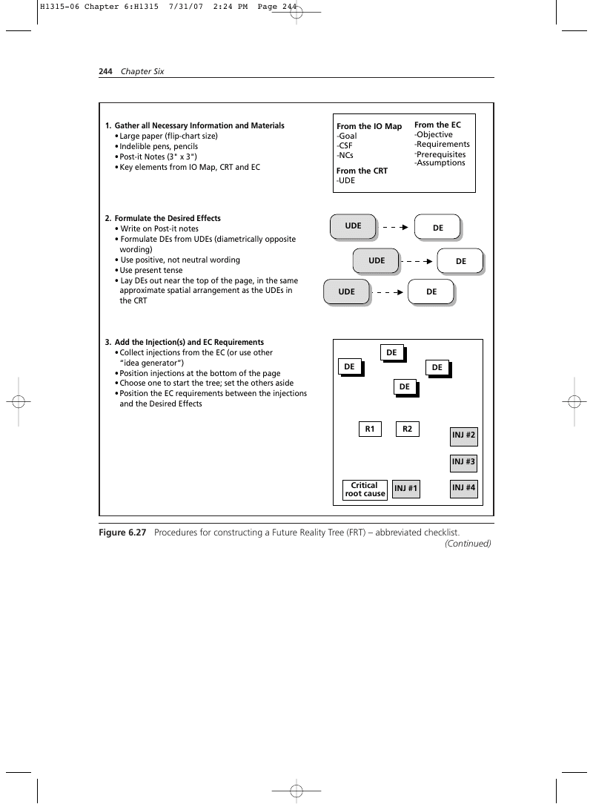

1. Gather all Necessary Information and Materials
- Large paper (flip-chart size)
- Indelible pens, pencils
- Post-it Notes (3" x 3")
- Key elements from IO Map, CRT and EC
1. Formulate the Desired Effects
- Write on Post-it notes
- Formulate DEs from UDEs (diametrically opposite wording)
- Use positive, not neutral wording
- Use present tense
- Lay DEs out near the top of the page, in the same approximate spatial arrangement as the UDEs in the CRT
1. Add the Injection(s) and EC Requirements
- Collect injections from the EC (or use other “idea generator”)
- Position injections at the bottom of the page
- Choose one to start the tree; set the others aside
- Position the EC requirements between the injections and the Desired Effects

> From the EC
>
> -Objective

> -Requirements

> -Prerequisites

> -Assumptions

> From the IO Map
>
> -Goal

> -CSF

> -NCs

> From the CRT
>
> -UDE

UDE

DE

UDE

DE

UDE

DE

DE DE

DE DE

R1

R2

INJ #2 INJ #3 Critical

root cause

INJ #1

INJ #4

Figure 6.27 Procedures for constructing a Future Reality Tree (FRT) – abbreviated checklist. (Continued)

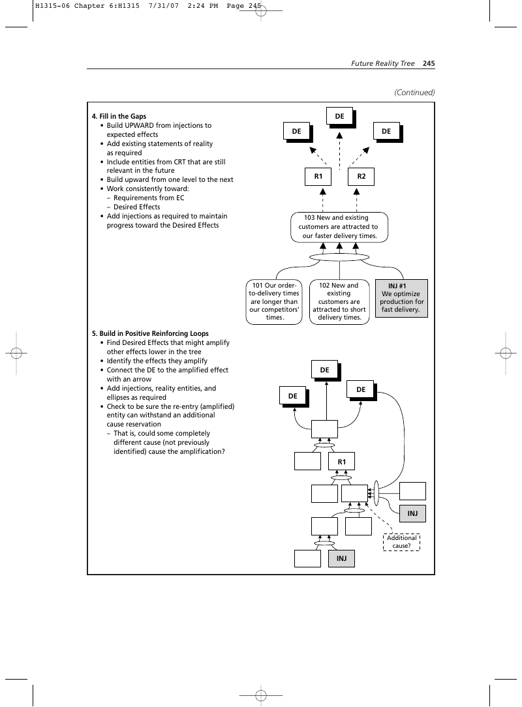

(Continued)

1. Fill in the Gaps
- Build UPWARD from injections to expected effects
- Add existing statements of reality as required
- Include entities from CRT that are still relevant in the future
- Build upward from one level to the next
- Work consistently toward:

> – Requirements from EC

> – Desired Effects

- Add injections as required to maintain progress toward the Desired Effects

DE DE

R1

R2

103 New and existing customers are attracted to our faster delivery times.

101 Our orderto-delivery times are longer than our competitors’ times.

1. Build in Positive Reinforcing Loops
- Find Desired Effects that might amplify other effects lower in the tree
- Identify the effects they amplify
- Connect the DE to the amplified effect with an arrow
- Add injections, reality entities, and ellipses as required
- Check to be sure the re-entry (amplified) entity can withstand an additional cause reservation

> – That is, could some completely

different cause (not previously identified) cause the amplification?

DE

102 New and existing customers are attracted to short delivery times.

INJ #1 We optimize production for fast delivery.

DE DE

DE

R1

INJ Additional

cause?

INJ

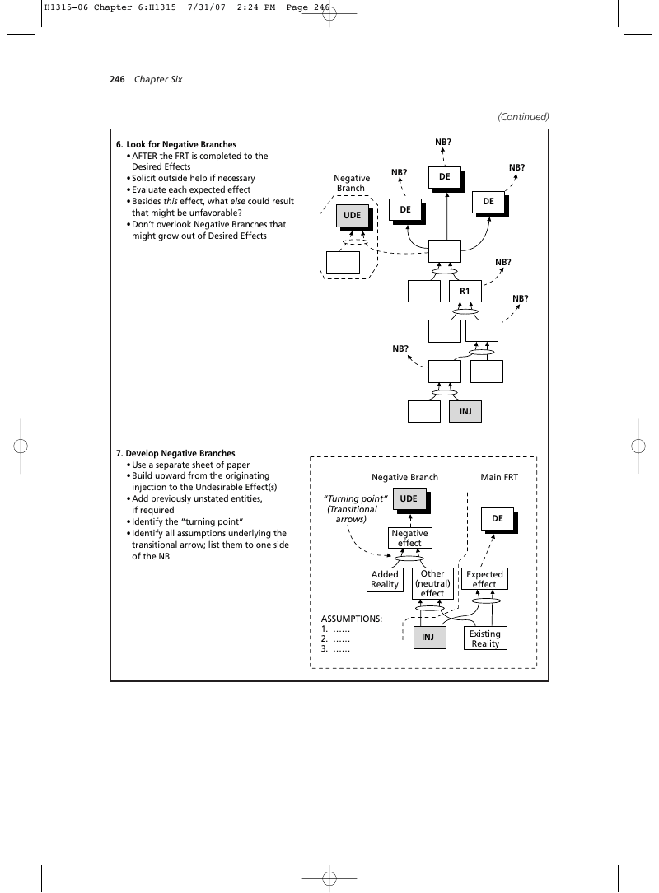

(Continued)

1. Look for Negative Branches
- AFTER the FRT is completed to the

Desired Effects

- Solicit outside help if necessary
- Evaluate each expected effect
- Besides this effect, what else could result that might be unfavorable?
- Don’t overlook Negative Branches that might grow out of Desired Effects

NB? NB?

NB?

Negative Branch

DE DE

DE

UDE

NB? R1

NB?

NB?

INJ

1. Develop Negative Branches
- Use a separate sheet of paper
- Build upward from the originating injection to the Undesirable Effect(s)
- Add previously unstated entities, if required
- Identify the “turning point”
- Identify all assumptions underlying the transitional arrow; list them to one side of the NB

Negative Branch Main FRT

UDE

“Turning point” (Transitional

arrows)

DE Negative effect Added Reality ASSUMPTIONS:

1. ……
2. ……
3. ……

Other

(neutral) effect Expected

effect

INJ Existing Reality

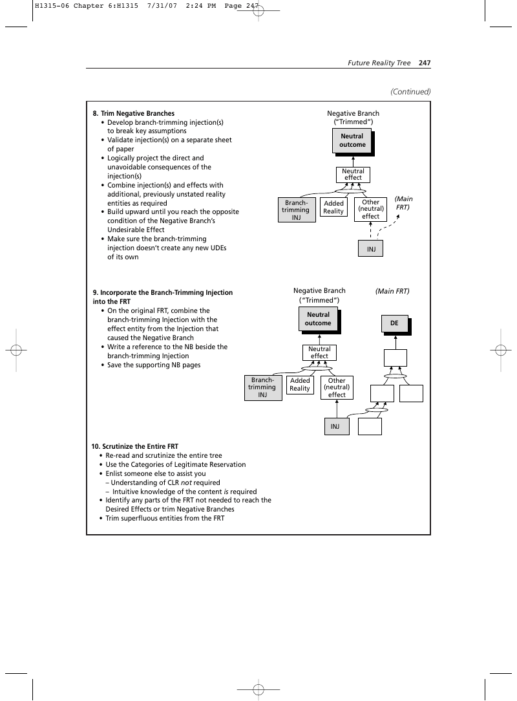

(Continued)

1. Trim Negative Branches
- Develop branch-trimming injection(s) to break key assumptions
- Validate injection(s) on a separate sheet of paper
- Logically project the direct and unavoidable consequences of the injection(s)
- Combine injection(s) and effects with additional, previously unstated reality entities as required
- Build upward until you reach the opposite condition of the Negative Branch’s Undesirable Effect
- Make sure the branch-trimming injection doesn’t create any new UDEs of its own

Negative Branch (“Trimmed”) Neutral

outcome Neutral

effect

Branchtrimming INJ Added Reality Other

(neutral) effect (Main FRT)

INJ

Negative Branch (“Trimmed”)

1. Incorporate the Branch-Trimming Injection into the FRT
- On the original FRT, combine the branch-trimming Injection with the effect entity from the Injection that caused the Negative Branch
- Write a reference to the NB beside the branch-trimming Injection
- Save the supporting NB pages

Neutral

outcome Neutral

effect

Branchtrimming INJ Added Reality Other

(neutral) effect

INJ

1. Scrutinize the Entire FRT
- Re-read and scrutinize the entire tree
- Use the Categories of Legitimate Reservation
- Enlist someone else to assist you

> – Understanding of CLR not required

> – Intuitive knowledge of the content is required

- Identify any parts of the FRT not needed to reach the Desired Effects or trim Negative Branches
- Trim superfluous entities from the FRT

(Main FRT)

DE

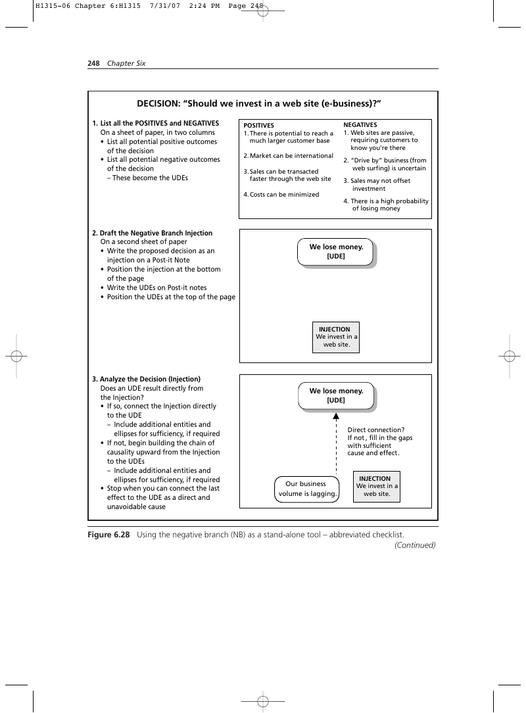

**DECISION:** “Should we invest in a web site (e-business)?”

1. List all the POSITIVES and NEGATIVES On a sheet of paper, in two columns
- List all potential positive outcomes of the decision
- List all potential negative outcomes of the decision

> – These become the UDEs

POSITIVES

1. There is potential to reach a much larger customer base
2. Market can be international
3. Sales can be transacted faster through the web site
4. Costs can be minimized

NEGATIVES

1. Web sites are passive, requiring customers to know you’re there
2. “Drive by” business (from web surfing) is uncertain
3. Sales may not offset investment
4. There is a high probability of losing money
5. Draft the Negative Branch Injection On a second sheet of paper
- Write the proposed decision as an injection on a Post-it Note
- Position the injection at the bottom of the page
- Write the UDEs on Post-it notes
- Position the UDEs at the top of the page

We lose money. [UDE]

INJECTION We invest in a web site.

1. Analyze the Decision (Injection) Does an UDE result directly from the Injection?
- If so, connect the Injection directly to the UDE

> – Include additional entities and

ellipses for sufficiency, if required

- If not, begin building the chain of causality upward from the Injection to the UDEs

> – Include additional entities and

ellipses for sufficiency, if required

- Stop when you can connect the last effect to the UDE as a direct and unavoidable cause

We lose money. [UDE]

Direct connection? If not , fill in the gaps with sufficient cause and effect .

Our business volume is lagging.

INJECTION We invest in a web site.

Figure 6.28 Using the negative branch (NB) as a stand-alone tool – abbreviated checklist. (Continued)

(Continued)

1. Scrutinize each upward connection
- Check each connection for cause sufficiency using the CLR

We lose money. [UDE]

The risk of not recovering our investment is high.

We have a large investment to recoup.

We realize some indeterminate increase in business volume.

1. Incorporate added realities
- Add statements about reality as required to produce sufficiency

Search engine positioning (SEP) is a significant added expense.

Potential customers don’t find us unless they’re specifically looking for us.

Only small numbers of customers find us by “surfing.”

Web sites are “passive.”

We have a web presence.

We need Search Engine

Positioning (SEP) to ensure high numbers of “hits.”

We have an initial financial investment to recoup.

1. Stop when your reach the UDE(s)

Our business volume is lagging.

INJECTION We invest in a web site.

(Continued) We lose money.

1. Find the Transitional Arrow
- The point at which the “tone” of the tree turns from positive or neutral to decidedly negative
- The arrow connecting the last positive or neutral entity with the first negative one

Transitional arrows (“turning point”)

The risk of not recovering our investment is high.

We have a large investment to recoup.

We realize some indeterminate increase in business volume.

**ASSUMPTIONS:**

1. There is absolutely no other way we can make our web presence known.
2. It’s impossible to collaborate with other commercial web sites.
3. Expose all Assumptions
- Underlying the transitional arrow
- Write them to one side of the Negative Branch

[UDE]

Search engine positioning (SEP) is a significant added expense.

Potential customers don’t find us unless they’re specifically looking for us.

Web sites are “passive.”

Only small numbers of customers find us by “surfing.”

We have a web presence.

Our business volume is lagging.

1. Develop Injections
- Focus on key assumptions
- Use “alternative environment” or other idea generator
- List the possible injections beside/below the assumptions
- Choose the “best” injections to trim the Negative Branch

INJECTION #1 We ally (link) our web site with related companies’ web sites that are non-competitors.

We need Search Engine

Positioning (SEP) to ensure high numbers of “hits.”

We have an initial financial investment to recoup.

INJECTION We invest in a web site.

INJECTION #2 We link our web site with our industry association site.

INJECTION #3 We obtain preferred placement on the Google search engine.

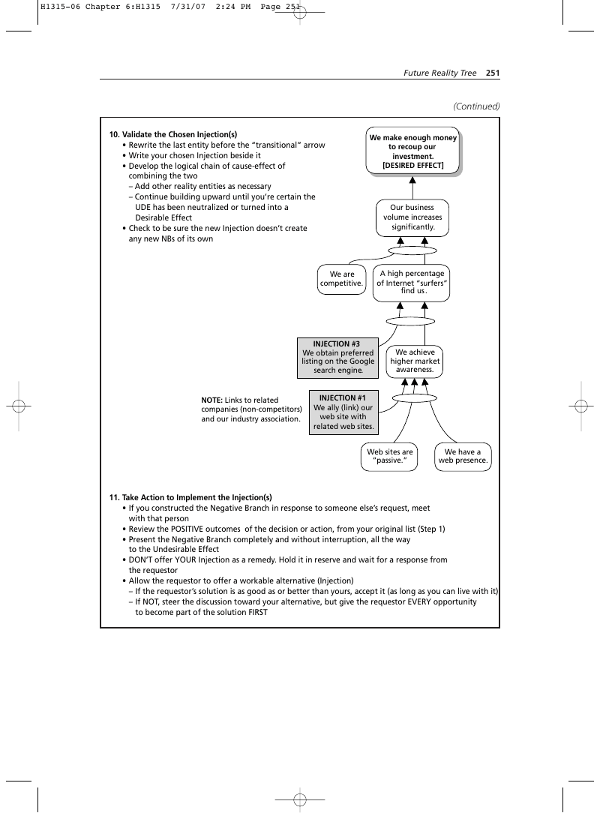

(Continued)

1. Validate the Chosen Injection(s)
- Rewrite the last entity before the “transitional” arrow
- Write your chosen Injection beside it
- Develop the logical chain of cause-effect of combining the two

> – Add other reality entities as necessary

> – Continue building upward until you’re certain the

UDE has been neutralized or turned into a Desirable Effect

- Check to be sure the new Injection doesn’t create any new NBs of its own

We make enough money to recoup our investment. [DESIRED EFFECT]

Our business volume increases significantly.

A high percentage of Internet “surfers” find us .

We are competitive.

INJECTION #3 We obtain preferred listing on the Google search engine..

**NOTE:** Links to related companies (non-competitors) and our industry association.

We achieve higher market awareness.

INJECTION #1 We ally (link) our web site with . related web sites. Web sites are “passive.”

We have a web presence.

1. Take Action to Implement the Injection(s)
- If you constructed the Negative Branch in response to someone else’s request, meet with that person
- Review the POSITIVE outcomes of the decision or action, from your original list (Step 1)
- Present the Negative Branch completely and without interruption, all the way to the Undesirable Effect
- DON’T offer YOUR Injection as a remedy. Hold it in reserve and wait for a response from the requestor
- Allow the requestor to offer a workable alternative (Injection)

> – If the requestor’s solution is as good as or better than yours, accept it (as long as you can live with it)

> – If NOT, steer the discussion toward your alternative, but give the requestor EVERY opportunity

to become part of the solution FIRST

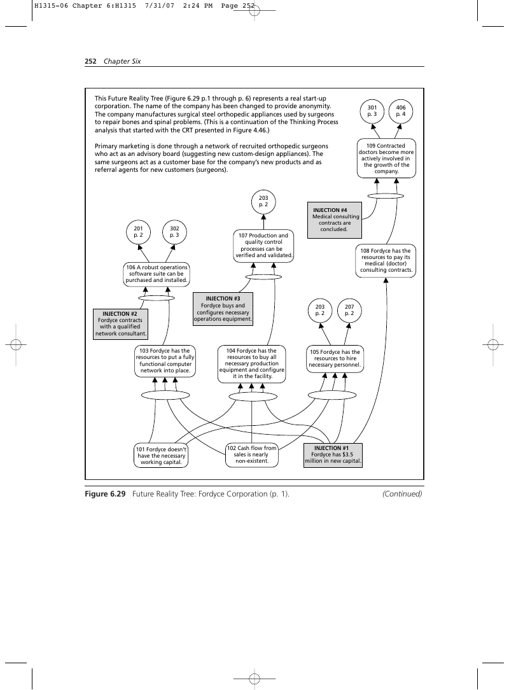

This Future Reality Tree (Figure 6.29 p.1 through p. 6) represents a real start-up corporation. The name of the company has been changed to provide anonymity. The company manufactures surgical steel orthopedic appliances used by surgeons to repair bones and spinal problems. (This is a continuation of the Thinking Process analysis that started with the CRT presented in Figure 4.46.)

p. 3

p. 4

109 Contracted doctors become more actively involved in the growth of the company.

Primary marketing is done through a network of recruited orthopedic surgeons who act as an advisory board (suggesting new custom-design appliances). The same surgeons act as a customer base for the company’s new products and as referral agents for new customers (surgeons).

p. 2

p. 2

INJECTION #4 Medical consulting contracts are concluded.

p. 3

107 Production and quality control processes can be verified and validated.

108 Fordyce has the resources to pay its medical (doctor) consulting contracts.

106 A robust operations software suite can be purchased and installed.

INJECTION #2 Fordyce contracts with a qualified network consultant.

INJECTION #3 Fordyce buys and configures necessary operations equipment.

103 Fordyce has the resources to put a fully functional computer network into place.

101 Fordyce doesn’t have the necessary working capital.

p. 2

p. 2

104 Fordyce has the resources to buy all necessary production equipment and configure it in the facility.

105 Fordyce has the resources to hire necessary personnel.

102 Cash flow from sales is nearly non-existent.

INJECTION #1 Fordyce has $3.5 million in new capital.

Figure 6.29 Future Reality Tree: Fordyce Corporation (p. 1).

(Continued)

(Continued) p. 3

p. 4

**NOTE:** 510K is a Food and Drug Administration certification . 205 The 510K is approved. [DESIRED EFFECT]

NB-1-11 The odds of a competitor “stealing” Fordyce’s sales and marketing manager are significantly reduced.

206 Fordyce has a first-class sales and marketing management capability.

203 QSR documentation is completed.

p. 3

(Negative Branch UDE eliminated)

208 Fordyce has a high level of market knowledge. [DESIRED EFFECT]

207 Products are released to the market.

204 Fordyce can produce parts.

p. 4

INJECTION #8 Fordyce selects a highly qualified sales and marketing manager.

INJECTION #7 The in-house production system is developed.

p. 3

(Required to trim Negative Branch #1) See Figure 30f

210 Quality System Requirements (QSR) procedures and processes can be put into place.

INJECTION #5 Fordyce identifies, acquires, and installs operations management software.

INJECTION #8a Fordyce creates a unique, difficultto-match compensation package for the sales/marketing manager.

107 Production and quality control processes can be verified and validated.

202 The initial production work force is in place.

(From p. 1 )

106 A robust operations software suite can be purchased and installed. (From p. 1 )

INJECTION #6 Fordyce hires four qualified production personnel.

Figure 6.29 Future Reality Tree: Fordyce Corporation (p. 2).

105 Fordyce has the resources to hire necessary personnel. (From p. 1 )

(Continued) p. 5 NOTE: Contracted

doctors are Fordyce’s customers.

Positive Reinforcing

Loop #1

p. 5

307 Customers are delighted with Fordyce’s product offerings. [DESIRED EFFECT]

306 Fordyce has an effective management system. [DESIRED EFFECT]

MAG

305 Fordyce introduces the best, most innovative, high-quality products faster than any other competitor. [DESIRED EFFECT]

INJECTION #11 Fordyce institutes critical chain project management.

301 Fordyce has (more) new “cutting edge” product ideas and concepts.

109 Contracted doctors become more (and more) actively involved in the growth of the company. (From p. 1 )

INJECTION #9 Medical advisor board (MAB ) doctors provide development advice.

304 Fordyce can satisfy customer needs faster than its competitors.

303 Fordyce has the fastest, most reliable production system available.

INJECTION #12 Fordyce implements an effective human resources system.

207 Products are released to the market.

203 QSR documentation is completed.

(From p. 2 )

(From p. 2 )

302 Fordyce can manage production and inventory control.

106 A robust operations software suite can be purchased and installed. (From p. 1 )

INJECTION #10 Fordyce installs drumbuffer-rope production control.

INJECTION #5 Fordyce identifies, acquires, and installs operations management software. (From p. 2 )

Figure 6.29 Future Reality Tree: Fordyce Corporation (p. 3).

(Continued)

407 Fordyce is highly competitive in the market. [DESIRED EFFECT]

MAG

405 Fordyce has an exceptional sales and marketing program. [DESIRED EFFECT]

208 Fordyce has a high level of market knowledge. [DESIRED EFFECT]

p. 5

406 An active, productive supporting network of doctors develops. [DESIRED EFFECT]

INJECTION #16 Fordyce has an effective selection process for contracting with new doctors.

404 Fordyce has a firstclass distribution/ sales network. [DESIRED EFFECT]

109 Contracted doctors become more actively involved in the growth of the company.

(From p. 2 ) MAG

401 Qualified sales representatives are identified and secured.

206 Fordyce has a first-class sales and marketing management capability.

402 Fordyce has an effective product sales training program. [DESIRED EFFECT]

INJECTION #13 Sales /marketing manager discharges job responsibilities as expected/described.

403 Fordyce has effective super-qualified sales representatives.

INJECTION #14 Sales /marketing manager searches out and identifies super qualified sales force.

(From p. 2 ) ASSUMPTION: Sales /

marketing manager responsibilities include effective training program development.

Figure 6.29 Future Reality Tree: Fordyce Corporation (p. 4).

(From p. 1 )

INJECTION #15 Fordyce’s

compensation scheme “motivates” the sales force.

(Continued)

505 Fordyce generates the necessary capital to continually expand markets and products. [DESIRED EFFECT]

505 R & L’s expectations are exceeded. [DESIRED EFFECT] NOTE: R & L is the

parent company.

504 Fordyce is (more and more) highly profitable. [DESIRED EFFECT]

502 Sales revenue and Throughput increase (more and more). [DESIRED EFFECT]

Positive Reinforcing

Loop #2

503 Inventory and operating expenses are effectively controlled across the system.

501 A large (larger) percentage of the potential customer base demands Fordyce products. [DESIRED EFFECT]

306 Fordyce has an effective management system. [DESIRED EFFECT]

(From p. 3 )

**NOTE:** At some point, Fordyce achieves market dominance.

MAG

407 Fordyce is (more and more) highly competitive in the market. [DESIRED EFFECT]

307 Customers are delighted with Fordyce’s product offerings. [DESIRED EFFECT]

(From p. 4 )

(From p. 3 )

Figure 6.29 Future Reality Tree: Fordyce Corporation (p. 5).

(Continued) NB-1-10 Eventually, Fordyce’s profitability suffers. [UNDESIRABLE EFFECT]

NB-1-10 Fordyce eventually loses customers to competitors. [UNDESIRABLE EFFECT]

NB-1-11 Good sales and marketing managers are key to maintaining customer relationships .

NB-1-10 Fordyce loses it’s highly qualified sales and marketing manager. [UNDESIRABLE EFFECT]

NB-1-07 A competitor makes Fordyce’s sales and marketing manager a highly attractive offer. (Transitional

arrows)

**ASSUMPTIONS:**

1. Typical compensation packages are easily exceeded.
2. Competitors have extra money to “throw” at prospective candidates.

NB-1-02 Fordyce’s sales and marketing manager succeeds dramatically.

INJECTION #8 Fordyce selects a highly qualified sales and marketing manager.

NB-1-08 It’s easier for competitors to “steal” Fordyce’s highly qualified sales and marketing manager.

NB-1-09 Fordyce’s marketing and sales manager likes the competitor’s offer.

NB-1-05 Competitors seek to replicate Fordyce’s sales and marketing capability.

NB-1-06 Highly qualified sales and marketing managers are hard to find.

NB-1-03 Fordyce’s sales and marketing success is highly visible to competitors.

NB-1-04 Competitors don’t like being outclassed.

NB-1-01 Highly qualified sales and marketing managers have a high probability of succeeding at what they do.

Figure 6.29 Future Reality Tree: Fordyce Corporation (p. 6, negative branch).

INJECTION #8a Fordyce creates a unique, difficultto-match compensation package for the sales / marketing manager.

(Continued) NB-1-11 The odds of a competitor “stealing” Fordyce’s sales and marketing manager are significantly reduced.

NB-1-06 Highly qualified sales and marketing managers are hard to find.

NB-1-05 Competitors seek to replicate Fordyce’s sales and marketing capability.

NB-1-02 Fordyce’s sales and marketing manager succeeds dramatically.

NB-1-03 Fordyce’s sales and marketing success is highly visible to competitors.

INJECTION #8 Fordyce selects a highly qualified sales and marketing manager.

INJECTION #8a Fordyce creates a unique, difficult -to-match compensation package for the sales marketing manager.

NB-1-04 Competitors don’t like being outclassed.

NB-1-01 Highly qualified sales and marketing managers have a high probability of succeeding at what they do.

Figure 6.29 Future Reality Tree: Fordyce Corporation (p. 6, negative branch “trimmed”).

### Endnotes

1. Dettmer, H. William. Strategic Navigation: A Systems Approach to Business Strategy. Milwaukee, WI: ASQ Quality Press, 2003.

