# Part III -- Executing Change

# Chapter 7: Prerequisite and Transition Trees

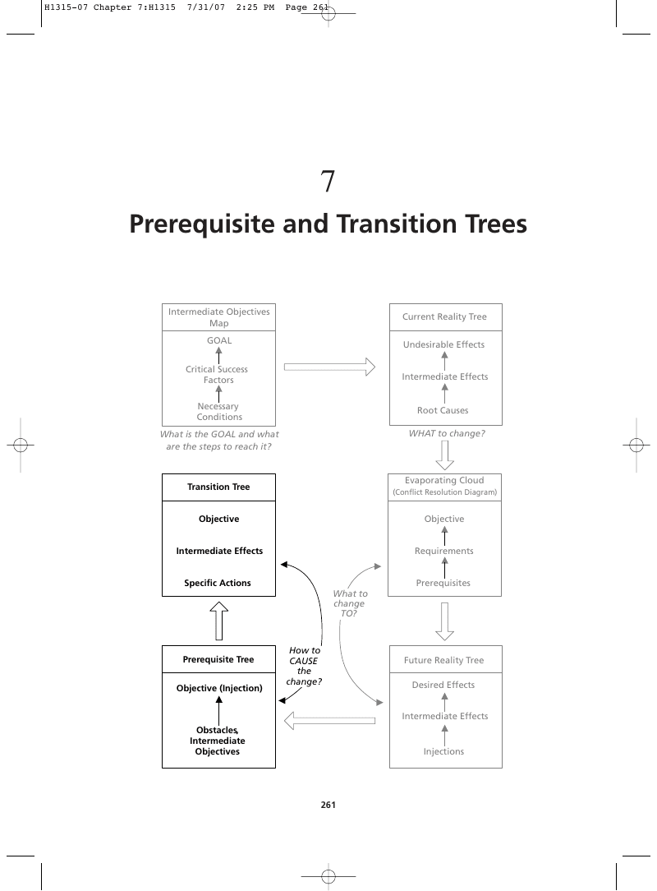

Intermediate Objectives

Map Current Reality Tree GOAL Undesirable Effects Critical Success Factors Intermediate Effects Necessary Conditions Root Causes

What is the GOAL and what are the steps to reach it?

WHAT to change? Evaporating Cloud Transition Tree

(Conflict Resolution Diagram) Objective Objective Intermediate Effects Requirements Specific Actions Prerequisites What to

change TO? Prerequisite Tree

Objective (Injection) How to CAUSE

the change? Future Reality Tree Desired Effects Intermediate Effects

Obstacles, Intermediate Objectives Injections

> The devil is in the details.
>
> —Unknown

### A Consolidation of Two Trees

The first edition of this book separated the discussion of Prerequisite Trees and Transition Trees, treating each as distinctly individual tools. This edition merges the discussion of the two logic trees into a single chapter and de-emphasizes the Transition Tree substantially. In fact, the Transition Tree will be only briefly addressed, and more as a matter of historical interest than as an ongoing application. There is a compelling reason to do this: The usefulness of the Transition Tree has proved to be limited. Over the course of the past ten years of teaching and applying the Logical Thinking Process, I’ve discovered that it has turned out to be the least valuable of the Thinking Process tools for nearly all practitioners. I’ll discuss the reasons for this later in the chapter, under the section entitled “The Transition Tree.” I don’t intend my de-emphasis of the Transition Tree to imply that the execution phase of a systemic solution is less important than the problem definition, idea generation, or validation phases (Current Reality Tree, Evaporating Cloud, and Future Reality Tree). The quotation above this section should dispel any doubts about that. Rather, I believe that there is a better way to execute a new solution than to map it out with a Transition Tree. That better way is three-fold:

- Develop a more detailed Prerequisite Tree
- Convert the Prerequisite Tree to a project activity network and manage implementation as a project using Critical Chain Project Management
- Devote proper attention to the human element in systemic change (Chapter 8 is completely devoted to this topic) Good ideas often founder in implementation. It’s one thing to come up with an idea for a solution to a problem. It’s another thing entirely to make it happen. Just wanting to do something doesn’t get it done. That’s why one of the principles we discussed earlier says, “Ideas are not solutions.” It’s not a solution until it’s implemented and doing what it’s supposed to do. Maybe we generated an excellent idea with an Evaporating Cloud and we might have proven its worth in a Future Reality Tree. But without effective execution, it’s a good idea “on paper” only. How can we ensure that our idea will be effectively implemented? A Prerequisite Tree (PRT) can be the first step. What do we need to know when we consider execution of change? Basically, four things:
- We need to be sure that what we contemplate doing will work the first time—that there will be no false starts or failures.
- We also need to know what component tasks must be completed and what intermediate outcomes accomplished.
- We need to know what obstacles stand in our way and what to do about them.
- Finally, we need to know in what sequence the second and third items must happen. The Prerequisite Tree is capable of answering all of these questions.

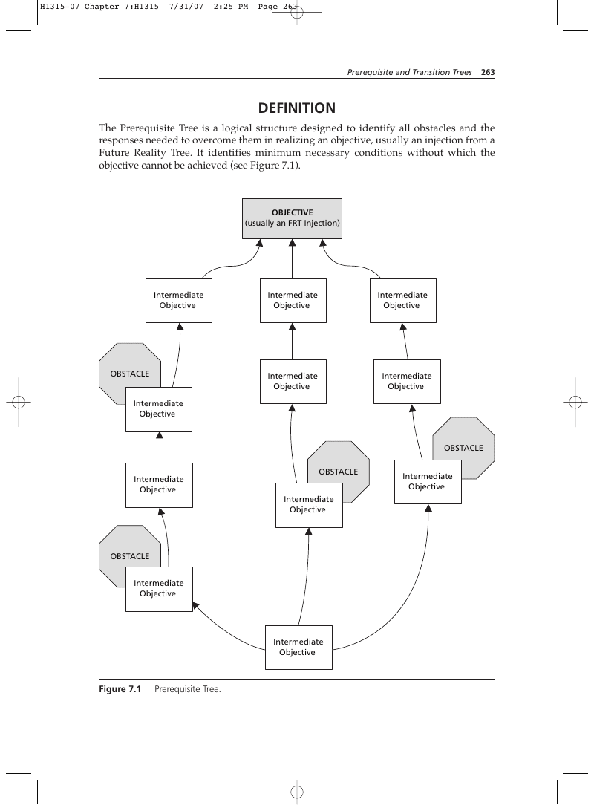

### Definition

The Prerequisite Tree is a logical structure designed to identify all obstacles and the responses needed to overcome them in realizing an objective, usually an injection from a Future Reality Tree. It identifies minimum necessary conditions without which the objective cannot be achieved (see Figure 7.1). OBJECTIVE

(usually an FRT Injection) Intermediate Objective OBSTACLE Intermediate Objective Intermediate Objective Intermediate Objective Intermediate Objective Intermediate Objective OBSTACLE Intermediate Objective OBSTACLE Intermediate Objective OBSTACLE Intermediate Objective Intermediate Objective

Figure 7.1

Prerequisite Tree. Intermediate Objective

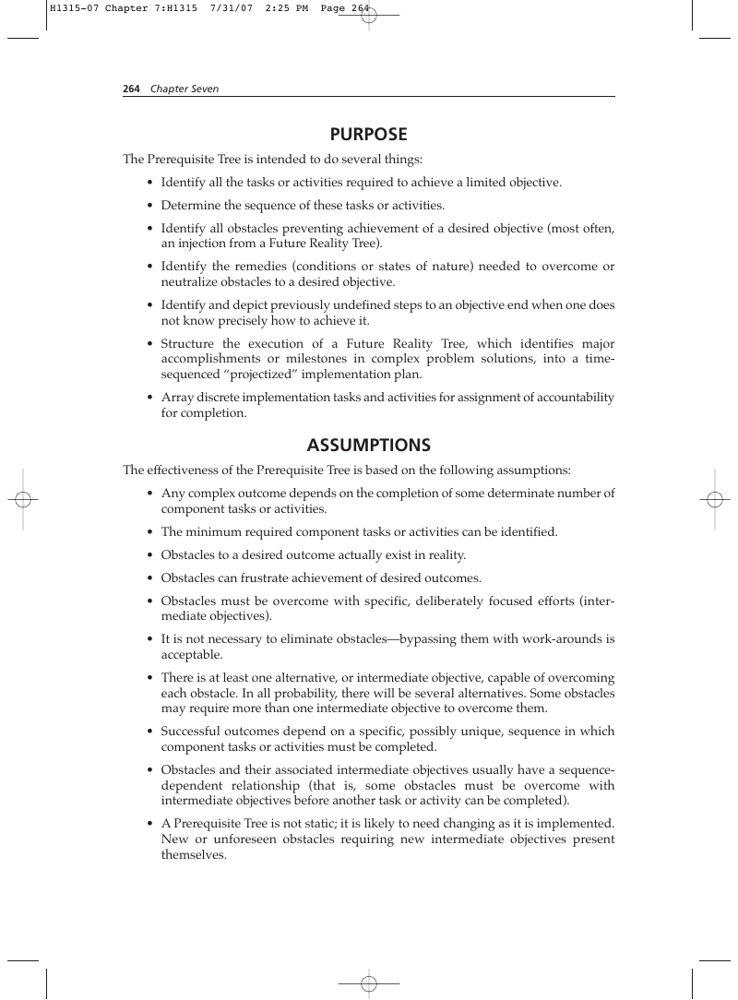

PURPOSE

The Prerequisite Tree is intended to do several things:

- Identify all the tasks or activities required to achieve a limited objective.
- Determine the sequence of these tasks or activities.
- Identify all obstacles preventing achievement of a desired objective (most often, an injection from a Future Reality Tree).
- Identify the remedies (conditions or states of nature) needed to overcome or neutralize obstacles to a desired objective.
- Identify and depict previously undefined steps to an objective end when one does not know precisely how to achieve it.
- Structure the execution of a Future Reality Tree, which identifies major accomplishments or milestones in complex problem solutions, into a timesequenced “projectized” implementation plan.
- Array discrete implementation tasks and activities for assignment of accountability for completion.

ASSUMPTIONS

The effectiveness of the Prerequisite Tree is based on the following assumptions:

- Any complex outcome depends on the completion of some determinate number of component tasks or activities.
- The minimum required component tasks or activities can be identified.
- Obstacles to a desired outcome actually exist in reality.
- Obstacles can frustrate achievement of desired outcomes.
- Obstacles must be overcome with specific, deliberately focused efforts (intermediate objectives).
- It is not necessary to eliminate obstacles—bypassing them with work-arounds is acceptable.
- There is at least one alternative, or intermediate objective, capable of overcoming each obstacle. In all probability, there will be several alternatives. Some obstacles may require more than one intermediate objective to overcome them.
- Successful outcomes depend on a specific, possibly unique, sequence in which component tasks or activities must be completed.
- Obstacles and their associated intermediate objectives usually have a sequencedependent relationship (that is, some obstacles must be overcome with intermediate objectives before another task or activity can be completed).
- A Prerequisite Tree is not static; it is likely to need changing as it is implemented. New or unforeseen obstacles requiring new intermediate objectives present themselves.

### How to Use This Chapter

- Read “Description of the Prerequisite Tree” below. This section describes what a Prerequisite Tree is and how it works.
- Review Figure 7.31, “Procedures for Constructing a Prerequisite Tree,” and the associated examples. This section explains in detail each of the steps in building a Prerequisite Tree and why they’re necessary. Then practice with a complex injection of your choice.
- Read “Scrutinizing a Prerequisite Tree.” This section tells how to ensure that your Prerequisite Tree is logically sound, contains all required tasks/activities, accurately depicts real obstacles, and accurately reflects what must be done to overcome them.
- Review Figure 7.33, “Prerequisite Tree: Conference Planning and Management.”

### Description of the Prerequisite Tree

The Prerequisite Tree (PRT) is intended to lay out the components of complex execution for the realization of some desired outcome. It can answer the question, “What must I do to achieve ‘the impossible’?” Your objective—what you want to achieve—might be as limited as tuning up your car. Or it may be only one step in the solution of a much larger problem. For example, you might want to know how to gain admission to a certain college as one step in embarking on a professional career, or how to introduce a new product line. Whether your objective is great or small, individual or organizational or societal, the Prerequisite Tree can help you determine what you need to do to realize it, what would keep you from successfully achieving it, and how to work around the obstacles. A PRT can help you objectively identify obstacles and determine what to do about them, without regard for who is responsible for taking action. (That comes later.)

#### Necessity vs. Sufficiency

The Prerequisite Tree is not like the Current Reality Tree (CRT) or the Future Reality Tree (FRT). It’s more like the IO Map and the Evaporating Cloud. The big difference is that the PRT is a necessity structure, while the CRT and FRT are sufficiency structures. What’s the difference? Simply, the CRT and FRT convey a different message from the PRT. A CRT/FRT says that all entities at the tail of arrows are enough to actually produce the entities at the heads. (See Figure 7.2.) A PRT shows the minimum that you must do before you can go on to the next step. For example, to build a house you need significant quantities of cement, lumber, steel, and a place to build. Without them, you can’t begin the actual work of construction. These four factors are “show-stoppers.” You can’t proceed without them. Obtaining them must take place first. That’s the concept of necessity—completing tasks or activities that must be done before some other task is done, or before some outcome is achieved. (See Figure 7.3.) In fact, the analogy of building a house is a good one to use for conceptualizing the PRT. It is clearly an implementation of an idea for a solution (in the house example, it’s a safe, secure, gratifying, pleasant way to escape the elements). So let’s consider that our objective in an example we’ll examine a little later to see how a PRT is developed.

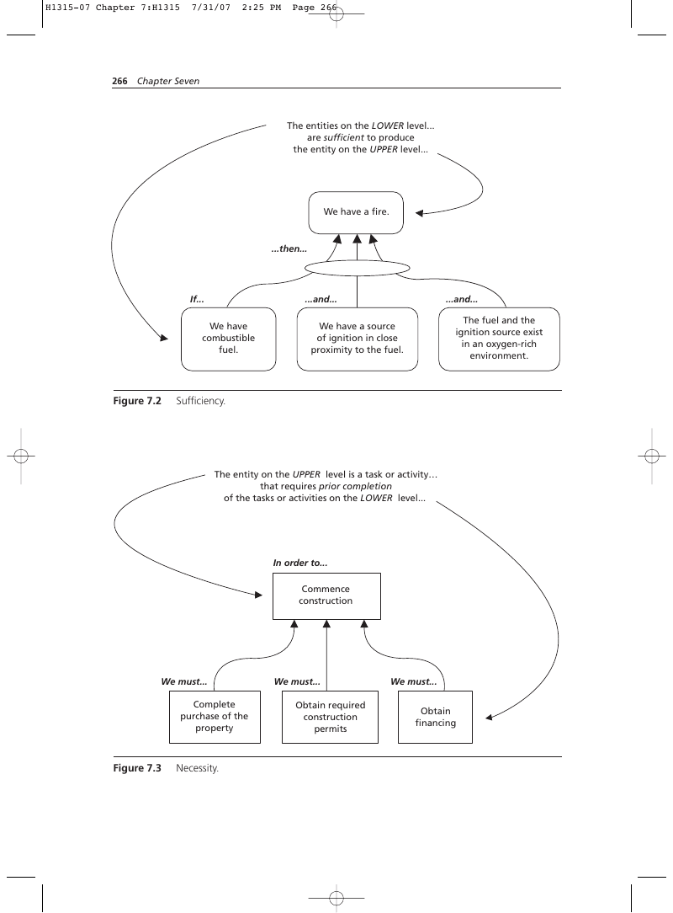

The entities on the LOWER level... are sufficient to produce the entity on the UPPER level...

We have a fire.

...then...

If...

...and...

We have combustible fuel.

Figure 7.2

...and... The fuel and the ignition source exist in an oxygen-rich environment.

We have a source of ignition in close proximity to the fuel.

Sufficiency.

The entity on the UPPER level is a task or activity… that requires prior completion of the tasks or activities on the LOWER level...

In order to... Commence

construction

We must... Complete

purchase of the property

Figure 7.3

Necessity.

We must... Obtain required construction permits

We must... Obtain

financing

The PRT reflects necessity—the minimum requirements for going ahead to the next step—not sufficiency. To reach the outcome, or result, of having a house built and ready for occupancy, we need much more than just the minimum (a lot, cement, steel, and lumber). We also must provide money, nails, roofing material, drywall, electrical wiring and fixtures, plumbing, flooring, and paint. You must also provide other factors as well (plans, tools, skill, time, and so forth) to be able to say, “This is sufficient to have a house.”

**REMEMBER:** The necessity concept of a Prerequisite Tree answers the question, “What keeps me from achieving (not having) my objective or IO?” Continuing the analogy from above, “To complete this house, what must I do or have that I haven’t done, or don’t have now?” That’s the difference between sufficiency and necessity.

#### Depicting a Prerequisite Tree

With the exception of the Intermediate Objectives Map (which is really a simplified form of Prerequisite Tree), the PRT requires fewer symbols than any of the other trees:

- The Objective. A rectangle at the very top of the tree signifying the outcome of all activities indicated by intermediate objectives. (Distinguish the objective from IOs in some way, by a different color/shade, or a heavier border, or both.)
- Intermediate Objectives. Rectangles arranged in a vertical hierarchy, indicating the activities or tasks that are components of the effort to achieve the objective.
- Obstacles. Octagons (“STOP” signs, because they can stop progress if not overcome*) reflect obstacles that can frustrate progress toward the objective. Notice that where obstacles exist, one or more IOs are collocated to overcome them. The IOs are positioned to partially overlay the obstacle, conveying the idea that the IO overcomes the obstacle.
- Necessary Condition Arrows. Arrows connecting the IOs (not the obstacles) from bottom to top. The direction of flow indicated by the arrows reflects the sequence in which the IOs must be performed.

#### The Objective

Construction of a PRT is a little like peeling the layers of an onion: we start with the end in mind, as Stephen Covey would say,1:95 and work our way backward to the beginning. The end, in our case, is the objective of the PRT. Usually, this is the completed implementation of an injection from a Future Reality Tree (see Figure 7.4). Notice that the PRT is appended to the FRT at the point of the injection. Many, if not most, of the injections in your FRT will have PRTs appended to them. You won’t show them in the FRT itself, but the connections will be there just the same. The execution of a Future Reality Tree is accomplished by the completion of injections, which are themselves the outcome of the component detailed activities reflected in the PRT.** It doesn’t always work this way, however. You will undoubtedly find situations where the PRT is an appropriate stand-alone tool, the one you would go to first. There might not be a Future Reality Tree involved at all. Whether you call it an injection or not, the objective of the PRT is the common beginning for constructing a PRT. * I’m indebted to Dr. Paul Selden for suggesting the idea of octagons to represent Obstacles and having Intermediate Objectives overlay part of the Obstacle to suggest “overcoming” them. ** Conceptually, the tasks and activities in a PRT require “hands-on” action to complete, but once the objective of the PRT—the injection—is achieved, the cause-and-effect reflected in the FRT should unfold automatically, like dominoes falling, all the way to the Desired Effects.

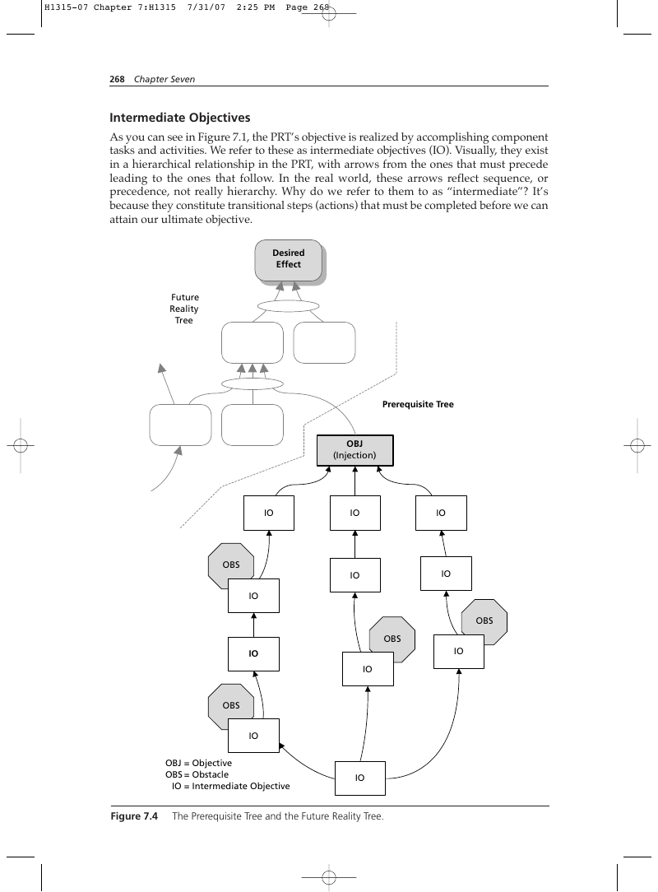

#### Intermediate Objectives

As you can see in Figure 7.1, the PRT’s objective is realized by accomplishing component tasks and activities. We refer to these as intermediate objectives (IO). Visually, they exist in a hierarchical relationship in the PRT, with arrows from the ones that must precede leading to the ones that follow. In the real world, these arrows reflect sequence, or precedence, not really hierarchy. Why do we refer to them to as “intermediate”? It’s because they constitute transitional steps (actions) that must be completed before we can attain our ultimate objective. Desired Effect Future Reality Tree Prerequisite Tree OBJ

(Injection)

IO

IO

IO

IO

IO OBS

IO OBS OBS

IO

IO IO OBS

IO OBJ = Objective OBS = Obstacle IO = Intermediate Objective

Figure 7.4

IO

The Prerequisite Tree and the Future Reality Tree.

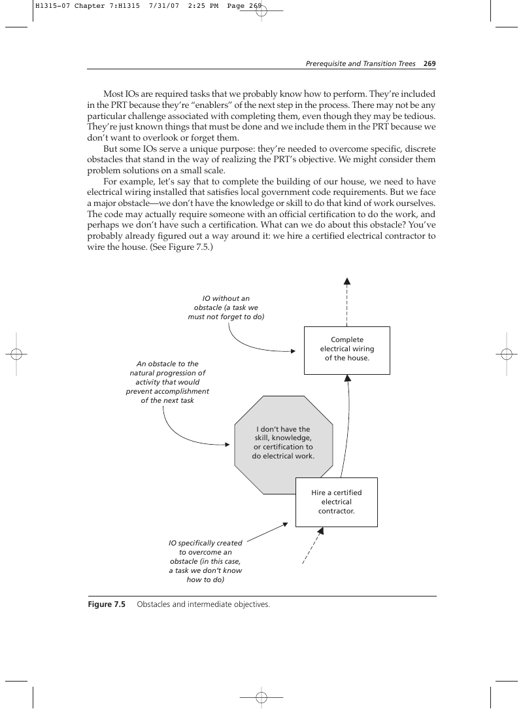

Most IOs are required tasks that we probably know how to perform. They’re included in the PRT because they’re “enablers” of the next step in the process. There may not be any particular challenge associated with completing them, even though they may be tedious. They’re just known things that must be done and we include them in the PRT because we don’t want to overlook or forget them. But some IOs serve a unique purpose: they’re needed to overcome specific, discrete obstacles that stand in the way of realizing the PRT’s objective. We might consider them problem solutions on a small scale. For example, let’s say that to complete the building of our house, we need to have electrical wiring installed that satisfies local government code requirements. But we face a major obstacle—we don’t have the knowledge or skill to do that kind of work ourselves. The code may actually require someone with an official certification to do the work, and perhaps we don’t have such a certification. What can we do about this obstacle? You’ve probably already figured out a way around it: we hire a certified electrical contractor to wire the house. (See Figure 7.5.)

IO without an obstacle (a task we must not forget to do) Complete

electrical wiring of the house.

An obstacle to the natural progression of activity that would prevent accomplishment of the next task

I don’t have the skill, knowledge, or certification to do electrical work.

Hire a certified electrical contractor.

IO specifically created to overcome an obstacle (in this case, a task we don’t know how to do)

Figure 7.5

Obstacles and intermediate objectives.

#### Different Alternatives

As you develop intermediate objectives to overcome obstacles, you’ll undoubtedly find that there’s more than one way to skin the cat. In other words, two completely different and independent IOs might each effectively overcome the obstacle in question. For example, if your next intermediate objective is do something on the opposite side of a river (the obstacle), you might consider swimming, rowing a boat, or building a bridge as possible IOs to overcome the obstacle. Each alone could do the job satisfactorily. Which of several possible IOs you select should be determined by evaluating each against six criteria:

- Which is the fastest to complete?
- Which does the job most effectively?
- What is the first one that comes to mind that does the job with minimum required effectiveness?
- Which IO is the easiest to do?
- Which IO incurs the least expense?
- Which IO produces the fewest negative or collateral side effects?

#### Not Always a One-to-One Relationship

In most cases, a single IO can effectively overcome a given obstacle, but not always. Two or more may be required. If more than two are necessary, check carefully to see if there is really a sequence between one of them and the other two. If three IOs really are required to overcome one obstacle—a rare occurrence—overlap one of the IOs on another to minimize the number of connecting arrows, for visual clarity. (See Figure 7.6.)

#### Obstacles

As we just mentioned, most IOs are merely discrete tasks we must perform in a specified sequence in order to realize the PRT’s objective. But sometimes there are real, even tangible obstacles that stand in the way of completing a particular task. Some of these obstacles might include:

- Insufficient or non-existent knowledge
- Lack of adequate resources
- Laws or regulations that limit or forbid certain kinds of activity
- Human resistance There may well be others. To simplify things, we define an obstacle as something that keeps you from doing what you need to do to reach the objective, what you would otherwise be able to accomplish were the obstacle not preventing it. Clearly, in executing an injection not every component task is performed to overcome an obstacle. But failure to identify a “show-stopping” obstacle can bring execution to a complete halt. Once you’ve determined all the things you must do to reach the PRT’s objective, you should search for obstacles to completing those tasks and create work-arounds.

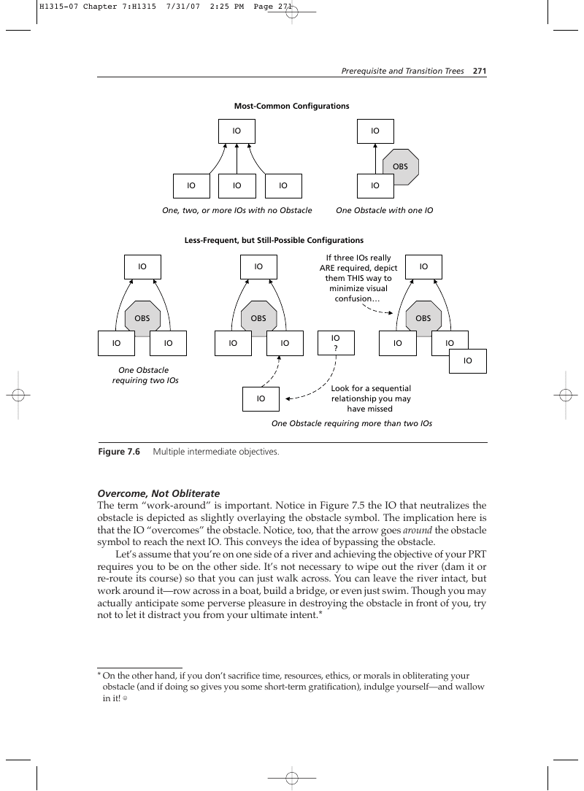

Most-Common Configurations

IO

IO OBS

IO

IO

IO

One, two, or more IOs with no Obstacle

IO One Obstacle with one IO

Less-Frequent, but Still-Possible Configurations IO

IO OBS OBS

IO

IO

If three IOs really ARE required, depict them THIS way to minimize visual confusion… requiring two IOs Look for a sequential relationship you may have missed

IO OBS

IO

IO

IO ?

IO

IO IO One Obstacle

IO

One Obstacle requiring more than two IOs

Figure 7.6

Multiple intermediate objectives.

#### Overcome, Not Obliterate

The term “work-around” is important. Notice in Figure 7.5 the IO that neutralizes the obstacle is depicted as slightly overlaying the obstacle symbol. The implication here is that the IO “overcomes” the obstacle. Notice, too, that the arrow goes around the obstacle symbol to reach the next IO. This conveys the idea of bypassing the obstacle. Let’s assume that you’re on one side of a river and achieving the objective of your PRT requires you to be on the other side. It’s not necessary to wipe out the river (dam it or re-route its course) so that you can just walk across. You can leave the river intact, but work around it—row across in a boat, build a bridge, or even just swim. Though you may actually anticipate some perverse pleasure in destroying the obstacle in front of you, try not to let it distract you from your ultimate intent.*

* On the other hand, if you don’t sacrifice time, resources, ethics, or morals in obliterating your obstacle (and if doing so gives you some short-term gratification), indulge yourself—and wallow in it! ☺

#### Enlist Assistance to Identify Obstacles

> If what you’re trying to do is complex or happens in a complex environment, you alone may not recognize all the obstacles you might be facing. It might be necessary to enlist the help of others more knowledgeable than you to identify all the obstacles. Fortunately, the PRT lends itself well to group as well as individual effort. Furthermore, don’t be too concerned if you haven’t identified all the obstacles. The beauty of the PRT is that as you and others scrutinize it, any obstacles you might have overlooked will probably jump right out at you. Obstacles are those frightful things you see when you take your eye off the goal.
>
> —Hannah More

#### A Single Tool or Part of a Set

As suggested earlier, the Prerequisite Tree need not depend on the prior completion of a Future Reality Tree. Consider the PRT as you would a hammer in a toolbox. You can use the hammer just to drive a nail to hang a picture. Or you can use it in concert with all the other tools in the box to build an entire house. Similarly, the PRT can be used either by itself to overcome routine obstacles in your daily life, or to formulate the activity network of a larger project. Or it can be used as an integral part of the entire Logical Thinking Process to resolve some complex problem and implement the solution. As we saw in Chapter 6, not all FRT injections require a PRT. Whether or not you need a PRT depends on your answer to two questions:

- Is my objective a complex condition?
- Do I already know exactly how to achieve it? If your injection is a simple, straightforward action, don’t even bother considering a PRT. But if it’s an outcome of a complex series of interdependent actions, a PRT can help you sequence all these intermediate steps. Moreover, if you don’t already know exactly how to achieve your objective—that is, there are obstacles in your way that you’re not sure how to get around—you might need a PRT to help you figure that out.

#### Intermediate Objectives: Actions or Conditions?

In the CRT and FRT, we tend to see causes and effects primarily as conditions—that is, outcomes of preceding causes. The objective of a PRT is definitely such an outcome, so it should be worded as a condition. But the intermediate objectives in a PRT are most assuredly tasks or activities, which naturally imply action. The logical flow of the PRT sounds something like this: “If we do these two IOs, then nothing stands in the way of our commencing to do the next IO.” Notice that it doesn’t say, “We have the next IO.” The only exception to the action wording is the objective. In our house construction example, the final objective would be a condition: The house is completed.

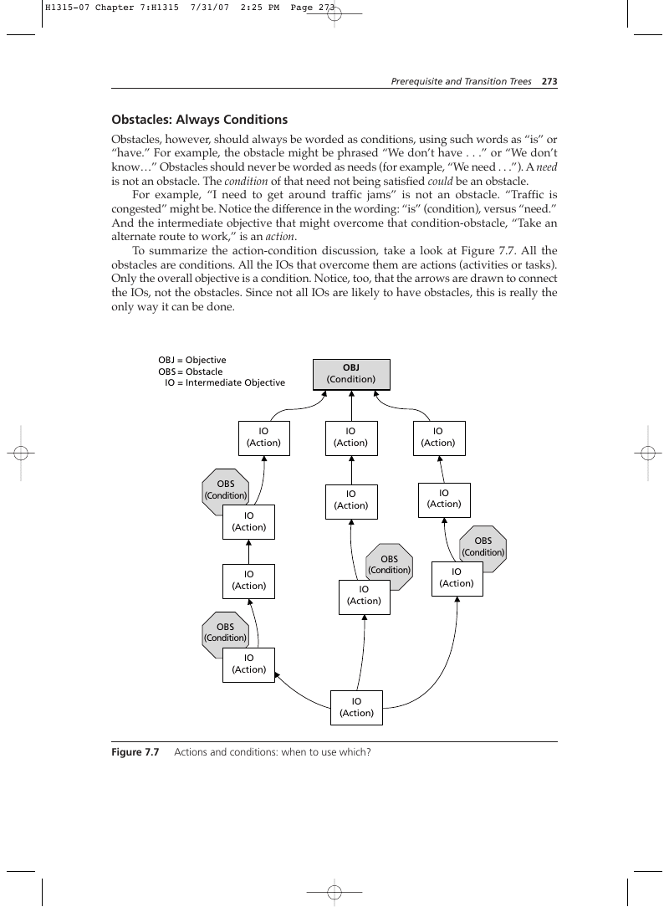

#### Obstacles: Always Conditions

Obstacles, however, should always be worded as conditions, using such words as “is” or “have.” For example, the obstacle might be phrased “We don’t have . . .” or “We don’t know…” Obstacles should never be worded as needs (for example, “We need . . .”). A need is not an obstacle. The condition of that need not being satisfied could be an obstacle. For example, “I need to get around traffic jams” is not an obstacle. “Traffic is congested” might be. Notice the difference in the wording: “is” (condition), versus “need.” And the intermediate objective that might overcome that condition-obstacle, “Take an alternate route to work,” is an action. To summarize the action-condition discussion, take a look at Figure 7.7. All the obstacles are conditions. All the IOs that overcome them are actions (activities or tasks). Only the overall objective is a condition. Notice, too, that the arrows are drawn to connect the IOs, not the obstacles. Since not all IOs are likely to have obstacles, this is really the only way it can be done. OBJ = Objective OBS = Obstacle IO = Intermediate Objective

IO (Action) OBS

(Condition) OBJ

(Condition)

IO (Action)

IO (Action)

IO (Action)

IO (Action)

IO (Action)

IO (Action) OBS

(Condition) IO (Action) OBS

(Condition) IO (Action) IO (Action)

Figure 7.7

Actions and conditions: when to use which? OBS

(Condition) IO (Action)

#### Sequence Dependency

In solving any complex problem, one of the critical questions is, “What do we do first?” The Prerequisite Tree answers this question. After identifying obstacles and ways to overcome them, the next most important function a PRT serves is sequencing these ways (intermediate objectives) in the right order. Experience over the last decade has shown that when it comes to deciding in what sequence tasks should be completed, some people have difficulty with the concept of “earlier versus later.” For example, as we’ll see when we get to the procedures for constructing a PRT, at one step in the process we’ll have a collection of individual Obstacles and IOs (that is, not yet connected to one another). We’ll have to decide which ones to place near the bottom of the tree (“earlier”) and which ones go nearer the top (“later”). Here’s an example of sequence dependency. Let’s say your objective is to attend college. Before that can happen, you must be accepted for enrollment (see Figure 7.8). But before a college accepts you, you must apply to the college and you must qualify for their acceptance. Before you can apply, you must decide which college you want to attend. Before you can decide which college to attend, you must know whether it offers the course of study you desire. Before you can determine that, you have to know what field of study you wish to pursue. Before that can happen, it would be nice to have some kind of career goal in mind. A sequence dependency exists among intermediate objectives. The more complex the problem you’re trying to solve, the more important it will be to identify and properly sequence time-dependent events. This will occur as a matter of course as you construct the PRT. The easiest way to make that distinction is to visualize the PRT as the depiction of the flow of project activities. Picture yourself a thousand feet above the activities, which are laid out like a production line. Pose the question to yourself: Which of these IOs must take place closer to the beginning of the process, and which take place nearer to completion? Viewed in this way, the proper sequence usually presents itself with no difficulty. If you’re having difficulty seeing where a particular IO fits into a given sequence, it may well be that it doesn’t fit there at all—it may be part of a different sequence in the tree. Which brings us to the topic of…

#### Parallelism

Much as production processes or projects have different activities going on simultaneously, PRTs can have them as well. In fact, such parallelism is desirable because it can shorten the duration of solution implementation if different components can be executed by different people at the same time. While it isn’t unusual to have a simple PRT with a single “branch” or sequence of IOs, it’s more common to see multiple branches in a PRT. Figure 7.9 illustrates parallelism in PRTs. In constructing your PRTs, you should make every effort to identify which sequences of IOs can be completed separately from, and one would hope, simultaneously with others. Normally, such branches are organized by function and converge at some logical integration point.

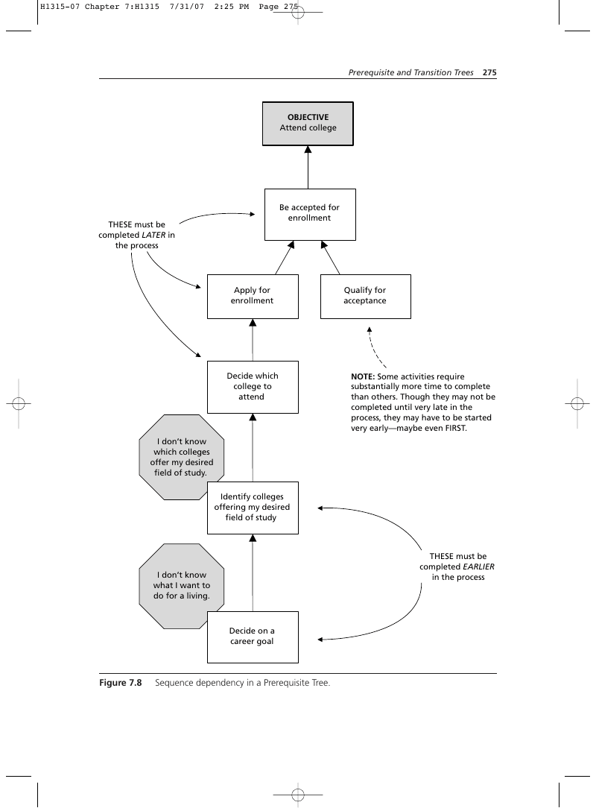

OBJECTIVE

Attend college

Be accepted for enrollment

THESE must be completed LATER in the process Apply for

enrollment

Decide which college to attend Qualify for

acceptance

**NOTE:** Some activities require substantially more time to complete than others. Though they may not be completed until very late in the process, they may have to be started very early—maybe even FIRST.

I don’t know which colleges offer my desired field of study. Identify colleges offering my desired field of study

THESE must be completed EARLIER in the process

I don’t know what I want to do for a living. Decide on a

career goal

Figure 7.8

Sequence dependency in a Prerequisite Tree.

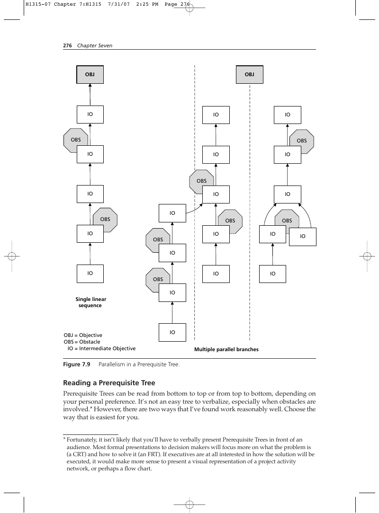

IO OBJ OBJ

IO

IO

IO OBS OBS

IO

IO

IO

IO

IO OBS

IO

IO OBS OBS

IO OBS

IO

IO

IO

IO OBS

IO

IO

IO OBS

IO Single linear sequence OBJ = Objective OBS = Obstacle IO = Intermediate Objective

Figure 7.9

IO Multiple parallel branches

Parallelism in a Prerequisite Tree.

#### Reading a Prerequisite Tree

Prerequisite Trees can be read from bottom to top or from top to bottom, depending on your personal preference. It’s not an easy tree to verbalize, especially when obstacles are involved.* However, there are two ways that I’ve found work reasonably well. Choose the way that is easiest for you. * Fortunately, it isn’t likely that you’ll have to verbally present Prerequisite Trees in front of an audience. Most formal presentations to decision makers will focus more on what the problem is (a CRT) and how to solve it (an FRT). If executives are at all interested in how the solution will be executed, it would make more sense to present a visual representation of a project activity network, or perhaps a flow chart.

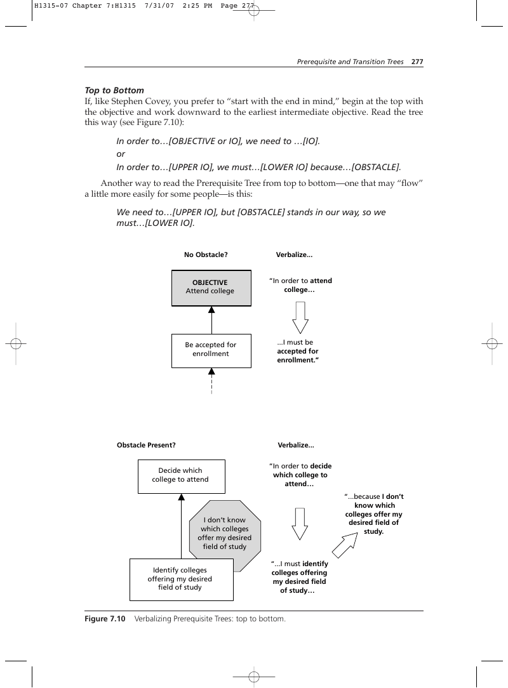

#### Top to Bottom

If, like Stephen Covey, you prefer to “start with the end in mind,” begin at the top with the objective and work downward to the earliest intermediate objective. Read the tree this way (see Figure 7.10): In order to…[OBJECTIVE or IO], we need to …[IO]. or In order to…[UPPER IO], we must…[LOWER IO] because…[OBSTACLE]. Another way to read the Prerequisite Tree from top to bottom—one that may “flow” a little more easily for some people—is this: We need to…[UPPER IO], but [OBSTACLE] stands in our way, so we must…[LOWER IO]. No Obstacle?

Verbalize... OBJECTIVE

Attend college

“In order to attend college…

Be accepted for enrollment

...I must be accepted for enrollment.” Obstacle Present?

Verbalize...

Decide which college to attend

“In order to decide which college to attend… “...because I don’t know which colleges offer my desired field of study.

I don’t know which colleges offer my desired field of study Identify colleges offering my desired field of study

Figure 7.10

“...I must identify colleges offering my desired field of study…

Verbalizing Prerequisite Trees: top to bottom.

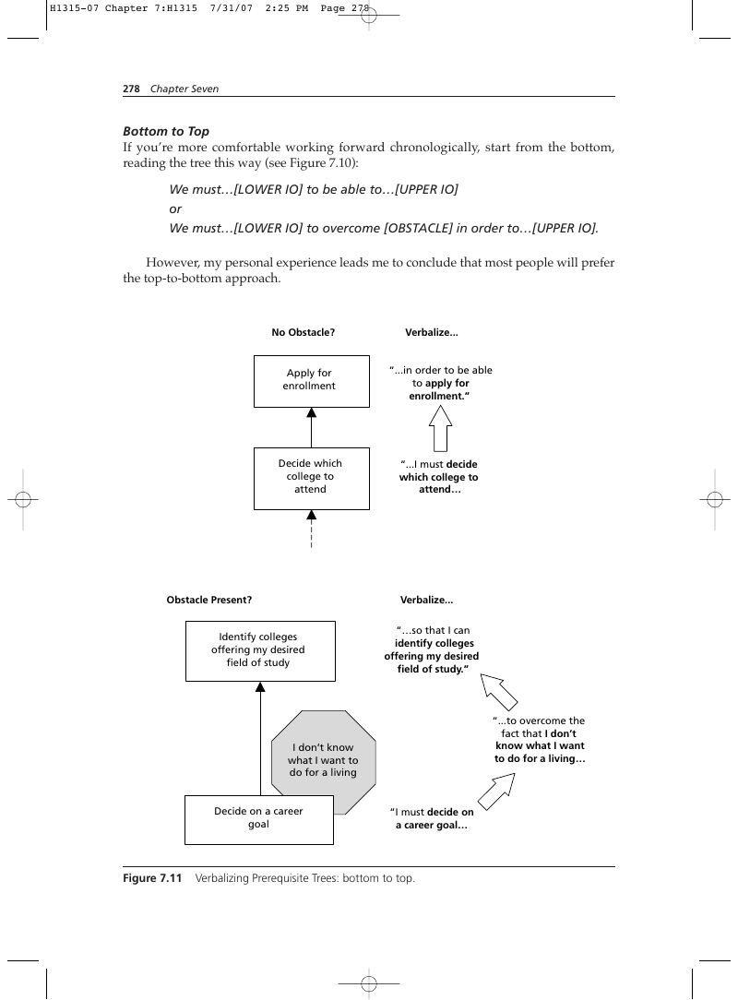

#### Bottom to Top

If you’re more comfortable working forward chronologically, start from the bottom, reading the tree this way (see Figure 7.10): We must…[LOWER IO] to be able to…[UPPER IO] or We must…[LOWER IO] to overcome [OBSTACLE] in order to…[UPPER IO]. However, my personal experience leads me to conclude that most people will prefer the top-to-bottom approach. No Obstacle?

Verbalize... Apply for

enrollment

“...in order to be able to apply for enrollment.”

Decide which college to attend

“...I must decide which college to attend…

Verbalize... Obstacle Present?

Identify colleges offering my desired field of study

“…so that I can identify colleges offering my desired field of study.”

“...to overcome the fact that I don’t know what I want to do for a living…

I don’t know what I want to do for a living

Decide on a career goal

Figure 7.11

“I must decide on a career goal…

Verbalizing Prerequisite Trees: bottom to top.

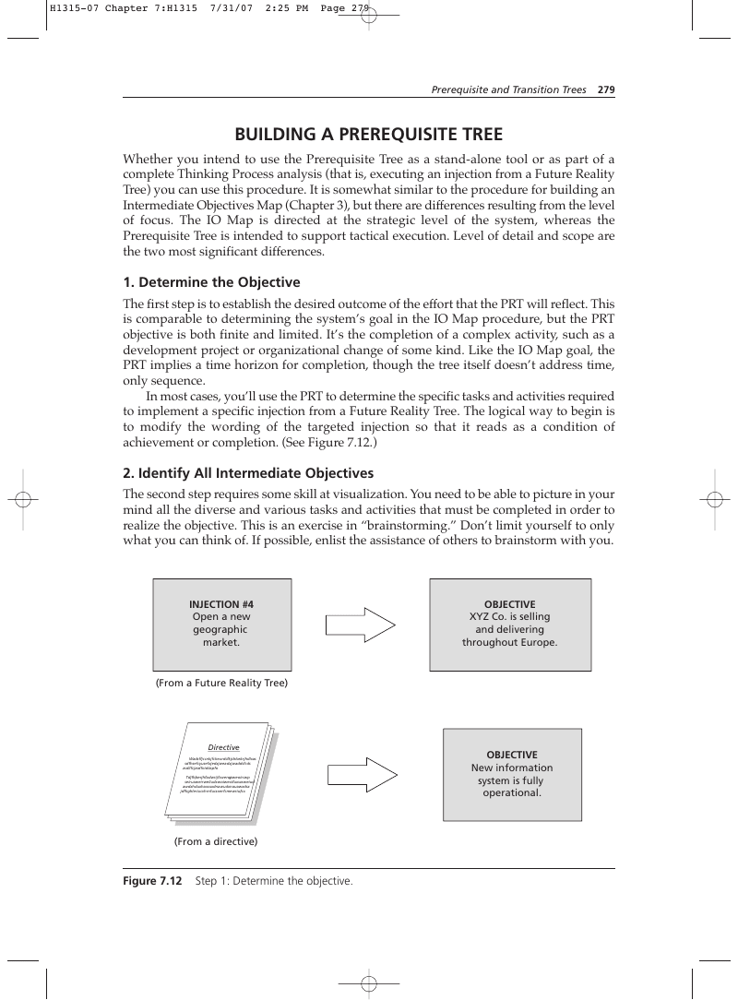

### Building a Prerequisite Tree

Whether you intend to use the Prerequisite Tree as a stand-alone tool or as part of a complete Thinking Process analysis (that is, executing an injection from a Future Reality Tree) you can use this procedure. It is somewhat similar to the procedure for building an Intermediate Objectives Map (Chapter 3), but there are differences resulting from the level of focus. The IO Map is directed at the strategic level of the system, whereas the Prerequisite Tree is intended to support tactical execution. Level of detail and scope are the two most significant differences.

1. Determine the Objective The first step is to establish the desired outcome of the effort that the PRT will reflect. This is comparable to determining the system’s goal in the IO Map procedure, but the PRT objective is both finite and limited. It’s the completion of a complex activity, such as a development project or organizational change of some kind. Like the IO Map goal, the PRT implies a time horizon for completion, though the tree itself doesn’t address time, only sequence. In most cases, you’ll use the PRT to determine the specific tasks and activities required to implement a specific injection from a Future Reality Tree. The logical way to begin is to modify the wording of the targeted injection so that it reads as a condition of achievement or completion. (See Figure 7.12.)
2. Identify All Intermediate Objectives The second step requires some skill at visualization. You need to be able to picture in your mind all the diverse and various tasks and activities that must be completed in order to realize the objective. This is an exercise in “brainstorming.” Don’t limit yourself to only what you can think of. If possible, enlist the assistance of others to brainstorm with you.

INJECTION #4 Open a new geographic market. OBJECTIVE

XYZ Co. is selling and delivering throughout Europe.

(From a Future Reality Tree) Directive Wadsffjccnkjfckeurdsfkjshlsekrjhdlxas

sdfhsefcyusefxjedxjweadxjwaddsfcds zsdilfcjzsdfoidsispfo Tdjfhl;serjhfadwrijfcweroc ,pweoircwp seiruaweirweliudxwoiwexifuxwxweiud awdxhduxhawuxdnawudxnauawxdsx jdfkghleriucvhrnfucsoerfcmewriufcx ,

(From a directive)

Figure 7.12

Step 1: Determine the objective. OBJECTIVE

New information system is fully operational.

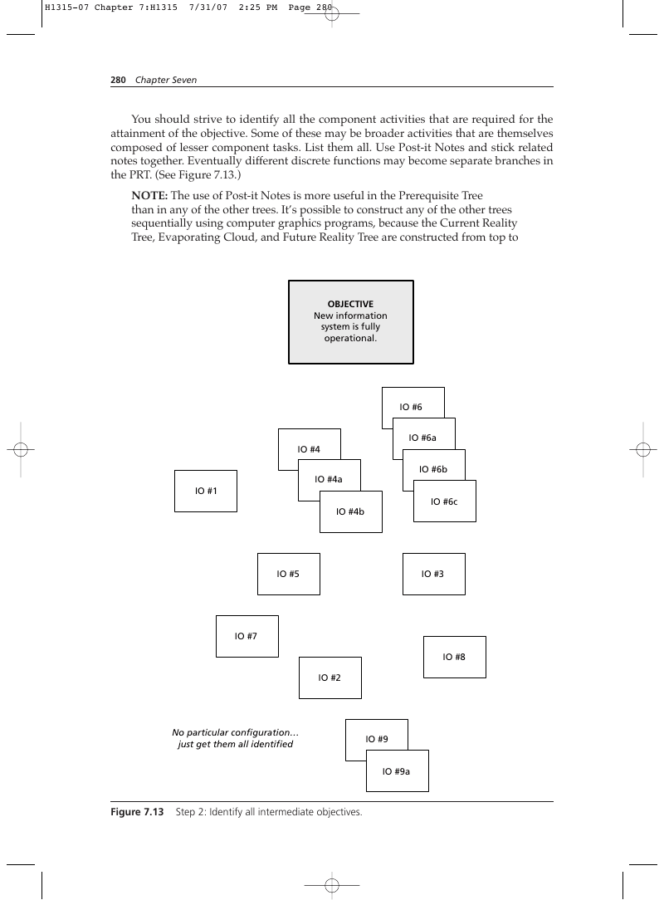

You should strive to identify all the component activities that are required for the attainment of the objective. Some of these may be broader activities that are themselves composed of lesser component tasks. List them all. Use Post-it Notes and stick related notes together. Eventually different discrete functions may become separate branches in the PRT. (See Figure 7.13.)

**NOTE:** The use of Post-it Notes is more useful in the Prerequisite Tree than in any of the other trees. It’s possible to construct any of the other trees sequentially using computer graphics programs, because the Current Reality Tree, Evaporating Cloud, and Future Reality Tree are constructed from top to

OBJECTIVE

New information system is fully operational.

IO #6 IO #6a IO #4 IO #6b IO #4a IO #1 IO #6c IO #4b bottom an entity at a time, or from bottom to top. The PRT is the only one in which you first create a large number of entities, then piece them together, like a jigsaw puzzle. For this reason, the flexibility of being able to move Post-it Notes around is invaluable. It’s possible to build a PRT initially from scratch on a computer, but for most people it’s much more cumbersome (and slower) that way. Once the PRT pieces are in place on Post-it Notes, data entry into a flowcharting program goes much more quickly. When you think you’ve identified all the IOs you can, go on to the next step.

IO #5

IO #3

IO #7 IO #8 IO #2

No particular configuration… just get them all identified

IO #9

IO #9a

Figure 7.13

Step 2: Identify all intermediate objectives.

1. Surface All Possible Obstacles Examine each Intermediate Objective you identified in Step 2. Are there any that seem obviously difficult? By difficult, I mean:
- You aren’t sure how to do the required task
- Some external factor might intervene to delay or stop progress
- Required resources are unavailable to you
- You don’t know where the resources will come from
- You don’t know all of the critical inputs for the IO As you think of obstacles, write them on Post-it Notes, preferably of a different color than the IOs. Attach the obstacle Post-it Notes to the IO notes they obstruct. (See Figure 7.14.)

**NOTE:** Don’t try to contrive an obstacle for every intermediate objective. Not every IO will have one, so don’t create more work for yourself or complicate the visual impression of the PRT by trying for “artificial symmetry.” As Goldratt originally conceived the PRT, it was only intended to identify and overcome implementation obstacles. In this generation of the PRT, we are striving to make it as complete as possible, so we’re including among the IOs tasks and activities that are necessary to achieving the objective but which may not have any obstacle to their completion. It may be that your PRT has few obstacles—possibly even none, though that would be unusual. The only determinant for how many real obstacles you have is the reality of your situation.

1. Organize the Intermediate Objectives and Obstacles Now that most of the pieces are on the board, it’s time to organize them. This requires some intuitive and inductive thinking. Picture yourself viewing the implementation unfolding from a high altitude. Consider all the activities or tasks in the aggregate. Sort the IOs and obstacles into functional categories. For commercial companies, these categories might be marketing/sales, production, supply chain, distribution, or human resources. Or they might be hardware, software, training, compensation, or any number of other types of categories. What you’re trying to do is find an “umbrella” under which to classify kindred IOs and obstacles. The actual categories will depend on the situation you’re modeling. If all else fails, try three categories called “means, method, and motivation.” Or combinations of any of the above.

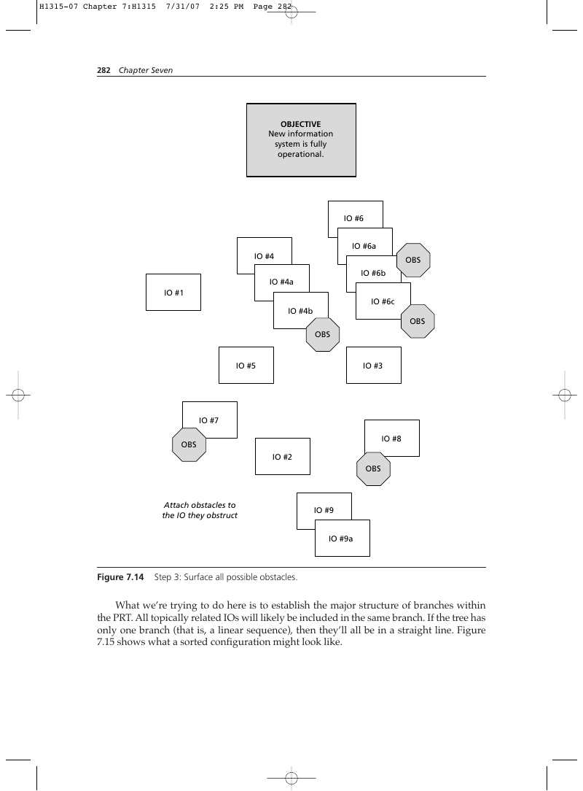

OBJECTIVE

New information system is fully operational.

IO #6 IO #6a IO #4 OBS

IO #6b

IO #4a IO #1 IO #6c IO #4b OBS OBS

IO #5

IO #3

IO #7 IO #8 OBS

IO #2 OBS

Attach obstacles to the IO they obstruct

IO #9

IO #9a

Figure 7.14

Step 3: Surface all possible obstacles.

What we’re trying to do here is to establish the major structure of branches within the PRT. All topically related IOs will likely be included in the same branch. If the tree has only one branch (that is, a linear sequence), then they’ll all be in a straight line. Figure 7.15 shows what a sorted configuration might look like.

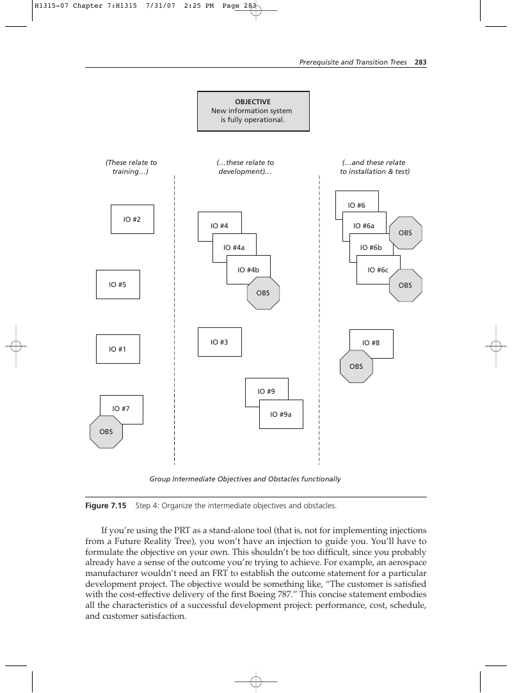

OBJECTIVE

New information system is fully operational.

(These relate to training…)

(…these relate to development)…

(…and these relate to installation & test)

IO #6 IO #2

IO #4

IO #6a OBS

IO #4a

IO #6b

IO #4b

IO #6c

IO #5 OBS OBS

IO #3

IO #8

IO #1 OBS

IO #9 IO #7

IO #9a OBS

Group Intermediate Objectives and Obstacles functionally

Figure 7.15

Step 4: Organize the intermediate objectives and obstacles.

If you’re using the PRT as a stand-alone tool (that is, not for implementing injections from a Future Reality Tree), you won’t have an injection to guide you. You’ll have to formulate the objective on your own. This shouldn’t be too difficult, since you probably already have a sense of the outcome you’re trying to achieve. For example, an aerospace manufacturer wouldn’t need an FRT to establish the outcome statement for a particular development project. The objective would be something like, “The customer is satisfied with the cost-effective delivery of the first Boeing 787.” This concise statement embodies all the characteristics of a successful development project: performance, cost, schedule, and customer satisfaction.

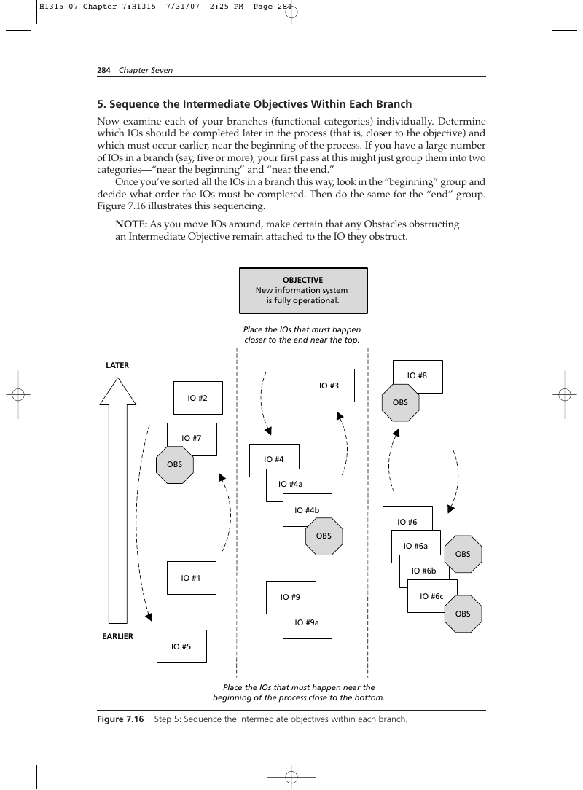

#### 5. Sequence the Intermediate Objectives Within Each Branch

Now examine each of your branches (functional categories) individually. Determine which IOs should be completed later in the process (that is, closer to the objective) and which must occur earlier, near the beginning of the process. If you have a large number of IOs in a branch (say, five or more), your first pass at this might just group them into two categories—“near the beginning” and “near the end.” Once you’ve sorted all the IOs in a branch this way, look in the “beginning” group and decide what order the IOs must be completed. Then do the same for the “end” group. Figure 7.16 illustrates this sequencing.

**NOTE:** As you move IOs around, make certain that any Obstacles obstructing an Intermediate Objective remain attached to the IO they obstruct.

OBJECTIVE

New information system is fully operational.

Place the IOs that must happen closer to the end near the top. LATER

IO #8 IO #3 IO #2 OBS

IO #7 OBS

IO #4 IO #4a IO #4b IO #6 OBS

IO #6a OBS

IO #6b

IO #1 IO #9

IO #6c OBS

IO #9a EARLIER

IO #5

Place the IOs that must happen near the beginning of the process close to the bottom.

Figure 7.16

Step 5: Sequence the intermediate objectives within each branch.

Notice that up to this point there are not yet any arrows in the PRT. For now, we’re merely trying to arrange the pieces of the puzzle in the proper configuration.

1. Connect the Intermediate Objectives Now it’s time to finalize coherent branches. Start at the top and work downward. Ignore the objective for the moment—we’re concerning ourselves only with the IOs for now. Connect the top IO with the one below it (the arrow flows from bottom to top). Evaluate that connection using the following criteria:
- Does the lower IO indicate the task that must immediately precede the upper IO?
- Is some other previously unstated intermediate task/activity missing (vertically)?
- Does the completion of that lower IO mean that nothing else (laterally) stands in the way of commencing the upper IO? If needed, create another IO for the missing task or activity.
- Is there any previously unstated obstacle to completing the newly added IO? Repeat this process for each layer of IOs, from top to bottom in the branch. (See Figure 7.17.)
1. Overcome the Obstacles Notice that so far we haven’t done anything about the obstacles except to move them around with the intermediate objectives they obstruct. That’s about to change. Now it’s time to overcome the known obstacles. It should be obvious that an obstacle to completing a particular IO must be overcome by doing something prior to the obstructed IO. Your choice of what to do to overcome an obstacle will be informed by the nature of the situation (the IO obstructed) and the technical, economic, and political realities of your environment. It may also be constrained (or liberated) by your creativity. Once again, as with injections in an Evaporating Cloud or Future Reality Tree, determining IOs to overcome obstacles is an exercise in creativity. Don’t hesitate to bring the knowledge and creativity of others into the challenge.* “Brainstorm” as many ideas as you can, then select the best one according to some decision rule. You might choose the “best” by whatever standard you like:
- Easiest to do
- Incurs the least expense
- Fastest to complete
- Does the job most effectively
- First one that comes to mind that does the job with minimum required effectiveness.
- Produces the fewest negative or collateral side effects

* Consider the Crawford Slip Method, a proven technique that gathers many ideas quickly, independently, and anonymously, and one that can be conducted simultaneously at different locations. Refer to Dettmer, Brainpower Networking Using the Crawford Slip Method.2

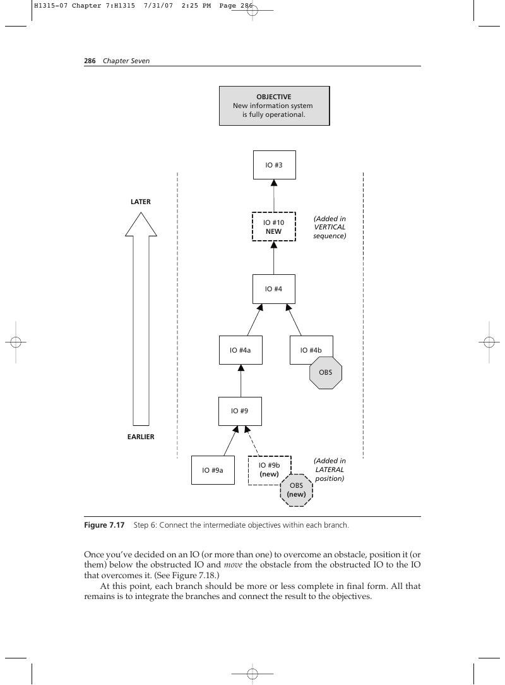

OBJECTIVE

New information system is fully operational.

IO #3 LATER (Added in VERTICAL

sequence)

IO #10 NEW

IO #4

IO #4a

IO #4b OBS

IO #9 EARLIER

IO #9a (Added in LATERAL

position)

IO #9b (new) OBS

(new)

Figure 7.17

Step 6: Connect the intermediate objectives within each branch.

Once you’ve decided on an IO (or more than one) to overcome an obstacle, position it (or them) below the obstructed IO and move the obstacle from the obstructed IO to the IO that overcomes it. (See Figure 7.18.) At this point, each branch should be more or less complete in final form. All that remains is to integrate the branches and connect the result to the objectives.

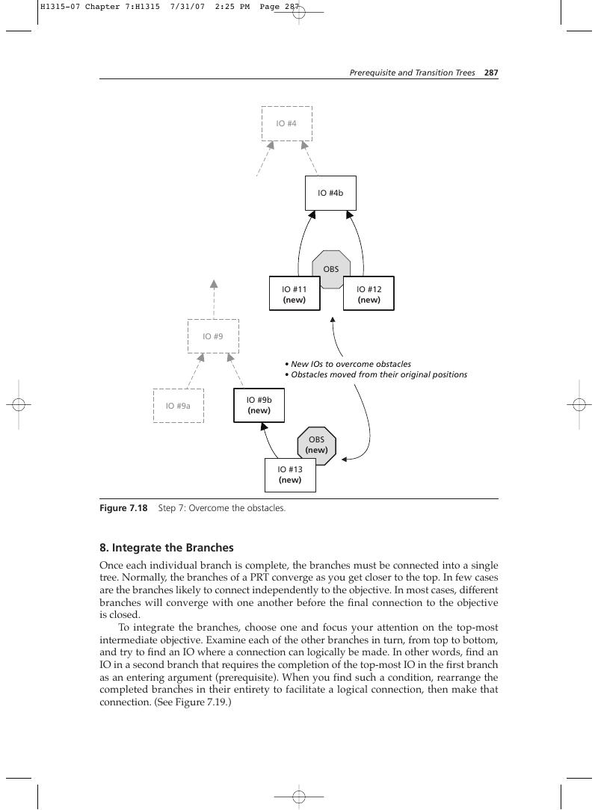

IO #4

IO #4b OBS

IO #11 (new)

IO #12 (new)

IO #9

- New IOs to overcome obstacles
- Obstacles moved from their original positions

IO #9a

IO #9b (new) OBS

(new) IO #13 (new)

Figure 7.18

Step 7: Overcome the obstacles.

#### 8. Integrate the Branches

Once each individual branch is complete, the branches must be connected into a single tree. Normally, the branches of a PRT converge as you get closer to the top. In few cases are the branches likely to connect independently to the objective. In most cases, different branches will converge with one another before the final connection to the objective is closed. To integrate the branches, choose one and focus your attention on the top-most intermediate objective. Examine each of the other branches in turn, from top to bottom, and try to find an IO where a connection can logically be made. In other words, find an IO in a second branch that requires the completion of the top-most IO in the first branch as an entering argument (prerequisite). When you find such a condition, rearrange the completed branches in their entirety to facilitate a logical connection, then make that connection. (See Figure 7.19.)

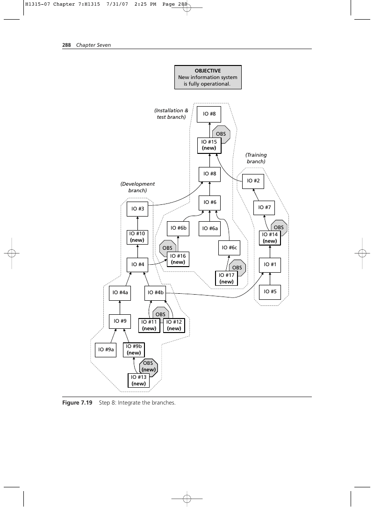

OBJECTIVE

New information system is fully operational. (Installation &

test branch)

IO #8 OBS

IO #15 (new) (Training

branch) IO #8 IO #2 (Development

branch) IO #6

IO #7

IO #3

IO #6b OBS

IO #14 (new)

IO #6a

IO #10 (new) OBS

IO #16 (new)

IO #4

IO #4a

IO #9

IO #9a OBS

IO #17 (new) IO #4b OBS

IO #11 IO #12 (new) (new)

IO #9b (new) OBS

(new) IO #13 (new)

Figure 7.19

IO #6c

Step 8: Integrate the branches.

IO #1

IO #5

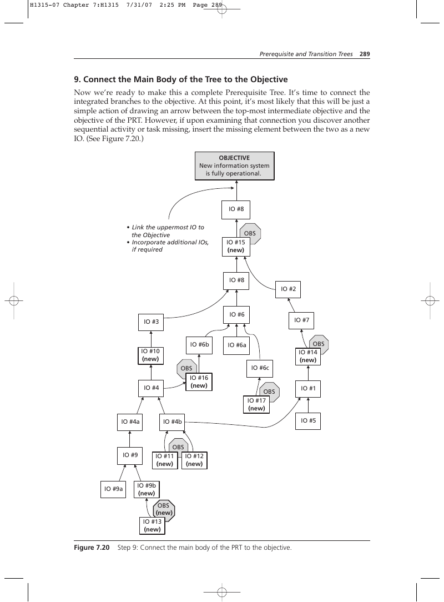

9. Connect the Main Body of the Tree to the Objective Now we’re ready to make this a complete Prerequisite Tree. It’s time to connect the integrated branches to the objective. At this point, it’s most likely that this will be just a simple action of drawing an arrow between the top-most intermediate objective and the objective of the PRT. However, if upon examining that connection you discover another sequential activity or task missing, insert the missing element between the two as a new IO. (See Figure 7.20.) OBJECTIVE

New information system is fully operational.

IO #8

- Link the uppermost IO to the Objective
- Incorporate additional IOs, if required

OBS

IO #15 (new)

IO #8 IO #2

IO #6

IO #7

IO #3

IO #6b OBS

IO #14 (new)

IO #6a

IO #10 (new) OBS

IO #16 (new)

IO #4

IO #4a

IO #9

IO #9a

IO #6c OBS

IO #17 (new) IO #4b OBS

IO #11 IO #12 (new) (new)

IO #9b (new) OBS

(new) IO #13 (new)

Figure 7.20

Step 9: Connect the main body of the PRT to the objective.

IO #1

IO #5

#### 10. Scrutinize the Entire Tree

When you think the Prerequisite Tree is finally done, you should scrutinize it one last time. It’s often helpful to enlist the assistance of someone else with knowledge of (and interest in) the topic of the PRT. You’re looking for any IOs or obstacles you might have overlooked during construction. This is what the Air Force refers to as a “last chance” check before takeoff. Here are the format requirements you should be looking for when you scrutinize a PRT:

- Is the objective worded as a condition or outcome?
- Are all intermediate objectives worded as tasks or activities (start with an active verb)?
- Are all obstacles worded as conditions?
- Are all IOs connected by arrows to other IOs (not to obstacles)? Once you’ve verified that the PRT conforms to the proper format, you must verify its logic. The next section explains how scrutiny of a Prerequisite Tree differs from that of Current or Future Reality Trees. If your scrutiny turns up some overlooked IOs or obstacles, or if it indicates that an IO or obstacle isn’t truly necessary, make corrections to the PRT.

### Scrutinizing a Prerequisite Tree

How do we know whether the IO–obstacle relationship we (or someone else) created is valid? The answer is, “Scrutinize it,” much as you would a Current or Future Reality Tree. Does an obstacle really prevent the IO above it? Does a lower IO really overcome the obstacle above it? Have all IOs been accounted for? Unfortunately, the Categories of Legitimate Reservation (Chapter 2) were designed to verify sufficiency-type trees (that is, CRT and FRT). They ask, “Is the cause sufficient to produce the effect?” But the Prerequisite Tree, like the Evaporating Cloud, is a necessitytype tree: It identifies the conditions necessary to enable progressing to the next step as well as factors that might impede that progress. A sufficient logical relationship is expressed: If… [CAUSE], then… [EFFECT]. But a necessity-based logical relationship is expressed: In order to have … [OBJECTIVE], we must… [ACTION/ACTIVITY]. And if an obstacle is associated with the higher-level objective, we add: because of…[REASON/OBSTRUCTION]. In scrutinizing a PRT, you’re questioning whether:

- All intermediate objectives have been identified
- An obstacle really exists
- A proposed IO is likely to neutralize an obstacle. Fortunately, some of the Categories of Legitimate Reservation can be applied in a limited way to validate PRT logic.

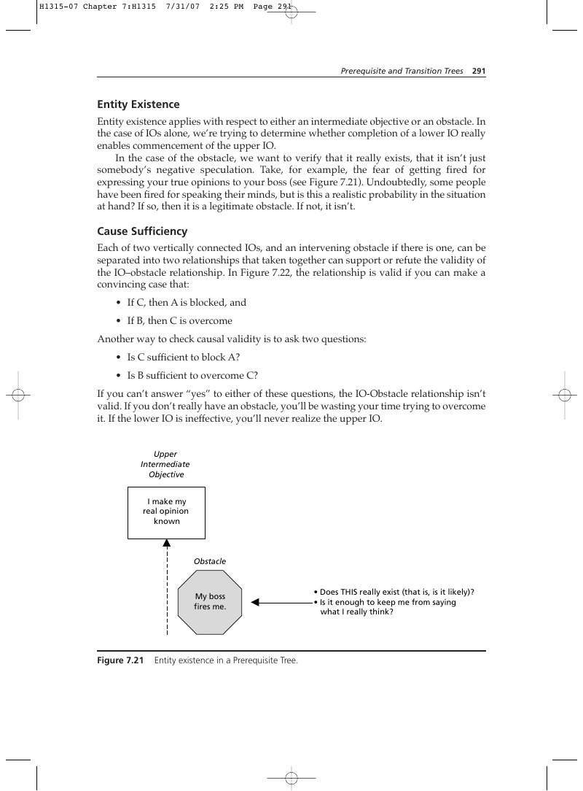

#### Entity Existence

Entity existence applies with respect to either an intermediate objective or an obstacle. In the case of IOs alone, we’re trying to determine whether completion of a lower IO really enables commencement of the upper IO. In the case of the obstacle, we want to verify that it really exists, that it isn’t just somebody’s negative speculation. Take, for example, the fear of getting fired for expressing your true opinions to your boss (see Figure 7.21). Undoubtedly, some people have been fired for speaking their minds, but is this a realistic probability in the situation at hand? If so, then it is a legitimate obstacle. If not, it isn’t.

#### Cause Sufficiency

Each of two vertically connected IOs, and an intervening obstacle if there is one, can be separated into two relationships that taken together can support or refute the validity of the IO–obstacle relationship. In Figure 7.22, the relationship is valid if you can make a convincing case that:

- If C, then A is blocked, and
- If B, then C is overcome Another way to check causal validity is to ask two questions:
- Is C sufficient to block A?
- Is B sufficient to overcome C? If you can’t answer “yes” to either of these questions, the IO-Obstacle relationship isn’t valid. If you don’t really have an obstacle, you’ll be wasting your time trying to overcome it. If the lower IO is ineffective, you’ll never realize the upper IO.

Upper Intermediate Objective

I make my real opinion known Obstacle

My boss fires me.

Figure 7.21

Entity existence in a Prerequisite Tree.

- Does THIS really exist (that is, is it likely)?
- Is it enough to keep me from saying what I really think?

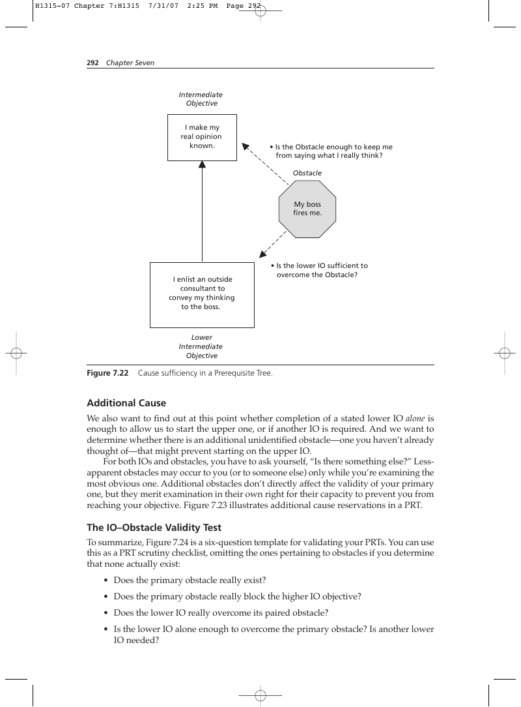

pp Intermediate Objective

I make my real opinion known.

- Is the Obstacle enough to keep me from saying what I really think?

Obstacle

My boss fires me.

I enlist an outside consultant to convey my thinking to the boss.

- Is the lower IO sufficient to overcome the Obstacle?

Lower Intermediate Objective

Figure 7.22

Cause sufficiency in a Prerequisite Tree.

#### Additional Cause

We also want to find out at this point whether completion of a stated lower IO alone is enough to allow us to start the upper one, or if another IO is required. And we want to determine whether there is an additional unidentified obstacle—one you haven’t already thought of—that might prevent starting on the upper IO. For both IOs and obstacles, you have to ask yourself, “Is there something else?” Lessapparent obstacles may occur to you (or to someone else) only while you’re examining the most obvious one. Additional obstacles don’t directly affect the validity of your primary one, but they merit examination in their own right for their capacity to prevent you from reaching your objective. Figure 7.23 illustrates additional cause reservations in a PRT.

#### The IO–Obstacle Validity Test

To summarize, Figure 7.24 is a six-question template for validating your PRTs. You can use this as a PRT scrutiny checklist, omitting the ones pertaining to obstacles if you determine that none actually exist:

- Does the primary obstacle really exist?
- Does the primary obstacle really block the higher IO objective?
- Does the lower IO really overcome its paired obstacle?
- Is the lower IO alone enough to overcome the primary obstacle? Is another lower IO needed?

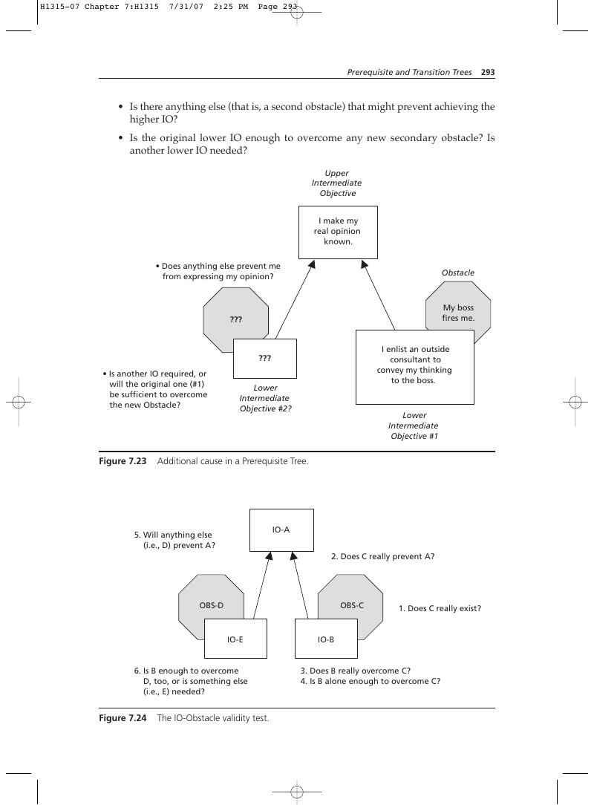

- Is there anything else (that is, a second obstacle) that might prevent achieving the higher IO?
- Is the original lower IO enough to overcome any new secondary obstacle? Is another lower IO needed?

Upper Intermediate Objective

I make my real opinion known.

- Does anything else prevent me from expressing my opinion?

Obstacle

My boss fires me.

???

I enlist an outside consultant to convey my thinking to the boss.

???

- Is another IO required, or will the original one (#1) be sufficient to overcome the new Obstacle?

Figure 7.23 Lower Intermediate

Objective #2? Lower Intermediate

Objective #1

Additional cause in a Prerequisite Tree.

### Io-a

1. Will anything else (i.e., D) prevent A?
2. Does C really prevent A?

### Obs-c Obs-d Io-e

1. Is B enough to overcome D, too, or is something else (i.e., E) needed?

Figure 7.24

The IO-Obstacle validity test.

1. Does C really exist?

IO-B

1. Does B really overcome C?
2. Is B alone enough to overcome C?

### The Transition Tree

When Goldratt originally conceived the Logical Thinking Process in the early 1990s, he introduced five different trees intended, collectively, to answer three questions about effecting change in systems:

- What to change?
- What to change to?
- How to make the change happen? To answer the first question, Goldratt offered the Current Reality Tree. The second was addressed by a combination of the Evaporating Cloud (for idea generation) and the Future Reality Tree (for validating and “bullet-proofing” ideas). The third question was supposed to be answered by the Prerequisite and Transition Trees.

#### A Little History

Originally, the function of the Prerequisite Tree was only to identify obstacles to implementation and create ways to overcome them. Goldratt intended the step-by-step details of implementation to be developed in another cause-and-effect tree, a Transition Tree, which was meant to achieve what the name implies—transition from the current state to a future state. The first edition of this book adhered to this process. But in teaching and practicing the Logical Thinking Process between 1996 and 2006, I observed that most students and clients had no patience for creating detailed Transition Trees to “flesh out” the detail that had been omitted from a Prerequisite Tree. In fact, as I observed students constructing their Prerequisite Trees, I noticed that they tended to include considerably more detail than just obstacles and the intermediate objectives needed to overcome them. In fact, some solution implementations, though somewhat complex in activities, had few (or sometimes no) obstacles at all. The primary challenge in these cases seemed to be proper sequencing of tasks and activities that the users already knew how to do. I noticed another phenomenon, too. People tend to be slaves to format and structure, especially when learning and applying a new skill. My students were contriving obstacles (that weren’t really obstacles) just to have something to pair with intermediate objectives they knew had to be completed to achieve FRT injections. They were “garbaging up” their PRT with unnecessary detail that only contributed to sensory overload. In other words, they tended to get away from Goldratt’s original intention for the Transition Tree by inadvertently incorporating its details into the Prerequisite Tree, so naturally the Transition Tree seemed redundant to them. After swimming against this stream for several years, I began to see that for most people, the Transition Tree was superfluous. It seemed to have become a convoluted way of creating work-task instructions and explaining to people why they needed to do each step in sequence. But in nearly all cases, my clients and students were working professionals. They knew their jobs and systems very well. It wasn’t necessary to build a tree that explained how and why individual tasks needed to be done. They already knew or recognized that. Moreover, there are far superior tools to a Transition Tree for generating work-task instructions.*2 I began to look for an alternative to the Transition Tree.

* The Crawford Slip Method is probably the best tool ever developed for creating coherent task instructions.

The obvious solution was to augment the Prerequisite Tree. Instead of merely including known obstacles to implementation and the ways to overcome them, why not put in all the key tasks and activities required to achieve a PRT objective? Many of these tasks would not have obstacles associated with them, yet they needed to be properly sequenced with the ones that did. The net result of doing this would be a single logic tree that would guide implementation. After trying this out with students several times, I discovered that a robust PRT was more than an adequate stand-alone implementation tool—it was also more flexible and effective than any Transition Tree I’d ever seen. Moreover, students and clients alike embraced it much more willingly. They appreciated a “big picture” opportunity to implement an injection on one or two pages, rather than spread across two different trees that used different logic (necessity for one, sufficiency for another). Basically, a single, detailed PRT was easier for them to “get their arms around.” Finally, without the baggage of a Transition Tree, it was easier to get students and clients alike to visualize implementation (PRTs) as being “appended” to the FRT at the injections. Any visualization that improves people’s ability to see details as an integral part of a larger system is always beneficial. Finally, accepting the idea of a more detailed PRT facilitates the most important benefit of all. If you have a PRT that includes all the indispensable tasks and activities networked together in parallel and in sequence, whether they have Obstacles associated with them or not, you have the “skeleton” of a project activity network. A robust PRT, with all the Obstacles set aside (leaving only the Intermediate Objectives and the Injection), can be rotated ninety degrees and converted into a Program Evaluation and Review Technique (PERT) chart. This is the first step in “projectizing” implementation (that is, establishing performance, cost, schedule, and accountability for a “deliverable”). Figure 7.25 illustrates how such a conversion might be done. For this edition of the book, I have eliminated the step-by-step explanation of how to construct a Transition Tree. Instead, as a matter of historical perspective, I’ve included a brief description of what a Transition Tree looks like and why it was structured that way. Readers who have a burning desire to learn how to construct Transition Trees are welcome to contact me directly.

#### Prerequisite Tree and Transition Tree: Original Concept

Goldratt’s original concept for implementing changes (injections) created in a Future Reality Tree was two-fold. First, determine what obstacles stand in the way of effecting change and neutralize them. Second, identify all the step-by-step actions required to fully implement an injection. Since there usually aren’t many true obstacles to implementation, Prerequisite Trees were sparse. But since there was much more to implementation than merely removing obstacles, Transition Trees could be detailed, especially if a particular injection turned out to be fairly complex. Figure 7.26 shows the relationship between a PRT and a TT. It’s clear from Figure 7.26 that there is significant “developmental” work involved in constructing a Transition Tree. Even with the IOs identified in a PRT as a starting point, a lot of interpolation and “fleshing out” is required.

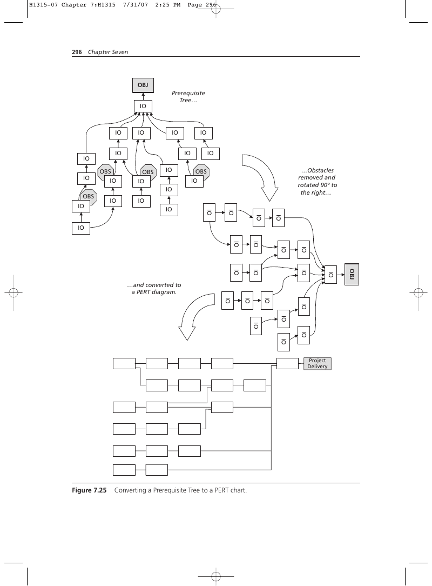

OBJ

IO

IO

IO Prerequisite Tree…

IO IO

IO

IO OBS

IO OBS

IO

IO

IO

IO …Obstacles

removed and rotated 90º to the right… OBS

IO

IO IO OBS

IO

IO IO

IO

IO

IO

IO

IO

IO

IO

IO

IO

IO

IO

IO IO IO Project Delivery

Figure 7.25

Converting a Prerequisite Tree to a PERT chart. OBJ

IO

IO

IO

IO

IO

IO

IO

IO

…and converted to a PERT diagram.

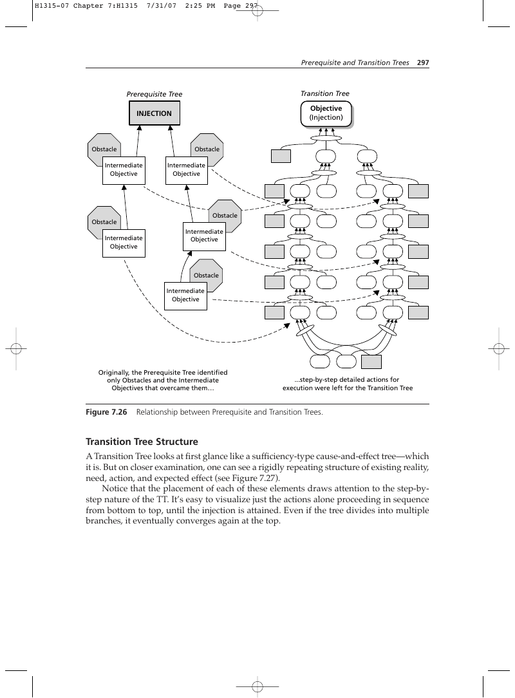

Prerequisite Tree Transition Tree

INJECTION Objective

(Injection) Obstacle Obstacle Intermediate Objective Intermediate Objective Obstacle Obstacle Intermediate Objective Intermediate Objective Obstacle Intermediate Objective

Originally, the Prerequisite Tree identified only Obstacles and the Intermediate Objectives that overcame them…

Figure 7.26

...step-by-step detailed actions for execution were left for the Transition Tree

Relationship between Prerequisite and Transition Trees.

#### Transition Tree Structure

A Transition Tree looks at first glance like a sufficiency-type cause-and-effect tree—which it is. But on closer examination, one can see a rigidly repeating structure of existing reality, need, action, and expected effect (see Figure 7.27). Notice that the placement of each of these elements draws attention to the step-bystep nature of the TT. It’s easy to visualize just the actions alone proceeding in sequence from bottom to top, until the injection is attained. Even if the tree divides into multiple branches, it eventually converges again at the top.

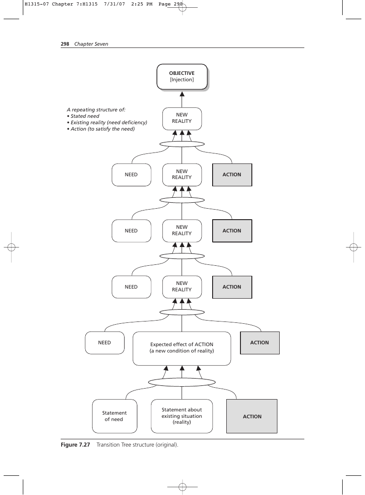

OBJECTIVE

[Injection]

A repeating structure of:

- Stated need
- Existing reality (need deficiency)
- Action (to satisfy the need)

NEED NEW REALITY ACTION NEED NEW REALITY ACTION NEED NEW REALITY ACTION NEED Statement

of need

Figure 7.27 NEW REALITY

Expected effect of ACTION (a new condition of reality)

Statement about existing situation (reality)

Transition Tree structure (original). ACTION ACTION

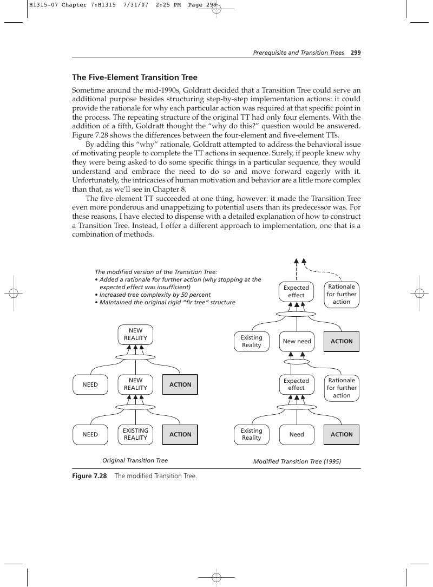

#### The Five-Element Transition Tree

Sometime around the mid-1990s, Goldratt decided that a Transition Tree could serve an additional purpose besides structuring step-by-step implementation actions: it could provide the rationale for why each particular action was required at that specific point in the process. The repeating structure of the original TT had only four elements. With the addition of a fifth, Goldratt thought the “why do this?” question would be answered. Figure 7.28 shows the differences between the four-element and five-element TTs. By adding this “why” rationale, Goldratt attempted to address the behavioral issue of motivating people to complete the TT actions in sequence. Surely, if people knew why they were being asked to do some specific things in a particular sequence, they would understand and embrace the need to do so and move forward eagerly with it. Unfortunately, the intricacies of human motivation and behavior are a little more complex than that, as we’ll see in Chapter 8. The five-element TT succeeded at one thing, however: it made the Transition Tree even more ponderous and unappetizing to potential users than its predecessor was. For these reasons, I have elected to dispense with a detailed explanation of how to construct a Transition Tree. Instead, I offer a different approach to implementation, one that is a combination of methods.

The modified version of the Transition Tree:

- Added a rationale for further action (why stopping at the expected effect was insufficient)
- Increased tree complexity by 50 percent
- Maintained the original rigid “fir tree” structure

NEW REALITY Existing Reality NEED NEW REALITY ACTION NEED EXISTING REALITY ACTION Original Transition Tree

Figure 7.28

The modified Transition Tree. Existing Reality Expected

effect Rationale

for further action

New need ACTION Expected

effect Rationale

for further action Need ACTION

Modified Transition Tree (1995)

### In Search of Robust Execution

We’ve already explored the idea of a comprehensive Prerequisite Tree, one that incorporates much more than just the identification and neutralization of obstacle. With the modified PRT as an effective roadmap, only two things remain to be done: create an execution plan and address the behavior change issues. The first of these we’ll visit here. The second is discussed in more detail in Chapter 8.

#### Managing Change as a Project

Most people are well aware that project management as a discipline is used for technical challenges such as hardware or software development or construction. It’s less obvious that the same discipline can be applied to organizational change, which is what the implementation of FRT injections really represents. Nevertheless, it’s true. A comprehensive Prerequisite Tree accomplishes the first big challenge in any change implementation: it lays out a detailed roadmap of tasks and activities that must be accomplished to achieve the desired outcome. For some changes, such as developing and introducing a new product line or spinning off part of an organization into a separate new one, the structure of tasks can be very complicated. A robust PRT is potentially a valuable starting point. As indicated in the preceding section, such a PRT lends itself very easily to conversion to a project activity network. So rather than spend time trying to plan execution in a Transition Tree, I recommend instead that you consider using accepted (and new) techniques and principles of project management.

#### Critical Chain Project Management

Successfully managing organizational change as a project first requires a well-grounded understanding of project management. The project management discipline has long been studied and developed, and other sources address the principles and techniques in much more detail than we can do here. Readers interested in applying project management are encouraged to consult these sources to educate themselves in its nuances. Several of these are cited in the endnotes at the end of this chapter.5,6,8 However, one particular project management technique is worth mentioning here for no other reason than it has proved to enhance schedule, cost, and performance reliability in projects well beyond the capability of traditional project management practices. Considering the uncertainty of the heavy behavioral component in any significant organizational change, anything that can help manage change more reliably merits consideration. This technique is Critical Chain Project Management (CCPM). As with the traditional principles and techniques of project management, there’s much more to CCPM than we can explore in a book about the Logical Thinking Process. Fortunately, there are several excellent sources3,4,7 available that explain Critical Chain Project Management in detail. For now, I’ll just summarize the technique and explain why I believe people should use it to manage change.

#### What Critical Chain Project Management Does

Since it was originally conceived as a way of scheduling and monitoring progress of complex projects in the late 1950s, project managers have used a combination of the Program Evaluation and Review Technique and Critical Path Method (PERT/CPM) to help assure effective performance, cost, and schedule adherence. But since that time, enough projects have failed in one or more of those parameters to raise the question whether the projects that succeeded did so because of PERT/CPM or in spite of it. By some estimates as many as 85 percent of projects are either over budget, delivered late, or underperforming. That leaves only about 15 percent that could be considered completely successful.

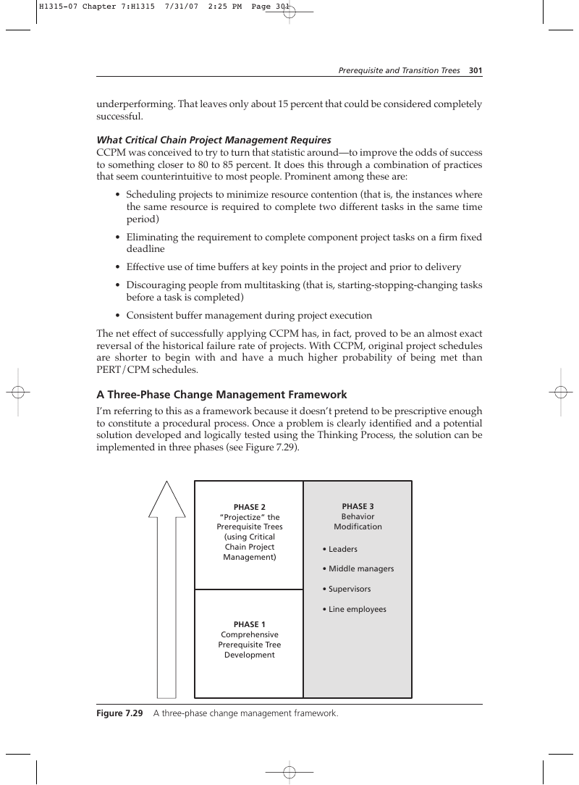

#### What Critical Chain Project Management Requires

CCPM was conceived to try to turn that statistic around—to improve the odds of success to something closer to 80 to 85 percent. It does this through a combination of practices that seem counterintuitive to most people. Prominent among these are:

- Scheduling projects to minimize resource contention (that is, the instances where the same resource is required to complete two different tasks in the same time period)
- Eliminating the requirement to complete component project tasks on a firm fixed deadline
- Effective use of time buffers at key points in the project and prior to delivery
- Discouraging people from multitasking (that is, starting-stopping-changing tasks before a task is completed)
- Consistent buffer management during project execution The net effect of successfully applying CCPM has, in fact, proved to be an almost exact reversal of the historical failure rate of projects. With CCPM, original project schedules are shorter to begin with and have a much higher probability of being met than PERT/CPM schedules.

#### A Three-Phase Change Management Framework

I’m referring to this as a framework because it doesn’t pretend to be prescriptive enough to constitute a procedural process. Once a problem is clearly identified and a potential solution developed and logically tested using the Thinking Process, the solution can be implemented in three phases (see Figure 7.29). PHASE 2 “Projectize” the Prerequisite Trees

(using Critical Chain Project

Management) PHASE 3 Behavior Modification

- Leaders
- Middle managers
- Supervisors
- Line employees

PHASE 1 Comprehensive Prerequisite Tree Development

Figure 7.29

A three-phase change management framework.

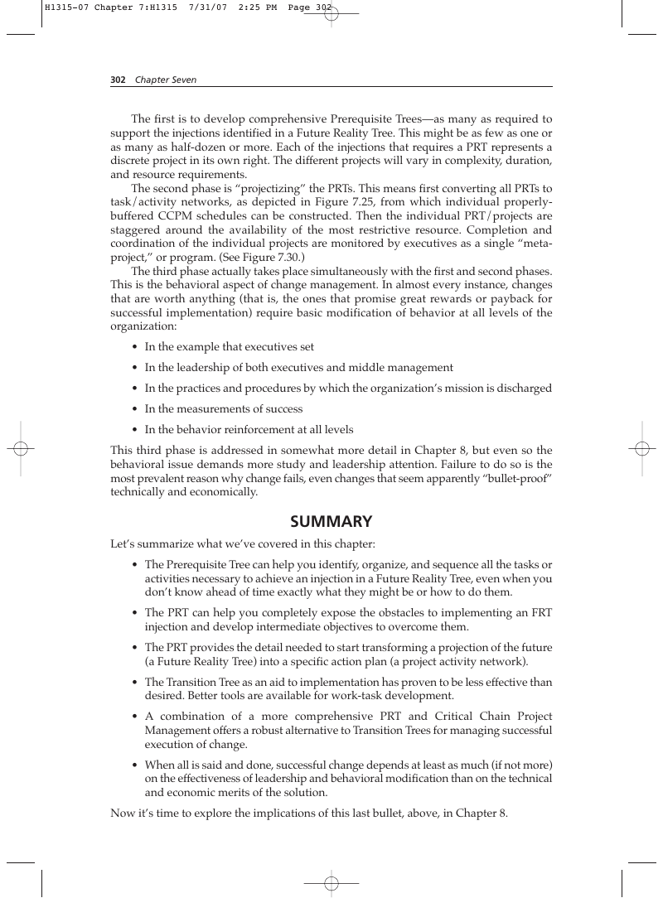

The first is to develop comprehensive Prerequisite Trees—as many as required to support the injections identified in a Future Reality Tree. This might be as few as one or as many as half-dozen or more. Each of the injections that requires a PRT represents a discrete project in its own right. The different projects will vary in complexity, duration, and resource requirements. The second phase is “projectizing” the PRTs. This means first converting all PRTs to task/activity networks, as depicted in Figure 7.25, from which individual properlybuffered CCPM schedules can be constructed. Then the individual PRT/projects are staggered around the availability of the most restrictive resource. Completion and coordination of the individual projects are monitored by executives as a single “metaproject,” or program. (See Figure 7.30.) The third phase actually takes place simultaneously with the first and second phases. This is the behavioral aspect of change management. In almost every instance, changes that are worth anything (that is, the ones that promise great rewards or payback for successful implementation) require basic modification of behavior at all levels of the organization:

- In the example that executives set
- In the leadership of both executives and middle management
- In the practices and procedures by which the organization’s mission is discharged
- In the measurements of success
- In the behavior reinforcement at all levels This third phase is addressed in somewhat more detail in Chapter 8, but even so the behavioral issue demands more study and leadership attention. Failure to do so is the most prevalent reason why change fails, even changes that seem apparently “bullet-proof” technically and economically.

SUMMARY

Let’s summarize what we’ve covered in this chapter:

- The Prerequisite Tree can help you identify, organize, and sequence all the tasks or activities necessary to achieve an injection in a Future Reality Tree, even when you don’t know ahead of time exactly what they might be or how to do them.
- The PRT can help you completely expose the obstacles to implementing an FRT injection and develop intermediate objectives to overcome them.
- The PRT provides the detail needed to start transforming a projection of the future (a Future Reality Tree) into a specific action plan (a project activity network).
- The Transition Tree as an aid to implementation has proven to be less effective than desired. Better tools are available for work-task development.
- A combination of a more comprehensive PRT and Critical Chain Project Management offers a robust alternative to Transition Trees for managing successful execution of change.
- When all is said and done, successful change depends at least as much (if not more) on the effectiveness of leadership and behavioral modification than on the technical and economic merits of the solution. Now it’s time to explore the implications of this last bullet, above, in Chapter 8.

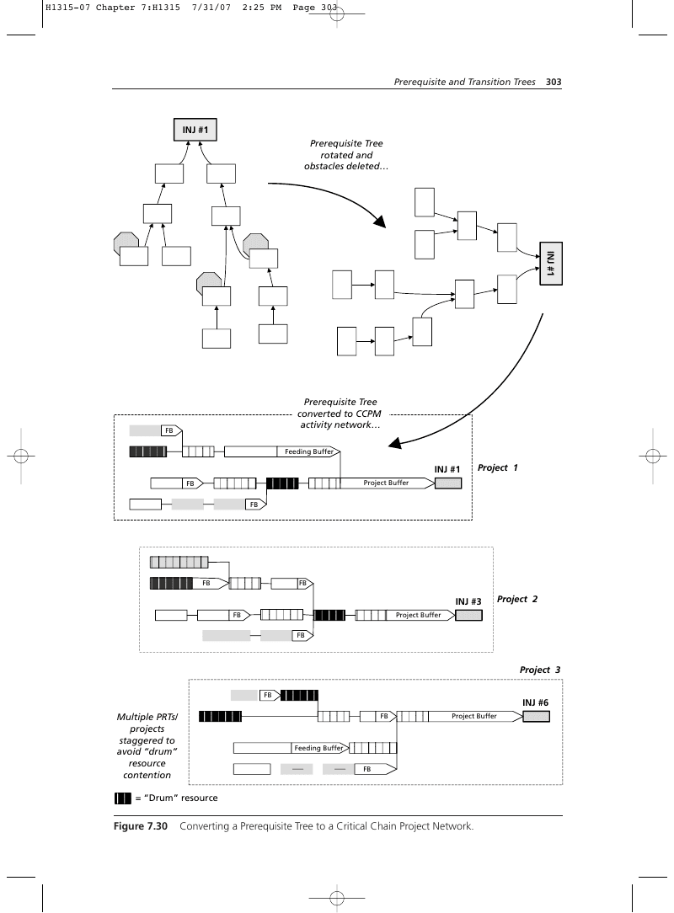

INJ #1 Prerequisite Tree

rotated and obstacles deleted…

INJ #1 Prerequisite Tree

converted to CCPM activity network…

FB Feeding Buffer

INJ #1

Project 1 Project Buffer

FB FB

FB

FB

INJ #3 FB

Project 2 Project Buffer

FB

Project 3 FB Multiple PRTs/

projects staggered to avoid “drum” resource contention

INJ #6 FB Project Buffer Feeding Buffer

FB

= “Drum” resource

Figure 7.30

Converting a Prerequisite Tree to a Critical Chain Project Network.

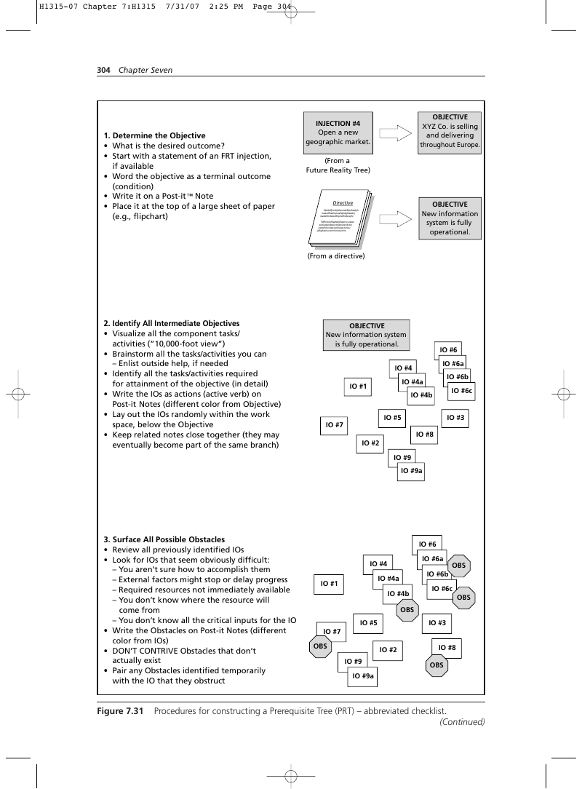

1. Determine the Objective
- What is the desired outcome?
- Start with a statement of an FRT injection, if available
- Word the objective as a terminal outcome (condition)
- Write it on a Post-it ™ Note
- Place it at the top of a large sheet of paper (e.g., flipchart)

OBJECTIVE

XYZ Co. is selling and delivering throughout Europe.

INJECTION #4 Open a new geographic market. (From a

Future Reality Tree) Directive OBJECTIVE

New information system is fully operational. Wadsffjccnkjfckeurdsfkjshlsekrjh

lxassdfhsefcyusefxjedxjweadxj waddsfcdszsdilfcjzsdfoidsispfo Tdjfhl;serjhfadwrijfcweroc,pweo seiruaweirweliudxwoiwexifuxw awdxhduxhawuxdnawudxnau jdfkghleriucvhrnfucsoerfcm

(From a directive)

1. Identify All Intermediate Objectives
- Visualize all the component tasks/ activities (”10,000-foot view”)
- Brainstorm all the tasks/activities you can

> – Enlist outside help, if needed

- Identify all the tasks/activities required for attainment of the objective (in detail)
- Write the IOs as actions (active verb) on Post-it Notes (different color from Objective)
- Lay out the IOs randomly within the work space, below the Objective
- Keep related notes close together (they may eventually become part of the same branch)

OBJECTIVE

New information system is fully operational.

IO #6 IO #6a

IO #4

IO #6b

IO #4a

IO #1

IO #6c

IO #4b IO #5

IO #3

IO #7 IO #8 IO #2 IO #9 IO #9a

1. Surface All Possible Obstacles
- Review all previously identified IOs
- Look for IOs that seem obviously difficult:

> – You aren’t sure how to accomplish them

> – External factors might stop or delay progress

> – Required resources not immediately available

> – You don’t know where the resource will

> come from
>
> – You don’t know all the critical inputs for the IO

- Write the Obstacles on Post-it Notes (different color from IOs)
- DON’T CONTRIVE Obstacles that don’t actually exist
- Pair any Obstacles identified temporarily with the IO that they obstruct

Figure 7.31

IO #6 IO #6a

IO #4 IO #1 OBS

IO #6b

IO #4a IO #4b

IO #6c OBS OBS

IO #5

IO #3

IO #7 OBS

IO #2 IO #9

IO #8 OBS

IO #9a

Procedures for constructing a Prerequisite Tree (PRT) – abbreviated checklist. (Continued)

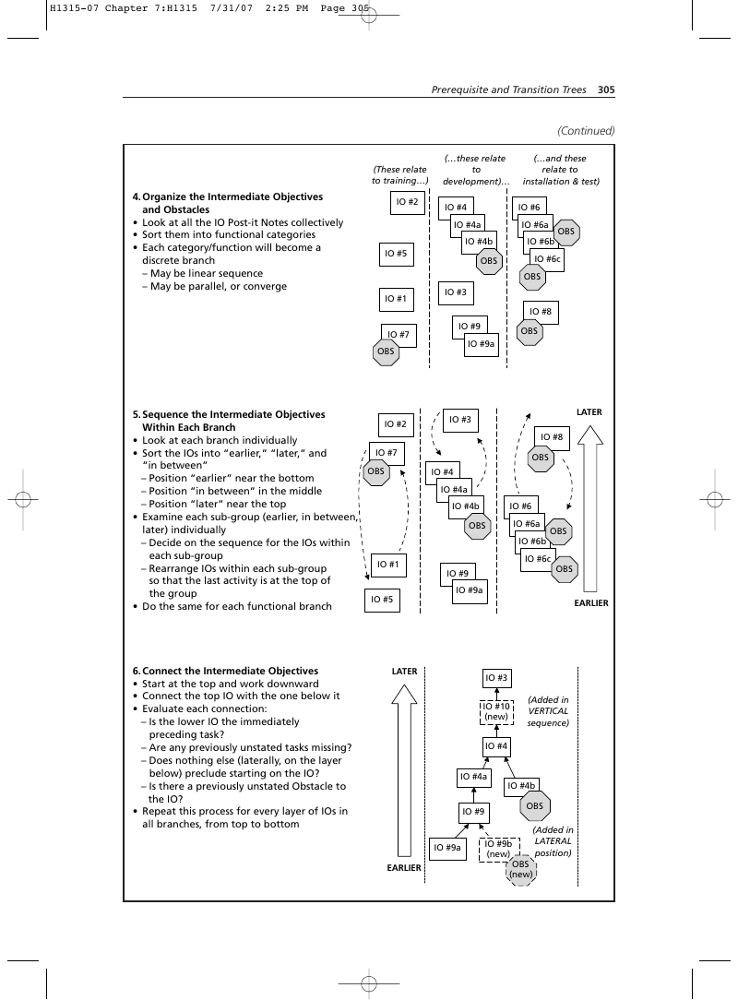

(Continued) (These relate to training…)

1. Organize the Intermediate Objectives and Obstacles
- Look at all the IO Post-it Notes collectively
- Sort them into functional categories
- Each category/function will become a discrete branch

> – May be linear sequence

> – May be parallel, or converge

IO #2

(…these relate to development)…

(…and these relate to installation & test)

IO #4

IO #6 IO #6a

IO #4a IO #5 OBS

IO #6b

IO #4b

IO #6c OBS OBS

IO #1

IO #3 IO #8 IO #9

IO #7

### Obs

1. Sequence the Intermediate Objectives IO #2

#### Within Each Branch

- Look at each branch individually IO #7
- Sort the IOs into “earlier,” “later,” and “in between”

> OBS
>
> – Position “earlier” near the bottom

> – Position “in between” in the middle

> – Position “later” near the top

- Examine each sub-group (earlier, in between, later) individually

> – Decide on the sequence for the IOs within

> each sub-group IO #1
>
> – Rearrange IOs within each sub-group

so that the last activity is at the top of the group IO #5

- Do the same for each functional branch
1. Connect the Intermediate Objectives
- Start at the top and work downward
- Connect the top IO with the one below it
- Evaluate each connection:

> – Is the lower IO the immediately

> preceding task?
>
> – Are any previously unstated tasks missing?

> – Does nothing else (laterally, on the layer

> below) preclude starting on the IO?
>
> – Is there a previously unstated Obstacle to

the IO?

- Repeat this process for every layer of IOs in all branches, from top to bottom

OBS

IO #9a LATER

IO #3 IO #8 OBS

IO #4 IO #4a IO #6

IO #4b

IO #6a OBS OBS

IO #6b IO #6c OBS

IO #9 IO #9a EARLIER LATER

IO #3 IO #10 (new) (Added in VERTICAL

sequence)

IO #4

IO #4a IO #4b IO #9 OBS (Added in

IO #9a EARLIER LATERAL

IO #9b position) (new) OBS

(new)

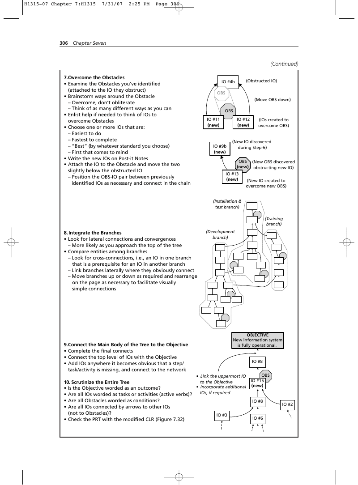

(Continued) 7.Overcome the Obstacles

- Examine the Obstacles you’ve identified (attached to the IO they obstruct)
- Brainstorm ways around the Obstacle

> – Overcome, don’t obliterate

> – Think of as many different ways as you can

- Enlist help if needed to think of IOs to overcome Obstacles
- Choose one or more IOs that are:

> – Easiest to do

> – Fastest to complete

> – “Best” (by whatever standard you choose)

> – First that comes to mind

- Write the new IOs on Post-it Notes
- Attach the IO to the Obstacle and move the two slightly below the obstructed IO

> – Position the OBS-IO pair between previously

identified IOs as necessary and connect in the chain

(Obstructed IO)

IO #4b OBS

(Move OBS down) OBS

IO #11 (new)

IO #12 (new)

IO #9b (new)

(IOs created to overcome OBS)

(New IO discovered during Step-6)

OBS (New OBS discovered (new) obstructing new IO) IO #13 (new) (New IO created to overcome new OBS) (Installation &

test branch) (Training

branch)

1. Integrate the Branches
- Look for lateral connections and convergences

> – More likely as you approach the top of the tree

- Compare entities among branches

> – Look for cross-connections, i.e., an IO in one branch

> that is a prerequisite for an IO in another branch on the page as necessary to facilitate visually simple connections
>
> – Link branches laterally where they obviously connect

> – Move branches up or down as required and rearrange

9.Connect the Main Body of the Tree to the Objective

- Complete the final connects
- Connect the top level of IOs with the Objective
- Add IOs anywhere it becomes obvious that a step/ task/activity is missing, and connect to the network

(Development

branch) OBJECTIVE

New information system is fully operational.

IO #8

- Link the uppermost IO

OBS

IO #15 to the Objective

1. Scrutinize the Entire Tree
- Incorporate additional (new)
- Is the Objective worded as an outcome? IOs, if required
- Are all IOs worded as tasks or activities (active verbs)?
- Are all Obstacles worded as conditions? IO #8
- Are all IOs connected by arrows to other IOs (not to Obstacles)? IO #3 IO #6
- Check the PRT with the modified CLR (Figure 7.32)

IO #2

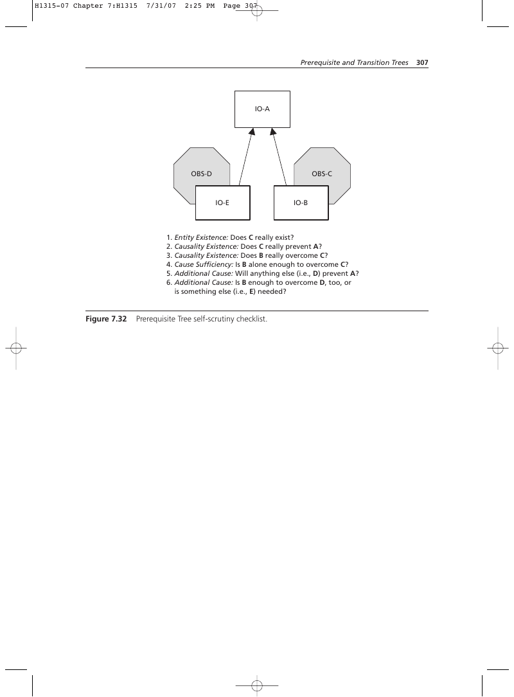

### Io-a Obs-d Obs-c Io-e Io-b

1. Entity Existence: Does C really exist?
2. Causality Existence: Does C really prevent A?
3. Causality Existence: Does B really overcome C?
4. Cause Sufficiency: Is B alone enough to overcome C?
5. Additional Cause: Will anything else (i.e., D) prevent A?
6. Additional Cause: Is B enough to overcome D, too, or is something else (i.e., E) needed?

Figure 7.32

Prerequisite Tree self-scrutiny checklist.

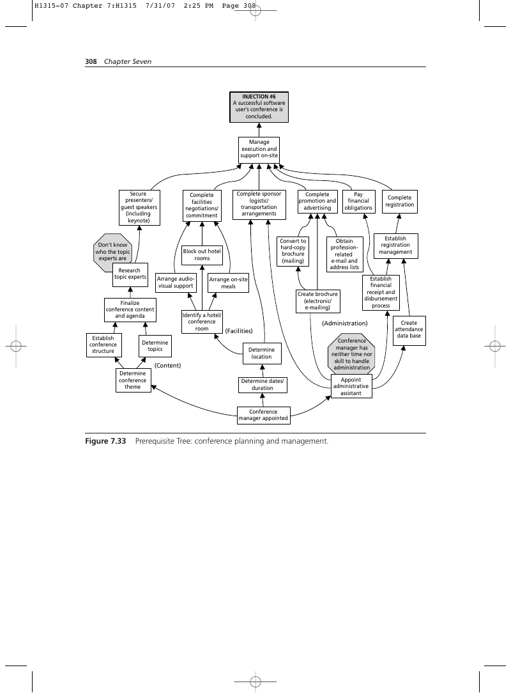

INJECTION #6 A successful software user’s conference is concluded. Manage

execution and support on-site Secure

presenters/ guest speakers (including keynote)

Don’t know who the topic experts are

Complete sponsor logistic/ transportation arrangements

Arrange audiovisual support Complete

promotion and advertising Convert to

hard-copy brochure (mailing)

Block out hotel rooms Research

topic experts

Arrange on-site meals

Identify a hotel/ conference room (Facilities) Determine

topics

Figure 7.33 Establish

financial receipt and disbursement process Determine

location Conference

manager has neither time nor skill to handle administration

Determine dates/ duration Appoint

administrative assistant Conference

manager appointed

Prerequisite Tree: conference planning and management. Complete

registration Establish

registration management

(Administration)

(Content) Determine

conference theme

Pay financial obligations Obtain

professionrelated e-mail and address lists

Create brochure (electronic/ e-mailing) Finalize

conference content and agenda Establish

conference structure Complete

facilities negotiations/ commitment Create

attendance data base

> The desire to do something good doesn’t get it done.
>
> —Unknown

### Endnotes

1. Covey, Stephen R. The Seven Habits of Highly Effective People: Powerful Lessons in Personal Change. NY: Simon & Schuster (Fireside), 1989.
2. Dettmer, H. William. Brainpower Networking Using the Crawford Slip Method. Victoria, BC (Canada): Trafford Publishing, 2003.
3. Leach, Lawrence P. Critical Chain Project Management. Boston, MA: Artech House, 2000.
4. _____. Lean Project Management: Eight Principles for Success. Boise, ID: Advanced Projects Institute, 2005.
5. Levine, Harvey A. Project Portfolio Management. San Francisco, CA: Jossey-Bass, 2005.
6. Morris, Peter W.G., and Jeffrey Pinto. The Wiley Guide to Managing Projects. Hoboken, New Jersey: John Wiley and Sons, 2004.
7. Newbold, Robert C. Project Management in the Fast Lane: Applying the Theory of Constraints. Boca Raton, FL: The St. Lucie Press, 1998.
8. Project Management Institute. A Guide to the Project Management Body of Knowledge (3rd ed.). Newtown Square, PA: Project Management Institute, 2003

