# Chapter 8: Changing the Status Quo

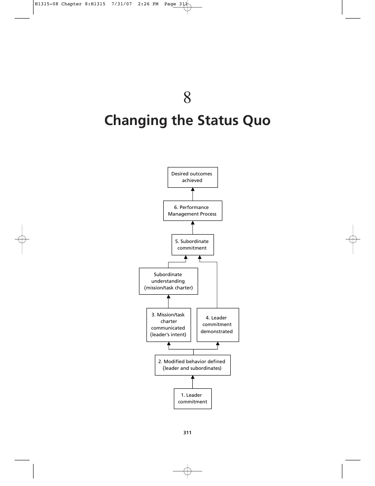

1. Performance
1. Subordinate commitment
1. Mission/task charter communicated (leader’s intent)
2. Leader commitment demonstrated
3. Modified behavior defined (leader and subordinates)
4. Leader commitment

> Nothing is more difficult to carry out, nor more doubtful of success, nor more dangerous to handle than to initiate a new order of things.
>
> —Niccolò Machiavelli

### Purpose

In this chapter we’ll address the most frustrating problem attending organizational change: getting the members of the organization, from the very top to the bottom, to modify their behavior so as to ensure the highest possible probability of successful change. This is not an easy thing to do. In most organizations, the drivers of human behavior are poorly understood, if their importance is recognized at all. An even more pervasive issue is the fact that behavior lies in the realm of psychologists, and psychology is anything but an exact science. Different psychologists have their own opinions about what motivates behavior and how to deal with it. Unlike the laws of physics, “it depends” applies much more in psychology. There isn’t enough room in this chapter to delve into the behavioral issue to the depth that it deserves, nor is that the purpose of this book. All that I can hope to achieve here is to impress upon you the importance of the psychological aspect of organizational change and to suggest a general approach for dealing with it. Deming insisted that psychology was one of the four pillars of profound knowledge.7:96 He cautioned that system improvement efforts would fail without a functional understanding of it. Deming was right. I would go even farther: an inadequate understanding of human psychology (and lack of a strategy for dealing with it) is the single most frequent cause of system failure in most organizations.* There are other resources to expand your education on human behavior. The endnotes at the conclusion of this chapter include some good places to start. If this discussion does no more than stimulate your awareness that you have a critical psychological component to address in your change efforts, it will have served its basic purpose. If it provides you even a rudimentary strategy for incorporating behavioral modification and reinforcement into your technical solutions, it will have been fully successful. Here’s where we’re going in this chapter. The first part will cover some of the basics of human motivation—why people behave the way they do. While the behavior management process itself doesn’t really depend on understanding why, the selection of “reinforcers” used to sustain desired behavior certainly does. We’ll explore the role of leadership in organizational change. Then we’ll discuss some of the basics of behavioral change—how to get individuals to behave the way the organization needs them to. Finally, we’ll integrate these two topics with some general prescriptions you might consider in effecting your own organizational change. Just keep in mind that the old organizational excuse “But we’re different!” has some elements of truth to it. We’ll be talking about general principles and approaches here, but these will have to be customized for your individual situation.

### Assumptions

- The success of organizational improvement depends on multiple factors, not all of which are technical or economic.
- The most critical and least understood factors in organizational change are human factors. * “The fault, dear Brutus, is not in our stars, but in ourselves, that we are underlings.” Julius Caesar, Act I, scene 1, line 134.
- Most change agents ignore or give short shrift to the human element.
- Human behavior is rooted in motivation.
- Motivation results from unsatisfied needs.
- An effective change strategy fully integrates tactics for changing human behavior and sustaining such changes.
- The most critical component of organizational change is firm, conscientious leadership.

### How to Use This Chapter

- Read the first part of the chapter on the role of need satisfaction and leadership in human behavior.
- Decide which aspects of need theory and leadership warrant more detailed study later.
- Read the second part of the chapter on behavior modification.
- Decide which behavior modification resources to consult in greater detail later.
- Read “Prescriptions for Directing and Reinforcing Behavior Change.”
- Decide how to modify or customize and apply the prescriptions presented here to suit your organizational environment. It’s a poor craftsman who blames his tools.

> —Unknown

> It’s not the sword, it’s the swordsman.
>
> —Unknown

### The Key to System Improvement

Changing the status quo is the key to improving any system. If you always do what you’ve always done, you’ll always get what you’ve always gotten. Many improvement methodologies— not just the theory of constraints but others as well, such as total quality management, business process reengineering, Lean, and Six Sigma—present a logical technical case for their use. Proponents typically argue how conscientious application of their methods will inevitably lead to the promised benefits. They presume that the logic of their case alone will be sufficient to inspire committed action by those who would realize such benefits. In other words, “As soon as they understand our logic, they’re bound to agree with it and be eager to apply the method.” Understand the logic? Perhaps. Agree with it? Not necessarily. Eager to apply it? Maybe not even likely.

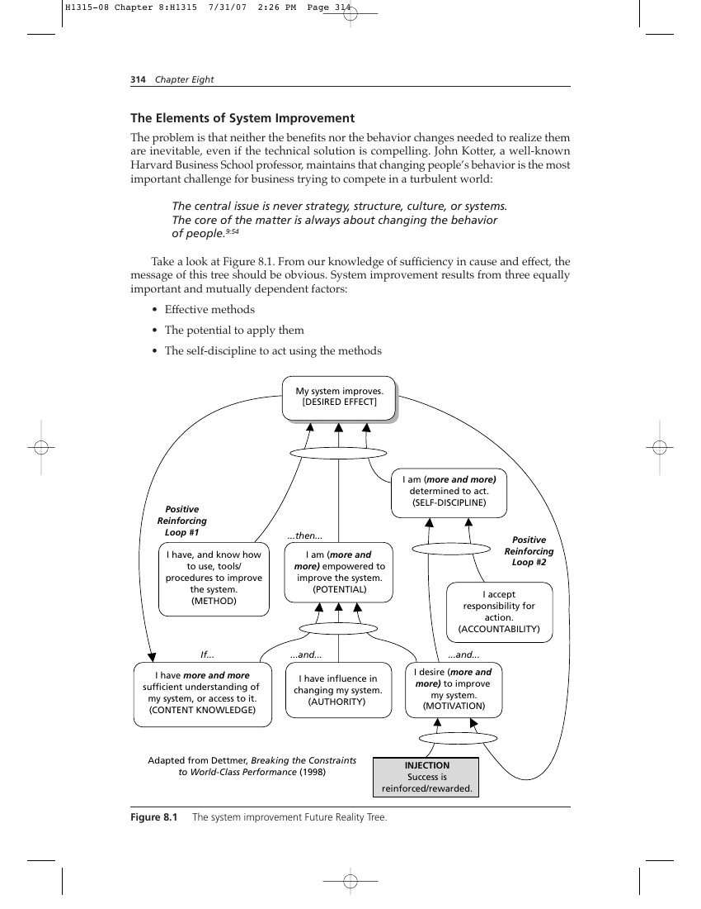

#### The Elements of System Improvement

The problem is that neither the benefits nor the behavior changes needed to realize them are inevitable, even if the technical solution is compelling. John Kotter, a well-known Harvard Business School professor, maintains that changing people’s behavior is the most important challenge for business trying to compete in a turbulent world: The central issue is never strategy, structure, culture, or systems. The core of the matter is always about changing the behavior of people.9:54 Take a look at Figure 8.1. From our knowledge of sufficiency in cause and effect, the message of this tree should be obvious. System improvement results from three equally important and mutually dependent factors:

- Effective methods
- The potential to apply them
- The self-discipline to act using the methods

#### Reinforcing

Loop #1 I have, and know how to use, tools/ procedures to improve the system.

### (Method)

The system improvement Future Reality Tree.

- The state of our knowledge about our system
- Authority (including resources) to do something about it
- Motivation to improve
- Willingness to accept accountability for action Successful system improvement then positively reinforces two causes lower in the tree. It enhances both system knowledge (technical) and motivation (psychological). The latter, however, requires an added leadership injection to effect the reinforcement. Notice that the availability of an effective method doesn’t depend on any of these causal elements. But the absence of any one of five contributors—method, content knowledge of the system, authority, motivation, and accountability…all entry points into this FRT—is enough to frustrate the achievement of system improvement. Now, as we look more closely at these five contributors, we can see that two of them come from the system itself or from outside of it: method and authority. Another of the contributors, content knowledge of the system, is a product of both the system in place and our conscientious efforts to understand how it works. The last two—motivation and accountability—are very much internal personal characteristics. We must want to improve and we must be willing to accept accountability for our actions before any action will ever occur. And conversely, without that personal behavior (and its motivation), system improvement will never occur.

#### Reinforcement

There’s an additional factor that’s implicit in the motivation and self-discipline blocks in Figure 8.1 but which isn’t specifically emphasized: the issue of reinforcement. As we’ll see later, behavior changes require reinforcement to be effective and lasting.

### Human Behavior

Technical or economic solutions are not enough. The world is full of great ideas that failed through no deficiency in their merits. Rather, for most substantial changes the failure lies in the execution, not the technical or economic merit of the solution—or the methodology used to create it. How many times have you heard people say, “We tried that…it didn’t work”? And in many cases they say this in the face of other comparable situations in which the solution did work. The rejoinder that naturally follows when this is pointed out is, invariably, “Yes, but we’re different,” implying that what worked somewhere else won’t work here. Well, if that were true, then nothing new would ever be adopted and human progress would stop—and we know that doesn’t happen. Change failure usually happens in two modes: active resistance and passive resistance.

#### Active Resistance

As the term implies, active resistance is overt “pushback.” There’s no difficulty detecting it. People will object to a proposed change verbally, but their objections will almost always be based on challenges to technical or economic feasibility (that is, whether the change would work or how much it might cost). In some cases, they might cite political resistance (not their own, of course!).

#### Passive Resistance

Two critical mistakes many change agents make are assuming that logical solutions are enough to motivate people to apply them and equating intellectual commitment with appropriate action. A logical defense of a proposed change may be sufficient to persuade people intellectually; it is not sufficient to prompt the required action (behavior) to execute the change: Intellectual commitment ≠ Appropriate action

#### Is Behavior Logical?

In the old Star Trek television series, the character Spock routinely observed that “humans are not logical.” In some ways, undesirable behavior in the face of persuasive logic to the contrary would seem illogical. Yet it happens every day. People logically understand that they shouldn’t smoke, or consume high-calorie, fatty foods, or engage in other kinds of high-risk behavior. But they do so anyway, in the face of that logic. They may even acknowledge the validity of the logic, then behave otherwise anyway. So maybe Spock was right. Or was he? With a thorough understanding of why people behave as they do—or fail to behave as we think they should—it might be possible to anticipate their behavior or even predict it. And the ability to do this would make their behavior eminently logical. In all cases—bar none—successful improvement of system operation is a function of real changes in people’s behavior. Not only is this not an easy thing to achieve, it’s probably the most critical part of executing a breakthrough solution to a problem. One might even say that the single constraint to system improvement, the ultimate determinant of success or failure, is changing people’s behavior.

#### Changing Minds, or Changing Behavior?

For more than 50 years, psychologists have argued about what makes people act the way they do. There are two schools of thought on the subject: behavioral and cognitive. The behavioral school contends that people’s behavior is motivated by the promise of reward and the avoidance of punishment (or adverse consequences), and the way to channel behavior in desired directions is by the reasonable application of rewards and punishment (or withholding of rewards). The cognitive school suggests that this doesn’t explain behavior that seems to fly in the face of reward-punishment logic: people who behave in ways that they can reasonably expect will get them punished or who consciously forego behavior changes that will garner them apparent rewards. Cognitive proponents believe that a deeper internalization of the need for, and advisability of, change must occur before changed behavior will be sustained.10:58-59 In other words, according to this school behavior modification techniques don’t result in sustained new behavior because real cognition of the rationale for change hasn’t taken place. In other words, like Pavlov’s dog, people are only behaving to achieve short-term reinforcement, they don’t actually believe in the new behavior. Thus, any failing or inconsistency in the reinforcement scheme will permit conditions for the original behavior to re-emerge.*

* Think about your own experiences. How many times have you seen mandated changes in “the way things are done,” eventually followed by reversion to “the old way of doing things”? Could it be that the new way was not consistently reinforced?

The debate (and the divide) between the behaviorists and cognitionists continues with no indication of definitive resolution anytime soon. Nor would this book be the place for a detailed discussion of the issue. Suffice it to say that there is a cognitive basis for behavior and that issue should be addressed. But at some point all change agents must also deal with measurable behavior and its reinforcers. It’s worth understanding the role that the behavioral and cognitive philosophies play. For practitioners—the ultimate target audience of this book—our ultimate purpose is to articulate some general prescriptions for maximizing the probability of succeeding at, and sustaining, change.

#### Why Do People Resist Change?

We should note at the outset that resistance to change, per se, is not necessarily always bad. In fact, medical research indicates that there is some neurological foundation for it.5 So there may be some evolutionary basis for “doing things the same old way.” Some level of resistance to change can be beneficial to preclude chaos from reigning in an organization. Unrestricted freedom to change at any time undermines structure and standardization, two characteristics that instill a degree of confidence and comfort in those who are part of any organization. So a level of resistance to change that at the very least demands rational justification for it is desirable. The real problem arises when the resistance to change becomes pathological, frustrating even beneficial change. Unfortunately, the demarcation between “good” resistance and “bad” is anything but clear. Resistance to change, whether passive or active, is a type of behavior. Behavior is accepted by most psychologists as fundamentally motivated by unfulfilled needs. We’re hungry, so we go to the refrigerator to look for something to eat. We don’t feel safe on the streets at night, so we retreat to the comfort of our homes. We’re lonely, so we look to others for company. We’re bored, so we look for something engaging to do. The list goes on and on. If we accept that behavior is motivated by unfulfilled needs, then the next logical question is what are those needs? What needs would people be satisfying by behaving in ways that we would consider resistance to change? In other words, “What’s in it for me?” Needs theory is a well-studied component of psychology. Among the earliest researchers in this area was Abraham Maslow. He was by no means the only student of motivation and behavior,* but his hierarchy of needs (see Figure 8.2)19 is generally accepted—at least among practitioners, if not among all academics—as the basis for individuals’ behavior in the real world. Closely related to Maslow’s theory are those of Herzberg, McClelland, and Adams. Each of these is described in slightly more detail in Appendix H. For the purposes of this discussion, we’ll consider only the “interfaces”—the points at which these various theories seem to converge or overlap and their relevance to overcoming people’s resistance to change.

#### Maslow

The majority of people in most organizations are functioning in levels 3 and 4 of Maslow’s hierarchy. (See Figure 8.2.) Yes, it’s true that in tough economic times more will revert to level 2 (security) because of concern about their jobs. On the other hand, very few people—possibly only executives, and perhaps not even they—routinely function at level 5 (self-actualization) for much of the time. This majority at levels 3 and 4 is likely to include most middle- and upper-level managers. They’re most concerned about their status * Others include Herzberg, Alderfer, McClelland, Adams, Skinner, Vroom, and Locke.

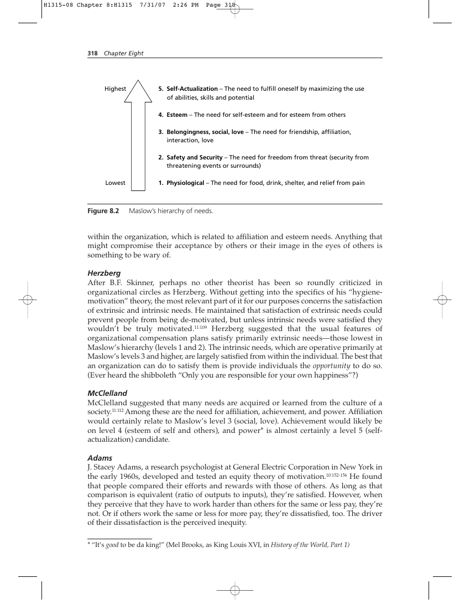

#### Highest

1. Self-Actualization – The need to fulfill oneself by maximizing the use of abilities, skills and potential
2. Esteem – The need for self-esteem and for esteem from others
3. Belongingness, social, love – The need for friendship, affiliation, interaction, love
4. Safety and Security – The need for freedom from threat (security from threatening events or surrounds)
1. Physiological – The need for food, drink, shelter, and relief from pain

within the organization, which is related to affiliation and esteem needs. Anything that might compromise their acceptance by others or their image in the eyes of others is something to be wary of.

#### Herzberg

After B.F. Skinner, perhaps no other theorist has been so roundly criticized in organizational circles as Herzberg. Without getting into the specifics of his “hygienemotivation” theory, the most relevant part of it for our purposes concerns the satisfaction of extrinsic and intrinsic needs. He maintained that satisfaction of extrinsic needs could prevent people from being de-motivated, but unless intrinsic needs were satisfied they wouldn’t be truly motivated.11:109 Herzberg suggested that the usual features of organizational compensation plans satisfy primarily extrinsic needs—those lowest in Maslow’s hierarchy (levels 1 and 2). The intrinsic needs, which are operative primarily at Maslow’s levels 3 and higher, are largely satisfied from within the individual. The best that an organization can do to satisfy them is provide individuals the opportunity to do so. (Ever heard the shibboleth “Only you are responsible for your own happiness”?)

#### McClelland

McClelland suggested that many needs are acquired or learned from the culture of a society.11:112 Among these are the need for affiliation, achievement, and power. Affiliation would certainly relate to Maslow’s level 3 (social, love). Achievement would likely be on level 4 (esteem of self and others), and power* is almost certainly a level 5 (selfactualization) candidate.

#### Adams

J. Stacey Adams, a research psychologist at General Electric Corporation in New York in the early 1960s, developed and tested an equity theory of motivation.10:152-156 He found that people compared their efforts and rewards with those of others. As long as that comparison is equivalent (ratio of outputs to inputs), they’re satisfied. However, when they perceive that they have to work harder than others for the same or less pay, they’re not. Or if others work the same or less for more pay, they’re dissatisfied, too. The driver of their dissatisfaction is the perceived inequity. * “It’s good to be da king!” (Mel Brooks, as King Louis XVI, in History of the World, Part 1)

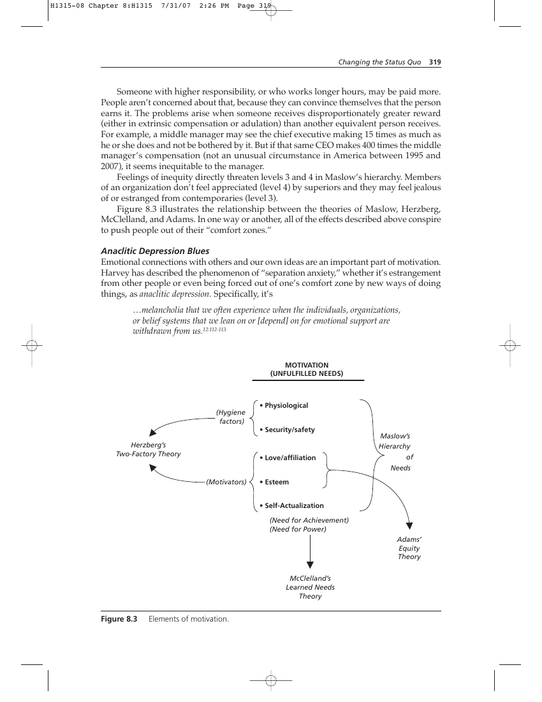

Someone with higher responsibility, or who works longer hours, may be paid more. People aren’t concerned about that, because they can convince themselves that the person earns it. The problems arise when someone receives disproportionately greater reward (either in extrinsic compensation or adulation) than another equivalent person receives. For example, a middle manager may see the chief executive making 15 times as much as he or she does and not be bothered by it. But if that same CEO makes 400 times the middle manager’s compensation (not an unusual circumstance in America between 1995 and 2007), it seems inequitable to the manager. Feelings of inequity directly threaten levels 3 and 4 in Maslow’s hierarchy. Members of an organization don’t feel appreciated (level 4) by superiors and they may feel jealous of or estranged from contemporaries (level 3). Figure 8.3 illustrates the relationship between the theories of Maslow, Herzberg, McClelland, and Adams. In one way or another, all of the effects described above conspire to push people out of their “comfort zones.”

#### Anaclitic Depression Blues

Emotional connections with others and our own ideas are an important part of motivation. Harvey has described the phenomenon of “separation anxiety,” whether it’s estrangement from other people or even being forced out of one’s comfort zone by new ways of doing things, as anaclitic depression. Specifically, it’s …melancholia that we often experience when the individuals, organizations, or belief systems that we lean on or [depend] on for emotional support are withdrawn from us.12:112-113 MOTIVATION (UNFULFILLED NEEDS)

- Physiological
- Security/safety
- Love/affiliation (Motivators)
- Esteem
- Self-Actualization (Need for Achievement) (Need for Power)

Everybody suffers it—or has suffered from it—at one time or another. It’s not a pleasant feeling. It manifests itself as a general feeling of discouragement—the “blues.” It may not be as debilitating as clinical depression, but it’s an unpleasant experience nonetheless. Everybody who has experienced it (and who has not?) wants to avoid it in the future, even if they don’t fully understand what it is or what’s causing it. In organizations, separation anxiety results not so much from the failure to satisfy the various needs described above. It’s fear of the threat that a new way of doing things might somehow eventually separate us from the people, organization structure, assumptions, or ways of doing things that we’ve grown accustomed to, or comfortable with. In other words, it affects Maslow’s levels 2 and 3. Never mind that the fears may be logically unfounded (Harvey refers to these as “negative fantasies”).13:22 The anaclitic depression blues have little to do with logic and everything to do with emotions. And it’s purely instinctive for people to avoid them.

#### Security or Satisfaction?

Here’s another way to look at it. In the early 1990s, a young psychology student in Israel, Efrat Goldratt, postulated that people universally sought to be happy in their lives. The achievement of this goal depended on satisfying two necessary conditions: achieving security and achieving satisfaction.8:117-119 Goldratt specified particular definitions for security and satisfaction. People felt secure, she said, when they had confidence in the predictability of events in their lives. She offered no value judgment on the desirability of any such events. Rather it’s the confidence in predictability that engenders a sense of security. Goldratt defined satisfaction as the positive feeling one obtains after realizing a particularly difficult objective, one in which the outcome was in doubt.* The tougher the objective, the more satisfaction accrues when one actually accomplishes it. Winning a world or Olympic championship might be an example. What are Goldratt’s definitions of security and satisfaction but elements of Maslow’s hierarchy of needs? Security might encompass levels 1 through 3 (physiological, safety/security, and love/affiliation needs). Satisfaction would clearly reside in levels 4 and 5 (esteem and self-actualization). Goldratt went on to propose that people’s drive to satisfy these needs and realize the ultimate objective of happiness was the root of the elemental personal conflict that everybody faces in their lives: Don’t change and protect the status quo (preserve security) or embrace change and achieve great things (achieve satisfaction). (See Figure 8.4)

#### The Impact on Solutions

In consolidating the theories of Maslow, Herzberg, McClelland, Adams, and Harvey, it’s fairly clear that their common intersection occurs primarily at levels 3 and 4 of Maslow’s hierarchy: the social and esteem needs that all people share. And Efrat Goldratt’s conflict gets at the heart of the dilemma that a big change—in the form of sweeping modifications to the way businesses operate—poses for individuals. This dilemma (resist change or embrace change) mires people in indecision, the result of which is that they often don’t act

* I once asked a fighter pilot friend of mine which airplane he preferred flying, the older F-4 Phantom or the newer F-16 Fighting Falcon. Without hesitation, he replied, “I prefer flying the F-4. It’s a tougher airplane to fly, and it’ll ‘bite’ you if you don’t stay on top of it at all times. It takes a really good pilot to do that. Not everybody’s equal to the task. There’s no virtue in doing something that just anybody can do.” That, to me, is the essence of Goldratt’s definition of satisfaction: being able to do what few others can do.

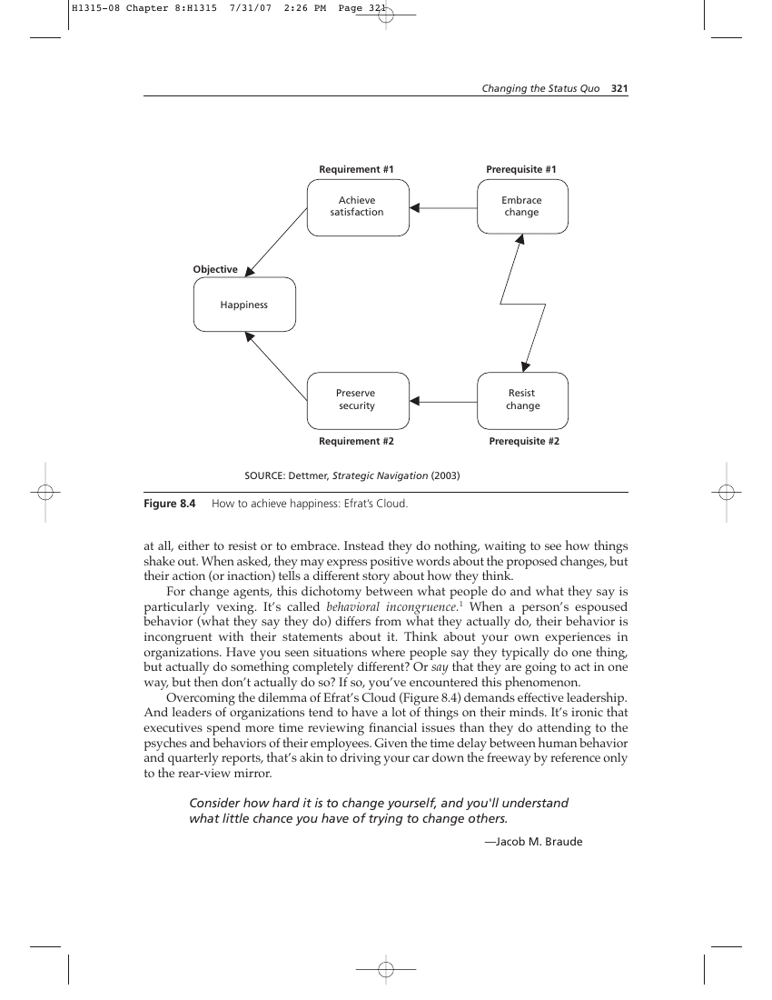

How to achieve happiness: Efrat’s Cloud.

> at all, either to resist or to embrace. Instead they do nothing, waiting to see how things shake out. When asked, they may express positive words about the proposed changes, but their action (or inaction) tells a different story about how they think. For change agents, this dichotomy between what people do and what they say is particularly vexing. It’s called behavioral incongruence.1 When a person’s espoused behavior (what they say they do) differs from what they actually do, their behavior is incongruent with their statements about it. Think about your own experiences in organizations. Have you seen situations where people say they typically do one thing, but actually do something completely different? Or say that they are going to act in one way, but then don’t actually do so? If so, you’ve encountered this phenomenon. Overcoming the dilemma of Efrat’s Cloud (Figure 8.4) demands effective leadership. And leaders of organizations tend to have a lot of things on their minds. It’s ironic that executives spend more time reviewing financial issues than they do attending to the psyches and behaviors of their employees. Given the time delay between human behavior and quarterly reports, that’s akin to driving your car down the freeway by reference only to the rear-view mirror. Consider how hard it is to change yourself, and you'll understand what little chance you have of trying to change others.
>
> —Jacob M. Braude

### Leadership

> Have you seen them? Which way did they go? I must be after them, for I am their leader!
>
> —Unknown

Leadership is almost a hackneyed term. People use the term interchangeably with management. The two are not the same. They’re not even close. And one reason why many organizations are in such trouble is that there is a surfeit of management at the top and a simultaneous dearth of leadership. What is leadership? Unfortunately, there are almost as many definitions as there are people. Decades of academic analysis have given us more than 350 definitions of leadership2:4 and almost all differ in some respect. People may have difficulty agreeing on a definition, but most will agree that they know it when they see it. Let’s consider a few definitions and see if we can distill a common, simple one. A former student of mine (a U.S. Marine) once provided me the Marine Corps distinction between leadership and management: “You lead people; you manage things.” At the time that, too, sounded hackneyed to me, but the more I’ve thought about leadership and studied it, the more I’ve come to recognize that the Marines are right. Unfortunately, though, in almost every modern organization the nominal leaders spend more time and energy on paperwork, financials, and other things than they do leading people. Narrowly and organizationally (the context most of us are likely to be concerned with), leadership has been defined as “the ability of an individual to influence, motivate, and enable others to contribute toward the effectiveness and success of the organizations of which they are members.”14 Elliott Jaques defines leadership as a process… …in which one person sets the purpose or direction for one or more other persons and gets them to move along together with him and with each other with competence and full commitment.16:4 These few definitions of leadership “circle around” the concise definition I believe will suffice for our purposes: Leadership, at its highest, consists of getting people to do what you want them to do when they are under no obligation to do so. Or, as the line goes in “The Impossible Dream” (Man of LaMancha): “To be willing to march into hell for that heavenly cause…”* How many organizational leaders do you know for whom their followers would march into hell?

#### Leadership Is About People

Harvey maintains that real leadership requires you to be emotionally bonded, attached, connected, or linked with those whom you lead. And it also requires that you ensure that your followers are similarly bonded with one another. In the absence of these bonds, you may be able to coerce people into doing what you want them to do—to drive them—but you can’t lead them.11:135

* “The Impossible Dream,” music by Mitch Leigh, lyrics by Joe Darion.

Think about how this relates to the last major organizational change you witnessed. Does the kind of emotional connection Harvey describes exist in your organization? Was the kind of loyalty and commitment to a larger group purpose instilled or preserved? Would members of the team have “marched into hell for a heavenly cause”? Would your organizational shepherd have left 99 sheep to find the one lost?* Is it any wonder, then, that people exert only half-hearted effort, while watching the clock for quitting time?

#### Leadership and the Blitzkrieg

If you’re in charge of an organization, how do you practice the kind of leadership required to complete effective change? How can you ensure that your followers act “with competence and full commitment” to do what you would want them to do, even when you’re not there to guide or direct them? It’s instructive to consider the infamous blitzkrieg of World War II. The German word translates to English as “lightning war.” It was used to characterize the previously unseen concept of rapid-maneuver warfare, using smaller, fast-moving units to effect damage to the enemy far out of proportion to their numbers before opponents even knew what was happening. Surprise was, of course, a big element in the success of the blitzkrieg. But the well-coordinated actions of autonomous units were perhaps an even greater contributor to its success.** The flexibility and maneuverability of German armored units owed itself to four basic principles, all of which are relevant to true leadership (as defined above) in any organization. These principles are: mutual trust, personal professional skill, a moral contract, and focus.21:52-59 Figure 8.5 summarizes the blitzkrieg principles.

#### Mutual Trust

The German word for this is einheit. It refers to the certain knowledge of what to expect from one another that leaders and followers develop after repeatedly working together, time and time again. This trust is earned over time through two-way communication, training, practice, and patience. It can’t be imposed; it must be earned. But when it exists, leaders need not check up on their subordinates—they know exactly what to expect from them, and subordinates know that their leaders will support them when they exercise their own initiative.

#### Personal Professional Skill

The Germans called this fingerspitzengefühl, which translates literally as “fingertip feel.” It refers to the consummate skill craftsmen exercise when they do their work. They make even the most difficult, complicated tasks seem fluid and simple, smooth and effortless. Fingertip feel comes only with experience and repetition, which also is a function of time. Someone learning to ride a horse doesn’t do so with the fingertip feel of a professional rodeo cowboy or competitive show rider. The mutual trust discussed above results from the confidence a leader has that his or her subordinates have this fingertip feel about their work—and vice-versa.

* Matthew 18: 10-14 ** I hope that readers can separate in their minds the brilliance of the military tactics practiced by German panzer divisions from the ignoble purposes of the German regime for which they were used. The fact that I abhor everything that Nazi Germany stood for in no way changes the fact that the military tactics of the blitzkrieg were brilliantly conceived and executed by extraordinary military leaders.

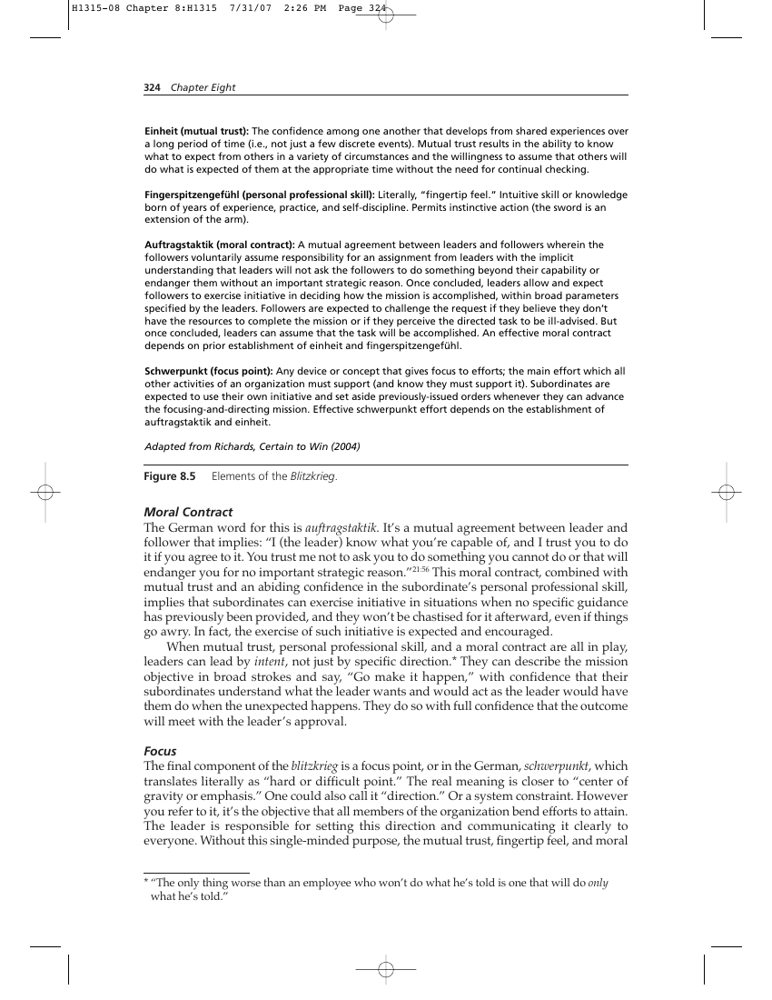

Einheit (mutual trust): The confidence among one another that develops from shared experiences over a long period of time (i.e., not just a few discrete events). Mutual trust results in the ability to know what to expect from others in a variety of circumstances and the willingness to assume that others will do what is expected of them at the appropriate time without the need for continual checking. Fingerspitzengefühl (personal professional skill): Literally, “fingertip feel.” Intuitive skill or knowledge born of years of experience, practice, and self-discipline. Permits instinctive action (the sword is an extension of the arm). Auftragstaktik (moral contract): A mutual agreement between leaders and followers wherein the followers voluntarily assume responsibility for an assignment from leaders with the implicit understanding that leaders will not ask the followers to do something beyond their capability or endanger them without an important strategic reason. Once concluded, leaders allow and expect followers to exercise initiative in deciding how the mission is accomplished, within broad parameters specified by the leaders. Followers are expected to challenge the request if they believe they don’t have the resources to complete the mission or if they perceive the directed task to be ill-advised. But once concluded, leaders can assume that the task will be accomplished. An effective moral contract depends on prior establishment of einheit and fingerspitzengefühl. Schwerpunkt (focus point): Any device or concept that gives focus to efforts; the main effort which all other activities of an organization must support (and know they must support it). Subordinates are expected to use their own initiative and set aside previously-issued orders whenever they can advance the focusing-and-directing mission. Effective schwerpunkt effort depends on the establishment of auftragstaktik and einheit. Adapted from Richards, Certain to Win (2004)

#### Moral Contract

The German word for this is auftragstaktik. It’s a mutual agreement between leader and follower that implies: “I (the leader) know what you’re capable of, and I trust you to do it if you agree to it. You trust me not to ask you to do something you cannot do or that will endanger you for no important strategic reason.”21:56 This moral contract, combined with mutual trust and an abiding confidence in the subordinate’s personal professional skill, implies that subordinates can exercise initiative in situations when no specific guidance has previously been provided, and they won’t be chastised for it afterward, even if things go awry. In fact, the exercise of such initiative is expected and encouraged. When mutual trust, personal professional skill, and a moral contract are all in play, leaders can lead by intent, not just by specific direction.* They can describe the mission objective in broad strokes and say, “Go make it happen,” with confidence that their subordinates understand what the leader wants and would act as the leader would have them do when the unexpected happens. They do so with full confidence that the outcome will meet with the leader’s approval.

#### Focus

The final component of the blitzkrieg is a focus point, or in the German, schwerpunkt, which translates literally as “hard or difficult point.” The real meaning is closer to “center of gravity or emphasis.” One could also call it “direction.” Or a system constraint. However you refer to it, it’s the objective that all members of the organization bend efforts to attain. The leader is responsible for setting this direction and communicating it clearly to everyone. Without this single-minded purpose, the mutual trust, fingertip feel, and moral * “The only thing worse than an employee who won’t do what he’s told is one that will do only what he’s told.”

contract won’t be effective. In many organizations, it’s referred to as “the vision thing.”* People with vision are a surprisingly rare commodity. If you have it and can articulate it effectively, you can actually inspire people to follow you. Consider the immortal words of Dr. Martin Luther King: “I have a dream…” And think of the cultural revolution it mobilized in America. Now, that’s focus! Whether you call it focus or vision, it contributes to inspiration, which in turn is an indispensable component of leadership—the heavenly cause for which followers willingly march into hell. These four principles—mutual trust, personal professional skill, a moral contract, and focus—are the bedrock of real leadership. Of persuading people to do what you want them to do when they are under no obligation to do so. Figure 8.6 shows the relationship of some components of effective leadership. The blitzkrieg factors are shaded.

Level 5 Leadership Perhaps the true test of an effective hypothesis is the ability to find independent data to confirm it. Where leadership is concerned, that’s not especially difficult to do. In his book Good to Great, Jim Collins made the following observations: The good-to-great executives were all cut from the same cloth. It didn’t matter whether the company was consumer or industrial, in crisis or steady state, offered services or products. It didn’t matter when the transition took place or how big the company. All the good-to-great companies had Level 5 leadership at the time of transition. Furthermore, the absence of Level 5 leadership showed up as a consistent pattern in the comparison companies.4:21-22 Collins described Level 5 leadership as “[building] enduring greatness through a paradoxical blend of personal humility and professional will.”4 Unfortunately, Collins offers no concrete prescriptions about how to become a Level 5 leader. In fact, he points out that his discussion of “Level 5” is about what they are and the kinds of things they do, not a roadmap for how to become such a leader.4:37-38 (It’s important to avoid confusion here. Collins’ Level 5 leadership is not the same as Elliott Jaques’ Level 5 organization structure, or Maslow’s Level 5 needs. It is interesting to note, however, that organizations with Jaques’ concept of Level 5 leaders would exhibit remarkably similar characteristics to Collins’ Level 5 leaders.) Personally, I don’t believe that it’s practical to lay down any discrete list of do’s and don’ts for leaders. However, I do think that the four blitzkrieg principles line up pretty well with Collins’ Level 5 leader concept. And they provide a framework to guide leader behavior that is generic enough to apply to all kinds and sizes of organization.

### Leadership and Behavior

The most important contributing factor to the behavior of people in organizations, and thus to the success of organizational change, is the quality of leadership. By “quality of leadership,” I intentionally imply a double meaning. The first meaning of quality is characteristic, and the first meaning of leadership relates to the concept. The second meaning of quality is fineness or excellence, and the second meaning of leadership is the specific people who occupy positions of authority. In other words, are the people in charge really leading, and how good are they at it? The success of any organizational change is a function of the people leading the organization and their skill in leading others to execute it—inspiring them “to march into hell for that heavenly cause.” The implications for the success of change are profound. If it’s to succeed, change can’t be driven from the middle of an organization. It must be driven from the top. The intended outcome of the change constitutes the vision we discussed earlier. Establishing that vision is solely the leader’s responsibility. Leaders must own that vision themselves before they can inspire others to pursue it. The idea for change can originate from anywhere, within the organization or without. But unless leaders embrace it publicly and repeatedly, and demonstrate (communicate) their commitment to it repeatedly with their own visible behavior, “it ain’t a-gonna happen.” The story has been told about W. Edwards Deming’s first visit to Ford Motor Company in 1979. Donald Peterson, chairman and CEO of Ford, convened Ford’s vice presidents—some 400 of them—in the company auditorium and introduced Deming, admonishing them to pay close attention to what the quality guru had to say. Peterson then exited the auditorium and returned to his office (presumably to review financials and read paperwork!). When he turned around, he found Deming standing there in his office with him. Deming’s explanation for why he followed Peterson: “Where you are, I am.” It was a particularly persuasive way of communicating to Peterson that he needed to personally demonstrate by being there his commitment to what Deming would say to the people of Ford.* All I would add to that message is the word repeatedly. So let’s say it once again to make it unmistakably clear: If the organization’s leaders are not committed to a change and don’t visibly demonstrate that commitment repeatedly, it will fail.

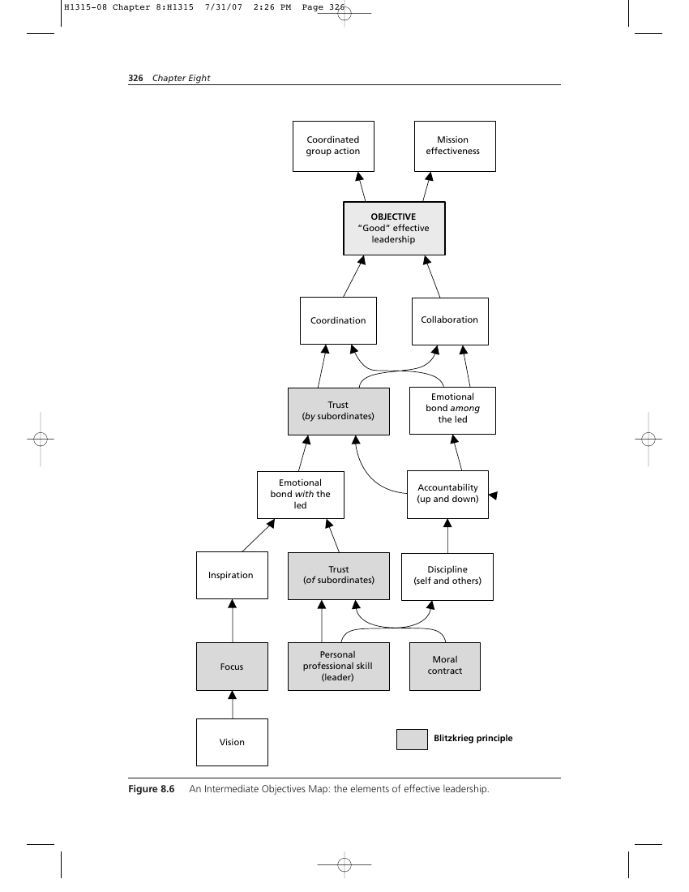

#### The Leader’s Behavior

As suggested above, leaders communicate by their behavior as much as by their words. Actions speak louder than words, and people pay attention to that kind of communication. But the behavior of leaders is no less motivated by the satisfaction of needs than anyone else’s. People do what they do to “scratch an itch.” It’s just that for leaders, those needs are usually higher in Maslow’s hierarchy than the first three levels (physiological, security, and affiliation). They’re almost always concentrated at levels 4 and 5 (esteem and self-actualization). And more specifically, those facets of level five that McClelland best articulated as needs for achievement and power. At the same time, however, leaders are also security conscious. They’re gratified with their position, their responsibilities, their authority, and perhaps even their compensation. They’re aware that their decisions can have wide-ranging impacts on the success and health of the organization, and, not coincidentally, on their own job security. They perceive that they have a lot to lose by a wrong decision. A study of executive compensation published in The Economist found that one reason for very large compensation packages for chief executives in particular was their relatively short longevity in the job.2:9 Because boards of directors are looking for share-value results quickly, the average CEO isn’t given a particularly long time to show results and boards are quick to offer them their severance packages. The Jack Welchs of the world, who stay in the position for a decade or more, are few and far between. Thus, there usually isn’t time to recover from a misstep. This kind of thinking can make executives highly “security conscious.” An early step in enlisting the commitment of leaders is for them to see how the * It’s worth mentioning that Peterson reportedly cleared out his schedule for the rest of the day and returned to the auditorium with Deming. The ultimate result was “Quality is Job 1.”

successful implementation of the proposed change will help satisfy their needs—and persuade them emotionally that the idea is a good one. If this is done, the odds improve that the leader’s behavior will match his or her words to subordinates about it.

#### Subordinates’ Behavior

Unlike leaders, subordinates are less likely to be operating at Maslow’s level 5. It’s more likely that they’re at level 3 (social, affiliation needs) and reaching for level 4 (esteem). However, in the turbulent, uncertain world of globalization and outsourcing, a great many subordinates have been forced down into concern about level 2 (security). Fear of the anaclitic depression blues affects leaders, too, but it’s considerably more pronounced in the middle and lower levels of an organization, where employees don’t have “golden parachutes.”* Subordinates take their cue about how to behave from a leader’s behavior. Deming insisted that Peterson be with him so as to demonstrate that he was committed to what Deming would be telling the vice presidents. Whether they’re aware of it or not, leaders are communicating a message with their body language and non-verbal feedback. And subordinates pick up these messages, whether they’re conscious of it or not. Leaders’ less than active commitment for a change is obvious to those observing them. And subordinates’ behavior becomes a reflection of the leader’s behavior. It’s a rare subordinate who will try to “get inside the head” of the leader, anticipate what the leader intends, and take initiative to provide it without being specifically directed. And when subordinates do venture to exercise such initiative, they’re very sensitive to the leader’s reaction. A new idea is delicate. It can be killed by a sneer or a yawn; it can be stabbed to death by a quip, and worried to death by a frown on the right person's brow.

### Creating and Sustaining Desired Behaviors

From the preceding discussion of human motivation and leadership and their relationship to behavior, it should be clear that the challenge of changing behavior isn’t a simple thing. It certainly involves more than constructing a logical solution, presenting it to people, expecting enlightenment to dawn, and anticipating immediate commitment to new behaviors to occur. In fact, it should be obvious that a logic-only approach to change is doomed to fail. Antonio Damasio, a prominent neurologist, has made a persuasive, testable case for the idea that reason and emotion are inseparable and joined by the neurology of the brain.4:xii Moreover, he has concluded that not only does a purely logical mind not exist, but reasoning not based on an emotional foundation is pathologically prone to error. If this hypothesis is valid, then contrary to Descartes’ philosophy, reasoning can’t be separated from emotion, as people have popularly believed since the 1600s. What does this signify for change management? Simply that effecting successful change requires far more than creating a logical solution and expecting people to embrace it or be persuaded by its logic. If, as Damasio contends, beliefs and behaviors are embedded in the brain’s neural structures, changing minds has a biological component as well as a logical one. Behavior changes may then be Darwinian to some degree. This implies that simply standing up with a PowerPoint presentation to win people over, then expecting new behavior to be self-directed, is wishful thinking. * It was really tough for most people to feel sorry for Carly Fiorina when the Hewlett-Packard board of directors terminated her as CEO with a $21.4 million severance package. (http://money.cnn.com/2005/02/12/news/newsmakers/fiorina_severance/)

> But neither organizational leaders nor system owners have the patience to wait for evolutionary change to occur. For timely effectiveness, some kind of robust intervention is required or we may see the next ice age before it occurs naturally. This brings us to the question of how to direct and control the behaviors required to initiate and sustain the changes demanded by new ideas and solutions to system problems. It's a wonderful feeling when you discover some logic to substantiate your beliefs.
>
> —Unknown

> If you work with people, sometimes logic has to take a back seat to understanding.
>
> — Akio Morita, former CEO Sony Corp.

#### Behavior Change is a Leadership Function

At the outset, let’s make one thing clear: In an organizational setting, initiating and sustaining behavioral change is primarily the responsibility of leaders. Subordinates do, leaders direct. And directing implies much more than just telling people what to do. In changing behavior, it means to channel or focus toward a given result, object, or end.14:8 The leader is responsible for defining the object or end (in blitzkrieg parlance, this would be the schwerpunkt, or focus point). The act of channeling or focusing is the function that leaders are supposed to perform. Moreover, subordinates are constantly looking to leaders for some kind of clue as to how they should behave. How do leaders do this?

#### A Behavioral Approach to Change

In most organizations, behavior is directed by the “carrot-or-stick” approach. In psychology circles, it’s referred to as reinforcement theory. Grossly oversimplified, reinforcement theory suggests that some policy, directive or “the boss’s decree” (called an antecedent) prompts some kind of behavior. The behavior produces some outcome for the one doing the behavior (called a consequence). The degree to which that consequence is pleasing or displeasing to the person behaving determines the reinforcement, or repetition effectiveness, of that behavior.6:8-9 Reinforcement can be either positive or negative. If the kind of behavior you’re trying to achieve is someone not doing something, applying a negative consequence (for example, punishment) is typically a good way to do it. But if you’re trying to get people to affirmatively do something, positive reinforcement (for example, providing a pleasurable consequence) is much more effective. Daniels contends that behavior is a function of its consequences. Figure 8.7 illustrates how reinforcement of behavior works. Notice that in Figure 8.7, of the four kinds consequences, three of them relate to unfavorable possibilities. The threat of punishment and penalty drives avoidance behavior, which is essentially passive—something doesn’t happen. Negative reinforcement may produce some affirmative activity, but it doesn’t prompt maximum performance, only the minimum level required to escape or avoid an unpleasant consequence. (The threat of being arrested for driving faster than the speed limit doesn’t make you eagerly strive to stay 5 miles per hour below the limit, or even more eager to stay 10 below it. It prompts you to slow down just enough to get you below the value that will result in arrest and penalty.)

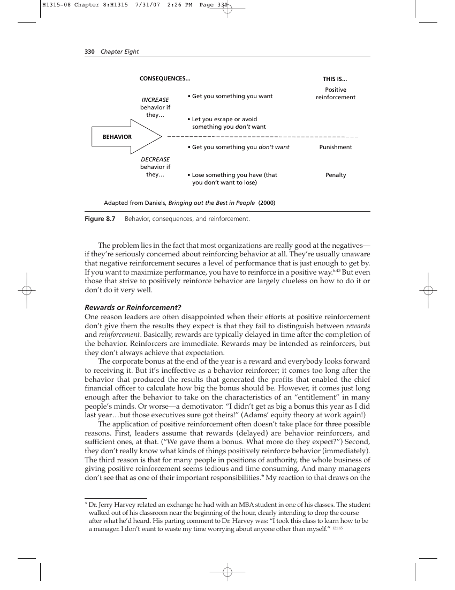

- Get you something you want
- Let you escape or avoid something you don’t want

### Behavior

- Get you something you don’t want
- Lose something you have (that you don’t want to lose)

The problem lies in the fact that most organizations are really good at the negatives— if they’re seriously concerned about reinforcing behavior at all. They’re usually unaware that negative reinforcement secures a level of performance that is just enough to get by. If you want to maximize performance, you have to reinforce in a positive way.6:43 But even those that strive to positively reinforce behavior are largely clueless on how to do it or don’t do it very well.

#### Rewards or Reinforcement?

One reason leaders are often disappointed when their efforts at positive reinforcement don’t give them the results they expect is that they fail to distinguish between rewards and reinforcement. Basically, rewards are typically delayed in time after the completion of the behavior. Reinforcers are immediate. Rewards may be intended as reinforcers, but they don’t always achieve that expectation. The corporate bonus at the end of the year is a reward and everybody looks forward to receiving it. But it’s ineffective as a behavior reinforcer; it comes too long after the behavior that produced the results that generated the profits that enabled the chief financial officer to calculate how big the bonus should be. However, it comes just long enough after the behavior to take on the characteristics of an “entitlement” in many people’s minds. Or worse—a demotivator: “I didn’t get as big a bonus this year as I did last year…but those executives sure got theirs!” (Adams’ equity theory at work again!) The application of positive reinforcement often doesn’t take place for three possible reasons. First, leaders assume that rewards (delayed) are behavior reinforcers, and sufficient ones, at that. (“We gave them a bonus. What more do they expect?”) Second, they don’t really know what kinds of things positively reinforce behavior (immediately). The third reason is that for many people in positions of authority, the whole business of giving positive reinforcement seems tedious and time consuming. And many managers don’t see that as one of their important responsibilities.* My reaction to that draws on the * Dr. Jerry Harvey related an exchange he had with an MBA student in one of his classes. The student walked out of his classroom near the beginning of the hour, clearly intending to drop the course after what he’d heard. His parting comment to Dr. Harvey was: “I took this class to learn how to be a manager. I don’t want to waste my time worrying about anyone other than myself.” 12:165 observation my Marine student: You might be well suited to manage things, but never to lead people. The lesson here is that successful change requires effective leadership. Effective leadership is first and foremost about people. Leading people—getting them to do what you want them to do when they are under no obligation to do so—demands deft skill in directing their behavior. This, in turn requires the sometimes tedious practice of positive reinforcement. The astute reader will notice that I avoided a detailed discussion on what kinds of things represent positive reinforcers. For one thing, these will differ from one organization to another and from one person to another, and it’s beyond the scope of this book to do that. For another, there are other sources specifically and entirely devoted to addressing this issue. One is Aubrey Daniels’ book. (See endnotes for citation.) Two others that put reinforcement in a much broader system context are Social Power and the CEO and The Requisite Organization, both by Elliott Jaques.17;18 Anyone searching for “an epiphany on the road to Damascus” is encouraged to read the latter two.

### A General Strategy for Implementing Change

It’s time to tie together everything we’ve explored so far. I call what follows a general strategy, because it’s not practical to provide “cookbook directions.” For one thing, that’s beyond the scope of this book. For another, each organizational situation will differ enough from others that discrete step-by-step instructions wouldn’t apply in many circumstances.

#### A Common Scenario

Though organizations may differ, most have some elemental factors pertaining to change in common. The creation of a flexible framework that can apply to different kinds of organizations requires a common set of assumptions and a scenario for how change is typically introduced. Assumptions

- Organizations are hierarchical.
- Final authority is concentrated in the hands of one leader, that is, everybody knows where “the buck stops.” (You may not always know who’s right, but you always know who’s in charge!)
- No significant change happens in any organization without the active commitment of its leader. Passive support is not enough.
- The organization’s leader is Change Agent-in-Chief. Even if most of the “heavy lifting” is delegated, for change to succeed the leader must drive it.
- Leaders and subordinates alike behave in ways they perceive will satisfy their internal needs.

How Change “Gets In” Any sort of new idea, methodology, or other change enters most organizations in one of two ways: either it comes from the leader, or some subordinate within the organization suggests it. If the impetus for change originates with the leader, it could come from “divine inspiration” or from some source outside the organization. Typical external sources might include media articles, journals, professional societies, conferences or symposia, or even networking with other leaders. If the initial impetus comes from a subordinate, it’s likely the subordinate learned about it from some external source, too. It’s always better if leaders discover the idea for themselves. If they do, their interest in it is already established. Maybe they’ve even persuaded themselves already that it could satisfy their need. This isn’t usually the case if the idea comes up through the organization.* Leaders may have to be persuaded that it’s a good thing to do before they embrace it. Executive persuasion adds a prerequisite to the change, one that carries with it some other uncertain variables. Yet “filtering up” from within is how many organizations have been introduced to new ways of doing things, such as total quality management, business process re-engineering, lean, Six Sigma, and so forth.

#### The Leader as Change Agent-in-Chief

Regardless of how the idea for change enters the organization, it’s almost axiomatic that if the leader doesn’t want it, it won’t happen. But the converse is not necessarily true, either. Just because a leader does want a change to happen doesn’t mean that it will. Leaders must clearly and visibly demonstrate—by deeds as well as words—their commitment to seeing the change happen. In other words, they must lead the change themselves. This is not the same as day-to-day hands-on management. Leaders may delegate detailed change management to some trusted subordinate, but they can’t put it on autopilot and say, “Report to me when it’s done.” The concept of positive reinforcement mentioned earlier applies here and it requires regular, repeated application. Subordinates notice their leaders’ behavior—and take their cues from it—even if they’re not saying anything. They can tell very quickly if a task or initiative isn’t high on the leader’s agenda, or whether leaders’ behavior is incongruent with their pronouncements. And they’ll behave with the same sense of urgency (or lack of it) themselves. Leaders lead by their own example, whether they’re conscious of it or not. And they have to get involved and stay involved. It’s almost a given that the high rate of failure of change initiatives—perhaps 80 percent by some estimates—occurs primarily because of human behavior, not because the change is technically or economically ineffective. Remember our discussions of human needs and the blitzkrieg principles from earlier in the chapter? It’s time to see how these fit into the change formula. (See Figure 8.8.) Increasing the odds of successful change begins with the leader’s perception of what will satisfy his or her unfulfilled needs (the left side of Figure 8.8). Satisfaction of the leader’s needs normally results from the effective discharge of the organization’s mission (the top-center of Figure 8.8). This, in turn, is the outcome of the coordinated, effectively directed behavior of the leader’s subordinates, from the top of the organization to the bottom. Let’s call this desired behavior (upper right of Figure 8.8). But subordinates’ behavior is the outcome of the perception that their needs will be satisfied by doing what the leader wants them to do (the right side of Figure 8.8). The blitzkrieg principles represent a bridge of trust between the leader’s needs and the subordinates’ needs. To satisfy his or her needs, the leader does the four elements of * Sometimes in this circumstance the leader’s “defensive antennae” pop up.

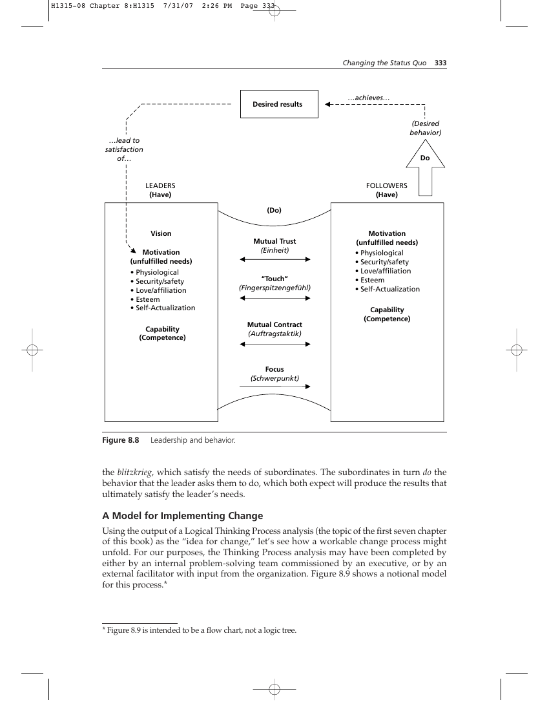

- Physiological
- Security/safety
- Love/affiliation
- Esteem
- Self-Actualization
- Physiological
- Security/safety
- Love/affiliation
- Esteem
- Self-Actualization

the blitzkrieg, which satisfy the needs of subordinates. The subordinates in turn do the behavior that the leader asks them to do, which both expect will produce the results that ultimately satisfy the leader’s needs.

#### A Model for Implementing Change

Using the output of a Logical Thinking Process analysis (the topic of the first seven chapter of this book) as the “idea for change,” let’s see how a workable change process might unfold. For our purposes, the Thinking Process analysis may have been completed by either by an internal problem-solving team commissioned by an executive, or by an external facilitator with input from the organization. Figure 8.9 shows a notional model for this process.*

* Figure 8.9 is intended to be a flow chart, not a logic tree.

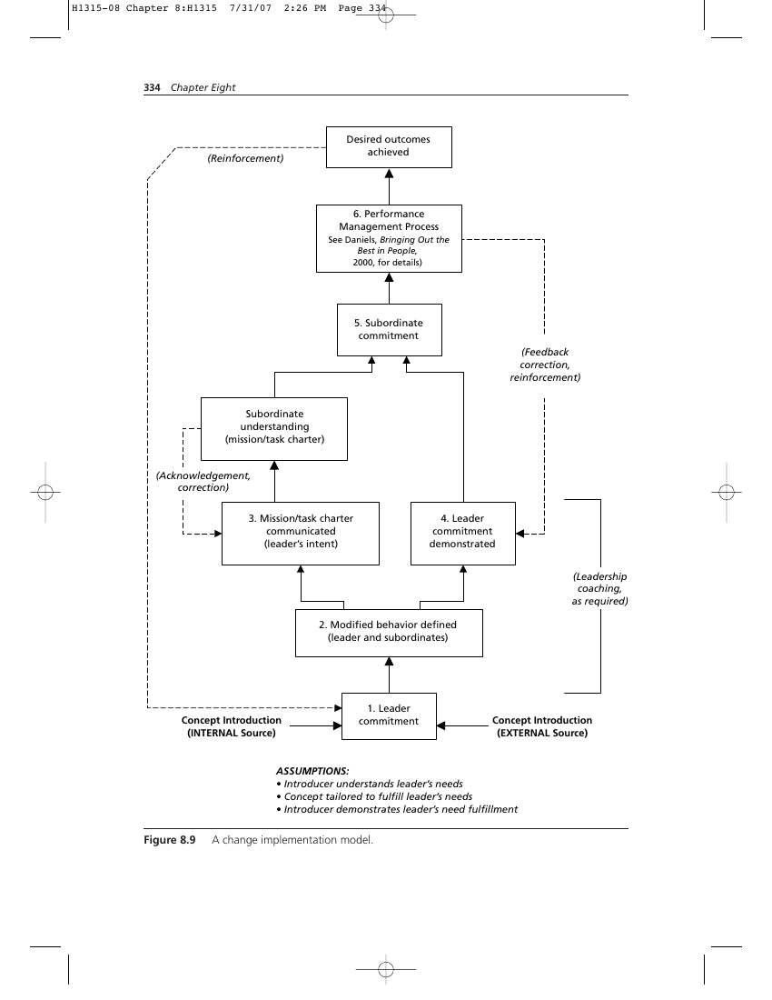

1. Performance
1. Subordinate commitment
1. Mission/task charter communicated (leader’s intent)
2. Leader commitment demonstrated
1. Modified behavior defined (leader and subordinates)
1. Leader commitment
- Introducer understands leader’s needs
- Concept tailored to fulfill leader’s needs
- Introducer demonstrates leader’s need fulfillment
1. Leader Commitment As discussed above, if the organizational leader is not actively committed to the change, it won’t happen. For the leaders to commit themselves three things must happen:
- Whoever introduces the leader to the new idea must understand the leader’s needs, both their needs as leaders and their personal, emotional needs. Leaders probably have an intuitive understanding of their own needs, so if they discover the concept on their own, they should be able to make a direct connection between the benefits it offers and the needs it satisfies.
- The concept must fit the leader’s needs. If it’s introduced by someone else, either inside or outside the organization, that person must tailor the concept to emphasize the leader’s needs. If the leader discovers the concept personally, he or she will either see its benefits immediately, or not.
- If the leader is introduced to the concept by someone else, that person must clearly demonstrate how the benefits will satisfy the leader’s needs. If these three conditions are met, the leader will likely be prepared to press ahead with implementation. But personal commitment alone isn’t sufficient to get the job done.
1. Modified Behavior Defined Once leaders are intellectually and emotionally committed to the new concept, they must have a clear picture of their responsibilities as Change Agents-in-Chief. This can often require external coaching by experts in the new concept, masters of behavioral change psychology, or both. The important thing to remember is that an authoritarian approach is not a good idea. Maximizing the odds of long-term success requires blitzkrieg-type mutual trust and moral contracts. Before issuing the change charter to the organization, it’s important to know exactly which leader and subordinate behaviors must change and how. The concept expert is probably in the best position to identify and quantify these behaviors and suggest measurements that can confirm effective behavioral change.
2. Mission/Task Charter Communicated Once the new behaviors of both leaders and subordinates have been defined, the time has come for the leader to notify the organization of the change. Often, as in the Ford Motors example cited earlier in this chapter, the leader will delegate that to an expert, as Peterson did with Deming. But if at all possible, leaders should themselves brief the change in operational procedures and behaviors. It sets a better example because it demonstrates that the leader has internalized the concept well enough to convey it to others as his or her own. An indispensable part of any communication process is “message received and understood.” After delivering the new charter, leaders must confirm that all subordinates heard and understood what the leader expects. Just asking “Are there any questions?” at the end of the presentation of the mission may not be sufficient. It might be advisable for leaders to independently meet with key subordinates and opinion leaders to ascertain whether they truly understand what is being asked of them and agree to do it. This constitutes the moral contract step explained in Figure 8.5. This step is where a blitzkrieg-competent organization (that is, one for which the four principles described in Figure 8.5 are second nature) has a decided advantage. Changes in direction cause no consternation in such organizations because these principles are the bedrock of maneuver warfare and maneuver automatically implies rapid change. Moreover, if the blitzkrieg principles have been effectively embedded within the

organization, the leader’s job of issuing the charter is significantly simplified: he or she can establish the intent alone, with complete confidence that subordinates will move heaven and earth to make the leader’s wish their command.

1. Leader Commitment Demonstrated In a blitzkrieg-type organization, this commitment is already inherent in the leadersubordinate relationship. Unfortunately, most organizations don’t practice blitzkrieg principles. Consequently, the leader standing up and delivering the mission charter isn’t likely to be sufficient. Building on the leader and subordinate behaviors defined in Step 2, leaders must make it clear that they will continue to be interested in progress on the change and they will expect periodic updates. Even more, they should plan to personally visit the subordinates’ work place periodically to ask pointed questions about progress on the change. Positive verbal reinforcement on such occasions always helps.
2. Subordinate Commitment If leaders complete the first four steps of this process, the probability of subordinate commitment improves dramatically. It’s not necessarily guaranteed. The more authoritarian an organization is, the less trust has been established, the more likely it is that subordinates will do the minimum necessary to keep pressure off themselves and will not be personally committed to successful change. This is likely to be the case in most organizations, since very few actually have such trust established. For this reason, the next step is required.
3. Performance Management Process This is a subject worthy of a separate book all its own. In fact, such a book already exists: Bringing Out the Best in People, by Aubrey C. Daniels.6 It explains “everything you always wanted to know but were afraid to ask” about how to positively reinforce desirable behavior to improve organizational performance. The ultimate result, however, is that the desired behaviors should be realized and sustained, and the desired outcomes achieved.

A Last Thought about Ensuring Effective Change To bring this discussion of organizational change to conclusion, let me offer one other practical tool that leaders can use to ensure the change they’ve chartered will actually happen the way they want it to. This tool is a four-component process called the O-O-D-A loop (pronounced OOH-dah). It was conceived by John Boyd, who derived it from his experiences as a fighter pilot and from his study of military strategy going back to Sun Tzu. Boyd's theories inspired the battlefield strategy that defeated the Iraqi Army in Kuwait in just 96 hours back in 1991, and today they form the basis of the Marine Corps' maneuver warfare doctrine and many of the tactics used by modern special operations forces. (See Figure 8.10) O-O-D-A stands for observe, orient, decide, and act. Somewhat similar to the Shewhart Cycle recommended by Deming, the O-O-D-A loop is designed to facilitate rapid, effective decision making.* Leaders who oversee their organizations with the O-O-D-A loop are not only concerned with shaping or even driving changes in the * It must be emphasized, however, that Boyd was adamantly opposed to treating the O-O-D-A loop as a rigid cycle. He meant the arrows coming out of the orient stage to imply that one could go anywhere from there: skip over decision directly to action, or feed back to observe. It is a loop, because at some point all paths lead back to observe. But its objective is speed in completing multiple iterations of the loop, not to drive people through the kind of pedagogical cycle that the Shewhart Cycle represents.

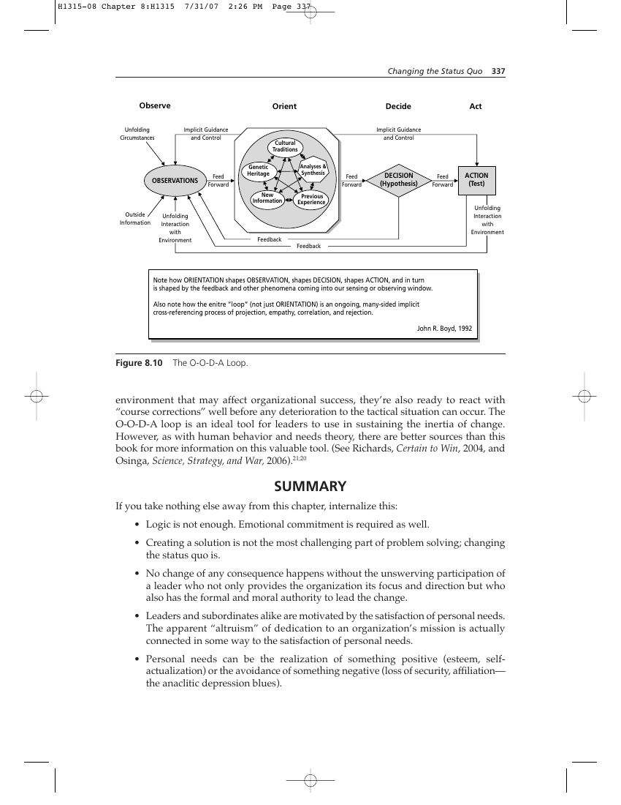

#### Environment Feedback Feedback

Note how ORIENTATION shapes OBSERVATION, shapes DECISION, shapes ACTION, and in turn is shaped by the feedback and other phenomena coming into our sensing or observing window. Also note how the enitre “loop” (not just ORIENTATION) is an ongoing, many-sided implicit cross-referencing process of projection, empathy, correlation, and rejection. John R. Boyd, 1992 environment that may affect organizational success, they’re also ready to react with “course corrections” well before any deterioration to the tactical situation can occur. The O-O-D-A loop is an ideal tool for leaders to use in sustaining the inertia of change. However, as with human behavior and needs theory, there are better sources than this book for more information on this valuable tool. (See Richards, Certain to Win, 2004, and Osinga, Science, Strategy, and War, 2006).21;20

- Logic is not enough. Emotional commitment is required as well.
- Creating a solution is not the most challenging part of problem solving; changing the status quo is.
- No change of any consequence happens without the unswerving participation of a leader who not only provides the organization its focus and direction but who also has the formal and moral authority to lead the change.
- Leaders and subordinates alike are motivated by the satisfaction of personal needs. The apparent “altruism” of dedication to an organization’s mission is actually connected in some way to the satisfaction of personal needs.
- Personal needs can be the realization of something positive (esteem, selfactualization) or the avoidance of something negative (loss of security, affiliation— the anaclitic depression blues).
- Successful, sustained implementation of change depends on a combination of Level 5/blitzkrieg-type leadership and a rational system of positive reinforcement that satisfies the needs of leaders and subordinates alike.
- Consistent, effective application of reinforcement is not a one-time thing; it requires time and continuing personal discipline by leaders.
- If you don’t have leadership commitment a priori, you’re wasting your time trying to implement the change. If you don’t have consistent, regular positive reinforcement that satisfies individual needs, no change can be sustained for long. You can buy a man's time; you can buy his physical presence at a given place; you can even buy a measured number of his skilled muscular motions per hour. But you cannot buy his enthusiasm...you cannot buy loyalty...you cannot buy the devotion of hearts, minds, or souls. You must earn these.

> —Clarence Francis

### Endnotes

1. Argyris, Chris. On Organizational Learning. Oxford: Blackwell, 1992.
2. “A Special Report on Executive Pay,” The Economist, January 20-26, 2007.
3. Bennis, Warren, and Burt Nanus. Leaders: The Strategies for Taking Charge. New York: Harper & Row, 1985.
4. Collins, Jim. Good to Great: Why Some Companies Make the Leap…and Others Don’t. NY: Random House Business Books, 2001.
5. Damasio, Antonio R. Descartes’ Error: Emotion, Reason and the Human Brain. NY: G.P. Putnam’s Sons, 1994.
6. Daniels, Aubrey C. Bringing Out the Best in People: How to Apply the Astonishing Power of Positive Reinforcement. NY: McGraw-Hill, 2000.
7. Deming, W. Edwards. The New Economics for Industry, Government, Education. Cambridge, MA: MIT Center for Advanced Engineering Study, 1993.
8. Dettmer, H.W. Strategic Navigation: A Systems Approach to Business Strategy. Milwaukee, WI: ASQ Quality Press, 2003.
9. Deutschman, Alan. “Change or Die,” Fast Company, May 2005, p.53
10. Gardner, Howard. Changing Minds: The Art and Science of Changing Our Own and Other People’s Minds. Boston, MA: Harvard Business School Press, 2004.
11. Gibson, James L.; J. Ivancevich; J. Donnelly. Organizations: Behavior, Structure, Processes (7th ed.). Homewood, IL: Richard D. Irwin Inc., 1991.
12. Harvey, Jerry B. How Come When I Get Stabbed in the Back My Fingerprints are Always on the Knife? And Other Meditations on Management. San Francisco: Jossey-Bass, 1999.
13. _______. The Abilene Paradox and Other Meditations on Management. San Francisco: Lexington Books, 1988.
14. House, Robert J. Culture, Leadership, and Organizations: The GLOBE Study of 62 Societies. Thousand Oaks, CA: SAGE Publications, 2004.
15. http://dictionary.reference.com/browse/direct
16. Jaques, E. and S. Clement. Executive Leadership. Arlington, VA: Cason Hall, 1991.
17. ________. Social Power and the CEO. Westport, CT: Quorum Books, 2002.
18. ________. The Requisite Organization (rev. 2d. ed.). Arlington, VA: Cason Hall & Co., 1998.
19. Maslow, Abraham. “A Theory of Human Motivation,” Psychological Review, July 1943, pp. 370-396.
20. Osinga, Frans P.B. Science, Strategy, and War: The Strategic Theory of John Boyd. London: Routledge, 2006.
21. Richards, Chet. Certain to Win. Xlibris, 2004.

