# Epilogue

We’re at the end. There’s considerably more “richness” to the Thinking Process than we can address in this book, both in applications and permutations and combinations of ways the logic trees can be used. The appendices that follow contain real-world examples of logic trees and discussions of topics too detailed to include in individual chapters. In closing, I would leave you with some final thoughts:

- Everything that happens in this world is subject to cause and effect.
- The rules of cause and effect (Categories of Legitimate Reservation) are universally applicable to any logic-based situation.
- An Intermediate Objectives Map can provide a benchmark for desirable performance.
- A Current Reality Tree can reveal the interdependent cause-and-effect relationships behind deviations from desired performance.
- Evaporating Clouds can help resolve apparently intractable dilemmas, which often perpetuate critical root causes of undesirable effects.
- A Future Reality Tree can provide a robust “bench test” of proposed solutions, complete with consideration of potentially undesirable outcomes—unintended consequences—that might be associated with them.
- Prerequisite Trees are the bridge between logically constructed solutions and their implementation.
- Using the Thinking Process, you can start with an ill-defined problem and end with an implementation plan for a solution that offers a high probability of success.
- Logical solutions are not enough. Implementation requires effective leadership and careful consideration of human psychology. From here on, it’s up to you to decide what you do with the Thinking Process. After you’ve taken opportunities to practice and apply the trees, individually or in concert, I urge you to reread selected chapters, particularly Chapter 3 (Intermediate Objective Map) and Chapter 4 (Current Reality Tree). I think you’ll find that what you read earlier

will take on new meaning as you reread it through the clarifying lens of experience. And ultimately, your subsequent efforts will be more rewarding for doing so. In closing, let me remind you of the message implicit in the O-O-D-A loop (Figure 8.10): Even good solutions deteriorate over time as the external environment and circumstances change. Or, as an anonymous farmer once said…

> The hardest thing about milking cows is that they never stay milked.
>
> —Anonymous

> Reasonable people do everything to adjust to the world. Unreasonable people never give up trying to adjust the world to themselves. Therefore, all progress depends on unreasonable people.
>
> —George Bernard Shaw

# Appendices

## Appendix A: Strategic Intermediate Objectives Map

#### Strategic Intermediate Objective Map

The Intermediate Objectives Map that follows was created to be more than a problem-solving tool. It was conceived as the foundation for the strategy of a not-for-profit foundation formed in 2005. The Sam Spady Foundation (http://www.samspadyfoundation.org) was created by Samantha Spady’s parents following her tragic death by alcohol poisoning at Colorado State University in Fort Collins, Colorado, in September 2004. The Spadys were determined that they would do everything they possibly could to prevent other young people from losing their lives in this way—and spare other parents from the inconsolable grief that they endured. The Sam Spady Foundation Strategic Intermediate Objectives Map is actually more detailed than the one shown here, which has been abbreviated for illustration purposes. The original is actually two pages long and runs to about four levels of necessary conditions below the critical success factors. Not every IO Map needs to be that detailed, but because this was a start-up organization, the extra detail gave the Spadys a greater sense of confidence that they had all the required bases covered. If anything, this is an excellent example of the flexibility of the IO Map—it can incorporate as much or as little detail as the user needs. It should be clear from reading the content of this IO Map that the goal, critical success factors, and necessary conditions for an educational foundation differ dramatically from those one would see in the IO Map of a commercial company or government agency. Each type of organization can expect to have an IO Map of different structure. And within similar types of organizations, content will differ, reflecting the unique characteristics of each foundation, company, or agency.

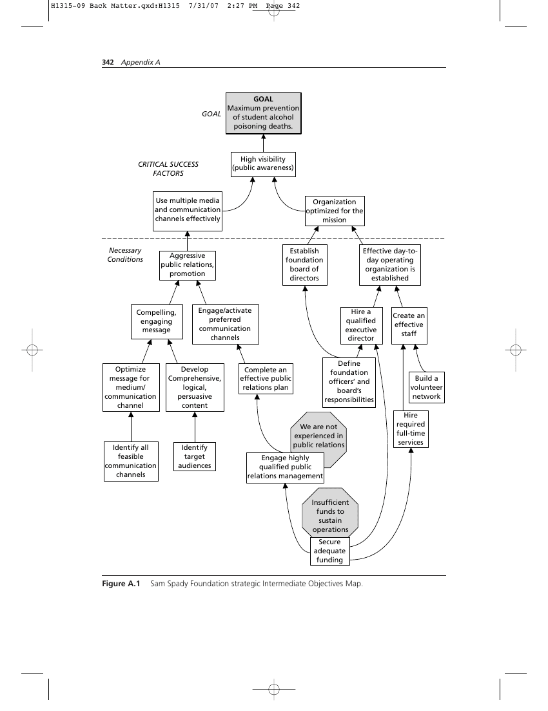

GOAL

Maximum prevention GOAL

of student alcohol poisoning deaths. CRITICAL SUCCESS FACTORS

High visibility (public awareness)

Use multiple media and communication channels effectively Necessary Conditions Organization

optimized for the mission

Compelling, engaging message Optimize

message for medium/ communication channel

Identify all feasible communication channels

Effective day-today operating organization is established Establish

foundation board of directors Aggressive

public relations, promotion

Engage/activate preferred communication channels Develop

Comprehensive, logical, persuasive content Identify

target audiences Hire a

qualified executive director Define

foundation officers’ and board’s responsibilities Complete an

effective public relations plan

We are not experienced in public relations Engage highly qualified public relations management Insufficient

funds to sustain operations Secure

adequate funding

Figure A.1

Sam Spady Foundation strategic Intermediate Objectives Map. Create an

effective staff Build a

volunteer network Hire

required full-time services

## Appendix B: Executive Summary Trees

Ever since Goldratt conceived the Thinking Process, practitioners have experienced a problem, particularly with the Current Reality and Future Reality Trees: communicating the logic of problem definitions and solutions in a concise but effective manner. People build these trees to solve problems, but in most cases the critical root causes are outside their spans of control. This normally means that they need help from other people to resolve them, normally in the form of decision authority or influence. These “helpers” must often be persuaded of the need to help. It would seem natural to show these people the trees we’ve constructed to make a logical case for what we need them to do and why. If you haven’t already experienced it, you’ll soon find that problem analysis and solution can often be quite complex. Some of these logic trees we’ve learned to construct can become very detailed. And those whom we need to persuade to help implement the solution may have neither the time nor the patience to “walk through” each layer of causeand-effect logic all the way from the critical root cause to the undesirable effects, or from the injections to the desired effects. Yet they may need convincing about the validity of the logic before deciding (favorably) to help. In other words, it’s quite possible to “bore to death” with details the very people whose help we need.

### The Executive Summary Tree

Since executives are usually the final authority for decisions that mandate major system change, they’re the potential audience for Executive Summary Trees. Since most people don’t have direct access to executives for decision authority, they’re obligated to pass their analysis through some intermediate levels of management authority before even showing it to senior executives. At both levels, time is at a premium, and someone seeking a decision is required to get “on stage,” present a succinct message, and get off in minimum time, often 30 minutes or less.* One solution to this challenge is an Executive Summary Tree, designed exclusively to communicate parts of the Thinking Process analysis succinctly. This type of tree is not a substitute for a thorough, logical system analysis. In fact, such an analysis is the single

* It’s been said that executives have the attention span of a five-year-old. If you can’t get your message across quickly, you’ve lost them.

entering argument for the Executive Summary Tree. This type of tree is the second step in the process of obtaining a decision. The entire sequence is:

1. Complete the detailed logical system analysis
2. Compress the most critical issues into an Executive Summary Tree
3. Present the summary tree without excessive explanation, and allow the decision maker to ask questions for which he or she wants answers The first step is time consuming but not difficult to do. The procedures in the eight chapters of this book explain how to do it. The second and third steps are the subject of this appendix.

### Procedures for Constructing Executive Summary Trees

There are ten steps to this process. Each of them is explained below with supporting illustrations. It’s best to do this with a piece of flip-chart paper and Post-it Notes first, then transfer the final results to digital form later as required. This will be the draft version of your Executive Summary Tree.

1. Complete Your Current/Future Reality Tree You can’t start an Executive Summary Tree without a completed sufficiency tree. Normally, decision makers are more interested in what the problem is and what the recommended solution is. They may be less interested in how you plan to implement the solution—at least until you’ve convinced them that the problem is real and that your proposed solution has potential for solving it. The trees that do this, of course, are the Current and Future Reality Trees. These are also the ones that are likely to pose the biggest challenge to present in a short time. Make certain that your CRT and/or FRT are as logically sound as you can make them. (See Figure B.1.)
2. Isolate the Undesirable Effects or Desired Effects

#### Most Important to the Executive

If you’ve followed the approach recommended in this book, you will have only a limited number of UDEs or DEs, all of them equally critical to the attainment of the system goal. Even so, your targeted executive may only be really interested in a few of these. Use your judgment about which UDEs/DEs to include in the Summary Tree based on your own knowledge of the executive’s personality and priorities. If the number of UDEs/DEs is small, you may decide to show them all. If not, you can usually obtain decision approval based on a smaller number. You know that the other UDEs/DEs are there, and you can explain them if asked, but it might not be necessary to do so to achieve the approval you seek. Replicate these UDEs/DEs on a blank page near the top.

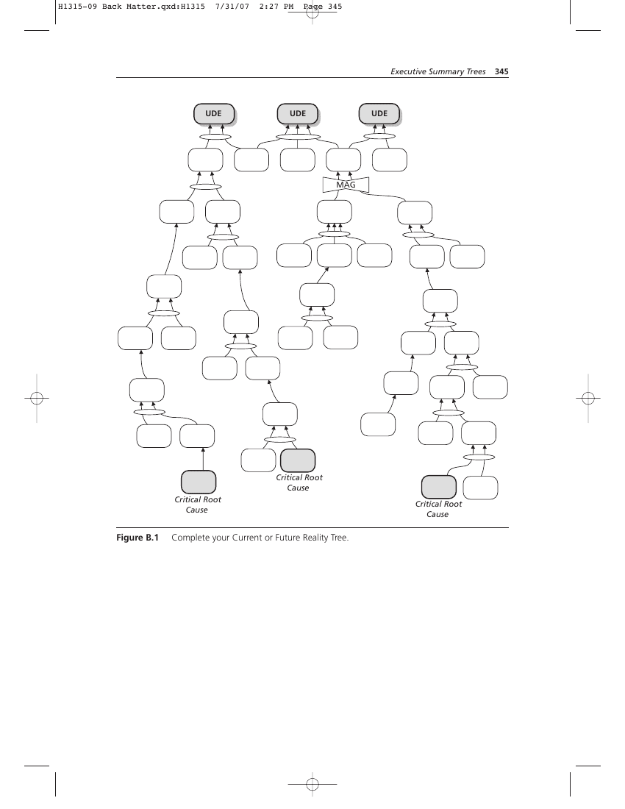

Executive Summary Trees

UDE

UDE

UDE

MAG Critical Root Cause Critical Root Cause

Figure B.1

Complete your Current or Future Reality Tree. Critical Root Cause

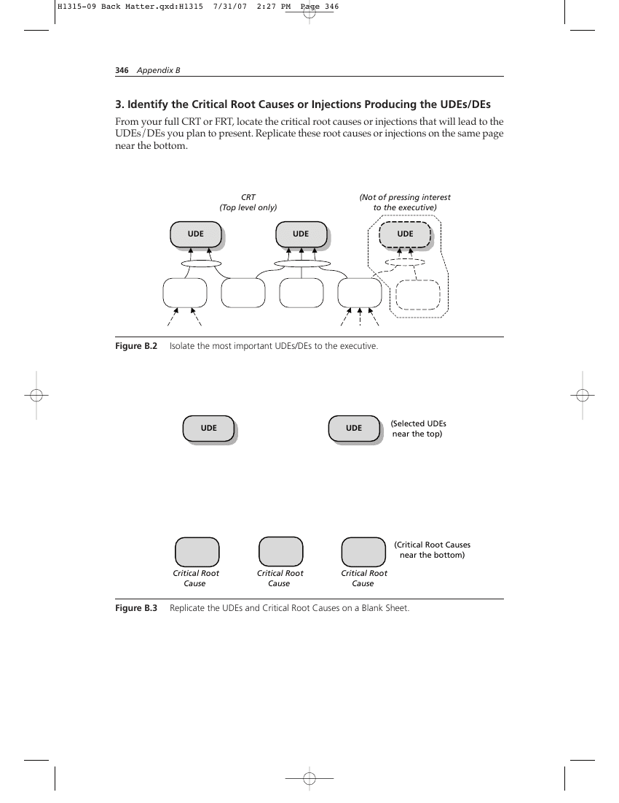

3. Identify the Critical Root Causes or Injections Producing the UDEs/DEs From your full CRT or FRT, locate the critical root causes or injections that will lead to the UDEs/DEs you plan to present. Replicate these root causes or injections on the same page near the bottom. CRT

(Top level only) UDE

Figure B.2

(Not of pressing interest to the executive) UDE

UDE

Isolate the most important UDEs/DEs to the executive.

UDE

UDE (Selected UDEs

near the top) (Critical Root Causes

near the bottom) Critical Root Cause

Figure B.3

#### Critical Root Cause Critical Root Cause

Replicate the UDEs and Critical Root Causes on a Blank Sheet.

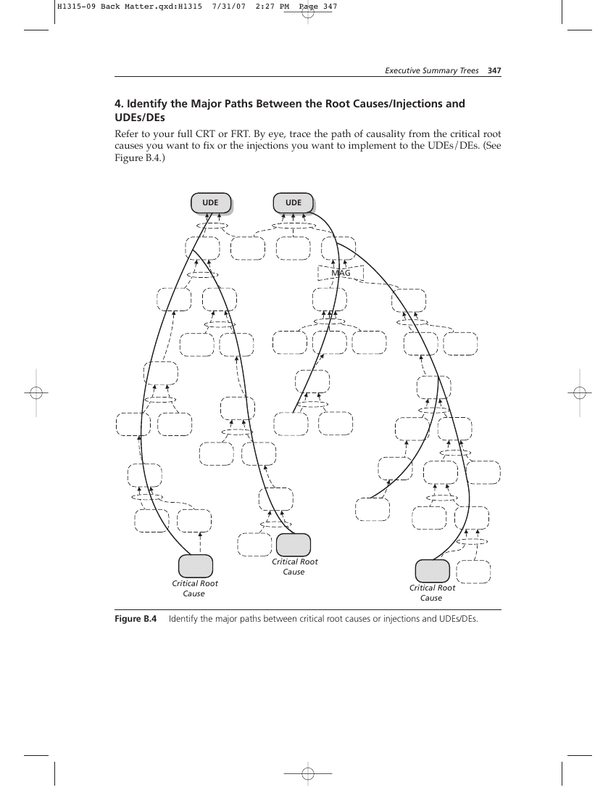

Executive Summary Trees

4. Identify the Major Paths Between the Root Causes/Injections and

#### UDEs/DEs

Refer to your full CRT or FRT. By eye, trace the path of causality from the critical root causes you want to fix or the injections you want to implement to the UDEs/DEs. (See Figure B.4.)

UDE

UDE

MAG Critical Root Cause Critical Root Cause

Figure B.4

#### Critical Root Cause

Identify the major paths between critical root causes or injections and UDEs/DEs.

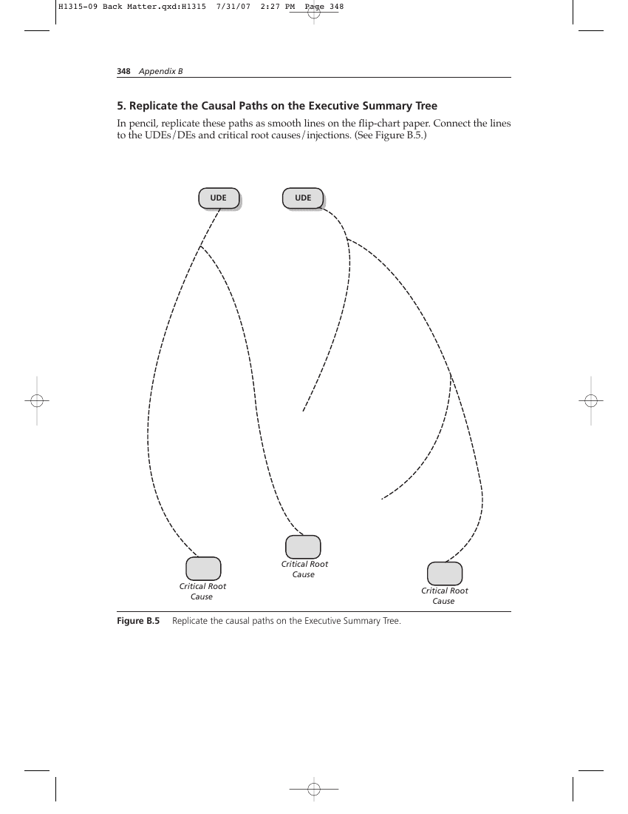

5. Replicate the Causal Paths on the Executive Summary Tree In pencil, replicate these paths as smooth lines on the flip-chart paper. Connect the lines to the UDEs/DEs and critical root causes/injections. (See Figure B.5.)

UDE

UDE Critical Root Cause Critical Root Cause

Figure B.5

Replicate the causal paths on the Executive Summary Tree. Critical Root Cause

#### Executive Summary Trees 6. Transfer Convergence/Divergence Entities from the CRT/FRT to the Executive Summary Tree

On the original CRT/FRT, identify the entities where major branches either converge or diverge. Replicate these entities in the Executive Summary Tree, and position them at the appropriate positions on the lines. (See Figure B.6.) Critical Root Cause Critical Root Cause

Figure B.6

#### Critical Root Cause

Transfer convergence/divergence entities from the CRT/FRT to the Executive Summary Tree.

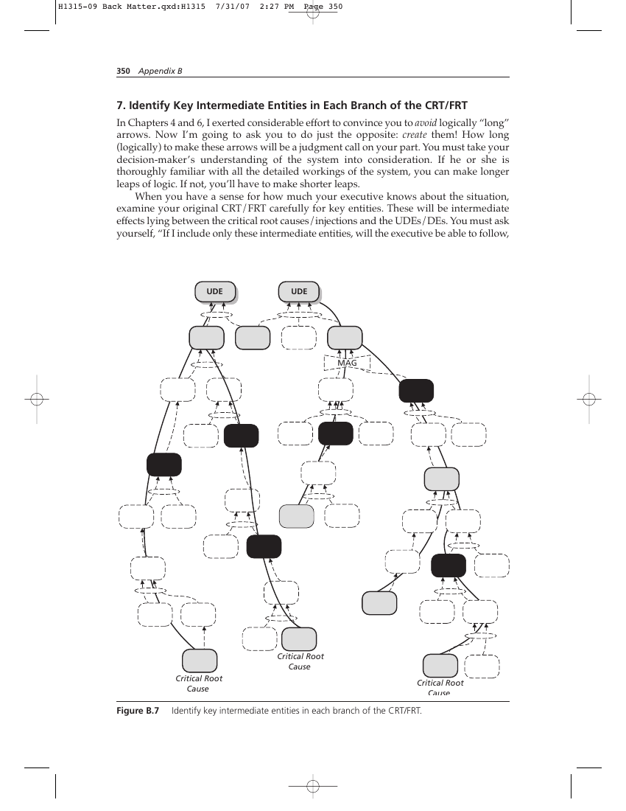

7. Identify Key Intermediate Entities in Each Branch of the CRT/FRT In Chapters 4 and 6, I exerted considerable effort to convince you to avoid logically “long” arrows. Now I’m going to ask you to do just the opposite: create them! How long (logically) to make these arrows will be a judgment call on your part. You must take your decision-maker’s understanding of the system into consideration. If he or she is thoroughly familiar with all the detailed workings of the system, you can make longer leaps of logic. If not, you’ll have to make shorter leaps. When you have a sense for how much your executive knows about the situation, examine your original CRT/FRT carefully for key entities. These will be intermediate effects lying between the critical root causes/injections and the UDEs/DEs. You must ask yourself, “If I include only these intermediate entities, will the executive be able to follow,

UDE

UDE

MAG Critical Root Cause Critical Root Cause

Figure B.7

#### Critical Root Cause

Identify key intermediate entities in each branch of the CRT/FRT.

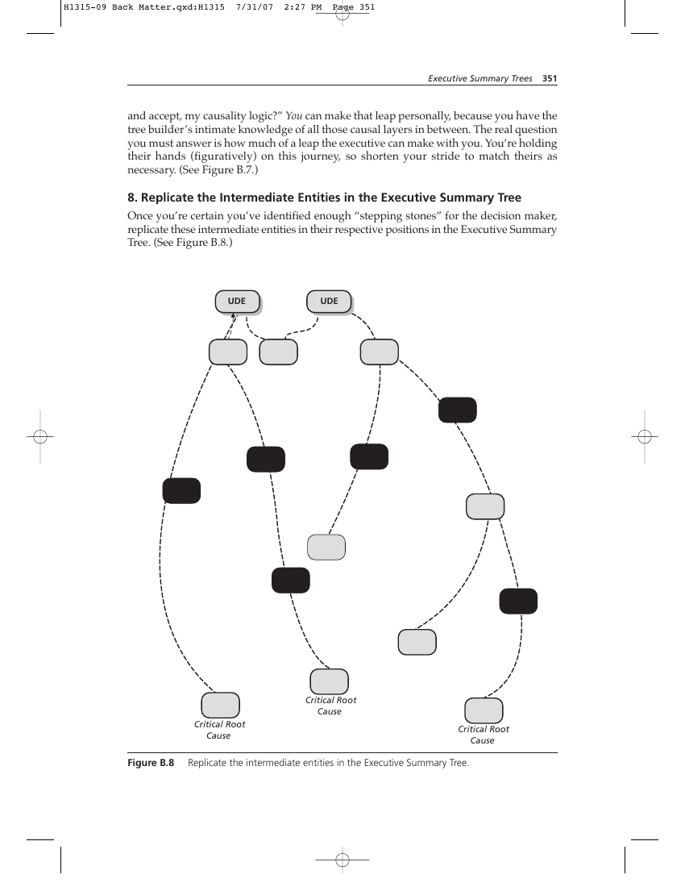

#### Executive Summary Trees

and accept, my causality logic?” You can make that leap personally, because you have the tree builder’s intimate knowledge of all those causal layers in between. The real question you must answer is how much of a leap the executive can make with you. You’re holding their hands (figuratively) on this journey, so shorten your stride to match theirs as necessary. (See Figure B.7.)

8. Replicate the Intermediate Entities in the Executive Summary Tree Once you’re certain you’ve identified enough “stepping stones” for the decision maker, replicate these intermediate entities in their respective positions in the Executive Summary Tree. (See Figure B.8.)

UDE

UDE Critical Root Cause Critical Root Cause

Figure B.8 Critical Root Cause

Replicate the intermediate entities in the Executive Summary Tree.

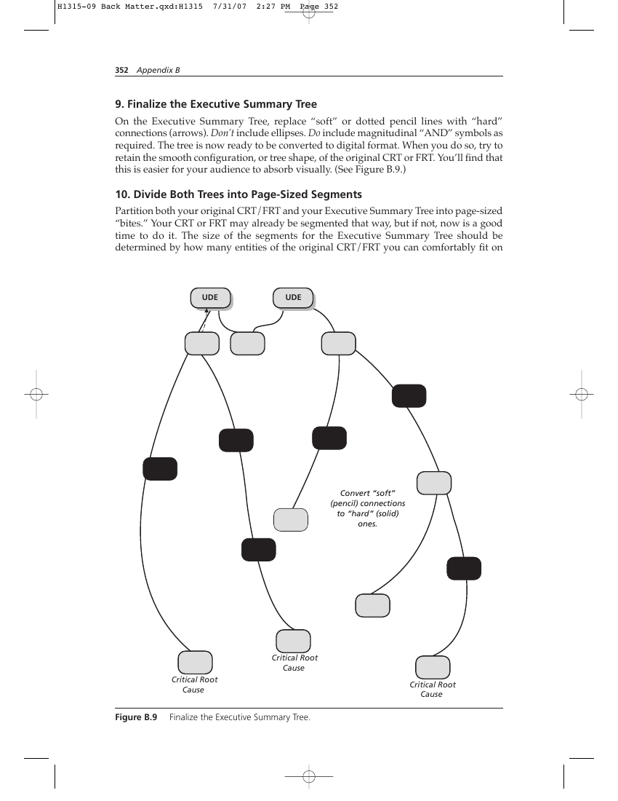

1. Finalize the Executive Summary Tree On the Executive Summary Tree, replace “soft” or dotted pencil lines with “hard” connections (arrows). Don’t include ellipses. Do include magnitudinal “AND” symbols as required. The tree is now ready to be converted to digital format. When you do so, try to retain the smooth configuration, or tree shape, of the original CRT or FRT. You’ll find that this is easier for your audience to absorb visually. (See Figure B.9.)
2. Divide Both Trees into Page-Sized Segments Partition both your original CRT/FRT and your Executive Summary Tree into page-sized “bites.” Your CRT or FRT may already be segmented that way, but if not, now is a good time to do it. The size of the segments for the Executive Summary Tree should be determined by how many entities of the original CRT/FRT you can comfortably fit on

UDE

UDE

Convert “soft” (pencil) connections to “hard” (solid) ones. Critical Root Cause Critical Root Cause one presentation page (paper copy or digital projection). It’s your choice whether or not you show these segment divisions on the Executive Summary Tree you present to the decision maker. However, it would be advisable for you to have a paper copy of the Summary Tree with these dividing lines shown. (See Figure B.10.) Why should you do this? Remember that you will be presenting a very streamlined tree. You do not want to force feed anymore detail than is required for executives to “make the logical leap” with you. But if you’ve guessed wrong and your executives want to know how you made that leap, you need to be prepared to walk them through the stepby-step CRT/FRT logic—but only for that particular segment that represents the “leap.” If a question like this arises in the middle of your presentation, you want to be able to

Figure B.9

Finalize the Executive Summary Tree. Critical Root Cause

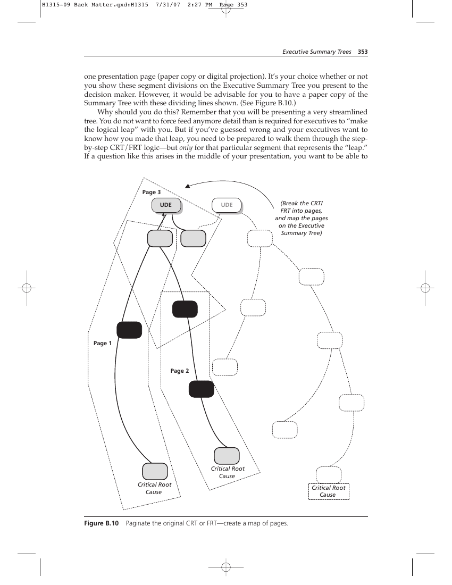

#### Executive Summary Trees

Page 3 UDE

UDE (Break the CRT/

FRT into pages, and map the pages on the Executive Summary Tree)

Page 1

Page 2 Critical Root Cause Critical Root Cause

Figure B.10

Paginate the original CRT or FRT—create a map of pages. Critical Root Cause display only that part of the CRT/FRT that answers that particular question. Having the CRT/FRT paginated for quick reference makes responding to challenges smoother. (See Figure B.11.) Once you’ve answered the decision maker’s question satisfactorily with step-by-step logic, go back to the Executive Summary Tree with its “long arrows.” UDE

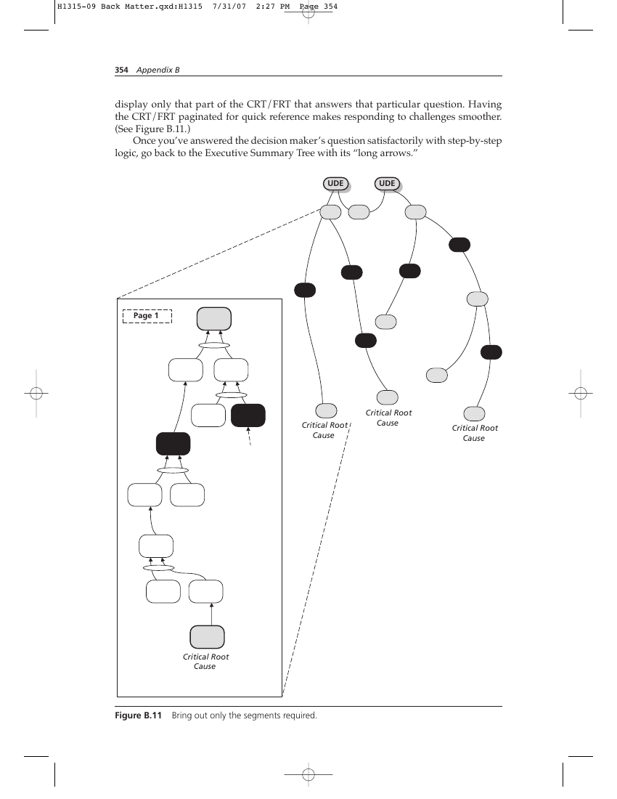

UDE

Page 1 Critical Root Cause Critical Root Cause

Figure B.11

Bring out only the segments required. Critical Root Cause Critical Root Cause

#### Executive Summary Trees

If you’re challenged on your step-by-step cause-and-effect logic at all, it won’t happen more than about twice before the decision maker accepts that you can answer any challenge. (Of course, this depends on the prior construction of an air-tight logical CRT or FRT.)

#### Presenting Your Executive Summary Tree

Now you’re ready to present your case. You have a finished version of your Executive Summary Tree, either printed neatly on plotter-sized paper or in a digitally-projected presentation. Ideally, you’ll have your digital version on no more than two slides. The paper version can be on one page. You also have your complete CRT or FRT paginated on standard bond paper and arranged in a numbered sequence. You may even have an overall “map” on the cover page. The easiest way to prepare for questions is to have this completed CRT or FRT printed in enough copies for the executive and key staff members. I suggest not handing out these copies until and unless you are challenged about the step-by-step logic. In my experience, if you give people something they can hold in their hand, they will be busy reading it and not paying attention to you. That’s something to be avoided as much as possible. If you are challenged and find that you must hand out these paper copies of the full tree, when you’ve answered to question to the decision-maker’s satisfaction, make a point of drawing attention back to your Executive Summary Tree when you’ve answered the question to the decision-maker’s satisfaction: “If there are no more questions about that particular segment, let’s return to this summary tree…”

## Appendix C: Current Reality Tree Exercise

For want of a nail, the shoe was lost. For want of a shoe, the horse was lost. For want of a horse, the rider was lost. For want of a rider, the message was lost. For want of a message, the battle was lost. For want of a battle, the war was lost. For want of a victory, the nation was lost. All for want of a horseshoe nail.

The poem above is believed to date to the time of the American Revolution. It clearly reflects a worst-case scenario involving cause and effect. Consider it an expression of an actual situation. Obviously, there would be much more to this scenario than the poem indicates—details such as organizational relationships, tactical and strategic situations, resource availability, leadership, and so forth. Use your imagination to flesh out some of the details of the circumstances under which this poem might have been written. Using the guidelines you have for building trees and the Categories of Legitimate Reservation:

- Decide on the goal and critical success factors.
- Identify the undesirable effect(s) inherent in this situation, based on your determination of the goal and CSF.
- Using the procedures outlined in Figure 4.45, build a Current Reality Tree that accurately reflects the situation, and from it identify critical root causes.
- Use your imagination. You may make any assumptions necessary about the situation in order to fill in gaps and develop entities for your tree.

## Appendix D: Evaporating Cloud Exercise

The Evaporating Cloud is one of the Thinking Process tools you are most likely to find daily uses for. Use this exercise to polish your skill at it.

### The Situation

Assume that you’re employed by a corporation. You’ve been with the company for years, you’re good at your job, and you’ve developed valuable skills. But you’re dissatisfied. You have the nagging feeling that you could achieve more and go higher in the organization than you’re currently allowed to do. Your “inner cowboy needs to yodel.” You recently began to think about leaving your company and going into business for yourself. The idea of being your own boss and letting your creativity flow appeals to you, but you have some trepidation about leaving the “warm, fuzzy” security of your current job. In a word, you feel conflicted.

### Your Assignment

Use this new conflict-resolution tool, the Evaporating Cloud, to work out your Hamletlike dilemma. Consider the following questions:

- What are the opposing positions (actions) about which you feel conflicted?
- Why does each side appeal to you? What “itch” will you be scratching by following each path?
- What’s your overall goal?
- What assumptions are you making (whether consciously or not) about each path?
- What can you do to relieve yourself of all “itches?”

### Create an Evaporating Cloud

When you’ve thought about these questions for a while, proceed with your Evaporating Cloud:

1. State your opposing prerequisites.
2. State the non-negotiable requirements each prerequisite satisfies for you.
3. State the common objective of those requirements.
4. Identify all the assumptions that underlie each arrow in the Evaporating Cloud.
5. Create one or more injections to resolve the conflict.

## Appendix E: The 3-UDE Cloud

The 3-UDE Cloud

At some point in your experience with the Thinking Process, some of you will undoubtedly encounter a way of attacking the problem-solving phase known as the 3-UDE Cloud, sometimes called the Core Problem Cloud. Some of you reading this book may have elsewhere learned this as the preferred way of doing problem analysis. In both cases, it's worth exploring the differences between the 3-UDE Cloud method and the way described in this book—what I call the modified traditional approach. As the name implies, the traditional approach preceded the 3-UDE Cloud method by about six years.

### The Basic Differences

The differences between the two approaches (traditional and 3-UDE Cloud) can be summarized this way:

#### Traditional

The traditional approach follows the scientific method: identify the problem, develop possible solutions, test the candidates, and select the best one. In applying the Thinking Process to the challenge of problem solving in complex systems, we start with the IO Map to determine the standards of required system performance, then prepare a Current Reality Tree to define the root causes of deviations in real-world performance, resolve any possible change dilemmas with an Evaporating Cloud, and finally move on to the Future Reality Tree to design and logically test the solution.

3-UDE Cloud The 3-UDE Cloud approach assumes that all system problems are the result of an underlying core conflict. This method seeks to ferret out that conflict first (that is, without actually establishing the causal connections), then uses that conflict to construct a “core” or “communication” Current Reality Tree to show how this conflict leads to the observed systemic undesirable effects.

#### Why Are There Two Methods?

The astute observer might well ask, “Why are there two methods? Why isn't the traditional approach enough?” It would seem logical to assume that if something is working the way it was intended, it shouldn't need to be changed. In fact, W. Edwards Deming saved some of his most critical comments for those who tampered with a stable process without proper understanding of what they were doing and why.2 It would seem reasonable to ask what was wrong with the traditional approach that caused some people to move away from it. Since we'd prefer not to speculate or resort to hearsay, its reasonable to look for some kind of documented history. Unfortunately, not much is available in the public domain. Documentation is limited to three sources: a paper in conference proceedings by Button,1 a book published later the same year by Lepore and Cohen,4 and a book by Scheinkopf.5 We'll examine all three.

#### Why Replace the Traditional Approach?

Lepore and Cohen don't provide a rationale for jettisoning the traditional method, but Button does. Experience with CRTs has uncovered two undesirable elements. One is that the core problem often reflects poorly on management practices. When a CRT is presented to those responsible for the core problem, this tends to immediately activate their defense mechanism. Further productive dialogue may be very difficult. The other is that in my experience, a CRT that is well constructed can take from 5 to 10 hours to develop. Few individuals have the stamina to undertake this effort on a regular basis.1:31

If I interpret this line of reasoning correctly, Button finds two faults with traditional CRTs. The first is that management is frequently too insecure to “swallow the medicine” (that is, bad news that may be their responsibility). The second is that traditional CRTs are "too tough to do” in most people's attention span. In other words, it might actually take up to 10 hours to identify a particularly challenging problem, and complex problems with profound system-level impact should be definable in much less time.

#### Core Problems and Core Conflicts

Both Button and Lepore and Cohen explain the 3-UDE approach in some detail, though there are some minor procedural differences between the two. (Scheinkopf addresses “communication” Current Reality Trees, but doesn’t mention the 3-UDE Cloud idea.) Button's explanation is also more pedagogical while Lepore's and Cohen's is more conceptual. Lepore and Cohen begin with the introduction of something called the Core Problem Cloud. The presumption in their discussion of the CRT4:124 is that a Core Problem Cloud can be used to explain the existence of the UDEs in a CRT: One of the popular ways to construct a CRT is to base it on the Core CRT that is using the Core Problem Cloud.4:124

The 3-UDE Cloud

Now we have two apparently different terms: CRT and core CRT. Unfortunately, Lepore and Cohen don't make clear the distinction between the two. They do, however, address the concept of a Core Problem Cloud in some detail.4:122-124 According to Lepore and Cohen: The Core Problem Cloud describes the conflict that prevents us from finding a solution to the core problem. There are three major types of Core Problem Clouds:

1. Conflict with the “rules” of the system
2. Personal dilemma of the leader
3. Conflict between functions, management levels, or individuals (chronic conflict)

There are a couple of unstated assumptions that require examination, and an interesting implication of Lepore's and Cohen's perspective on systems that follows from it. The first assumption, which I have personally heard Goldratt express, is that conflict underlies all core problems. And the second is that a large majority of a system's undesirable effects (Goldratt has said 70 percent or more) are accounted for by this core problem. The implication for Lepore's and Cohen's system perspective is that all possible conflicts perpetuating core problems are reducible to one of these three categories: rules, personal leadership dilemmas, or functional/management/personal conflict. In other words, no allowance is made for core problems resulting from incomplete knowledge (ignorance of causal connections), insufficient resources, or factors external to the system itself. The second is even more interesting: that a large majority of a system's undesirable effects result from a core problem. This idea is somewhat easier to accept when we consider that since its inception (and until this second edition), an undesirable effect has been imprecisely defined as just about anything that's happening in your system that you or others don't like. Because that opens the door to virtually everything, it's easy to see how a single core problem might cause a large percentage of UDEs, maybe even a large majority. Lepore and Cohen confirm this: These UDEs cover a fairly large span; they originate from different sources and have different “weights.”4:124

This represents an important and fundamental difference between the modified traditional approach to the Thinking Process described in this book and the Core Problem Cloud method. The latter suggests that not all UDEs are created equal, and that there are a lot of them in any system. The modified traditional method described in this book suggests that there are relatively few real UDEs in a system, and that they are clearly identifiable with respect to the system's goal and critical success factors—of which there are probably no more than three to five. And because each of these critical success factors is, by definition, a necessary condition to attaining the system goal, the absence of any one compromises goal attainment. This makes the few real UDEs any system might experience relatively equal in weight, and not a matter of one person's opinion versus another's.

To summarize briefly, the 3-UDE Cloud method, or Core Problem Cloud (as Lepore and Cohen refer to it), is based on the following assumptions:

- UDEs are subjectively determined
- Most system UDEs result from a single core problem
- Conflict underlies all core problems
- Core-problem conflicts fall into only three archetypes (Boy, that sure makes complex problem identification easy!) On the other hand, the modified traditional approach to the Thinking Process is based on the following assumptions:
- All UDEs are objectively defined with respect to non-negotiable, system-critical success factors (refer to Chapter 3)
- There are relatively few real UDEs in any system
- All UDEs result from a few critical root causes (true core problems are relatively rare)
- Critical root causes are not limited to a few common archetypes ("generic")

Basics of the 3-UDE/Core Problem Cloud The 3-UDE, or Core Problem Cloud, works essentially like this. First, you identify an UDE pertaining to the system. (Remember, almost anything you don't like can qualify as an UDE.) Then you determine its opposite condition—a corresponding desired effect. Repeat this process two more times, so that you have three UDEs and matching opposite desired effects. These pairs become the conflicting prerequisites in three different Evaporating Clouds.1,4 To construct the rest of the cloud, the usual right-to-left procedure is employed (refer to Chapter 5). In each case, however, the requirements and objective are established by determining the direct and immediate reason for existence—what outcome each conflicting prerequisite (the UDE and the desired effect) is aimed at achieving. The overall objective is then determined as some overarching condition that both requirements are intended to satisfy. Clearly, the product of this part of the process is three discrete Evaporating Clouds, the only common thread of which may be that they are inherently part of the same larger system. These three clouds are then consolidated into a single “generic” cloud.* 7 The process of consolidation, as described both by Button and by Lepore and Cohen, is purely inductive in that it attempts to reach a “general rule” conclusion from three component elements. And therein lies one of the logical fallacies with the 3-UDE/Core Problem Cloud method.

#### Inductive Reasoning

Why is a conclusion arrived at inductively not logically sound? The answer lies in the nature of inductive reasoning itself.

* “Generic,” in its intended use here, is a bit of a misnomer. A thesaurus lists the following synonyms for the word: all-encompassing, blanket, collective, comprehensive, general, inclusive, nonexclusive, sweeping, universal, wide. The more appropriate term in this circumstance would be “inductive.”

The 3-UDE Cloud

Induction or inductive reasoning, sometimes called inductive logic, is the process of reasoning in which the premises of an argument are believed to support the conclusion but do not ensure it. It's used to ascribe properties or relations to broader types based on tokens (that is, on one or a small number of observations or experiences), or to formulate laws based on limited observations of recurring phenomenal patterns.3 Basically, it induces the universal from the particular. However, the conclusion is far from certain. What, then, is the process of "genericizing" three discrete clouds into a single consolidated one, inducing a universal conclusion from particular details? It’s inductive reasoning. And why is this a problem? The answer is that conclusions drawn in this manner are usually over-generalizations. Consider, for example: I always hang pictures on nails; therefore, all pictures hang from nails. or Teenagers are given many speeding tickets; therefore, all teenagers speed.3

As mentioned earlier, Lepore and Cohen don't offer any specific examples, only conceptual directions. But Button does. Here's an example of generic cloud elements (in this case, the conflicting prerequisites) induced from particular, specific ones:1

Specific cloud #1 Specific cloud #2 Specific cloud #3 Generic cloud

P1 (or D) Don't work overtime. Buy a component. Build only on demand. Take action for good department performance.

P2 (or D') Work overtime. Make a component. Build to stock. Take action for good system performance.

It's not obvious how any of these components produces its respective conclusion, and in some cases an argument could be made that the conclusion could actually require an opposite component. (For example, taking action for the good of a department might actually require working overtime.) Without beating this particular example to death, the other “UDE Cloud” elements constitute equally weak inductions.3

#### The Fundamental Problem with Inductive Reasoning

Formal logic, as most people learn it, is deductive rather than inductive. Some philosophers claim to have created systems of inductive logic, but it's a matter of some controversy whether a logic of induction is even possible. Karl Popper adamantly maintains that it is not.6 In contrast to deductive reasoning, conclusions arrived at by inductive reasoning do not necessarily have the same degree of certainty as the initial premises. For example, a conclusion that all swans are white is false, but may have been thought true in Europe until the settlement of Australia. Inductive arguments are never binding, but they may be cogent. (Let's not even go into cogency!) Inductive reasoning is deductively invalid. (An argument in formal logic is valid if, and only if, it's not possible for the premises of the argument to be true while the conclusion is false.) In induction, there are always many conclusions that can reasonably be related to certain premises. Inductions are open; deductions are closed. Here’s an example (somewhat ludicrous, perhaps, but the extreme case clearly demonstrates the potential invalidity of inductive reasoning):

A group of men regularly took birth control pills for three years. None of the men got pregnant. Therefore, birth control pills are effective at keeping men from getting pregnant.6:38

What’s the problem with this, logically speaking? It’s the proposed conclusion (the “therefore” part)—it’s not valid. Because this is not a deductive statement, the conclusion a) doesn’t have the same degree of certainty as the two initial premises, and b) it is only one of several possible conclusions that may be drawn. By accident or by design, the risk is higher of drawing an erroneous conclusion with inductive reasoning. It is possible, however, to derive a true statement using inductive reasoning if you already know the conclusion. (This has implications for what is typically done with the generic cloud later.) The only way to have an efficient argument by induction is if the known conclusion is true only when an unstated external conclusion (in Thinking Process parlance, an additional predicted effect) is also true. That external conclusion has certain criteria to be met in order to be true (separate from the primary conclusion). By substitution of one conclusion for the other, you can inductively find out what evidence you need in order for your induction to be true. For example, let's say you have a window that opens only one way, but not the other. Assuming that you know that the only way for that to happen is that the hinges are faulty, inductively you can postulate that the only way for that condition to change would be to fix the window (that is, apply oil, or whatever will fix the unstated conclusion). From there on you can successfully build your case. However, if your unstated conclusion is false (which can only be proven by deductive reasoning!), then your whole argument by induction collapses. Thus, ultimately, pure inductive reasoning does not exist.3

#### Transitioning to the CRT

Setting aside for a moment the argument about whether the inductive (generic) cloud is valid or not, let's move ahead to what practitioners of the 3-UDE/Core Problem Cloud do with it. Since one of the underlying assumptions behind the 3-UDE/Core Problem Cloud is that a core conflict underlies all UDEs—in other words, the idea that an ultimate root cause of an UDE might not have a conflict associated with it is excluded—a conflict of some kind, no matter how logically supportable, must be incorporated somewhere in the bottom of the CRT. The procedure described by both Lepore and Cohen and Button calls for the generic Evaporating Cloud elements to be rotated 90 degrees counterclockwise, placing the objective of the cloud at the bottom and the conflicting prerequisites at the top. The arrows are then reversed, the wording is modified to support an “if-then” (sufficiency) verbalization, and additional entities (assumptions) are incorporated with ellipses to translate the former generic cloud into the bottom portion of a CRT.* Additional layers of cause-and-effect are then extrapolated upward from there until broader system-level UDEs are reached. (Remember, though, that consistent with one of

* Lepore and Cohen describe this process only in conceptual terms, using no examples. Button provides an example of a CCRT (call it “core” or “communication,” it’s your choice...“You say po-TAY-to, I say po-TAH-to...") that makes understanding the process considerably easier. Unfortunately, that particular CRT is logically deficient to the point that its content is not persuasive.

The 3-UDE Cloud

the assumptions underlying the3-UDE Cloud method, UDE determination is highly subjective.)1,4

#### Bottom-Up Versus Top-Down

There's another difference between the traditional CRT approach and the 3-UDE/Core Problem Cloud methods. In the traditional method, the CRT is constructed from the top down, like peeling the layers of an onion. Each lower layer of causality is hypothesized and then checked for validity using the Categories of Legitimate Reservation. This is inherently a deductive process, which is able to establish validity. The 3-UDE/Core Problem Cloud method, on the other hand, builds upward from the presumed core conflict to the undesirable effects. In other words, it starts from a presumed (not validated by deductive logic) cause to a preconceived conclusion. Now, think back to the preceding discussion on inductive reasoning:3 Inductions are open; deductions are closed. It is, however, possible to derive a true statement using inductive reasoning if you already know the conclusion...The only way to have an efficient argument by induction is if the known conclusion is true only when an unstated external conclusion is also true...By substitution of one conclusion for the other, you can inductively find out what evidence you need in order for your induction to be true. There's another way to express this: When you start from a point you arbitrarily determine, build toward a predetermined destination, and know what supporting evidence you need to get there, it's almost amazing how often the cause-and-effect will turn out to be exactly what's needed to reach that destination. What's more, building upward deliberately excludes the search for additional causes (the fourth of the Categories of Legitimate Reservation)—a pitfall of inductive logic that's avoided with deductive logic.

Why the Change? (Redux) A substantial percentage of Thinking Process users have switched away from a method that is deductive and sound and that separates the resolution of conflict from the logically supportable determination of cause and effect. They’ve gone instead to a method that muddles the line between problem definition and conflict resolution, that doesn’t offer the same degree of logical certainty, and that can’t be evaluated for soundness. Why would anyone deliberately choose to do this? I believe the answer lies in the rationale offered by Button—concern for defensiveness on the part of those in authority and ease of CRT construction. At about the time the 3-UDE Cloud made its appearance, Goldratt was much involved with the idea of resistance to change. Some Thinking Process practitioners observed seemingly irrational behavior by decision makers: in the face of persuasive CRT logic, they denied or ignored the analysis of the identified core problem. Recognizing that presenting the logic in palatable way wasn’t the same as constructing it, Goldratt conceived of the idea of a “communication” Current Reality Tree.* In her book, Thinking for a Change, Scheinkopf devotes a whole chapter to the idea.

* Goldratt published nothing about this rationale, but in 1999 Scheinkopf did.

What if the party to whom you need to communicate the content of the current reality tree is someone who is, or thinks he is, directly responsible for the environment described in the current reality tree? How do you go about communicating the issues to him without putting him on the defensive?...The communication current reality tree (CCRT) combines the Evaporating Cloud with the current reality tree in a way that avoids the defensive response.5:235

In other words, the CCRT is a way of avoiding a negative reaction to “bad news” by a decision maker. But a little farther on, Scheinkopf provides an equally important but conveniently overlooked prescription: When you begin to create the communication current reality tree, you have already completed a current reality tree and Evaporating Cloud. (Emphasis added).5:235

This distinction is important, and it’s relevant to what apparently happened later. It implies that the use of a CCRT for persuasion does not relieve one of the responsibility to conclude a thorough, deductively logical analysis first by the traditional approach: a CRT followed by an Evaporating Cloud. The use of the CCRT comes afterward, only when the traditional analysis is complete, and only for the purpose of making that analysis persuasive and non-threatening. In a video tape in 1995 (no longer widely available), Goldratt himself confirms this line of thinking. So the second half of the 3-UDE/Core Problem Cloud method has a firm basis in rationality. As originally conceived, it applied the only aspect of inductive logic that is admitted to be valid: It is, however, possible to derive a true statement using inductive reasoning if you already know the conclusion...3 The CCRT, as originally conceived, does this, that is, it operates from an already known conclusion. The traditional CRT and Evaporating Cloud on which it should be based were developed using sound deductive logic; thus, the conclusion is known in advance. And this is not only okay, it’s required for efficient inductive reasoning! The disconnect came later, when someone decided that the traditional CRT and Evaporating Cloud could be dispensed with. Instead the process could be “short-cut” by inducing a generic cloud from three discrete ones. Then using that generic cloud as the basis for a CCRT would be a good idea. In other words, they eliminated the only thing that made the bottom-to-top logical construction of the CCRT a logically robust process! From our earlier examination, we know that the 3-UDE Cloud part of this process is fatally flawed because it depends on inductive reasoning for the analysis in the first place, rather than having the induction follow from a verified, validated deductive analysis. Button’s second observation above (takes too long and too much effort) provides a clue to why this “shortcut” was adopted. Why would someone seek a shortcut in the first place? Two possible reasons:

- They aren’t adept enough at constructing the deductive logic of the CRT to do it any faster. This could be a deficiency in teaching or just intellectual laziness.
- The traditional method wasn’t complete or logically “tight” enough to be easily translatable to the real world by most people—in other words, a deficient method. The latter difficulty is an acknowledged problem with the original method of constructing a CRT as initially taught by the A.Y. Goldratt Institute. I encountered the problem with

The 3-UDE Cloud

clients of my own repeatedly over the first six years of applying the Thinking Process. The CRT was difficult to construct well and expeditiously. But that isn’t the case anymore. Readers of this book know that Chapters 3 and 4 explain in detail how to construct a sound, logical CRT by starting with an Intermediate Objective Map first. CRTs may have taken up to 10 hours when Button and others first learned them. There’s no reason that most of them should take longer than about four hours now. Unfortunately, rather than refining and perfecting the traditional method of CRT construction, people looked for an easy way out. A general deterioration in the quality of CRTs and problem analyses has resulted. Yes, there are those who would say that they have been successful using the 3-UDE/Core Problem Cloud approach. I don’t deny this. Rather I would observe that even a blind pig finds an acorn once in a while. Even with a faulty method, some level of success can be expected, though it may not be consistent or always optimal.

### Predetermined Causes to Preconceived Problems

How many times have you heard the expression, “When your only tool is a hammer, all problems tend to look like nails”? This is an indication of an insidious trap that many people fall into. Whether your “hammer” is the Theory of Constraints, Six Sigma, Lean, or any number of other worthy methodologies, if you have an emotional or intellectual commitment to it, there is a real risk of partitioning and arranging reality to fit the tool. This is especially true when one assumes that most underlying problems fall into a limited number of archetypes.4:122 How easy it becomes to say, “The reason must be this, because it fits our model so nicely!” Because there is so much “semantic maneuvering room” in the inductive process of 3-UDE/Core Problem Cloud, it’s so easy to make the presumed problem fit the details of the situation. And with no provision (or even thought) to validate the induction with deductive verification, the induced conclusion becomes the problem, in spite of the known deficiencies inherent in inductive reasoning. Why bother with a deductive Thinking Process when you already know what the problem is? The insidious part of the Thinking Process is that it can be used to justify the existence of a preconceived cause—if (and only if) the Categories of Legitimate Reservation are not conscientiously applied. All of them, including additional cause. The reason the CLR safeguard against subversion of the Thinking Process is that they are part of a deductive reasoning routine, not inductive. Yet in spite of the fallacies of inductive reasoning, the kind of “communication” current reality tree described by Scheinkopf5:235 makes perfect sense—for presentation and persuasion, but not for logical analysis. Thus, as Scheinkopf recommends, the traditional (deductive) CRT should be the basis for—and the only logical justification for—the inductive “communication” CRT. And the 3-UDE/Core Problem Cloud does no more than exacerbate the inductions in a “communication” CRT.

### Summary and Conclusion

As Lepore and Cohen said, the 3-UDE/Core Problem Cloud is one of the popular ways of constructing a CRT. The other one is the traditional method, as originally conceived by Goldratt and modified in this book.

The traditional method:

- Starts with a few objectively determined system-level UDEs
- Is deductive, and therefore its validity is logically verified
- Terminates in a few actionable critical root causes not confined to a few arbitrary archetypes
- Accommodates whatever valid additional causes might occur The 3-UDE/Core Problem Cloud method:
- Starts with three subjectively chosen random data points (perceived localized UDEs)
- Uses inductive reasoning (less certain, not binding) to generalize (really, speculate—unlike in a traditional CRT, no attempt is made at verification using the CLR) five elements of an Evaporating Cloud
- Uses the inductively developed cloud as a starting point for a cause-effect journey to a predetermined conclusion (subjective system-level UDEs)
- Ignores potential valid additional causes Of course, you're free to use whichever method you choose. Which one would you choose?

### Endnotes

1. Button, Scott. “Genesis of a Communication Current Reality Tree: The Three-Cloud Process,” 1999 Constraints Management Symposium Proceedings, APICS, March 22-23, 1999.
2. http://www.qualityamerica.com/knowledgecenter/articles/CQEIVH3f.html
3. http://en.wikipedia.org/wiki/Inductive_reasoning
4. Lepore, Domenico, and Oded Cohen. Deming and Goldratt: The Theory of Constraints and the System of Profound Knowledge. Great Barrington, MA: The North River Press, 1999.
5. Scheinkopf, Lisa. Thinking for a Change: Putting the TOC Thinking Processes to Work. Boca Raton, FL: St. Lucie Press, 1999.
6. Stokes, Geoff. Popper: Philosophy, Politics and Scientific Method. Malden, MA: Blackwell Publishers, 1998.
7. Thesaurus.com.: “generic.” Roget’s New Millennium? Thesaurus, First Edition (v 1.3.1), Lexico Publishing Group, LLC. (http://thesaurus.reference.com/browse/generic) Accessed: November 05, 2006).

## Appendix F: The Challenger Conflict

### Background

In 1972, the National Aeronautics and Space Administration (NASA) put into motion a series of events that would culminate fourteen years later with the explosion of the Space Shuttle Challenger 72 seconds after launch from Cape Canaveral. The exhaustive analysis of that accident by a blue-ribbon commission revealed the 14-year chain of cause-andeffect that led to that disaster.1:233-241 It’s public knowledge that ill-fitting O-rings in the Space Shuttle solid rocket boosters (SRB), combined with low air temperatures prior to the scheduled launch time, precipitated the actual explosion. While the critical root cause of the accident could be logically attributed to acquisition policies that awarded the booster contract to the lowest bidder, a critical dilemma that developed during the engineering development phase of the program in 1976 presented a then-unrecognized opportunity to create a win-win resolution that would have prevented the Challenger accident and saved seven lives. Morton-Thiokol Corporation (MTC) had been awarded the Space Shuttle SRB contract based largely on the fact that they were the lowest bidder by a significant margin. MTC felt confident in their low bid because they envisioned the Space Shuttle SRB as merely a scaled-up version of their highly reliable Titan-IIIB SRB. What they did not anticipate were the problems associated with fabricating a substantially larger booster of the same basic configuration. The Titan-IIIB SRBs were narrower in diameter and assembled vertically in segments. The vertical assembly was done to ensure the integrity of the perfectly round cross section of the cylindrical booster segments. The joining of the booster segments was effected with a clevis-and-tang design, secured with neoprene O-rings to produce a seal between segments that could withstand the pressures of combustion during launch. The Space Shuttle boosters were twice the diameter of the Titan-IIIB boosters and nearly twice the height, yet the booster skin was nearly the same thickness. Because of the height of the assembled boosters, the Space Shuttle SRBs could not be assembled vertically, as the Titan-IIB boosters had been. MTC decided to assemble the Space Shuttle SRBs horizontally. The completed booster, with propellant installed, would then be shipped by rail from MTC’s facility in Utah to Cape Canaveral for assembly with the Space Shuttle main tank and orbiter vehicle. In 1976, during SRB development, MTC encountered an unanticipated problem. The larger diameter of the Space Shuttle SRB, coupled with the weight of each of the four casing segments, caused distortion of the intended round shape when the booster segments were laid horizontally. Because the clevis ends were slightly more rigid than the tang ends, they didn’t distend as much. The tolerance between the clevis and tang was very tight. The net result was that the tang of one segment would not fit into the clevis of its mated segment.

### The Critical Dilemma

MTC was faced with a dilemma: redesign the assembly equipment so that the boosters could be assembled vertically (like the Titan-IIB), or do design trade-offs to make the assembly work horizontally. The business decision trumped the engineering recommendation. Rather than invest the money to build the huge assembly tower required to assemble the 120-foot SRBs—which, besides incurring substantial cost, would cause unacceptable delays to the project—MTC and NASA program managers opted to trade off the design. MTC engineers increased the space between the inner and outer parts of the clevis to accommodate the slightly-out-of-round distortion of the tang and allow the segments to fit together. But as Eric Sevareid once observed, “The chief cause of problems is solutions.” MTC discovered the problem this solution created when they conducted hydrostatic tests to simulate launch pressures inside the booster casing. They pumped water into a sealed booster and increased the hydraulic pressure. At a pressure considerably less than projected launch conditions would produce, the mated segments leaked like a sieve. MTC’s solution, approved by NASA, was to specify a larger O-ring to seal the offending segments. In addition, 180 shims had to be wedged around the circumference of the lower booster segment to ensure an adequate seal after the space had been enlarged. A sealing paste of potassium chromate was used to protect the O-rings from burning during rocket motor operation, and this appeared to do the trick. Unfortunately, it was later determined that low ambient temperature stiffened the O-rings, making them inflexible during the vibrations of launch. A succession of events and management decisions that relaxed safety precautions but did nothing to change the functional safety of the system eventually led to the Challenger accident.

### Applying an Evaporating Cloud to the Problem

The Logical Thinking Process did not exist when MTC experienced their SRB design dilemma. In fact, the Challenger accident itself predated the creation of the Thinking Process by more than five years. But it’s interesting to consider how history might have changed had the MTC personnel been able to apply an Evaporating Cloud to their engineering dilemma. With the luxury of hindsight, we can do that now.* Construction of an Evaporating Cloud actually begins with the articulation of the two conflicting prerequisites. In the case of the Space Shuttle SRB design, these two prerequisites would be completely redesign the SRB versus don’t redesign the SRB. Remember that MTC management foreclosed the option of assembling the booster vertically. (See Figure F.1.) Once the opposing sides are stated, the requirements each side is intended to satisfy are determined. In the SRB situation, one requirement was to assure functionality and safety. The other was to adhere to the NASA budget. Notice that there is no inherent conflict between these two requirements. (See Figure F.2.)

* Application of the Thinking Process to the Challenger accident was the subject of a paper delivered at the APICS Constraints Management Special Interest Group Symposium in 1999.2 functionality and safety Redesign the Space Shuttle Solid Rocket Booster Adhere to NASA

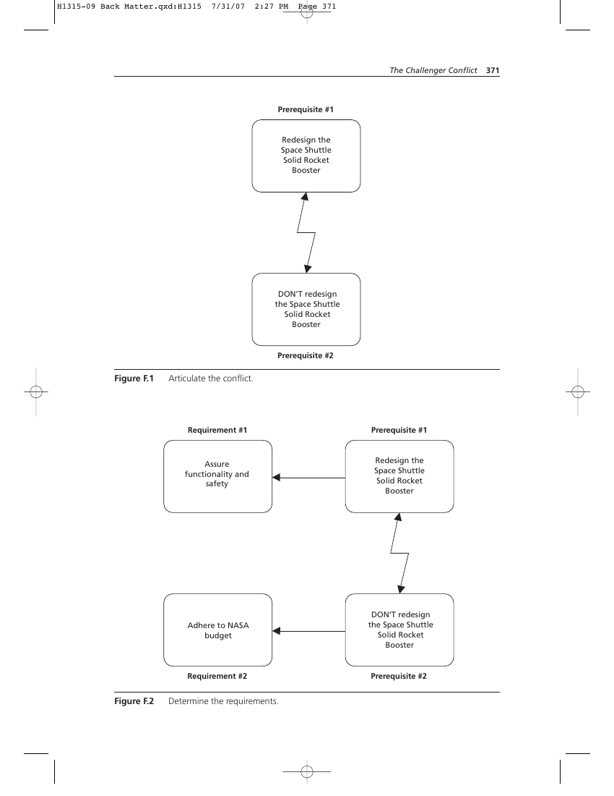

The Challenger Conflict

Prerequisite #1 Redesign the Space Shuttle Solid Rocket Booster

DON’T redesign the Space Shuttle Solid Rocket Booster

Prerequisite #2

Figure F.1

Figure F.2

Articulate the conflict.

Requirement #1

Prerequisite #1 Assure

budget

DON’T redesign the Space Shuttle Solid Rocket Booster

Requirement #2

Prerequisite #2

Determine the requirements.

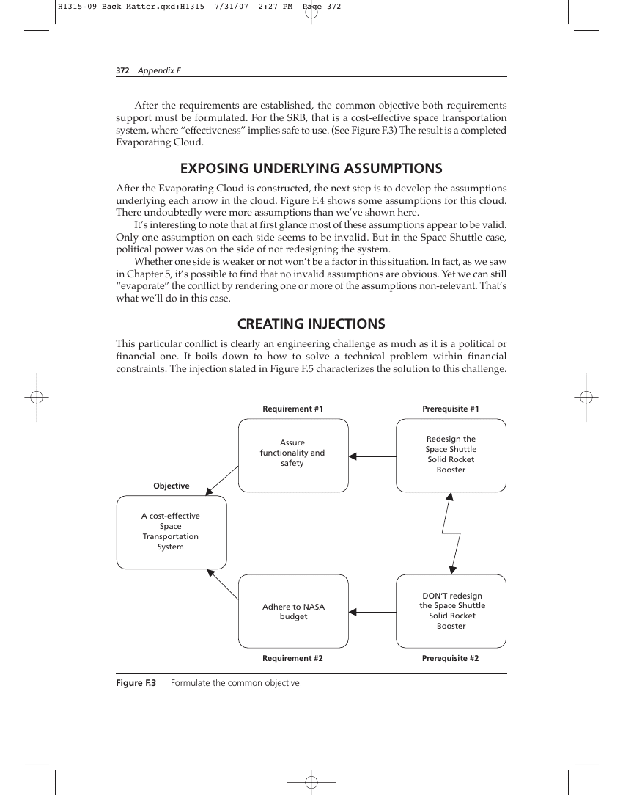

After the requirements are established, the common objective both requirements support must be formulated. For the SRB, that is a cost-effective space transportation system, where “effectiveness” implies safe to use. (See Figure F.3) The result is a completed Evaporating Cloud.

### Exposing Underlying Assumptions

After the Evaporating Cloud is constructed, the next step is to develop the assumptions underlying each arrow in the cloud. Figure F.4 shows some assumptions for this cloud. There undoubtedly were more assumptions than we’ve shown here. It’s interesting to note that at first glance most of these assumptions appear to be valid. Only one assumption on each side seems to be invalid. But in the Space Shuttle case, political power was on the side of not redesigning the system. Whether one side is weaker or not won’t be a factor in this situation. In fact, as we saw in Chapter 5, it’s possible to find that no invalid assumptions are obvious. Yet we can still “evaporate” the conflict by rendering one or more of the assumptions non-relevant. That’s what we’ll do in this case.

### Creating Injections

This particular conflict is clearly an engineering challenge as much as it is a political or financial one. It boils down to how to solve a technical problem within financial constraints. The injection stated in Figure F.5 characterizes the solution to this challenge.

Requirement #1

Prerequisite #1 Assure

functionality and safety Redesign the Space Shuttle Solid Rocket Booster Adhere to NASA functionality and safety Redesign the Space Shuttle Solid Rocket Booster Objective

budget

DON’T redesign the Space Shuttle Solid Rocket Booster

Requirement #2

Prerequisite #2 Objective

A cost-effective Space Transportation System

Figure F.3

Formulate the common objective.

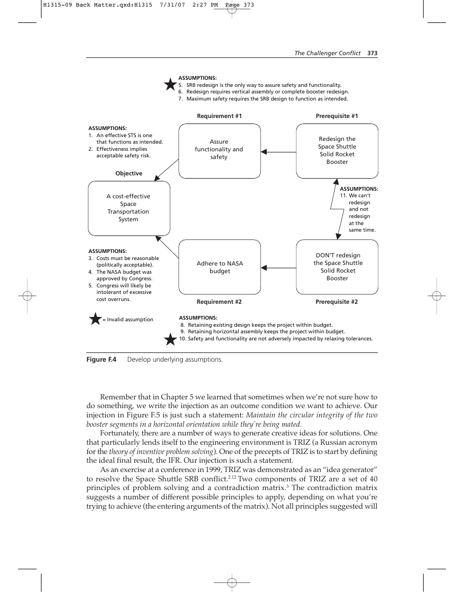

The Challenger Conflict

**ASSUMPTIONS:**

1. SRB redesign is the only way to assure safety and functionality.
2. Redesign requires vertical assembly or complete booster redesign.
3. Maximum safety requires the SRB design to function as intended.

**ASSUMPTIONS:**

1. An effective STS is one that functions as intended.
2. Effectiveness implies acceptable safety risk.

Requirement #1

Prerequisite #1 Assure

**ASSUMPTIONS:**

1. We can’t redesign and not redesign at the same time.

A cost-effective Space Transportation System

**ASSUMPTIONS:**

1. Costs must be reasonable (politically acceptable).
2. The NASA budget was approved by Congress.
3. Congress will likely be intolerant of excessive cost overruns.

= Invalid assumption

Figure F.4 Adhere to NASA

budget

DON’T redesign the Space Shuttle Solid Rocket Booster

Requirement #2

Prerequisite #2

**ASSUMPTIONS:**

1. Retaining existing design keeps the project within budget.
2. Retaining horizontal assembly keeps the project within budget.
3. Safety and functionality are not adversely impacted by relaxing tolerances.

Develop underlying assumptions.

Remember that in Chapter 5 we learned that sometimes when we’re not sure how to do something, we write the injection as an outcome condition we want to achieve. Our injection in Figure F.5 is just such a statement: Maintain the circular integrity of the two booster segments in a horizontal orientation while they’re being mated. Fortunately, there are a number of ways to generate creative ideas for solutions. One that particularly lends itself to the engineering environment is TRIZ (a Russian acronym for the theory of inventive problem solving). One of the precepts of TRIZ is to start by defining the ideal final result, the IFR. Our injection is such a statement. As an exercise at a conference in 1999, TRIZ was demonstrated as an “idea generator” to resolve the Space Shuttle SRB conflict.2:12 Two components of TRIZ are a set of 40 principles of problem solving and a contradiction matrix.3 The contradiction matrix suggests a number of different possible principles to apply, depending on what you’re trying to achieve (the entering arguments of the matrix). Not all principles suggested will functionality and safety Redesign the Space Shuttle Solid Rocket Booster Objective

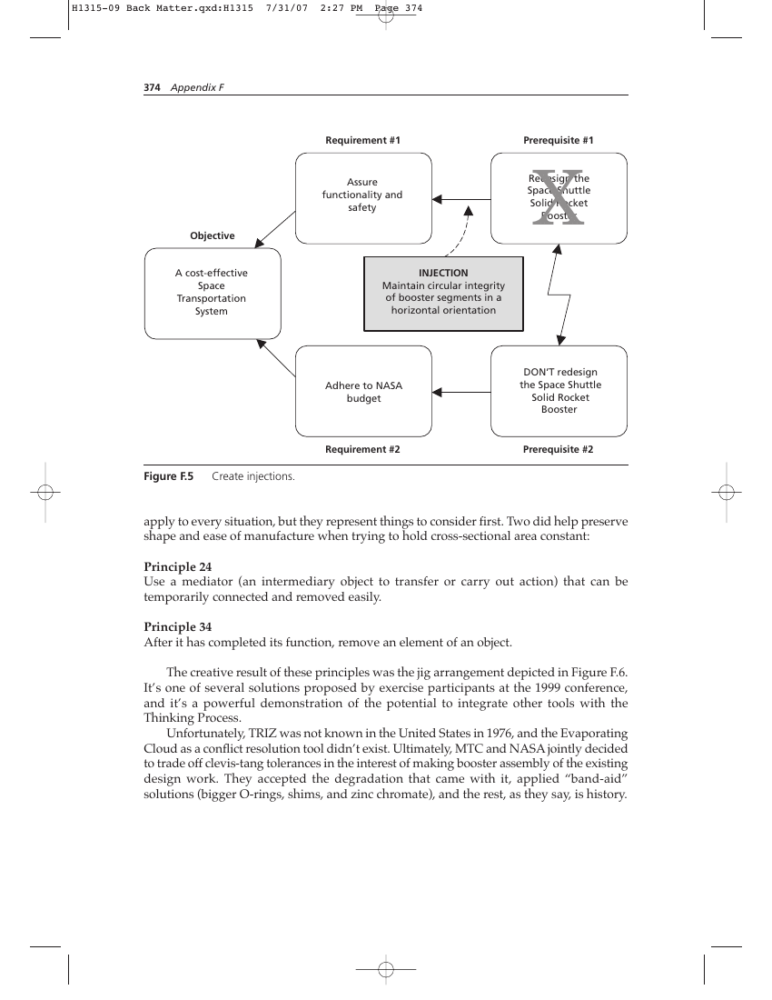

Requirement #1

Prerequisite #1 Assure

A cost-effective Space Transportation System

Figure F.5

X

INJECTION Maintain circular integrity of booster segments in a horizontal orientation apply to every situation, but they represent things to consider first. Two did help preserve shape and ease of manufacture when trying to hold cross-sectional area constant: Principle 24 Use a mediator (an intermediary object to transfer or carry out action) that can be temporarily connected and removed easily. Principle 34 After it has completed its function, remove an element of an object. The creative result of these principles was the jig arrangement depicted in Figure F.6. It’s one of several solutions proposed by exercise participants at the 1999 conference, and it’s a powerful demonstration of the potential to integrate other tools with the Thinking Process. Unfortunately, TRIZ was not known in the United States in 1976, and the Evaporating Cloud as a conflict resolution tool didn’t exist. Ultimately, MTC and NASA jointly decided to trade off clevis-tang tolerances in the interest of making booster assembly of the existing design work. They accepted the degradation that came with it, applied “band-aid” solutions (bigger O-rings, shims, and zinc chromate), and the rest, as they say, is history. Adhere to NASA

budget

DON’T redesign the Space Shuttle Solid Rocket Booster

Requirement #2

Prerequisite #2

Create injections.

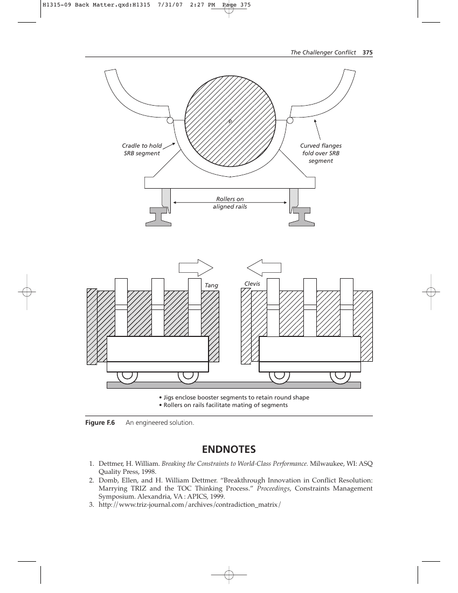

The Challenger Conflict

p.

Cradle to hold SRB segment

Curved flanges fold over SRB segment Rollers on

aligned rails

#### Tang Clevis

- Jigs enclose booster segments to retain round shape
- Rollers on rails facilitate mating of segments

Figure F.6

An engineered solution.

### Endnotes

1. Dettmer, H. William. Breaking the Constraints to World-Class Performance. Milwaukee, WI: ASQ Quality Press, 1998.
2. Domb, Ellen, and H. William Dettmer. “Breakthrough Innovation in Conflict Resolution: Marrying TRIZ and the TOC Thinking Process.” Proceedings, Constraints Management Symposium. Alexandria, VA : APICS, 1999.
3. http://www.triz-journal.com/archives/contradiction_matrix/

## Appendix G: Correlation Versus Cause and Effect

Correlation vs. Cause and Effect

Baked bread may be a health hazard. Research shows that…

- More than 98 percent of convicted felons are bread eaters.
- Fully half of all children who grow up in bread-consuming households score below average on standardized tests.
- In the 18th century, when virtually all bread was baked in the home, the average life expectancy was less than 50 years; infant mortality rates were unacceptably high; many women died in childbirth; and diseases such as typhoid, yellow fever, and influenza ravaged whole nations.
- More than 90 percent of violent crimes are committed within 24 hours of eating bread.
- Bread is made from a substance called “dough.” It has been proven that as little as one pound of dough can be used to suffocate a mouse. The average person eats more bread than that in one month!
- Primitive tribal societies that have no bread exhibit a low occurrence of cancer, Alzheimer's disease, Parkinson's disease, and osteoporosis.
- Bread has been proven to be addictive. Subjects deprived of bread and given only water actually begged for bread after only two days.
- Bread is often a "gateway" food item, leading the user to harder items such as butter, jelly, peanut butter, and even cold cuts.
- Bread has been proven to absorb water. Since the human body is more than 90 percent water, it follows that eating bread could lead to your body being taken over by this absorptive food product, turning you into a soggy, gooey, breadpudding person.
- Newborn babies can choke on bread.
- Bread is baked at temperatures as high as 400 degrees Fahrenheit! That kind of heat can kill an adult in less than one minute. And, most significant of all… …most bread eaters are utterly unable to distinguish between significant scientific fact and meaningless statistical correlation!

## Appendix H: Theories of Motivation

### Maslow’s Needs Hierarchy

Abraham Maslow theorized that human needs described a hierarchy from the basic physiological to high-level self-actualization. There are five levels in Maslow’s hierarchy:1:102-105

1. Physiological. The need for food, drink, shelter, and relief from pain.
2. Safety and security. The need for freedom from threat, or security from threatening events or surroundings.
3. Belongingness, social, and love. The need for friendship, affiliation, interaction, and love.
4. Esteem. The need for self-esteem and the esteem of others.
5. Self-actualization. The need to fulfill oneself by maximizing the use of abilities, skills, and potential. Maslow assumed that people’s behavior would be focused on the more basic needs to some level of satisfaction before diverting much of their attention to the higher-level needs. Maslow theorized that a satisfied need ceases to motivate. For example, when a person decides that he or she is earning enough money (how much is “enough” is a personal determination), money loses its power to motivate. Since many companies provide a comfortable living wage, members of such organizations tend not to worry about where their next meal is coming from, how they’ll make their next mortgage payment, or whether they can obtain aspirin to relieve their pain (level 1). They may even be able to live in a safe place, away from the threat of natural disaster or crime (level 2). While they never lose their concern for the things at these two levels, the preponderance of their behavior is likely to be directed toward things like affection and acceptance from others (level 3), or their admiration (level 4). Once they’re reasonably well satisfied in these areas, many people’s behaviors are more motivated by the need to create something, or to accomplish something noteworthy for their own internal satisfaction, separate from the esteem of others (level 5). Abraham Maslow conceived of his hierarchy of human needs in the 1940s. It’s worth noting that before he died, he repudiated his needs hierarchy and expressed dismay that people made so much of it. Apparently, that message didn’t get out as widely as the needs hierarchy did, and people today still subscribe to it.

Notwithstanding the fact that Maslow changed his mind about his own construct, many people—this author included—still find merit in it. While psychologists may differ, practitioners have observed elements of the hierarchy of needs operating in the real world on an almost daily basis. Have you ever heard this saying: “When you’re up to your waist in alligators, it’s difficult to remember that your original objective was to drain the swamp”? There’s an implication of Maslow’s hierarchy to be drawn here. Maslow originally suggested that people would only begin operating at the higher levels—3, 4, and 5—after levels 1 and 2 were largely (not necessarily completely) satisfied. Most laymen would agree that it’s possible to be operating on multiple levels simultaneously, but not likely on 1 and 5 at the same time, and not to the same degree. Maslow’s hierarchy does give some rationale for why some people don’t seem to be focused on the level we believe they should be. In the final analysis, Maslow’s theory hasn’t been supported by field research studies. While it does explain aspects of human behavior in society, it’s probably not smart to depend on it to explain individual-level behavior.1:105

### Herzberg’s Two-factor Theory

In the late 1950s, Frederick Herzberg theorized that all factors that could motivate human behavior fell into one of two categories: they were either satisfiers or dissatisfiers. These two factors are also variously referred to as hygiene factors and motivators, or extrinsic and intrinsic factors. For Herzberg, dissatisfiers included those things that were largely outside the individual, thus their characterization as extrinsic. These factors included:1:109-111

- Salary or pay (tangible rewards)
- Job security
- Working conditions
- Status
- Company procedures
- Quality of supervision
- Quality of interpersonal relations among peers, with superiors, and with subordinates The reason these all seem to be work related is that Herzberg’s research was done exclusively in the work place. Herzberg identified these factors as dissatisfiers because their absence (or unfulfillment) could demotivate people but their presence would not positively motivate them. However, some level of fulfillment is necessary to keep people from being demotivated. As satisfiers, Herzberg identified the following factors:1:110
- Achievement
- Recognition
- Responsibility
- Advancement
- The nature of the work itself
- The possibility of growth

#### Theories of Motivation

These are often referred to as intrinsic because they arise from within the individual, rather than from without. Their presence will positively motivate people, but their absence won’t necessarily cause dissatisfaction or demotivation. Herzberg’s research on these factors was limited to a small sample (200) of engineers and accountants. For this reason, his theory is often criticized as not representative of a large enough cross-section of society to be validated. The important lesson to be learned from Herzberg’s theory is the concept that positive motivation comes from factors that may be more intellectual than tangible. In other words, they play to the psyche or the mind. Herzberg believed that the best that most organizations could do would be to clear the work place of the factors that would demotivate people (the so-called hygiene factors) and provide opportunities for people to realize the internal satisfaction that would actually motivate them.

#### McCLELLAND’S LEARNED NEEDS THEORY

David C. McClelland’s learned-needs theory, much like Maslow’s and Herzberg’s theories, has the underlying assumption that people with strong needs will be motivated to use appropriate behaviors to satisfy their needs. McClelland goes further, however, in proposing that a person’s needs are learned from the culture of a society.1:112-117 McClelland was less concerned with the base needs that comprise Maslow’s two lower levels. Rather, he focused on three needs at the higher levels, which he defined as needs for achievement, affiliation, and power. McClelland2

#### Achievement

People with a high need for achievement (nAch) seek to excel and thus tend to avoid both low-risk and high-risk situations. Achievers avoid low-risk situations because the easily attained success is not a genuine achievement. In high-risk projects, achievers see the outcome as one of chance rather than one's own effort. High-nAch individuals prefer work that has a moderate probability of success, ideally a 50 percent chance. Achievers need regular feedback in order to monitor the progress of their achievements. They prefer either to work alone or with other high achievers.

#### Affiliation

Those with a high need for affiliation (nAff) need harmonious relationships with other people and need to feel accepted by other people. They tend to conform to the norms of their work group. High-nAff individuals prefer work that provides significant personal interaction. They perform well in customer-service and client-interaction situations.

#### Power

A person's need for power (nPow) can be one of two types: personal or institutional. Those who need personal power want to direct others, and this need often is perceived as undesirable. Persons who need institutional power (also known as social power) want to organize the efforts of others to further the goals of the organization. Managers with a high need for institutional power tend to be more effective than those with a high need for personal power. Obviously, people with different needs are motivated differently. People with a high need for achievement seek challenging projects with reachable goals. They need frequent feedback. While money is not an important motivator, it can be an effective form of feedback. Others with a high affiliation need perform best in a cooperative environment. And those with a high need for power seek the opportunity to direct others. All three of these needs are clearly related to cultural mores and societal interactions.

McClelland’s learned-needs theory is relevant to the kind of organizational and behavioral change contemplated in a logical Thinking Process analysis. People with high nAch needs are likely to be avid supporters of change—provided they were involved in the change design process (that is, the Thinking Process analysis). To the extent that someone else completed the Thinking Process analysis, nAch types may be interested or eager to participate if they perceive that the logically developed change affords them the opportunity for personal achievement. People with a high need for affiliation are likely to be eager participants in a change process if it affords them the opportunity to work cooperatively with their valued contemporaries—in other words, a team effort. To some degree, their enthusiasm for change may be reinforced or tempered by the enthusiasm of those they work with. People with a high need for power are the biggest question mark. A high-nPow type is likely to be a “type A” personality, a take-charge type, and may be a natural leader. This can be both good and bad. If high-nPow individuals are involved in the Thinking Process solution development, they are likely to want to take the lead. If not, they (often with extroverted personalities) would likely support behavior changes if they perceive that these changes will advance their own power agendas.

### Adams’ Equity Theory

Unlike the theories of Maslow and McClelland (but like Herzberg), J. Stacey Adams’ equity theory of motivation pertains exclusively to a work place. Equity theory is based on the assumption that people in a hierarchical work environment want to be treated equitably. To the extent that this assumption is valid, they’ll compare their efforts and rewards with the efforts and rewards of others.1:152-156 For Adams, the important issue was the comparative ratio, not the absolute values. Adams actually summarized equity theory in a simple equation: OP

### ____ = Orp

____ IP

### Irp

In this equation, the left side represents the outcomes of the individual doing the perceiving divided by the inputs of that same person. The right side of the equation represents the same outcomes and inputs for some reference person selected by the perceiving person. As long as the ratio of the observing or perceiving person remains relatively comparable to that of the person observed, the original observer perceives equity and no adverse behavioral consequence results. However, when a person observes that someone else realizes more or better outcomes with equal or less effort than they themselves expend, inequity is perceived. Adams then assumes that if the inequity persists over time, rewards are based on favoritism, luck, or some factor other that individual merit or effort. Basic behavioral theory (positive/negative motivation, reward, punishment, and so on) suggests that over time, motivation to do more than the minimum necessary to avoid adverse consequences will be extinguished. Adams suggested that if management identifies the perceived inequity, they can act to restore equity by changing inputs, outcomes, or attitudes. However, if management does not identify the perceived inequity (and most probably don’t), the observing person will act to change his or her inputs, outcomes, or attitudes. Changing inputs may be indicated by putting in less time or effort, having less concern for reliability, cooperating less with others, losing their sense of initiative, or having less inclination to accept responsibility. Changing outputs might show up as a direct confrontation with a boss asking for a raise in pay, more time off, or better assignments. A change in attitude may show itself as an individual deciding for himself or herself “I’ve put in enough time.”

#### Theories of Motivation

Most research on equity theory has focused on pay as the basic outcome. Some people assigned to high-status jobs actually increased their performance (in response to a perceived overpayment inequity). But it’s not always clear who the comparison others are that people use for their equity assessments. There are other uncertainties associated with equity theory for which there is no definitive research, such as the impact of equities on decision making. In summary, though, the concept of equity in organizational change—whether a Thinking Process analysis eliminates it or creates it—is a possible contributor to either support for a change or resistance to it. Consequently, it should be considered when scrutinizing Current and Future Reality Trees.

### Summary

As it relates to Chapter 8, “Changing the Status Quo,” this appendix is no more than a “quick hit” on the subject of human motivation. And like Chapter 8, it can’t substitute for an in-depth knowledge of why people behave as they do, or don’t behave as we would have them do. Nevertheless, human motivation and behavior remains the most influential determinant of success in solving complex system problems. If you fail to consider it adequately in your solutions, don’t be surprised to see them fail.

### Endnotes

1. Gibson, James L., John M. Ivancevich, and James H. Donnelly, Jr. Organizations: Behavior, Structure, Processes (7th ed.). Homewood, IL: Richard D. Irwin Publishers, 1991.
2. http://en.wikipedia.org/wiki/David_McClelland

## Appendix I: Legal Application of the Thinking Process

This appendix describes the application of the Logical Thinking Process to preparation for litigation. The example used here was an actual case before a state court. Attorneys for the defendant applied the Thinking Process to the facts of the case and the law.

### Background

In 1993, Marston Oil brought suit against John Wilson, a former employee, for violation of the state’s Uniform Trade Secrets Act. Wilson had been employed by Marston Oil as a trader (sales representative) for their products, which included a variety of grades of petroleum products for industrial purposes. Marston Oil was a local distributor for large industrial oil producers such as Chevron. As such, they were the link between the producer and the end user, much as a retail store links manufacturers with consumers. This chief difference was that sales of Marston’s products were usually concluded in very large volumes, for example, thousands of gallons of fuel oil or lubricants. Sales were referred to as “deals” because price and volume were negotiated on each one. Wilson was compensated by commission on these deals, and he was good at his job. In fact, Marston Oil had hired him away from another company because of his sales record. His specialty was the most lucrative of Marston’s product lines, transmix, fuel, and heavy oils (abbreviated TF&H). Marston Oil was a small family-owned company run by Alan and Geoffrey Hickman. Alan was the CEO and majority stockholder. Geoffrey was vice president. In 1992, Alan decided to run for U.S. Congress in his district. He expended substantial amounts of money on his (ultimately unsuccessful) political campaign, much of which came from Marston Oil’s revenues. Expenditures on Hickman’s campaign exceeded his expectations and severely reduced the company’s cash reserves. Because Marston Oil’s suppliers demanded full payment prior to delivery, Marston needed either cash or credit to buy the oil it would resell. Without cash reserves, Marston had to depend on its credit line, which was quickly fully committed. Wilson found himself unable to capitalize on sales opportunities because there was insufficient cash or credit to purchase TF&H for resale. Lost opportunities meant lost commissions for him. Eventually, in March 1993, Wilson gave his notice and left Marston Oil, hired by another distributor to do the same work.

#### Legal Application of the Thinking Process

Marston Oil hired Rick Benson to replace Wilson. Benson was both less experienced in TF&H sales and had less cash/credit to work with than Wilson had before him. Marston Oil’s financial difficulties continued. In mid-1993, Alan Hickman brought suit against John Wilson, claiming Wilson had taken Martson’s proprietary information (client lists, contacts, bidding formulae, and so on) with him when he left to go to one of Marston’s competitors. Wilson hired a law firm to represent him in the suit.

### Prerequisite Tree: the Legal Situation

The attorney representing Wilson knew he had to prepare for courtroom litigation in the event that the lawsuit could not be settled out of court. Because the case was technically complex, he needed to organize the facts of the case and the provisions of the law in a way that a jury could easily understand. The Logical Thinking Process provided the means to convert the provisions of the state’s Uniform Trade Secrets Act (UTSA) into an easily understood necessary-condition hierarchy and the facts of the case into a straightforward sequence of cause-and-effect. The UTSA defined trade secrets and the circumstances under which it would be considered violated. The defendant’s attorney and a Thinking Process facilitator structured the provisions of the law into a Prerequisite Tree (Figure I.1). Each of the key definitions and provisions of the law was converted into a PRT entity. The actual structure of the text of the law governed the relationships among the necessary conditions. The law identified the standards for confidential information to be considered a trade secret and the standards of protection required. It also detailed the allowable circumstances under which protection of confidential information could be considered breached. And finally, it defined the provable elements for damages. In the context of the Thinking Process, the relationship among these elements is necessity based. This means that for each successively higher level in the PRT to apply, all lower elements must verifiably apply. Thus, in reading the PRT, the plaintiff must prove that entities 108, 109, 110, 112, 114, and 116-118 happened. The defendant, on the other hand, must demonstrate the failure of proof that any of these happened. According to the defendant’s attorney, the PRT would prove most useful in closing arguments, after the facts of the case had been brought out, to summarize for the jury the failures of the plaintiff to make a case for the presence of those key entities.

### Facts of the Case: the Current Reality Tree

As with any legal case, the actual circumstances of the situation hold the evidence to support or refute the complaint. There are two sources of case facts: pre-trial depositions and courtroom testimony. In the Marston v. Wilson case, the depositions were voluminous. From deposition summaries, the defendant’s attorney and the Thinking Process facilitator constructed a “story of the case” in the form of a Current Reality Tree. (See Figure I.2a though I.2h) The CRT provides a concise, logical organization of the facts of the case and their implications. It links disparate facts into meaningful conclusions. And it provides several valuable benefits to an attorney preparing to go to trial.

#### Unified Picture of Events

The CRT provides a complete, systemic picture of what actually happened. It shows the whole “big picture” and how the various elements tie together.

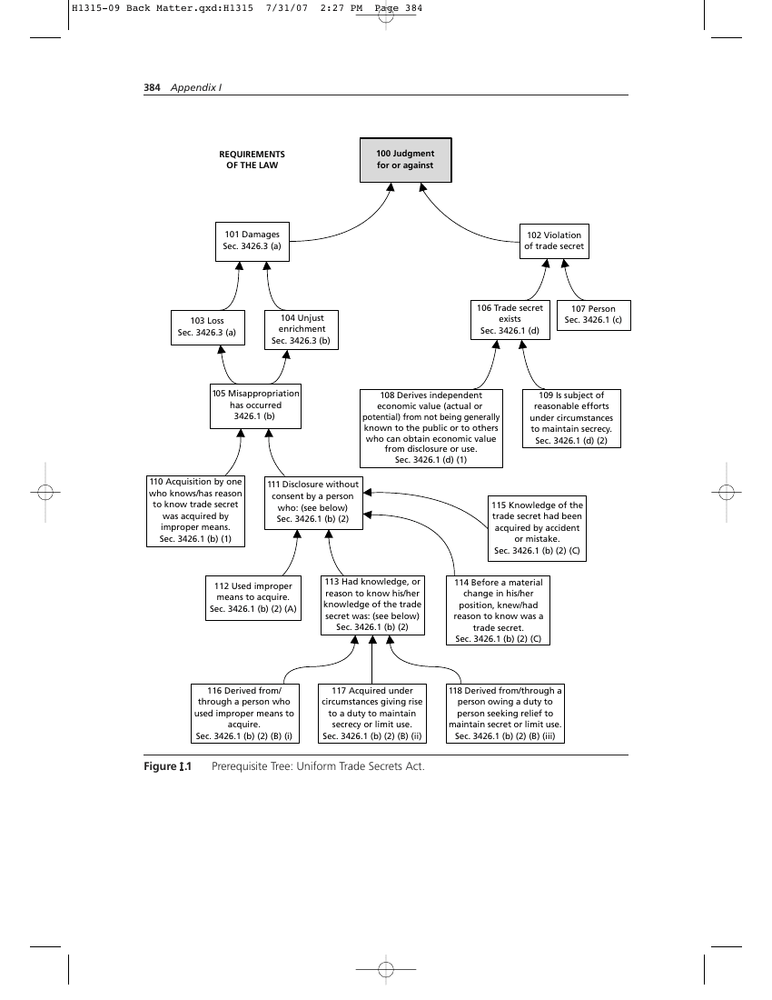

100 Judgment for or against REQUIREMENTS OF THE LAW

101 Damages Sec. 3426.3 (a)

103 Loss Sec. 3426.3 (a)

102 Violation of trade secret

105 Misappropriation has occurred 3426.1 (b)

110 Acquisition by one who knows/has reason to know trade secret was acquired by improper means. Sec. 3426.1 (b) (1)

Figure I.1

106 Trade secret exists Sec. 3426.1 (d)

104 Unjust enrichment Sec. 3426.3 (b)

108 Derives independent economic value (actual or potential) from not being generally known to the public or to others who can obtain economic value from disclosure or use. Sec. 3426.1 (d) (1)

111 Disclosure without consent by a person who: (see below) Sec. 3426.1 (b) (2)

109 Is subject of reasonable efforts under circumstances to maintain secrecy. Sec. 3426.1 (d) (2)

115 Knowledge of the trade secret had been acquired by accident or mistake. Sec. 3426.1 (b) (2) (C)

112 Used improper means to acquire. Sec. 3426.1 (b) (2) (A)

113 Had knowledge, or reason to know his/her knowledge of the trade secret was: (see below) Sec. 3426.1 (b) (2)

114 Before a material change in his/her position, knew/had reason to know was a trade secret. Sec. 3426.1 (b) (2) (C)

116 Derived from/ through a person who used improper means to acquire. Sec. 3426.1 (b) (2) (B) (i)

117 Acquired under circumstances giving rise to a duty to maintain secrecy or limit use. Sec. 3426.1 (b) (2) (B) (ii)

118 Derived from/through a person owing a duty to person seeking relief to maintain secret or limit use. Sec. 3426.1 (b) (2) (B) (iii)

Prerequisite Tree: Uniform Trade Secrets Act.

107 Person Sec. 3426.1 (c)

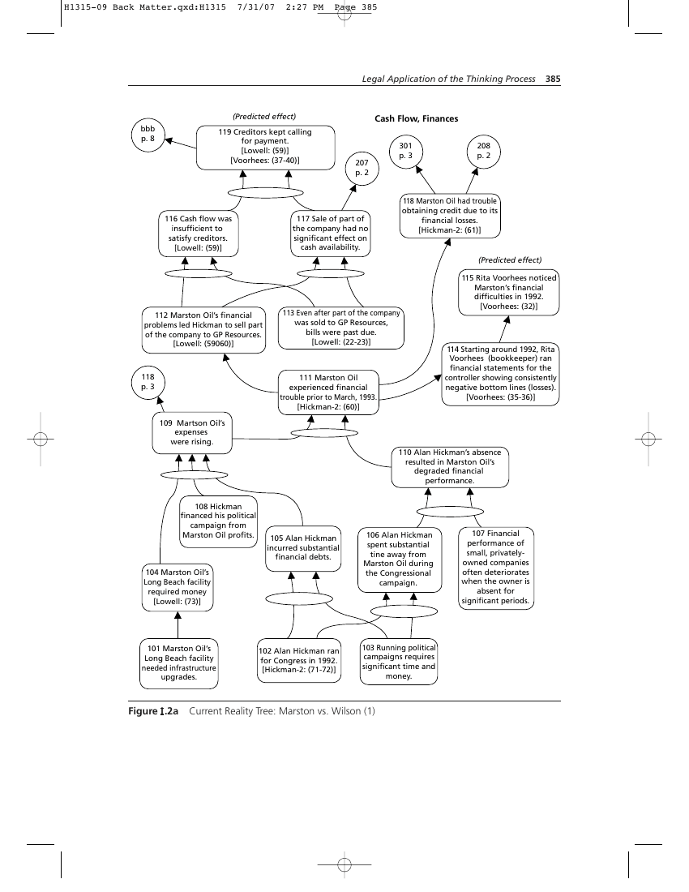

Legal Application of the Thinking Process

(Predicted effect) bbb p. 8

119 Creditors kept calling for payment. [Lowell: (59)] [Voorhees: (37-40)] Cash Flow, Finances

p. 2

p. 3

p. 2

118 Marston Oil had trouble obtaining credit due to its financial losses. [Hickman-2: (61)]

117 Sale of part of the company had no significant effect on cash availability.

116 Cash flow was insufficient to satisfy creditors. [Lowell: (59)]

(Predicted effect)

112 Marston Oil’s financial problems led Hickman to sell part of the company to GP Resources. [Lowell: (59060)]

113 Even after part of the company was sold to GP Resources, bills were past due. [Lowell: (22-23)]

p. 3

111 Marston Oil experienced financial trouble prior to March, 1993. [Hickman-2: (60)]

115 Rita Voorhees noticed Marston’s financial difficulties in 1992. [Voorhees: (32)]

114 Starting around 1992, Rita Voorhees (bookkeeper) ran financial statements for the controller showing consistently negative bottom lines (losses). [Voorhees: (35-36)]

109 Martson Oil’s expenses were rising. 110 Alan Hickman’s absence resulted in Marston Oil’s degraded financial performance. 108 Hickman financed his political campaign from Marston Oil profits.

105 Alan Hickman incurred substantial financial debts.

106 Alan Hickman spent substantial tine away from Marston Oil during the Congressional campaign.

102 Alan Hickman ran for Congress in 1992. [Hickman-2: (71-72)]

103 Running political campaigns requires significant time and money.

104 Marston Oil’s Long Beach facility required money [Lowell: (73)]

101 Marston Oil’s Long Beach facility needed infrastructure upgrades.

Figure I.2a

Current Reality Tree: Marston vs. Wilson (1)

107 Financial performance of small, privatelyowned companies often deteriorates when the owner is absent for significant periods.

Negative Reinforcing Loop #2 p. 3

216 Marston Oil’s income stream declines (more and more).

Cash Flow, Finances

(continued)

412 Benson did not complete TF&H oil deals as big as those Wilson had done. [Lowell: (81)] (From p. 4 ) p. 3

213 Marston Oil must subsequently resell purchases of TF&H oil to realize profit.

214 Funds were insufficient to transact some purchases. [Lowell: (63-64)]

211 Marston obtained a limited line of new credit from Celtic Capital at significantly higher interest rates. [Lowell: (66)]

210 Marston Oil needed a new source of credit.

208 At some point, Marston Oil’s regular line of credit was canceled, or expired and was not renewed. [Lowell: (66)]

118 Marston Oil had (more and more) trouble obtaining credit due to its financial losses. [Hickman-2: (61)]

215 Marston’s expenses increased.

212 Cash flow was insufficient to make up the difference demanded by suppliers. [Lowell: (59)]

209 Marston Oil relied on commercial lines of credit to make TF&H oil purchases.

205 Marston needed cash on hand to purchase TF&H oil.

206 Without cash, commercial credit is necessary to purchase TF&H oil.

207 Marston Oil had insufficient cash reserves to transact most TF&H oil purchases.

(From p. 1 )

202 Suppliers required payment in advance. [Lowell: (59)]

203 Chevron was Marston’s main supplier of transmix oil. [Hickman-1: (550-551)]

204 WITCO was Marston’s main supplier of transmix oil. [Hickman-1: (550-551)]

201 Suppliers would not extend credit to Marston Oil [Lowell: (59)]

Figure I.2b Current Reality Tree: Marston vs. Wilson (2)

117 Sale of part of the company had no significant effect on cash availability. (From p. 1 )

Legal Application of the Thinking Process

Cash Flow, Finances

(continued)

xxx p. 8

216 Marston Oil’s income stream declines (more and more).

313 Marston Oil’s profits decreased.

215 Marston’s expenses increased. Negative Reinforcing

Loop #1

311 Near the end of Wilson’s tenure at Marston, the volume of transmix sales decreased. [Lowell: (93)]

305 Wilson had to turn down some deals for lack of financing. [Lowell: (63-64)]

303 Wilson had trouble conducting business. [Lowell: (59), (71)]

312 Wilson’s part of Marston’s business had always been profitable. [Voorhees: (64-65)]

(From p. 1 )

Figure I.2c

p. 4

310 After Wilson left, Marston was unable to obtain transmix or heavy oils from its former suppliers [Hickman-1: (379, 433-435, 438439, 440, 485)]

308 Wilson’s income derived from commissions on TF&H oil transactions.

306 It became impossible for Marston to conduct much business especially TF&H oil trading. [Hickman-2: (62-63)]

302 Marston’s limited credit caused some suppliers to cease doing business with the company. [Hickman-2: (83-84)]

301 Every year the amount of credit available to Marston Oil would go down. [Lowell: (68-69)]

109 Marston Oil’s expenses were rising (more and more).

(From p. 2 )

p. 4

309 Marston Oil’s lack of credit cost Wilson many income opportunities. (Establish entity existence on 308 by direct testimony)

118 Marston Oil had (more and more) trouble obtaining credit due to its financial losses. [Hickman-2: (61)] (From p. 1 )

Current Reality Tree: Marston vs. Wilson (3)

307 Chevron didn’t want to sell Marston more transmix oil until Marston’s debt was cleared. 304 Marston owed Chevron money when their contract was due for renewal. [Lowell: (109)]

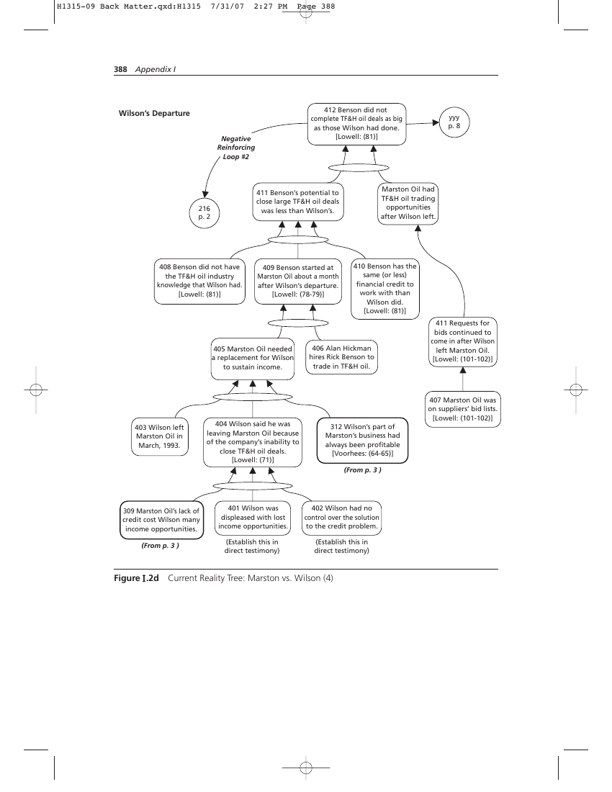

412 Benson did not complete TF&H oil deals as big as those Wilson had done. [Lowell: (81)] Wilson’s Departure

Negative Reinforcing

Loop #2

408 Benson did not have the TF&H oil industry knowledge that Wilson had. [Lowell: (81)]

409 Benson started at Marston Oil about a month after Wilson’s departure. [Lowell: (78-79)]

405 Marston Oil needed a replacement for Wilson to sustain income.

403 Wilson left Marston Oil in

March, 1993.

Marston Oil had TF&H oil trading opportunities after Wilson left.

411 Benson’s potential to close large TF&H oil deals was less than Wilson’s.

p. 2

404 Wilson said he was leaving Marston Oil because of the company’s inability to close TF&H oil deals. [Lowell: (71)]

yyy p. 8

410 Benson has the same (or less) financial credit to work with than Wilson did. [Lowell: (81)]

406 Alan Hickman hires Rick Benson to trade in TF&H oil.

411 Requests for bids continued to come in after Wilson left Marston Oil. [Lowell: (101-102)]

407 Marston Oil was on suppliers’ bid lists. [Lowell: (101-102)] 312 Wilson’s part of Marston’s business had always been profitable [Voorhees: (64-65)] (From p. 3 )

309 Marston Oil’s lack of credit cost Wilson many income opportunities.

401 Wilson was displeased with lost income opportunities.

402 Wilson had no control over the solution to the credit problem.

(From p. 3 )

(Establish this in direct testimony)

(Establish this in direct testimony)

Figure I.2d Current Reality Tree: Marston vs. Wilson (4)

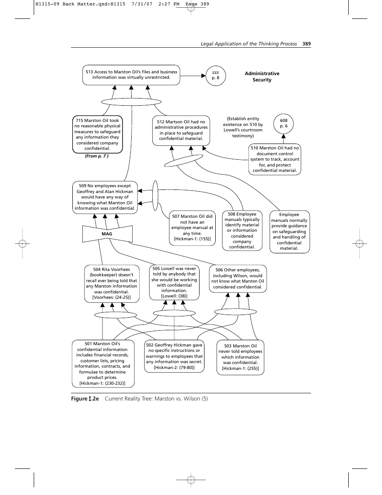

#### Legal Application of the Thinking Process

513 Access to Marston Oil’s files and business information was virtually unrestricted.

715 Marston Oil took no reasonable physical measures to safeguard any information they considered company confidential.

zzz p. 8 Administrative Security

(Establish entity existence on 510 by Lowell’s courtroom testimony)

512 Martson Oil had no administrative procedures in place to safeguard confidential material.

p. 6

510 Marston Oil had no document control system to track, account for, and protect confidential material.

(From p. 7 )

509 No employees except

#### Geoffrey and Alan Hickman

would have any way of knowing what Marston Oil information was confidential.

MAG

504 Rita Voorhees (bookkeeper) doesn’t recall ever being told that any Marston information was confidential. [Voorhees: (24-25)]

501 Marston Oil’s confidential information includes financial records, customer lists, pricing information, contracts, and formulae to determine product prices. [Hickman-1: (230-232)]

Figure I.2e

507 Marston Oil did not have an employee manual at any time. [Hickman-1: (155)]

508 Employee manuals typically identify material or information considered company confidential.

505 Lowell was never told by anybody that she would be working with confidential information. [Lowell: (38)]

506 Other employees, including Wilson, would not know what Marston Oil considered confidential.

502 Geoffrey Hickman gave no specific instructions or warnings to employees that any information was secret. [Hickman-2: (79-80)]

503 Marston Oil never told employees which information was confidential. [Hickman-1: (255)] manuals normally provide guidance on safeguarding and handling of confidential material.

Current Reality Tree: Marston vs. Wilson (5) Employee

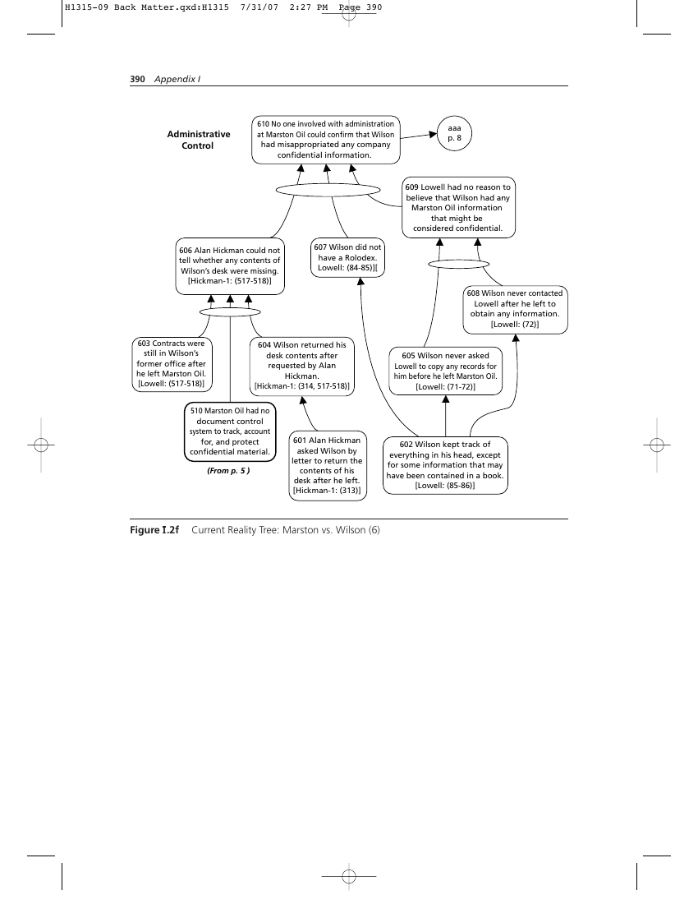

#### Administrative Control

610 No one involved with administration at Marston Oil could confirm that Wilson had misappropriated any company confidential information.

aaa p. 8

609 Lowell had no reason to believe that Wilson had any Marston Oil information that might be considered confidential. 606 Alan Hickman could not tell whether any contents of Wilson’s desk were missing. [Hickman-1: (517-518)]

607 Wilson did not have a Rolodex. Lowell: (84-85)][ 608 Wilson never contacted Lowell after he left to obtain any information. [Lowell: (72)]

603 Contracts were still in Wilson’s former office after he left Marston Oil. [Lowell: (517-518)]

604 Wilson returned his desk contents after requested by Alan Hickman. [Hickman-1: (314, 517-518)]

510 Marston Oil had no document control system to track, account for, and protect confidential material. (From p. 5 )

Figure I.2f

601 Alan Hickman asked Wilson by letter to return the contents of his desk after he left. [Hickman-1: (313)]

Current Reality Tree: Marston vs. Wilson (6)

605 Wilson never asked Lowell to copy any records for him before he left Marston Oil. [Lowell: (71-72)]

602 Wilson kept track of everything in his head, except for some information that may have been contained in a book. [Lowell: (85-86)]

#### Legal Application of the Thinking Process

715 Marston Oil did not take reasonable physical measures to safeguard any information the company considered confidential.

p. 5

#### Physical Security

714 There were almost no physical barriers preventing access of anyone at Marston Oil to the company’s files and business information.

MAG

711 Most of the office employees, except dispatchers, had access to the computer network and customer information. [Hickman-2: (58-59)]

712 Financial records at Marston Oil were not secured during business hours.

708 Lowell kept copies of TF&H oil contracts in an unlocked file cabinet in her office. [Lowell: (50-51)]

(Predicted effect) 706 Geoffrey Hickman had access to Wilson’s office and would go in when Wilson was not there. [Hickman-2: (94-95)]

713 Everyone at Marston Oil had access to the files except the drivers. [Hickman-1: (153-154)]

710 Lowell never found the financial file cabinets locked when she needed access. [Lowell: (53)]

709 Accounts receivable, accounts payable, and bank records were stored in file cabinets in the hallway at Marston Oil’s offices. [Lowell: (44-46)]

703 The doors to Lowell’s office, Wilson’s office, and both of the Hickmans’ offices were never locked. [Lowell: (53); [Voorhees: (60-61, 533-534)]

705 Martson Oil’s contract records and information were not secured during business hours.

701 Marston Oil took no steps to prevent any employee from getting something from the desk of another. [Voorhees: (28)]

Figure I.2g Current Reality Tree: Marston vs. Wilson (7)

702 Wilson kept some records in his desk (unlocked), including contracts he was currently working on. [Hickman-1: (203); [Lowell: (209, 52)]

Summary

810 No judgment against Wilson is possible.

808 Damage has not been proved. Sec. 3426.3 (a)

809 There is no violation of the trade secret law. (Leg. H. 1984 ch. 1724, 1994 ch. 1010)

806 There is no proof that any Marston Oil confidential information was lost by any act of Wilson’s. Sec. 3426.3 (a)

610 No one involved with administration at Marston Oil could confirm that Wilson had misappropriated any company confidential information.

807 A trade secret did not exist in this case. Sec. 3426.1 (d)

804 Wilson was not the only person with access to Marston Oil’s information.

805 Marston Oil made no reasonable efforts under the circumstances to maintain secrecy. Sec. 3426.1 (d) (2)

(From p. 6 )

803 Possible damage from potential loss of confidential information cannot be distinguished from Marston’s broader financial problems.

706 Geoffrey Hickman had access to Wilson’s office and would go in when Wilson was not there. [Hickman-2: (94-95)]

513 Access to Marston Oil’s files and business information was virtually unrestricted.

(From p. 7 )

(From p. 5 )

> 802 Marston Oil’s financial problems were already severe notwithstanding the value of any possible lost confidential information.
>
> - Doors to offices never locked

> - Files stored in common areas

> (hallway)
>
> - Proprietary material/trade secrets

> never identified for any employees
>
> - No administrative measures to

prevent access to any information

MAG

801 Marston Oil was in financial difficulty well before Wilson left.

313 Marston Oil’s profits decreased.

412 Benson did not complete TF&H oil deals as big as those Wilson had done. [Lowell: (81)]

(From p. 3 )

(From p. 4 )

119 Creditors kept calling for payment Lowell: (59)] Voorhees: (37-40)]

115 Rita Voorhees noticed Marston’s financial difficulties in 1992. [Voorhees: (32)]

(From p. 1 )

(From p. 1 )

Figure I.2h Current Reality Tree: Marston vs. Wilson (8)

#### Legal Application of the Thinking Process Highlights Gaps

Perhaps the most valuable contribution the CRT makes is to point out insufficiencies in cause and effect. Using a CRT, it becomes easy for an attorney to identify effects that are missing significant contributing (dependent) causes. A CRT that is begun with deposition statements can quickly reveal what additional information is needed for sufficient cause and effect. This additional information must be obtained during courtroom examination or cross examination. (The CRT in Figure I.2 has such needs indicated.)

#### Organizes Courtroom Strategy

Testimony in court typically includes having witnesses confirm statements they made under oath in pre-trial depositions and answer other questions not previously addressed in depositions but for which proper foundation has been laid. These represent the additional information needed to demonstrate sufficient cause and effect. All of this information can be functionally organized, as indicated in Figure I.2. Notice that the first three pages all address Marston Oil’s financial situation and how it got to be so bad. The fourth page describes the circumstances that led to Wilson’s departure from the company. The fifth, sixth, and seventh pages address the steps the plaintiff took (or, in this case failed to take) to ensure administrative and physical security of the information the company considered confidential. And the final page lays out how the financial, personnel, and information-security facts all combine with the provisions of the law to demonstrate that Wilson is not culpable. With this kind of outline, the trial attorney can organize the sequence of witnesses and nail down the information that must be elicited or confirmed from each one.

#### Structures Closing Argument

The last step before a judge’s instructions to a jury is the attorney’s closing argument. In this phase, the attorney is permitted to do something than isn’t allowed in earlier phases: educate the jury on the requirements of the law. The attorney then relates those requirements to evidence that either satisfies those requirements or demonstrates that the requirements have not been satisfied. A Prerequisite Tree such as the one in Figure I.1 can be a useful visual aid for explaining to a jury the necessary conditions specified by the law. And the summary page of the CRT can be a useful visual aid to demonstrate how the facts of the case either satisfy or fail to satisfy the requirements of the law.

**NOTE:** It would not be prudent for attorneys to show a jury the entire CRT. In most cases, it would only confuse the jury, to the possible detriment of both the attorney and his or her client.

Outcome of Marston Oil v. Wilson For those who are interested, the Marston Oil v. Wilson case dragged on through a succession of postponements for several years. It never went to trial. Using the facts of the case and the provisions of the law, as structured using the Thinking Process, the defendant’s attorney persuaded the plaintiff’s attorney that the plaintiff had no sustainable case. Moreover, the evidence was so plainly lacking on the plaintiff’s part that the defendant intended to demur. The plaintiff’s attorney persuaded the plaintiff to drop the case.

## Appendix J: Transformation Logic Tree Software

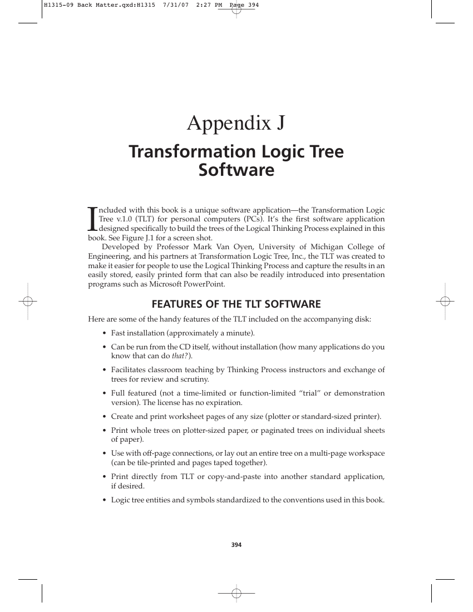

Included with this book is a unique software application—the Transformation Logic Tree v.1.0 (TLT) for personal computers (PCs). It’s the first software application designed specifically to build the trees of the Logical Thinking Process explained in this book. See Figure J.1 for a screen shot. Developed by Professor Mark Van Oyen, University of Michigan College of Engineering, and his partners at Transformation Logic Tree, Inc., the TLT was created to make it easier for people to use the Logical Thinking Process and capture the results in an easily stored, easily printed form that can also be readily introduced into presentation programs such as Microsoft PowerPoint. FEATURES OF THE TLT SOFTWARE

Here are some of the handy features of the TLT included on the accompanying disk:

- Fast installation (approximately a minute).
- Can be run from the CD itself, without installation (how many applications do you know that can do that?).
- Facilitates classroom teaching by Thinking Process instructors and exchange of trees for review and scrutiny.
- Full featured (not a time-limited or function-limited “trial” or demonstration version). The license has no expiration.
- Create and print worksheet pages of any size (plotter or standard-sized printer).
- Print whole trees on plotter-sized paper, or paginated trees on individual sheets of paper).
- Use with off-page connections, or lay out an entire tree on a multi-page workspace (can be tile-printed and pages taped together).
- Print directly from TLT or copy-and-paste into another standard application, if desired.
- Logic tree entities and symbols standardized to the conventions used in this book.

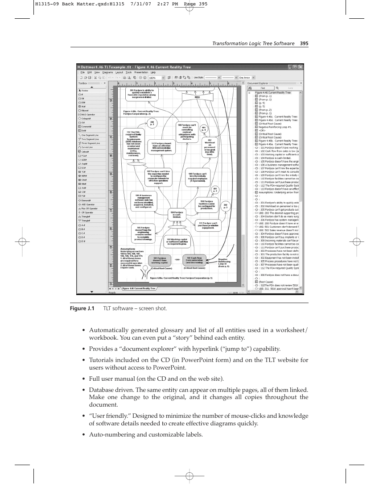

Transformation Logic Tree Software

Figure J.1

TLT software – screen shot.

- Automatically generated glossary and list of all entities used in a worksheet/ workbook. You can even put a “story” behind each entity.
- Provides a “document explorer” with hyperlink (“jump to”) capability.
- Tutorials included on the CD (in PowerPoint form) and on the TLT website for users without access to PowerPoint.
- Full user manual (on the CD and on the web site).
- Database driven. The same entity can appear on multiple pages, all of them linked. Make one change to the original, and it changes all copies throughout the document.
- “User friendly.” Designed to minimize the number of mouse-clicks and knowledge of software details needed to create effective diagrams quickly.
- Auto-numbering and customizable labels.

- Automatic sizing of entities, based on content.
- Customize your connection lines. Select a default for line boldness, solid or dashed, or number of arrowheads (selected values will be applied to all newly created connectors). Double-clicking existing lines allows their style to be changed. Supported Lines: One Segment Line, Two Segment Line, Three Segment Line, Bezier Curve.
- Shade an entity, or several entities simultaneously. These are only a few of the features of this new Thinking Process application program.

### Learning Support

Three progressive tutorials are included on this CD. They are PowerPoint files linked to .TLT files that accompany them. Once you’ve installed the software, the tutorials automatically take you through the learning process by creating actual .TLT diagrams. If you don’t have PowerPoint installed on your computer, you can operate the tutorials on line. The TLT web site (http://transformation-logictree.com/Dettmer) contains the same tutorials and a full user manual as well as other supporting material, examples, and a helpful frequently-asked-questions (FAQ) page.

### Updates

The full-featured Version 1.0 is included at no extra cost on the CD accompanying this book. There is no expiration on this version. By 2008, the same version will be offered for sale on the TLT web site to users who have not purchased this book. Check periodically for newer-generation expanded and enhanced versions. Procedures and cost for users of Version 1.0 to update their software are still being determined. (See http://transformationlogictree.com/Dettmer)

### Directions for Installation

1. Read the “README” file on the CD.
2. Insert the CD into the CD player of your computer running Windows XP or later.
3. Follow the instructions.
4. In the event that you encounter problems, contact the software authors at http://www.transformation-logictree.com/

### For More Information on Transformation Logictree Software

http://www.transformation-logictree.com/

# Glossary of Thinking Process Terms

**action** — Something performed. In logic trees, an action is something done by someone, as opposed to a condition of reality, which is a state of being or an outcome. An action is an entering argument (for example, “I wash the dishes”). In contrast, a condition is a resulting effect (for example, “The dishes are clean”). In logic trees, certain entities are phrased as actions, rather than conditions. Example: In the Evaporating Cloud (EC), conflicting prerequisites may be worded as actions (for example, “Do this/Don’t do this”). Some injections in a Future Reality Tree and intermediate objectives in a Prerequisite Tree may also be worded as actions. All specific actions in a Transition Tree are phrased as actions.

**assumption** — A statement or condition accepted as valid without substantiation or proof. Assumptions sometimes are used because proof is not possible or available. Frequently based in tradition rather than logic. Represented by cause-and-effect arrows in all logic trees. The primary targets for refutation in searching for an idea (injection) to break through the conflict between Evaporating Cloud (EC) prerequisites. Invalidation of one or more assumptions in an EC “evaporates” the cloud and its attendant conflict.

**categories of legitimate reservation (CLR)** — Eight rational tests of a stated cause-effect relationship in a tree. A non-confrontational way of expressing non-acceptance of cause and effect. The eight categories are: Clarity, Entity Existence, Causality Existence, Cause Insufficiency, Additional Cause, Cause-Effect Reversal, Predicted Effect Existence, and Tautology (circular logic).

**cause-and-effect arrow** — An element of all logic trees that indicates a cause-effect relationship. The visual depiction (➞) connects the cause (tail) with the effect (head). Expressed verbally as “If [statement at tail], then [statement at head].”

**condition** — A state of nature or being. A statement about existing or future reality (for example, “The light is on”). Different from an action, which implies that somebody does something (for example, “I turn the light on”). Conditions can be results of actions or, in a Current or Future Reality Tree, existing environmental reality. In a Future Reality Tree, an effect you’re trying to achieve would be worded as a condition. So would the obstacles in a Prerequisite Tree. In an Evaporating Cloud (EC), the requirements and objective are worded as conditions.

**constraint** — Any element of a system or its environment that limits the output of the system. Analogous to the weak link in a chain. The entity that will ultimately prevent increases in Throughput regardless of improvements made to any other part of the system. Physical constraints (equipment, facilities, and so forth) are usually the result of some policy. If the capability of the system is not constrained internally (such as by physical means or policy), the constraint may lie outside the system, in the environment (for example, market demand).

**core problem (CP)** — Originally, a single underlying root cause of a majority (that is, approximately 70 percent) of Undesirable Effects (UDEs). The core problem, when effectively solved, automatically eliminates all resulting (downstream) UDEs. The prime target of improvement efforts. (See critical root cause.)

**correlation** — A close relationship in time between two variables. Correlation is the observation that one thing changes in concert with the changes in something else. Differs from cause and effect because no causality is rigorously and logically established. Example: “The team has a winning record; attendance is higher.” No cause-effect relationship is established.

**critical root cause (CRC)** — A critical root cause is a policy, practice, or prevalent behavior that constitutes the lowest level of causality in existing reality lying within someone’s sphere of influence to change. All Undesirable Effects (UDE) in a system result from a few critical root causes. One of the minimum number (usually more than one) of root causes in a Current Reality Tree (CRT) that must be neutralized to eliminate all UDEs in the CRT. NOTE: Supersedes the concept of a Core Problem (CP).

**critical success factor (CSF)** — A limited set (usually no more than three to five) of highlevel requirements or necessary conditions that must be satisfied for a system to realize its goal. “Show-stoppers”—that is, if they aren't all satisfied, the goal can't be attained. Terminal outcomes in attaining the goal.

**current reality tree (CRT)** — A visual depiction of current cause and effect. Beginning with Undesirable Effects (UDEs), the Current Reality Tree (CRT) integrates UDEs, necessary conditions, and intermediate statements until all UDEs are linked and root causes and core problems are identified. A diagram that, through the bonds of cause and effect, connects all of the existing UDEs to a few critical root causes (CRC). Answers the question, “What are the critical root causes?”

**desirable effect (DE)** — A result or outcome that is, in and of itself, positive, desirable, or beneficial with respect to the system’s Goal (G) or Critical Success Factors (CSF). The direct or indirect result of an injection. The opposite of an undesirable effect (UDE).

**entity** — A collective term referring to graphical blocks in a logic tree. Any statement of condition or action enclosed in a geometric figure is an entity. Effects, causes, actions, conditions, injections, intermediate objectives, and obstacles are all entities.

**expected effect** — A new condition, not previously existing in current reality, resulting from an injection. Depicted as a reality entity (round-cornered rectangle) because it is an outcome of an artificially constructed condition (injection).

**Evaporating Cloud (EC)** — A logical technique for identifying conflicts and opposing assumptions that underlie core problems and objectives. Composed of an objective (a statement of the system Goal or a Critical Success Factor), requirements (necessary conditions essential to obtaining the objective), and prerequisites (mutually exclusive actions that define the conflicting requirements).

**future reality tree (FRT)** — A visual depiction of future cause and effect. A means to logically test the efficacy and validity of proposed solutions (Injections) before embarking on implementation. Answers the question, “Does the proposed injection take us where we want to go?”

**goal (G)** — The ultimate purpose or outcome for which the system is created. A “final destination”; the single result or achievement toward which all system efforts are expended. The goal is determined solely by the owner(s) of the system. Any other influence exerted by internal or external forces other than the system’s owners may be considered necessary conditions, but they will not be the goal.

**injection** — A new or not-yet-existing condition that must be created in order for future reality to unfold in the desired manner. A breakthrough idea that neutralizes conflict. A means of converting Undesirable Effects (UDEs) into Desired Effects (DEs) through a chain of cause and effect. A primary element of the Evaporating Cloud (EC) and the Future Reality Tree (FRT). May also reflect the culmination of a Prerequisite Tree (PRT). An action or condition that invalidates assumptions underlying the requirements and prerequisites of an EC.

**intermediate objective (IO)** — A lower-level necessary condition or requirement that must be accomplished to realize some higher-level necessary condition. An element of the Prerequisite Tree (PRT) and the Intermediate Objectives (IO) Map.

**intermediate objectives (IO) map** — A system-level logic tree based on necessary condition relationships. Identifies the system Goal (G), the limited set of Critical Success Factors (CSF), and supporting Necessary Conditions (NC) required to realize the Goal.

**intuition** — The ability to recognize and understand patterns and interactions of a system. The ability to see or connect patterns out of a few data points. Not “flying by the seat of your pants.” Rather, the convergence of knowledge and experience.

**inventory (I)** — All the money a system invests in things it intends to sell. Includes raw materials, but also includes items traditionally considered assets, such as facilities, equipment, land, and so forth (things that can depreciate). Inventory is not really an asset. Inventory is not subject to value added (no value is added to inventory until the moment of sale).

**necessary condition (NC)** — A circumstance indispensable to some result, or that upon which everything is contingent. A condition or state of nature that must be satisfied in order to satisfy a Critical Success Factor and realize a system’s Goal. Necessary conditions are imposed by the laws of physics or nature, and by power groups, both internal and external to the system. Without satisfying the necessary condition, the system will fail to realize its goal. Example: The goal may be to make more money, but necessary conditions may be product quality, customer satisfaction, regulatory compliance, production safety, and so on.

**negative branch (NB)** — An undesirable or unfavorable development in a Future Reality Tree (FRT) that results from an injection. May be a side effect deleterious to realizing desired effects (DEs), or may be a significant negative outcome that compromises the intended effects of a proposed problem solution (Injection). Requires an additional injection at the point where the tree branch starts turning negative in order to trim the branch.

**objective (O)** — The focus of an Evaporating Cloud (EC). The outcome that an injection is designed to achieve. Usually the Goal (G) or a Critical Success Factor (CSF) of a system.

**obstacle (OBS)** — A condition or opposing reaction that may prevent successful application of an Injection. An element of a Prerequisite Tree (PRT). Usually conceived or brainstormed by tree builders to anticipate possible complications in implementing the injection. Requires the creation of an Intermediate Objective (IO) to neutralize.

**operating expense (OE)** — All the money the system spends turning Inventory (I) into Throughput (T). A system-level measurement, not an individual product unit cost allocation. As Inventory is depreciated, it becomes an Operating Expense.

**power group** — An individual or group, internal or external to the system, exerting influence on realization of the system’s goal by imposing necessary conditions. Examples are unions, government regulatory agencies, Congress, special interests, and so on.

**prerequisite (P)** — An element of Evaporating Clouds (EC) and Prerequisite Trees (PRT). In the EC, one of two mutually exclusive actions or apparent compulsions embodying a conflict. In the EC, a prerequisite is considered a “want” rather than a “need.” In the PRT, the prerequisite is called an intermediate objective and constitutes the condition or action, not yet existing, necessary to overcome an obstacle.

**prerequisite tree (PRT)** — A logic tree used to identify all the component tasks necessary to the realization of an Injection. Also helps identify potential obstacles to proposed solutions (Injections) and ways to overcome them (Intermediate Objectives).

**requirement (R)** — An element in an Evaporating Cloud (EC). A non-negotiable need that must be satisfied to realize the objective of an EC. A necessary condition.

**reservation** — A non-confrontational means of qualifying acceptance of a cause-effect statement represented by a cause-effect arrow. Indicates that the cause-effect relationship, as depicted, is insufficiently clear to the observer. A request for more information. Expressed verbally as, “I have a reservation . . .” Must be followed by citing one of seven reasons (see categories of legitimate reservation).

**root cause (RC)** — An original cause, through a chain of cause and effect, of an undesirable effect (UDE). Any statement in a Current Reality Tree (CRT) that does not derive from another statement. An entry point into a CRT. Depicted as an entity from which causeeffect arrows lead away but do not enter. (See critical root cause.)

**subject matter (SM)** — The information content pertaining to an issue. In logic trees, the topic about which the tree pertains, as differentiated from the logic process itself.

**throughput (T)** — The rate at which the system generates money through sales (profitmaking systems). Throughput (T) does not occur with the transfer of money internally (within the company). It can only occur through the infusion of new money from outside the system. Throughput and sales are not synonymous; T is concerned with the rate at which money is generated through sales. In not-for-profit systems, T may be reflected in some non-monetary metric that indicates progress toward the system’s Goal.

**transition tree (TT)** — A logic tree for “fleshing out” detailed step-by-step implementation activities. A more detailed variety of Future Reality Tree (FRT). In essence, an implementation plan that structures management action to achieve FRT Injections.

**undesirable effect (UDE)** — A visible symptom of a deeper, underlying Critical Root Cause (CRC). An effect that is negative or undesirable with respect to the system’s Goal or a Critical Success Factor (CRC). A terminal entity in a Current Reality Tree (CRT).

# Bibliography

#### Books and Periodicals

Argyris, Chris. On Organizational Learning. Oxford: Blackwell, 1992. “A Special Report on Executive Pay,” The Economist, January 20-26, 2007. Bennis, Warren, and Burt Nanus. Leaders: Strategies for Taking Charge. NY: Harper-Row Publishing Group, 1985. Bragg, Steven M. Throughput Accounting: A Guide to Constraint Management. Hoboken, NJ: John Wiley and Sons, 2007. Button, Scott. “Genesis of a Communication Current Reality Tree: The Three-Cloud Process,” 1999 Constraints Management Symposium Proceedings, APICS, March 22-23, 1999. Caspari, John A., and Pamela Caspari. Management Dynamics: Merging Constraints Accounting to Drive Improvement. NJ: John Wiley and Sons, 2004. Cilliers, Paul. Complexity and Postmodernism: Understanding Complex Systems. NY: Routledge (Taylor and Francis Group), 1998. Collins, Jim. Good to Great: Why Some Companies Make the Leap…and Others Don’t. NY: Random House Business Books, 2001. Covey, Stephen R. The Seven Habits of Highly Effective People: Powerful Lessons in Personal Change. NY: Simon and Schuster, 1989. Cox, James F., III, and Michael S. Spencer. The Constraints Management Handbook, Boca Raton, FL: The St. Lucie Press, 1998. Damasio, Antonio R. Descartes’ Error: Emotion, Reason and the Human Brain. NY: G.P. Putnam’s Sons, 1994. Daniels, Aubrey C. Bringing Out the Best in People: How to Apply the Astonishing Power of Positive Reinforcement. NY: McGraw-Hill, 2000.

Deming, W. Edwards. Out of the Crisis. Cambridge, Mass.: MIT Center for Advanced Engineering Study, 1986. ______. The New Economics for Industry, Government, Education. Cambridge, Mass.: MIT Center for Advanced Engineering Study, 1993. Dettmer, H. William. Brainpower Networking Using the Crawford Slip Method. Victoria, BC (Canada): Trafford Publishing, 2003. ______. Breaking the Constraints to World-Class Performance. Milwaukee, WI: ASQ Quality Press, 1998. ______. Strategic Navigation: A Systems Approach to Business Strategy. Milwaukee, WI: ASQ Quality Press, 2003. Deutschman, Alan. “Change or Die,” Fast Company, May 2005, p.53 Domb, Ellen, Ph.D., and H. William Dettmer. “Breakthrough Innovation in Conflict Resolution: Marrying TRIZ and the TOC Thinking Process.” Proceedings, Constraints Management SIG Symposium, APICS, 1999. Domb, Ellen, Ph.D., and Kalevi Rantanen. Simplified TRIZ: New Problem-Solving Applications for Engineers and Manufacturing Professionals. Boca Raton. FL: St. Lucie Press (2002). Gardner, Howard. Changing Minds: The Art and Science of Changing Our Own and Other People’s Minds. Boston, MA: Harvard Business School Press, 2004. Gibson, James L.; J. Ivancevich; J. Donnelly. Organizations: Behavior, Structure, Processes (7th ed.). Homewood, IL: Richard D. Irwin Inc., 1991. Goldratt, Eliyahu M. Critical Chain, Great Barrington, MA: North River Press, 1997. _______. It’s Not Luck, Great Barrington, MA: North River Press, 1994. _______. The Goal, 2nd ed. Great Barrington, MA: North River Press, 1992. _______. The Haystack Syndrome (Croton-on-Hudson, NY: North River Press, 1990). _______ and Robert E. Fox. The Race, Croton-on-Hudson, NY: North River Press, 1987. Harvey, Jerry B. How Come When I Get Stabbed in the Back My Fingerprints are Always on the Knife? And Other Meditations on Management. San Francisco: Jossey-Bass, 1999. _______. The Abilene Paradox and Other Meditations on Management. San Francisco: Lexington Books, 1988. House, Robert J. Culture, Leadership, and Organizations: The GLOBE Study of 62 Societies. Thousand Oaks, CA: SAGE Publications, 2004. Jaques, Elliott. Social Power and the CEO. Westport, CT: Quorum Books, 2002.

________. The Requisite Organization (rev. 2d. ed.). Arlington, VA:Cason Hall & Co., 1998. Jaques, Elliott. and S. Clement. Executive Leadership. Arlington, VA: Cason Hall, 1991. Kaufman, Stephen F. Musashi’s Book of Five Rings. Boston, MA: Tuttle Publishing, 1994. Leach, Lawrence P. Critical Chain Project Management, Boston, MA: Artech House, 2000. 14. ________. Lean Project Management: Eight Principles for Success. Boise, ID: Advanced Projects Institute, 2005. Lepore, Domenico, and Oded Cohen. Deming and Goldratt: The Theory of Constraints and the System of Profound Knowledge. Great Barrington, MA: The North River Press, 1999. Levine, Harvey A. Project Portfolio Management. San Francisco, CA: Jossey-Bass, 2005. Maslow, Abraham. “A Theory of Human Motivation,” Psychological Review, July 1943, pp. 370-396. Morris, Peter W.G., and Jeffrey Pinto. The Wiley Guide to Managing Projects. Hoboken, New Jersey: John Wiley and Sons, 2004. Newbold, Robert C. Project Management in the Fast Lane: Applying the Theory of Constraints. Boca Raton, FL: The St. Lucie Press, 1998. Osinga, Frans P. B. Science, Strategy, and War: The Strategic Theory of John Boyd. London: Routledge, 2006. Project Management Institute. A Guide to the Project Management Body of Knowledge (3rd ed.). Newtown Square, PA: Project Management Institute, 2003 Richards, Chet. Certain to Win. Xlibris, 2004. Roadman, Charles M., et.al. Proceedings, Constraints Management SIG Symposium, APICS, 1995. Scheinkopf, Lisa. Thinking for a Change: Putting the TOC Thinking Processes to Work. Boca Raton, FL: St. Lucie Press, 1999. Schragenheim, Eli, and H. William Dettmer. Manufacturing at Warp Speed, Boca Raton, FL: The St. Lucie Press, 2000. Stokes, Geoff. Popper: Philosophy, Politics and Scientific Method. Malden, MA: Blackwell Publishers, 1998. Terninko, John, Alla Zusman, and Boris Zlotin. Systematic Innovation: An Introduction to TRIZ. Boca Raton. FL: St. Lucie Press (1998). University of Southern California. Trojan Family Magazine, Spring 2001, p.36 http://dictionary.reference.com/browse/direct http://dictionary.reference.com/browse/goal http://en.wikipedia.org/wiki/Big_Dig http://en.wikipedia.org/wiki/David_McClelland http://en.wikipedia.org/wiki/Inductive_reasoning http://www.qualityamerica.com/knowledgecenter/articles/CQEIVH3f.html http://www.sover.net/~devstar/define.htm http://thesaurus.reference.com/browse/generic Thesaurus.com.: “generic.” Roget’s New Millennium Thesaurus, First Edition (v 1.3.1), Lexico Publishing Group, LLC. http://www.triz-journal.com/archives/contradiction_matrix/ Message posted to the TOC-L Internet Discussion List, July 19, 1995, SUBJ: “T, I, and OE in Not-For-Profit Organizations,” summarizing a conversation between Dr. Eliyahu M. Goldratt and the author on July 16, 1995, and posted at Dr. Goldratt’s request. http://www.worldofquotes.com/author/Proverb/50/index.html

#### Internet

