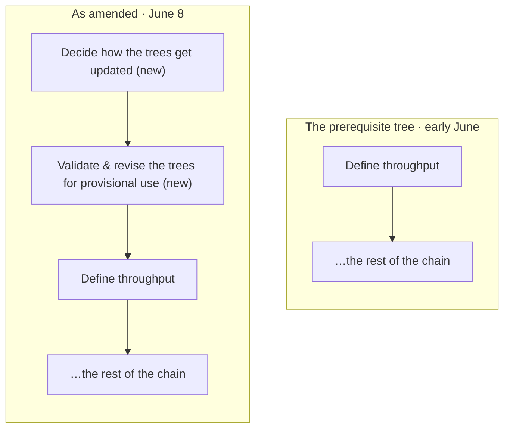
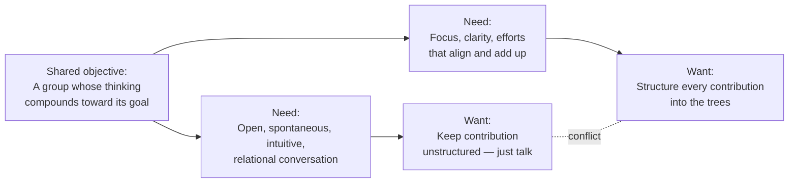

<!-- Draft: Markdown conversion of index.html, for comparison. Prose/headings as Markdown; diagrams and the interactive widget kept as embedded HTML/SVG/JS only where needed. Not wired to the design-system stylesheet — for evaluating feel only. -->

*Reconstructed from the 2R forum and research-circle messages, June 8 – July 12 · Quotes lightly condensed · [Methodology](#method)*

## Prologue — a goal with no gauge

Every movement eventually has to answer a simple question: how do we know whether we are making progress? For most movements, the honest answer is a feeling. The Second Renaissance — a movement for civilizational renewal gathered around the Life Itself collective — had spent years producing the other kind of answer: white papers, frameworks, a research circle that meets weekly. What it did not have was a way for anything to *count*.

Lofty goals have a particular failure mode: nothing can count against them. "Respond to the metacrisis" is a direction, not a destination. Held that way, every activity can be justified and none can be evaluated — which is how a movement stays busy for a decade without knowing whether it is winning.

So in early June, the group tried something unusual for its corner of the world: it translated its written corpus into the five trees of the Logical Thinking Process.

> [!note] The method, in one breath
> The **Logical Thinking Process** descends from Eliyahu Goldratt's theory of constraints: at any moment a system has one bottleneck that governs its output — its **throughput** — and the fastest way to improve the whole is to find that constraint and aim everything at it. The LTP maps a system as five linked cause-and-effect trees, so any claim can be located, challenged, and improved. The catch: the method only works on a system that can say what it produces.

**The five instruments of the Logical Thinking Process**, as adopted in early June:

| Tree | What it does |
|---|---|
| Goal tree | What success is, and what it requires. |
| Current reality | Why we don't have it yet. |
| Conflict cloud | The tensions that keep it stuck. |
| Future reality | How the world looks if it works. |
| Prerequisites | What to do, in what order. |

The point of the exercise is not the diagrams. It is that claims acquire *addresses*. A vague unease about strategy becomes an objection to a specific node — findable, arguable, fixable. And the method makes its first demand immediately: at the root of the new prerequisite tree sat one opening action. **Define throughput.** Name the thing the system exists to produce, so you can find what limits the producing of it.

The first definition went up without ceremony:

> **Throughput · v1** — first pass, early June
>
> "The rate at which real transformation is durably adopted by people, groups, or institutions."
>
> Reasonable. Uncontroversial. It survived two days.

## Act I · June 8 — "We're not a pin factory."

Robert — a longtime member whose background is in educational administration — read down the new dependency chain and stopped at the first node.

> **Exhibit A** · 2R forum · "Key dependency chain" thread · June 8
>
> **Robert:** "The very first point — *define throughput* — is likely going to have a lot of people all tied up in knots! We're not exactly Adam Smith's pin factory, after all. My take is, we're basically in the education business, with a special focus on R&D and training for cultural transformation. The throughput is raw information to workable ideas, along with a parallel throughput of people unfamiliar with any of it to advanced theorists and practitioners of all of it.
>
> "We're a school. Without the stupid stuff, like grades and tuition. If you buy what I'm selling, the rest of the chain is literally educational administration. There is no wheel to reinvent here — just wheels to put our collective shoulders to."

Note the shape of the objection. It is not a refusal; it is a *rival definition*. If 2R is a school, throughput is information becoming workable ideas, and newcomers becoming practitioners — a perfectly coherent alternative to "transformation durably adopted."

The group now had two reasonable definitions of what counts, and no procedure for choosing between them. The tree had listed "define throughput" as if it were a task. It was turning out to be a *decision* — and nobody had said whose.

## Act II · June 8, later that day — The tree that couldn't update itself

David — who had built the trees — began drafting a defense of his definition. Then he stopped, and posted something closer to a confession.

> **Exhibit B** · 2R forum · reply to Robert · June 8
>
> **David**, author of the trees: "If we were to start defining throughput and jumping into this set of tasks, we'd be implicitly affirming this tree's validity — and all of those that led up to it. But we don't really have a way of testing the trees' validity and updating them if we find flaws.
>
> "This was apparent from the very first meeting: Rufus offered revisions, and Margaret questioned some points. Now what? Since I'm the trees' creator, should I get to decide? Should Rufus? If these trees organize our R&D, they will be very consequential — one or two points of failure wouldn't be in line with what we profess to believe in.
>
> "Perhaps the very first point in the dependency chain should be: **decide how these trees get updated**."

Read that again, because the whole investigation turns on it: the author of the map had discovered he had no legitimate way to change his own map. That afternoon, the prerequisite tree was amended — with a promise attached to make no further updates unilaterally.

*Figure 2 · The amendment of June 8: two prerequisites spliced above the root of the chain.*

It is worth being precise about what the method just did. A strategy deck absorbs objections silently; whoever holds the pen wins. The tree failed *in public*, and the failure was legible — everyone could see exactly which link Robert's objection attacked, and exactly what got spliced in response. The trees' first real product was the discovery that they could not yet be legitimately updated.

> Rule one of a shared map: agree on how it gets redrawn.

## Act III · June 9 – July 2 — Progress on what?

The next day, the premise itself came under review. The current reality tree asserted a problem — *groups make real intellectual progress in conversation, but that progress is usually lost* — and Robert wasn't sure the problem existed.

> **Exhibit C** · 2R forum · June 9
>
> **Robert:** "I have a rather different take. The educational value gleaned from the group encounter *persists in the participants*, even if everyone goes separate ways and the group creates no artifacts. Most of the college classes I ever taught were like that. Following my students from as far back as twenty years, many have grown into very responsible positions — and they give that work some credit."

David's answer drew the distinction this whole story balances on.

> **Exhibit D** · 2R forum · June 9
>
> **David:** "The key question is: progress on *what*? Saying the progress is lost isn't saying that individuals don't develop — it's saying the conversation itself often doesn't.
>
> "Suppose a group has a passionate discussion and minds change — 'our group needs to be politically active' is adopted. Two weeks later, nothing has really changed: inertia, the cost of change. Months later, the same discussion gets taken up again, because it was important after all and the conditions that gave rise to it haven't changed.
>
> "That is what intellectual progress means for a group. It's about the **coherence of the group's shared vision**, not the individual members' development."

Individuals reliably grow from good conversation — Robert is right, and twenty years of his students prove it. What does not grow, mostly, is the conversation itself. The group adopts a conviction; inertia holds; months later the same discussion is had again, warmly, from the beginning. Individual learning compounds. Group knowing, without a shared artifact, does not.

Three weeks later the thread reached the research circle's chat, and the two halves of the question finally met.

> **Exhibit E** · Research-circle chat · June 30 – July 2
>
> **David** · June 30, 9:28 am: I've been reconsidering our definition of throughput. The current one is hard to monitor — and it feels removed from the real-life concerns of the people who'd actually like to contribute. Here's another we could try: *throughput is when hidden contribution becomes real — offered, witnessed, and beginning to help.*
>
> **Rufus**, founder · July 2, 9:17 am: Just to check: are we focused on *research-circle* throughput here? Or do you want the high-level definition hashed out before it comes to the circle?
>
> **David** · July 2, 10:21 am: Good question — I hadn't clearly separated the two in my own head. Suppose the trees are neglecting something — bioregionalism, say. Someone presents to the research group, or writes a paper, and the outcome is that *the trees are duly updated*, after some deliberation. That's throughput for the research group. The hidden-contribution definition is for 2R proper.
>
> **Rufus** · July 2, 11:27 am: Yes — improving the 2R LTP trees, perhaps in specific ways, would be *exactly* the kind of throughput for the research group.

> **Throughput · v2** — proposed June 30, for 2R proper
>
> "When hidden contribution becomes real — offered, witnessed, and beginning to help."

With that, the picture snapped into two scales, each with its own throughput. For the movement: hidden contribution becomes real. For the research circle: *the trees get better*. If the trees organize the work, then improving the trees is the work — which left an engineering question. How do you aim the collective intelligence of an entire group at a set of diagrams?

## Act IV — The empty dancefloor

Consider what touching the trees actually required that week. Read five diagrams. Learn a grammar — sufficiency, necessity, the etiquette of legitimate reservations. Locate your point among a hundred nodes. Then defend it to the people who wrote them. Every step is reasonable. The stack is fatal.

Rufus put a name to where this was heading: the empty dancefloor. Every organizer knows the scene — the venue is booked, the music is right, everyone came. And the floor stays empty, because the first dancer pays a cost no one after them pays. Three weeks in, that is exactly the shape of it: a structure everyone admires and no one touches, ringed by its own prerequisites — read five trees, learn the grammar, find your node, survive scrutiny — with the trees' author alone at the center.

David had already begun prototyping against it: a bridge to where people already are. People post tree-adjacent thoughts in public all the time — on Bluesky, in threads — with no idea that a structure exists which could receive them. The prototype watches for them, and answers with an invitation that arrives *pre-placed*:

<figure>

**Start here** · the bridge · prototype

`@wanderer.bsky.social` · matched on `#metacrisis` `#bioregionalism`

> Feels like all our metacrisis talk floats free of any actual place. What would it mean to root this work in a watershed?

**Where this lands**
- **Supports · future reality tree** — "Transformative practice is rooted in real, local contexts"
- **Challenges · current reality tree** — "Our maps of the crisis underweight place"

`[ Place it ]`  `[ Not mine ]`

<figcaption>Figure 4 · The "start here" composer, reconstructed from the prototype: a public post arrives with its place in the trees already suggested.</figcaption>
</figure>

David's own assessment was blunt: the trees aren't developed enough, and the matching isn't good enough, for the suggestions to feel synergistic yet. But notice the direction invert. Stop summoning people to the structure. Carry the structure to the people.

## Act V — The cloud underneath

Why was the floor empty in the first place? Beneath the overhead sits an older conflict — one every community that tries to give itself structure eventually meets. Some members love the trees: the focus, the clarity, the feeling of efforts finally adding up. Others are warier. What they love is the conversation itself — spontaneous, intuitive, relational — and they are rightly suspicious of anything that interrupts flow in order to file it.

The method has a ritual for exactly this moment: draw the conflict until the assumption holding it together becomes visible.

*Figure 5 · The conflict cloud, redrawn from David's working diagram. Both wants serve real needs; both needs serve one objective. The clash between the two wants survives on one assumption: that structure must be added by the contributor, at the moment of contribution.*

Interrupt the dance to update the map, or keep dancing and let the map rot — that is the choice only if structuring must be done *by the contributor, at the moment of contribution*. Break that assumption, and the cloud evaporates.

## Act VI — Separate the acts

The injection — the new condition that dissolves the conflict — is an onramp. Let conversation remain conversation. The bridge listens and proposes: *this sentence supports that node; this one challenges another*. A small, rotating circle deliberates the merges — the June 8 lesson, encoded: no single points of failure. And the contributor's cost of entry falls to one sentence.

| | The conversation | The bridge | The trees |
|---|---|---|---|
| | Exactly as it already happens — spontaneous, associative, alive. Nothing interrupts it. | Listens afterward, and proposes a place: "this supports X; this challenges Y." | A small circle merges; the map moves; the contributor watches it move. |

*Figure 6 · The onramp: contribution and structuring become different acts, done by different hands, at different times.*

> The conversation stays a conversation. The structure catches up.

It respects the dancers — nobody is handed a syllabus at the door. And it respects the map — nothing enters it without deliberate scrutiny. It is not a compromise between the two camps. It refuses the premise that they were opposed.

## Act VII — The prerequisites, again

Then the group did the most characteristic thing in this whole story: it fed its shiny new solution back into the machine that had been so unkind to its last one. What must be true for the onramp to exist? The obstacles went up — and against each one, an intermediate objective.

**Injection — an onramp that honors both the dance and the map**

| Obstacle | Intermediate objective |
|---|---|
| One person can quietly decide what the map says | **1 · An update protocol** — Proposals, objections heard, a rotating merge circle — no single points of failure. |
| Five diagrams read like a syllabus | **2 · Legible views** — Each tree readable in one screen, at every scale of zoom. |
| Weak suggestions repel the people they invite | **3 · Matching that surprises** — "You belong here" has to be true when the bridge says it. |
| Invisible contribution doesn't repeat | **4 · Witnessing** — Contributors see their sentence change the tree — offered, witnessed, helping. |

*Figure 7 · The onramp's own prerequisite tree: each obstacle answered by an intermediate objective.*

And this morning — July 12 — the latest link in the chain went up, and it changes the scale of everything above it. The trees, David realized, have *levels*. A person could run them on a life. A group runs them on a mission. And 2R's trees, which had quietly been treated as the top of the pyramid, are just one group's trees.

| Scale | | |
|---|---|---|
| **Individual** — a life | | One person's goal, current reality, next step — the same five instruments, scaled to a life. |
| **Group** — a mission | 2R · another circle · a bioregional collective | Aligned visions, different trees — 2R's are *one group's trees*, not the canon. |
| **Everyone** — emergent | | Group trees graft into an everyone-tree that is **arrived at, not decreed** — the product of a defined process, not a committee. |

*Figure 8 · Three scales of tree — and the grafting process between them, sketched the morning of July 12.*

That demotion is the exciting part. Another circle with an aligned but different vision keeps its own trees. Between groups, grafting becomes possible — shared branches, translated nodes, merged sub-goals. And the "everyone" tree — the one no committee could be trusted to write — stops being something to decree and becomes something to *arrive at*.

A month ago the question was *what is our throughput?* It has become: *by what process does any group of people keep a shared map of their thinking true?* That is a better constraint — the kind you can build against.

> The trees were never the product. The tree-building is.

---

## Methodology {#method}

Reconstructed from the 2R forum (June 8–9) and research-circle messages (June 30 – July 2), with the events of July 12 reported by a participant. Quotes lightly condensed for length; emphasis added. Diagrams are redrawn; the conflict cloud and the composer are reconstructions of working documents. This page is itself a first draft of a node — object to it, and watch what happens.

[Watch the other cut: Cut B, which opens on the dancefloor →](cut-b.html)
